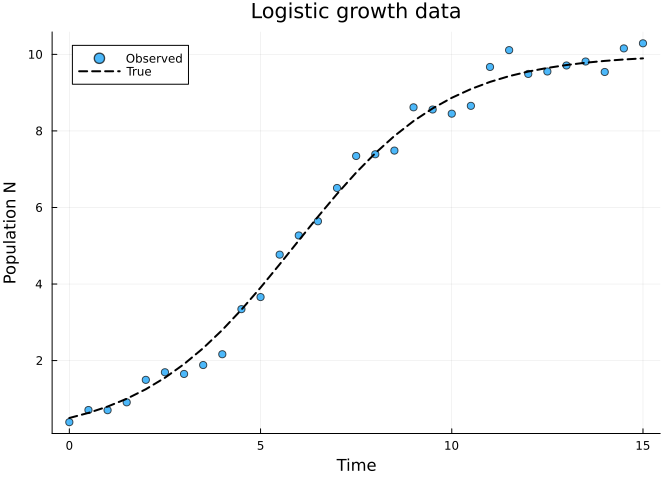
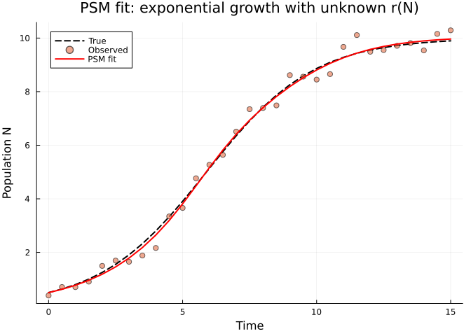
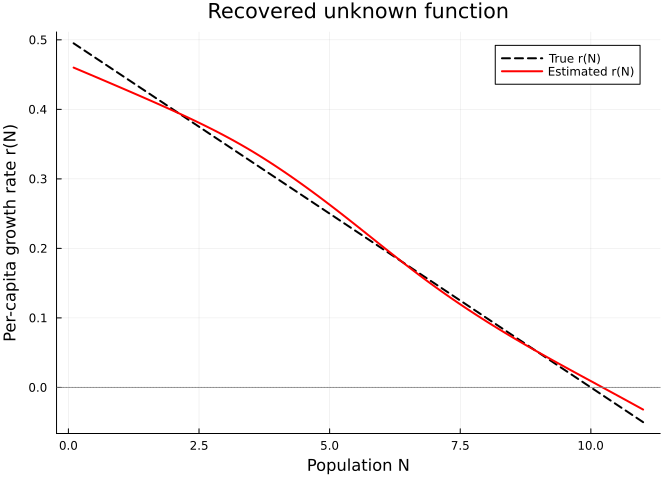
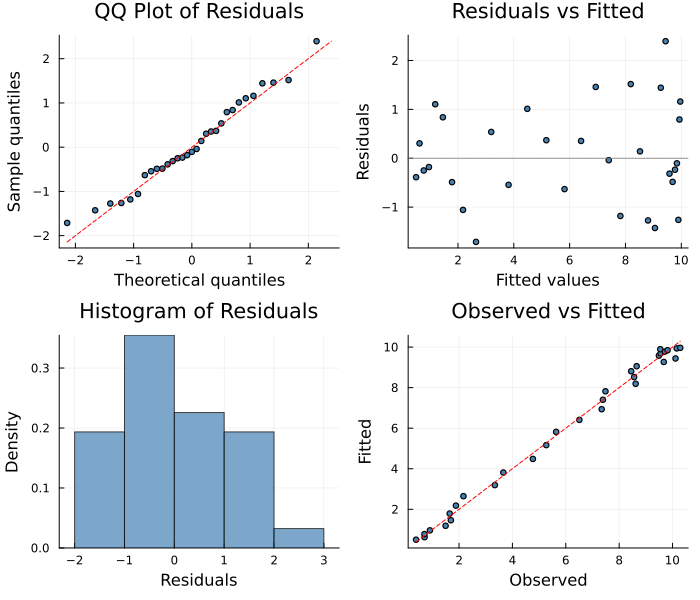

# Getting Started with PartiallySpecifiedModels.jl
Simon Frost
2026-04-02

- [Overview](#overview)
- [Vignette Guide](#vignette-guide)
- [Setup](#setup)
- [A Simple Example: Exponential
  Growth](#a-simple-example-exponential-growth)
  - [Generate synthetic data](#generate-synthetic-data)
  - [Define the PSM](#define-the-psm)
  - [Choose an approximator](#choose-an-approximator)
  - [Build the problem](#build-the-problem)
  - [Solve with LAML](#solve-with-laml)
  - [Inspect the solution](#inspect-the-solution)
  - [Recover the unknown function](#recover-the-unknown-function)
- [Key Concepts](#key-concepts)
  - [The `PSMProblem`](#the-psmproblem)
  - [Smoothing and EDF](#smoothing-and-edf)
- [Diagnostic Plots](#diagnostic-plots)
- [Summary](#summary)

## Overview

**Partially specified models (PSMs)** are dynamical systems where one or
more functional responses are left unspecified and estimated from data
using flexible approximators such as penalized B-splines. This approach
is particularly useful in ecology, where the form of density-dependent
processes is often unknown.

This vignette introduces the basic workflow of
`PartiallySpecifiedModels.jl`:

1.  Define an ODE model with unknown functions
2.  Choose approximators for the unknowns (B-splines)
3.  Build a `PSMProblem` with data
4.  Solve with `LAML()` (Laplace Approximate Marginal Likelihood)
5.  Inspect the fitted solution

We start with the simplest possible example: exponential growth with an
unknown per-capita growth rate.

## Vignette Guide

This package includes 29 vignettes organized by topic:

| Topic | Vignettes |
|----|----|
| **Getting started** | 01 (this), 02 (likelihoods) |
| **Ecological models** | 03 (Lotka-Volterra), 04 (copepod), 08 (consumer-resource), 10 (chemostat), 27 (blowfly DDE), 28 (fisheries) |
| **Approximator types** | 05 (B-spline, GP, neural), 26 (SPDE) |
| **Solver comparison** | 06 (all solvers), 09 (gradient matching) |
| **Shape constraints** | 13 (B-spline constraints), 16 (COMONet) |
| **Bayesian inference** | 14 (MCMC), 15 (MAGI), 19 (pseudo-marginal), 24 (variational), 25 (ABC) |
| **Uncertainty** | 07 (probabilistic ODE), 29 (bootstrap CIs) |
| **Count data** | 02 (likelihoods), 11 (epidemiological), 28 (fisheries) |
| **Discrete time** | 12 (Ricker, Beverton-Holt), 28 (fisheries) |
| **Delay equations** | 20 (DDE basics), 27 (blowfly) |
| **Diagnostics** | All vignettes include `appraise()` diagnostic plots |

## Setup

``` julia
using PartiallySpecifiedModels
using PartiallySpecifiedModels: solve
using OrdinaryDiffEq
using Plots
using Random
Random.seed!(42)
```

    Precompiling packages...
        PartiallySpecifiedModels Being precompiled by another process (pid: 36853, pidfile: /Users/username/.julia/compiled/v1.12/PartiallySpecifiedModels/tWtwA_lLwID.ji.pidfile)
      21655.7 ms  ✓ PartiallySpecifiedModels
      1 dependency successfully precompiled in 50 seconds. 387 already precompiled.

    TaskLocalRNG()

## A Simple Example: Exponential Growth

Consider a population $N(t)$ growing according to

$$\frac{dN}{dt} = r(N) \cdot N$$

where $r(N)$ is the per-capita growth rate as a function of population
size. In standard exponential growth, $r$ is constant. In logistic
growth, $r(N) = r_0(1 - N/K)$. In a PSM, we leave $r(N)$ unspecified and
estimate it from data.

### Generate synthetic data

We generate data from a logistic model with $r_0 = 0.5$ and $K = 10$,
observed with Gaussian noise:

``` julia
# True logistic growth
r0, K, N0 = 0.5, 10.0, 0.5
tspan = (0.0, 15.0)
data_times = collect(0.0:0.5:15.0)

# Solve the true model
function logistic!(du, u, p, t)
    du[1] = r0 * (1 - u[1] / K) * u[1]
end
true_prob = ODEProblem(logistic!, [N0], tspan)
true_sol = OrdinaryDiffEq.solve(true_prob, Tsit5(); saveat=data_times)
true_N = [true_sol(t)[1] for t in data_times]

# Add noise
σ_noise = 0.3
observed_N = true_N .+ σ_noise .* randn(length(data_times))
observed_N = max.(observed_N, 0.01)  # ensure positive

scatter(data_times, observed_N, label="Observed", xlabel="Time", ylabel="Population N",
        title="Logistic growth data", ms=4, alpha=0.7)
plot!(data_times, true_N, label="True", lw=2, color=:black, ls=:dash)
```



### Define the PSM

The ODE function receives a parameter struct `p` containing callable
unknown functions and any known parameters. Here, `p.r` is the unknown
growth rate function:

``` julia
function growth!(du, u, p, t)
    N = u[1]
    du[1] = p.r(N) * N
end
```

    growth! (generic function with 1 method)

### Choose an approximator

We model $r(N)$ with a **penalized cubic B-spline** having 8
evenly-spaced knots over the range of population sizes. The `initial`
keyword sets the starting values for the knot coefficients:

``` julia
approx_r = BSplineApproximator(:r, (0.0, 12.0), 8;
                                initial = x -> 0.3)
```

    BSplineApproximator(:r, (0.0, 12.0), 8, var"#5#6"())

This creates a spline approximator with:

- **Name**: `:r` — how it appears in the parameter struct
- **Domain**: $[0, 12]$ — the range of $N$ values
- **8 knots** — degrees of freedom for the shape of $r(N)$
- **Initial value**: constant $r = 0.3$ everywhere

### Build the problem

``` julia
prob = PSMProblem(
    growth!,                        # ODE dynamics
    [N0],                           # initial conditions
    tspan,                          # time span
    [approx_r];                     # unknown function approximators
    data_times = data_times,
    data_values = reshape(observed_N, :, 1),  # n_times × 1 matrix
    obs_to_state = [1],             # observe state variable 1
    likelihood = Gaussian(),        # Gaussian errors
    solver = Tsit5()                # ODE solver
)
```

    PSMProblem{typeof(growth!), Vector{Float64}, Gaussian, Tsit5{typeof(OrdinaryDiffEqCore.trivial_limiter!), typeof(OrdinaryDiffEqCore.trivial_limiter!), Static.False}}(growth!, [0.5], (0.0, 15.0), BSplineApproximator[BSplineApproximator(:r, (0.0, 12.0), 8, var"#5#6"())], [0.0, 0.5, 1.0, 1.5, 2.0, 2.5, 3.0, 3.5, 4.0, 4.5  …  10.5, 11.0, 11.5, 12.0, 12.5, 13.0, 13.5, 14.0, 14.5, 15.0], [0.3909927555644667; 0.7085441461067901; … ; 10.156370498935743; 10.28914446913904;;], [1.0; 1.0; … ; 1.0; 1.0;;], [1], NamedTuple(), Gaussian(), Tsit5{typeof(OrdinaryDiffEqCore.trivial_limiter!), typeof(OrdinaryDiffEqCore.trivial_limiter!), Static.False}(OrdinaryDiffEqCore.trivial_limiter!, OrdinaryDiffEqCore.trivial_limiter!, static(false)), Dict{Symbol, Any}(), false, Float64[], nothing)

### Solve with LAML

The `LAML()` algorithm estimates the spline coefficients and the
smoothing parameter $\lambda$ simultaneously. For Gaussian data, LAML is
equivalent to **Restricted Maximum Likelihood (REML)**.

    Data loss (SS): 2.38
    EDF:            4.95
    Smoothing λ:    [0.01933]

### Inspect the solution

The solution contains fitted values, estimated unknown functions, and
diagnostics:

``` julia
# Plot fitted trajectory
plot(data_times, true_N, label="True", lw=2, color=:black, ls=:dash,
     xlabel="Time", ylabel="Population N",
     title="PSM fit: exponential growth with unknown r(N)")
scatter!(data_times, observed_N, label="Observed", ms=4, alpha=0.6)
plot!(data_times, sol.fitted_values[:, 1], label="PSM fit", lw=2, color=:red)
```



### Recover the unknown function

The fitted $r(N)$ should resemble the true logistic form
$r(N) = r_0(1 - N/K)$:

``` julia
r_fitted = sol.unknown_functions[:r]
N_grid = range(0.1, 11.0, length=100)
r_true = [r0 * (1 - N / K) for N in N_grid]
r_est = [r_fitted(N) for N in N_grid]

plot(N_grid, r_true, label="True r(N)", lw=2, color=:black, ls=:dash,
     xlabel="Population N", ylabel="Per-capita growth rate r(N)",
     title="Recovered unknown function")
plot!(N_grid, r_est, label="Estimated r(N)", lw=2, color=:red)
hline!([0.0], color=:gray, ls=:dot, label=nothing)
```



The PSM recovers the approximately linear decline in $r(N)$ without
assuming any parametric form. The smoothing parameter $\lambda$
(estimated via LAML/REML) controls the trade-off between data fit and
wiggliness.

## Key Concepts

### The `PSMProblem`

A `PSMProblem` combines:

| Component       | Description                                             |
|-----------------|---------------------------------------------------------|
| `dynamics!`     | ODE right-hand side `f!(du, u, p, t)`                   |
| `u0`            | Initial conditions (vector or function of `p`)          |
| `tspan`         | Time interval `(t₀, t₁)`                                |
| `approximators` | Vector of `AbstractApproximator` (splines, neural nets) |
| `data_times`    | Observation times                                       |
| `data_values`   | Data matrix (n_times × n_obs)                           |
| `likelihood`    | Error distribution (`Gaussian()`, `Poisson()`, etc.)    |
| `solver`        | ODE solver from OrdinaryDiffEq.jl                       |

You can also construct a `PSMProblem` directly from a SciML problem
type:

``` julia
# Continuous-time (ODEProblem)
ode = ODEProblem(dynamics!, u0, tspan)
prob = PSMProblem(ode, approximators; data_times=..., data_values=...)

# Discrete-time (DiscreteProblem)
disc = DiscreteProblem(map!, u0, tspan)
prob = PSMProblem(disc, approximators; data_times=..., data_values=...)
```

This automatically sets the solver and time-stepping mode based on the
problem type.

### Smoothing and EDF

The **effective degrees of freedom (EDF)** measures model complexity.
With 8 knots, the maximum EDF is 8 (unpenalized). LAML estimates
$\lambda$ to balance fit and smoothness:

- **Small $\lambda$**: less smoothing, higher EDF, more flexible
- **Large $\lambda$**: more smoothing, lower EDF, smoother curves

For our example, the EDF should be close to 2 (since the true $r(N)$ is
linear).

## Diagnostic Plots

A standard 4-panel diagnostic display assesses residual behaviour. The
QQ plot checks normality of standardized residuals, “Residuals vs
Fitted” detects systematic patterns (a good fit shows random scatter
around zero), the histogram visualises the residual distribution, and
“Observed vs Fitted” checks overall calibration (points should lie near
the diagonal).

``` julia
using PartiallySpecifiedModels: appraise

diag = appraise(sol)

p_qq = scatter(diag.qq_theoretical, diag.qq_sample,
    xlabel="Theoretical quantiles", ylabel="Sample quantiles",
    title="QQ Plot of Residuals", ms=3, legend=false, color=:steelblue)
mn, mx = extrema(vcat(diag.qq_theoretical, diag.qq_sample))
plot!(p_qq, [mn, mx], [mn, mx], color=:red, ls=:dash, label="")

p_rf = scatter(diag.fitted, diag.residuals,
    xlabel="Fitted values", ylabel="Residuals",
    title="Residuals vs Fitted", ms=3, legend=false, color=:steelblue)
hline!(p_rf, [0], color=:gray, ls=:dot)

p_hist = histogram(diag.residuals, normalize=:pdf,
    xlabel="Residuals", ylabel="Density",
    title="Histogram of Residuals", legend=false, color=:steelblue, alpha=0.7)

p_of = scatter(diag.observed, diag.fitted,
    xlabel="Observed", ylabel="Fitted",
    title="Observed vs Fitted", ms=3, legend=false, color=:steelblue)
mn2, mx2 = extrema(vcat(diag.observed, diag.fitted))
plot!(p_of, [mn2, mx2], [mn2, mx2], color=:red, ls=:dash, label="")

plot(p_qq, p_rf, p_hist, p_of, layout=(2, 2), size=(700, 600))
```



    Durbin-Watson: 1.804

## Summary

The basic workflow is:

1.  Write `dynamics!(du, u, p, t)` — access unknown functions via
    `p.name(x)`
2.  Create `BSplineApproximator(:name, domain, nknots)` for each unknown
3.  Build
    `PSMProblem(dynamics!, u0, tspan, approximators; data=..., likelihood=...)`
4.  Call `solve(prob, LAML())`
5.  Access `sol.unknown_functions[:name]` for the fitted functions
