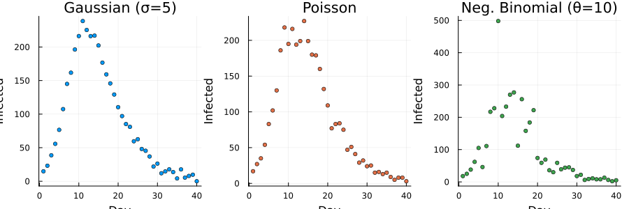
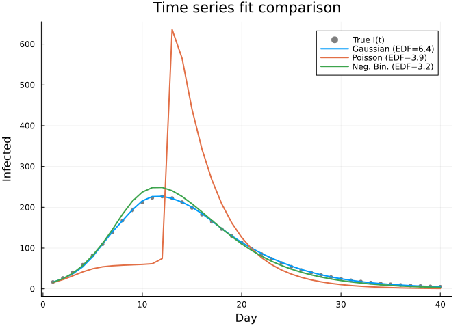
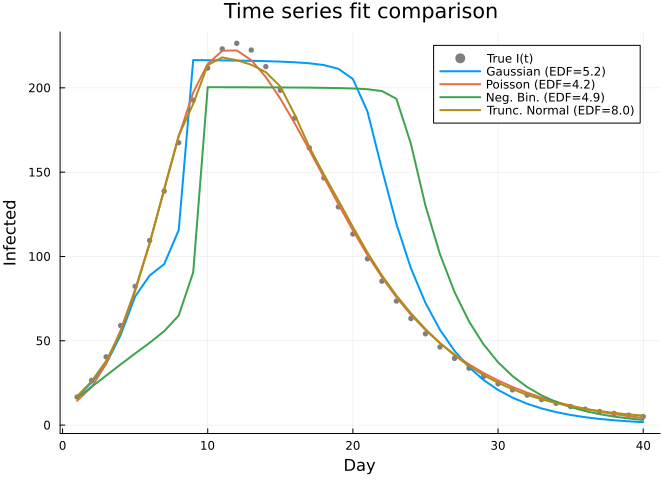

# Likelihood Families
Simon Frost
2026-03-25

- [Overview](#overview)
- [Setup](#setup)
- [Synthetic SIR Data](#synthetic-sir-data)
  - [Generate three observation
    types](#generate-three-observation-types)
- [The PSM Model](#the-psm-model)
- [Fitting with Gaussian Likelihood](#fitting-with-gaussian-likelihood)
- [Fitting with Poisson Likelihood](#fitting-with-poisson-likelihood)
- [Fitting with Negative Binomial
  Likelihood](#fitting-with-negative-binomial-likelihood)
- [Fitting with Truncated Normal
  Likelihood](#fitting-with-truncated-normal-likelihood)
- [Custom Likelihoods](#custom-likelihoods)
- [Comparing Recovered $\lambda(I)$](#comparing-recovered-lambdai)
- [Comparing Time Series Fits](#comparing-time-series-fits)
- [Summary](#summary)

## Overview

Real-world ecological data are rarely Gaussian. Count data (e.g.,
population surveys) are better modeled with **Poisson** or **Negative
Binomial** likelihoods, which properly account for the discrete,
non-negative nature of the observations.

`PartiallySpecifiedModels.jl` supports five likelihood families:

| Family | Typical use | Variance function |
|----|----|----|
| `Gaussian()` | Continuous measurements | $\sigma^2$ (profiled) |
| `Poisson()` | Count data, no overdispersion | $\mu$ |
| `NegativeBinomial(θ)` | Overdispersed count data | $\mu + \mu^2/\theta$ |
| `TruncatedNormal(sigma=σ)` | Non-negative continuous data | $\sigma^2(1 - \delta(\mu))$ |
| `CustomLikelihood(f)` | Any distribution | Via ForwardDiff |

This vignette demonstrates each family on an SIR epidemic model with a
nonlinear force of infection, following the partially specified model
example from [Frost
(2022)](https://github.com/epirecipes/sir-julia/blob/master/markdown/psm/psm.md).

## Setup

``` julia
using PartiallySpecifiedModels
using PartiallySpecifiedModels: solve
using OrdinaryDiffEq
using Plots
using Random
Random.seed!(11)
```

    TaskLocalRNG()

## Synthetic SIR Data

Following [McCallum et
al. (2001)](https://doi.org/10.1016/s0169-5347(01)02144-9), we consider
a power-law force of infection $\lambda(I) = \beta I^\alpha$ where
$0 < \alpha < 1$ produces sublinear (saturating) transmission. The true
parameters are $\beta = 0.5$, $\gamma = 0.25$, $\alpha = 0.9$.

``` julia
N = 1000.0
β_true = 0.5; γ = 0.25; α = 0.9
foi_true(I) = β_true * I^α

function sir_true!(du, u, p, t)
    S, I, R = u
    λ = foi_true(I / N)
    du[1] = -λ * S
    du[2] =  λ * S - γ * I
    du[3] =  γ * I
end

u0 = [990.0, 10.0, 0.0]
tspan = (0.0, 40.0)
data_times = collect(1.0:1.0:40.0)

prob_true = ODEProblem(sir_true!, u0, tspan)
sol_true = OrdinaryDiffEq.solve(prob_true, Tsit5(); saveat=data_times)
I_true = [sol_true(t)[2] for t in data_times]
```

    40-element Vector{Float64}:
      16.669527851232353
      26.553862280324694
      40.47437576014847
      59.02810528571919
      82.28130198842759
     109.45238706403795
     138.74130173692484
     167.48655903253388
     192.6935563523616
     211.7590450306315
       ⋮
      17.804073419006215
      15.174346282151912
      12.937049849823216
      11.035947855015564
       9.421188555741582
       8.049056449786535
       6.882160505788482
       5.889869188743626
       5.045729281909004

### Generate three observation types

We observe the number of infected individuals $I(t)$ under three noise
models:

``` julia
# 1. Gaussian: I(t) + normal noise (continuous, could be negative)
y_gauss = I_true .+ 5.0 .* randn(length(data_times))
y_gauss = max.(y_gauss, 0.01)

# 2. Poisson: I(t) as integer counts
function sample_poisson(μ)
    μ = max(μ, 0.01)
    count = 0; s = 0.0
    while true; s -= log(rand()); s > μ && break; count += 1; end
    Float64(count)
end
y_poisson = sample_poisson.(I_true)

# 3. Negative Binomial: overdispersed counts (Gamma-Poisson mixture)
θ_nb = 10.0
function sample_negbin(μ, θ)
    μ = max(μ, 0.01)
    g = 0.0
    for _ in 1:round(Int, θ); g -= log(rand()); end
    g = g / θ * μ
    sample_poisson(g)
end
y_negbin = [sample_negbin(I, θ_nb) for I in I_true]

plot(
    scatter(data_times, y_gauss, ms=3, title="Gaussian (σ=5)",
            ylabel="Infected", label=nothing, color=1),
    scatter(data_times, y_poisson, ms=3, title="Poisson",
            ylabel="Infected", label=nothing, color=2),
    scatter(data_times, y_negbin, ms=3, title="Neg. Binomial (θ=10)",
            ylabel="Infected", label=nothing, color=3),
    layout=(1,3), size=(900,300), xlabel="Day"
)
```



## The PSM Model

We model the SIR dynamics with an **unknown force of infection**
$\lambda(I)$ as a function of the infected proportion $I/N$. This
follows Wood (2001): the model structure (SIR) is known, but the
functional form of transmission is left unspecified and estimated from
data.

``` julia
function sir_psm!(du, u, p, t)
    S, I, R = u
    λ = max(p.λ(I / p.N), 0.0)
    du[1] = -λ * S
    du[2] =  λ * S - p.γ * I
    du[3] =  p.γ * I
end
```

    sir_psm! (generic function with 1 method)

The B-spline domain covers the range of $I/N$ observed in the data. We
use a helper to create fresh approximators with a given knot count:

    FOI domain: I/N ∈ (0.0, 0.27)

    make_approx (generic function with 1 method)

## Fitting with Gaussian Likelihood

For continuous measurements, `Gaussian()` profiles out the scale
parameter $\sigma^2$ in the REML objective:

$$V_{\text{REML}}(\boldsymbol{\lambda}) = -\frac{n - M_p}{2}\log\hat\sigma^2 + \frac{1}{2}\log|S^\lambda|_+ - \frac{1}{2}\log|H|$$

    Gaussian — SS: 882.9, EDF: 6.43, λ: [38.1]

## Fitting with Poisson Likelihood

For count data, `Poisson()` uses the variance function $V(\mu) = \mu$.
The IRLS working weights on the identity scale are
$\tilde{w}_i = w_i / \mu_i$, giving more weight to observations where
the mean is small (lower variance). The LAML objective uses the full
Poisson log-likelihood rather than a profiled scale:

$$V(\boldsymbol{\rho}) = \ell(\hat\beta) - \tfrac{1}{2}\hat\beta' S^\lambda \hat\beta + \tfrac{1}{2}\log|S^\lambda|_+ - \tfrac{1}{2}\log|H| + \tfrac{M_p}{2}\log 2\pi$$

For count data, the LAML solver uses Pearson-scaled Fellner-Schall
updates and a Gaussian warm-start phase to ensure reliable convergence
with identity-link IRLS weights.

    Poisson — Loss: 207600.0, EDF: 4.13, λ: [3.66e-5]

## Fitting with Negative Binomial Likelihood

`NegativeBinomial(θ)` adds an overdispersion parameter $\theta$
controlling the variance: $\text{Var}(Y) = \mu + \mu^2/\theta$. Smaller
$\theta$ means more overdispersion.

    NegBin — Loss: 163900.0, EDF: 7.83, λ: [3.66e-5]

## Fitting with Truncated Normal Likelihood

For non-negative continuous measurements (e.g., population densities,
concentrations), `TruncatedNormal(sigma=σ)` models data as drawn from a
Normal($\mu$, $\sigma^2$) truncated below at 0. Unlike Gaussian, the
truncation ensures the likelihood properly handles observations near
zero without assigning probability to negative values.

The log-likelihood for a single observation is:

$$\ell(y_i \mid \mu_i, \sigma) = -\frac{(y_i - \mu_i)^2}{2\sigma^2} - \log\sigma - \frac{1}{2}\log 2\pi - \log\Phi\!\left(\frac{\mu_i}{\sigma}\right)$$

where $\Phi$ is the standard normal CDF. The IRLS weights use the Fisher
information, which accounts for the truncation adjustment.

    TruncNormal — Loss: 926.7, EDF: 3.63, λ: [349.0]

## Custom Likelihoods

For distributions not built in, `CustomLikelihood` accepts a scalar
log-likelihood function $\ell(y, \mu)$. IRLS working weights are derived
automatically via **ForwardDiff**:

$$\tilde{w}_i = w_i \cdot \left(-\frac{\partial^2 \ell}{\partial \mu^2}\bigg|_{\mu=\hat\mu_i}\right)$$

Here we demonstrate with a **Laplace (double-exponential) likelihood**,
which is more robust to outliers than the Gaussian. We create data with
a few outlier observations:

    Laplace — Loss: 9562.0, EDF: 2.71

> [!NOTE]
>
> The built-in `Gaussian()` profiles out the scale parameter $\sigma^2$
> in the REML objective, making it scale-free. Custom likelihoods use
> the raw log-likelihood without scale profiling, so you need to choose
> the scale parameter (here $b=10$) appropriately for your data.

## Comparing Recovered $\lambda(I)$

The key output of a PSM is the recovered unknown function. Here we
compare the estimated force of infection $\hat\lambda(I/N)$ across all
five likelihood families against the true power-law
$\lambda(I) = 0.5 \cdot I^{0.9}$:

``` julia
I_grid = range(foi_domain[1], foi_domain[2], length=200)
λ_truth = [β_true * I^α for I in I_grid]

p1 = plot(I_grid, λ_truth, label="True λ(I) = 0.5·I⁰·⁹", lw=2.5,
     color=:black, ls=:dash,
     xlabel="Infected proportion (I/N)", ylabel="λ(I/N)",
     title="Recovered force of infection")

for (sol, name, col) in [
    (sol_gauss,   "Gaussian",    1),
    (sol_poisson, "Poisson",     2),
    (sol_nb,      "Neg. Binomial", 3),
    (sol_trnorm,  "Trunc. Normal", 5),
    (sol_laplace, "Laplace (custom)", 4)]
    if haskey(sol.unknown_functions, :λ)
        λ_est = [sol.unknown_functions[:λ](I) for I in I_grid]
        plot!(p1, I_grid, λ_est, label=name, lw=2, color=col)
    end
end

# Mark the range of I/N actually observed in data
Imin_obs = minimum(I_true) / N
Imax_obs = maximum(I_true) / N
vspan!([Imin_obs, Imax_obs], color=:grey, alpha=0.1, label="Observed range")

p1
```



## Comparing Time Series Fits

``` julia
p2 = scatter(data_times, I_true, ms=3, color=:black, alpha=0.5,
     label="True I(t)", xlabel="Day", ylabel="Infected",
     title="Time series fit comparison")

for (sol, name, col) in [
    (sol_gauss,   "Gaussian", 1),
    (sol_poisson, "Poisson",  2),
    (sol_nb,      "Neg. Bin.", 3),
    (sol_trnorm,  "Trunc. Normal", 5)]
    pred = sol.fitted_values[:, 1]
    plot!(p2, data_times, pred, label="$(name) (EDF=$(round(sol.edf, digits=1)))",
          lw=2, color=col)
end

p2
```



## Summary

| Likelihood | When to use | LAML behaviour |
|----|----|----|
| `Gaussian()` | Continuous, symmetric errors | Profiled REML ($\sigma^2$ estimated) |
| `Poisson()` | Counts, variance ≈ mean | Full marginal likelihood, IRLS weights $w/\mu$ |
| `NegativeBinomial(θ)` | Overdispersed counts | Full ML, IRLS weights $w/(\mu + \mu^2/\theta)$ |
| `TruncatedNormal(sigma=σ)` | Non-negative continuous | Full ML, Fisher-information weights |
| `CustomLikelihood(f)` | Any distribution | Autodiff for IRLS weights |

For Gaussian data, LAML is exactly equivalent to REML. For non-Gaussian
data, the solver uses a Gaussian warm-start phase followed by Fisher
scoring with identity-link working weights
$\tilde{w}_i = w_i / V(\mu_i)$ at each P-IRLS iteration, following Wood,
Pya & Säfken (2016). Smoothing parameters are estimated via
Fellner-Schall updates with Pearson dispersion scaling. The LAML
objective uses the actual log-likelihood (Poisson, NegBin,
TruncatedNormal, etc.) rather than a profiled scale parameter.
