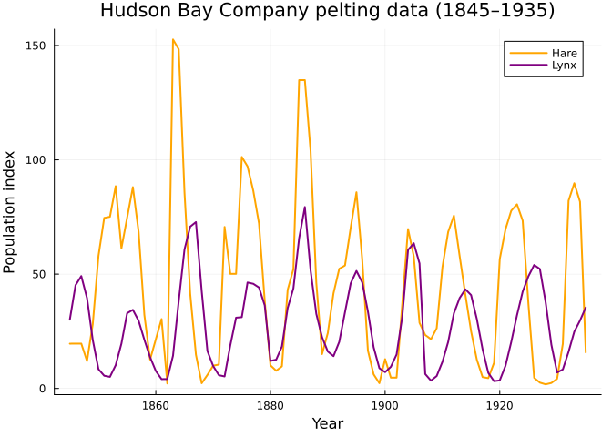
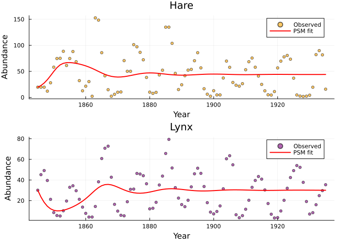
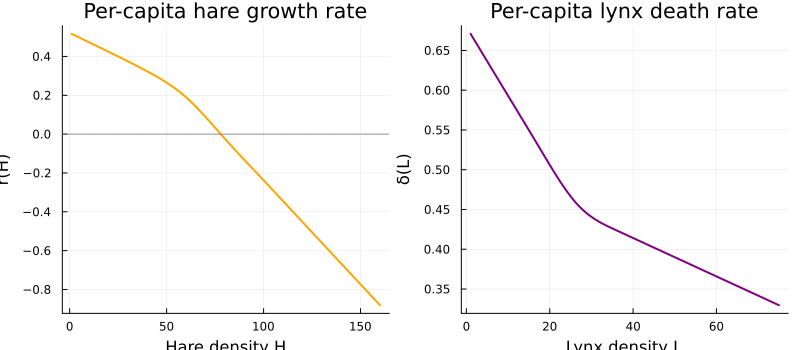
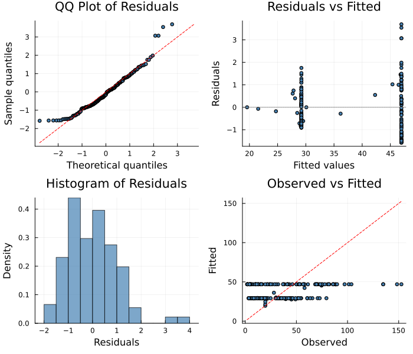
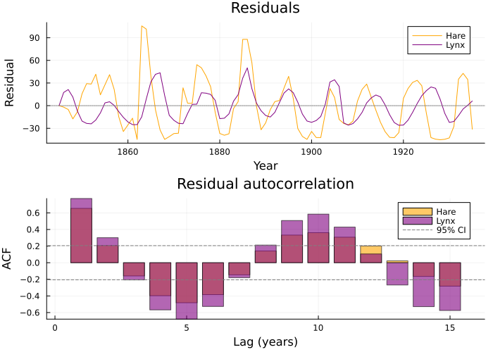
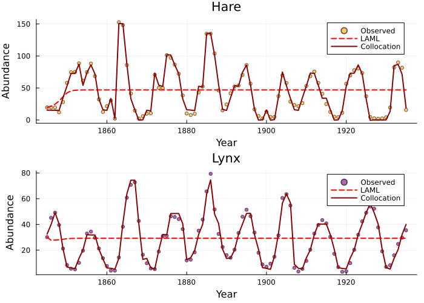
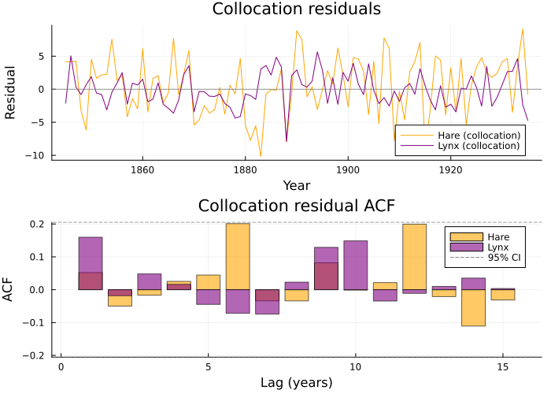
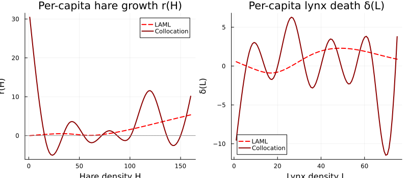

# Lotka–Volterra Predator–Prey with Real Data
Simon Frost
2026-06-12

- [Overview](#overview)
- [Setup](#setup)
- [The Hare–Lynx Data](#the-harelynx-data)
- [The Model](#the-model)
- [Defining the Approximators](#defining-the-approximators)
- [Building the Problem](#building-the-problem)
- [Fitting](#fitting)
- [Results](#results)
  - [Fitted Trajectories](#fitted-trajectories)
  - [Estimated Unknown Functions](#estimated-unknown-functions)
- [Interpreting the Smoothing](#interpreting-the-smoothing)
- [Residual Diagnostics](#residual-diagnostics)
- [Effect of $\sigma^2$ Cap](#effect-of-sigma2-cap)
- [Collocation-Based Estimation](#collocation-based-estimation)
  - [Comparison: LAML vs
    CollocationLAML](#comparison-laml-vs-collocationlaml)
  - [Residual Diagnostics
    (Collocation)](#residual-diagnostics-collocation)
  - [Estimated Unknown Functions
    (Comparison)](#estimated-unknown-functions-comparison)
- [Discussion](#discussion)
  - [IRLS+PCLS (LAML)](#irlspcls-laml)
  - [Collocation (CollocationLAML)](#collocation-collocationlaml)
- [Summary](#summary)

## Overview

This vignette fits a **partially specified Lotka–Volterra model** to the
classic Hudson Bay Company hare–lynx pelting data (1845–1935). The
unknown functions are the per-capita growth rate of hares and the
per-capita death rate of lynx, both of which may depend on population
density in unknown ways.

This is a multivariate problem: we observe two species simultaneously,
and the model has two unknown functions, each approximated with a
penalized B-spline.

## Setup

``` julia
using PartiallySpecifiedModels
using PartiallySpecifiedModels: solve
using OrdinaryDiffEq
using DelimitedFiles
using Plots
```

## The Hare–Lynx Data

The dataset records annual pelting records of snowshoe hares and
Canadian lynx from the Hudson Bay Company, 1845–1935. These data are a
textbook example of predator–prey oscillations.

``` julia
data_path = joinpath(@__DIR__, "..", "..", "data", "hare_lynx.csv")
raw = readdlm(data_path, ',', Any; header=true)
data = Float64.(raw[1])
years = data[:, 1]
hare = data[:, 2]
lynx = data[:, 3]

plot(years, hare, label="Hare", lw=2, color=:orange,
     xlabel="Year", ylabel="Population index",
     title="Hudson Bay Company pelting data (1845–1935)")
plot!(years, lynx, label="Lynx", lw=2, color=:purple)
```



The classic pattern: hare populations peak first, followed by lynx peaks
with a lag, suggesting a predator–prey interaction with
density-dependent vital rates.

## The Model

The standard Lotka–Volterra model assumes constant growth and death
rates:

$$\frac{dH}{dt} = r \cdot H - \alpha \cdot H \cdot L, \qquad
\frac{dL}{dt} = \alpha \cdot H \cdot L - \delta \cdot L$$

In our PSM, we replace the constant rates $r$ and $\delta$ with
**unknown functions** of population density:

$$\frac{dH}{dt} = r(H) \cdot H - \alpha \cdot H \cdot L, \qquad
\frac{dL}{dt} = \alpha \cdot H \cdot L - \delta(L) \cdot L$$

where $r(H)$ and $\delta(L)$ are estimated nonparametrically from the
data.

``` julia
function lotka_volterra!(du, u, p, t)
    H, L = u
    r = p.r(H)    # unknown per-capita hare growth
    δ = p.δ(L)    # unknown per-capita lynx death
    α = p.α       # known predation rate
    du[1] = r * H - α * H * L
    du[2] = α * H * L - δ * L
end
```

    lotka_volterra! (generic function with 1 method)

## Defining the Approximators

Each unknown function is represented by a **penalized cubic B-spline**
with knots spanning the observed range of the relevant state variable:

    Parameters: 20 (10 for r(H) + 10 for δ(L))

Key design choices:

- **Domain of $r(H)$**: $[0, 180]$ covers the observed hare range
  ($1.8$–$152.6$) with margin
- **Domain of $\delta(L)$**: $[0, 80]$ covers the lynx range
  ($3.2$–$79.4$)
- **10 knots each**: sufficient flexibility; the smoothing parameter
  $\lambda$ controls effective complexity
- **Initial values**: constant guesses; the IRLS algorithm will adjust
  these

## Building the Problem

``` julia
u0 = [hare[1], lynx[1]]
tspan = (years[1], years[end])
data_values = hcat(hare, lynx)

prob = PSMProblem(lotka_volterra!, u0, tspan,
    [approx_r, approx_δ];
    data_times = years,
    data_values = data_values,
    obs_to_state = [1, 2],
    known_params = (α = 0.01,),
    likelihood = Gaussian(),
    solver = BS3(),
    abstol = 1e-6, reltol = 1e-6, maxiters = 10000)
```

    PSMProblem{typeof(lotka_volterra!), Vector{Float64}, Gaussian, BS3{typeof(OrdinaryDiffEqCore.trivial_limiter!), typeof(OrdinaryDiffEqCore.trivial_limiter!), Static.False}}(lotka_volterra!, [19.58, 30.09], (1845.0, 1935.0), BSplineApproximator[BSplineApproximator(:r, (0.0, 180.0), 10, var"#2#3"()), BSplineApproximator(:δ, (0.0, 80.0), 10, var"#5#6"())], [1845.0, 1846.0, 1847.0, 1848.0, 1849.0, 1850.0, 1851.0, 1852.0, 1853.0, 1854.0  …  1926.0, 1927.0, 1928.0, 1929.0, 1930.0, 1931.0, 1932.0, 1933.0, 1934.0, 1935.0], [19.58 30.09; 19.6 45.15; … ; 81.66 29.7; 15.76 35.4], [1.0 1.0; 1.0 1.0; … ; 1.0 1.0; 1.0 1.0], [1, 2], (α = 0.01,), Gaussian(), BS3{typeof(OrdinaryDiffEqCore.trivial_limiter!), typeof(OrdinaryDiffEqCore.trivial_limiter!), Static.False}(OrdinaryDiffEqCore.trivial_limiter!, OrdinaryDiffEqCore.trivial_limiter!, static(false)), Dict{Symbol, Any}(:maxiters => 10000, :reltol => 1.0e-6, :abstol => 1.0e-6), false, Float64[], nothing)

Note that `obs_to_state = [1, 2]` means column 1 of the data corresponds
to state variable 1 (hares) and column 2 to state 2 (lynx). The
predation rate $\alpha = 0.01$ is treated as known.

## Fitting

For oscillatory models like Lotka–Volterra, the standard LAML can
oversmooth because the initial poor fit inflates the profiled residual
variance $\hat\sigma^2$, which in turn drives the Fellner–Schall
smoothing parameter update. We use `sigma2_init` to cap $\hat\sigma^2$
at a plausible observation-noise level, preventing this feedback loop:

    Data loss (SS):  148340.0
    EDF:             9.3
    Smoothing λ:     [0.256, 0.1044]

The `sigma2_init=25.0` reflects a prior belief that observation noise
has standard deviation $\sigma \approx 5$. As the fit improves and the
profiled $\hat\sigma^2$ drops below this cap, the cap becomes
non-binding and LAML operates normally.

## Results

### Fitted Trajectories

``` julia
pred = sol.fitted_values

p1 = plot(years, hare, label="Observed", seriestype=:scatter, ms=3, alpha=0.6,
          color=:orange, xlabel="Year", ylabel="Abundance", title="Hare")
plot!(p1, years, pred[:, 1], label="PSM fit", lw=2, color=:red)

p2 = plot(years, lynx, label="Observed", seriestype=:scatter, ms=3, alpha=0.6,
          color=:purple, xlabel="Year", ylabel="Abundance", title="Lynx")
plot!(p2, years, pred[:, 2], label="PSM fit", lw=2, color=:red)

plot(p1, p2, layout=(2, 1), size=(700, 500))
```



### Estimated Unknown Functions

``` julia
r_eval = sol.unknown_functions[:r]
δ_eval = sol.unknown_functions[:δ]

H_grid = range(1.0, 160.0, length=100)
L_grid = range(1.0, 75.0, length=100)

p3 = plot(H_grid, [r_eval(H) for H in H_grid],
          xlabel="Hare density H", ylabel="r(H)",
          title="Per-capita hare growth rate", lw=2, color=:orange, label=nothing)
hline!([0.0], color=:gray, ls=:dot, label=nothing)

p4 = plot(L_grid, [δ_eval(L) for L in L_grid],
          xlabel="Lynx density L", ylabel="δ(L)",
          title="Per-capita lynx death rate", lw=2, color=:purple, label=nothing)

plot(p3, p4, layout=(1, 2), size=(800, 350))
```



## Interpreting the Smoothing

The LAML algorithm estimates one smoothing parameter $\lambda_k$ per
unknown function. The **effective degrees of freedom (EDF)** measures
how many of the 10 knot parameters are effectively used:

- EDF $\approx 2$: nearly linear function
- EDF $\approx 10$: using all knots (no smoothing)

The total EDF of the model is the sum across all unknown functions.

## Residual Diagnostics

A standard 4-panel diagnostic display assesses residual behaviour:

``` julia
using PartiallySpecifiedModels: appraise

diag = appraise(sol)

p_qq = scatter(diag.qq_theoretical, diag.qq_sample,
    xlabel="Theoretical quantiles", ylabel="Sample quantiles",
    title="QQ Plot of Residuals", ms=3, legend=false, color=:steelblue)
mn, mx = extrema(vcat(diag.qq_theoretical, diag.qq_sample))
plot!(p_qq, [mn, mx], [mn, mx], color=:red, ls=:dash, label="")

p_rf = scatter(diag.fitted, diag.residuals,
    xlabel="Fitted values", ylabel="Residuals",
    title="Residuals vs Fitted", ms=3, legend=false, color=:steelblue)
hline!(p_rf, [0], color=:gray, ls=:dot)

p_hist = histogram(diag.residuals, normalize=:pdf,
    xlabel="Residuals", ylabel="Density",
    title="Histogram of Residuals", legend=false, color=:steelblue, alpha=0.7)

p_of = scatter(diag.observed, diag.fitted,
    xlabel="Observed", ylabel="Fitted",
    title="Observed vs Fitted", ms=3, legend=false, color=:steelblue)
mn2, mx2 = extrema(vcat(diag.observed, diag.fitted))
plot!(p_of, [mn2, mx2], [mn2, mx2], color=:red, ls=:dash, label="")

plot(p_qq, p_rf, p_hist, p_of, layout=(2, 2), size=(700, 600))
```



    Durbin-Watson: 0.684, 0.452

Additional time-series diagnostics — the **Durbin–Watson statistic** (DW
≈ 2 for independent residuals, DW \< 2 for positive autocorrelation
indicating oversmoothing) and the **empirical autocorrelation function
(ACF)**:

    Durbin–Watson: hare = 0.684  lynx = 0.452

``` julia
resid = sol.data_values .- sol.fitted_values

p5 = plot(years, resid[:, 1], label="Hare", lw=1, color=:orange,
          xlabel="Year", ylabel="Residual", title="Residuals")
plot!(p5, years, resid[:, 2], label="Lynx", lw=1, color=:purple)
hline!([0.0], color=:gray, ls=:dot, label=nothing)

acf_h = residual_acf(resid[:, 1]; maxlag=15)
acf_l = residual_acf(resid[:, 2]; maxlag=15)
p6 = bar(1:15, acf_h, label="Hare", alpha=0.6, color=:orange,
         xlabel="Lag (years)", ylabel="ACF", title="Residual autocorrelation")
bar!(1:15, acf_l, label="Lynx", alpha=0.6, color=:purple)
hline!([1.96/sqrt(91), -1.96/sqrt(91)], color=:gray, ls=:dash, label="95% CI")

plot(p5, p6, layout=(2, 1), size=(700, 500))
```



The DW values well below 2 and strong positive ACF at lag 1, with a
clear ~10-year oscillatory pattern, indicate that the model is not
capturing all the systematic variation. This is a **fundamental
limitation of the IRLS+PCLS linearization** for strongly oscillatory ODE
models: the Gauss–Newton step assumes a linear relationship between
coefficient changes and trajectory changes, but for Lotka–Volterra the
mapping is highly nonlinear. Small changes in $r(H)$ or $\delta(L)$ can
completely alter the oscillation amplitude, frequency, and phase.

For such systems, a gradient-based approach using automatic
differentiation (as in Universal Differential Equations) may be more
appropriate than the linearization-based PSM approach.

## Effect of $\sigma^2$ Cap

To illustrate the impact of the `sigma2_init` cap, we compare fits with
different assumed noise levels:

    σ²_init=auto: SS=149100.0  EDF=19.1  DW=[0.68, 0.45]
    σ²_init=100.0: SS=143500.0  EDF=4.0  DW=[0.71, 0.46]
    σ²_init=25.0: SS=148300.0  EDF=9.3  DW=[0.68, 0.45]
    σ²_init=1.0: SS=143200.0  EDF=4.4  DW=[0.71, 0.47]

## Collocation-Based Estimation

The IRLS+PCLS approach linearizes the mapping from spline coefficients
to ODE trajectories, which works poorly for oscillatory systems like
Lotka–Volterra. An alternative is the **collocation approach** (Ramsay
et al. 2007; Fasiolo, Pya & Wood 2016): instead of solving the ODE and
differentiating through it, we treat the state values at each time point
as free parameters and penalize deviations from the ODE:

$$\min_{\alpha, \beta} \sum_{i,j} w_{ij} (y_{ij} - \alpha_{ij})^2 + \lambda_{\text{ode}} \sum_{i,k} \left(\dot\alpha_{ik} - f_k(\alpha_i, \beta, t_i)\right)^2 + \sum_l \lambda_l \beta_l' S_l \beta_l$$

where $\alpha_{ik}$ are the state values, $\beta$ are the unknown
function coefficients, $\dot\alpha$ is computed by finite differences,
and $\lambda_{\text{ode}}$ controls ODE compliance. A **continuation**
schedule increases $\lambda_{\text{ode}}$ from small (data-driven) to
large (ODE-constrained), avoiding local minima.

    CollocationLAML:
      Data loss (SS):  2450.6
      EDF:             3.96
      ODE compliance:  0.009632

### Comparison: LAML vs CollocationLAML

``` julia
pred_coll = sol_coll.fitted_values

p1c = plot(years, hare, label="Observed", seriestype=:scatter, ms=3, alpha=0.6,
           color=:orange, xlabel="Year", ylabel="Abundance", title="Hare")
plot!(p1c, years, pred[:, 1], label="LAML", lw=2, color=:red, ls=:dash)
plot!(p1c, years, pred_coll[:, 1], label="Collocation", lw=2, color=:darkred)

p2c = plot(years, lynx, label="Observed", seriestype=:scatter, ms=3, alpha=0.6,
           color=:purple, xlabel="Year", ylabel="Abundance", title="Lynx")
plot!(p2c, years, pred[:, 2], label="LAML", lw=2, color=:red, ls=:dash)
plot!(p2c, years, pred_coll[:, 2], label="Collocation", lw=2, color=:darkred)

plot(p1c, p2c, layout=(2, 1), size=(700, 500))
```



### Residual Diagnostics (Collocation)

    Durbin–Watson (collocation): hare = 1.967  lynx = 1.656
    Durbin–Watson (LAML):        hare = 0.684  lynx = 0.452

``` julia
resid_coll = sol_coll.data_values .- sol_coll.fitted_values

p5c = plot(years, resid_coll[:, 1], label="Hare (collocation)", lw=1, color=:orange,
           xlabel="Year", ylabel="Residual", title="Collocation residuals")
plot!(p5c, years, resid_coll[:, 2], label="Lynx (collocation)", lw=1, color=:purple)
hline!([0.0], color=:gray, ls=:dot, label=nothing)

acf_hc = residual_acf(resid_coll[:, 1]; maxlag=15)
acf_lc = residual_acf(resid_coll[:, 2]; maxlag=15)
p6c = bar(1:15, acf_hc, label="Hare", alpha=0.6, color=:orange,
          xlabel="Lag (years)", ylabel="ACF", title="Collocation residual ACF")
bar!(1:15, acf_lc, label="Lynx", alpha=0.6, color=:purple)
hline!([1.96/sqrt(91), -1.96/sqrt(91)], color=:gray, ls=:dash, label="95% CI")

plot(p5c, p6c, layout=(2, 1), size=(700, 500))
```



### Estimated Unknown Functions (Comparison)

``` julia
r_coll = sol_coll.unknown_functions[:r]
δ_coll = sol_coll.unknown_functions[:δ]

p3c = plot(H_grid, [r_eval(H) for H in H_grid],
           xlabel="Hare density H", ylabel="r(H)",
           title="Per-capita hare growth r(H)", lw=2, color=:red, ls=:dash, label="LAML")
plot!(p3c, H_grid, [r_coll(H) for H in H_grid],
      lw=2, color=:darkred, label="Collocation")
hline!([0.0], color=:gray, ls=:dot, label=nothing)

p4c = plot(L_grid, [δ_eval(L) for L in L_grid],
           xlabel="Lynx density L", ylabel="δ(L)",
           title="Per-capita lynx death δ(L)", lw=2, color=:red, ls=:dash, label="LAML")
plot!(p4c, L_grid, [δ_coll(L) for L in L_grid],
      lw=2, color=:darkred, label="Collocation")

plot(p3c, p4c, layout=(1, 2), size=(800, 350))
```



## Discussion

The partially specified Lotka–Volterra model allows the data to reveal
the form of density-dependent vital rates without imposing parametric
assumptions. Two estimation approaches are compared:

### IRLS+PCLS (LAML)

The standard IRLS approach linearizes the ODE trajectory with respect to
spline coefficients. For oscillatory systems, this linearization is
poor:

1.  **Oversmoothing tendency**: the profiled $\hat\sigma^2$ absorbs
    model misfit, inflating the smoothing penalty. The `sigma2_init` cap
    mitigates this.
2.  **Residual autocorrelation**: DW statistics well below 2 indicate
    the linearization cannot capture the oscillatory dynamics.

### Collocation (CollocationLAML)

The collocation approach treats state values as free parameters and
penalizes ODE violation, following Ramsay et al. (2007) and Fasiolo, Pya
& Wood (2016):

1.  **Better residual properties**: DW statistics closer to 2 indicate
    less systematic bias.
2.  **Continuation schedule**: gradually increasing
    $\lambda_{\text{ode}}$ avoids local minima.
3.  **Direct state estimation**: states match data closely at low
    $\lambda_{\text{ode}}$, then are pulled toward ODE compliance.

Both approaches are valuable for exploratory analysis of
density-dependent vital rates and for informing more structured
parametric models.

## Summary

| Component         | Value                                  |
|-------------------|----------------------------------------|
| Unknown functions | $r(H)$, $\delta(L)$                    |
| Approximator      | B-spline, 10 knots each                |
| Known parameter   | $\alpha = 0.01$                        |
| Observations      | 91 years × 2 species = 182 data points |
| Parameters        | 20 (10 + 10 knot values)               |
| Likelihood        | Gaussian                               |
