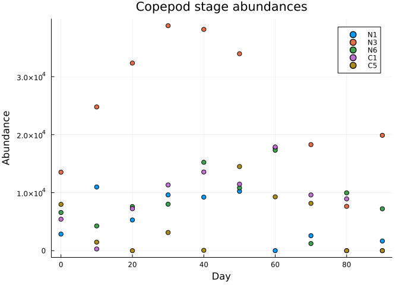
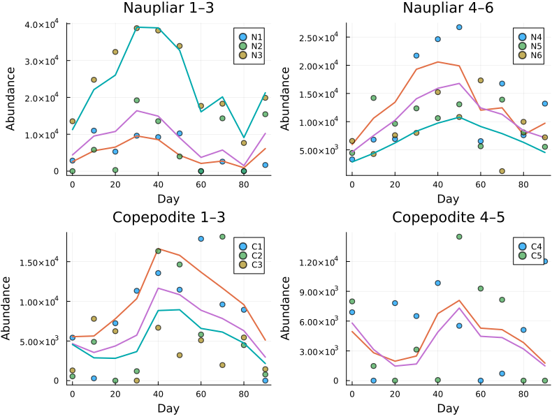
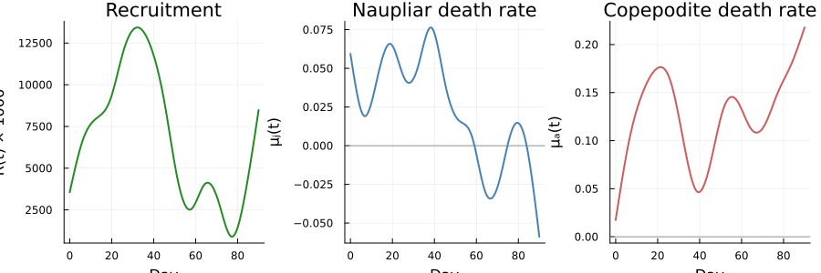
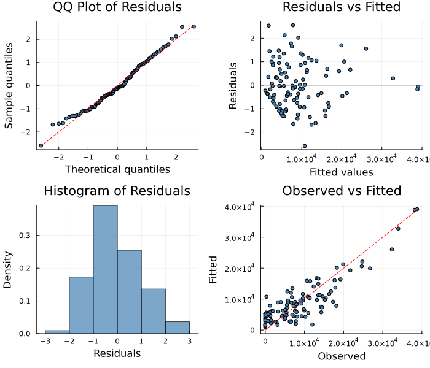

# Copepod Stage-Structured Population Model
Simon Frost
2026-06-12

- [Overview](#overview)
- [Setup](#setup)
- [Data](#data)
- [Model](#model)
  - [Stage-structured dynamics](#stage-structured-dynamics)
  - [Initial conditions](#initial-conditions)
- [Unknown Function Approximators](#unknown-function-approximators)
- [Building and Solving](#building-and-solving)
- [Results](#results)
  - [Fitted Trajectories](#fitted-trajectories)
  - [Estimated Unknown Functions](#estimated-unknown-functions)
- [Diagnostic Plots](#diagnostic-plots)
- [Discussion](#discussion)
  - [Model complexity](#model-complexity)
  - [Dependent initial conditions](#dependent-initial-conditions)
  - [Smoothing parameter
    interpretation](#smoothing-parameter-interpretation)
- [Summary](#summary)

## Overview

This vignette demonstrates `PartiallySpecifiedModels.jl` on a complex,
multivariate ecological model: the **11-stage copepod population model**
from Wood (2001). This is the canonical PSM example — the model that
motivated the original methodology.

The copepod *Calanus finmarchicus* passes through 11 developmental
stages (6 naupliar, 5 copepodite). Stage durations are known from
laboratory experiments, but three vital rates are unknown functions of
time:

- $R(t)$ — egg recruitment rate
- $\mu_j(t)$ — naupliar (juvenile) per-capita death rate
- $\mu_a(t)$ — copepodite (adult) per-capita death rate

With 11 simultaneously observed state variables, 3 unknown functions,
and 45 total parameters, this is a substantially more complex problem
than the Lotka–Volterra example.

## Setup

``` julia
using PartiallySpecifiedModels
using PartiallySpecifiedModels: solve
using OrdinaryDiffEq
using DelimitedFiles
using Plots
using Printf
```

## Data

The data consist of abundance estimates for each of the 11 developmental
stages, observed at 10 time points over 90 days:

    Observations: 10 times × 11 stages
    Time range: 0.0–90.0 days
    Total data points: 110

``` julia
p_data = plot(xlabel="Day", ylabel="Abundance", title="Copepod stage abundances",
              legend=:topright)
stage_names = ["N1", "N2", "N3", "N4", "N5", "N6", "C1", "C2", "C3", "C4", "C5"]
for j in [1, 3, 6, 7, 11]
    scatter!(p_data, data_times, data_values[:, j], label=stage_names[j], ms=4)
end
p_data
```



## Model

### Stage-structured dynamics

Each stage $i$ has exponential residence time with known mean duration
$c_i$. The rate of passage through stage $i$ is $s_i / c_i$:

$$\frac{ds_i}{dt} = \text{inflow}_i - \frac{s_i}{c_i} - \mu(t) \cdot s_i$$

where:

- $\text{inflow}_1 = R(t) \times 1000$ (recruitment, scaled)
- $\text{inflow}_i = s_{i-1} / c_{i-1}$ for $i > 1$ (outflow from
  previous stage)
- $\mu(t) = \mu_j(t)$ for stages 1–6, $\mu_a(t)$ for stages 7–11

``` julia
# Known stage durations (days)
durations = [0.75, 1.4, 4.55, 2.8, 2.5, 1.7, 3.5, 3.1, 3.2, 3.7, 4.7]

function copepod!(du, u, p, t)
    R_t = p.R(t) * 1000.0
    μ_j = p.mu_j(t)
    μ_a = p.mu_a(t)
    inflow = R_t
    for i in 1:11
        death = i <= 6 ? μ_j : μ_a
        du[i] = inflow - u[i] / durations[i] - death * u[i]
        inflow = u[i] / durations[i]
    end
end
```

    copepod! (generic function with 1 method)

### Initial conditions

We compute steady-state abundances from the initial values of the
unknown functions. This ensures the model starts in a self-consistent
state:

``` julia
function compute_u0(p)
    R0 = p.R(0.0) * 1000.0
    μ_j0 = p.mu_j(0.0)
    μ_a0 = p.mu_a(0.0)
    u0 = zeros(Float64, 11)
    inflow = R0
    for i in 1:11
        death = i <= 6 ? μ_j0 : μ_a0
        u0[i] = inflow / (1.0 / durations[i] + death)
        inflow = u0[i] / durations[i]
    end
    u0
end
```

    compute_u0 (generic function with 1 method)

Note that `compute_u0` receives the parameter struct `p` containing
callable unknown functions. This means the initial conditions are
automatically consistent with the current iterate during the IRLS
optimization.

## Unknown Function Approximators

Each unknown function gets 15 B-spline knots over the observation period
$[0, 90]$ days:

    Total parameters: 45

The initial guesses encode biological prior knowledge:

- **Recruitment** $R(t)$: Gaussian pulse peaking at day 30 (spring
  spawning)
- **Naupliar death** $\mu_j(t)$: exponential decay (mortality decreases
  as conditions improve)
- **Copepodite death** $\mu_a(t)$: constant (no prior information)

## Building and Solving

``` julia
prob = PSMProblem(copepod!, compute_u0, (0.0, 90.0),
    [approx_R, approx_mu_j, approx_mu_a];
    data_times = data_times,
    data_values = data_values,
    obs_to_state = collect(1:11),
    known_params = NamedTuple(),
    likelihood = Gaussian(),
    solver = BS3(),
    abstol = 1e-6, reltol = 1e-6, maxiters = 10000)
```

    PSMProblem{typeof(copepod!), typeof(compute_u0), Gaussian, BS3{typeof(OrdinaryDiffEqCore.trivial_limiter!), typeof(OrdinaryDiffEqCore.trivial_limiter!), Static.False}}(copepod!, compute_u0, (0.0, 90.0), BSplineApproximator[BSplineApproximator(:R, (0.0, 90.0), 15, var"#2#3"()), BSplineApproximator(:mu_j, (0.0, 90.0), 15, var"#5#6"()), BSplineApproximator(:mu_a, (0.0, 90.0), 15, var"#8#9"())], [0.0, 10.0, 20.0, 30.0, 40.0, 50.0, 60.0, 70.0, 80.0, 90.0], [2853.9353 0.0 … 6893.1885 7983.0894; 10981.5 5793.3442 … 0.0 1473.7781; … ; 0.0 0.0 … 5107.6265 0.0; 1660.5525 15433.848 … 12018.808 0.0], [1.0 1.0 … 1.0 1.0; 1.0 1.0 … 1.0 1.0; … ; 1.0 1.0 … 1.0 1.0; 1.0 1.0 … 1.0 1.0], [1, 2, 3, 4, 5, 6, 7, 8, 9, 10, 11], NamedTuple(), Gaussian(), BS3{typeof(OrdinaryDiffEqCore.trivial_limiter!), typeof(OrdinaryDiffEqCore.trivial_limiter!), Static.False}(OrdinaryDiffEqCore.trivial_limiter!, OrdinaryDiffEqCore.trivial_limiter!, static(false)), Dict{Symbol, Any}(:maxiters => 10000, :reltol => 1.0e-6, :abstol => 1.0e-6), false, Float64[], nothing)

    Data loss (SS):  1.7882e+09
    Penalized obj:   1.0352e+09
    EDF:             20.18
    Smoothing λ:     [395.8, 1.224e6, 1.062e6]

## Results

### Fitted Trajectories

``` julia
pred = sol.fitted_values
layout = @layout [a b; c d]
plots_stages = []

for (stages, title) in [([1,2,3], "Naupliar 1–3"), ([4,5,6], "Naupliar 4–6"),
                          ([7,8,9], "Copepodite 1–3"), ([10,11], "Copepodite 4–5")]
    p = plot(xlabel="Day", ylabel="Abundance", title=title, legend=:topright)
    for j in stages
        scatter!(p, data_times, data_values[:, j], label=stage_names[j], ms=4, alpha=0.7)
        plot!(p, data_times, pred[:, j], lw=2, label=nothing)
    end
    push!(plots_stages, p)
end

plot(plots_stages..., layout=(2, 2), size=(800, 600))
```



### Estimated Unknown Functions

``` julia
t_grid = range(0.0, 90.0, length=200)

p1 = plot(t_grid, [sol.unknown_functions[:R](t) * 1000.0 for t in t_grid],
          xlabel="Day", ylabel="R(t) × 1000",
          title="Recruitment", lw=2, color=:forestgreen, label=nothing)

p2 = plot(t_grid, [sol.unknown_functions[:mu_j](t) for t in t_grid],
          xlabel="Day", ylabel="μⱼ(t)",
          title="Naupliar death rate", lw=2, color=:steelblue, label=nothing)
hline!(p2, [0.0], color=:gray, ls=:dot, label=nothing)

p3 = plot(t_grid, [sol.unknown_functions[:mu_a](t) for t in t_grid],
          xlabel="Day", ylabel="μₐ(t)",
          title="Copepodite death rate", lw=2, color=:indianred, label=nothing)
hline!(p3, [0.0], color=:gray, ls=:dot, label=nothing)

plot(p1, p2, p3, layout=(1, 3), size=(900, 300))
```



## Diagnostic Plots

A standard 4-panel diagnostic display assesses residual behaviour across
all 11 stage variables.

``` julia
using PartiallySpecifiedModels: appraise

diag = appraise(sol)

p_qq = scatter(diag.qq_theoretical, diag.qq_sample,
    xlabel="Theoretical quantiles", ylabel="Sample quantiles",
    title="QQ Plot of Residuals", ms=3, legend=false, color=:steelblue)
mn, mx = extrema(vcat(diag.qq_theoretical, diag.qq_sample))
plot!(p_qq, [mn, mx], [mn, mx], color=:red, ls=:dash, label="")

p_rf = scatter(diag.fitted, diag.residuals,
    xlabel="Fitted values", ylabel="Residuals",
    title="Residuals vs Fitted", ms=3, legend=false, color=:steelblue)
hline!(p_rf, [0], color=:gray, ls=:dot)

p_hist = histogram(diag.residuals, normalize=:pdf,
    xlabel="Residuals", ylabel="Density",
    title="Histogram of Residuals", legend=false, color=:steelblue, alpha=0.7)

p_of = scatter(diag.observed, diag.fitted,
    xlabel="Observed", ylabel="Fitted",
    title="Observed vs Fitted", ms=3, legend=false, color=:steelblue)
mn2, mx2 = extrema(vcat(diag.observed, diag.fitted))
plot!(p_of, [mn2, mx2], [mn2, mx2], color=:red, ls=:dash, label="")

plot(p_qq, p_rf, p_hist, p_of, layout=(2, 2), size=(700, 600))
```



    Durbin-Watson: 1.983, 1.895, 1.086, 1.97, 1.548, 2.684, 1.92, 2.383, 1.567, 1.101, 1.944

## Discussion

### Model complexity

This model illustrates several features of complex PSMs:

| Feature            | Value                                 |
|--------------------|---------------------------------------|
| State variables    | 11 (6 naupliar + 5 copepodite stages) |
| Unknown functions  | 3 ($R$, $\mu_j$, $\mu_a$)             |
| Knots per function | 15                                    |
| Total parameters   | 45                                    |
| Data points        | 110 (10 times × 11 stages)            |

The ratio of data to parameters (110:45 ≈ 2.4:1) is low, making the
smoothing penalty critical. Without it, the model could overfit easily.
The LAML-estimated smoothing parameters ensure that the effective model
complexity matches what the data can support.

### Dependent initial conditions

The `compute_u0(p)` function demonstrates an important feature: the
initial conditions depend on the unknown functions. As the IRLS
algorithm iterates and updates the spline coefficients, the initial
conditions are automatically recomputed from the current estimate of
$R(0)$, $\mu_j(0)$, and $\mu_a(0)$.

### Smoothing parameter interpretation

The three smoothing parameters $\lambda_k$ control the trade-off between
data fit and smoothness independently for each unknown function:

- **$\lambda_R$**: typically small (recruitment is complex, needs
  flexibility)
- **$\lambda_{\mu_j}$, $\lambda_{\mu_a}$**: often larger (death rates
  are smoother)

The LAML/REML criterion provides an automatic, principled way to set
these parameters, avoiding the need for cross-validation on such a small
dataset.

## Summary

The copepod model demonstrates that `PartiallySpecifiedModels.jl` can
handle:

- High-dimensional state spaces (11 ODEs)
- Multiple unknown functions with different smoothing requirements
- Parameter-dependent initial conditions
- Real ecological data with complex dynamics
