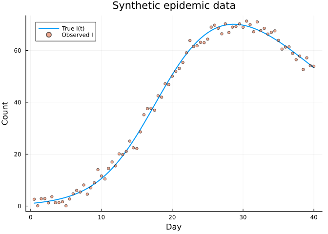
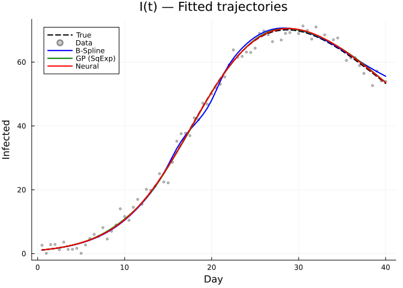
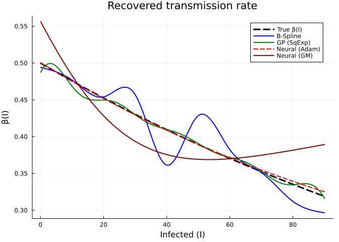
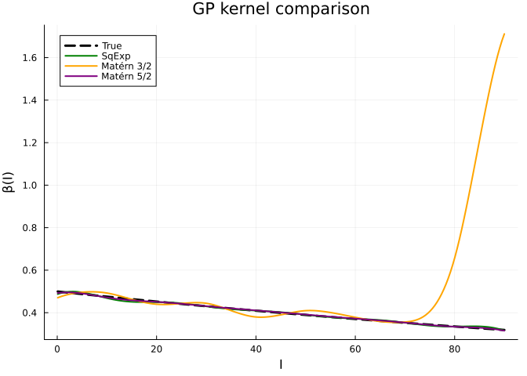
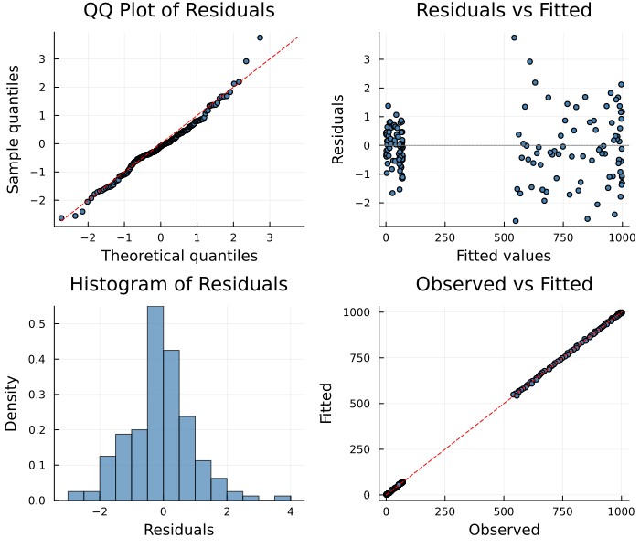

# Alternative Approximators: Neural Networks and Gaussian Processes
Simon Frost
2026-04-02

- [Overview](#overview)
  - [When to use each](#when-to-use-each)
- [Setup](#setup)
- [Synthetic Epidemic Data](#synthetic-epidemic-data)
- [Common Dynamics](#common-dynamics)
- [Approach 1: B-Spline Approximator](#approach-1-b-spline-approximator)
- [Approach 2: Gaussian Process
  Approximator](#approach-2-gaussian-process-approximator)
- [Approach 3: Neural Network
  Approximator](#approach-3-neural-network-approximator)
- [Approach 4: Neural Network with Gradient
  Matching](#approach-4-neural-network-with-gradient-matching)
- [Comparison](#comparison)
  - [Fitted Trajectories](#fitted-trajectories)
  - [Recovered $\beta(I)$](#recovered-betai)
  - [Kernel Comparison (GP)](#kernel-comparison-gp)
- [How Each Approximator Works](#how-each-approximator-works)
  - [B-Splines](#b-splines)
  - [Gaussian Processes](#gaussian-processes)
  - [Neural Networks](#neural-networks)
- [Diagnostic Plots](#diagnostic-plots)
- [Summary Table](#summary-table)

## Overview

While B-splines are the default approximator in
`PartiallySpecifiedModels.jl`, the package also supports **neural
network approximators** via [Lux.jl](https://lux.csail.mit.edu/) and
**Gaussian process (GP) approximators** with built-in kernel functions.
This vignette compares all three on the same problem: an SIR epidemic
model with a density-dependent transmission rate $\beta(I)$.

### When to use each

| Approximator | Strengths | Weaknesses |
|----|----|----|
| **B-spline** | Built-in penalty, automatic LAML smoothing, fast | Fixed domain, univariate input |
| **Gaussian process** | Built-in penalty (kernel prior), flexible correlation structure, LAML smoothing | Fixed domain, O(n³) cost in inducing points |
| **Neural network** | Multi-dimensional input, arbitrary architecture, extrapolation | No automatic smoothing, more parameters |

## Setup

``` julia
using PartiallySpecifiedModels
using PartiallySpecifiedModels: solve
using OrdinaryDiffEq
using Lux
using Plots
using Random
Random.seed!(42)
```

    TaskLocalRNG()

## Synthetic Epidemic Data

We simulate an SIR model where the transmission rate $\beta$ depends on
the number of infected individuals — a behavioural response where people
reduce contact as the epidemic grows:

$$\beta(I) = \beta_0 \, e^{-\kappa I}$$

    I range in data: 0.1 – 71.3 → domain: (0.0, 90.0)



## Common Dynamics

All three approaches share the same ODE structure — only the
approximator for $\beta$ differs:

``` julia
function sir!(du, u, p, t)
    S, I, R = u
    β = max(p.β(I), 0.001)
    du[1] = -β * S * I / p.N
    du[2] =  β * S * I / p.N - p.γ * I
    du[3] =  p.γ * I
end
```

    sir! (generic function with 1 method)

> [!TIP]
>
> ### Domain selection matters
>
> Set the approximator domain to match the **observed data range** of
> the input variable, not a theoretical maximum. A domain of `(0, 300)`
> when $I$ never exceeds ~70 wastes knots/inducing points in empty space
> and degrades extrapolation. We computed `I_domain` above from the
> observed range.

## Approach 1: B-Spline Approximator

The B-spline models $\beta(I)$ as a smooth function of the infected
count, with automatic smoothing via LAML:

    B-Spline — SS: 1804.0, EDF: 9.86

## Approach 2: Gaussian Process Approximator

The GP approximator models $\beta(I)$ using kernel-based interpolation
at inducing points. Different kernel functions control the smoothness of
the interpolation, while LAML uses a spline-based penalty for automatic
smoothing parameter selection:

    GP (SqExp) — SS: 1803.0, EDF: 2.59

We can also try different kernel functions. The **Matérn 3/2** kernel
produces rougher functions (once differentiable) while the **Matérn
5/2** is twice differentiable. The kernel choice affects *interpolation*
between inducing points — a squared exponential gives infinitely smooth
interpolation while Matérn kernels allow more local variation:

    GP (Matérn 3/2) — SS: 1792.0, EDF: 8.77
    GP (Matérn 5/2) — SS: 1794.0, EDF: 2.7

## Approach 3: Neural Network Approximator

We define a small neural network: 1 input ($I$) → 8 hidden units (tanh)
→ 1 output (softplus to ensure $\beta > 0$). The `domain` parameter
normalizes the input to $[0, 1]$, which is essential for stable
optimization:

    Neural network parameters: 25
    Neural (Adam) — SS: 1786.0, EDF: 25.0

> [!IMPORTANT]
>
> ### Why AdamSolver, not LAML?
>
> The `LAML` solver uses **IRLS (Iteratively Reweighted Least
> Squares)**, which linearizes the parameter-to-prediction mapping at
> each step. This works well for B-splines and GPs, where the parameters
> (knot/inducing point values) enter almost linearly into the function
> evaluation. Neural network weights enter **highly nonlinearly** — the
> linearization is extremely poor and IRLS converges in a few iterations
> having barely moved from initialization.
>
> `AdamSolver` uses **gradient descent with ForwardDiff** through the
> ODE solver, correctly handling the nonlinear dependence on network
> weights. This is equivalent to the **Universal Differential Equation
> (UDE)** approach.

## Approach 4: Neural Network with Gradient Matching

**Gradient matching** (Bonnaffé, Sheldon & Bhatt 2023) avoids ODE
integration entirely, making the optimization landscape much simpler:

1.  **Smooth** the observed data with cubic splines to get $\hat{y}(t)$
    and $d\hat{y}/dt$
2.  **Match** the ODE derivatives: minimize
    $\|d\hat{y}/dt - f(\hat{y}, p, t)\|^2$

Pure gradient matching can struggle at low $I$ where $dI/dt \approx 0$
provides little signal for $\beta(I)$. The `refine_iters` option adds
ODE shooting refinement after GM, using the GM solution as a warm start:

    ┌ Warning: Mixed-Precision `matmul_cpu_fallback!` detected and Octavian.jl cannot be used for this set of inputs (C [Matrix{Float64}]: A [Base.ReshapedArray{Float64, 2, SubArray{Float64, 1, Vector{Float64}, Tuple{UnitRange{Int64}}, true}, Tuple{}}] x B [Matrix{Float32}]). Falling back to generic implementation. This may be slow.
    └ @ LuxLib.Impl ~/.julia/packages/LuxLib/ZJ3gh/src/impl/matmul.jl:194
    Neural (GM+refine) — deriv_SS: 25100.0, EDF: 25.0

## Comparison

### Fitted Trajectories

``` julia
pred_s = sol_spline.fitted_values
pred_g = sol_gp_sqexp.fitted_values
pred_n = sol_neural.fitted_values
I_true_curve = [sol_true(t)[2] for t in data_times]

p1 = plot(data_times, I_true_curve, label="True", lw=2, color=:black, ls=:dash,
          xlabel="Day", ylabel="Infected", title="I(t) — Fitted trajectories")
scatter!(p1, data_times, I_obs, label="Data", ms=2, alpha=0.4, color=:gray)
if size(pred_s, 2) >= 2
    plot!(p1, data_times, pred_s[:, 2], label="B-Spline", lw=2, color=:blue)
end
if size(pred_g, 2) >= 2
    plot!(p1, data_times, pred_g[:, 2], label="GP (SqExp)", lw=2, color=:green)
end
if size(pred_n, 2) >= 2
    plot!(p1, data_times, pred_n[:, 2], label="Neural", lw=2, color=:red)
end
p1
```



### Recovered $\beta(I)$

``` julia
I_grid = range(0.1, I_domain[2], length=200)
β_truth = [β_true(I) for I in I_grid]

p2 = plot(I_grid, β_truth, label="True β(I)", lw=3, color=:black, ls=:dash,
          xlabel="Infected (I)", ylabel="β(I)",
          title="Recovered transmission rate", legend=:topright)

if haskey(sol_spline.unknown_functions, :β)
    β_spline = [sol_spline.unknown_functions[:β](I) for I in I_grid]
    plot!(p2, I_grid, β_spline, label="B-Spline", lw=2, color=:blue)
end

if haskey(sol_gp_sqexp.unknown_functions, :β)
    β_gp = [sol_gp_sqexp.unknown_functions[:β](I) for I in I_grid]
    plot!(p2, I_grid, β_gp, label="GP (SqExp)", lw=2, color=:green)
end

if haskey(sol_neural.unknown_functions, :β)
    β_nn = [sol_neural.unknown_functions[:β](I) for I in I_grid]
    plot!(p2, I_grid, β_nn, label="Neural (Adam)", lw=2, color=:red, ls=:dash)
end

if haskey(sol_gm.unknown_functions, :β)
    β_gm = [sol_gm.unknown_functions[:β](I) for I in I_grid]
    plot!(p2, I_grid, β_gm, label="Neural (GM)", lw=2, color=:darkred)
end

p2
```

    ┌ Warning: Mixed-Precision `matmul_cpu_fallback!` detected and Octavian.jl cannot be used for this set of inputs (C [Matrix{Float64}]: A [Base.ReshapedArray{Float64, 2, SubArray{Float64, 1, Vector{Float64}, Tuple{UnitRange{Int64}}, true}, Tuple{}}] x B [Matrix{Float32}]). Falling back to generic implementation. This may be slow.
    └ @ LuxLib.Impl ~/.julia/packages/LuxLib/ZJ3gh/src/impl/matmul.jl:194



### Kernel Comparison (GP)

``` julia
p3 = plot(I_grid, β_truth, label="True", lw=3, color=:black, ls=:dash,
          xlabel="I", ylabel="β(I)", title="GP kernel comparison")

for (sol, lbl, col) in [(sol_gp_sqexp, "SqExp", :green),
                         (sol_gp_m32, "Matérn 3/2", :orange),
                         (sol_gp_m52, "Matérn 5/2", :purple)]
    β_k = [sol.unknown_functions[:β](I) for I in I_grid]
    plot!(p3, I_grid, β_k, label=lbl, lw=2, color=col)
end
p3
```



## How Each Approximator Works

### B-Splines

Parameters are **knot values** (function values at evenly-spaced
points). The penalty matrix $S$ penalizes the integrated squared second
derivative $\int (f'')^2\,dx$, encouraging smoothness. LAML estimates
the optimal smoothing parameter $\lambda$.

### Gaussian Processes

Parameters are **function values at inducing points** (like B-spline
knots). Prediction at new points uses kernel interpolation:

$$f(x_*) = \mathbf{k}(x_*, X)^\top K^{-1} \mathbf{f}$$

where $\mathbf{k}(x_*, X)$ is the vector of kernel evaluations between
the test point and inducing points. For LAML smoothing, the package uses
a **spline-based second-derivative penalty** $\int(f'')^2\,dx$ (same as
B-splines) rather than the GP prior $K^{-1}$, because the spline penalty
has a much wider eigenvalue spectrum that enables effective automatic
smoothing parameter selection. The kernel choice still matters for
*evaluation* — it controls how smoothly the function interpolates
between inducing points.

Available kernels control the smoothness of the interpolation:

- **Squared exponential** ($C^\infty$): very smooth, good for slowly
  varying functions
- **Matérn 5/2** ($C^2$): twice differentiable, good default for
  physical processes
- **Matérn 3/2** ($C^1$): once differentiable, captures rougher features

### Neural Networks

Parameters are **weights and biases** of a Lux.jl model. There is no
structural smoothing penalty — the network architecture itself provides
implicit regularization (a small network cannot overfit). Key
considerations:

- **Input normalization** (`domain` argument) is essential for stable
  optimization
- **Use `AdamSolver`** (or `MultipleShootingSolver`), not `LAML` — the
  IRLS linearization used by LAML is fundamentally incompatible with the
  highly nonlinear weight→trajectory mapping of neural networks
- The `AdamSolver` uses ForwardDiff through the ODE solver (the UDE
  approach), correctly computing gradients w.r.t. network weights
- No LAML smoothing parameter (no penalty matrix) — the network
  architecture provides implicit regularization
- Best suited for multi-dimensional inputs where B-splines and GPs
  cannot be applied

## Diagnostic Plots

A standard 4-panel diagnostic display assesses residual behaviour for
the B-spline baseline fit.

``` julia
using PartiallySpecifiedModels: appraise

diag = appraise(sol_spline)

p_qq = scatter(diag.qq_theoretical, diag.qq_sample,
    xlabel="Theoretical quantiles", ylabel="Sample quantiles",
    title="QQ Plot of Residuals", ms=3, legend=false, color=:steelblue)
mn, mx = extrema(vcat(diag.qq_theoretical, diag.qq_sample))
plot!(p_qq, [mn, mx], [mn, mx], color=:red, ls=:dash, label="")

p_rf = scatter(diag.fitted, diag.residuals,
    xlabel="Fitted values", ylabel="Residuals",
    title="Residuals vs Fitted", ms=3, legend=false, color=:steelblue)
hline!(p_rf, [0], color=:gray, ls=:dot)

p_hist = histogram(diag.residuals, normalize=:pdf,
    xlabel="Residuals", ylabel="Density",
    title="Histogram of Residuals", legend=false, color=:steelblue, alpha=0.7)

p_of = scatter(diag.observed, diag.fitted,
    xlabel="Observed", ylabel="Fitted",
    title="Observed vs Fitted", ms=3, legend=false, color=:steelblue)
mn2, mx2 = extrema(vcat(diag.observed, diag.fitted))
plot!(p_of, [mn2, mx2], [mn2, mx2], color=:red, ls=:dash, label="")

plot(p_qq, p_rf, p_hist, p_of, layout=(2, 2), size=(700, 600))
```



    Durbin-Watson: 2.146, 1.405

> [!TIP]
>
> ### See Also
>
> - [Vignette 06: Solver
>   Comparison](../06_solver_comparison/06_solver_comparison.qmd) —
>   compares solvers (this vignette compares approximators)

## Summary Table

We compare methods using the **Pearson correlation** between true and
recovered $\beta(I)$ over the observed data range — this is more
interpretable than raw SS values which depend on data scale.

    Method                    SS         EDF    cor(β)   β(1)   β(50)
    ------------------------------------------------------------------------
    B-Spline (10 knots)       1804.0     9.9    0.879    0.493   0.429
    GP — SqExp (10 pts)       1803.0     2.6    0.994    0.494   0.391
    GP — Matérn 3/2           1792.0     8.8    0.949    0.478   0.41
    GP — Matérn 5/2           1794.0     2.7    0.999    0.495   0.391
    Neural Adam (25)          1786.0     25.0   1.0      0.498   0.389
    ┌ Warning: Mixed-Precision `matmul_cpu_fallback!` detected and Octavian.jl cannot be used for this set of inputs (C [Matrix{Float64}]: A [Base.ReshapedArray{Float64, 2, SubArray{Float64, 1, Vector{Float64}, Tuple{UnitRange{Int64}}, true}, Tuple{}}] x B [Matrix{Float32}]). Falling back to generic implementation. This may be slow.
    └ @ LuxLib.Impl ~/.julia/packages/LuxLib/ZJ3gh/src/impl/matmul.jl:194
    Neural GM+refine (25)     5.686e-29  25.0   0.891    0.549   0.369
    True                      -          -      1.0      0.498   0.389

| Feature | B-Spline | Gaussian Process | Neural Network |
|----|----|----|----|
| Smoothing penalty | $\int (f'')^2\,dx$ | $\int (f'')^2\,dx$ (spline-based) | None (architecture-implicit) |
| Recommended solver | `LAML` | `LAML` | `AdamSolver` or `MultipleShootingSolver` |
| LAML smoothing | ✓ Automatic | ✓ Automatic | ✗ Use Adam (ForwardDiff through ODE) |
| Parameters | nknots (e.g., 10) | n_inducing (e.g., 10) | Arch-dependent (e.g., 25) |
| Input dimension | 1D | 1D | Any |
| Output guarantee | Smooth (cubic) | Kernel-dependent | Activation-dependent |
| Extrapolation | Linear | Reverts to prior (0) | Network-dependent |
| Speed | Fast | Fast | Slower (autodiff through ODE) |
