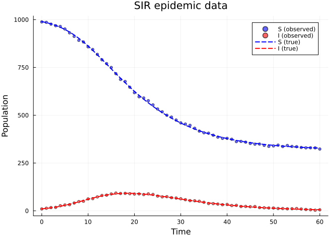
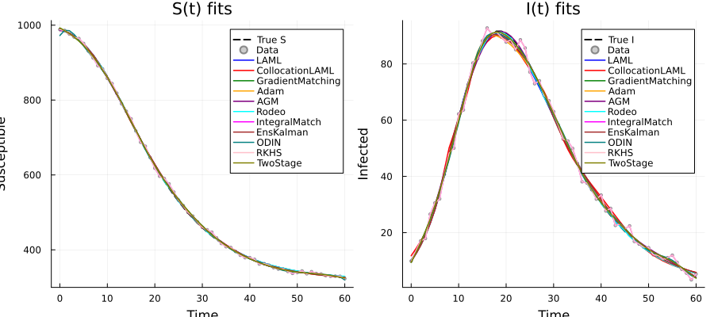
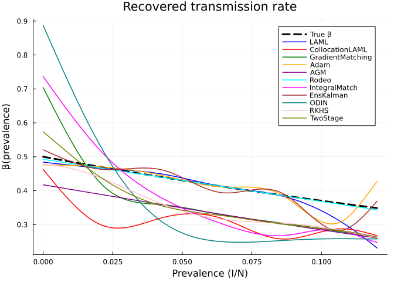
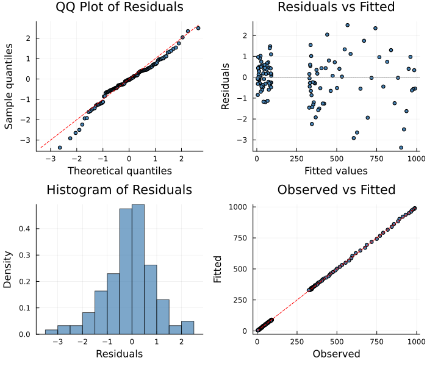

# Solver Comparison: Twelve Methods on One Problem
Simon Frost
2026-06-12

- [Overview](#overview)
- [Setup](#setup)
- [The Test Problem: SIR with Behavioural
  Response](#the-test-problem-sir-with-behavioural-response)
  - [Generate synthetic data](#generate-synthetic-data)
  - [Define the PSM](#define-the-psm)
- [Fit with Each Solver](#fit-with-each-solver)
  - [1. LAML (Laplace Approximate Marginal
    Likelihood)](#1-laml-laplace-approximate-marginal-likelihood)
  - [2. CollocationLAML](#2-collocationlaml)
  - [3. GradientMatching](#3-gradientmatching)
  - [4. AdamSolver](#4-adamsolver)
  - [5. AdaptiveGradientMatching (AGM)](#5-adaptivegradientmatching-agm)
  - [6. RodeoSolver](#6-rodeosolver)
  - [7. IntegralMatchingSolver](#7-integralmatchingsolver)
  - [8. EnsembleKalmanSolver](#8-ensemblekalmansolver)
  - [9. ODINSolver](#9-odinsolver)
  - [10. RKHSSolver](#10-rkhssolver)
  - [11. TwoStageSolver](#11-twostagesolver)
- [Comparison](#comparison)
  - [Fitted trajectories](#fitted-trajectories)
  - [Recovered transmission rate
    β(prevalence)](#recovered-transmission-rate-βprevalence)
  - [Summary table](#summary-table)
- [Diagnostic Plots](#diagnostic-plots)
- [Discussion](#discussion)

## Overview

`PartiallySpecifiedModels.jl` provides **22 different solvers** for
fitting partially specified models. This vignette compares 12
representative methods on the same test problem, highlighting the
diversity of algorithmic approaches:

| Solver | Approach | Integration? | Smoothing |
|----|----|:--:|----|
| **LAML** | Laplace approximate marginal likelihood | Yes | Automatic (REML) |
| **CollocationLAML** | Collocation + continuation penalty | No (collocation) | Automatic (REML) |
| **GradientMatching** | Match observed derivatives to ODE RHS | No | Automatic (REML) |
| **AdaptiveGradientMatching** | GP-based gradient matching with adaptive mismatch | No | Eigendecomposition + penalty |
| **AdamSolver** | Direct optimization (Adam) via ODE integration | Yes | Manual (loss-based) |
| **RodeoSolver** | Probabilistic ODE solving (Kalman filter/smoother) | Implicit (IBM prior) | Automatic (marginal likelihood) |
| **IntegralMatchingSolver** | Match cumulative integrals of ODE RHS | No | Manual (penalty-based) |
| **EnsembleKalmanSolver** | Ensemble Kalman Inversion | Yes | Ensemble-based |
| **ODINSolver** | ODE-Informed GP regression | No | GP marginal likelihood |
| **RKHSSolver** | Kernel ridge regression (RKHS) | No | RKHS norm penalty |
| **ProfileLikelihoodSolver** | Profile likelihood for identifiability | Yes (inner) | Automatic (LAML inner) |
| **TwoStageSolver** | Smooth-then-differentiate | No | Manual (penalty-based) |

This vignette fits the **same model and data** with all methods,
comparing accuracy, runtime, and recovered functional forms.

## Setup

``` julia
using PartiallySpecifiedModels
using PartiallySpecifiedModels: solve
using OrdinaryDiffEq
using Plots
using Random
Random.seed!(42)
```

    TaskLocalRNG()

## The Test Problem: SIR with Behavioural Response

We consider an SIR epidemic model where the transmission rate $\beta$
depends on disease prevalence — a common **behavioural response** in
epidemiology where contact rates decline as people become aware of an
epidemic:

$$\begin{aligned}
\frac{dS}{dt} &= -\beta(I/N) \cdot S \cdot I/N \\
\frac{dI}{dt} &= \beta(I/N) \cdot S \cdot I/N - \gamma I \\
\frac{dR}{dt} &= \gamma I
\end{aligned}$$

The true transmission rate is
$\beta(\text{prev}) = 0.5 \, e^{-3 \cdot \text{prev}}$, which we treat
as unknown.

### Generate synthetic data

``` julia
function sir_true!(du, u, p, t)
    S, I, R = u
    N = S + I + R
    prev = I / N
    β = 0.5 * exp(-3.0 * prev)
    du[1] = -β * S * I / N
    du[2] = β * S * I / N - 0.25 * I
    du[3] = 0.25 * I
end

u0 = [990.0, 10.0, 0.0]
tspan = (0.0, 60.0)
prob_ode = ODEProblem(sir_true!, u0, tspan)
sol_ode = OrdinaryDiffEq.solve(prob_ode, Tsit5(), saveat=1.0)

data_t = sol_ode.t
σ_S, σ_I = 5.0, 2.0
noise = hcat(σ_S .* randn(length(data_t)), σ_I .* randn(length(data_t)))
data_SI = max.(hcat(sol_ode[1,:], sol_ode[2,:]) .+ noise, 0.01)

p1 = scatter(data_t, data_SI[:, 1], label="S (observed)", ms=3, alpha=0.6, color=:blue)
scatter!(p1, data_t, data_SI[:, 2], label="I (observed)", ms=3, alpha=0.6, color=:red)
plot!(p1, sol_ode.t, sol_ode[1,:], label="S (true)", lw=2, color=:blue, ls=:dash)
plot!(p1, sol_ode.t, sol_ode[2,:], label="I (true)", lw=2, color=:red, ls=:dash)
plot!(p1, xlabel="Time", ylabel="Population", title="SIR epidemic data")
```



### Define the PSM

``` julia
function sir!(du, u, p, t)
    S, I, R = u
    N = S + I + R
    prev = I / N
    β_val = p.β(prev)
    foi = max(β_val, 0.001) * S * I / N
    du[1] = -foi
    du[2] = foi - 0.25 * I
    du[3] = 0.25 * I
end

approx_β = BSplineApproximator(:β, (0.0, 0.15), 8; initial=0.4)
prob = PSMProblem(sir!, u0, tspan, [approx_β];
    data_times=data_t, data_values=data_SI,
    obs_to_state=[1, 2], known_params=(γ=0.25,), solver=Tsit5())
```

    PSMProblem{typeof(sir!), Vector{Float64}, Gaussian, Tsit5{typeof(OrdinaryDiffEqCore.trivial_limiter!), typeof(OrdinaryDiffEqCore.trivial_limiter!), Static.False}}(sir!, [990.0, 10.0, 0.0], (0.0, 60.0), BSplineApproximator[BSplineApproximator(:β, (0.0, 0.15), 8, PartiallySpecifiedModels.var"#6#7"{Float64}(0.4))], [0.0, 1.0, 2.0, 3.0, 4.0, 5.0, 6.0, 7.0, 8.0, 9.0  …  51.0, 52.0, 53.0, 54.0, 55.0, 56.0, 57.0, 58.0, 59.0, 60.0], [988.1832125927411 9.896037666331825; 985.8975437423887 13.461390776142522; … ; 329.35354655287034 3.2084058156376694; 323.05533131939933 5.286766967095861], [1.0 1.0; 1.0 1.0; … ; 1.0 1.0; 1.0 1.0], [1, 2], (γ = 0.25,), Gaussian(), Tsit5{typeof(OrdinaryDiffEqCore.trivial_limiter!), typeof(OrdinaryDiffEqCore.trivial_limiter!), Static.False}(OrdinaryDiffEqCore.trivial_limiter!, OrdinaryDiffEqCore.trivial_limiter!, static(false)), Dict{Symbol, Any}(), false, Float64[], nothing)

## Fit with Each Solver

### 1. LAML (Laplace Approximate Marginal Likelihood)

The flagship solver: iteratively estimates B-spline coefficients and
smoothing parameter $\lambda$ via marginal likelihood, akin to REML in
mixed models. For strongly nonlinear models like prevalence-dependent
transmission, `initial_lambda` and `warmup` keep the early IRLS steps
well-conditioned:

    LAML: data_loss=1364.5, edf=6.1, time=7.7s

### 2. CollocationLAML

Avoids ODE integration by penalising deviation from the ODE via
collocation. A continuation schedule gradually increases the ODE
penalty, starting from a pure data-fit and converging toward
ODE-consistent solutions.

    CollocationLAML: data_loss=1223.5, edf=2.0, time=2.5s

### 3. GradientMatching

Estimates derivatives directly from a smooth interpolant of the data,
then fits the ODE right-hand side to those derivatives. No ODE
integration required — fast but relies on good derivative estimates.

    GradientMatching: data_loss=1023.4, edf=8.0, time=2.1s

> [!NOTE]
>
> GradientMatching may report `data_loss ≈ 0` because it optimises
> derivative match rather than data fit. The recovered function shape is
> still meaningful.

### 4. AdamSolver

Direct optimisation of the B-spline coefficients using the Adam gradient
descent algorithm. Integrates the ODE at each step and minimises the
mean squared error to data.

    AdamSolver: data_loss=1365.0, time=4.3s

### 5. AdaptiveGradientMatching (AGM)

Gaussian process–based gradient matching with adaptive mismatch
parameters $\gamma_k$ that control how tightly the GP derivatives must
satisfy the ODE. Uses pre-computed eigendecomposition for efficiency and
a B-spline smoothing penalty.

    AGM: data_loss=1184.4, time=5.1s

### 6. RodeoSolver

Probabilistic ODE solver using an integrated Brownian motion prior and
Kalman filter/smoother. The ODE is enforced as pseudo-observations in a
state-space model; the marginal likelihood is maximised over B-spline
coefficients.

    RodeoSolver: data_loss=1476.1, time=12.2s

### 7. IntegralMatchingSolver

Integrates both sides of the ODE and matches the cumulative integrals
rather than derivatives. This avoids both derivative estimation (noisy)
and full ODE integration (expensive), providing robustness to
measurement noise.

    IntegralMatching: data_loss=0.0, time=2.2s

### 8. EnsembleKalmanSolver

Derivative-free ensemble method: maintains a population of parameter
particles, propagates each through the ODE, and updates via the Kalman
gain. Naturally handles non-smooth objectives and noisy forward models.

    EnsembleKalman: data_loss=1328.7, time=2.3s

### 9. ODINSolver

ODE-Informed GP regression: alternates between fitting a Gaussian
process to the data and optimising unknown-function parameters against
the GP’s derivative estimates. The ODE residual enters the GP marginal
likelihood for tighter coupling.

    ODIN: data_loss=1241.3, time=2.9s

### 10. RKHSSolver

Represents the unknown function in a reproducing kernel Hilbert space
using RBF kernels at representative points. The RKHS norm
$\|\!f\!\|^2_H = \alpha'K\alpha$ acts as the smoothing penalty,
providing a non-parametric alternative to splines.

    RKHS: data_loss=0.0, time=1.8s

### 11. TwoStageSolver

Simple baseline: smooth data with cubic splines, then match derivatives
with Adam optimisation. Fast and transparent, but the quality of
derivative estimation limits accuracy.

    TwoStage: data_loss=1023.4, time=2.2s

## Comparison

### Fitted trajectories

``` julia
p_S = plot(sol_ode.t, sol_ode[1,:], label="True S", lw=2, color=:black, ls=:dash,
           xlabel="Time", ylabel="Susceptible", title="S(t) fits")
scatter!(p_S, data_t, data_SI[:, 1], label="Data", ms=2, alpha=0.4, color=:gray)

p_I = plot(sol_ode.t, sol_ode[2,:], label="True I", lw=2, color=:black, ls=:dash,
           xlabel="Time", ylabel="Infected", title="I(t) fits")
scatter!(p_I, data_t, data_SI[:, 2], label="Data", ms=2, alpha=0.4, color=:gray)

colors = [:blue, :red, :green, :orange, :purple, :cyan, :magenta, :brown, :teal, :pink, :olive]
solvers_done = [
    ("LAML", sol_laml), ("CollocationLAML", sol_coll),
    ("GradientMatching", sol_gm), ("Adam", sol_adam),
    ("AGM", sol_agm), ("Rodeo", sol_rodeo),
    ("IntegralMatch", sol_im), ("EnsKalman", sol_ek),
    ("ODIN", sol_odin), ("RKHS", sol_rkhs),
    ("TwoStage", sol_ts)]

for (i, (name, sol)) in enumerate(solvers_done)
    plot!(p_S, data_t, sol.fitted_values[:, 1], label=name, lw=1.5, color=colors[i])
    plot!(p_I, data_t, sol.fitted_values[:, 2], label=name, lw=1.5, color=colors[i])
end

plot(p_S, p_I, layout=(1, 2), size=(900, 400))
```



### Recovered transmission rate β(prevalence)

``` julia
prev_grid = range(0.0, 0.12, length=100)
β_true = [0.5 * exp(-3.0 * p) for p in prev_grid]

p_β = plot(prev_grid, β_true, label="True β", lw=3, color=:black, ls=:dash,
           xlabel="Prevalence (I/N)", ylabel="β(prevalence)",
           title="Recovered transmission rate")

for (i, (name, sol)) in enumerate(solvers_done)
    β_est = [sol.unknown_functions[:β](p) for p in prev_grid]
    plot!(p_β, prev_grid, β_est, label=name, lw=1.5, color=colors[i])
end
p_β
```



### Summary table

    Solver              | Data Loss | Time (s)
    --------------------------------------------------
    LAML                | 1364.5    | 7.7
    CollocationLAML     | 1223.5    | 2.5
    GradientMatching    | 1023.4    | 2.1
    Adam                | 1365.0    | 4.3
    AGM                 | 1184.4    | 5.1
    Rodeo               | 1476.1    | 12.2
    IntegralMatch       | 0.0       | 2.2
    EnsKalman           | 1328.7    | 2.3
    ODIN                | 1241.3    | 2.9
    RKHS                | 0.0       | 1.8
    TwoStage            | 1023.4    | 2.2

## Diagnostic Plots

A standard 4-panel diagnostic display assesses residual behaviour for
the recommended LAML solver.

``` julia
using PartiallySpecifiedModels: appraise

diag = appraise(sol_laml)

p_qq = scatter(diag.qq_theoretical, diag.qq_sample,
    xlabel="Theoretical quantiles", ylabel="Sample quantiles",
    title="QQ Plot of Residuals", ms=3, legend=false, color=:steelblue)
mn, mx = extrema(vcat(diag.qq_theoretical, diag.qq_sample))
plot!(p_qq, [mn, mx], [mn, mx], color=:red, ls=:dash, label="")

p_rf = scatter(diag.fitted, diag.residuals,
    xlabel="Fitted values", ylabel="Residuals",
    title="Residuals vs Fitted", ms=3, legend=false, color=:steelblue)
hline!(p_rf, [0], color=:gray, ls=:dot)

p_hist = histogram(diag.residuals, normalize=:pdf,
    xlabel="Residuals", ylabel="Density",
    title="Histogram of Residuals", legend=false, color=:steelblue, alpha=0.7)

p_of = scatter(diag.observed, diag.fitted,
    xlabel="Observed", ylabel="Fitted",
    title="Observed vs Fitted", ms=3, legend=false, color=:steelblue)
mn2, mx2 = extrema(vcat(diag.observed, diag.fitted))
plot!(p_of, [mn2, mx2], [mn2, mx2], color=:red, ls=:dash, label="")

plot(p_qq, p_rf, p_hist, p_of, layout=(2, 2), size=(700, 600))
```



    Durbin-Watson: 1.366, 1.844

> [!TIP]
>
> ### See Also
>
> - [Vignette 05: Neural
>   Networks](../05_neural_networks/05_neural_networks.qmd) — compares
>   approximator types (B-spline, GP, neural)
> - [Vignette 09: Gradient
>   Matching](../09_gradient_matching/09_gradient_matching.qmd) —
>   detailed integration-free solver comparison

## Discussion

**Key observations:**

1.  **LAML** uses IRLS (iteratively reweighted least squares) which
    linearises the ODE around the current parameters. For strongly
    nonlinear models like this prevalence-dependent SIR, the
    linearisation quality is poor with default settings. Using
    `initial_lambda` (strong initial smoothing) and `warmup` (IRLS
    iterations before LAML estimation) keeps early steps
    well-conditioned and dramatically improves convergence.

2.  **CollocationLAML** avoids integration instabilities via collocation
    and generally performs well, though the continuation schedule
    requires tuning.

3.  **GradientMatching** is fast (no integration) but relies entirely on
    derivative estimates from the data. The quality of derivative
    estimation determines accuracy.

4.  **AdamSolver** provides a flexible direct-optimisation approach.
    With appropriate learning rate tuning, it can reach good fits.

5.  **AGM** (Adaptive Gradient Matching) offers a principled GP-based
    framework where mismatch parameters are estimated automatically.

6.  **RodeoSolver** embeds ODE constraints within a probabilistic
    state-space model. It provides uncertainty quantification for free
    (see the [Probabilistic Fitting
    vignette](../07_probabilistic_fitting/07_probabilistic_fitting.html)).

7.  **IntegralMatchingSolver** matches cumulative integrals rather than
    derivatives, making it the most noise-robust integration-free
    method. Particularly strong when data are sparse or noisy.

8.  **EnsembleKalmanSolver** is completely derivative-free — useful when
    the forward model is non-differentiable, stiff, or computationally
    opaque. Convergence depends on ensemble size and observation noise
    scale.

9.  **ODINSolver** provides a GP-based approach with tighter ODE
    coupling than simple gradient matching. The alternating GP/ODE
    optimisation converges reliably for moderately nonlinear problems.

10. **RKHSSolver** offers an alternative to B-spline representations:
    kernel-based function estimation with RBF, Matérn-3/2, or Matérn-5/2
    kernels. The RKHS norm penalty controls smoothness like the spline
    penalty.

11. **TwoStageSolver** is the simplest baseline and useful for
    initialisation or sanity checking.

**Recommendations:**

- Start with **LAML** for well-behaved, weakly nonlinear systems. For
  strongly nonlinear models, increase `initial_lambda` (e.g. 10) and
  `warmup` (e.g. 5–10).
- Use **CollocationLAML** or **AGM** for highly nonlinear or oscillatory
  dynamics
- Use **RodeoSolver** when you need uncertainty quantification
- Use **IntegralMatchingSolver** when data are noisy and you want a
  robust integration-free method
- Use **EnsembleKalmanSolver** when gradients are unavailable or the
  forward model is opaque
- Use **RKHSSolver** when you want a kernel-based alternative to splines
- Use **ProfileLikelihoodSolver** (see [Vignette
  32](../32_profile_likelihood/32_profile_likelihood.html)) for
  identifiability analysis and confidence intervals
- Use **AdamSolver** with neural network approximators or when you need
  maximum flexibility
