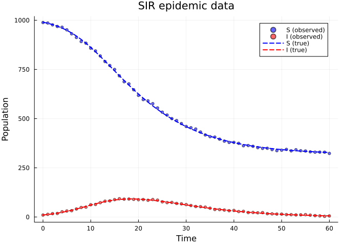
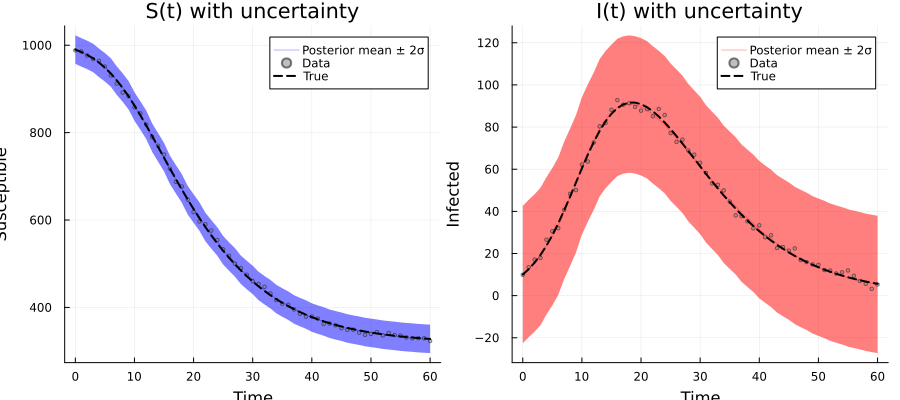
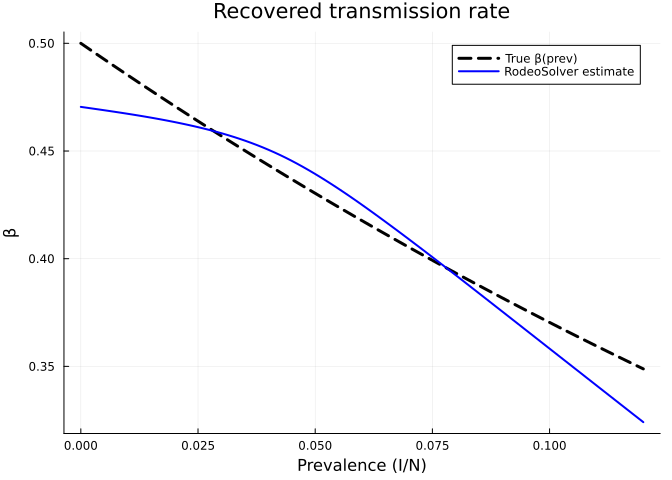
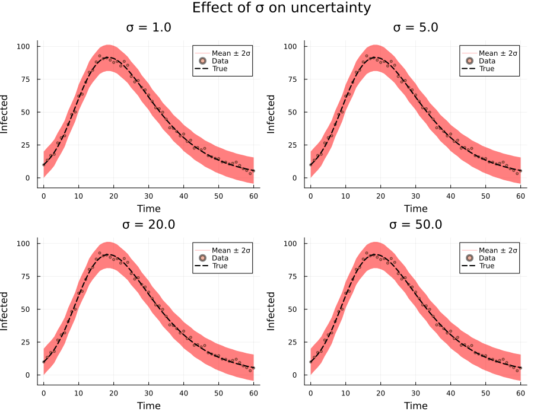
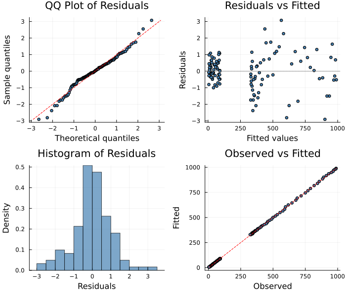

# Probabilistic ODE Fitting with RodeoSolver
Simon Frost
2026-04-02

- [Overview](#overview)
- [Setup](#setup)
- [Example: SIR Model with Density-Dependent
  Transmission](#example-sir-model-with-density-dependent-transmission)
  - [Generate data](#generate-data)
  - [Define the PSM](#define-the-psm)
- [Fitting with RodeoSolver](#fitting-with-rodeosolver)
  - [Solution uncertainty](#solution-uncertainty)
  - [Posterior credible bands](#posterior-credible-bands)
  - [Recovered β(prevalence)](#recovered-βprevalence)
- [Effect of the IBM Scale Parameter
  σ](#effect-of-the-ibm-scale-parameter-σ)
- [The Probabilistic ODE Solver Under the
  Hood](#the-probabilistic-ode-solver-under-the-hood)
- [Method Variants](#method-variants)
  - [Basic vs Fenrir](#basic-vs-fenrir)
  - [Schober vs Kramer interrogation](#schober-vs-kramer-interrogation)
- [Diagnostic Plots](#diagnostic-plots)
- [Key Takeaways](#key-takeaways)

## Overview

The **RodeoSolver** takes a fundamentally different approach to fitting
partially specified models: instead of treating the ODE as a hard
constraint, it embeds it within a **probabilistic state-space model**.
The ODE is enforced as pseudo-observations in a Kalman filter/smoother,
with an integrated Brownian motion (IBM) prior providing a flexible
model for the solution.

This approach provides:

1.  **Automatic uncertainty quantification** — the Kalman smoother
    posterior gives a distribution over the ODE solution at each time
    point
2.  **Graceful handling of model misspecification** — the IBM noise
    parameter $\sigma$ controls how strictly the ODE is enforced
3.  **Marginal likelihood for parameter estimation** — the Kalman filter
    computes an exact marginal likelihood, avoiding Laplace
    approximation

This vignette demonstrates how to use the RodeoSolver, interpret its
uncertainty estimates, and tune its key parameters.

## Setup

``` julia
using PartiallySpecifiedModels
using PartiallySpecifiedModels: solve, probsolve
using OrdinaryDiffEq
using Plots
using Random
Random.seed!(42)
```

    TaskLocalRNG()

## Example: SIR Model with Density-Dependent Transmission

We fit an SIR model with an unknown prevalence-dependent transmission
rate $\beta(I/N)$:

$$\frac{dS}{dt} = -\beta(I/N) \cdot S \cdot I/N, \quad \frac{dI}{dt} = \beta(I/N) \cdot S \cdot I/N - \gamma I, \quad \frac{dR}{dt} = \gamma I$$

The true transmission rate declines with prevalence:
$\beta(\text{prev}) = 0.5 \, e^{-3 \cdot \text{prev}}$.

### Generate data

``` julia
function sir_true!(du, u, p, t)
    S, I, R = u; N = S + I + R
    prev = I / N; β = 0.5 * exp(-3.0 * prev)
    du[1] = -β * S * I / N
    du[2] = β * S * I / N - 0.25 * I
    du[3] = 0.25 * I
end

u0 = [990.0, 10.0, 0.0]; tspan = (0.0, 60.0)
sol_ode = OrdinaryDiffEq.solve(ODEProblem(sir_true!, u0, tspan), Tsit5(), saveat=1.0)
data_t = sol_ode.t
σ_S, σ_I = 5.0, 2.0
data_SI = max.(hcat(sol_ode[1,:], sol_ode[2,:]) .+
               hcat(σ_S .* randn(length(data_t)), σ_I .* randn(length(data_t))), 0.01)

scatter(data_t, data_SI[:, 1], label="S (observed)", ms=3, alpha=0.6, color=:blue,
        xlabel="Time", ylabel="Population", title="SIR epidemic data")
scatter!(data_t, data_SI[:, 2], label="I (observed)", ms=3, alpha=0.6, color=:red)
plot!(sol_ode.t, sol_ode[1,:], label="S (true)", lw=2, color=:blue, ls=:dash)
plot!(sol_ode.t, sol_ode[2,:], label="I (true)", lw=2, color=:red, ls=:dash)
```



### Define the PSM

``` julia
function sir!(du, u, p, t)
    S, I, R = u; N = S + I + R
    prev = I / N
    β_val = p.β(prev)
    foi = max(β_val, 0.001) * S * I / N
    du[1] = -foi; du[2] = foi - 0.25 * I; du[3] = 0.25 * I
end

approx_β = BSplineApproximator(:β, (0.0, 0.15), 8; initial=0.4)
prob = PSMProblem(sir!, u0, tspan, [approx_β];
    data_times=data_t, data_values=data_SI,
    obs_to_state=[1, 2], known_params=(γ=0.25,), solver=Tsit5())
```

    PSMProblem{typeof(sir!), Vector{Float64}, Gaussian, Tsit5{typeof(OrdinaryDiffEqCore.trivial_limiter!), typeof(OrdinaryDiffEqCore.trivial_limiter!), Static.False}}(sir!, [990.0, 10.0, 0.0], (0.0, 60.0), BSplineApproximator[BSplineApproximator(:β, (0.0, 0.15), 8, PartiallySpecifiedModels.var"#6#7"{Float64}(0.4))], [0.0, 1.0, 2.0, 3.0, 4.0, 5.0, 6.0, 7.0, 8.0, 9.0  …  51.0, 52.0, 53.0, 54.0, 55.0, 56.0, 57.0, 58.0, 59.0, 60.0], [988.1832125927411 9.896037666331825; 985.8975437423887 13.461390776142522; … ; 329.35354655287034 3.2084058156376694; 323.05533131939933 5.286766967095861], [1.0 1.0; 1.0 1.0; … ; 1.0 1.0; 1.0 1.0], [1, 2], (γ = 0.25,), Gaussian(), Tsit5{typeof(OrdinaryDiffEqCore.trivial_limiter!), typeof(OrdinaryDiffEqCore.trivial_limiter!), Static.False}(OrdinaryDiffEqCore.trivial_limiter!, OrdinaryDiffEqCore.trivial_limiter!, static(false)), Dict{Symbol, Any}(), false, Float64[], nothing)

## Fitting with RodeoSolver

The key RodeoSolver parameters are:

| Parameter     | Description                                   | Default        |
|---------------|-----------------------------------------------|----------------|
| `n_steps`     | Number of solver time steps                   | 200            |
| `n_deriv`     | Order of IBM prior (number of derivatives)    | 3              |
| `sigma`       | IBM scale parameters (one per state variable) | auto-estimated |
| `obs_var`     | Observation noise variance                    | auto-estimated |
| `method`      | Likelihood method: `:basic` or `:fenrir`      | `:basic`       |
| `interrogate` | Interrogation: `:kramer` or `:schober`        | `:kramer`      |

``` julia
sol = solve(prob, RodeoSolver(
    n_steps=200,
    n_deriv=3,
    maxiters=200,
    verbose=true
))
```

    RodeoSolver: n_steps=200, n_deriv=3, method=basic, interrogate=kramer
      σ (IBM scale): [6.65, 0.896, 1.0]
      obs_var: 266.0
      8 approximator params

    Stage 1: Nelder-Mead (derivative-free)...
    Iter     Function value    √(Σ(yᵢ-ȳ)²)/n 
    ------   --------------    --------------
         0     5.642234e+02     1.582269e+02
     * time: 0.014133930206298828
        40     4.617256e+02     2.991238e+00
     * time: 0.2809720039367676
        80     4.555313e+02     7.948408e-02
     * time: 0.4416007995605469
       120     4.552681e+02     6.932960e-03
     * time: 0.6037588119506836
       160     4.552446e+02     1.359903e-03
     * time: 0.7388567924499512
       200     4.552378e+02     1.132600e-04
     * time: 0.8870007991790771
      NM loss: 455.24

    Stage 2: L-BFGS refinement...
    Iter     Function value   Gradient norm 
         0     4.552374e+02     1.854564e+00
     * time: 6.318092346191406e-5
        20     4.551680e+02     2.230936e+00
     * time: 0.9673411846160889
      Converged: true
      Final -loglik: 455.17

    Final: data_SS=1342.4 -loglik=455.17

    PSMSolution((β = [0.4704883934563337, 0.46279982982870643, 0.44776802642694824, 0.4182560497762647, 0.3826168984933937, 0.3460418083849205, 0.3094825837337409, 0.2729252894913491]), -455.1668287776843, 1342.4315163204662, 8.0, Float64[], [990.0 10.0; 983.7185253096884 12.87321350965469; … ; 328.8087783967166 5.80143159666138; 328.03871326054536 5.320964185772395], [988.1832125927411 9.896037666331825; 985.8975437423887 13.461390776142522; … ; 329.35354655287034 3.2084058156376694; 323.05533131939933 5.286766967095861], [0.0, 1.0, 2.0, 3.0, 4.0, 5.0, 6.0, 7.0, 8.0, 9.0  …  51.0, 52.0, 53.0, 54.0, 55.0, 56.0, 57.0, 58.0, 59.0, 60.0], Dict{Symbol, Any}(:β => DataInterpolations.CubicSpline{Vector{Float64}, Vector{Float64}, Vector{Float64}, Vector{Float64}, Vector{Float64}, Vector{Float64}, Float64}([0.4704883934563337, 0.46279982982870643, 0.44776802642694824, 0.4182560497762647, 0.3826168984933937, 0.3460418083849205, 0.3094825837337409, 0.2729252894913491], [0.0, 0.02142857142857143, 0.04285714285714286, 0.06428571428571428, 0.08571428571428572, 0.10714285714285714, 0.12857142857142856, 0.15], Float64[], DataInterpolations.CubicSplineParameterCache{Vector{Float64}}(Float64[], Float64[]), [0.0, 0.02142857142857143, 0.02142857142857143, 0.021428571428571422, 0.021428571428571436, 0.021428571428571422, 0.021428571428571422, 0.021428571428571436], [0.0, -13.602583949556381, -41.5413305837519, -9.439690834727607, -0.761654604586496, 0.25670859853757394, -0.05787114759410813, 0.0], DataInterpolations.ExtrapolationType.Extension, DataInterpolations.ExtrapolationType.Extension, FindFirstFunctions.Guesser{Vector{Float64}}([0.0, 0.02142857142857143, 0.04285714285714286, 0.06428571428571428, 0.08571428571428572, 0.10714285714285714, 0.12857142857142856, 0.15], Base.RefValue{Int64}(1), true), false, false)), (converged = true, iterations = 30, neg_loglik = 455.1668287776843, method = :basic, obs_var = 265.66511626326957, sigma = [6.651278812733418, 0.8957443840642172, 1.0], sol_variance = [0.0 0.0 0.0; 0.0007048897492577966 1.5925923487845752e-5 1.5935631727506717e-5; … ; 0.018669055355681356 4.898734119819204e-5 0.0006673115978903173; 0.019165537027361082 5.082506949665236e-5 0.0006798713928962766]))

### Solution uncertainty

The RodeoSolver stores the posterior variance from the Kalman smoother
in `sol.convergence.sol_variance`:

    Solution variance matrix: (61, 3) (n_times × n_observed)
    Max std(S): 0.1384
    Max std(I): 0.0207

### Posterior credible bands

We can construct approximate 95% credible bands for the ODE solution
from the posterior variance:

``` julia
p_bands = plot(layout=(1, 2), size=(900, 400))

# S(t) with ±2σ bands
μ_S = sol.fitted_values[:, 1]
σ_S_post = sqrt.(sol_var[:, 1] .+ sol.convergence.obs_var)
plot!(p_bands[1], data_t, μ_S, ribbon=2 .* σ_S_post,
      label="Posterior mean ± 2σ", color=:blue, alpha=0.3,
      xlabel="Time", ylabel="Susceptible", title="S(t) with uncertainty")
scatter!(p_bands[1], data_t, data_SI[:, 1], label="Data", ms=2, alpha=0.5, color=:gray)
plot!(p_bands[1], sol_ode.t, sol_ode[1,:], label="True", lw=2, color=:black, ls=:dash)

# I(t) with ±2σ bands
μ_I = sol.fitted_values[:, 2]
σ_I_post = sqrt.(sol_var[:, 2] .+ sol.convergence.obs_var)
plot!(p_bands[2], data_t, μ_I, ribbon=2 .* σ_I_post,
      label="Posterior mean ± 2σ", color=:red, alpha=0.3,
      xlabel="Time", ylabel="Infected", title="I(t) with uncertainty")
scatter!(p_bands[2], data_t, data_SI[:, 2], label="Data", ms=2, alpha=0.5, color=:gray)
plot!(p_bands[2], sol_ode.t, sol_ode[2,:], label="True", lw=2, color=:black, ls=:dash)

p_bands
```



### Recovered β(prevalence)

``` julia
prev_grid = range(0.0, 0.12, length=100)
β_true = [0.5 * exp(-3.0 * p) for p in prev_grid]
β_est = [sol.unknown_functions[:β](p) for p in prev_grid]

plot(prev_grid, β_true, label="True β(prev)", lw=3, color=:black, ls=:dash,
     xlabel="Prevalence (I/N)", ylabel="β",
     title="Recovered transmission rate")
plot!(prev_grid, β_est, label="RodeoSolver estimate", lw=2, color=:blue)
```



## Effect of the IBM Scale Parameter σ

The IBM scale parameter $\sigma$ controls how far the solution can
deviate from the ODE constraint. Larger $\sigma$ means the solver is
less strict about the ODE being satisfied exactly, leading to wider
posterior bands but more flexibility.

``` julia
sigmas = [1.0, 5.0, 20.0, 50.0]
p_sigma = plot(layout=(2, 2), size=(900, 700),
               plot_title="Effect of σ on uncertainty")

for (idx, σ_val) in enumerate(sigmas)
    sol_k = solve(prob, RodeoSolver(
        n_steps=200, n_deriv=3, maxiters=200, verbose=false,
        sigma=fill(σ_val, 3), obs_var=25.0))

    sv = sol_k.convergence.sol_variance
    μ_I = sol_k.fitted_values[:, 2]
    σ_I = sqrt.(sv[:, 2] .+ 25.0)

    plot!(p_sigma[idx], data_t, μ_I, ribbon=2 .* σ_I,
          label="Mean ± 2σ", color=:red, alpha=0.3,
          xlabel="Time", ylabel="Infected",
          title="σ = $σ_val")
    scatter!(p_sigma[idx], data_t, data_SI[:, 2], label="Data", ms=2, alpha=0.5)
    plot!(p_sigma[idx], sol_ode.t, sol_ode[2,:], label="True", lw=2, color=:black, ls=:dash)
end

p_sigma
```



## The Probabilistic ODE Solver Under the Hood

The RodeoSolver implements a **state-space model** where:

1.  **Prior**: $q$-times integrated Brownian motion (IBM) gives a
    Gaussian process prior on the solution, modelling state, first
    derivative, second derivative, etc.

2.  **Prediction**: $X_{n+1} = Q \cdot X_n + \text{noise}$ where $Q$ is
    the IBM transition matrix (Taylor expansion)

3.  **ODE update**: At each time step, the ODE residual
    $W \cdot X - f(X, t) = 0$ is treated as a noisy observation,
    conditioning the prior on the ODE being approximately satisfied

4.  **Smoothing**: A backward RTS smoother refines the estimates using
    future information

You can access the raw probabilistic solver output:

    Solution at t=30:
      State 1: mean=462.86, std=0.1456
      State 2: mean=61.77, std=0.0781
      State 3: mean=475.37, std=0.1844

## Method Variants

### Basic vs Fenrir

The `method` parameter selects the likelihood approximation:

- `:basic` (default) — evaluate the data likelihood at the posterior
  mean from the Kalman smoother. Fast and usually sufficient.
- `:fenrir` — a forward-backward scheme that additionally conditions on
  data in the backward pass, giving a tighter likelihood approximation
  for noisy data.

### Schober vs Kramer interrogation

The `interrogate` parameter controls how the ODE residual is linearised:

- `:kramer` (default) — uses a first-order Taylor expansion of the ODE
  right-hand side, giving a locally linear observation model. More
  accurate for nonlinear ODEs.
- `:schober` — simply evaluates the ODE at the predicted mean. Simpler
  and faster, but less accurate.

## Diagnostic Plots

A standard 4-panel diagnostic display assesses residual behaviour for
the probabilistic fit.

``` julia
using PartiallySpecifiedModels: appraise

diag = appraise(sol)

p_qq = scatter(diag.qq_theoretical, diag.qq_sample,
    xlabel="Theoretical quantiles", ylabel="Sample quantiles",
    title="QQ Plot of Residuals", ms=3, legend=false, color=:steelblue)
mn, mx = extrema(vcat(diag.qq_theoretical, diag.qq_sample))
plot!(p_qq, [mn, mx], [mn, mx], color=:red, ls=:dash, label="")

p_rf = scatter(diag.fitted, diag.residuals,
    xlabel="Fitted values", ylabel="Residuals",
    title="Residuals vs Fitted", ms=3, legend=false, color=:steelblue)
hline!(p_rf, [0], color=:gray, ls=:dot)

p_hist = histogram(diag.residuals, normalize=:pdf,
    xlabel="Residuals", ylabel="Density",
    title="Histogram of Residuals", legend=false, color=:steelblue, alpha=0.7)

p_of = scatter(diag.observed, diag.fitted,
    xlabel="Observed", ylabel="Fitted",
    title="Observed vs Fitted", ms=3, legend=false, color=:steelblue)
mn2, mx2 = extrema(vcat(diag.observed, diag.fitted))
plot!(p_of, [mn2, mx2], [mn2, mx2], color=:red, ls=:dash, label="")

plot(p_qq, p_rf, p_hist, p_of, layout=(2, 2), size=(700, 600))
```



    Durbin-Watson: 1.438, 1.699

## Key Takeaways

1.  **RodeoSolver provides automatic uncertainty** via the Kalman
    smoother posterior
2.  **σ controls the ODE fidelity**: smaller σ → tighter ODE constraint,
    less uncertainty; larger σ → more flexible, wider bands
3.  **obs_var is the observation noise**: this is added to the solution
    variance to get total prediction uncertainty
4.  **The marginal likelihood** automatically balances data fit and ODE
    fidelity
5.  For well-conditioned problems, RodeoSolver gives results comparable
    to LAML with the bonus of built-in uncertainty
