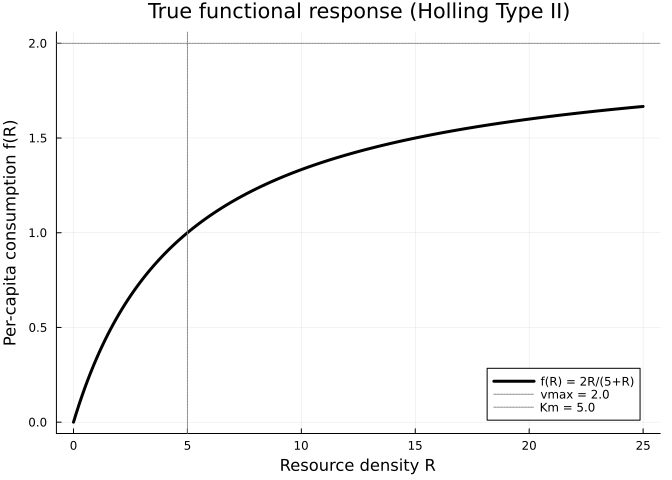
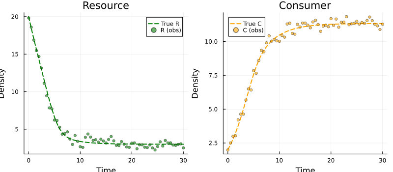
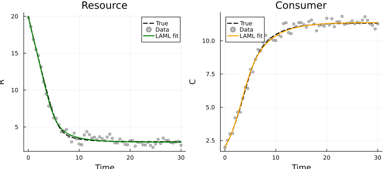
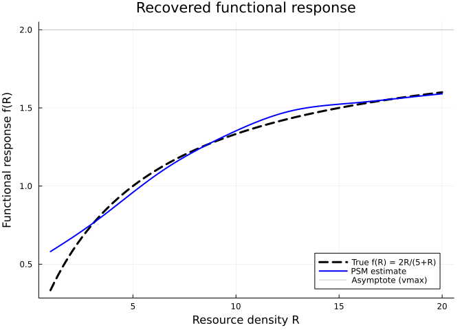
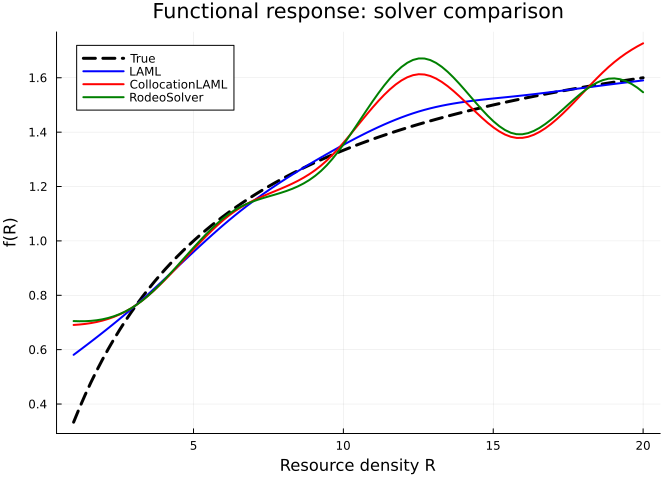
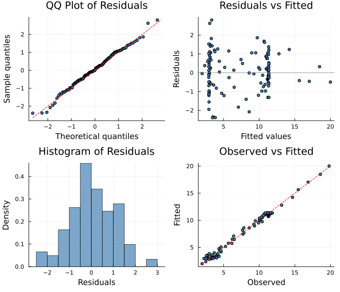
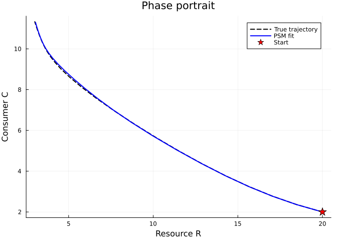

# Recovering Functional Responses: The Rosenzweig-MacArthur Model
Simon Frost
2026-04-03

- [Overview](#overview)
- [Setup](#setup)
- [The Consumer–Resource Model](#the-consumerresource-model)
  - [Visualise the true functional
    response](#visualise-the-true-functional-response)
  - [Generate data](#generate-data)
- [Define the PSM](#define-the-psm)
- [Fit with LAML](#fit-with-laml)
  - [Fitted trajectories](#fitted-trajectories)
  - [Recovered functional response](#recovered-functional-response)
- [Comparison Across Solvers](#comparison-across-solvers)
- [Ecological Interpretation](#ecological-interpretation)
- [Diagnostic Plots](#diagnostic-plots)
- [Phase Portrait](#phase-portrait)

## Overview

A central question in ecology is: **what is the functional form of
predator–prey interactions?** The **functional response** — how
per-capita prey consumption varies with prey density — determines the
stability, oscillations, and persistence of ecological communities.
Classical forms include:

- **Type I** (linear): $f(R) = aR$
- **Type II** (saturating): $f(R) = \frac{aR}{1 + ahR}$ (Holling disc
  equation)
- **Type III** (sigmoidal): $f(R) = \frac{aR^2}{1 + ahR^2}$

In practice, the true functional form is rarely known. **Partially
specified models** let us estimate $f(R)$ nonparametrically from
population time series data, without assuming a specific mathematical
form.

This vignette demonstrates how to recover a saturating functional
response from a two-species consumer–resource system using
`PartiallySpecifiedModels.jl`.

## Setup

``` julia
using PartiallySpecifiedModels
using PartiallySpecifiedModels: solve
using OrdinaryDiffEq
using Plots
using Random
Random.seed!(42)
```

    TaskLocalRNG()

## The Consumer–Resource Model

Consider a consumer ($C$) feeding on a resource ($R$) with continuous
replenishment (e.g., a chemostat or open ecosystem):

$$\begin{aligned}
\frac{dR}{dt} &= a(R_0 - R) - f(R) \cdot C \\
\frac{dC}{dt} &= \varepsilon \cdot f(R) \cdot C - d \cdot C
\end{aligned}$$

where:

- $a$ = resource turnover rate
- $R_0$ = resource supply concentration
- $f(R)$ = **functional response** (unknown)
- $\varepsilon$ = conversion efficiency
- $d$ = consumer death rate

The true functional response is **Holling Type II**:
$f(R) = \frac{v_{\max} R}{K_m + R} = \frac{2R}{5 + R}$.

### Visualise the true functional response

``` julia
R_grid = range(0, 25, length=200)
f_true = [2.0 * R / (5.0 + R) for R in R_grid]

plot(R_grid, f_true, lw=3, color=:black,
     xlabel="Resource density R", ylabel="Per-capita consumption f(R)",
     title="True functional response (Holling Type II)",
     label="f(R) = 2R/(5+R)", legend=:bottomright)
hline!([2.0], ls=:dot, color=:gray, label="vmax = 2.0")
vline!([5.0], ls=:dot, color=:gray, label="Km = 5.0")
```



### Generate data

``` julia
function cr_true!(du, u, p, t)
    R, C = u
    f = 2.0 * R / (5.0 + R)
    du[1] = 0.5 * (20.0 - R) - f * C
    du[2] = 0.4 * f * C - 0.3 * C
end

u0 = [20.0, 2.0]
tspan = (0.0, 30.0)
prob_ode = ODEProblem(cr_true!, u0, tspan)
sol_ode = OrdinaryDiffEq.solve(prob_ode, Tsit5(), saveat=0.5)

data_t = sol_ode.t
σ_R, σ_C = 0.5, 0.3
data = max.(hcat(sol_ode[1,:], sol_ode[2,:]) .+
            hcat(σ_R .* randn(length(data_t)), σ_C .* randn(length(data_t))), 0.01)

p1 = plot(sol_ode.t, sol_ode[1,:], label="True R", lw=2, color=:green, ls=:dash)
scatter!(p1, data_t, data[:, 1], label="R (obs)", ms=3, alpha=0.6, color=:green)
p2 = plot(sol_ode.t, sol_ode[2,:], label="True C", lw=2, color=:orange, ls=:dash)
scatter!(p2, data_t, data[:, 2], label="C (obs)", ms=3, alpha=0.6, color=:orange)
plot(p1, p2, layout=(1, 2), size=(800, 350),
     xlabel="Time", ylabel="Density", title=["Resource" "Consumer"])
```



## Define the PSM

The functional response $f(R)$ is left unspecified and modelled with a
B-spline:

``` julia
function consumer_resource!(du, u, p, t)
    R, C = u
    fR = p.f(max(R, 0.01))
    du[1] = 0.5 * (20.0 - R) - max(fR, 0.0) * C
    du[2] = 0.4 * max(fR, 0.0) * C - 0.3 * C
end

approx_f = BSplineApproximator(:f, (0.0, 22.0), 8; initial=1.0)

prob = PSMProblem(consumer_resource!, u0, tspan, [approx_f];
    data_times=data_t, data_values=data,
    obs_to_state=[1, 2],
    known_params=(a=0.5, R0=20.0, ε=0.4, d=0.3),
    solver=Tsit5())
```

    PSMProblem{typeof(consumer_resource!), Vector{Float64}, Gaussian, Tsit5{typeof(OrdinaryDiffEqCore.trivial_limiter!), typeof(OrdinaryDiffEqCore.trivial_limiter!), Static.False}}(consumer_resource!, [20.0, 2.0], (0.0, 30.0), BSplineApproximator[BSplineApproximator(:f, (0.0, 22.0), 8, PartiallySpecifiedModels.var"#6#7"{Float64}(1.0))], [0.0, 0.5, 1.0, 1.5, 2.0, 2.5, 3.0, 3.5, 4.0, 4.5  …  25.5, 26.0, 26.5, 27.0, 27.5, 28.0, 28.5, 29.0, 29.5, 30.0], [19.81832125927411 1.9844056499497738; 18.59217322955963 2.5007756990768337; … ; 3.0544691681141445 10.889505761680244; 2.5190470640325087 11.279979969880175], [1.0 1.0; 1.0 1.0; … ; 1.0 1.0; 1.0 1.0], [1, 2], (a = 0.5, R0 = 20.0, ε = 0.4, d = 0.3), Gaussian(), Tsit5{typeof(OrdinaryDiffEqCore.trivial_limiter!), typeof(OrdinaryDiffEqCore.trivial_limiter!), Static.False}(OrdinaryDiffEqCore.trivial_limiter!, OrdinaryDiffEqCore.trivial_limiter!, static(false)), Dict{Symbol, Any}(), false, Float64[], nothing)

## Fit with LAML

    IRLS+LAML: 8 params, 122 data, 1 smooth terms
    Initial θ: [3.658e-5]
    Iter 0: obj=2237.66, SS=4475.28, θ=[3.66e-5]
    Iter 1: obj=1985.32, SS=3970.61, θ=[3.66e-5]
    Iter 2: obj=1617.8, SS=3235.3, θ=[3.66e-5]
    Iter 3: obj=1239.78, SS=2479.42, θ=[3.66e-5]
    LAML init: ρ = [0.0]
    LAML-FS iter 1: σ̂²=5.434e+01 λ = [0.000169]
    LAML-FS iter 2: σ̂²=2.033e+01 λ = [0.01134]
    LAML-FS iter 3: σ̂²=2.071e+01 λ = [0.003028]
    LAML-FS iter 4: σ̂²=2.043e+01 λ = [0.005383]
    LAML-FS iter 5: σ̂²=2.051e+01 λ = [0.004317]
    LAML-FS iter 10: σ̂²=2.048e+01 λ = [0.004605]
    LAML-FS iter 19: σ̂²=2.048e+01 λ = [0.004602]
    LAML-FS converged at iteration 19
    LAML-Newton iter 1: V=-1.861516e+02 |grad|=1.031e-07
    Iter 4: obj=694.123, SS=1374.46, θ=[0.0046]
    LAML init: ρ = [-5.381]
    LAML-FS iter 1: σ̂²=1.138e+01 λ = [0.006745]
    LAML-FS iter 2: σ̂²=1.143e+01 λ = [0.006091]
    LAML-FS iter 3: σ̂²=1.142e+01 λ = [0.006263]
    LAML-FS iter 4: σ̂²=1.142e+01 λ = [0.006216]
    LAML-FS iter 5: σ̂²=1.142e+01 λ = [0.006229]
    LAML-FS iter 10: σ̂²=1.142e+01 λ = [0.006226]
    LAML-FS iter 11: σ̂²=1.142e+01 λ = [0.006226]
    LAML-FS converged at iteration 11
    LAML-Newton iter 1: V=-1.533644e+02 |grad|=1.889e-07
    LAML init: ρ = [-5.079]
    LAML-FS iter 1: σ̂²=7.559e-01 λ = [0.02051]
    LAML-FS iter 2: σ̂²=7.686e-01 λ = [0.0168]
    LAML-FS iter 3: σ̂²=7.653e-01 λ = [0.0174]
    LAML-FS iter 4: σ̂²=7.658e-01 λ = [0.01729]
    LAML-FS iter 5: σ̂²=7.657e-01 λ = [0.01731]
    LAML-FS iter 9: σ̂²=7.658e-01 λ = [0.01731]
    LAML-FS converged at iteration 9
    LAML-Newton iter 1: V=5.226687e+00 |grad|=2.124e-07
    LAML init: ρ = [-4.057]
    LAML-FS iter 1: σ̂²=2.157e-01 λ = [0.003966]
    LAML-FS iter 2: σ̂²=1.990e-01 λ = [0.004602]
    LAML-FS iter 3: σ̂²=1.998e-01 λ = [0.004526]
    LAML-FS iter 4: σ̂²=1.997e-01 λ = [0.004535]
    LAML-FS iter 5: σ̂²=1.997e-01 λ = [0.004534]
    LAML-FS iter 8: σ̂²=1.997e-01 λ = [0.004534]
    LAML-FS converged at iteration 8
    LAML-Newton iter 1: V=8.170798e+01 |grad|=5.564e-08
    LAML init: ρ = [-5.396]
    LAML-FS iter 1: σ̂²=1.451e-01 λ = [0.004381]
    LAML-FS iter 2: σ̂²=1.450e-01 λ = [0.0044]
    LAML-FS iter 3: σ̂²=1.450e-01 λ = [0.004397]
    LAML-FS iter 4: σ̂²=1.450e-01 λ = [0.004398]
    LAML-FS iter 5: σ̂²=1.450e-01 λ = [0.004398]
    LAML-FS iter 6: σ̂²=1.450e-01 λ = [0.004398]
    LAML-FS converged at iteration 6
    LAML-Newton iter 1: V=9.779125e+01 |grad|=1.837e-07
    LAML init: ρ = [-5.427]
    LAML-FS iter 1: σ̂²=1.433e-01 λ = [0.004269]
    LAML-FS iter 2: σ̂²=1.431e-01 λ = [0.004287]
    LAML-FS iter 3: σ̂²=1.432e-01 λ = [0.004284]
    LAML-FS iter 4: σ̂²=1.432e-01 λ = [0.004285]
    LAML-FS iter 5: σ̂²=1.432e-01 λ = [0.004285]
    LAML-FS iter 7: σ̂²=1.432e-01 λ = [0.004285]
    LAML-FS converged at iteration 7
    LAML-Newton iter 1: V=1.036693e+02 |grad|=7.093e-08
    Converged at iter 9 (objective stable)

    Final: data_loss = 16.9074, penalty = 0.57347, EDF = 5.89
    Final θ: [0.004398]
    Data loss (SS): 16.91
    EDF: 5.89

### Fitted trajectories

``` julia
p1 = plot(sol_ode.t, sol_ode[1,:], label="True", lw=2, color=:black, ls=:dash,
          xlabel="Time", ylabel="R", title="Resource")
scatter!(p1, data_t, data[:, 1], label="Data", ms=3, alpha=0.5, color=:gray)
plot!(p1, data_t, sol.fitted_values[:, 1], label="LAML fit", lw=2, color=:green)

p2 = plot(sol_ode.t, sol_ode[2,:], label="True", lw=2, color=:black, ls=:dash,
          xlabel="Time", ylabel="C", title="Consumer")
scatter!(p2, data_t, data[:, 2], label="Data", ms=3, alpha=0.5, color=:gray)
plot!(p2, data_t, sol.fitted_values[:, 2], label="LAML fit", lw=2, color=:orange)

plot(p1, p2, layout=(1, 2), size=(800, 350))
```



### Recovered functional response

The key result: we recover the shape of the Holling Type II functional
response **without assuming any parametric form**:

``` julia
R_eval = range(1.0, 20.0, length=100)
f_true_vals = [2.0 * R / (5.0 + R) for R in R_eval]
f_est = [sol.unknown_functions[:f](R) for R in R_eval]

plot(R_eval, f_true_vals, label="True f(R) = 2R/(5+R)", lw=3, color=:black, ls=:dash,
     xlabel="Resource density R", ylabel="Functional response f(R)",
     title="Recovered functional response", legend=:bottomright)
plot!(R_eval, f_est, label="PSM estimate", lw=2, color=:blue)
hline!([2.0], ls=:dot, color=:gray, alpha=0.5, label="Asymptote (vmax)")
```



The PSM correctly recovers:

1.  **Near-linear increase** at low R (the “attack rate” region)
2.  **Saturation** at high R (the “handling time” limitation)
3.  **No assumption** about the Type II form was needed

## Comparison Across Solvers

``` julia
sol_coll = solve(prob, CollocationLAML(maxiters=50, verbose=false, n_continuation=6))
sol_rodeo = solve(prob, RodeoSolver(n_steps=200, n_deriv=3, maxiters=200, verbose=false))

p_compare = plot(R_eval, f_true_vals, label="True", lw=3, color=:black, ls=:dash,
                 xlabel="Resource density R", ylabel="f(R)",
                 title="Functional response: solver comparison")
plot!(p_compare, R_eval, f_est, label="LAML", lw=2, color=:blue)
plot!(p_compare, R_eval, [sol_coll.unknown_functions[:f](R) for R in R_eval],
      label="CollocationLAML", lw=2, color=:red)
plot!(p_compare, R_eval, [sol_rodeo.unknown_functions[:f](R) for R in R_eval],
      label="RodeoSolver", lw=2, color=:green)
p_compare
```



## Ecological Interpretation

The nonparametric estimate of $f(R)$ allows biologists to:

1.  **Test functional response hypotheses** — Does the estimated curve
    match Type I, II, or III?
2.  **Detect departures** from classical forms — e.g., a Type II that
    starts declining at very high densities (interference)
3.  **Predict dynamics** under novel conditions — the fitted PSM can be
    simulated forward

This is fundamentally different from fitting parametric models (e.g.,
assuming Holling Type II and estimating $a$ and $h$), because the PSM
approach makes no assumption about the functional form and lets the data
speak.

## Diagnostic Plots

A standard 4-panel diagnostic display assesses residual behaviour for
the consumer–resource fit.

``` julia
using PartiallySpecifiedModels: appraise

diag = appraise(sol)

p_qq = scatter(diag.qq_theoretical, diag.qq_sample,
    xlabel="Theoretical quantiles", ylabel="Sample quantiles",
    title="QQ Plot of Residuals", ms=3, legend=false, color=:steelblue)
mn, mx = extrema(vcat(diag.qq_theoretical, diag.qq_sample))
plot!(p_qq, [mn, mx], [mn, mx], color=:red, ls=:dash, label="")

p_rf = scatter(diag.fitted, diag.residuals,
    xlabel="Fitted values", ylabel="Residuals",
    title="Residuals vs Fitted", ms=3, legend=false, color=:steelblue)
hline!(p_rf, [0], color=:gray, ls=:dot)

p_hist = histogram(diag.residuals, normalize=:pdf,
    xlabel="Residuals", ylabel="Density",
    title="Histogram of Residuals", legend=false, color=:steelblue, alpha=0.7)

p_of = scatter(diag.observed, diag.fitted,
    xlabel="Observed", ylabel="Fitted",
    title="Observed vs Fitted", ms=3, legend=false, color=:steelblue)
mn2, mx2 = extrema(vcat(diag.observed, diag.fitted))
plot!(p_of, [mn2, mx2], [mn2, mx2], color=:red, ls=:dash, label="")

plot(p_qq, p_rf, p_hist, p_of, layout=(2, 2), size=(700, 600))
```



    Durbin-Watson: 1.295, 1.835

## Phase Portrait

``` julia
plot(sol_ode[1,:], sol_ode[2,:], label="True trajectory", lw=2, color=:black, ls=:dash,
     xlabel="Resource R", ylabel="Consumer C",
     title="Phase portrait")
plot!(sol.fitted_values[:, 1], sol.fitted_values[:, 2], label="PSM fit", lw=2, color=:blue)
scatter!([u0[1]], [u0[2]], label="Start", ms=8, color=:red, marker=:star5)
```


