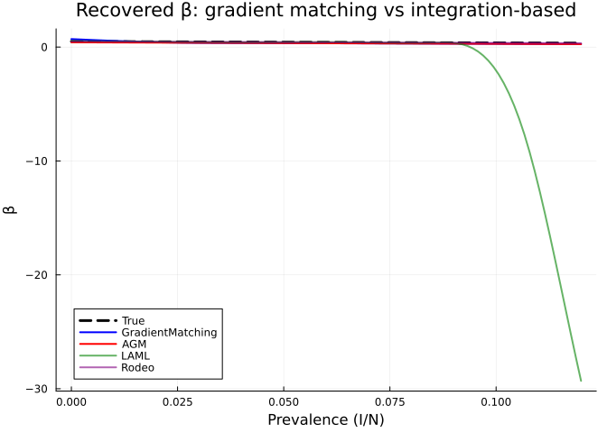
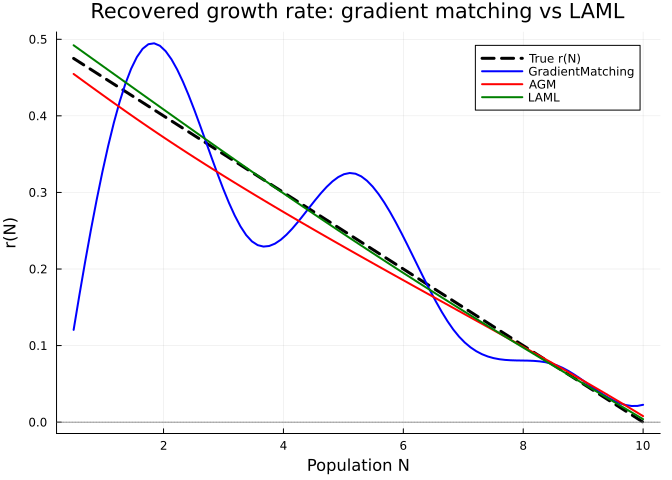

# Integration-Free Inference with Gradient Matching
Simon Frost
2026-03-22

- [Overview](#overview)
- [Setup](#setup)
- [Example 1: SIR Model — Speed
  Comparison](#example-1-sir-model--speed-comparison)
  - [Generate data](#generate-data)
  - [Fit with all approaches](#fit-with-all-approaches)
  - [Compare recovered β(prevalence)](#compare-recovered-βprevalence)
- [How Adaptive Gradient Matching
  Works](#how-adaptive-gradient-matching-works)
  - [Stage 1: Smooth the data with a Gaussian
    process](#stage-1-smooth-the-data-with-a-gaussian-process)
  - [Stage 2: Match derivatives to
    ODE](#stage-2-match-derivatives-to-ode)
  - [Stage 3: Simulate with fitted
    parameters](#stage-3-simulate-with-fitted-parameters)
  - [Inspecting AGM diagnostics](#inspecting-agm-diagnostics)
- [Example 2: Logistic Growth — A Clean
  Demonstration](#example-2-logistic-growth--a-clean-demonstration)
- [When to Use Gradient Matching](#when-to-use-gradient-matching)
  - [Advantages](#advantages)
  - [Limitations](#limitations)
  - [Recommendations](#recommendations)

## Overview

Fitting ODE models typically requires **solving the ODE** at each
iteration of the optimiser — which can be slow, numerically unstable, or
fail entirely for stiff systems. **Gradient matching** methods bypass
ODE integration entirely by:

1.  Fitting a smooth curve to the data
2.  Computing derivatives of that curve
3.  Matching those derivatives to the ODE right-hand side

`PartiallySpecifiedModels.jl` provides two gradient matching solvers:

- **`GradientMatching`** — basic smoothing spline approach with
  derivative matching
- **`AdaptiveGradientMatching` (AGM)** — Gaussian process-based with
  adaptive mismatch parameters and smoothing penalties

This vignette compares these integration-free methods against standard
integration-based solvers, highlighting the speed advantage and
scenarios where gradient matching excels.

## Setup

``` julia
using PartiallySpecifiedModels
using PartiallySpecifiedModels: solve
using OrdinaryDiffEq
using Plots
using Random
Random.seed!(42)
```

    TaskLocalRNG()

## Example 1: SIR Model — Speed Comparison

### Generate data

``` julia
function sir_true!(du, u, p, t)
    S, I, R = u; N = S + I + R; prev = I / N
    β = 0.5 * exp(-3.0 * prev)
    du[1] = -β * S * I / N
    du[2] = β * S * I / N - 0.25 * I
    du[3] = 0.25 * I
end

u0 = [990.0, 10.0, 0.0]; tspan = (0.0, 60.0)
sol_ode = OrdinaryDiffEq.solve(ODEProblem(sir_true!, u0, tspan), Tsit5(), saveat=1.0)
data_t = sol_ode.t
data_SI = max.(hcat(sol_ode[1,:], sol_ode[2,:]) .+
               hcat(5.0 .* randn(length(data_t)), 2.0 .* randn(length(data_t))), 0.01)

function sir!(du, u, p, t)
    S, I, R = u; N = S + I + R
    β_val = p.β(I / N)
    foi = max(β_val, 0.001) * S * I / N
    du[1] = -foi; du[2] = foi - 0.25 * I; du[3] = 0.25 * I
end

approx_β = BSplineApproximator(:β, (0.0, 0.15), 8; initial=0.4)
prob = PSMProblem(sir!, u0, tspan, [approx_β];
    data_times=data_t, data_values=data_SI,
    obs_to_state=[1, 2], known_params=(γ=0.25,), solver=Tsit5())
```

    PSMProblem{typeof(sir!), Vector{Float64}, Gaussian, Tsit5{typeof(OrdinaryDiffEqCore.trivial_limiter!), typeof(OrdinaryDiffEqCore.trivial_limiter!), Static.False}}(sir!, [990.0, 10.0, 0.0], (0.0, 60.0), BSplineApproximator[BSplineApproximator(:β, (0.0, 0.15), 8, PartiallySpecifiedModels.var"#6#7"{Float64}(0.4))], [0.0, 1.0, 2.0, 3.0, 4.0, 5.0, 6.0, 7.0, 8.0, 9.0  …  51.0, 52.0, 53.0, 54.0, 55.0, 56.0, 57.0, 58.0, 59.0, 60.0], [988.1832125927411 9.896037666331825; 985.8975437423887 13.461390776142522; … ; 329.35354655287034 3.2084058156376694; 323.05533131939933 5.286766967095861], [1.0 1.0; 1.0 1.0; … ; 1.0 1.0; 1.0 1.0], [1, 2], (γ = 0.25,), Gaussian(), Tsit5{typeof(OrdinaryDiffEqCore.trivial_limiter!), typeof(OrdinaryDiffEqCore.trivial_limiter!), Static.False}(OrdinaryDiffEqCore.trivial_limiter!, OrdinaryDiffEqCore.trivial_limiter!, static(false)), Dict{Symbol, Any}(), false)

### Fit with all approaches

    Method               | Time (s) | Data Loss
    -------------------------------------------------------
    GradientMatching     | 3.66     | 0.0
    AGM                  | 5.1      | 1184.4
    LAML                 | 5.87     | 1754.0
    CollocationLAML      | 1.67     | 1210.1
    AdamSolver           | 4.18     | 1365.0
    RodeoSolver          | 4.33     | 1342.4

### Compare recovered β(prevalence)

``` julia
prev_grid = range(0.0, 0.12, length=100)
β_true = [0.5 * exp(-3.0 * p) for p in prev_grid]

p_β = plot(prev_grid, β_true, label="True", lw=3, color=:black, ls=:dash,
           xlabel="Prevalence (I/N)", ylabel="β",
           title="Recovered β: gradient matching vs integration-based")

# Gradient matching methods
plot!(p_β, prev_grid, [sol_gm.unknown_functions[:β](p) for p in prev_grid],
      label="GradientMatching", lw=2, color=:blue)
plot!(p_β, prev_grid, [sol_agm.unknown_functions[:β](p) for p in prev_grid],
      label="AGM", lw=2, color=:red)

# Integration-based
plot!(p_β, prev_grid, [sol_laml.unknown_functions[:β](p) for p in prev_grid],
      label="LAML", lw=2, color=:green, alpha=0.6)
plot!(p_β, prev_grid, [sol_rodeo.unknown_functions[:β](p) for p in prev_grid],
      label="Rodeo", lw=2, color=:purple, alpha=0.6)
p_β
```



## How Adaptive Gradient Matching Works

The AGM solver works in three stages:

### Stage 1: Smooth the data with a Gaussian process

A GP with an RBF kernel is fitted to each observed state variable,
yielding a smooth interpolant and its derivatives:

$$x_k(t) \sim \mathcal{GP}(0, \kappa(t, t')), \quad \text{where } \kappa(t,t') = \sigma_f^2 \exp\left(-\frac{(t-t')^2}{2\ell^2}\right)$$

The GP hyperparameters ($\sigma_f^2, \ell, \sigma_n^2$) are estimated by
maximising the marginal likelihood.

### Stage 2: Match derivatives to ODE

Given the GP-smoothed states $\hat{x}_k(t)$ and their derivatives
$\hat{x}'_k(t)$, we minimise:

$$\sum_k \left(\hat{x}'_k - f_k(\hat{x}, \theta)\right)^T (A_k + \gamma_k I)^{-1} \left(\hat{x}'_k - f_k(\hat{x}, \theta)\right) + \lambda \sum_j \beta_j^T S_j \beta_j$$

where:

- $A_k$ is the GP covariance of the derivatives
- $\gamma_k$ is an adaptive mismatch parameter (estimated)
- $\lambda$ is a smoothing penalty weight
- $S_j$ is the B-spline penalty matrix

### Stage 3: Simulate with fitted parameters

The optimised B-spline coefficients are used to solve the ODE forward
for fitted trajectories.

### Inspecting AGM diagnostics

    AGM convergence info:
      GP hyperparams: [(52268.25281995996, 18.0, 52.26825281995996), (864.7704326939464, 12.0, 8.647704326939465), (0.0, 0.0, 0.0)]
      Gamma (mismatch): [5.3415, 6.4351, 5.3671]
      Derivative loss: 11416.7432

## Example 2: Logistic Growth — A Clean Demonstration

For a simpler illustration of how gradient matching works:

``` julia
function growth_true!(du, u, p, t)
    du[1] = 0.5 * (1.0 - u[1] / 10.0) * u[1]
end

u0_g = [0.5]; tspan_g = (0.0, 15.0)
sol_g = OrdinaryDiffEq.solve(ODEProblem(growth_true!, u0_g, tspan_g), Tsit5(), saveat=0.5)
data_g = reshape(max.(sol_g[1,:] .+ 0.3 .* randn(length(sol_g.t)), 0.01), :, 1)

function growth!(du, u, p, t)
    du[1] = p.r(u[1]) * u[1]
end
approx_r = BSplineApproximator(:r, (0.0, 12.0), 8; initial=0.3)
prob_g = PSMProblem(growth!, u0_g, tspan_g, [approx_r];
    data_times=sol_g.t, data_values=data_g, obs_to_state=[1], solver=Tsit5())
```

    PSMProblem{typeof(growth!), Vector{Float64}, Gaussian, Tsit5{typeof(OrdinaryDiffEqCore.trivial_limiter!), typeof(OrdinaryDiffEqCore.trivial_limiter!), Static.False}}(growth!, [0.5], (0.0, 15.0), BSplineApproximator[BSplineApproximator(:r, (0.0, 12.0), 8, PartiallySpecifiedModels.var"#6#7"{Float64}(0.3))], [0.0, 0.5, 1.0, 1.5, 2.0, 2.5, 3.0, 3.5, 4.0, 4.5  …  10.5, 11.0, 11.5, 12.0, 12.5, 13.0, 13.5, 14.0, 14.5, 15.0], [0.01; 1.1164659276520987; … ; 9.561007913522136; 10.063834705188276;;], [1.0; 1.0; … ; 1.0; 1.0;;], [1], NamedTuple(), Gaussian(), Tsit5{typeof(OrdinaryDiffEqCore.trivial_limiter!), typeof(OrdinaryDiffEqCore.trivial_limiter!), Static.False}(OrdinaryDiffEqCore.trivial_limiter!, OrdinaryDiffEqCore.trivial_limiter!, static(false)), Dict{Symbol, Any}(), false)

``` julia
# Compare methods
sol_gm_g = solve(prob_g, GradientMatching(maxiters=200, verbose=false))
sol_agm_g = solve(prob_g, AdaptiveGradientMatching(maxiters=200, verbose=false))
sol_laml_g = solve(prob_g, LAML(maxiters=80, verbose=false))

N_grid = range(0.5, 10.0, length=100)
r_true = [0.5 * (1.0 - N / 10.0) for N in N_grid]

plot(N_grid, r_true, label="True r(N)", lw=3, color=:black, ls=:dash,
     xlabel="Population N", ylabel="r(N)",
     title="Recovered growth rate: gradient matching vs LAML")
plot!(N_grid, [sol_gm_g.unknown_functions[:r](N) for N in N_grid],
      label="GradientMatching", lw=2, color=:blue)
plot!(N_grid, [sol_agm_g.unknown_functions[:r](N) for N in N_grid],
      label="AGM", lw=2, color=:red)
plot!(N_grid, [sol_laml_g.unknown_functions[:r](N) for N in N_grid],
      label="LAML", lw=2, color=:green)
hline!([0.0], color=:gray, ls=:dot, label=nothing)
```



## When to Use Gradient Matching

### Advantages

- **No ODE integration** — avoids numerical instability, stiffness
  issues, and solver failures
- **Fast** — typically the quickest methods in the package
- **No sensitivity equations** — simpler computational graph

### Limitations

- **Relies on good derivative estimates** from the data — needs
  sufficient, well-spaced observations
- **No formal data loss** — GradientMatching reports `data_loss ≈ 0`
  because it doesn’t directly fit to data
- **May not generalise** for prediction — the fitted parameters work for
  the observed time window but extrapolation may be poor

### Recommendations

| Scenario                           | Recommended method          |
|------------------------------------|-----------------------------|
| Fast exploratory fit               | `GradientMatching`          |
| Stiff/unstable ODE                 | `AdaptiveGradientMatching`  |
| Well-behaved system, best accuracy | `LAML` or `CollocationLAML` |
| Need uncertainty quantification    | `RodeoSolver`               |
| Neural network approximators       | `AdamSolver`                |
