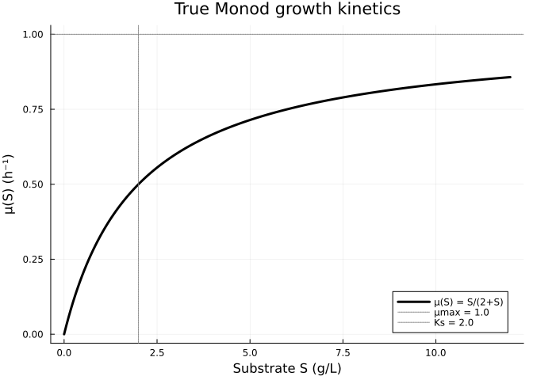
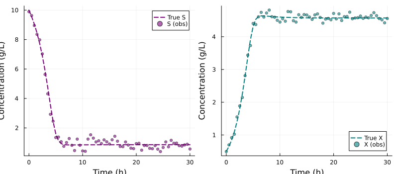
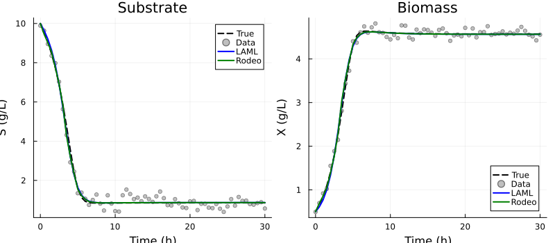
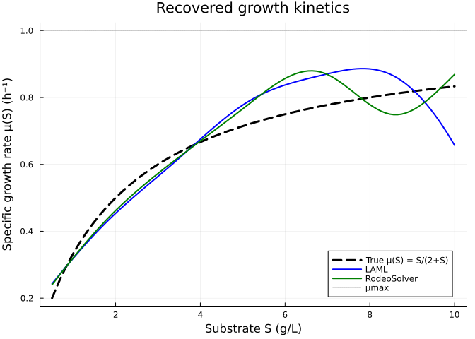
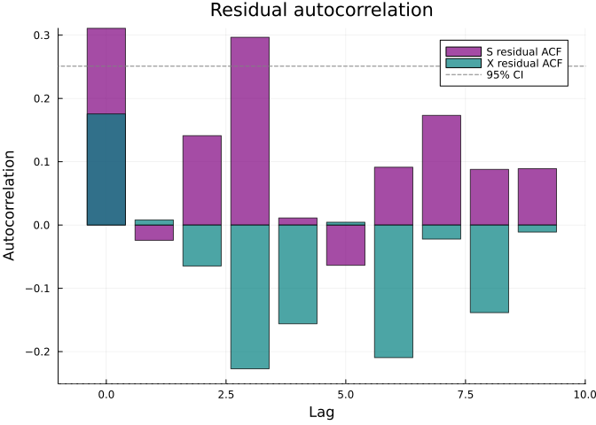
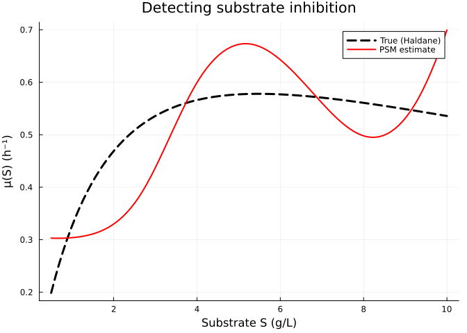
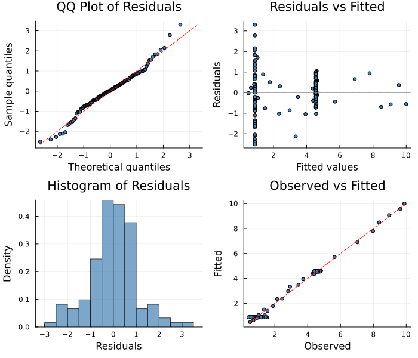

# Chemostat Dynamics: Recovering Microbial Growth Kinetics
Simon Frost
2026-04-02

- [Overview](#overview)
- [Setup](#setup)
- [The Chemostat Model](#the-chemostat-model)
  - [Visualise Monod kinetics](#visualise-monod-kinetics)
  - [Generate data](#generate-data)
- [Define and Fit the PSM](#define-and-fit-the-psm)
  - [LAML fit](#laml-fit)
  - [RodeoSolver fit (with
    uncertainty)](#rodeosolver-fit-with-uncertainty)
- [Results](#results)
  - [Fitted trajectories](#fitted-trajectories)
  - [Recovered growth kinetics](#recovered-growth-kinetics)
- [Residual Diagnostics](#residual-diagnostics)
- [Substrate Inhibition: What If Monod Is
  Wrong?](#substrate-inhibition-what-if-monod-is-wrong)
- [Diagnostic Plots](#diagnostic-plots)
- [Key Takeaways](#key-takeaways)

## Overview

The **chemostat** is a fundamental model in microbial ecology and
biotechnology. In a continuous-flow bioreactor, microorganisms grow on a
limiting substrate. The specific growth rate $\mu(S)$ — how fast
microbes grow as a function of substrate concentration — is a key
unknown quantity.

The classical **Monod kinetics** assumes
$\mu(S) = \mu_{\max} S / (K_s + S)$, analogous to Michaelis–Menten
enzyme kinetics. However, in practice:

- Substrate inhibition may cause growth to decline at high $S$
- Multiple limiting substrates may create more complex dependencies
- Overflow metabolism or maintenance requirements may alter the
  relationship

A PSM approach lets us **estimate $\mu(S)$ directly from time series
data**, without assuming a specific functional form.

## Setup

``` julia
using PartiallySpecifiedModels
using PartiallySpecifiedModels: solve
using OrdinaryDiffEq
using Plots
using Statistics
using Random
Random.seed!(42)
```

    TaskLocalRNG()

## The Chemostat Model

$$\begin{aligned}
\frac{dS}{dt} &= D(S_{\text{in}} - S) - \frac{\mu(S) \cdot X}{Y} \\
\frac{dX}{dt} &= \mu(S) \cdot X - D \cdot X
\end{aligned}$$

where:

| Parameter       | Description                  | Value       |
|-----------------|------------------------------|-------------|
| $D$             | Dilution rate                | 0.3 h⁻¹     |
| $S_{\text{in}}$ | Feed substrate concentration | 10 g/L      |
| $Y$             | Yield coefficient            | 0.5 g/g     |
| $\mu(S)$        | Specific growth rate         | **Unknown** |

The true growth kinetics follow Monod:
$\mu(S) = \frac{\mu_{\max} S}{K_s + S} = \frac{S}{2 + S}$ with
$\mu_{\max} = 1.0$ h⁻¹ and $K_s = 2.0$ g/L.

### Visualise Monod kinetics

``` julia
S_grid = range(0, 12, length=200)
μ_true = [S / (2.0 + S) for S in S_grid]

plot(S_grid, μ_true, lw=3, color=:black,
     xlabel="Substrate S (g/L)", ylabel="μ(S) (h⁻¹)",
     title="True Monod growth kinetics",
     label="μ(S) = S/(2+S)", legend=:bottomright)
hline!([1.0], ls=:dot, color=:gray, label="μmax = 1.0")
vline!([2.0], ls=:dot, color=:gray, label="Ks = 2.0")
```



### Generate data

We simulate a chemostat experiment: starting with high substrate and low
biomass, the system approaches a steady state as the microbes consume
the substrate.

``` julia
function chemo_true!(du, u, p, t)
    S, X = u
    μ = 1.0 * S / (2.0 + S)
    du[1] = 0.3 * (10.0 - S) - μ * X / 0.5
    du[2] = μ * X - 0.3 * X
end

u0 = [10.0, 0.5]
tspan = (0.0, 30.0)
sol_ode = OrdinaryDiffEq.solve(ODEProblem(chemo_true!, u0, tspan), Tsit5(), saveat=0.5)

data_t = sol_ode.t
σ_S, σ_X = 0.3, 0.1
data = max.(hcat(sol_ode[1,:], sol_ode[2,:]) .+
            hcat(σ_S .* randn(length(data_t)), σ_X .* randn(length(data_t))), 0.01)

p1 = plot(sol_ode.t, sol_ode[1,:], label="True S", lw=2, color=:purple, ls=:dash)
scatter!(p1, data_t, data[:, 1], label="S (obs)", ms=3, alpha=0.6, color=:purple)
p2 = plot(sol_ode.t, sol_ode[2,:], label="True X", lw=2, color=:teal, ls=:dash)
scatter!(p2, data_t, data[:, 2], label="X (obs)", ms=3, alpha=0.6, color=:teal)
plot(p1, p2, layout=(1, 2), size=(800, 350),
     xlabel="Time (h)", ylabel="Concentration (g/L)")
```



## Define and Fit the PSM

``` julia
function chemostat!(du, u, p, t)
    S, X = u
    μ_val = p.μ(max(S, 0.01))
    du[1] = 0.3 * (10.0 - S) - max(μ_val, 0.0) * X / 0.5
    du[2] = max(μ_val, 0.0) * X - 0.3 * X
end

approx_μ = BSplineApproximator(:μ, (0.0, 12.0), 8; initial=0.5)

prob = PSMProblem(chemostat!, u0, tspan, [approx_μ];
    data_times=data_t, data_values=data,
    obs_to_state=[1, 2],
    known_params=(D=0.3, Sin=10.0, Y=0.5),
    solver=Tsit5())
```

    PSMProblem{typeof(chemostat!), Vector{Float64}, Gaussian, Tsit5{typeof(OrdinaryDiffEqCore.trivial_limiter!), typeof(OrdinaryDiffEqCore.trivial_limiter!), Static.False}}(chemostat!, [10.0, 0.5], (0.0, 30.0), BSplineApproximator[BSplineApproximator(:μ, (0.0, 12.0), 8, PartiallySpecifiedModels.var"#6#7"{Float64}(0.5))], [0.0, 0.5, 1.0, 1.5, 2.0, 2.5, 3.0, 3.5, 4.0, 4.5  …  25.5, 26.0, 26.5, 27.0, 27.5, 28.0, 28.5, 29.0, 29.5, 30.0], [9.890992755564467 0.49480188331659125; 9.632637153300509 0.6972316752750717; … ; 0.8887669549405476 4.425115965910029; 0.5675476653902087 4.555125423173031], [1.0 1.0; 1.0 1.0; … ; 1.0 1.0; 1.0 1.0], [1, 2], (D = 0.3, Sin = 10.0, Y = 0.5), Gaussian(), Tsit5{typeof(OrdinaryDiffEqCore.trivial_limiter!), typeof(OrdinaryDiffEqCore.trivial_limiter!), Static.False}(OrdinaryDiffEqCore.trivial_limiter!, OrdinaryDiffEqCore.trivial_limiter!, static(false)), Dict{Symbol, Any}(), false, Float64[], nothing)

### LAML fit

    IRLS+LAML: 8 params, 122 data, 1 smooth terms
    Initial θ: [3.658e-5]
    Iter 0: obj=319.606, SS=639.19, θ=[3.66e-5]
    Iter 1: obj=307.69, SS=615.359, θ=[3.66e-5]
    Iter 2: obj=296.971, SS=593.925, θ=[3.66e-5]
    Iter 3: obj=287.536, SS=575.057, θ=[3.66e-5]
    LAML init: ρ = [0.0]
    LAML-FS iter 1: σ̂²=8.202e+00 λ = [0.04488]
    LAML-FS iter 2: σ̂²=4.870e+00 λ = [0.04369]
    LAML-FS iter 3: σ̂²=4.866e+00 λ = [0.04375]
    LAML-FS iter 4: σ̂²=4.866e+00 λ = [0.04375]
    LAML-FS iter 5: σ̂²=4.866e+00 λ = [0.04375]
    LAML-FS iter 6: σ̂²=4.866e+00 λ = [0.04375]
    LAML-FS converged at iteration 6
    LAML-Newton iter 1: V=-1.179603e+02 |grad|=3.319e-08
    Iter 4: obj=276.869, SS=530.996, θ=[0.0438]
    LAML init: ρ = [-3.129]
    LAML-FS iter 1: σ̂²=4.539e+00 λ = [0.02209]
    LAML-FS iter 2: σ̂²=4.447e+00 λ = [0.02444]
    LAML-FS iter 3: σ̂²=4.457e+00 λ = [0.02408]
    LAML-FS iter 4: σ̂²=4.455e+00 λ = [0.02413]
    LAML-FS iter 5: σ̂²=4.455e+00 λ = [0.02412]
    LAML-FS iter 9: σ̂²=4.455e+00 λ = [0.02412]
    LAML-FS converged at iteration 9
    LAML-Newton iter 1: V=-1.043406e+02 |grad|=3.606e-08
    LAML init: ρ = [-3.725]
    LAML-FS iter 1: σ̂²=4.307e+00 λ = [0.02443]
    LAML-FS iter 2: σ̂²=4.308e+00 λ = [0.02439]
    LAML-FS iter 3: σ̂²=4.308e+00 λ = [0.02439]
    LAML-FS iter 4: σ̂²=4.308e+00 λ = [0.02439]
    LAML-FS iter 5: σ̂²=4.308e+00 λ = [0.02439]
    LAML-FS iter 7: σ̂²=4.308e+00 λ = [0.02439]
    LAML-FS converged at iteration 7
    LAML-Newton iter 1: V=-1.006782e+02 |grad|=3.333e-08
    LAML init: ρ = [-3.713]
    LAML-FS iter 1: σ̂²=4.180e+00 λ = [0.02753]
    LAML-FS iter 2: σ̂²=4.192e+00 λ = [0.02704]
    LAML-FS iter 3: σ̂²=4.190e+00 λ = [0.02711]
    LAML-FS iter 4: σ̂²=4.190e+00 λ = [0.0271]
    LAML-FS iter 5: σ̂²=4.190e+00 λ = [0.0271]
    LAML-FS iter 8: σ̂²=4.190e+00 λ = [0.0271]
    LAML-FS converged at iteration 8
    LAML-Newton iter 1: V=-1.023890e+02 |grad|=4.587e-08
    LAML init: ρ = [-3.608]
    LAML-FS iter 1: σ̂²=4.080e+00 λ = [0.02984]
    LAML-FS iter 2: σ̂²=4.090e+00 λ = [0.0294]
    LAML-FS iter 3: σ̂²=4.088e+00 λ = [0.02947]
    LAML-FS iter 4: σ̂²=4.089e+00 λ = [0.02946]
    LAML-FS iter 5: σ̂²=4.088e+00 λ = [0.02946]
    LAML-FS iter 8: σ̂²=4.088e+00 λ = [0.02946]
    LAML-FS converged at iteration 8
    LAML-Newton iter 1: V=-9.838408e+01 |grad|=4.613e-08
    LAML init: ρ = [-3.525]
    LAML-FS iter 1: σ̂²=3.980e+00 λ = [0.02934]
    LAML-FS iter 2: σ̂²=3.979e+00 λ = [0.02936]
    LAML-FS iter 3: σ̂²=3.979e+00 λ = [0.02935]
    LAML-FS iter 4: σ̂²=3.979e+00 λ = [0.02935]
    LAML-FS iter 5: σ̂²=3.979e+00 λ = [0.02935]
    LAML-FS iter 6: σ̂²=3.979e+00 λ = [0.02935]
    LAML-FS converged at iteration 6
    LAML-Newton iter 1: V=-9.715751e+01 |grad|=1.183e-07
    LAML init: ρ = [-3.528]
    LAML-FS iter 1: σ̂²=3.854e+00 λ = [0.03127]
    LAML-FS iter 2: σ̂²=3.860e+00 λ = [0.03098]
    LAML-FS iter 3: σ̂²=3.859e+00 λ = [0.03102]
    LAML-FS iter 4: σ̂²=3.859e+00 λ = [0.03102]
    LAML-FS iter 5: σ̂²=3.859e+00 λ = [0.03102]
    LAML-FS iter 7: σ̂²=3.859e+00 λ = [0.03102]
    LAML-FS converged at iteration 7
    LAML-Newton iter 1: V=-9.658123e+01 |grad|=1.310e-07
    Iter 10: obj=228.317, SS=445.858, θ=[0.031]
    LAML init: ρ = [-3.473]
    LAML-FS iter 1: σ̂²=3.743e+00 λ = [0.03185]
    LAML-FS iter 2: σ̂²=3.745e+00 λ = [0.03175]
    LAML-FS iter 3: σ̂²=3.745e+00 λ = [0.03176]
    LAML-FS iter 4: σ̂²=3.745e+00 λ = [0.03176]
    LAML-FS iter 5: σ̂²=3.745e+00 λ = [0.03176]
    LAML-FS iter 6: σ̂²=3.745e+00 λ = [0.03176]
    LAML-FS converged at iteration 6
    LAML-Newton iter 1: V=-9.292612e+01 |grad|=1.437e-07
    LAML init: ρ = [-3.45]
    LAML-FS iter 1: σ̂²=3.639e+00 λ = [0.03257]
    LAML-FS iter 2: σ̂²=3.641e+00 λ = [0.03244]
    LAML-FS iter 3: σ̂²=3.640e+00 λ = [0.03246]
    LAML-FS iter 4: σ̂²=3.640e+00 λ = [0.03246]
    LAML-FS iter 5: σ̂²=3.640e+00 λ = [0.03246]
    LAML-FS iter 7: σ̂²=3.640e+00 λ = [0.03246]
    LAML-FS converged at iteration 7
    LAML-Newton iter 1: V=-9.560322e+01 |grad|=6.011e-08
    LAML init: ρ = [-3.428]
    LAML-FS iter 1: σ̂²=3.550e+00 λ = [0.03502]
    LAML-FS iter 2: σ̂²=3.557e+00 λ = [0.03464]
    LAML-FS iter 3: σ̂²=3.556e+00 λ = [0.0347]
    LAML-FS iter 4: σ̂²=3.556e+00 λ = [0.03469]
    LAML-FS iter 5: σ̂²=3.556e+00 λ = [0.03469]
    LAML-FS iter 7: σ̂²=3.556e+00 λ = [0.03469]
    LAML-FS converged at iteration 7
    LAML-Newton iter 1: V=-9.352817e+01 |grad|=1.373e-07
    LAML init: ρ = [-3.361]
    LAML-FS iter 1: σ̂²=3.451e+00 λ = [0.03541]
    LAML-FS iter 2: σ̂²=3.453e+00 λ = [0.03531]
    LAML-FS iter 3: σ̂²=3.453e+00 λ = [0.03532]
    LAML-FS iter 4: σ̂²=3.453e+00 λ = [0.03532]
    LAML-FS iter 5: σ̂²=3.453e+00 λ = [0.03532]
    LAML-FS iter 7: σ̂²=3.453e+00 λ = [0.03532]
    LAML-FS converged at iteration 7
    LAML-Newton iter 1: V=-9.117480e+01 |grad|=3.413e-08
    LAML init: ρ = [-3.343]
    LAML-FS iter 1: σ̂²=3.390e+00 λ = [0.03786]
    LAML-FS iter 2: σ̂²=3.396e+00 λ = [0.03748]
    LAML-FS iter 3: σ̂²=3.395e+00 λ = [0.03753]
    LAML-FS iter 4: σ̂²=3.395e+00 λ = [0.03752]
    LAML-FS iter 5: σ̂²=3.395e+00 λ = [0.03753]
    LAML-FS iter 7: σ̂²=3.395e+00 λ = [0.03753]
    LAML-FS converged at iteration 7
    LAML-Newton iter 1: V=-8.909888e+01 |grad|=1.442e-07
    LAML init: ρ = [-3.283]
    LAML-FS iter 1: σ̂²=3.281e+00 λ = [0.03792]
    LAML-FS iter 2: σ̂²=3.282e+00 λ = [0.03785]
    LAML-FS iter 3: σ̂²=3.282e+00 λ = [0.03787]
    LAML-FS iter 4: σ̂²=3.282e+00 λ = [0.03786]
    LAML-FS iter 5: σ̂²=3.282e+00 λ = [0.03786]
    LAML-FS iter 7: σ̂²=3.282e+00 λ = [0.03786]
    LAML-FS converged at iteration 7
    LAML-Newton iter 1: V=-8.640525e+01 |grad|=5.882e-08
    LAML init: ρ = [-3.274]
    LAML-FS iter 1: σ̂²=3.185e+00 λ = [0.03962]
    LAML-FS iter 2: σ̂²=3.189e+00 λ = [0.03936]
    LAML-FS iter 3: σ̂²=3.188e+00 λ = [0.0394]
    LAML-FS iter 4: σ̂²=3.188e+00 λ = [0.0394]
    LAML-FS iter 5: σ̂²=3.188e+00 λ = [0.0394]
    LAML-FS iter 7: σ̂²=3.188e+00 λ = [0.0394]
    LAML-FS converged at iteration 7
    LAML-Newton iter 1: V=-8.642977e+01 |grad|=8.971e-08
    LAML init: ρ = [-3.234]
    LAML-FS iter 1: σ̂²=3.040e+00 λ = [0.03828]
    LAML-FS iter 2: σ̂²=3.037e+00 λ = [0.03846]
    LAML-FS iter 3: σ̂²=3.038e+00 λ = [0.03843]
    LAML-FS iter 4: σ̂²=3.038e+00 λ = [0.03843]
    LAML-FS iter 5: σ̂²=3.038e+00 λ = [0.03843]
    LAML-FS iter 7: σ̂²=3.038e+00 λ = [0.03843]
    LAML-FS converged at iteration 7
    LAML-Newton iter 1: V=-8.356582e+01 |grad|=1.295e-07
    LAML init: ρ = [-3.259]
    LAML-FS iter 1: σ̂²=2.888e+00 λ = [0.04012]
    LAML-FS iter 2: σ̂²=2.892e+00 λ = [0.03993]
    LAML-FS iter 3: σ̂²=2.891e+00 λ = [0.03995]
    LAML-FS iter 4: σ̂²=2.892e+00 λ = [0.03995]
    LAML-FS iter 5: σ̂²=2.892e+00 λ = [0.03995]
    LAML-FS iter 6: σ̂²=2.892e+00 λ = [0.03995]
    LAML-FS converged at iteration 6
    LAML-Newton iter 1: V=-8.098798e+01 |grad|=1.080e-07
    LAML init: ρ = [-3.22]
    LAML-FS iter 1: σ̂²=2.725e+00 λ = [0.03953]
    LAML-FS iter 2: σ̂²=2.724e+00 λ = [0.03958]
    LAML-FS iter 3: σ̂²=2.725e+00 λ = [0.03958]
    LAML-FS iter 4: σ̂²=2.725e+00 λ = [0.03958]
    LAML-FS iter 5: σ̂²=2.725e+00 λ = [0.03958]
    LAML-FS iter 6: σ̂²=2.725e+00 λ = [0.03958]
    LAML-FS converged at iteration 6
    LAML-Newton iter 1: V=-8.107828e+01 |grad|=4.998e-08
    Iter 20: obj=153.583, SS=298.198, θ=[0.0396]
    LAML init: ρ = [-3.229]
    LAML-FS iter 1: σ̂²=2.518e+00 λ = [0.03821]
    LAML-FS iter 2: σ̂²=2.515e+00 λ = [0.03837]
    LAML-FS iter 3: σ̂²=2.515e+00 λ = [0.03835]
    LAML-FS iter 4: σ̂²=2.515e+00 λ = [0.03835]
    LAML-FS iter 5: σ̂²=2.515e+00 λ = [0.03835]
    LAML-FS iter 6: σ̂²=2.515e+00 λ = [0.03835]
    LAML-FS converged at iteration 6
    LAML-Newton iter 1: V=-7.344859e+01 |grad|=1.548e-07
    LAML init: ρ = [-3.261]
    LAML-FS iter 1: σ̂²=2.380e+00 λ = [0.03756]
    LAML-FS iter 2: σ̂²=2.378e+00 λ = [0.03765]
    LAML-FS iter 3: σ̂²=2.378e+00 λ = [0.03764]
    LAML-FS iter 4: σ̂²=2.378e+00 λ = [0.03764]
    LAML-FS iter 5: σ̂²=2.378e+00 λ = [0.03764]
    LAML-FS iter 6: σ̂²=2.378e+00 λ = [0.03764]
    LAML-FS converged at iteration 6
    LAML-Newton iter 1: V=-6.906590e+01 |grad|=9.751e-08
    LAML init: ρ = [-3.28]
    LAML-FS iter 1: σ̂²=2.220e+00 λ = [0.0369]
    LAML-FS iter 2: σ̂²=2.219e+00 λ = [0.03698]
    LAML-FS iter 3: σ̂²=2.219e+00 λ = [0.03697]
    LAML-FS iter 4: σ̂²=2.219e+00 λ = [0.03697]
    LAML-FS iter 5: σ̂²=2.219e+00 λ = [0.03697]
    LAML-FS iter 6: σ̂²=2.219e+00 λ = [0.03697]
    LAML-FS converged at iteration 6
    LAML-Newton iter 1: V=-6.576914e+01 |grad|=9.127e-08
    LAML init: ρ = [-3.298]
    LAML-FS iter 1: σ̂²=2.058e+00 λ = [0.0366]
    LAML-FS iter 2: σ̂²=2.058e+00 λ = [0.03664]
    LAML-FS iter 3: σ̂²=2.058e+00 λ = [0.03664]
    LAML-FS iter 4: σ̂²=2.058e+00 λ = [0.03664]
    LAML-FS iter 5: σ̂²=2.058e+00 λ = [0.03664]
    LAML-FS iter 6: σ̂²=2.058e+00 λ = [0.03664]
    LAML-FS converged at iteration 6
    LAML-Newton iter 1: V=-6.081916e+01 |grad|=2.854e-08
    LAML init: ρ = [-3.307]
    LAML-FS iter 1: σ̂²=1.907e+00 λ = [0.03576]
    LAML-FS iter 2: σ̂²=1.905e+00 λ = [0.03586]
    LAML-FS iter 3: σ̂²=1.905e+00 λ = [0.03585]
    LAML-FS iter 4: σ̂²=1.905e+00 λ = [0.03585]
    LAML-FS iter 5: σ̂²=1.905e+00 λ = [0.03585]
    LAML-FS iter 6: σ̂²=1.905e+00 λ = [0.03585]
    LAML-FS converged at iteration 6
    LAML-Newton iter 1: V=-5.631971e+01 |grad|=7.502e-08
    LAML init: ρ = [-3.328]
    LAML-FS iter 1: σ̂²=1.753e+00 λ = [0.03466]
    LAML-FS iter 2: σ̂²=1.752e+00 λ = [0.0348]
    LAML-FS iter 3: σ̂²=1.752e+00 λ = [0.03479]
    LAML-FS iter 4: σ̂²=1.752e+00 λ = [0.03479]
    LAML-FS iter 5: σ̂²=1.752e+00 λ = [0.03479]
    LAML-FS iter 6: σ̂²=1.752e+00 λ = [0.03479]
    LAML-FS converged at iteration 6
    LAML-Newton iter 1: V=-5.162473e+01 |grad|=1.567e-07
    LAML init: ρ = [-3.359]
    LAML-FS iter 1: σ̂²=1.611e+00 λ = [0.03225]
    LAML-FS iter 2: σ̂²=1.608e+00 λ = [0.03258]
    LAML-FS iter 3: σ̂²=1.608e+00 λ = [0.03253]
    LAML-FS iter 4: σ̂²=1.608e+00 λ = [0.03254]
    LAML-FS iter 5: σ̂²=1.608e+00 λ = [0.03254]
    LAML-FS iter 7: σ̂²=1.608e+00 λ = [0.03254]
    LAML-FS converged at iteration 7
    LAML-Newton iter 1: V=-4.600416e+01 |grad|=8.720e-08
    LAML init: ρ = [-3.425]
    LAML-FS iter 1: σ̂²=1.456e+00 λ = [0.02799]
    LAML-FS iter 2: σ̂²=1.451e+00 λ = [0.02859]
    LAML-FS iter 3: σ̂²=1.451e+00 λ = [0.0285]
    LAML-FS iter 4: σ̂²=1.451e+00 λ = [0.02851]
    LAML-FS iter 5: σ̂²=1.451e+00 λ = [0.02851]
    LAML-FS iter 8: σ̂²=1.451e+00 λ = [0.02851]
    LAML-FS converged at iteration 8
    LAML-Newton iter 1: V=-3.830397e+01 |grad|=2.942e-08
    LAML init: ρ = [-3.557]
    LAML-FS iter 1: σ̂²=1.246e+00 λ = [0.01996]
    LAML-FS iter 2: σ̂²=1.237e+00 λ = [0.02097]
    LAML-FS iter 3: σ̂²=1.238e+00 λ = [0.02083]
    LAML-FS iter 4: σ̂²=1.238e+00 λ = [0.02085]
    LAML-FS iter 5: σ̂²=1.238e+00 λ = [0.02084]
    LAML-FS iter 8: σ̂²=1.238e+00 λ = [0.02084]
    LAML-FS converged at iteration 8
    LAML-Newton iter 1: V=-2.744683e+01 |grad|=5.920e-08
    LAML init: ρ = [-3.871]
    LAML-FS iter 1: σ̂²=7.829e-01 λ = [0.01928]
    LAML-FS iter 2: σ̂²=7.820e-01 λ = [0.01956]
    LAML-FS iter 3: σ̂²=7.822e-01 λ = [0.01951]
    LAML-FS iter 4: σ̂²=7.822e-01 λ = [0.01952]
    LAML-FS iter 5: σ̂²=7.822e-01 λ = [0.01952]
    LAML-FS iter 8: σ̂²=7.822e-01 λ = [0.01952]
    LAML-FS converged at iteration 8
    LAML-Newton iter 1: V=2.677139e+00 |grad|=9.989e-08
    Iter 30: obj=3.79383, SS=6.40736, θ=[0.0195]
    LAML init: ρ = [-3.936]
    LAML-FS iter 1: σ̂²=6.219e-02 λ = [0.002406]
    LAML-FS iter 2: σ̂²=5.371e-02 λ = [0.003004]
    LAML-FS iter 3: σ̂²=5.401e-02 λ = [0.00291]
    LAML-FS iter 4: σ̂²=5.396e-02 λ = [0.002923]
    LAML-FS iter 5: σ̂²=5.397e-02 λ = [0.002921]
    LAML-FS iter 9: σ̂²=5.397e-02 λ = [0.002922]
    LAML-FS converged at iteration 9
    LAML-Newton iter 1: V=1.597355e+02 |grad|=6.399e-08
    LAML init: ρ = [-5.836]
    LAML-FS iter 1: σ̂²=4.054e-02 λ = [0.001526]
    LAML-FS iter 2: σ̂²=3.965e-02 λ = [0.001681]
    LAML-FS iter 3: σ̂²=3.974e-02 λ = [0.001656]
    LAML-FS iter 4: σ̂²=3.973e-02 λ = [0.00166]
    LAML-FS iter 5: σ̂²=3.973e-02 λ = [0.001659]
    LAML-FS iter 9: σ̂²=3.973e-02 λ = [0.001659]
    LAML-FS converged at iteration 9
    LAML-Newton iter 1: V=1.815354e+02 |grad|=4.923e-08
    LAML init: ρ = [-6.401]
    LAML-FS iter 1: σ̂²=3.915e-02 λ = [0.002242]
    LAML-FS iter 2: σ̂²=3.944e-02 λ = [0.002149]
    LAML-FS iter 3: σ̂²=3.939e-02 λ = [0.002161]
    LAML-FS iter 4: σ̂²=3.940e-02 λ = [0.00216]
    LAML-FS iter 5: σ̂²=3.940e-02 λ = [0.00216]
    LAML-FS iter 8: σ̂²=3.940e-02 λ = [0.00216]
    LAML-FS converged at iteration 8
    LAML-Newton iter 1: V=1.782021e+02 |grad|=7.702e-08
    Converged at iter 33 (objective stable)

    Final: data_loss = 4.67516, penalty = 0.100979, EDF = 5.49
    Final θ: [0.001659]
    Data loss: 4.68
    EDF: 5.49

### RodeoSolver fit (with uncertainty)

    RodeoSolver: n_steps=200, n_deriv=3, method=basic, interrogate=kramer
      σ (IBM scale): [0.095, 0.0432]
      obs_var: 0.0357
      8 approximator params

    Stage 1: Nelder-Mead (derivative-free)...
    Iter     Function value    √(Σ(yᵢ-ȳ)²)/n 
    ------   --------------    --------------
         0     1.359367e+07     2.057742e+09
     * time: 0.013787031173706055
        40     1.950419e+01     1.057963e+02
     * time: 0.22847700119018555
        80    -1.015484e+01     7.910731e-01
     * time: 0.695120096206665
       120    -1.802579e+01     4.533810e-01
     * time: 0.7913548946380615
       160    -2.331371e+01     4.381614e-01
     * time: 0.8817610740661621
       200    -2.627359e+01     1.365776e-01
     * time: 0.9762799739837646
      NM loss: -26.329

    Stage 2: L-BFGS refinement...
    Iter     Function value   Gradient norm 
         0    -2.632876e+01     3.133903e+01
     * time: 6.198883056640625e-5
        20    -2.722711e+01     8.769959e-01
     * time: 0.7004189491271973
        40    -2.729078e+01     4.130655e+00
     * time: 1.1777889728546143
        60    -2.733287e+01     8.481795e-02
     * time: 1.6621367931365967
      Converged: true
      Final -loglik: -27.333

    Final: data_SS=4.5474 -loglik=-27.333
    Data loss: 4.55

## Results

### Fitted trajectories

``` julia
p1 = plot(sol_ode.t, sol_ode[1,:], label="True", lw=2, color=:black, ls=:dash,
          xlabel="Time (h)", ylabel="S (g/L)", title="Substrate")
scatter!(p1, data_t, data[:, 1], label="Data", ms=3, alpha=0.5, color=:gray)
plot!(p1, data_t, sol_laml.fitted_values[:, 1], label="LAML", lw=2, color=:blue)
plot!(p1, data_t, sol_rodeo.fitted_values[:, 1], label="Rodeo", lw=2, color=:green)

p2 = plot(sol_ode.t, sol_ode[2,:], label="True", lw=2, color=:black, ls=:dash,
          xlabel="Time (h)", ylabel="X (g/L)", title="Biomass")
scatter!(p2, data_t, data[:, 2], label="Data", ms=3, alpha=0.5, color=:gray)
plot!(p2, data_t, sol_laml.fitted_values[:, 2], label="LAML", lw=2, color=:blue)
plot!(p2, data_t, sol_rodeo.fitted_values[:, 2], label="Rodeo", lw=2, color=:green)

plot(p1, p2, layout=(1, 2), size=(800, 350))
```



### Recovered growth kinetics

``` julia
S_eval = range(0.5, 10.0, length=100)
μ_true_vals = [S / (2.0 + S) for S in S_eval]
μ_laml = [sol_laml.unknown_functions[:μ](S) for S in S_eval]
μ_rodeo = [sol_rodeo.unknown_functions[:μ](S) for S in S_eval]

plot(S_eval, μ_true_vals, label="True μ(S) = S/(2+S)", lw=3, color=:black, ls=:dash,
     xlabel="Substrate S (g/L)", ylabel="Specific growth rate μ(S) (h⁻¹)",
     title="Recovered growth kinetics", legend=:bottomright)
plot!(S_eval, μ_laml, label="LAML", lw=2, color=:blue)
plot!(S_eval, μ_rodeo, label="RodeoSolver", lw=2, color=:green)
hline!([1.0], ls=:dot, color=:gray, alpha=0.5, label="μmax")
```



Both solvers recover the saturating Monod curve without assuming any
parametric form. The key features are correctly identified:

1.  **Linear increase** at low substrate concentrations (first-order
    kinetics)
2.  **Saturation** approaching $\mu_{\max}$ at high concentrations
3.  **Half-saturation** correctly located near $K_s = 2$ g/L

## Residual Diagnostics

Good model fit can be verified using the built-in residual diagnostics:

    Residual diagnostics (LAML):
      RMSE S: 0.255
      RMSE X: 0.1079
      Durbin-Watson: [1.336, 1.565]

``` julia
acf = diag.acf
nlags = size(acf, 1) - 1
p_acf = bar(0:nlags, acf[:, 1], label="S residual ACF", alpha=0.7, color=:purple,
            xlabel="Lag", ylabel="Autocorrelation",
            title="Residual autocorrelation")
bar!(0:nlags, acf[:, 2], label="X residual ACF", alpha=0.7, color=:teal)
hline!([1.96 / sqrt(length(data_t)), -1.96 / sqrt(length(data_t))],
       ls=:dash, color=:gray, label="95% CI")
p_acf
```



## Substrate Inhibition: What If Monod Is Wrong?

In many industrial fermentations, high substrate concentrations actually
**inhibit** growth. Let’s see what happens when the true kinetics
include inhibition:

``` julia
# Haldane kinetics: μ(S) = μmax*S / (Ks + S + S²/Ki)
function chemo_haldane!(du, u, p, t)
    S, X = u
    μ = 1.0 * S / (2.0 + S + S^2 / 15.0)  # Ki = 15
    du[1] = 0.3 * (10.0 - S) - μ * X / 0.5
    du[2] = μ * X - 0.3 * X
end

Random.seed!(123)
sol_haldane = OrdinaryDiffEq.solve(ODEProblem(chemo_haldane!, u0, tspan), Tsit5(), saveat=0.5)
data_haldane = max.(hcat(sol_haldane[1,:], sol_haldane[2,:]) .+
                    hcat(0.3 .* randn(length(sol_haldane.t)), 0.1 .* randn(length(sol_haldane.t))), 0.01)

prob_h = PSMProblem(chemostat!, u0, tspan, [BSplineApproximator(:μ, (0.0, 12.0), 10; initial=0.5)];
    data_times=sol_haldane.t, data_values=data_haldane,
    obs_to_state=[1, 2], known_params=(D=0.3, Sin=10.0, Y=0.5), solver=Tsit5())

sol_h = solve(prob_h, LAML(maxiters=100, verbose=false))

S_eval_h = range(0.5, 10.0, length=100)
μ_haldane = [S / (2.0 + S + S^2 / 15.0) for S in S_eval_h]
μ_est_h = [sol_h.unknown_functions[:μ](S) for S in S_eval_h]

plot(S_eval_h, μ_haldane, label="True (Haldane)", lw=3, color=:black, ls=:dash,
     xlabel="Substrate S (g/L)", ylabel="μ(S) (h⁻¹)",
     title="Detecting substrate inhibition", legend=:topright)
plot!(S_eval_h, μ_est_h, label="PSM estimate", lw=2, color=:red)
```



The PSM successfully detects the **non-monotonic** growth kinetics — the
specific growth rate increases, peaks, and then declines — without any
assumption about inhibition.

## Diagnostic Plots

A standard 4-panel diagnostic display assesses residual behaviour. The
QQ plot checks normality of standardized residuals, “Residuals vs
Fitted” detects systematic patterns, the histogram visualises the
residual distribution, and “Observed vs Fitted” checks overall
calibration.

``` julia
using PartiallySpecifiedModels: appraise

diag = appraise(sol_laml)

p_qq = scatter(diag.qq_theoretical, diag.qq_sample,
    xlabel="Theoretical quantiles", ylabel="Sample quantiles",
    title="QQ Plot of Residuals", ms=3, legend=false, color=:steelblue)
mn, mx = extrema(vcat(diag.qq_theoretical, diag.qq_sample))
plot!(p_qq, [mn, mx], [mn, mx], color=:red, ls=:dash, label="")

p_rf = scatter(diag.fitted, diag.residuals,
    xlabel="Fitted values", ylabel="Residuals",
    title="Residuals vs Fitted", ms=3, legend=false, color=:steelblue)
hline!(p_rf, [0], color=:gray, ls=:dot)

p_hist = histogram(diag.residuals, normalize=:pdf,
    xlabel="Residuals", ylabel="Density",
    title="Histogram of Residuals", legend=false, color=:steelblue, alpha=0.7)

p_of = scatter(diag.observed, diag.fitted,
    xlabel="Observed", ylabel="Fitted",
    title="Observed vs Fitted", ms=3, legend=false, color=:steelblue)
mn2, mx2 = extrema(vcat(diag.observed, diag.fitted))
plot!(p_of, [mn2, mx2], [mn2, mx2], color=:red, ls=:dash, label="")

plot(p_qq, p_rf, p_hist, p_of, layout=(2, 2), size=(700, 600))
```



    Durbin-Watson: 1.336, 1.565

## Key Takeaways

1.  **Chemostat dynamics** are a natural fit for PSMs — the growth
    kinetics are the main unknown
2.  **Both LAML and RodeoSolver** accurately recover Monod kinetics from
    noisy time series
3.  **Non-standard kinetics** (e.g., substrate inhibition) are detected
    automatically
4.  **Residual diagnostics** help verify model adequacy and detect
    systematic departures
