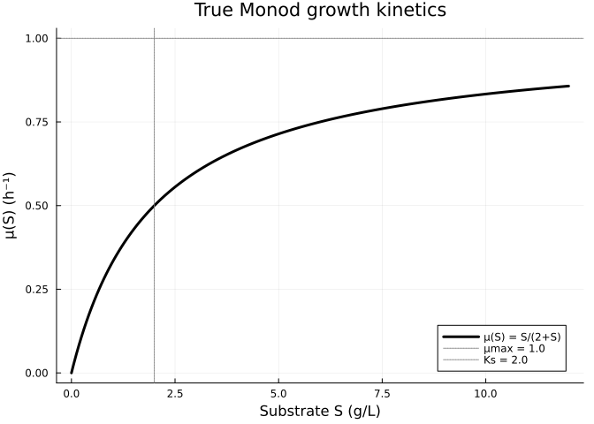
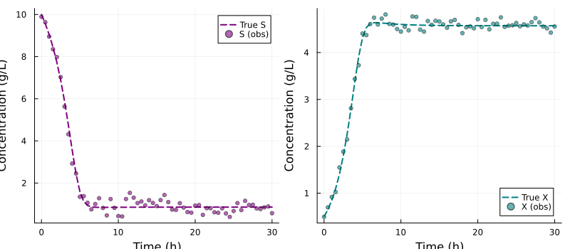
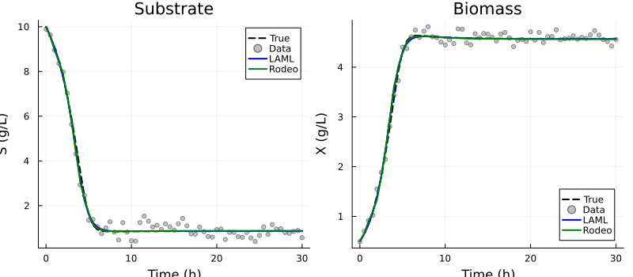
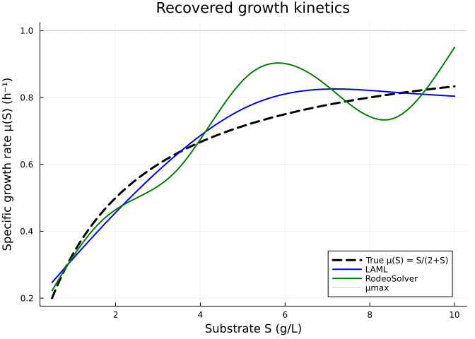
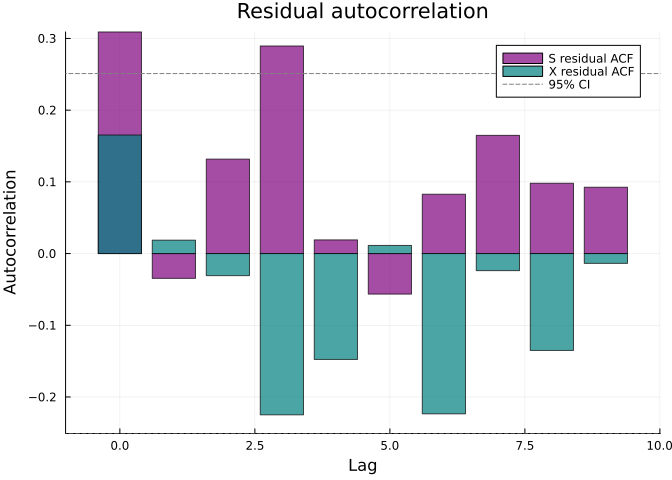
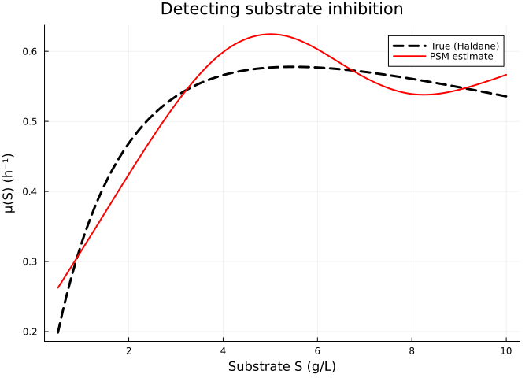
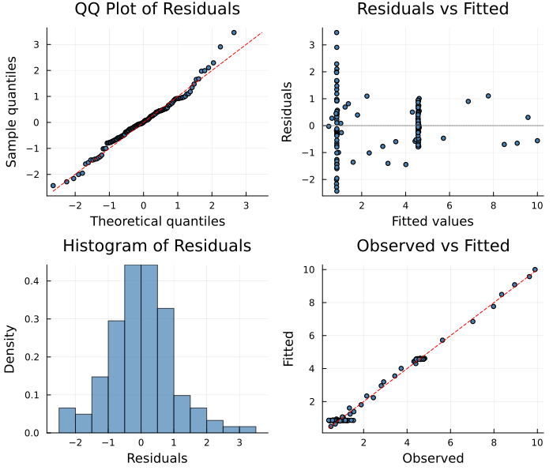

# Chemostat Dynamics: Recovering Microbial Growth Kinetics
Simon Frost
2026-09-04

- [Overview](#overview)
- [Setup](#setup)
- [The Chemostat Model](#the-chemostat-model)
  - [Visualise Monod kinetics](#visualise-monod-kinetics)
  - [Generate data](#generate-data)
- [Define and Fit the PSM](#define-and-fit-the-psm)
  - [LAML fit](#laml-fit)
  - [RodeoSolver fit (with
    uncertainty)](#rodeosolver-fit-with-uncertainty)
- [Results](#results)
  - [Fitted trajectories](#fitted-trajectories)
  - [Recovered growth kinetics](#recovered-growth-kinetics)
- [Residual Diagnostics](#residual-diagnostics)
- [Substrate Inhibition: What If Monod Is
  Wrong?](#substrate-inhibition-what-if-monod-is-wrong)
- [Diagnostic Plots](#diagnostic-plots)
- [Key Takeaways](#key-takeaways)

## Overview

The **chemostat** is a fundamental model in microbial ecology and
biotechnology. In a continuous-flow bioreactor, microorganisms grow on a
limiting substrate. The specific growth rate $\mu(S)$ — how fast
microbes grow as a function of substrate concentration — is a key
unknown quantity.

The classical **Monod kinetics** assumes
$\mu(S) = \mu_{\max} S / (K_s + S)$, analogous to Michaelis–Menten
enzyme kinetics. However, in practice:

- Substrate inhibition may cause growth to decline at high $S$
- Multiple limiting substrates may create more complex dependencies
- Overflow metabolism or maintenance requirements may alter the
  relationship

A PSM approach lets us **estimate $\mu(S)$ directly from time series
data**, without assuming a specific functional form.

## Setup

``` julia
using PartiallySpecifiedModels
using PartiallySpecifiedModels: solve
using OrdinaryDiffEq
using Plots
using Statistics
using Random
Random.seed!(42)
```

    TaskLocalRNG()

## The Chemostat Model

$$\begin{aligned}
\frac{dS}{dt} &= D(S_{\text{in}} - S) - \frac{\mu(S) \cdot X}{Y} \\
\frac{dX}{dt} &= \mu(S) \cdot X - D \cdot X
\end{aligned}$$

where:

| Parameter       | Description                  | Value       |
|-----------------|------------------------------|-------------|
| $D$             | Dilution rate                | 0.3 h⁻¹     |
| $S_{\text{in}}$ | Feed substrate concentration | 10 g/L      |
| $Y$             | Yield coefficient            | 0.5 g/g     |
| $\mu(S)$        | Specific growth rate         | **Unknown** |

The true growth kinetics follow Monod:
$\mu(S) = \frac{\mu_{\max} S}{K_s + S} = \frac{S}{2 + S}$ with
$\mu_{\max} = 1.0$ h⁻¹ and $K_s = 2.0$ g/L.

### Visualise Monod kinetics

``` julia
S_grid = range(0, 12, length=200)
μ_true = [S / (2.0 + S) for S in S_grid]

plot(S_grid, μ_true, lw=3, color=:black,
     xlabel="Substrate S (g/L)", ylabel="μ(S) (h⁻¹)",
     title="True Monod growth kinetics",
     label="μ(S) = S/(2+S)", legend=:bottomright)
hline!([1.0], ls=:dot, color=:gray, label="μmax = 1.0")
vline!([2.0], ls=:dot, color=:gray, label="Ks = 2.0")
```



### Generate data

We simulate a chemostat experiment: starting with high substrate and low
biomass, the system approaches a steady state as the microbes consume
the substrate.

``` julia
function chemo_true!(du, u, p, t)
    S, X = u
    μ = 1.0 * S / (2.0 + S)
    du[1] = 0.3 * (10.0 - S) - μ * X / 0.5
    du[2] = μ * X - 0.3 * X
end

u0 = [10.0, 0.5]
tspan = (0.0, 30.0)
sol_ode = OrdinaryDiffEq.solve(ODEProblem(chemo_true!, u0, tspan), Tsit5(), saveat=0.5)

data_t = sol_ode.t
σ_S, σ_X = 0.3, 0.1
data = max.(hcat(sol_ode[1,:], sol_ode[2,:]) .+
            hcat(σ_S .* randn(length(data_t)), σ_X .* randn(length(data_t))), 0.01)

p1 = plot(sol_ode.t, sol_ode[1,:], label="True S", lw=2, color=:purple, ls=:dash)
scatter!(p1, data_t, data[:, 1], label="S (obs)", ms=3, alpha=0.6, color=:purple)
p2 = plot(sol_ode.t, sol_ode[2,:], label="True X", lw=2, color=:teal, ls=:dash)
scatter!(p2, data_t, data[:, 2], label="X (obs)", ms=3, alpha=0.6, color=:teal)
plot(p1, p2, layout=(1, 2), size=(800, 350),
     xlabel="Time (h)", ylabel="Concentration (g/L)")
```



## Define and Fit the PSM

``` julia
function chemostat!(du, u, p, t)
    S, X = u
    μ_val = p.μ(max(S, 0.01))
    du[1] = 0.3 * (10.0 - S) - max(μ_val, 0.0) * X / 0.5
    du[2] = max(μ_val, 0.0) * X - 0.3 * X
end

approx_μ = BSplineApproximator(:μ, (0.0, 12.0), 8; initial=S -> 0.5*S/(2.0+S))

prob = PSMProblem(chemostat!, u0, tspan, [approx_μ];
    data_times=data_t, data_values=data,
    obs_to_state=[1, 2],
    known_params=(D=0.3, Sin=10.0, Y=0.5),
    solver=Tsit5())
```

    PSMProblem{typeof(chemostat!), Vector{Float64}, Gaussian, Tsit5{typeof(OrdinaryDiffEqCore.trivial_limiter!), typeof(OrdinaryDiffEqCore.trivial_limiter!), Static.False}}(chemostat!, [10.0, 0.5], (0.0, 30.0), BSplineApproximator[BSplineApproximator(:μ, (0.0, 12.0), 8, var"#5#6"())], [0.0, 0.5, 1.0, 1.5, 2.0, 2.5, 3.0, 3.5, 4.0, 4.5  …  25.5, 26.0, 26.5, 27.0, 27.5, 28.0, 28.5, 29.0, 29.5, 30.0], [9.890992755564467 0.49480188331659125; 9.632637153300509 0.6972316752750717; … ; 0.8887669549405476 4.425115965910029; 0.5675476653902087 4.555125423173031], [1.0 1.0; 1.0 1.0; … ; 1.0 1.0; 1.0 1.0], [1, 2], (D = 0.3, Sin = 10.0, Y = 0.5), Gaussian(), Tsit5{typeof(OrdinaryDiffEqCore.trivial_limiter!), typeof(OrdinaryDiffEqCore.trivial_limiter!), Static.False}(OrdinaryDiffEqCore.trivial_limiter!, OrdinaryDiffEqCore.trivial_limiter!, static(false)), Dict{Symbol, Any}(), false, Float64[], nothing)

### LAML fit

    IRLS+LAML: 8 params, 122 data, 1 smooth terms
    Initial θ: [3.658e-5]
    Iter 0: obj=722.935, SS=1445.86, θ=[3.66e-5]
    Iter 1: obj=668.112, SS=1336.19, θ=[3.66e-5]
    Iter 2: obj=620.414, SS=1240.78, θ=[3.66e-5]
    Iter 3: obj=580.558, SS=1161.08, θ=[3.66e-5]
    LAML init: ρ = [-10.0]
    LAML-FS iter 1: σ̂²=9.528e-02 λ = [1.35e-5]
    LAML-FS iter 2: σ̂²=7.995e-02 λ = [3.184e-6]
    LAML-FS iter 3: σ̂²=6.050e-02 λ = [7.478e-7]
    LAML-FS iter 4: σ̂²=4.837e-02 λ = [3.499e-7]
    LAML-FS iter 5: σ̂²=4.551e-02 λ = [2.947e-7]
    LAML-FS iter 10: σ̂²=4.501e-02 λ = [2.862e-7]
    LAML-FS iter 12: σ̂²=4.501e-02 λ = [2.862e-7]
    LAML-FS converged at iteration 12
    LAML-Newton iter 1: V=1.476656e+02 |grad|=1.676e-08
    Iter 4: obj=547.896, SS=1095.79, θ=[2.86e-7]
    LAML init: ρ = [-10.0]
    LAML-FS iter 1: σ̂²=1.581e-01 λ = [1.74e-5]
    LAML-FS iter 2: σ̂²=1.424e-01 λ = [5.501e-6]
    LAML-FS iter 3: σ̂²=1.198e-01 λ = [1.414e-6]
    LAML-FS iter 4: σ̂²=9.525e-02 λ = [4.597e-7]
    LAML-FS iter 5: σ̂²=8.397e-02 λ = [2.956e-7]
    LAML-FS iter 10: σ̂²=8.112e-02 λ = [2.656e-7]
    LAML-FS iter 13: σ̂²=8.112e-02 λ = [2.656e-7]
    LAML-FS converged at iteration 13
    LAML-Newton iter 1: V=1.120874e+02 |grad|=1.990e-08
    LAML init: ρ = [-10.0]
    LAML-FS iter 1: σ̂²=1.729e-01 λ = [2.308e-5]
    LAML-FS iter 2: σ̂²=1.642e-01 λ = [1.111e-5]
    LAML-FS iter 3: σ̂²=1.537e-01 λ = [4.654e-6]
    LAML-FS iter 4: σ̂²=1.396e-01 λ = [1.758e-6]
    LAML-FS iter 5: σ̂²=1.247e-01 λ = [7.889e-7]
    LAML-FS iter 10: σ̂²=1.122e-01 λ = [4.552e-7]
    LAML-FS iter 15: σ̂²=1.121e-01 λ = [4.55e-7]
    LAML-FS converged at iteration 15
    LAML-Newton iter 1: V=9.412644e+01 |grad|=8.846e-08
    LAML init: ρ = [-10.0]
    LAML-FS iter 1: σ̂²=1.708e-01 λ = [2.823e-5]
    LAML-FS iter 2: σ̂²=1.658e-01 λ = [1.73e-5]
    LAML-FS iter 3: σ̂²=1.605e-01 λ = [9.649e-6]
    LAML-FS iter 4: σ̂²=1.531e-01 λ = [4.554e-6]
    LAML-FS iter 5: σ̂²=1.418e-01 λ = [1.793e-6]
    LAML-FS iter 10: σ̂²=1.095e-01 λ = [3.276e-7]
    LAML-FS iter 17: σ̂²=1.094e-01 λ = [3.265e-7]
    LAML-FS converged at iteration 17
    LAML-Newton iter 1: V=9.469517e+01 |grad|=3.128e-08
    LAML init: ρ = [-10.0]
    LAML-FS iter 1: σ̂²=1.531e-01 λ = [3.769e-5]
    LAML-FS iter 2: σ̂²=1.518e-01 λ = [3.189e-5]
    LAML-FS iter 3: σ̂²=1.507e-01 λ = [2.705e-5]
    LAML-FS iter 4: σ̂²=1.495e-01 λ = [2.268e-5]
    LAML-FS iter 5: σ̂²=1.483e-01 λ = [1.856e-5]
    LAML-FS iter 10: σ̂²=1.318e-01 λ = [1.975e-6]
    LAML-FS iter 20: σ̂²=1.082e-01 λ = [3.865e-7]
    LAML-FS iter 24: σ̂²=1.082e-01 λ = [3.865e-7]
    LAML-FS converged at iteration 24
    LAML-Newton iter 1: V=9.595935e+01 |grad|=2.862e-08
    LAML init: ρ = [-10.0]
    LAML-FS iter 1: σ̂²=1.257e-01 λ = [5.289e-5]
    LAML-FS iter 2: σ̂²=1.263e-01 λ = [5.917e-5]
    LAML-FS iter 3: σ̂²=1.268e-01 λ = [6.369e-5]
    LAML-FS iter 4: σ̂²=1.271e-01 λ = [6.657e-5]
    LAML-FS iter 5: σ̂²=1.273e-01 λ = [6.828e-5]
    LAML-FS iter 10: σ̂²=1.276e-01 λ = [7.028e-5]
    LAML-FS iter 20: σ̂²=1.276e-01 λ = [7.037e-5]
    LAML-FS iter 22: σ̂²=1.276e-01 λ = [7.037e-5]
    LAML-FS converged at iteration 22
    LAML-Newton iter 1: V=9.970934e+01 |grad|=4.583e-08
    LAML init: ρ = [-9.562]
    LAML-FS iter 1: σ̂²=9.554e-02 λ = [9.646e-5]
    LAML-FS iter 2: σ̂²=9.643e-02 λ = [0.0001063]
    LAML-FS iter 3: σ̂²=9.674e-02 λ = [0.0001087]
    LAML-FS iter 4: σ̂²=9.682e-02 λ = [0.0001092]
    LAML-FS iter 5: σ̂²=9.683e-02 λ = [0.0001093]
    LAML-FS iter 10: σ̂²=9.684e-02 λ = [0.0001093]
    LAML-FS converged at iteration 10
    LAML-Newton iter 1: V=1.173354e+02 |grad|=3.064e-08
    Iter 10: obj=439.238, SS=875.365, θ=[0.000109]
    LAML init: ρ = [-9.121]
    LAML-FS iter 1: σ̂²=6.534e-02 λ = [9.175e-5]
    LAML-FS iter 2: σ̂²=6.489e-02 λ = [8.92e-5]
    LAML-FS iter 3: σ̂²=6.482e-02 λ = [8.873e-5]
    LAML-FS iter 4: σ̂²=6.481e-02 λ = [8.864e-5]
    LAML-FS iter 5: σ̂²=6.480e-02 λ = [8.862e-5]
    LAML-FS iter 9: σ̂²=6.480e-02 λ = [8.862e-5]
    LAML-FS converged at iteration 9
    LAML-Newton iter 1: V=1.411334e+02 |grad|=2.354e-08
    LAML init: ρ = [-9.331]
    LAML-FS iter 1: σ̂²=4.680e-02 λ = [3.843e-5]
    LAML-FS iter 2: σ̂²=4.430e-02 λ = [2.837e-5]
    LAML-FS iter 3: σ̂²=4.366e-02 λ = [2.519e-5]
    LAML-FS iter 4: σ̂²=4.344e-02 λ = [2.401e-5]
    LAML-FS iter 5: σ̂²=4.335e-02 λ = [2.355e-5]
    LAML-FS iter 10: σ̂²=4.330e-02 λ = [2.325e-5]
    LAML-FS iter 17: σ̂²=4.329e-02 λ = [2.324e-5]
    LAML-FS converged at iteration 17
    LAML-Newton iter 1: V=1.624700e+02 |grad|=2.537e-08
    LAML init: ρ = [-10.0]
    LAML-FS iter 1: σ̂²=3.952e-02 λ = [1.446e-5]
    LAML-FS iter 2: σ̂²=3.569e-02 λ = [9.473e-6]
    LAML-FS iter 3: σ̂²=3.489e-02 λ = [8.594e-6]
    LAML-FS iter 4: σ̂²=3.473e-02 λ = [8.441e-6]
    LAML-FS iter 5: σ̂²=3.471e-02 λ = [8.415e-6]
    LAML-FS iter 10: σ̂²=3.470e-02 λ = [8.409e-6]
    LAML-FS converged at iteration 10
    LAML-Newton iter 1: V=1.734536e+02 |grad|=1.737e-08
    LAML init: ρ = [-10.0]
    LAML-FS iter 1: σ̂²=4.460e-02 λ = [1.112e-5]
    LAML-FS iter 2: σ̂²=3.816e-02 λ = [6.292e-6]
    LAML-FS iter 3: σ̂²=3.687e-02 λ = [5.409e-6]
    LAML-FS iter 4: σ̂²=3.661e-02 λ = [5.217e-6]
    LAML-FS iter 5: σ̂²=3.655e-02 λ = [5.173e-6]
    LAML-FS iter 10: σ̂²=3.653e-02 λ = [5.159e-6]
    LAML-FS iter 12: σ̂²=3.653e-02 λ = [5.159e-6]
    LAML-FS converged at iteration 12
    LAML-Newton iter 1: V=1.694111e+02 |grad|=1.200e-08
    LAML init: ρ = [-10.0]
    LAML-FS iter 1: σ̂²=5.493e-02 λ = [1.124e-5]
    LAML-FS iter 2: σ̂²=4.710e-02 λ = [6.059e-6]
    LAML-FS iter 3: σ̂²=4.527e-02 λ = [4.844e-6]
    LAML-FS iter 4: σ̂²=4.476e-02 λ = [4.468e-6]
    LAML-FS iter 5: σ̂²=4.460e-02 λ = [4.337e-6]
    LAML-FS iter 10: σ̂²=4.450e-02 λ = [4.262e-6]
    LAML-FS iter 16: σ̂²=4.450e-02 λ = [4.261e-6]
    LAML-FS converged at iteration 16
    LAML-Newton iter 1: V=1.574255e+02 |grad|=2.525e-08
    LAML init: ρ = [-10.0]
    LAML-FS iter 1: σ̂²=6.636e-02 λ = [1.259e-5]
    LAML-FS iter 2: σ̂²=5.820e-02 λ = [7.66e-6]
    LAML-FS iter 3: σ̂²=5.642e-02 λ = [6.627e-6]
    LAML-FS iter 4: σ̂²=5.601e-02 λ = [6.398e-6]
    LAML-FS iter 5: σ̂²=5.592e-02 λ = [6.347e-6]
    LAML-FS iter 10: σ̂²=5.589e-02 λ = [6.332e-6]
    LAML-FS iter 12: σ̂²=5.589e-02 λ = [6.332e-6]
    LAML-FS converged at iteration 12
    LAML-Newton iter 1: V=1.446361e+02 |grad|=1.428e-08
    LAML init: ρ = [-10.0]
    LAML-FS iter 1: σ̂²=7.215e-02 λ = [1.47e-5]
    LAML-FS iter 2: σ̂²=6.571e-02 λ = [8.826e-6]
    LAML-FS iter 3: σ̂²=6.379e-02 λ = [6.77e-6]
    LAML-FS iter 4: σ̂²=6.294e-02 λ = [5.919e-6]
    LAML-FS iter 5: σ̂²=6.255e-02 λ = [5.542e-6]
    LAML-FS iter 10: σ̂²=6.221e-02 λ = [5.225e-6]
    LAML-FS iter 20: σ̂²=6.220e-02 λ = [5.218e-6]
    LAML-FS converged at iteration 20
    LAML-Newton iter 1: V=1.388384e+02 |grad|=9.513e-08
    LAML init: ρ = [-10.0]
    LAML-FS iter 1: σ̂²=7.588e-02 λ = [1.556e-5]
    LAML-FS iter 2: σ̂²=6.964e-02 λ = [9.045e-6]
    LAML-FS iter 3: σ̂²=6.739e-02 λ = [6.376e-6]
    LAML-FS iter 4: σ̂²=6.612e-02 λ = [5.022e-6]
    LAML-FS iter 5: σ̂²=6.531e-02 λ = [4.256e-6]
    LAML-FS iter 10: σ̂²=6.388e-02 λ = [3.095e-6]
    LAML-FS iter 20: σ̂²=6.363e-02 λ = [2.917e-6]
    LAML-FS iter 30: σ̂²=6.362e-02 λ = [2.913e-6]
    LAML-Newton iter 1: V=1.362177e+02 |grad|=1.380e-06
    LAML-Newton iter 2: V=1.362177e+02 |grad|=5.504e-08
    LAML init: ρ = [-10.0]
    LAML-FS iter 1: σ̂²=7.772e-02 λ = [1.661e-5]
    LAML-FS iter 2: σ̂²=7.212e-02 λ = [1.026e-5]
    LAML-FS iter 3: σ̂²=7.019e-02 λ = [7.559e-6]
    LAML-FS iter 4: σ̂²=6.910e-02 λ = [6.116e-6]
    LAML-FS iter 5: σ̂²=6.838e-02 λ = [5.258e-6]
    LAML-FS iter 10: σ̂²=6.700e-02 λ = [3.821e-6]
    LAML-FS iter 20: σ̂²=6.667e-02 λ = [3.532e-6]
    LAML-FS iter 30: σ̂²=6.666e-02 λ = [3.521e-6]
    LAML-Newton iter 1: V=1.340708e+02 |grad|=5.072e-06
    LAML-Newton iter 2: V=1.340708e+02 |grad|=4.767e-06
    LAML init: ρ = [-10.0]
    LAML-FS iter 1: σ̂²=7.844e-02 λ = [1.783e-5]
    LAML-FS iter 2: σ̂²=7.355e-02 λ = [1.178e-5]
    LAML-FS iter 3: σ̂²=7.199e-02 λ = [9.131e-6]
    LAML-FS iter 4: σ̂²=7.112e-02 λ = [7.655e-6]
    LAML-FS iter 5: σ̂²=7.055e-02 λ = [6.733e-6]
    LAML-FS iter 10: σ̂²=6.933e-02 λ = [4.994e-6]
    LAML-FS iter 20: σ̂²=6.894e-02 λ = [4.509e-6]
    LAML-FS iter 30: σ̂²=6.891e-02 λ = [4.474e-6]
    LAML-Newton iter 1: V=1.328636e+02 |grad|=2.085e-05
    LAML-Newton iter 2: V=1.328636e+02 |grad|=7.842e-07
    Iter 20: obj=340.622, SS=681.182, θ=[4.47e-6]
    LAML init: ρ = [-10.0]
    LAML-FS iter 1: σ̂²=7.848e-02 λ = [1.926e-5]
    LAML-FS iter 2: σ̂²=7.435e-02 λ = [1.387e-5]
    LAML-FS iter 3: σ̂²=7.322e-02 λ = [1.165e-5]
    LAML-FS iter 4: σ̂²=7.268e-02 λ = [1.049e-5]
    LAML-FS iter 5: σ̂²=7.236e-02 λ = [9.804e-6]
    LAML-FS iter 10: σ̂²=7.186e-02 λ = [8.705e-6]
    LAML-FS iter 20: σ̂²=7.177e-02 λ = [8.52e-6]
    LAML-FS iter 30: σ̂²=7.177e-02 λ = [8.515e-6]
    LAML-Newton iter 1: V=1.321242e+02 |grad|=7.572e-07
    LAML init: ρ = [-10.0]
    LAML-FS iter 1: σ̂²=7.780e-02 λ = [2.053e-5]
    LAML-FS iter 2: σ̂²=7.423e-02 λ = [1.536e-5]
    LAML-FS iter 3: σ̂²=7.328e-02 λ = [1.324e-5]
    LAML-FS iter 4: σ̂²=7.283e-02 λ = [1.213e-5]
    LAML-FS iter 5: σ̂²=7.258e-02 λ = [1.147e-5]
    LAML-FS iter 10: σ̂²=7.218e-02 λ = [1.04e-5]
    LAML-FS iter 20: σ̂²=7.210e-02 λ = [1.021e-5]
    LAML-FS iter 30: σ̂²=7.210e-02 λ = [1.021e-5]
    LAML-Newton iter 1: V=1.324225e+02 |grad|=7.025e-07
    LAML init: ρ = [-10.0]
    LAML-FS iter 1: σ̂²=7.656e-02 λ = [2.204e-5]
    LAML-FS iter 2: σ̂²=7.356e-02 λ = [1.737e-5]
    LAML-FS iter 3: σ̂²=7.284e-02 λ = [1.561e-5]
    LAML-FS iter 4: σ̂²=7.254e-02 λ = [1.479e-5]
    LAML-FS iter 5: σ̂²=7.239e-02 λ = [1.436e-5]
    LAML-FS iter 10: σ̂²=7.222e-02 λ = [1.385e-5]
    LAML-FS iter 20: σ̂²=7.221e-02 λ = [1.381e-5]
    LAML-FS iter 24: σ̂²=7.221e-02 λ = [1.381e-5]
    LAML-FS converged at iteration 24
    LAML-Newton iter 1: V=1.331635e+02 |grad|=6.928e-08
    LAML init: ρ = [-10.0]
    LAML-FS iter 1: σ̂²=7.065e-02 λ = [2.664e-5]
    LAML-FS iter 2: σ̂²=6.893e-02 λ = [2.353e-5]
    LAML-FS iter 3: σ̂²=6.862e-02 λ = [2.279e-5]
    LAML-FS iter 4: σ̂²=6.855e-02 λ = [2.259e-5]
    LAML-FS iter 5: σ̂²=6.853e-02 λ = [2.254e-5]
    LAML-FS iter 10: σ̂²=6.852e-02 λ = [2.251e-5]
    LAML-FS iter 12: σ̂²=6.852e-02 λ = [2.251e-5]
    LAML-FS converged at iteration 12
    LAML-Newton iter 1: V=1.380839e+02 |grad|=3.099e-09
    LAML init: ρ = [-10.0]
    LAML-FS iter 1: σ̂²=6.317e-02 λ = [3.224e-5]
    LAML-FS iter 2: σ̂²=6.230e-02 λ = [3.018e-5]
    LAML-FS iter 3: σ̂²=6.216e-02 λ = [2.979e-5]
    LAML-FS iter 4: σ̂²=6.213e-02 λ = [2.971e-5]
    LAML-FS iter 5: σ̂²=6.213e-02 λ = [2.97e-5]
    LAML-FS iter 9: σ̂²=6.213e-02 λ = [2.969e-5]
    LAML-FS converged at iteration 9
    LAML-Newton iter 1: V=1.453398e+02 |grad|=5.051e-09
    LAML init: ρ = [-10.0]
    LAML-FS iter 1: σ̂²=5.552e-02 λ = [3.841e-5]
    LAML-FS iter 2: σ̂²=5.519e-02 λ = [3.751e-5]
    LAML-FS iter 3: σ̂²=5.514e-02 λ = [3.738e-5]
    LAML-FS iter 4: σ̂²=5.514e-02 λ = [3.736e-5]
    LAML-FS iter 5: σ̂²=5.514e-02 λ = [3.736e-5]
    LAML-FS iter 8: σ̂²=5.514e-02 λ = [3.736e-5]
    LAML-FS converged at iteration 8
    LAML-Newton iter 1: V=1.537268e+02 |grad|=2.605e-09
    LAML init: ρ = [-10.0]
    LAML-FS iter 1: σ̂²=4.187e-02 λ = [4.468e-5]
    LAML-FS iter 2: σ̂²=4.185e-02 λ = [4.421e-5]
    LAML-FS iter 3: σ̂²=4.184e-02 λ = [4.39e-5]
    LAML-FS iter 4: σ̂²=4.184e-02 λ = [4.37e-5]
    LAML-FS iter 5: σ̂²=4.183e-02 λ = [4.357e-5]
    LAML-FS iter 10: σ̂²=4.182e-02 λ = [4.335e-5]
    LAML-FS iter 20: σ̂²=4.182e-02 λ = [4.332e-5]
    LAML-FS iter 25: σ̂²=4.182e-02 λ = [4.332e-5]
    LAML-FS converged at iteration 25
    LAML-Newton iter 1: V=1.795915e+02 |grad|=1.261e-07
    LAML init: ρ = [-10.0]
    LAML-FS iter 1: σ̂²=5.194e-02 λ = [3.261e-5]
    LAML-FS iter 2: σ̂²=5.136e-02 λ = [2.604e-5]
    LAML-FS iter 3: σ̂²=5.099e-02 λ = [2.239e-5]
    LAML-FS iter 4: σ̂²=5.076e-02 λ = [2.027e-5]
    LAML-FS iter 5: σ̂²=5.061e-02 λ = [1.901e-5]
    LAML-FS iter 10: σ̂²=5.038e-02 λ = [1.725e-5]
    LAML-FS iter 20: σ̂²=5.036e-02 λ = [1.709e-5]
    LAML-FS iter 28: σ̂²=5.036e-02 λ = [1.709e-5]
    LAML-FS converged at iteration 28
    LAML-Newton iter 1: V=1.676590e+02 |grad|=1.180e-07
    LAML init: ρ = [-10.0]
    LAML-FS iter 1: σ̂²=5.089e-02 λ = [1.858e-5]
    LAML-FS iter 2: σ̂²=4.843e-02 λ = [1.439e-5]
    LAML-FS iter 3: σ̂²=4.795e-02 λ = [1.288e-5]
    LAML-FS iter 4: σ̂²=4.776e-02 λ = [1.214e-5]
    LAML-FS iter 5: σ̂²=4.767e-02 λ = [1.174e-5]
    LAML-FS iter 10: σ̂²=4.754e-02 λ = [1.119e-5]
    LAML-FS iter 20: σ̂²=4.753e-02 λ = [1.113e-5]
    LAML-FS iter 29: σ̂²=4.753e-02 λ = [1.113e-5]
    LAML-FS converged at iteration 29
    LAML-Newton iter 1: V=1.667569e+02 |grad|=3.320e-08
    LAML init: ρ = [-10.0]
    LAML-FS iter 1: σ̂²=4.987e-02 λ = [1.667e-5]
    LAML-FS iter 2: σ̂²=4.662e-02 λ = [9.503e-6]
    LAML-FS iter 3: σ̂²=4.523e-02 λ = [6.532e-6]
    LAML-FS iter 4: σ̂²=4.441e-02 λ = [4.987e-6]
    LAML-FS iter 5: σ̂²=4.386e-02 λ = [4.112e-6]
    LAML-FS iter 10: σ̂²=4.295e-02 λ = [2.955e-6]
    LAML-FS iter 20: σ̂²=4.286e-02 λ = [2.866e-6]
    LAML-FS iter 29: σ̂²=4.286e-02 λ = [2.865e-6]
    LAML-FS converged at iteration 29
    LAML-Newton iter 1: V=1.710145e+02 |grad|=1.010e-07
    Iter 30: obj=5.1015, SS=10.179, θ=[2.87e-6]
    LAML init: ρ = [-10.0]
    LAML-FS iter 1: σ̂²=4.588e-02 λ = [1.879e-5]
    LAML-FS iter 2: σ̂²=4.370e-02 λ = [1.367e-5]
    LAML-FS iter 3: σ̂²=4.318e-02 λ = [1.265e-5]
    LAML-FS iter 4: σ̂²=4.307e-02 λ = [1.244e-5]
    LAML-FS iter 5: σ̂²=4.304e-02 λ = [1.24e-5]
    LAML-FS iter 10: σ̂²=4.304e-02 λ = [1.239e-5]
    LAML-FS iter 11: σ̂²=4.304e-02 λ = [1.239e-5]
    LAML-FS converged at iteration 11
    LAML-Newton iter 1: V=1.730653e+02 |grad|=1.224e-08
    LAML init: ρ = [-10.0]
    LAML-FS iter 1: σ̂²=4.477e-02 λ = [2.315e-5]
    LAML-FS iter 2: σ̂²=4.339e-02 λ = [1.879e-5]
    LAML-FS iter 3: σ̂²=4.307e-02 λ = [1.789e-5]
    LAML-FS iter 4: σ̂²=4.300e-02 λ = [1.771e-5]
    LAML-FS iter 5: σ̂²=4.299e-02 λ = [1.767e-5]
    LAML-FS iter 10: σ̂²=4.299e-02 λ = [1.766e-5]
    LAML-FS converged at iteration 10
    LAML-Newton iter 1: V=1.736832e+02 |grad|=5.932e-08
    LAML init: ρ = [-10.0]
    LAML-FS iter 1: σ̂²=4.340e-02 λ = [3.225e-5]
    LAML-FS iter 2: σ̂²=4.286e-02 λ = [2.948e-5]
    LAML-FS iter 3: σ̂²=4.274e-02 λ = [2.888e-5]
    LAML-FS iter 4: σ̂²=4.271e-02 λ = [2.875e-5]
    LAML-FS iter 5: σ̂²=4.270e-02 λ = [2.872e-5]
    LAML-FS iter 10: σ̂²=4.270e-02 λ = [2.871e-5]
    LAML-FS converged at iteration 10
    LAML-Newton iter 1: V=1.748774e+02 |grad|=4.871e-08
    LAML init: ρ = [-10.0]
    LAML-FS iter 1: σ̂²=4.229e-02 λ = [4.424e-5]
    LAML-FS iter 2: σ̂²=4.226e-02 λ = [4.397e-5]
    LAML-FS iter 3: σ̂²=4.225e-02 λ = [4.39e-5]
    LAML-FS iter 4: σ̂²=4.225e-02 λ = [4.389e-5]
    LAML-FS iter 5: σ̂²=4.225e-02 λ = [4.388e-5]
    LAML-FS iter 8: σ̂²=4.225e-02 λ = [4.388e-5]
    LAML-FS converged at iteration 8
    LAML-Newton iter 1: V=1.762152e+02 |grad|=1.176e-07
    LAML init: ρ = [-10.0]
    LAML-FS iter 1: σ̂²=4.199e-02 λ = [6.808e-5]
    LAML-FS iter 2: σ̂²=4.239e-02 λ = [7.371e-5]
    LAML-FS iter 3: σ̂²=4.248e-02 λ = [7.506e-5]
    LAML-FS iter 4: σ̂²=4.250e-02 λ = [7.538e-5]
    LAML-FS iter 5: σ̂²=4.250e-02 λ = [7.546e-5]
    LAML-FS iter 10: σ̂²=4.251e-02 λ = [7.548e-5]
    LAML-FS converged at iteration 10
    LAML-Newton iter 1: V=1.766582e+02 |grad|=1.153e-07
    LAML init: ρ = [-9.492]
    LAML-FS iter 1: σ̂²=4.098e-02 λ = [0.000109]
    LAML-FS iter 2: σ̂²=4.132e-02 λ = [0.0001197]
    LAML-FS iter 3: σ̂²=4.142e-02 λ = [0.0001228]
    LAML-FS iter 4: σ̂²=4.145e-02 λ = [0.0001238]
    LAML-FS iter 5: σ̂²=4.146e-02 λ = [0.000124]
    LAML-FS iter 10: σ̂²=4.146e-02 λ = [0.0001241]
    LAML-FS iter 12: σ̂²=4.146e-02 λ = [0.0001241]
    LAML-FS converged at iteration 12
    LAML-Newton iter 1: V=1.789018e+02 |grad|=5.893e-08
    LAML init: ρ = [-8.994]
    LAML-FS iter 1: σ̂²=4.044e-02 λ = [0.0002059]
    LAML-FS iter 2: σ̂²=4.086e-02 λ = [0.0002928]
    LAML-FS iter 3: σ̂²=4.117e-02 λ = [0.0003835]
    LAML-FS iter 4: σ̂²=4.141e-02 λ = [0.0004749]
    LAML-FS iter 5: σ̂²=4.160e-02 λ = [0.0005637]
    LAML-FS iter 10: σ̂²=4.212e-02 λ = [0.0008798]
    LAML-FS iter 20: σ̂²=4.230e-02 λ = [0.00102]
    LAML-FS iter 30: σ̂²=4.231e-02 λ = [0.001029]
    LAML-Newton iter 1: V=1.802676e+02 |grad|=4.231e-05
    LAML-Newton iter 2: V=1.802676e+02 |grad|=7.581e-07
    LAML init: ρ = [-6.88]
    LAML-FS iter 1: σ̂²=4.024e-02 λ = [0.00164]
    LAML-FS iter 2: σ̂²=4.053e-02 λ = [0.002105]
    LAML-FS iter 3: σ̂²=4.069e-02 λ = [0.002427]
    LAML-FS iter 4: σ̂²=4.079e-02 λ = [0.002639]
    LAML-FS iter 5: σ̂²=4.085e-02 λ = [0.002773]
    LAML-FS iter 10: σ̂²=4.093e-02 λ = [0.002973]
    LAML-FS iter 20: σ̂²=4.094e-02 λ = [0.002991]
    LAML-FS iter 27: σ̂²=4.094e-02 λ = [0.002991]
    LAML-FS converged at iteration 27
    LAML-Newton iter 1: V=1.830442e+02 |grad|=1.843e-07
    LAML init: ρ = [-5.812]
    LAML-FS iter 1: σ̂²=3.830e-02 λ = [0.005858]
    LAML-FS iter 2: σ̂²=3.859e-02 λ = [0.007689]
    LAML-FS iter 3: σ̂²=3.874e-02 λ = [0.008475]
    LAML-FS iter 4: σ̂²=3.879e-02 λ = [0.008759]
    LAML-FS iter 5: σ̂²=3.881e-02 λ = [0.008856]
    LAML-FS iter 10: σ̂²=3.882e-02 λ = [0.008904]
    LAML-FS iter 14: σ̂²=3.882e-02 λ = [0.008905]
    LAML-FS converged at iteration 14
    LAML-Newton iter 1: V=1.868081e+02 |grad|=1.064e-07
    LAML init: ρ = [-4.721]
    LAML-FS iter 1: σ̂²=3.879e-02 λ = [0.01204]
    LAML-FS iter 2: σ̂²=3.896e-02 λ = [0.01195]
    LAML-FS iter 3: σ̂²=3.896e-02 λ = [0.01196]
    LAML-FS iter 4: σ̂²=3.896e-02 λ = [0.01196]
    LAML-FS iter 5: σ̂²=3.896e-02 λ = [0.01196]
    LAML-FS converged at iteration 5
    LAML-Newton iter 1: V=1.853824e+02 |grad|=7.910e-08
    Iter 40: obj=2.33889, SS=4.59313, θ=[0.012]
    LAML init: ρ = [-4.427]
    LAML-FS iter 1: σ̂²=3.890e-02 λ = [0.01115]
    LAML-FS iter 2: σ̂²=3.885e-02 λ = [0.01121]
    LAML-FS iter 3: σ̂²=3.886e-02 λ = [0.0112]
    LAML-FS iter 4: σ̂²=3.886e-02 λ = [0.0112]
    LAML-FS iter 5: σ̂²=3.886e-02 λ = [0.0112]
    LAML-FS iter 6: σ̂²=3.886e-02 λ = [0.0112]
    LAML-FS converged at iteration 6
    LAML-Newton iter 1: V=1.860665e+02 |grad|=2.825e-08
    LAML init: ρ = [-4.491]
    LAML-FS iter 1: σ̂²=3.886e-02 λ = [0.01104]
    LAML-FS iter 2: σ̂²=3.885e-02 λ = [0.01105]
    LAML-FS iter 3: σ̂²=3.885e-02 λ = [0.01105]
    LAML-FS iter 4: σ̂²=3.885e-02 λ = [0.01105]
    LAML-FS iter 5: σ̂²=3.885e-02 λ = [0.01105]
    LAML-FS converged at iteration 5
    LAML-Newton iter 1: V=1.861854e+02 |grad|=8.135e-08
    LAML init: ρ = [-4.505]
    LAML-FS iter 1: σ̂²=3.885e-02 λ = [0.01105]
    LAML-FS iter 2: σ̂²=3.885e-02 λ = [0.01105]
    LAML-FS iter 3: σ̂²=3.885e-02 λ = [0.01105]
    LAML-FS converged at iteration 3
    LAML-Newton iter 1: V=1.861848e+02 |grad|=1.192e-07
    LAML init: ρ = [-4.505]
    LAML-FS iter 1: σ̂²=3.885e-02 λ = [0.01105]
    LAML-FS iter 2: σ̂²=3.885e-02 λ = [0.01105]
    LAML-FS iter 3: σ̂²=3.885e-02 λ = [0.01105]
    LAML-FS converged at iteration 3
    LAML-Newton iter 1: V=1.861848e+02 |grad|=1.140e-07
    Converged at iter 44 (objective stable)

    Final: data_loss = 4.588, penalty = 0.074091, EDF = 3.91
    Final θ: [0.01105]
    Data loss: 4.59
    EDF: 3.91

### RodeoSolver fit (with uncertainty)

    RodeoSolver: n_steps=200, n_deriv=3, method=basic, interrogate=kramer
      σ (IBM scale): [0.095, 0.0432]
      obs_var: 0.0357
      8 approximator params

    Stage 1: Nelder-Mead (derivative-free)...
    Iter     Function value    √(Σ(yᵢ-ȳ)²)/n 
    ------   --------------    --------------
         0     1.265670e+04     2.876480e+03
     * time: 0.027357816696166992
        40    -1.493457e+01     6.598078e+01
     * time: 0.20137786865234375
        80    -2.015616e+01     1.123388e+00
     * time: 0.3404099941253662
       120    -2.393478e+01     1.030078e-01
     * time: 0.4468088150024414
       160    -2.454524e+01     1.102679e-02
     * time: 0.5469999313354492
       200    -2.466691e+01     6.538262e-03
     * time: 0.6377298831939697
      NM loss: -24.669

    Stage 2: L-BFGS refinement...
    Iter     Function value   Gradient norm 
         0    -2.466930e+01     9.632633e+00
     * time: 9.202957153320312e-5
        20    -2.599738e+01     1.417632e+01
     * time: 0.8448951244354248
        40    -2.696676e+01     8.004866e+00
     * time: 1.3472630977630615
        60    -2.739125e+01     2.255271e-02
     * time: 2.0183351039886475
      Converged: true
      Final -loglik: -27.391
      FS cycle 1: λ = [1.28]
      FS cycle 2: λ = [1.18]
      FS cycle 3: λ = [1.18]
      Final λ after FS: [1.18]

    Final: data_SS=4.5337 -loglik=-27.391
    Data loss: 4.53

## Results

### Fitted trajectories

``` julia
p1 = plot(sol_ode.t, sol_ode[1,:], label="True", lw=2, color=:black, ls=:dash,
          xlabel="Time (h)", ylabel="S (g/L)", title="Substrate")
scatter!(p1, data_t, data[:, 1], label="Data", ms=3, alpha=0.5, color=:gray)
plot!(p1, data_t, sol_laml.fitted_values[:, 1], label="LAML", lw=2, color=:blue)
plot!(p1, data_t, sol_rodeo.fitted_values[:, 1], label="Rodeo", lw=2, color=:green)

p2 = plot(sol_ode.t, sol_ode[2,:], label="True", lw=2, color=:black, ls=:dash,
          xlabel="Time (h)", ylabel="X (g/L)", title="Biomass")
scatter!(p2, data_t, data[:, 2], label="Data", ms=3, alpha=0.5, color=:gray)
plot!(p2, data_t, sol_laml.fitted_values[:, 2], label="LAML", lw=2, color=:blue)
plot!(p2, data_t, sol_rodeo.fitted_values[:, 2], label="Rodeo", lw=2, color=:green)

plot(p1, p2, layout=(1, 2), size=(800, 350))
```



### Recovered growth kinetics

``` julia
S_eval = range(0.5, 10.0, length=100)
μ_true_vals = [S / (2.0 + S) for S in S_eval]
μ_laml = [sol_laml.unknown_functions[:μ](S) for S in S_eval]
μ_rodeo = [sol_rodeo.unknown_functions[:μ](S) for S in S_eval]

plot(S_eval, μ_true_vals, label="True μ(S) = S/(2+S)", lw=3, color=:black, ls=:dash,
     xlabel="Substrate S (g/L)", ylabel="Specific growth rate μ(S) (h⁻¹)",
     title="Recovered growth kinetics", legend=:bottomright)
plot!(S_eval, μ_laml, label="LAML", lw=2, color=:blue)
plot!(S_eval, μ_rodeo, label="RodeoSolver", lw=2, color=:green)
hline!([1.0], ls=:dot, color=:gray, alpha=0.5, label="μmax")
```



Both solvers recover the saturating Monod curve without assuming any
parametric form. The key features are correctly identified:

1.  **Linear increase** at low substrate concentrations (first-order
    kinetics)
2.  **Saturation** approaching $\mu_{\max}$ at high concentrations
3.  **Half-saturation** correctly located near $K_s = 2$ g/L

## Residual Diagnostics

Good model fit can be verified using the built-in residual diagnostics:

    Residual diagnostics (LAML):
      RMSE S: 0.2536
      RMSE X: 0.1044
      Durbin-Watson: [1.355, 1.646]

``` julia
acf = diag.acf
nlags = size(acf, 1) - 1
p_acf = bar(0:nlags, acf[:, 1], label="S residual ACF", alpha=0.7, color=:purple,
            xlabel="Lag", ylabel="Autocorrelation",
            title="Residual autocorrelation")
bar!(0:nlags, acf[:, 2], label="X residual ACF", alpha=0.7, color=:teal)
hline!([1.96 / sqrt(length(data_t)), -1.96 / sqrt(length(data_t))],
       ls=:dash, color=:gray, label="95% CI")
p_acf
```



## Substrate Inhibition: What If Monod Is Wrong?

In many industrial fermentations, high substrate concentrations actually
**inhibit** growth. Let’s see what happens when the true kinetics
include inhibition:

``` julia
# Haldane kinetics: μ(S) = μmax*S / (Ks + S + S²/Ki)
function chemo_haldane!(du, u, p, t)
    S, X = u
    μ = 1.0 * S / (2.0 + S + S^2 / 15.0)  # Ki = 15
    du[1] = 0.3 * (10.0 - S) - μ * X / 0.5
    du[2] = μ * X - 0.3 * X
end

Random.seed!(123)
sol_haldane = OrdinaryDiffEq.solve(ODEProblem(chemo_haldane!, u0, tspan), Tsit5(), saveat=0.5)
data_haldane = max.(hcat(sol_haldane[1,:], sol_haldane[2,:]) .+
                    hcat(0.3 .* randn(length(sol_haldane.t)), 0.1 .* randn(length(sol_haldane.t))), 0.01)

prob_h = PSMProblem(chemostat!, u0, tspan,
    [BSplineApproximator(:μ, (0.0, 12.0), 10; initial=S -> 0.3*S/(2.0+S))];
    data_times=sol_haldane.t, data_values=data_haldane,
    obs_to_state=[1, 2], known_params=(D=0.3, Sin=10.0, Y=0.5), solver=Tsit5())

sol_h = solve(prob_h, LAML(maxiters=200, verbose=false))

S_eval_h = range(0.5, 10.0, length=100)
μ_haldane = [S / (2.0 + S + S^2 / 15.0) for S in S_eval_h]
μ_est_h = [sol_h.unknown_functions[:μ](S) for S in S_eval_h]

plot(S_eval_h, μ_haldane, label="True (Haldane)", lw=3, color=:black, ls=:dash,
     xlabel="Substrate S (g/L)", ylabel="μ(S) (h⁻¹)",
     title="Detecting substrate inhibition", legend=:topright)
plot!(S_eval_h, μ_est_h, label="PSM estimate", lw=2, color=:red)
```



The PSM successfully detects the **non-monotonic** growth kinetics — the
specific growth rate increases, peaks, and then declines — without any
assumption about inhibition.

## Diagnostic Plots

A standard 4-panel diagnostic display assesses residual behaviour. The
QQ plot checks normality of standardized residuals, “Residuals vs
Fitted” detects systematic patterns, the histogram visualises the
residual distribution, and “Observed vs Fitted” checks overall
calibration.

``` julia
using PartiallySpecifiedModels: appraise

diag = appraise(sol_laml)

p_qq = scatter(diag.qq_theoretical, diag.qq_sample,
    xlabel="Theoretical quantiles", ylabel="Sample quantiles",
    title="QQ Plot of Residuals", ms=3, legend=false, color=:steelblue)
mn, mx = extrema(vcat(diag.qq_theoretical, diag.qq_sample))
plot!(p_qq, [mn, mx], [mn, mx], color=:red, ls=:dash, label="")

p_rf = scatter(diag.fitted, diag.residuals,
    xlabel="Fitted values", ylabel="Residuals",
    title="Residuals vs Fitted", ms=3, legend=false, color=:steelblue)
hline!(p_rf, [0], color=:gray, ls=:dot)

p_hist = histogram(diag.residuals, normalize=:pdf,
    xlabel="Residuals", ylabel="Density",
    title="Histogram of Residuals", legend=false, color=:steelblue, alpha=0.7)

p_of = scatter(diag.observed, diag.fitted,
    xlabel="Observed", ylabel="Fitted",
    title="Observed vs Fitted", ms=3, legend=false, color=:steelblue)
mn2, mx2 = extrema(vcat(diag.observed, diag.fitted))
plot!(p_of, [mn2, mx2], [mn2, mx2], color=:red, ls=:dash, label="")

plot(p_qq, p_rf, p_hist, p_of, layout=(2, 2), size=(700, 600))
```



    Durbin-Watson: 1.355, 1.646

## Key Takeaways

1.  **Chemostat dynamics** are a natural fit for PSMs — the growth
    kinetics are the main unknown
2.  **Both LAML and RodeoSolver** accurately recover Monod kinetics from
    noisy time series
3.  **Non-standard kinetics** (e.g., substrate inhibition) are detected
    automatically
4.  **Residual diagnostics** help verify model adequacy and detect
    systematic departures
