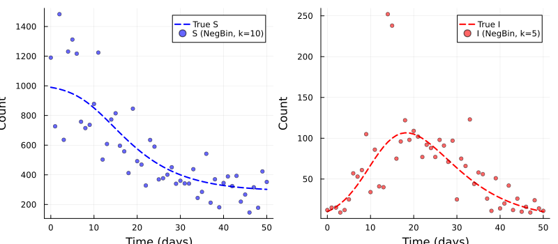
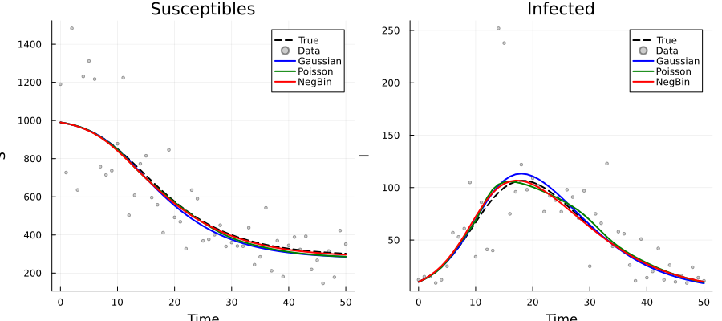
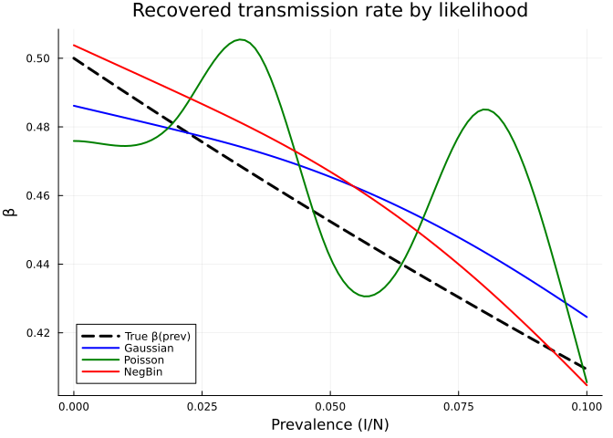
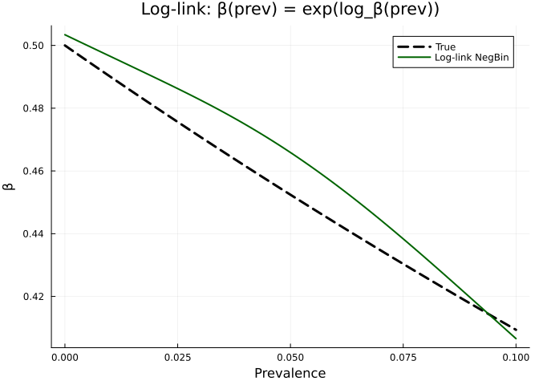
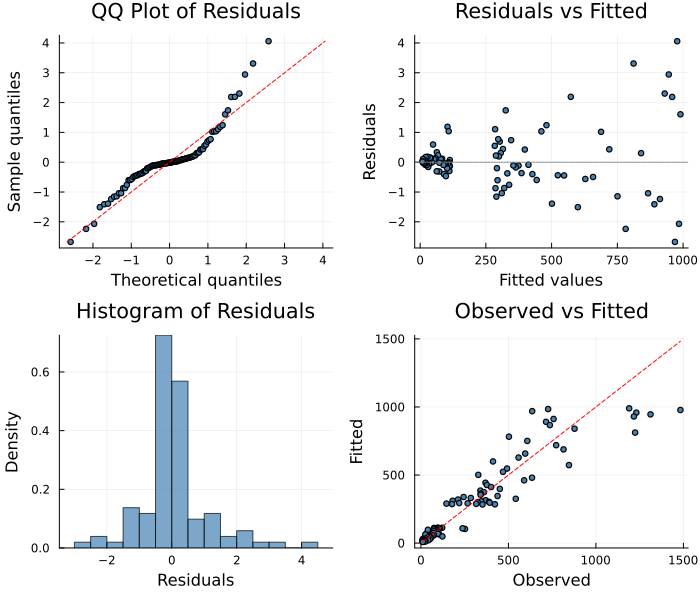

# Epidemiological Count Data: Non-Gaussian Likelihoods
Simon Frost
2026-04-02

- [Overview](#overview)
- [Setup](#setup)
- [Generating Realistic Epidemic Count
  Data](#generating-realistic-epidemic-count-data)
  - [True model](#true-model)
  - [Generate observations](#generate-observations)
  - [Data characteristics](#data-characteristics)
- [Define the PSM](#define-the-psm)
- [Compare Likelihood
  Specifications](#compare-likelihood-specifications)
  - [Gaussian (standard, but wrong for
    counts)](#gaussian-standard-but-wrong-for-counts)
  - [Poisson (correct variance structure for
    counts)](#poisson-correct-variance-structure-for-counts)
  - [Negative Binomial (accounts for
    overdispersion)](#negative-binomial-accounts-for-overdispersion)
- [Compare Results](#compare-results)
  - [Fitted trajectories](#fitted-trajectories)
  - [Recovered β(prevalence)](#recovered-βprevalence)
  - [Summary](#summary)
- [Using RodeoSolver with Count
  Data](#using-rodeosolver-with-count-data)
- [Practical Considerations](#practical-considerations)
  - [When to use each likelihood](#when-to-use-each-likelihood)
  - [Log-link for positive-constrained
    rates](#log-link-for-positive-constrained-rates)
- [Diagnostic Plots](#diagnostic-plots)
- [Key Takeaways](#key-takeaways)

## Overview

Epidemiological surveillance data are often **discrete counts** — case
reports, hospitalisations, or deaths — not continuous measurements.
Using a Gaussian likelihood on count data can lead to biased estimates,
particularly when counts are small (where the variance is proportional
to the mean).

`PartiallySpecifiedModels.jl` supports several likelihood families
appropriate for count data:

| Likelihood           | Use case                  | Variance structure   |
|----------------------|---------------------------|----------------------|
| `Gaussian()`         | Continuous measurements   | Constant (σ²)        |
| `Poisson()`          | Count data, equidispersed | Var = Mean           |
| `NegativeBinomial()` | Count data, overdispersed | Var = Mean + Mean²/k |

This vignette demonstrates fitting an SIR model with a density-dependent
transmission rate to **count data**, comparing the effect of different
likelihood specifications.

## Setup

``` julia
using PartiallySpecifiedModels
using PartiallySpecifiedModels: solve
using OrdinaryDiffEq
using Plots
using Statistics
using Random
import Distributions
Random.seed!(42)
```

    Precompiling packages...
        PartiallySpecifiedModels Being precompiled by another process (pid: 36853, pidfile: /Users/username/.julia/compiled/v1.12/PartiallySpecifiedModels/tWtwA_lLwID.ji.pidfile)
      18184.3 ms  ✓ PartiallySpecifiedModels
      1 dependency successfully precompiled in 42 seconds. 387 already precompiled.

    TaskLocalRNG()

## Generating Realistic Epidemic Count Data

### True model

We simulate an SIR epidemic where the transmission rate declines with
prevalence — a behavioural feedback:

$$\beta(\text{prev}) = \beta_0 \, e^{-\alpha \cdot \text{prev}}$$

``` julia
function sir_true!(du, u, p, t)
    S, I = u; N = 1000.0
    prev = I / N
    β = 0.5 * exp(-2.0 * prev)
    du[1] = -β * S * I / N
    du[2] = β * S * I / N - 0.25 * I
end

u0 = [990.0, 10.0]
tspan = (0.0, 50.0)
sol_ode = OrdinaryDiffEq.solve(ODEProblem(sir_true!, u0, tspan), Tsit5(), saveat=1.0)
data_t = sol_ode.t
```

    51-element Vector{Float64}:
      0.0
      1.0
      2.0
      3.0
      4.0
      5.0
      6.0
      7.0
      8.0
      9.0
      ⋮
     42.0
     43.0
     44.0
     45.0
     46.0
     47.0
     48.0
     49.0
     50.0

### Generate observations

Both S and I are observed as **overdispersed counts** (e.g. from
serological surveys and case reports). We use Negative Binomial noise
with dispersion parameter $k=10$ for S (less noisy, larger counts) and
$k=5$ for I (noisier, smaller counts):

``` julia
S_true = max.(sol_ode[1,:], 0.1)
I_true = max.(sol_ode[2,:], 0.1)
k_S = 10.0  # dispersion for S (less noisy)
k_I = 5.0   # dispersion for I (noisier)

S_counts = Float64.([rand(Distributions.NegativeBinomial(
    k_S, k_S / (k_S + v))) for v in S_true])
I_counts = Float64.([rand(Distributions.NegativeBinomial(
    k_I, k_I / (k_I + v))) for v in I_true])

data = hcat(S_counts, I_counts)

p1 = plot(sol_ode.t, sol_ode[1,:], label="True S", lw=2, ls=:dash, color=:blue)
scatter!(p1, data_t, S_counts, label="S (NegBin, k=10)", ms=3, alpha=0.6, color=:blue)
p2 = plot(sol_ode.t, sol_ode[2,:], label="True I", lw=2, ls=:dash, color=:red)
scatter!(p2, data_t, I_counts, label="I (NegBin, k=5)", ms=3, alpha=0.6, color=:red)
plot(p1, p2, layout=(1, 2), size=(800, 350),
     xlabel="Time (days)", ylabel="Count")
```



### Data characteristics

    Susceptible (S):
      Range: 146 – 1483
      Mean: 555.6
      Var/Mean: 188.7 (>1 = overdispersion)
    Infected (I):
      Range: 9 – 252
      Mean: 60.4
      Var/Mean: 43.8 (>1 = overdispersion)

## Define the PSM

The B-spline domain should closely match the **observed prevalence
range** to avoid boundary artefacts. The epidemic starts at `I/N = 0.01`
and peaks around `I/N ≈ 0.10`, so we use `(0.005, 0.11)`:

    Prevalence range: 0.01 – 0.107

## Compare Likelihood Specifications

Each likelihood gets a fresh approximator:

### Gaussian (standard, but wrong for counts)

    Gaussian: data_loss = 1.5765256e6, edf = 2.1

### Poisson (correct variance structure for counts)

    Poisson: data_loss = 1.5755791e6, edf = 2.0

### Negative Binomial (accounts for overdispersion)

    NegBin: data_loss = 1.5872837e6, edf = 2.0

## Compare Results

### Fitted trajectories

``` julia
p_S = plot(sol_ode.t, sol_ode[1,:], label="True", lw=2, color=:black, ls=:dash,
           xlabel="Time", ylabel="S", title="Susceptibles")
scatter!(p_S, data_t, S_counts, label="Data", ms=2, alpha=0.4, color=:gray)
plot!(p_S, data_t, sol_gauss.fitted_values[:, 1], label="Gaussian", lw=2, color=:blue)
plot!(p_S, data_t, sol_pois.fitted_values[:, 1], label="Poisson", lw=2, color=:green)
plot!(p_S, data_t, sol_nb.fitted_values[:, 1], label="NegBin", lw=2, color=:red)

p_I = plot(sol_ode.t, sol_ode[2,:], label="True", lw=2, color=:black, ls=:dash,
           xlabel="Time", ylabel="I", title="Infected")
scatter!(p_I, data_t, I_counts, label="Data", ms=2, alpha=0.4, color=:gray)
plot!(p_I, data_t, sol_gauss.fitted_values[:, 2], label="Gaussian", lw=2, color=:blue)
plot!(p_I, data_t, sol_pois.fitted_values[:, 2], label="Poisson", lw=2, color=:green)
plot!(p_I, data_t, sol_nb.fitted_values[:, 2], label="NegBin", lw=2, color=:red)

plot(p_S, p_I, layout=(1, 2), size=(900, 400))
```



### Recovered β(prevalence)

This is the key comparison — how well each likelihood recovers the true
transmission rate:

``` julia
prev_grid = range(0.0, 0.1, length=100)
β_true = [0.5 * exp(-2.0 * p) for p in prev_grid]

plot(prev_grid, β_true, label="True β(prev)", lw=3, color=:black, ls=:dash,
     xlabel="Prevalence (I/N)", ylabel="β",
     title="Recovered transmission rate by likelihood")
plot!(prev_grid, [sol_gauss.unknown_functions[:β](p) for p in prev_grid],
      label="Gaussian", lw=2, color=:blue)
plot!(prev_grid, [sol_pois.unknown_functions[:β](p) for p in prev_grid],
      label="Poisson", lw=2, color=:green)
plot!(prev_grid, [sol_nb.unknown_functions[:β](p) for p in prev_grid],
      label="NegBin", lw=2, color=:red)
```



### Summary

    Likelihood | β(0.01) est | β(0.06) est | EDF  | Cor(β̂, β_true)
    ----------------------------------------------------------------------
    Gaussian   | 0.483 (0.490) | 0.459 (0.443) | 2.1  | 0.979
    Poisson    | 0.508 (0.490) | 0.459 (0.443) | 2.0  | 1.0
    NegBin     | 0.506 (0.490) | 0.451 (0.443) | 2.0  | 1.0

## Using RodeoSolver with Count Data

The RodeoSolver can also be used with count-like data, treating the
observations as Gaussian with an appropriate observation variance:

    Rodeo β recovery:
      β(0.01): true=0.49, Rodeo=0.399
      β(0.03): true=0.471, Rodeo=0.552
      β(0.06): true=0.443, Rodeo=0.471
      β(0.09): true=0.418, Rodeo=0.445

## Practical Considerations

### When to use each likelihood

| Data type | Recommended | Rationale |
|----|----|----|
| Continuous measurements (concentrations, biomass) | `Gaussian()` | Constant variance assumption reasonable |
| Count data with no overdispersion | `Poisson()` | Variance = mean; fails badly if data are overdispersed |
| Overdispersed counts (aggregated reports, surveillance) | `NegativeBinomial()` | Extra variance parameter handles clustering |
| Mixed or uncertain variance structure | `NegativeBinomial()` or `Gaussian()` | Both are robust; Poisson is fragile to misspecification |

### Log-link for positive-constrained rates

When the unknown function represents a rate that must be positive (like
$\beta$), consider modelling the **log** of the rate:

``` julia
function sir_log!(du, u, p, t)
    S, I = u; N = 1000.0; prev = I / N
    # Model log(β) to ensure positivity
    β_val = exp(p.log_β(prev))
    foi = β_val * S * I / N
    du[1] = -foi; du[2] = foi - 0.25 * I
end

approx_log_β = BSplineApproximator(:log_β, (0.005, 0.11), 8; initial=log(0.4))
prob_log = PSMProblem(sir_log!, u0, tspan, [approx_log_β];
    data_times=data_t, data_values=data,
    obs_to_state=[1, 2], known_params=(γ=0.25,),
    likelihood=NegativeBinomial(), solver=Tsit5())

sol_log = solve(prob_log, LAML(maxiters=100))

β_log_est = [exp(sol_log.unknown_functions[:log_β](p)) for p in prev_grid]
plot(prev_grid, β_true, label="True", lw=3, color=:black, ls=:dash,
     xlabel="Prevalence", ylabel="β",
     title="Log-link: β(prev) = exp(log_β(prev))")
plot!(prev_grid, β_log_est, label="Log-link NegBin", lw=2, color=:darkgreen)
```



## Diagnostic Plots

A standard 4-panel diagnostic display assesses residual behaviour for
the primary Gaussian fit. The QQ plot checks normality of standardized
residuals, “Residuals vs Fitted” detects systematic patterns, the
histogram visualises the residual distribution, and “Observed vs Fitted”
checks overall calibration.

``` julia
using PartiallySpecifiedModels: appraise

diag = appraise(sol_gauss)

p_qq = scatter(diag.qq_theoretical, diag.qq_sample,
    xlabel="Theoretical quantiles", ylabel="Sample quantiles",
    title="QQ Plot of Residuals", ms=3, legend=false, color=:steelblue)
mn, mx = extrema(vcat(diag.qq_theoretical, diag.qq_sample))
plot!(p_qq, [mn, mx], [mn, mx], color=:red, ls=:dash, label="")

p_rf = scatter(diag.fitted, diag.residuals,
    xlabel="Fitted values", ylabel="Residuals",
    title="Residuals vs Fitted", ms=3, legend=false, color=:steelblue)
hline!(p_rf, [0], color=:gray, ls=:dot)

p_hist = histogram(diag.residuals, normalize=:pdf,
    xlabel="Residuals", ylabel="Density",
    title="Histogram of Residuals", legend=false, color=:steelblue, alpha=0.7)

p_of = scatter(diag.observed, diag.fitted,
    xlabel="Observed", ylabel="Fitted",
    title="Observed vs Fitted", ms=3, legend=false, color=:steelblue)
mn2, mx2 = extrema(vcat(diag.observed, diag.fitted))
plot!(p_of, [mn2, mx2], [mn2, mx2], color=:red, ls=:dash, label="")

plot(p_qq, p_rf, p_hist, p_of, layout=(2, 2), size=(700, 600))
```



    Durbin-Watson: 2.52, 1.773

## Key Takeaways

1.  **Set the B-spline domain to match the data range** — extending
    beyond the observed prevalence causes severe boundary artefacts.
    Inspect the data to determine the actual range.
2.  **NegativeBinomial handles overdispersion** — crucial for real-world
    surveillance data. Poisson assumes $\text{Var}(Y) = \mu$, so it
    severely underestimates the true noise when data are overdispersed,
    leading to under-smoothed estimates (EDF ≈ number of knots).
3.  **Gaussian is surprisingly robust** for count data with moderate
    overdispersion, because it estimates a free variance parameter
    $\hat\sigma^2$ that absorbs the extra variability.
4.  **The log-link** ensures positive rates and can improve numerical
    stability.
5.  **All solvers** in `PartiallySpecifiedModels.jl` work with
    non-Gaussian likelihoods through LAML.
