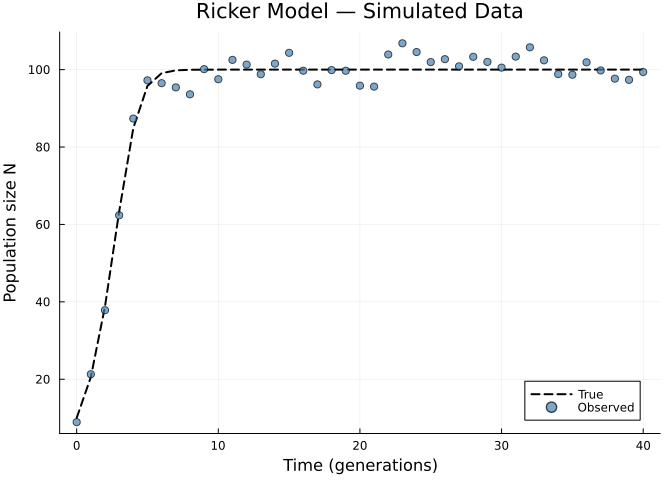
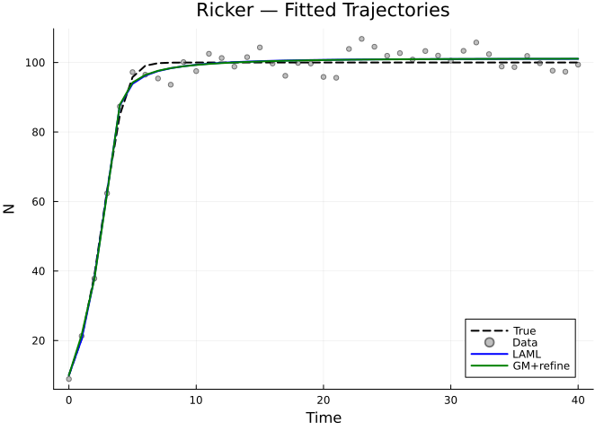
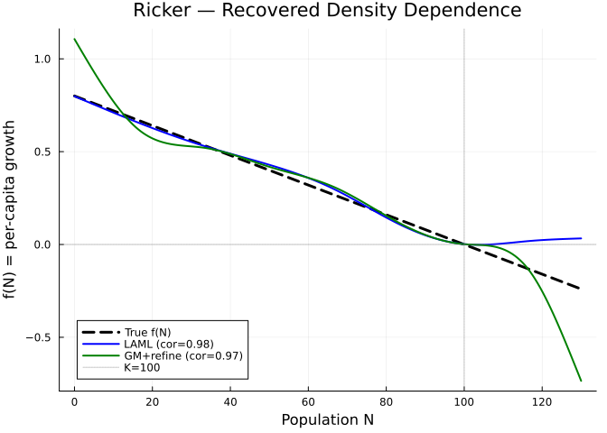
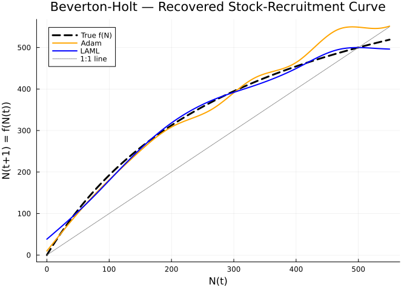
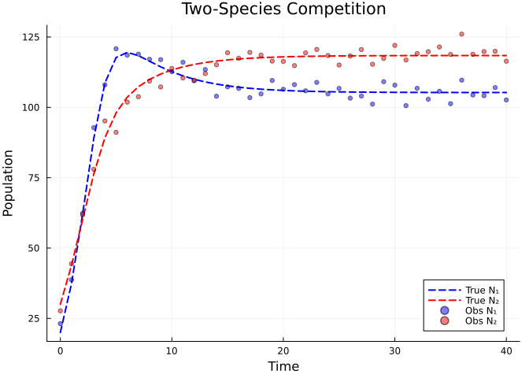
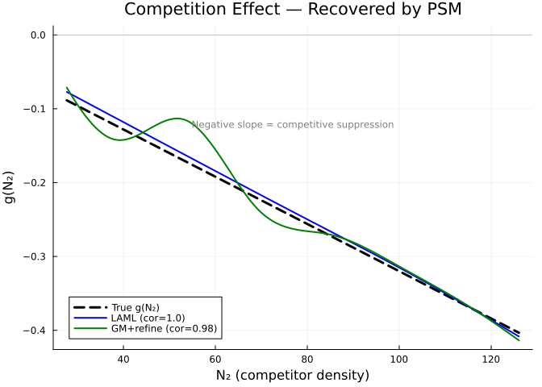
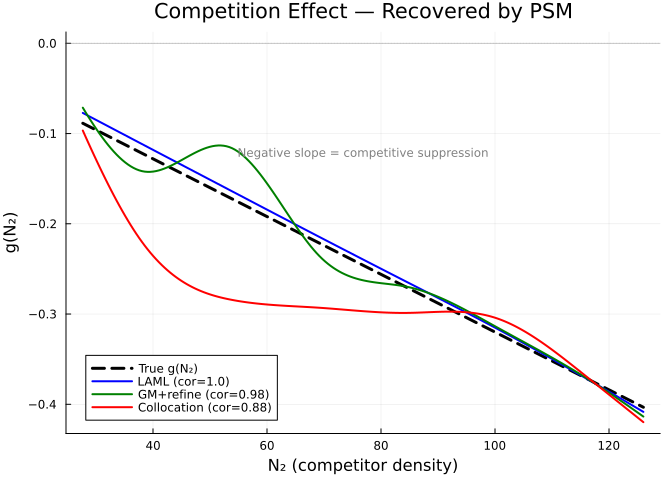

# Discrete-Time Population Models
Simon Frost
2026-06-12

- [Overview](#overview)
- [Setup](#setup)
- [Example 1: Ricker Model with Unknown Density
  Dependence](#example-1-ricker-model-with-unknown-density-dependence)
  - [Generate data](#generate-data)
  - [Fit with LAML](#fit-with-laml)
  - [Fit with GradientMatching](#fit-with-gradientmatching)
  - [Compare fitted trajectories](#compare-fitted-trajectories)
  - [Recover the density-dependence
    function](#recover-the-density-dependence-function)
- [Example 2: Beverton-Holt
  Recruitment](#example-2-beverton-holt-recruitment)
  - [Fit with AdamSolver](#fit-with-adamsolver)
  - [Fit with LAML](#fit-with-laml-1)
  - [Compare stock-recruitment
    curves](#compare-stock-recruitment-curves)
- [Example 3: Two-Species
  Competition](#example-3-two-species-competition)
  - [Fit with unknown competition
    function](#fit-with-unknown-competition-function)
  - [Compare with GradientMatching](#compare-with-gradientmatching)
  - [Recovered competition effect](#recovered-competition-effect)
- [Diagnostic Plots](#diagnostic-plots)
- [Summary](#summary)
  - [Solver recommendations for discrete
    models](#solver-recommendations-for-discrete-models)
  - [Key ecological applications](#key-ecological-applications)

## Overview

Many ecological models operate in **discrete time**, where populations
are censused at regular intervals (e.g., annual surveys, breeding
seasons). Classic examples include the Ricker model, Beverton-Holt, and
matrix population models.

`PartiallySpecifiedModels.jl` supports discrete-time models by wrapping
the dynamics in a SciML `DiscreteProblem`. The dynamics function has the
same signature as ODE models:

    f!(u_next, u, p, t)

but instead of computing **derivatives** `du/dt`, it computes the **next
state** `u(t+1)` directly. Passing a `DiscreteProblem` instead of an
`ODEProblem` automatically selects discrete-time integration — no manual
`discrete=true` flag needed.

## Setup

``` julia
using PartiallySpecifiedModels
using PartiallySpecifiedModels: solve
using Plots
using Statistics
using Random
Random.seed!(42)
```

    TaskLocalRNG()

## Example 1: Ricker Model with Unknown Density Dependence

The Ricker model describes density-dependent population growth:

$$N_{t+1} = N_t \exp\left(r\left(1 - \frac{N_t}{K}\right)\right)$$

We write this as $N_{t+1} = N_t \exp(f(N_t))$ where $f(N)$ is the
unknown per-capita growth rate as a function of density.

### Generate data

``` julia
true_r = 0.8
true_K = 100.0
true_f(N) = true_r * (1.0 - N / true_K)

function ricker_true!(u_next, u, p, t)
    N = u[1]
    u_next[1] = N * exp(true_r * (1.0 - N / true_K))
end

N0 = [10.0]
tspan = (0.0, 40.0)
n_steps = Int(tspan[2])
times = collect(0.0:1.0:tspan[2])

N_true = zeros(length(times))
N_true[1] = N0[1]
u = copy(N0)
u_next = similar(u)
for i in 1:n_steps
    ricker_true!(u_next, u, nothing, Float64(i-1))
    u .= u_next
    N_true[i+1] = u[1]
end

# Add observation noise
data = N_true .+ 3.0 .* randn(length(times))
data = max.(data, 0.1)

plot(times, N_true, label="True", lw=2, color=:black, ls=:dash,
     xlabel="Time (generations)", ylabel="Population size N",
     title="Ricker Model — Simulated Data")
scatter!(times, data, label="Observed", ms=4, color=:steelblue, alpha=0.7)
```



### Fit with LAML

    LAML — Data loss: 286.0, EDF: 4.5

### Fit with GradientMatching

For discrete models, gradient matching smooths the observed data and
matches the smoothed next-state values $\hat{y}(t+1) = f(\hat{y}(t))$.
The `refine_iters` option runs a short forward-simulation refinement to
correct the function in regions where derivative matching alone is
insufficient:

    GradientMatching — Data loss: 284.2, EDF: 10.0

### Compare fitted trajectories

``` julia
p1 = plot(times, N_true, label="True", lw=2, color=:black, ls=:dash,
     xlabel="Time", ylabel="N", title="Ricker — Fitted Trajectories")
scatter!(times, data, label="Data", ms=3, color=:gray, alpha=0.5)
plot!(times, sol_laml.fitted_values[:, 1], label="LAML", lw=2, color=:blue)
plot!(times, sol_gm.fitted_values[:, 1], label="GM+refine", lw=2, color=:green)
p1
```



### Recover the density-dependence function

``` julia
N_grid = range(0.0, 130.0, length=200)
f_true = [true_f(N) for N in N_grid]
f_laml = [sol_laml.unknown_functions[:f](N) for N in N_grid]
f_gm = [sol_gm.unknown_functions[:f](N) for N in N_grid]

p2 = plot(N_grid, f_true, label="True f(N)", lw=3, color=:black, ls=:dash,
     xlabel="Population N", ylabel="f(N) = per-capita growth",
     title="Ricker — Recovered Density Dependence")
plot!(N_grid, f_laml, label="LAML (cor=$(round(cor(f_true, f_laml), digits=2)))", lw=2, color=:blue)
plot!(N_grid, f_gm, label="GM+refine (cor=$(round(cor(f_true, f_gm), digits=2)))", lw=2, color=:green)
hline!([0.0], color=:gray, ls=:dot, label="", alpha=0.5)
vline!([true_K], color=:gray, ls=:dot, label="K=$(Int(true_K))", alpha=0.5)
p2
```



The zero-crossing of $f(N)$ reveals the carrying capacity $K$ — where
the density-dependent growth rate changes sign. LAML and
GradientMatching (with shooting refinement) both recover the function
accurately.

## Example 2: Beverton-Holt Recruitment

The Beverton-Holt model describes compensatory density dependence:

$$N_{t+1} = \frac{rN_t}{1 + \frac{r-1}{K}N_t}$$

This is a monotonically increasing, saturating stock-recruitment curve.
We model the entire map $N_{t+1} = f(N_t)$ as unknown.

``` julia
true_r_bh = 2.5
true_K_bh = 500.0
bh_true(N) = true_r_bh * N / (1.0 + (true_r_bh - 1.0) / true_K_bh * N)

N0_bh = [30.0]
tspan_bh = (0.0, 25.0)
times_bh = collect(0.0:1.0:tspan_bh[2])

N_true_bh = zeros(length(times_bh))
N_true_bh[1] = N0_bh[1]
for i in 1:Int(tspan_bh[2])
    N_true_bh[i+1] = bh_true(N_true_bh[i])
end

data_bh = N_true_bh .+ 8.0 .* randn(length(times_bh))
data_bh = max.(data_bh, 1.0)
```

    26-element Vector{Float64}:
      25.570676073440772
      79.10257006863648
     142.65228154259793
     247.93746503551966
     361.5143614108307
     423.8469299529876
     465.7645156489092
     497.2899676456883
     503.1426303499205
     500.6194978270763
       ⋮
     499.5940329694254
     515.177356624331
     498.5969371285903
     507.70546546997593
     511.1776655122701
     483.7462197821669
     505.4359022736914
     499.05704336380603
     497.8926779692759

### Fit with AdamSolver

    Adam — Data loss: 56970.0

### Fit with LAML

    LAML — Data loss: 1113.0

### Compare stock-recruitment curves

``` julia
N_grid_bh = range(0.0, 550.0, length=200)
f_true_bh = [bh_true(N) for N in N_grid_bh]
f_adam_bh = [sol_adam.unknown_functions[:f](N) for N in N_grid_bh]
f_laml_bh = [sol_bh_laml.unknown_functions[:f](N) for N in N_grid_bh]

plot(N_grid_bh, f_true_bh, label="True f(N)", lw=3, color=:black, ls=:dash,
     xlabel="N(t)", ylabel="N(t+1) = f(N(t))",
     title="Beverton-Holt — Recovered Stock-Recruitment Curve")
plot!(N_grid_bh, f_adam_bh, label="Adam", lw=2, color=:orange)
plot!(N_grid_bh, f_laml_bh, label="LAML", lw=2, color=:blue)
plot!(N_grid_bh, collect(N_grid_bh), label="1:1 line", lw=1, color=:gray, ls=:dot)
```



The intersection of the stock-recruitment curve with the 1:1 line gives
the equilibrium population $K$.

## Example 3: Two-Species Competition

Discrete-time Lotka-Volterra competition:

$$N_{1,t+1} = N_{1,t} \exp\left(r_1 \left(1 - \frac{N_{1,t} + \alpha_{12} N_{2,t}}{K_1}\right)\right)$$
$$N_{2,t+1} = N_{2,t} \exp\left(r_2 \left(1 - \frac{N_{2,t} + \alpha_{21} N_{1,t}}{K_2}\right)\right)$$

We treat the competition effect $g(N_2)$ on species 1 as unknown:
$$N_{1,t+1} = N_{1,t} \exp(r_1(1 - N_{1,t}/K_1) + g(N_{2,t}))$$

where the true function is $g(N_2) = -r_1 \alpha_{12} N_2 / K_1$.

``` julia
r1, K1, α12 = 0.8, 200.0, 0.8
r2, K2, α21 = 0.5, 150.0, 0.3

function competition_true!(u_next, u, p, t)
    N1, N2 = u
    u_next[1] = N1 * exp(r1 * (1.0 - (N1 + α12 * N2) / K1))
    u_next[2] = N2 * exp(r2 * (1.0 - (N2 + α21 * N1) / K2))
end

u0_comp = [20.0, 30.0]
tspan_comp = (0.0, 40.0)
times_comp = collect(0.0:1.0:tspan_comp[2])

N_comp = zeros(length(times_comp), 2)
N_comp[1, :] .= u0_comp
u_c = copy(u0_comp)
u_cn = similar(u_c)
for i in 1:Int(tspan_comp[2])
    competition_true!(u_cn, u_c, nothing, Float64(i-1))
    u_c .= u_cn
    N_comp[i+1, :] .= u_c
end

data_comp = N_comp .+ 3.0 .* randn(size(N_comp))
data_comp = max.(data_comp, 0.1)

p_data = plot(times_comp, N_comp[:, 1], label="True N₁", lw=2, color=:blue, ls=:dash,
     xlabel="Time", ylabel="Population", title="Two-Species Competition")
plot!(times_comp, N_comp[:, 2], label="True N₂", lw=2, color=:red, ls=:dash)
scatter!(times_comp, data_comp[:, 1], label="Obs N₁", ms=3, color=:blue, alpha=0.5)
scatter!(times_comp, data_comp[:, 2], label="Obs N₂", ms=3, color=:red, alpha=0.5)
p_data
```



### Fit with unknown competition function

**Key modelling tip**: Set the spline domain to match the observed data
range of $N_2$, not the theoretical range. This avoids extrapolation
artefacts at boundaries.

    LAML — Data loss: 583.5, EDF: 2.6

### Compare with GradientMatching

    GradientMatching — Data loss: 576.5, EDF: 8.0

### Recovered competition effect

``` julia
N2_grid = range(N2_lo, N2_hi, length=200)
g_true = [-r1 * α12 * N2 / K1 for N2 in N2_grid]
g_laml = [sol_laml.unknown_functions[:g](N2) for N2 in N2_grid]
g_gm = [sol_gm.unknown_functions[:g](N2) for N2 in N2_grid]

p3 = plot(N2_grid, g_true, label="True g(N₂)", lw=3, color=:black, ls=:dash,
     xlabel="N₂ (competitor density)", ylabel="g(N₂)",
     title="Competition Effect — Recovered by PSM")
plot!(N2_grid, g_laml, label="LAML (cor=$(round(cor(g_true, g_laml), digits=2)))", lw=2, color=:blue)
plot!(N2_grid, g_gm, label="GM+refine (cor=$(round(cor(g_true, g_gm), digits=2)))", lw=2, color=:green)
hline!([0.0], color=:gray, ls=:dot, label="", alpha=0.5)
annotate!(mean(N2_grid), minimum(g_true)*0.3,
          text("Negative slope = competitive suppression", 8, :gray))
p3
```



All three solvers recover the **linear negative competition effect**
$g(N_2)$ within the observed data range. Unlike the Ricker model, the
competition dynamics have a longer transient, giving all solvers more
information across the domain of $N_2$. The slope reveals the
competition coefficient $\alpha_{12}$ without assuming any parametric
functional form.

## Diagnostic Plots

A standard 4-panel diagnostic display assesses residual behaviour for
the Ricker LAML fit. The QQ plot checks normality of standardized
residuals, “Residuals vs Fitted” detects systematic patterns, the
histogram visualises the residual distribution, and “Observed vs Fitted”
checks overall calibration.

``` julia
using PartiallySpecifiedModels: appraise

diag = appraise(sol_laml)

p_qq = scatter(diag.qq_theoretical, diag.qq_sample,
    xlabel="Theoretical quantiles", ylabel="Sample quantiles",
    title="QQ Plot of Residuals", ms=3, legend=false, color=:steelblue)
mn, mx = extrema(vcat(diag.qq_theoretical, diag.qq_sample))
plot!(p_qq, [mn, mx], [mn, mx], color=:red, ls=:dash, label="")

p_rf = scatter(diag.fitted, diag.residuals,
    xlabel="Fitted values", ylabel="Residuals",
    title="Residuals vs Fitted", ms=3, legend=false, color=:steelblue)
hline!(p_rf, [0], color=:gray, ls=:dot)

p_hist = histogram(diag.residuals, normalize=:pdf,
    xlabel="Residuals", ylabel="Density",
    title="Histogram of Residuals", legend=false, color=:steelblue, alpha=0.7)

p_of = scatter(diag.observed, diag.fitted,
    xlabel="Observed", ylabel="Fitted",
    title="Observed vs Fitted", ms=3, legend=false, color=:steelblue)
mn2, mx2 = extrema(vcat(diag.observed, diag.fitted))
plot!(p_of, [mn2, mx2], [mn2, mx2], color=:red, ls=:dash, label="")

plot(p_qq, p_rf, p_hist, p_of, layout=(2, 2), size=(700, 600))
```



    Durbin-Watson: 2.62, 1.847

## Summary

| Feature | Continuous (ODE) | Discrete |
|----|----|----|
| Dynamics signature | `f!(du, u, p, t)` computes `du/dt` | `f!(u_next, u, p, t)` computes `u(t+1)` |
| Time stepping | Adaptive ODE solver | Explicit iteration |
| SciML problem type | `ODEProblem(f!, u0, tspan)` | `DiscreteProblem(f!, u0, tspan)` |
| Default solver | `Tsit5()` | `nothing` |
| Supported solvers | All 7 solvers | LAML, GradientMatching, AGM, Adam, MultipleShootingSolver, CollocationLAML\* |

The only solver **not** supporting discrete-time is `RodeoSolver`, which
relies on continuous-time Kalman filtering with an integrated Brownian
motion prior.

### Solver recommendations for discrete models

- **LAML** — Most robust for discrete-time. Forward simulation keeps
  states self-consistent; automatic smoothing via LAML handles
  regularisation.
- **GradientMatching** — Fast and effective with `refine_iters > 0`. The
  shooting refinement corrects the function in regions poorly covered by
  derivative matching alone.

### Key ecological applications

- **Ricker model**: density-dependent growth with overcompensation
- **Beverton-Holt**: compensatory stock-recruitment
- **Leslie/Lefkovitch**: age/stage-structured matrix models
- **Competition models**: multi-species discrete Lotka-Volterra
- **IPM extensions**: integral projection models with unknown vital
  rates
