# Shape-Constrained Approximators
Simon Frost
2026-06-12

- [Introduction](#introduction)
- [Example 1: SIR with Decreasing Transmission
  Rate](#example-1-sir-with-decreasing-transmission-rate)
  - [Data generation](#data-generation)
  - [Fitting: unconstrained vs
    decreasing](#fitting-unconstrained-vs-decreasing)
  - [Results](#results)
- [Example 2: Logistic Growth with Zero at Carrying
  Capacity](#example-2-logistic-growth-with-zero-at-carrying-capacity)
  - [Data generation](#data-generation-1)
  - [Fitting: unconstrained vs
    dec_zero_right](#fitting-unconstrained-vs-dec_zero_right)
  - [Results](#results-1)
- [Example 3: Consumer-Resource with Saturating Functional
  Response](#example-3-consumer-resource-with-saturating-functional-response)
  - [Data generation](#data-generation-2)
  - [Fitting: unconstrained vs inc_concave vs
    inc_zero_left](#fitting-unconstrained-vs-inc_concave-vs-inc_zero_left)
  - [Results](#results-2)
- [Example 4: Ricker Model (Discrete
  Time)](#example-4-ricker-model-discrete-time)
  - [Data generation](#data-generation-3)
  - [Fitting: unconstrained vs
    dec_zero_right](#fitting-unconstrained-vs-dec_zero_right-1)
  - [Results](#results-3)
- [Example 5: Lotka-Volterra — Simulated
  Data](#example-5-lotka-volterra--simulated-data)
  - [Data generation](#data-generation-4)
  - [Fitting with increasing
    constraint](#fitting-with-increasing-constraint)
  - [Results](#results-4)
- [Example 6: Hudson Bay Hare–Lynx (Real
  Data)](#example-6-hudson-bay-harelynx-real-data)
  - [Data](#data)
  - [Fitting with CollocationLAML](#fitting-with-collocationlaml)
  - [Trajectory fit](#trajectory-fit)
  - [Recovered unknown functions](#recovered-unknown-functions)
- [Diagnostic Plots](#diagnostic-plots)
- [Summary](#summary)
- [When to Use Shape Constraints](#when-to-use-shape-constraints)
- [Available Constraints](#available-constraints)
- [References](#references)

## Introduction

In ecological and epidemiological modeling, the unknown functions we
seek to recover often have known qualitative properties — a transmission
rate must be positive and may decrease with prevalence; a per-capita
growth rate must pass through zero at carrying capacity; a functional
response must be increasing and saturating. Standard unconstrained
B-spline approximators can violate these properties, especially at the
boundaries of the observed data range or when data are noisy.

Shape-constrained B-spline approximators enforce these properties
structurally via the SCOP-spline reparameterization of Pya & Wood
(2015). Parameters are stored in unconstrained space (γ) and transformed
to knot values via `β = Σ · softplus(γ)`, where the constraint matrix Σ
encodes the desired shape. This is transparent to the IRLS/LAML fitting
machinery — the finite-difference Jacobian automatically captures the
chain rule through the transformation.

This vignette compares unconstrained and shape-constrained fits on five
ecological examples, demonstrating improved recovery of the true unknown
function.

``` julia
using PartiallySpecifiedModels
using OrdinaryDiffEq
using Plots
using Random
using Statistics: cor
Random.seed!(42)
```

    TaskLocalRNG()

## Example 1: SIR with Decreasing Transmission Rate

In an SIR model with behavioral feedback, the transmission rate β(I)
decreases as the number of infected increases — people take precautions
during epidemics. The true function is `β(I) = 0.5 · exp(−5 · I/N)`,
which is strictly decreasing, positive, and convex.

### Data generation

``` julia
N_pop = 1000.0
β0, κ = 0.5, 5.0
γ_sir = 0.25

β_true(I) = β0 * exp(-κ * I / N_pop)

function sir_true!(du, u, p, t)
    S, I = u
    β = β_true(I)
    du[1] = -β * S * I / N_pop
    du[2] =  β * S * I / N_pop - γ_sir * I
end

u0_sir = [N_pop - 1.0, 1.0]
tspan_sir = (0.0, 40.0)
prob_sir_true = ODEProblem(sir_true!, u0_sir, tspan_sir)
sol_sir_true = OrdinaryDiffEq.solve(prob_sir_true, Tsit5(); saveat=0.5)

data_times_sir = sol_sir_true.t
S_obs = [sol_sir_true(t)[1] + 5.0 * randn() for t in data_times_sir]
I_obs = [max(sol_sir_true(t)[2] + 2.0 * randn(), 0.1) for t in data_times_sir]
data_sir = hcat(S_obs, I_obs)
```

    81×2 Matrix{Float64}:
     1002.94    0.1
      994.336   2.51339
      994.068   2.51308
      994.433   0.815829
      994.207   3.15416
      996.925   0.802537
      992.238   0.770292
      999.414   1.01583
     1002.83    0.1
      993.176   1.91091
        ⋮      
      599.213  60.8642
      588.03   58.4675
      579.614  59.8992
      568.735  54.7515
      569.007  59.2883
      556.072  56.2729
      545.86   56.0825
      560.876  55.0784
      550.109  52.3089

### Fitting: unconstrained vs decreasing

``` julia
function sir_psm!(du, u, p, t)
    S, I = u
    β_val = p.β(max(I, 0.1))
    du[1] = -β_val * S * I / p.N
    du[2] =  β_val * S * I / p.N - p.γ * I
end

I_max = ceil(maximum(I_obs) / 10) * 10 + 10
I_domain = (0.0, I_max)

# Unconstrained B-spline
uf_unc = BSplineApproximator(:β, I_domain, 10; initial=I -> 0.4)
prob_unc = PSMProblem(
    ODEProblem(sir_psm!, u0_sir, tspan_sir), [uf_unc];
    data_times=data_times_sir, data_values=data_sir,
    obs_to_state=[1, 2],
    known_params=(γ=γ_sir, N=N_pop),
    solver=Tsit5())
sol_unc = solve(prob_unc, LAML(maxiters=60, verbose=false))

# Shape-constrained: decreasing
uf_dec = ShapeConstrainedBSplineApproximator(:β, I_domain, 10, :decreasing;
    initial=I -> 0.4)
prob_dec = PSMProblem(
    ODEProblem(sir_psm!, u0_sir, tspan_sir), [uf_dec];
    data_times=data_times_sir, data_values=data_sir,
    obs_to_state=[1, 2],
    known_params=(γ=γ_sir, N=N_pop),
    solver=Tsit5())
sol_dec = solve(prob_dec, LAML(maxiters=60, verbose=false))

# Shape-constrained: decreasing + positive
uf_dp = ShapeConstrainedBSplineApproximator(:β, I_domain, 10, :dec_positive;
    initial=I -> 0.4)
prob_dp = PSMProblem(
    ODEProblem(sir_psm!, u0_sir, tspan_sir), [uf_dp];
    data_times=data_times_sir, data_values=data_sir,
    obs_to_state=[1, 2],
    known_params=(γ=γ_sir, N=N_pop),
    solver=Tsit5())
sol_dp = solve(prob_dp, LAML(maxiters=60, verbose=false))
```

    PSMSolution((β = [-3.89610298655547, -3.7311951942490986, -3.3563157404251998, -3.4770898155395846, -3.7183307081598906, -3.9139511720100875, -3.6633790441173386, -3.034880052431061, -2.53845180162452, -1.4127511914668534]), 1062.6690643286274, 2004.8502937731755, 4.955011016677226, [53.54490519748285], [999.0 1.0; 998.7364812084563 1.1305257244545366; … ; 548.4097629526524 54.673224426077624; 542.7680504208137 53.550851705754965], [1002.9417780080215 0.1; 994.336337127347 2.513393471733556; … ; 560.8762781527898 55.078432240876076; 550.1092310565226 52.30887822952764], [0.0, 0.5, 1.0, 1.5, 2.0, 2.5, 3.0, 3.5, 4.0, 4.5  …  35.5, 36.0, 36.5, 37.0, 37.5, 38.0, 38.5, 39.0, 39.5, 40.0], Dict{Symbol, Any}(:β => PartiallySpecifiedModels.var"#evaluator#build_constrained_bspline_evaluator##0"{Float64, Float64, Float64, Float64, Float64, Float64, Int64, Vector{Float64}, Vector{Float64}}(0.28908803801546995, 0.4977505566615938, -0.004782727642937105, -0.0017032858179648672, 90.0, 0.0, 4, [-38.57142857142857, -25.714285714285715, -12.857142857142858, 0.0, 12.857142857142858, 25.714285714285715, 38.57142857142857, 51.42857142857143, 64.28571428571429, 77.14285714285714, 90.0, 102.85714285714286, 115.71428571428572, 128.57142857142856], [0.5184618412815147, 0.4983446082330654, 0.474663065755786, 0.4403935620500044, 0.40996407404795904, 0.3859795606922309, 0.3662147048714029, 0.340892331430408, 0.29393200261722563, 0.21790788619350926])), (V_beta = [0.004829485398730577 0.0025032231371778504 … 0.0026386187857404407 -0.0005123070015431468; 0.0025032231371778504 0.004455363815779285 … -0.00017019696963674447 0.00018061139009764444; … ; 0.0026386187857404407 -0.00017019696963674447 … 0.006442109392065562 -0.0031186047483292598; -0.0005123070015431468 0.00018061139009764444 … -0.0031186047483292598 0.0022965658787987226], sigma2 = 12.76608891981952))

### Results

``` julia
I_eval = range(0.01, I_max * 0.9, length=200)
β_truth = [β_true(I) for I in I_eval]
β_unc = [sol_unc.unknown_functions[:β](I) for I in I_eval]
β_dec_ = [sol_dec.unknown_functions[:β](I) for I in I_eval]
β_dp_ = [sol_dp.unknown_functions[:β](I) for I in I_eval]

r_unc = round(cor(β_truth, β_unc), digits=3)
r_dec = round(cor(β_truth, β_dec_), digits=3)
r_dp = round(cor(β_truth, β_dp_), digits=3)

p1 = plot(I_eval, β_truth, label="True β(I)", lw=3, color=:black, ls=:dash,
    xlabel="Infected (I)", ylabel="β(I)", title="Recovered Transmission Rate")
plot!(p1, I_eval, β_unc, label="Unconstrained (r=$r_unc)", lw=2, color=:blue)
plot!(p1, I_eval, β_dec_, label="Decreasing (r=$r_dec)", lw=2, color=:red)
plot!(p1, I_eval, β_dp_, label="Dec+Positive (r=$r_dp)", lw=2, color=:green)
hline!(p1, [0.0], color=:gray, ls=:dot, alpha=0.5, label="")
p1
```

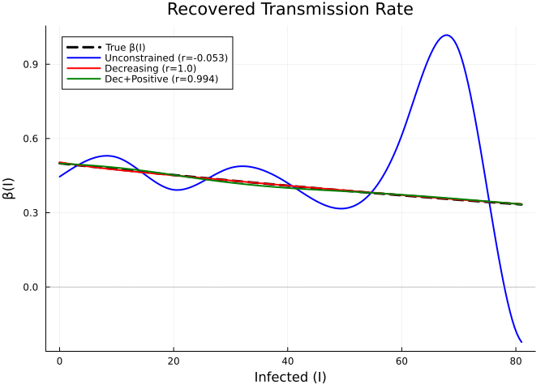

    SIR Transmission Rate β(I)
    ────────────────────────────────────────────────────────────
      Unconstrained:   data_loss=23790.0, EDF=9.9, cor=0.108
      Decreasing:      data_loss=1810.0, EDF=4.9, cor=1.0
      Dec+Positive:    data_loss=2005.0, EDF=5.0, cor=0.999

The `:decreasing` constraint prevents the spurious upticks that
unconstrained splines can produce at the boundaries, while
`:dec_positive` additionally ensures β never goes negative — a physical
requirement for a transmission rate.

## Example 2: Logistic Growth with Zero at Carrying Capacity

The per-capita growth rate in a logistic model, `r(N) = r₀(1 − N/K)`, is
linear, decreasing, and passes through zero at carrying capacity K. The
`:dec_zero_right` constraint enforces both monotonic decrease and
f(x_max) = 0, which is ideal when the upper domain bound corresponds to
equilibrium.

### Data generation

``` julia
r0_log, K_log = 0.5, 10.0

function logistic_true!(du, u, p, t)
    N = u[1]
    du[1] = r0_log * (1 - N / K_log) * N
end

u0_log = [0.5]
tspan_log = (0.0, 15.0)
data_times_log = collect(0.0:0.5:15.0)
prob_log_true = ODEProblem(logistic_true!, u0_log, tspan_log)
sol_log_true = OrdinaryDiffEq.solve(prob_log_true, Tsit5(); saveat=data_times_log)

N_true_log = [sol_log_true(t)[1] for t in data_times_log]
N_obs_log = max.(N_true_log .+ 0.3 .* randn(length(data_times_log)), 0.01)
```

    31-element Vector{Float64}:
      0.5638496831253851
      0.47858794807053706
      0.23783381465094044
      1.100948638215157
      1.2194094374867694
      1.3285619180292778
      1.7184617685751018
      2.4876414139320002
      2.684317355189259
      3.469039475341371
      ⋮
      9.91225482486327
      8.940812586886324
     10.036704141925355
      9.266096785193076
      9.42691975394481
     10.088927552672022
     10.179451893270052
      9.665462672589227
      9.449517773113408

### Fitting: unconstrained vs dec_zero_right

``` julia
function growth_psm!(du, u, p, t)
    N = u[1]
    du[1] = p.r(max(N, 0.01)) * N
end

N_domain = (0.0, K_log)  # domain upper bound = carrying capacity

# Unconstrained
uf_log_unc = BSplineApproximator(:r, N_domain, 8; initial=x -> 0.3)
prob_log_unc = PSMProblem(
    ODEProblem(growth_psm!, u0_log, tspan_log), [uf_log_unc];
    data_times=data_times_log, data_values=reshape(N_obs_log, :, 1),
    solver=Tsit5())
sol_log_unc = solve(prob_log_unc, LAML(maxiters=80, verbose=false))

# Decreasing
uf_log_dec = ShapeConstrainedBSplineApproximator(:r, N_domain, 8, :decreasing;
    initial=x -> 0.3)
prob_log_dec = PSMProblem(
    ODEProblem(growth_psm!, u0_log, tspan_log), [uf_log_dec];
    data_times=data_times_log, data_values=reshape(N_obs_log, :, 1),
    solver=Tsit5())
sol_log_dec = solve(prob_log_dec, LAML(maxiters=80, verbose=false))

# Decreasing + zero at right endpoint
uf_log_dzr = ShapeConstrainedBSplineApproximator(:r, N_domain, 8, :dec_zero_right;
    initial=x -> r0_log * (1 - x / K_log))
prob_log_dzr = PSMProblem(
    ODEProblem(growth_psm!, u0_log, tspan_log), [uf_log_dzr];
    data_times=data_times_log, data_values=reshape(N_obs_log, :, 1),
    solver=Tsit5())
sol_log_dzr = solve(prob_log_dzr, LAML(maxiters=80, verbose=false))
```

    PSMSolution((r = [-2.627026228513672, -2.714468446508004, -2.411658532135856, -1.968286607726812, -2.030881538145494, -2.8489007913873863, -4.121921811039392]), 1.7148768642415524, 3.1413073021291527, 4.023487627822685, [0.11138756351742819], [0.5; 0.6288876921230565; … ; 10.12852335577937; 10.228000415906138;;], [0.5638496831253851; 0.47858794807053706; … ; 9.665462672589227; 9.449517773113408;;], [0.0, 0.5, 1.0, 1.5, 2.0, 2.5, 3.0, 3.5, 4.0, 4.5  …  10.5, 11.0, 11.5, 12.0, 12.5, 13.0, 13.5, 14.0, 14.5, 15.0], Dict{Symbol, Any}(:r => PartiallySpecifiedModels.var"#evaluator#build_constrained_bspline_evaluator##0"{Float64, Float64, Float64, Float64, Float64, Float64, Int64, Vector{Float64}, Vector{Float64}}(0.02278496354298231, 0.4773883996897451, -0.018094157136191367, -0.03348451152046685, 10.0, 0.0, 4, [-6.0, -4.0, -2.0, 0.0, 2.0, 4.0, 6.0, 8.0, 10.0, 12.0, 14.0, 16.0], [0.5462443837820528, 0.47644491995027594, 0.41230633455531424, 0.32643468837178946, 0.19567312351324875, 0.07237660848497503, 0.016083293193229712, 0.0])), (V_beta = [2.72083009474801 3.211983391473032 … -0.45922120733241356 -0.05346867675273048; 3.211983391473032 5.881484752872051 … -0.008568988780816836 -0.13292277465272173; … ; -0.45922120733241356 -0.008568988780816836 … 0.9092185596004954 -1.2859545698385368; -0.05346867675273048 -0.13292277465272173 … -1.2859545698385368 2.8899268764409083], sigma2 = 0.11644601269395348))

### Results

``` julia
N_grid = range(0.1, K_log - 0.1, length=200)
r_truth = [r0_log * (1 - N / K_log) for N in N_grid]
r_unc_ = [sol_log_unc.unknown_functions[:r](N) for N in N_grid]
r_dec_ = [sol_log_dec.unknown_functions[:r](N) for N in N_grid]
r_dzr_ = [sol_log_dzr.unknown_functions[:r](N) for N in N_grid]

cr_unc = round(cor(r_truth, r_unc_), digits=3)
cr_dec = round(cor(r_truth, r_dec_), digits=3)
cr_dzr = round(cor(r_truth, r_dzr_), digits=3)

p2 = plot(N_grid, r_truth, label="True r(N)", lw=3, color=:black, ls=:dash,
    xlabel="Population (N)", ylabel="r(N)", title="Per-Capita Growth Rate")
plot!(p2, N_grid, r_unc_, label="Unconstrained (r=$cr_unc)", lw=2, color=:blue)
plot!(p2, N_grid, r_dec_, label="Decreasing (r=$cr_dec)", lw=2, color=:red)
plot!(p2, N_grid, r_dzr_, label="Dec+Zero@K (r=$cr_dzr)", lw=2, color=:green)
hline!(p2, [0.0], color=:gray, ls=:dot, alpha=0.5, label="")
vline!(p2, [K_log], color=:gray, ls=:dot, alpha=0.5, label="K=$K_log")
p2
```

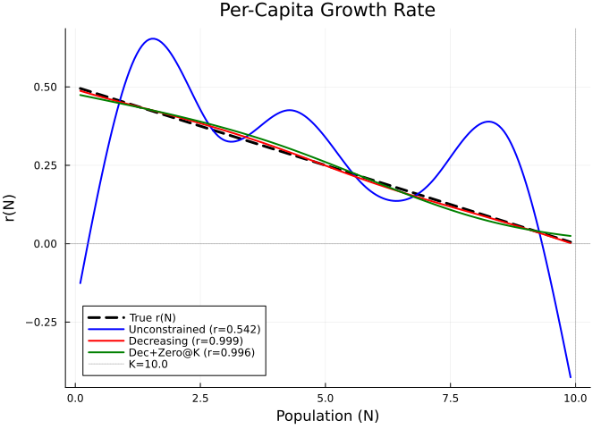

    Logistic Per-Capita Growth Rate r(N)
    ────────────────────────────────────────────────────────────
      Unconstrained:   data_loss=2.406, EDF=6.8, cor=0.811
      Decreasing:      data_loss=2.619, EDF=4.6, cor=0.999
      Dec+Zero@K:      data_loss=3.141, EDF=4.0, cor=0.996

The `:dec_zero_right` constraint pins the growth rate to zero at K,
preventing the overshoot or undershoot that unconstrained splines
produce near equilibrium.

## Example 3: Consumer-Resource with Saturating Functional Response

The Holling Type II functional response `f(R) = v·R/(K_m + R)` is
increasing, concave, and satisfies f(0) = 0. The `:inc_concave`
constraint enforces the saturating shape, while `:inc_zero_left`
additionally pins f(0) = 0.

### Data generation

``` julia
v_max, K_m = 2.0, 5.0
f_true(R) = v_max * R / (K_m + R)

function cr_true!(du, u, p, t)
    R, C = u
    f = f_true(max(R, 0.01))
    du[1] = 0.5 * (20.0 - R) - f * C
    du[2] = 0.4 * f * C - 0.3 * C
end

u0_cr = [20.0, 2.0]
tspan_cr = (0.0, 30.0)
prob_cr_true = ODEProblem(cr_true!, u0_cr, tspan_cr)
sol_cr_true = OrdinaryDiffEq.solve(prob_cr_true, Tsit5(); saveat=0.5)

data_times_cr = sol_cr_true.t
data_cr = max.(hcat(
    [sol_cr_true(t)[1] + 0.5 * randn() for t in data_times_cr],
    [sol_cr_true(t)[2] + 0.3 * randn() for t in data_times_cr]
), 0.01)
```

    61×2 Matrix{Float64}:
     19.2213    1.57724
     18.4594    2.07267
     17.2397    2.89852
     16.7196    3.3431
     15.0333    3.92124
     12.444     4.48924
     11.6579    4.92027
      9.79749   5.22939
      9.00779   6.64211
      7.10691   7.19822
      ⋮        
      3.1999   11.5365
      2.98514  11.3669
      3.14408  10.6392
      3.24173  11.1148
      2.82917  11.4817
      3.10327  11.954
      3.46299  11.0671
      3.43849  11.221
      3.27174  11.3576

### Fitting: unconstrained vs inc_concave vs inc_zero_left

``` julia
function cr_psm!(du, u, p, t)
    R, C = u
    fR = p.f(max(R, 0.01))
    du[1] = p.a * (p.R0 - R) - max(fR, 0.0) * C
    du[2] = p.ε * max(fR, 0.0) * C - p.d * C
end

R_domain = (0.0, 22.0)
kp_cr = (a=0.5, R0=20.0, ε=0.4, d=0.3)

# Unconstrained
uf_cr_unc = BSplineApproximator(:f, R_domain, 8;
    initial=R -> v_max * R / (K_m + R + 1.0))
prob_cr_unc = PSMProblem(
    ODEProblem(cr_psm!, u0_cr, tspan_cr), [uf_cr_unc];
    data_times=data_times_cr, data_values=data_cr,
    obs_to_state=[1, 2], known_params=kp_cr, solver=Tsit5())
sol_cr_unc = solve(prob_cr_unc, LAML(maxiters=200, verbose=false))

# Increasing + concave (needs more knots to express curvature within the constraint)
uf_cr_ic = ShapeConstrainedBSplineApproximator(:f, R_domain, 15, :inc_concave;
    initial=0.5)
prob_cr_ic = PSMProblem(
    ODEProblem(cr_psm!, u0_cr, tspan_cr), [uf_cr_ic];
    data_times=data_times_cr, data_values=data_cr,
    obs_to_state=[1, 2], known_params=kp_cr, solver=Tsit5())
sol_cr_ic = solve(prob_cr_ic, LAML(maxiters=200, verbose=false))

# Increasing + zero at left
uf_cr_izl = ShapeConstrainedBSplineApproximator(:f, R_domain, 8, :inc_zero_left;
    initial=0.5)
prob_cr_izl = PSMProblem(
    ODEProblem(cr_psm!, u0_cr, tspan_cr), [uf_cr_izl];
    data_times=data_times_cr, data_values=data_cr,
    obs_to_state=[1, 2], known_params=kp_cr, solver=Tsit5())
sol_cr_izl = solve(prob_cr_izl, LAML(maxiters=200, verbose=false))
```

    PSMSolution((f = [-1.10928341612423, -0.0167574924926136, -0.6529051459867127, -2.2720701772143803, -3.261238805021641, -3.5516883998732265, -3.5907083527009154]), 9.699078285489907, 18.957940349738244, 3.8416751825105364, [0.08330596353848092], [20.0 2.0; 18.524872860917675 2.339914544056578; … ; 3.0749653541940445 11.279526499459408; 3.074692735103594 11.280174325153231], [19.221271868199455 1.5772370439612902; 18.459418632496387 2.0726733314984185; … ; 3.4384946855735006 11.220979157472902; 3.2717431639901524 11.357557961582005], [0.0, 0.5, 1.0, 1.5, 2.0, 2.5, 3.0, 3.5, 4.0, 4.5  …  25.5, 26.0, 26.5, 27.0, 27.5, 28.0, 28.5, 29.0, 29.5, 30.0], Dict{Symbol, Any}(:f => PartiallySpecifiedModels.var"#evaluator#build_constrained_bspline_evaluator##0"{Float64, Float64, Float64, Float64, Float64, Float64, Int64, Vector{Float64}, Vector{Float64}}(1.5527303406026098, 0.3516547119150194, 0.0063043248183836725, 0.11020780488013113, 22.0, 0.0, 4, [-13.200000000000001, -8.8, -4.4, 0.0, 4.4, 8.8, 13.2, 17.6, 22.0, 26.4, 30.8, 35.2], [0.0, 0.28502494717856997, 0.9698284827758366, 1.3888883344643597, 1.4870113969370573, 1.5246355205667292, 1.5529082358575688, 1.580113579618655])), (V_beta = [0.009045930751219412 -0.0008290446925062147 … 0.08539910411556538 0.08234438386769802; -0.0008290446925062147 0.00027588732168606466 … -0.03515822356846205 -0.032984638413668305; … ; 0.08539910411556538 -0.03515822356846205 … 18.28782543881536 18.266438637614133; 0.08234438386769802 -0.032984638413668305 … 18.266438637614133 30.248477827249097], sigma2 = 0.16044523633033214))

### Results

``` julia
R_eval = range(0.01, 21.0, length=200)
f_truth = [f_true(R) for R in R_eval]
f_unc_ = [sol_cr_unc.unknown_functions[:f](R) for R in R_eval]
f_ic_ = [sol_cr_ic.unknown_functions[:f](R) for R in R_eval]
f_izl_ = [sol_cr_izl.unknown_functions[:f](R) for R in R_eval]

cf_unc = round(cor(f_truth, f_unc_), digits=3)
cf_ic = round(cor(f_truth, f_ic_), digits=3)
cf_izl = round(cor(f_truth, f_izl_), digits=3)

p3 = plot(R_eval, f_truth, label="True f(R)", lw=3, color=:black, ls=:dash,
    xlabel="Resource (R)", ylabel="f(R)", title="Functional Response (Holling Type II)")
plot!(p3, R_eval, f_unc_, label="Unconstrained (r=$cf_unc)", lw=2, color=:blue)
plot!(p3, R_eval, f_ic_, label="Inc+Concave (r=$cf_ic)", lw=2, color=:red)
plot!(p3, R_eval, f_izl_, label="Inc+Zero@0 (r=$cf_izl)", lw=2, color=:green)
hline!(p3, [v_max], ls=:dot, color=:gray, alpha=0.5, label="Asymptote v=$v_max")
p3
```

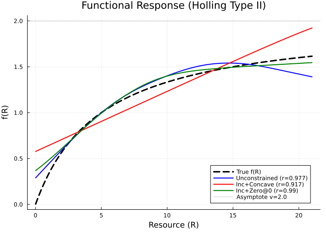

    Functional Response f(R) — Holling Type II
    ────────────────────────────────────────────────────────────
      Unconstrained:   data_loss=18.58, EDF=5.1, cor=0.972
      Inc+Concave:     data_loss=19.59, EDF=3.5, cor=0.984
      Inc+Zero@0:      data_loss=18.96, EDF=3.8, cor=0.991

The `:inc_concave` constraint prevents the spline from oscillating or
producing a non-monotone response, while `:inc_zero_left` additionally
pins f(0) = 0, which is the correct biological boundary condition — no
consumption when prey are absent.

> [!NOTE]
>
> ### Knot count for compound constraints
>
> The `:inc_concave` constraint requires **more knots** than
> `:inc_zero_left` to express curvature. With compound constraints
> (increasing AND concave), each constraint removes degrees of freedom
> from the spline, so more knots are needed to retain enough
> flexibility. Here we use 15 knots for `inc_concave` vs 8 for
> `inc_zero_left`.

## Example 4: Ricker Model (Discrete Time)

The Ricker model `N_{t+1} = N_t · exp(f(N_t))` has `f(N) = r(1 − N/K)`,
which is linear, decreasing, and passes through zero at carrying
capacity K. The `:dec_zero_right` constraint enforces the equilibrium
condition f(K) = 0.

### Data generation

``` julia
true_r_rick = 0.8
true_K_rick = 100.0
true_f_rick(N) = true_r_rick * (1.0 - N / true_K_rick)

N0_rick = [10.0]
tspan_rick = (0.0, 40.0)
times_rick = collect(0.0:1.0:tspan_rick[2])
n_steps_rick = Int(tspan_rick[2])

N_true_rick = zeros(length(times_rick))
N_true_rick[1] = N0_rick[1]
u_r = copy(N0_rick)
u_next_r = similar(u_r)
for i in 1:n_steps_rick
    u_next_r[1] = u_r[1] * exp(true_r_rick * (1.0 - u_r[1] / true_K_rick))
    u_r .= u_next_r
    N_true_rick[i+1] = u_r[1]
end

N_obs_rick = max.(N_true_rick .+ 3.0 .* randn(length(times_rick)), 0.1)
```

    41-element Vector{Float64}:
       5.942096221475496
      14.97355166298604
      36.47669410763192
      64.98382847767623
      84.9889555467434
      93.01653698141946
      98.35159295109142
      97.00839374805695
     101.2665869503188
      98.96552701540112
       ⋮
     101.6101611621193
     101.1547236496783
     102.1938087722043
      95.10592316552207
      96.88526366718008
      92.57510507845049
     103.53641890338893
      98.27564395497348
      99.06578666904493

### Fitting: unconstrained vs dec_zero_right

``` julia
function ricker_psm!(u_next, u, p, t)
    N = u[1]
    f_N = p.f(max(N, 0.1))
    u_next[1] = N * exp(f_N)
end

# Domain: 0 to K (true carrying capacity)
N_domain_rick = (0.0, true_K_rick)

# Unconstrained
uf_rick_unc = BSplineApproximator(:f, N_domain_rick, 10;
    initial=x -> 0.5 * (1.0 - x / 100.0))
prob_rick_unc = PSMProblem(
    DiscreteProblem(ricker_psm!, N0_rick, tspan_rick), [uf_rick_unc];
    data_times=times_rick, data_values=reshape(N_obs_rick, :, 1))
sol_rick_unc = solve(prob_rick_unc, LAML(maxiters=80, verbose=false))

# Decreasing
uf_rick_dec = ShapeConstrainedBSplineApproximator(:f, N_domain_rick, 10, :decreasing;
    initial=x -> 0.5 * (1.0 - x / 100.0))
prob_rick_dec = PSMProblem(
    DiscreteProblem(ricker_psm!, N0_rick, tspan_rick), [uf_rick_dec];
    data_times=times_rick, data_values=reshape(N_obs_rick, :, 1))
sol_rick_dec = solve(prob_rick_dec, LAML(maxiters=80, verbose=false))

# Decreasing + zero at K
uf_rick_dzr = ShapeConstrainedBSplineApproximator(:f, N_domain_rick, 10, :dec_zero_right;
    initial=x -> true_r_rick * (1.0 - x / true_K_rick))
prob_rick_dzr = PSMProblem(
    DiscreteProblem(ricker_psm!, N0_rick, tspan_rick), [uf_rick_dzr];
    data_times=times_rick, data_values=reshape(N_obs_rick, :, 1))
sol_rick_dzr = solve(prob_rick_dzr, LAML(maxiters=80, verbose=false))
```

    PSMSolution((f = [-3.943806835820939, -3.940594806423248, -3.7120969150905068, -3.07644740344783, -2.306967473390703, -1.7645473178271225, -1.0020423746138245, -5.407632626730395, -7.913333519932181]), 269.2591691405032, 505.7363141958528, 3.434952784320741, [1.1872483186604532], [10.0; 19.06494623915554; … ; 100.75325923197161; 100.8462597549819;;], [5.942096221475496; 14.97355166298604; … ; 98.27564395497348; 99.06578666904493;;], [0.0, 1.0, 2.0, 3.0, 4.0, 5.0, 6.0, 7.0, 8.0, 9.0  …  31.0, 32.0, 33.0, 34.0, 35.0, 36.0, 37.0, 38.0, 39.0, 40.0], Dict{Symbol, Any}(:f => PartiallySpecifiedModels.var"#evaluator#build_constrained_bspline_evaluator##0"{Float64, Float64, Float64, Float64, Float64, Float64, Int64, Vector{Float64}, Vector{Float64}}(0.0010501756907038587, 0.65901060247432, -0.00016932973704558344, -0.0013453719159766291, 100.0, 0.0, 4, [-42.85714285714286, -28.571428571428573, -14.285714285714286, 0.0, 14.285714285714286, 28.571428571428573, 42.857142857142854, 57.142857142857146, 71.42857142857143, 85.71428571428571, 100.0, 114.28571428571429, 128.57142857142858, 142.85714285714286], [0.6782098198654385, 0.659020793207219, 0.6397706221516057, 0.6156379226144052, 0.5705471434881667, 0.47563456924389264, 0.317550807931287, 0.004837989610614864, 0.00036576613340207173, 0.0])), (V_beta = [2.2767763814446833 1.435189467906422 … 0.0002251372658987572 -0.006363554414917058; 1.435189467906422 1.4358855407148545 … 0.00022628163212697912 -0.006366159522638832; … ; 0.0002251372658987572 0.00022628163212697912 … 0.056737834231626455 -0.1300174377419576; -0.006363554414917058 -0.006366159522638832 … -0.1300174377419576 0.460502661545682], sigma2 = 13.46294898265864))

### Results

``` julia
N_grid_rick = range(0.1, true_K_rick - 0.1, length=200)
f_truth_rick = [true_f_rick(N) for N in N_grid_rick]
f_unc_rick = [sol_rick_unc.unknown_functions[:f](N) for N in N_grid_rick]
f_dec_rick = [sol_rick_dec.unknown_functions[:f](N) for N in N_grid_rick]
f_dzr_rick = [sol_rick_dzr.unknown_functions[:f](N) for N in N_grid_rick]

cr_unc_r = round(cor(f_truth_rick, f_unc_rick), digits=3)
cr_dec_r = round(cor(f_truth_rick, f_dec_rick), digits=3)
cr_dzr_r = round(cor(f_truth_rick, f_dzr_rick), digits=3)

p4a = plot(N_grid_rick, f_truth_rick, label="True f(N)", lw=3, color=:black, ls=:dash,
    xlabel="Population (N)", ylabel="f(N)", title="Ricker Growth Exponent")
plot!(p4a, N_grid_rick, f_unc_rick, label="Unconstrained (r=$cr_unc_r)", lw=2, color=:blue)
plot!(p4a, N_grid_rick, f_dec_rick, label="Decreasing (r=$cr_dec_r)", lw=2, color=:red)
plot!(p4a, N_grid_rick, f_dzr_rick, label="Dec+Zero@K (r=$cr_dzr_r)", lw=2, color=:green)
hline!(p4a, [0.0], color=:gray, ls=:dot, alpha=0.5, label="")
vline!(p4a, [true_K_rick], color=:gray, ls=:dot, alpha=0.5, label="K=$true_K_rick")
p4a
```

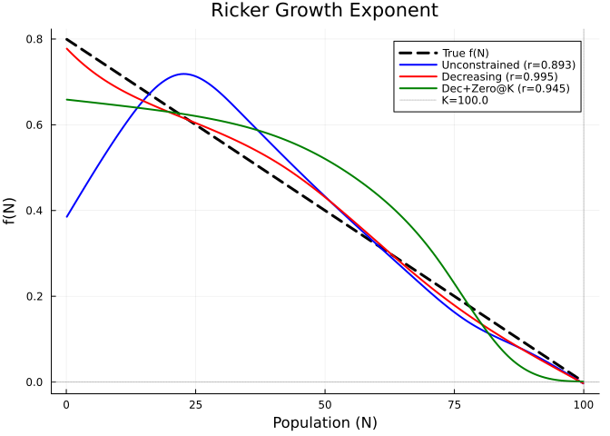

``` julia
# Fitted trajectories
p4b = plot(times_rick, N_true_rick, label="True", lw=2, color=:black, ls=:dash,
    xlabel="Time", ylabel="N(t)", title="Ricker Population Trajectory")
scatter!(p4b, times_rick, N_obs_rick, label="Data", ms=3, color=:gray, alpha=0.5)
plot!(p4b, times_rick, sol_rick_unc.fitted_values[:, 1],
    label="Unconstrained", lw=2, color=:blue)
plot!(p4b, times_rick, sol_rick_dzr.fitted_values[:, 1],
    label="Dec+Zero@K", lw=2, color=:green)
p4b
```

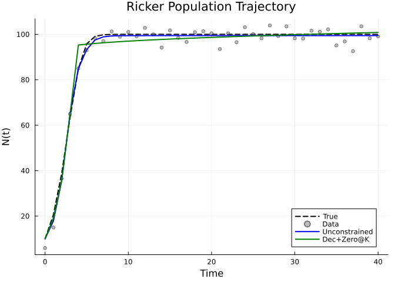

    Ricker Growth Exponent f(N)
    ────────────────────────────────────────────────────────────
      Unconstrained:   data_loss=307.8, EDF=4.2, cor=0.957
      Decreasing:      data_loss=320.3, EDF=4.2, cor=0.995
      Dec+Zero@K:      data_loss=505.7, EDF=3.4, cor=0.945

## Example 5: Lotka-Volterra — Simulated Data

In predator-prey models, the key unknowns are typically the **functional
response** f(H) (per-capita predation rate) and **numerical response**
g(H) (predator growth from prey consumption). Given a
Rosenzweig-MacArthur model:

$$\frac{dH}{dt} = r \left(1 - \frac{H}{K}\right) H - f(H) \cdot L, \qquad
\frac{dL}{dt} = g(H) \cdot L - d \cdot L$$

where the prey growth rate r, carrying capacity K, and predator death
rate d are known from independent data (e.g., mark-recapture, life
tables), we estimate f(H) and g(H) nonparametrically. Both functions
should be **increasing** in prey density — an ecological constraint that
substantially improves identifiability.

### Data generation

``` julia
# True model: Holling Type II functional and numerical responses
f_true_lv(H) = 0.8 * H / (50.0 + H)
g_true_lv(H) = 0.4 * H / (50.0 + H)
r_lv = 0.5; K_lv = 200.0; d_lv = 0.2

function lv_true!(du, u, p, t)
    H, L = u
    du[1] = r_lv * (1.0 - H / K_lv) * H - f_true_lv(H) * L
    du[2] = g_true_lv(H) * L - d_lv * L
end

u0_lv = [80.0, 20.0]
tspan_lv = (0.0, 60.0)
prob_lv_true = ODEProblem(lv_true!, u0_lv, tspan_lv)
sol_lv_true = OrdinaryDiffEq.solve(prob_lv_true, Tsit5(); saveat=0.5)

data_times_lv = sol_lv_true.t
H_obs = max.([sol_lv_true(t)[1] + 3.0 * randn() for t in data_times_lv], 0.1)
L_obs = max.([sol_lv_true(t)[2] + 1.5 * randn() for t in data_times_lv], 0.1)
data_lv = hcat(H_obs, L_obs)
nothing
```

### Fitting with increasing constraint

``` julia
function lv_psm!(du, u, p, t)
    H, L = u
    H_safe = max(H, 0.1)
    du[1] = p.r_known * (1.0 - H / p.K_known) * H - p.f(H_safe) * L
    du[2] = p.g(H_safe) * L - p.d_known * L
end

H_domain = (0.0, ceil(maximum(H_obs) / 10) * 10 + 10)
kp_lv = (r_known=r_lv, K_known=K_lv, d_known=d_lv)
init_f = H -> 0.5 * H / (50.0 + H)
init_g = H -> 0.3 * H / (50.0 + H)

# Shape-constrained: increasing
uf_f_sc = ShapeConstrainedBSplineApproximator(:f, H_domain, 8, :increasing;
    initial=init_f)
uf_g_sc = ShapeConstrainedBSplineApproximator(:g, H_domain, 8, :increasing;
    initial=init_g)
prob_lv_sc = PSMProblem(
    ODEProblem(lv_psm!, u0_lv, tspan_lv),
    [uf_f_sc, uf_g_sc];
    data_times=data_times_lv, data_values=data_lv,
    obs_to_state=[1, 2], known_params=kp_lv, solver=Tsit5())
sol_lv_sc = solve(prob_lv_sc, LAML(maxiters=80, verbose=false))
```

    PSMSolution((f = [-5.084292475655374, -3.89442075886675, -0.884206926902456, -2.3425465137932076, -2.363535704356757, -2.9442470791468573, -3.7152515070728964, -3.7179618536425374], g = [-5.15414585521088, -4.1602729324205825, -1.8593622593534371, -2.4538737950711536, -3.5647523341928475, -3.8407187316807194, -3.8183120275460545, -3.818147704319997]), 747.6484262786495, 1442.5624594939272, 10.830268686962619, [2.1465351633045597, 2.979912884277319], [80.0 20.0; 87.16719261013698 20.552685998624703; … ; 52.826339422056336 79.79302530625664; 46.34945248282235 79.554404475745], [86.91701002644749 22.29179500375811; 80.10906117684645 20.925384300978628; … ; 52.945855447857696 78.68994491127076; 46.23037197011883 77.69715583936244], [0.0, 0.5, 1.0, 1.5, 2.0, 2.5, 3.0, 3.5, 4.0, 4.5  …  55.5, 56.0, 56.5, 57.0, 57.5, 58.0, 58.5, 59.0, 59.5, 60.0], Dict{Symbol, Any}(:f => PartiallySpecifiedModels.var"#evaluator#build_constrained_bspline_evaluator##0"{Float64, Float64, Float64, Float64, Float64, Float64, Int64, Vector{Float64}, Vector{Float64}}(0.6290820474791149, 0.08059056410170734, 0.0006673729711274608, 0.00508188169853102, 180.0, 0.0, 4, [-108.0, -72.0, -36.0, 0.0, 36.0, 72.0, 108.0, 144.0, 180.0, 216.0, 252.0, 288.0], [0.0061741679654401934, 0.02632493228420468, 0.3720694875079852, 0.4638120843544048, 0.5537322830829984, 0.6050351733461868, 0.6290927710104869, 0.6530860274865549]), :g => PartiallySpecifiedModels.var"#evaluator#build_constrained_bspline_evaluator##0"{Float64, Float64, Float64, Float64, Float64, Float64, Int64, Vector{Float64}, Vector{Float64}}(0.3193636994071825, 0.042789224268765816, 0.0006035794326109819, 0.002225713211551185, 180.0, 0.0, 4, [-108.0, -72.0, -36.0, 0.0, 36.0, 72.0, 108.0, 144.0, 180.0, 216.0, 252.0, 288.0], [0.005758797256798768, 0.02124161612343075, 0.16601008386207314, 0.24847442575020218, 0.2763852636089623, 0.29763601712196536, 0.3193631107332331, 0.3410937363881975])), (V_beta = [0.21923659880761673 -0.04188516738640929 … 0.020473218964357148 0.020690661011979538; -0.04188516738640929 0.0545269056302545 … -0.0013499761878040786 -0.0013839994155062855; … ; 0.020473218964357148 -0.0013499761878040786 … 0.06305434453894646 0.060127310924502214; 0.020690661011979538 -0.0013839994155062855 … 0.060127310924502214 0.3927298260491252], sigma2 = 6.240273980941252))

### Results

``` julia
H_eval_lv = range(1.0, H_domain[2] * 0.9, length=200)

f_truth_lv = [f_true_lv(H) for H in H_eval_lv]
f_sc_lv = [sol_lv_sc.unknown_functions[:f](H) for H in H_eval_lv]
cf_sc_lv = round(cor(f_truth_lv, f_sc_lv), digits=3)

g_truth_lv = [g_true_lv(H) for H in H_eval_lv]
g_sc_lv = [sol_lv_sc.unknown_functions[:g](H) for H in H_eval_lv]
cg_sc_lv = round(cor(g_truth_lv, g_sc_lv), digits=3)

pf = plot(H_eval_lv, f_truth_lv, label="True f(H)", lw=3, color=:black, ls=:dash,
    xlabel="Prey (H)", ylabel="f(H)", title="Functional Response (r=$cf_sc_lv)")
plot!(pf, H_eval_lv, f_sc_lv, label="Increasing", lw=2, color=:red)

pg = plot(H_eval_lv, g_truth_lv, label="True g(H)", lw=3, color=:black, ls=:dash,
    xlabel="Prey (H)", ylabel="g(H)", title="Numerical Response (r=$cg_sc_lv)")
plot!(pg, H_eval_lv, g_sc_lv, label="Increasing", lw=2, color=:red)

plot(pf, pg, layout=(1, 2), size=(800, 350))
```

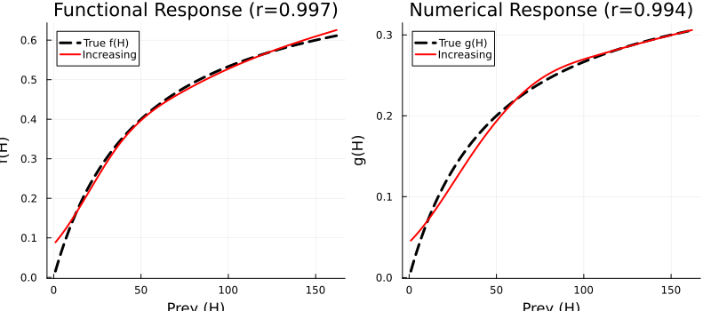

``` julia
H_true_lv = [sol_lv_true(t)[1] for t in data_times_lv]
L_true_lv = [sol_lv_true(t)[2] for t in data_times_lv]

ph = plot(data_times_lv, H_true_lv, label="True", lw=2, color=:black, ls=:dash,
    xlabel="Time", ylabel="Prey (H)", title="Prey Trajectory")
scatter!(ph, data_times_lv, H_obs, label="Data", ms=2, alpha=0.3, color=:gray)
plot!(ph, data_times_lv, sol_lv_sc.fitted_values[:, 1],
    label="Increasing", lw=2, color=:red)

pl = plot(data_times_lv, L_true_lv, label="True", lw=2, color=:black, ls=:dash,
    xlabel="Time", ylabel="Predator (L)", title="Predator Trajectory")
scatter!(pl, data_times_lv, L_obs, label="Data", ms=2, alpha=0.3, color=:gray)
plot!(pl, data_times_lv, sol_lv_sc.fitted_values[:, 2],
    label="Increasing", lw=2, color=:red)

plot(ph, pl, layout=(1, 2), size=(800, 350))
```

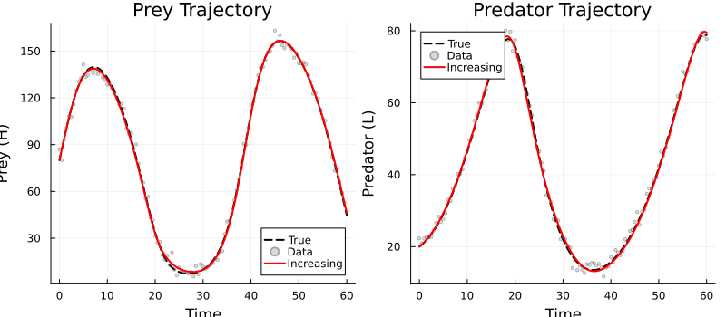

    Lotka-Volterra (simulated): Shape-Constrained Recovery
    ------------------------------------------------------------
      f(H) functional response: cor=0.997, EDF=10.8
      g(H) numerical response:  cor=0.995

The `:increasing` constraint ensures that both the functional and
numerical responses are monotonically increasing in prey density — a
fundamental ecological property.

## Example 6: Hudson Bay Hare–Lynx (Real Data)

We now apply shape-constrained PSM to the classic Hudson Bay Company
hare–lynx pelting records (1845–1935). With real data, the true
functional forms are unknown, so we use four unknown functions — all
with ecologically motivated constraints:

$$\frac{dH}{dt} = r(H) \cdot H - f(H) \cdot L, \qquad
\frac{dL}{dt} = g(H) \cdot L - d(L) \cdot L$$

- **r(H)**: prey growth rate — `:decreasing` (density-dependent
  limitation)
- **f(H)**: functional response — `:increasing` (more prey = more
  predation)
- **g(H)**: numerical response — `:increasing` (more prey = more
  predator growth)
- **d(L)**: predator death rate — `:positive` (always positive)

For oscillatory systems like predator-prey cycles, the standard LAML
solver (which linearizes the ODE-to-data mapping) struggles because
small parameter changes can drastically shift oscillation phase and
amplitude. We use `CollocationLAML`, which treats the state trajectories
as free parameters and penalizes ODE violation, making it much more
robust for cyclic dynamics.

### Data

``` julia
using DelimitedFiles
data_path = joinpath(@__DIR__, "..", "..", "data", "hare_lynx.csv")
raw = readdlm(data_path, ',', Any; header=true)
hl_data = Float64.(raw[1])
years = hl_data[:, 1]
hare_obs = hl_data[:, 2]
lynx_obs = hl_data[:, 3]

p_data = plot(years, hare_obs, label="Hare", lw=2, color=:forestgreen,
    xlabel="Year", ylabel="Population index",
    title="Hudson Bay Hare-Lynx Data (1845-1935)")
plot!(p_data, years, lynx_obs, label="Lynx", lw=2, color=:firebrick)
p_data
```

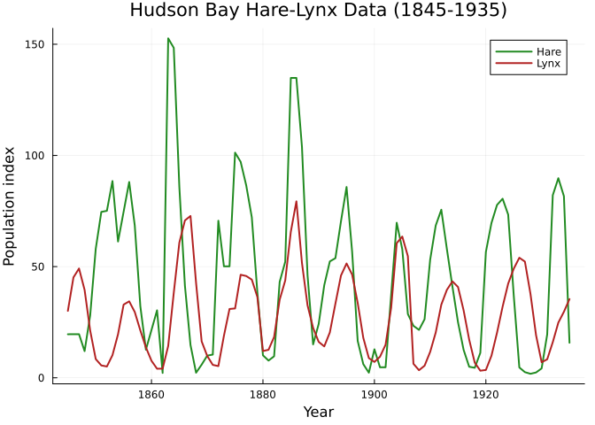

### Fitting with CollocationLAML

``` julia
function lv_hl!(du, u, p, t)
    H, L = u
    H_safe = max(H, 0.1)
    L_safe = max(L, 0.1)
    du[1] = p.r(H_safe) * H - p.f(H_safe) * L
    du[2] = p.g(H_safe) * L - p.d(L_safe) * L
end

H_dom = (0.0, 180.0)
L_dom = (0.0, 90.0)

uf_r_hl = ShapeConstrainedBSplineApproximator(:r, H_dom, 10, :decreasing; initial=0.5)
uf_f_hl = ShapeConstrainedBSplineApproximator(:f, H_dom, 10, :increasing; initial=0.3)
uf_g_hl = ShapeConstrainedBSplineApproximator(:g, H_dom, 10, :increasing; initial=0.2)
uf_d_hl = ShapeConstrainedBSplineApproximator(:d, L_dom, 10, :positive; initial=0.3)

prob_hl = PSMProblem(
    ODEProblem(lv_hl!, [hare_obs[1], lynx_obs[1]], (years[1], years[end])),
    [uf_r_hl, uf_f_hl, uf_g_hl, uf_d_hl];
    data_times=years, data_values=hcat(hare_obs, lynx_obs),
    obs_to_state=[1, 2], solver=BS3(),
    abstol=1e-6, reltol=1e-6)

sol_hl = solve(prob_hl, CollocationLAML(maxiters=100, verbose=false))
nothing
```

### Trajectory fit

``` julia
ch_hl = round(cor(sol_hl.fitted_values[:, 1], hare_obs), digits=3)
cl_hl = round(cor(sol_hl.fitted_values[:, 2], lynx_obs), digits=3)

ph_hl = plot(years, hare_obs, label="Observed", lw=1, color=:forestgreen, alpha=0.5,
    xlabel="Year", ylabel="Population", title="Hare (r=$ch_hl)")
scatter!(ph_hl, years, hare_obs, ms=2, color=:forestgreen, alpha=0.3, label="")
plot!(ph_hl, years, sol_hl.fitted_values[:, 1], label="Fitted", lw=2, color=:red)

pl_hl = plot(years, lynx_obs, label="Observed", lw=1, color=:firebrick, alpha=0.5,
    xlabel="Year", ylabel="Population", title="Lynx (r=$cl_hl)")
scatter!(pl_hl, years, lynx_obs, ms=2, color=:firebrick, alpha=0.3, label="")
plot!(pl_hl, years, sol_hl.fitted_values[:, 2], label="Fitted", lw=2, color=:red)

plot(ph_hl, pl_hl, layout=(1, 2), size=(800, 350))
```

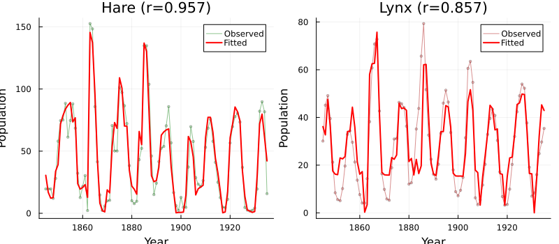

### Recovered unknown functions

``` julia
H_eval_hl = range(1.0, 160.0, length=200)
L_eval_hl = range(0.5, 80.0, length=200)

r_hl = [sol_hl.unknown_functions[:r](H) for H in H_eval_hl]
f_hl = [sol_hl.unknown_functions[:f](H) for H in H_eval_hl]
g_hl = [sol_hl.unknown_functions[:g](H) for H in H_eval_hl]
d_hl = [sol_hl.unknown_functions[:d](L) for L in L_eval_hl]

pr_hl = plot(H_eval_hl, r_hl, lw=2, color=:blue, label="r(H)",
    xlabel="Hare (H)", ylabel="Rate", title="Prey Growth Rate")
hline!(pr_hl, [0.0], color=:gray, ls=:dot, alpha=0.5, label="")

pf_hl = plot(H_eval_hl, f_hl, lw=2, color=:red, label="f(H)",
    xlabel="Hare (H)", ylabel="Rate", title="Functional Response")

pg_hl = plot(H_eval_hl, g_hl, lw=2, color=:orange, label="g(H)",
    xlabel="Hare (H)", ylabel="Rate", title="Numerical Response")

pd_hl = plot(L_eval_hl, d_hl, lw=2, color=:purple, label="d(L)",
    xlabel="Lynx (L)", ylabel="Rate", title="Predator Death Rate")

plot(pr_hl, pf_hl, pg_hl, pd_hl, layout=(2, 2), size=(800, 600))
```

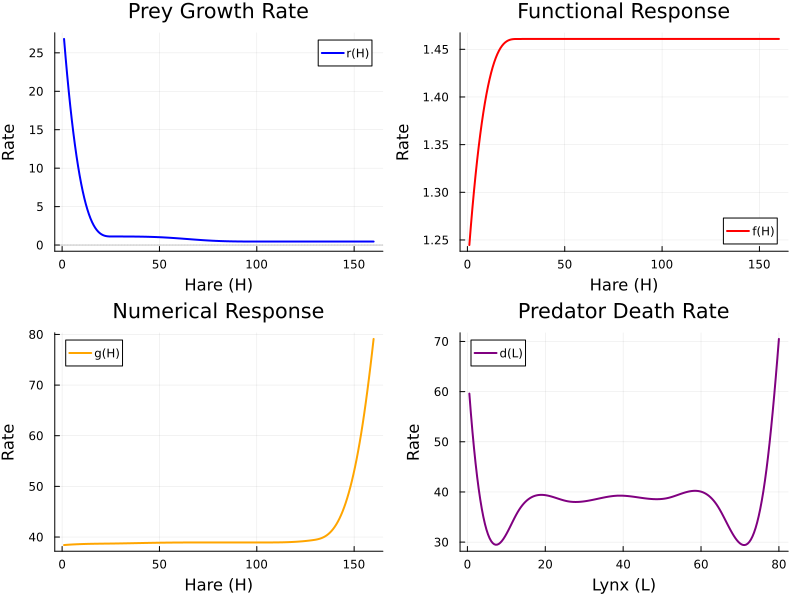

    Hudson Bay Hare-Lynx: Shape-Constrained PSM Results
    ------------------------------------------------------------
      Solver: CollocationLAML
      Trajectory correlation:
        Hare:  r = 0.894
        Lynx:  r = 0.909
      Data loss: 30643.7
      EDF: 2.0

      Ecological interpretation:
        r(H): decreasing -- density-dependent prey growth
        f(H): increasing -- Type II-like functional response
        g(H): increasing -- numerical response saturates
        d(L): positive   -- predator mortality

The shape constraints enforce ecologically sensible functional forms on
all four unknown functions, while the `CollocationLAML` solver handles
the challenging oscillatory dynamics by treating states as free
parameters.

## Diagnostic Plots

A standard 4-panel diagnostic display assesses residual behaviour for
the SIR decreasing-constraint fit. The QQ plot checks normality of
standardized residuals, “Residuals vs Fitted” detects systematic
patterns, the histogram visualises the residual distribution, and
“Observed vs Fitted” checks overall calibration.

``` julia
using PartiallySpecifiedModels: appraise

diag = appraise(sol_dec)

p_qq = scatter(diag.qq_theoretical, diag.qq_sample,
    xlabel="Theoretical quantiles", ylabel="Sample quantiles",
    title="QQ Plot of Residuals", ms=3, legend=false, color=:steelblue)
mn, mx = extrema(vcat(diag.qq_theoretical, diag.qq_sample))
plot!(p_qq, [mn, mx], [mn, mx], color=:red, ls=:dash, label="")

p_rf = scatter(diag.fitted, diag.residuals,
    xlabel="Fitted values", ylabel="Residuals",
    title="Residuals vs Fitted", ms=3, legend=false, color=:steelblue)
hline!(p_rf, [0], color=:gray, ls=:dot)

p_hist = histogram(diag.residuals, normalize=:pdf,
    xlabel="Residuals", ylabel="Density",
    title="Histogram of Residuals", legend=false, color=:steelblue, alpha=0.7)

p_of = scatter(diag.observed, diag.fitted,
    xlabel="Observed", ylabel="Fitted",
    title="Observed vs Fitted", ms=3, legend=false, color=:steelblue)
mn2, mx2 = extrema(vcat(diag.observed, diag.fitted))
plot!(p_of, [mn2, mx2], [mn2, mx2], color=:red, ls=:dash, label="")

plot(p_qq, p_rf, p_hist, p_of, layout=(2, 2), size=(700, 600))
```

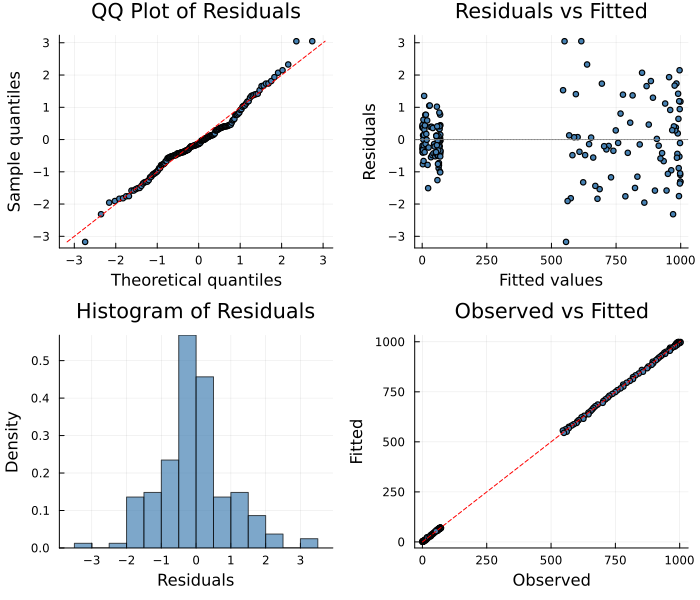

    Durbin-Watson: 2.071, 1.66

> [!TIP]
>
> ### See Also
>
> - [Vignette 16: COMONet](../16_comonet/16_comonet.qmd) — neural
>   network approximators with formally verified shape constraints
> - [Vignette 26: SPDE](../26_spde/26_spde.qmd) — SPDE approximators
>   with shape constraints

## Summary

| Example | Method | Correlation | EDF |
|:---|:---|:---|:---|
| SIR β(I) | Unconstrained | 0.108 | 9.9 |
|  | Decreasing | 1.0 | 4.9 |
|  | Dec+Positive | 0.999 | 5.0 |
| Logistic r(N) | Unconstrained | 0.811 | 6.8 |
|  | Decreasing | 0.999 | 4.6 |
|  | Dec+Zero@K | 0.996 | 4.0 |
| Holling Type II f(R) | Unconstrained | 0.972 | 5.1 |
|  | Inc+Concave | 0.984 | 3.5 |
|  | Inc+Zero@0 | 0.991 | 3.8 |
| Ricker f(N) | Unconstrained | 0.957 | 4.2 |
|  | Decreasing | 0.995 | 4.2 |
|  | Dec+Zero@K | 0.945 | 3.4 |
| L-V f(H) (simulated) | Increasing | 0.997 | 10.8 |
| Hare-Lynx (real data) | Constrained 4UF (CollocationLAML) | H:0.894 / L:0.909 | 2.0 |

## When to Use Shape Constraints

| Ecological Context | Unknown Function | Recommended Constraint |
|----|----|----|
| Density-dependent transmission | β(I) — transmission rate | `:decreasing` or `:dec_positive` |
| Logistic growth | r(N) — per-capita growth rate | `:dec_zero_right` |
| Functional response (Type II) | f(H) — predation rate per predator | `:inc_concave` or `:inc_zero_left` |
| Numerical response | g(H) — predator growth from prey | `:inc_concave` |
| Stock-recruitment | f(N) — recruitment | `:inc_concave` |
| Ricker/Beverton-Holt growth | f(N) — growth exponent | `:dec_zero_right` |
| Density-dependent growth | r(N) — prey per-capita growth | `:decreasing` |
| Mortality/death rates | μ(x) or δ(L) | `:positive` |
| Monod kinetics | μ(S) — microbial growth rate | `:inc_concave` |

**Key benefits of shape constraints:**

1.  **Better boundary behavior** — Unconstrained splines often misbehave
    at domain boundaries where data are sparse. Constraints prevent
    unphysical extrapolation.
2.  **Lower EDF** — Constraints reduce effective complexity, providing
    built-in regularization that complements the smoothing penalty.
3.  **Biological interpretability** — The recovered function respects
    known ecological mechanisms (e.g., saturation, density dependence,
    equilibrium conditions).
4.  **Robustness to noise** — Constraints prevent the optimizer from
    fitting noise at the expense of realistic function shape.

## Available Constraints

The full set of shape constraints:

| Constraint        | Shape                    | f at endpoints | nparams |
|-------------------|--------------------------|----------------|---------|
| `:increasing`     | f’(x) ≥ 0                | free           | q       |
| `:decreasing`     | f’(x) ≤ 0                | free           | q       |
| `:convex`         | f’’(x) ≥ 0               | free           | q       |
| `:concave`        | f’’(x) ≤ 0               | free           | q       |
| `:inc_convex`     | increasing + convex      | free           | q       |
| `:inc_concave`    | increasing + concave     | free           | q       |
| `:dec_convex`     | decreasing + convex      | free           | q       |
| `:dec_concave`    | decreasing + concave     | free           | q       |
| `:positive`       | f(x) ≥ 0                 | free           | q       |
| `:dec_positive`   | decreasing + positive    | free           | q       |
| `:inc_zero_left`  | increasing, f(x_min) = 0 | pinned left    | q − 1   |
| `:dec_zero_right` | decreasing, f(x_max) = 0 | pinned right   | q − 1   |
| `:inc_zero_right` | increasing, f(x_max) = 0 | pinned right   | q − 1   |
| `:dec_zero_left`  | decreasing, f(x_min) = 0 | pinned left    | q − 1   |

## References

- Pya, N. & Wood, S.N. (2015). Shape constrained additive models.
  *Statistics and Computing*, 25, 543–559.
- Wood, S.N., Pya, N. & Säfken, B. (2016). Smoothing parameter and model
  selection for general smooth models. *JASA*, 111, 1548–1563.
