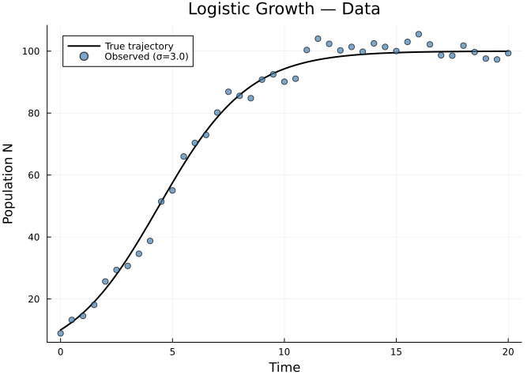
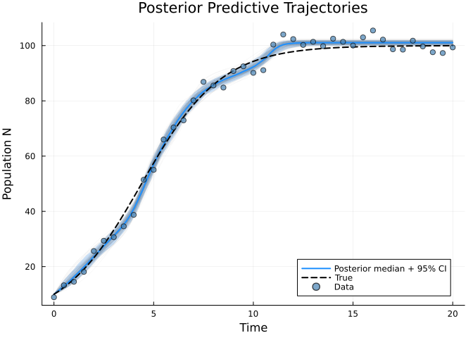
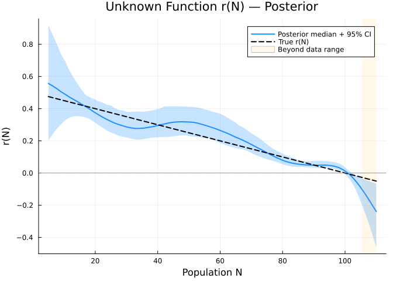
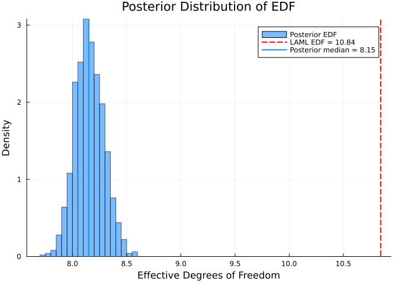
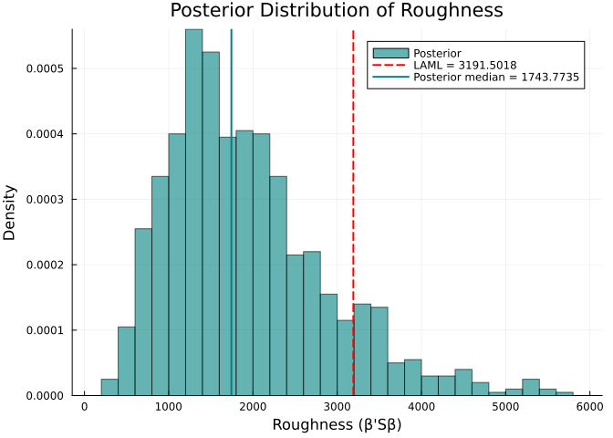
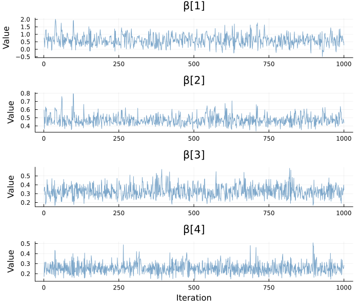
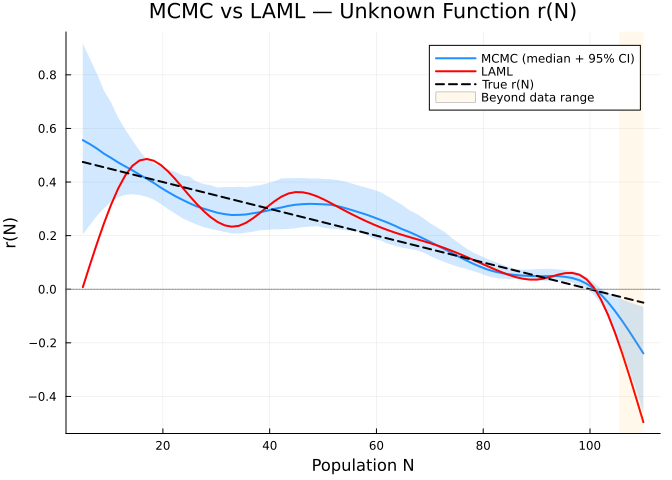
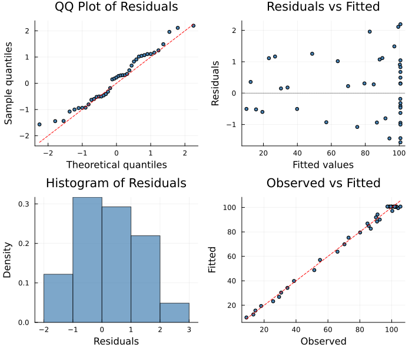

# Bayesian Inference with MCMCSolver
Simon Frost
2026-06-12

- [Overview](#overview)
- [Example: Logistic Growth with Unknown Carrying
  Capacity](#example-logistic-growth-with-unknown-carrying-capacity)
  - [Generate Synthetic Data](#generate-synthetic-data)
  - [Plot the Data](#plot-the-data)
  - [Set Up PSM Problem](#set-up-psm-problem)
  - [Step 1: Run LAML to Calibrate
    Smoothing](#step-1-run-laml-to-calibrate-smoothing)
  - [Why Smoothing Matters for MCMC](#why-smoothing-matters-for-mcmc)
  - [Step 2: Run MCMCSolver with Calibrated
    Prior](#step-2-run-mcmcsolver-with-calibrated-prior)
  - [Posterior Trajectory
    Predictions](#posterior-trajectory-predictions)
  - [Unknown Function Credible
    Intervals](#unknown-function-credible-intervals)
  - [Posterior Distribution of Effective Degrees of
    Freedom](#posterior-distribution-of-effective-degrees-of-freedom)
  - [Posterior Roughness](#posterior-roughness)
  - [Posterior Diagnostics](#posterior-diagnostics)
  - [Comparison with LAML](#comparison-with-laml)
  - [Discussion](#discussion)
- [Diagnostic Plots](#diagnostic-plots)
- [Summary](#summary)

## Overview

While point estimation via LAML or Adam is fast, **fully Bayesian
inference** quantifies uncertainty in both parameter estimates and
unknown function reconstructions. `MCMCSolver` uses the No-U-Turn
Sampler (NUTS) to draw posterior samples, returning an
`MCMCChains.Chains` object for downstream analysis.

This vignette demonstrates:

1.  Setting up a PSM for Bayesian inference
2.  Calibrating the MCMC prior using LAML’s smoothing parameter
3.  Posterior trajectory predictions and credible intervals
4.  Computing the posterior distribution of effective degrees of freedom
    (EDF)
5.  Comparing MCMC and LAML estimates

## Example: Logistic Growth with Unknown Carrying Capacity

We model population growth where the per-capita growth rate `r(N)` is
unknown — it should decrease as N approaches carrying capacity K.

True model: `dN/dt = r(N) · N` where `r(N) = r₀(1 - N/K)` with
`r₀ = 0.5`, `K = 100`.

``` julia
using PartiallySpecifiedModels
using OrdinaryDiffEq
using Plots
using Statistics
using LinearAlgebra
using MCMCChains
using Random
Random.seed!(42)

# NaN-safe helpers
nanmedian(x) = median(filter(!isnan, x))
nanquantile(x, q) = quantile(filter(!isnan, x), q)
```

    nanquantile (generic function with 1 method)

### Generate Synthetic Data

``` julia
function logistic!(du, u, p, t)
    du[1] = p.r(u[1]) * u[1]
end

# True per-capita rate: r(N) = 0.5 * (1 - N/100)
r_true(N) = 0.5 * (1.0 - N / 100.0)

true_p = (; r = r_true)
tspan = (0.0, 20.0)
sol_true = solve(ODEProblem(logistic!, [10.0], tspan, true_p), Tsit5(); saveat=0.5)
t_data = sol_true.t
N_true = [u[1] for u in sol_true.u]
σ_noise = 3.0
N_obs = N_true .+ σ_noise .* randn(length(N_true))
N_obs = max.(N_obs, 0.1)  # keep positive
data_matrix = reshape(N_obs, :, 1)
println("Population range in data: [$(round(minimum(N_obs), digits=1)), $(round(maximum(N_obs), digits=1))]")
```

    Population range in data: [8.9, 105.5]

### Plot the Data

``` julia
t_fine = range(tspan..., length=200)
sol_fine = solve(ODEProblem(logistic!, [10.0], tspan, true_p), Tsit5(); saveat=collect(t_fine))
N_fine = [u[1] for u in sol_fine.u]

p_data = plot(t_fine, N_fine, label="True trajectory", lw=2, color=:black,
    xlabel="Time", ylabel="Population N",
    title="Logistic Growth — Data")
scatter!(p_data, t_data, N_obs, label="Observed (σ=$σ_noise)", ms=4, color=:steelblue, alpha=0.7)
p_data
```

<div id="fig-data">



Figure 1: Observed data (circles) vs true trajectory (line)

</div>

### Set Up PSM Problem

An important consideration with nonparametric unknown functions is that
**estimation is only reliable where data is informative**. The
population in this model ranges from ~10 to ~105, so we set the B-spline
domain to `(5, 110)` — slightly beyond the observed data range, but not
so far that large extrapolation regions dominate the fit.

We use 12 knots to give the spline enough flexibility to capture the
shape of `r(N)` across the full data range.

``` julia
N_lo, N_hi = 5.0, 110.0
n_knots = 12
uf_r = BSplineApproximator(:r, (N_lo, N_hi), n_knots; initial=0.3)

prob = PSMProblem(logistic!, [10.0], tspan, [uf_r];
    data_times=collect(t_data),
    data_values=Float64.(data_matrix),
    obs_to_state=[1],
    known_params=NamedTuple(),
    likelihood=PartiallySpecifiedModels.Gaussian())
```

    PSMProblem{typeof(logistic!), Vector{Float64}, Gaussian, Tsit5{typeof(OrdinaryDiffEqCore.trivial_limiter!), typeof(OrdinaryDiffEqCore.trivial_limiter!), Static.False}}(logistic!, [10.0], (0.0, 20.0), BSplineApproximator[BSplineApproximator(:r, (5.0, 110.0), 12, PartiallySpecifiedModels.var"#6#7"{Float64}(0.3))], [0.0, 0.5, 1.0, 1.5, 2.0, 2.5, 3.0, 3.5, 4.0, 4.5  …  15.5, 16.0, 16.5, 17.0, 17.5, 18.0, 18.5, 19.0, 19.5, 20.0], [8.909927555644668; 13.240842524024732; … ; 97.31083844618732; 99.33886943440814;;], [1.0; 1.0; … ; 1.0; 1.0;;], [1], NamedTuple(), Gaussian(), Tsit5{typeof(OrdinaryDiffEqCore.trivial_limiter!), typeof(OrdinaryDiffEqCore.trivial_limiter!), Static.False}(OrdinaryDiffEqCore.trivial_limiter!, OrdinaryDiffEqCore.trivial_limiter!, static(false)), Dict{Symbol, Any}(), false, Float64[], nothing)

### Step 1: Run LAML to Calibrate Smoothing

Before running MCMC, we first fit with LAML to obtain the data-driven
smoothing parameter λ. This will inform the MCMC prior.

``` julia
sol_laml = solve(prob, LAML(maxiters=200, verbose=false))
λ_laml = sol_laml.smoothing_params[1]
edf_laml = sol_laml.edf
println("LAML smoothing parameter: λ = $(round(λ_laml, digits=4))")
println("LAML effective degrees of freedom: EDF = $(round(edf_laml, digits=2))")
```

    LAML smoothing parameter: λ = 0.0228
    LAML effective degrees of freedom: EDF = 10.84

### Why Smoothing Matters for MCMC

The `MCMCSolver` places a smoothing prior on the B-spline coefficients:

$$\log p(\boldsymbol{\beta} | \lambda) \propto -\frac{\lambda}{2} \boldsymbol{\beta}^\top \mathbf{S} \boldsymbol{\beta}$$

where **S** is the second-derivative penalty matrix. The `prior_scale`
parameter controls this: the effective λ = 1/`prior_scale`. If
`prior_scale` is too large (penalty too weak), the posterior samples
will be **wigglier** than the LAML estimate, because there is
insufficient smoothing.

We calibrate `prior_scale = 1/λ_LAML` so the MCMC prior matches the
data-driven smoothing:

``` julia
prior_scale_calibrated = 1.0 / λ_laml
println("Calibrated prior_scale = 1/λ = $(round(prior_scale_calibrated, digits=6))")
```

    Calibrated prior_scale = 1/λ = 43.859665

### Step 2: Run MCMCSolver with Calibrated Prior

``` julia
sol = solve(prob, MCMCSolver(
    n_samples=1000, n_warmup=500,
    target_accept=0.8,
    prior_scale=prior_scale_calibrated,
    verbose=false))
```

    PSMSolution((r = [0.3330496132897638, 0.4573988816824602, 0.3051618521665787, 0.2492077065763904, 0.4153499046820573, 0.31837502709219295, 0.20786841290372876, 0.15563086260642703, 0.07497077290057434, 0.039297877932131665, 0.0074157598139511375, -0.5356719035442593]), 118.36230870742465, 192.11215881069407, 12.0, [1.9671884525123782], [10.0; 12.46739326673092; … ; 100.70610263761917; 100.7061025154224;;], [8.909927555644668; 13.240842524024732; … ; 97.31083844618732; 99.33886943440814;;], [0.0, 0.5, 1.0, 1.5, 2.0, 2.5, 3.0, 3.5, 4.0, 4.5  …  15.5, 16.0, 16.5, 17.0, 17.5, 18.0, 18.5, 19.0, 19.5, 20.0], Dict{Symbol, Any}(:r => DataInterpolations.CubicSpline{Vector{Float64}, Vector{Float64}, Vector{Float64}, Vector{Float64}, Vector{Float64}, Vector{Float64}, Float64}([0.3330496132897638, 0.4573988816824602, 0.3051618521665787, 0.2492077065763904, 0.4153499046820573, 0.31837502709219295, 0.20786841290372876, 0.15563086260642703, 0.07497077290057434, 0.039297877932131665, 0.0074157598139511375, -0.5356719035442593], [5.0, 14.545454545454545, 24.09090909090909, 33.63636363636363, 43.18181818181818, 52.72727272727273, 62.27272727272727, 71.81818181818181, 81.36363636363636, 90.9090909090909, 100.45454545454545, 110.0], Float64[], DataInterpolations.CubicSplineParameterCache{Vector{Float64}}(Float64[], Float64[]), [0.0, 9.545454545454545, 9.545454545454545, 9.545454545454543, 9.545454545454547, 9.545454545454547, 9.545454545454547, 9.54545454545454, 9.545454545454547, 9.545454545454547, 9.545454545454547, 9.545454545454547], [0.0, -0.004967633638921797, 0.0016572327614352608, 0.004678963248967898, -0.005747965981960738, 0.0009865517487203546, 0.0009106895294300247, -0.0007922721897979212, 0.00038676534217817166, 0.0022076328963106, -0.008967672982450929, 0.0], DataInterpolations.ExtrapolationType.Extension, DataInterpolations.ExtrapolationType.Extension, FindFirstFunctions.Guesser{Vector{Float64}}([5.0, 14.545454545454545, 24.09090909090909, 33.63636363636363, 43.18181818181818, 52.72727272727273, 62.27272727272727, 71.81818181818181, 81.36363636363636, 90.9090909090909, 100.45454545454545, 110.0], Base.RefValue{Int64}(1), true), false, false)), MCMC chain (1000×13×1 Array{Float64, 3}))

### Posterior Trajectory Predictions

We draw posterior predictive trajectories by simulating the ODE for each
MCMC sample:

``` julia
chains = sol.convergence
sample_matrix = Array(chains)
n_samp = size(sample_matrix, 1)
np = nparams(uf_r)
n_plot = min(n_samp, 200)

t_pred = collect(range(tspan..., length=100))
trajectories = zeros(n_plot, length(t_pred))

knots_x = collect(range(N_lo, N_hi, length=uf_r.nknots))

for i in 1:n_plot
    params_i = sample_matrix[i, 1:np]
    ev = PartiallySpecifiedModels.build_bspline_evaluator(knots_x, params_i)
    try
        pred = solve(ODEProblem(logistic!, [10.0], tspan, (; r = ev)), Tsit5();
                     saveat=t_pred, abstol=1e-8, reltol=1e-8)
        trajectories[i, :] = [u[1] for u in pred.u]
    catch
        trajectories[i, :] .= NaN
    end
end
```

``` julia
p_traj = plot(xlabel="Time", ylabel="Population N",
    title="Posterior Predictive Trajectories", legend=:bottomright)
for i in 1:n_plot
    plot!(p_traj, t_pred, trajectories[i, :], color=:grey, alpha=0.05, label="")
end
traj_med = [nanmedian(trajectories[:, j]) for j in 1:length(t_pred)]
traj_lo = [nanquantile(trajectories[:, j], 0.025) for j in 1:length(t_pred)]
traj_hi = [nanquantile(trajectories[:, j], 0.975) for j in 1:length(t_pred)]
plot!(p_traj, t_pred, traj_med, ribbon=(traj_med .- traj_lo, traj_hi .- traj_med),
    fillalpha=0.2, color=:dodgerblue, lw=2, label="Posterior median + 95% CI")
plot!(p_traj, t_fine, N_fine, color=:black, lw=2, ls=:dash, label="True")
scatter!(p_traj, t_data, N_obs, ms=4, color=:steelblue, alpha=0.7, label="Data")
p_traj
```

<div id="fig-posterior-traj">



Figure 2: Posterior predictive trajectories (grey) with data and true
trajectory

</div>

### Unknown Function Credible Intervals

``` julia
N_range = range(N_lo, N_hi, length=80)
r_samples = zeros(n_samp, length(N_range))

for i in 1:n_samp
    params_i = sample_matrix[i, 1:np]
    ev = PartiallySpecifiedModels.build_bspline_evaluator(knots_x, params_i)
    for (j, N) in enumerate(N_range)
        r_samples[i, j] = ev(N)
    end
end

r_lower = [quantile(r_samples[:, j], 0.025) for j in 1:length(N_range)]
r_upper = [quantile(r_samples[:, j], 0.975) for j in 1:length(N_range)]
r_median = [quantile(r_samples[:, j], 0.5) for j in 1:length(N_range)]
r_true_vals = [r_true(N) for N in N_range]
```

    80-element Vector{Float64}:
      0.475
      0.46835443037974683
      0.4617088607594937
      0.4550632911392405
      0.44841772151898734
      0.4417721518987342
      0.435126582278481
      0.42848101265822786
      0.4218354430379747
      0.4151898734177215
      ⋮
      0.0031645569620253333
     -0.0034810126582278667
     -0.010126582278480956
     -0.016772151898734156
     -0.023417721518987356
     -0.030063291139240556
     -0.036708860759493644
     -0.043354430379746844
     -0.050000000000000044

``` julia
N_data_max = maximum(N_obs)
p_uf = plot(collect(N_range), r_median, ribbon=(r_median .- r_lower, r_upper .- r_median),
    fillalpha=0.25, color=:dodgerblue, lw=2, label="Posterior median + 95% CI",
    xlabel="Population N", ylabel="r(N)",
    title="Unknown Function r(N) — Posterior")
plot!(p_uf, collect(N_range), r_true_vals, color=:black, lw=2, ls=:dash, label="True r(N)")
hline!(p_uf, [0.0], color=:grey, ls=:dot, label="")
vspan!(p_uf, [N_data_max, N_hi], color=:orange, alpha=0.08, label="Beyond data range")
p_uf
```

<div id="fig-uf-ci">



Figure 3: Posterior credible interval for the unknown function r(N)

</div>

### Posterior Distribution of Effective Degrees of Freedom

The effective degrees of freedom (EDF) measures the complexity of the
fitted spline. For a penalized spline with penalty matrix **S** and
smoothing parameter λ, the EDF is:

$$\text{EDF} = \text{tr}\left[(\mathbf{J}^\top \mathbf{W} \mathbf{J} + \lambda \mathbf{S})^{-1} \mathbf{J}^\top \mathbf{W} \mathbf{J}\right]$$

We compute a posterior distribution of EDF by evaluating this at each
MCMC sample. Since the Jacobian **J** depends on the ODE solution (which
changes with each sample), we use a finite-difference approximation:

``` julia
# Penalty matrix — must use penalty_matrix(uf_r) which uses unit-interval
# knots, matching what the LAML solver uses internally
S = penalty_matrix(uf_r)
λ_eff = λ_laml  # effective λ = 1/prior_scale_calibrated = λ_laml

# Compute posterior EDF for each sample
edf_posterior = zeros(n_samp)
roughness = zeros(n_samp)

for i in 1:n_samp
    beta_i = sample_matrix[i, 1:np]
    roughness[i] = dot(beta_i, S * beta_i)

    ev_i = PartiallySpecifiedModels.build_bspline_evaluator(knots_x, beta_i)
    try
        pred_i = solve(ODEProblem(logistic!, [10.0], tspan, (; r = ev_i)), Tsit5();
                       saveat=collect(t_data), abstol=1e-8, reltol=1e-8)
        y_base = [pred_i[1, k] for k in 1:length(t_data)]

        # Jacobian via forward finite differences
        J_i = zeros(length(t_data), np)
        ε = 1e-5
        for p_idx in 1:np
            beta_pert = copy(beta_i)
            beta_pert[p_idx] += ε
            ev_pert = PartiallySpecifiedModels.build_bspline_evaluator(knots_x, beta_pert)
            pred_pert = solve(ODEProblem(logistic!, [10.0], tspan, (; r = ev_pert)), Tsit5();
                              saveat=collect(t_data), abstol=1e-8, reltol=1e-8)
            J_i[:, p_idx] = ([pred_pert[1, k] for k in 1:length(t_data)] .- y_base) ./ ε
        end

        JWJ = J_i' * J_i
        H_i = JWJ + λ_eff * S
        edf_posterior[i] = tr(H_i \ JWJ)
    catch
        edf_posterior[i] = NaN
    end
end
edf_valid = filter(!isnan, edf_posterior)
```

    1000-element Vector{Float64}:
     8.108843085562675
     8.268363466845312
     8.33808284784088
     8.004677274804633
     8.05105889046501
     7.90875992905994
     7.933172481009522
     7.988341746899114
     7.99085661288671
     8.143867567841598
     ⋮
     8.197455636977981
     8.289759264858706
     8.296416277561049
     8.122282278935359
     8.14906233811099
     8.339054700084484
     8.19347397709991
     8.147133190849784
     8.08898773320932

``` julia
p_edf = histogram(edf_valid, bins=30, normalize=:pdf, alpha=0.6, color=:dodgerblue,
    xlabel="Effective Degrees of Freedom", ylabel="Density",
    title="Posterior Distribution of EDF", label="Posterior EDF")
vline!(p_edf, [edf_laml], color=:red, lw=2, ls=:dash,
    label="LAML EDF = $(round(edf_laml, digits=2))")
vline!(p_edf, [median(edf_valid)], color=:dodgerblue, lw=2,
    label="Posterior median = $(round(median(edf_valid), digits=2))")
p_edf
```

<div id="fig-edf-posterior">



Figure 4: Posterior distribution of effective degrees of freedom (EDF)

</div>

    EDF summary:
      LAML point estimate: 10.84
      Posterior median:    8.15
      Posterior mean:      8.16
      95% CI:              [7.91, 8.43]

### Posterior Roughness

The roughness penalty `β'Sβ` provides a direct measure of function
complexity — higher values mean a wigglier estimated function:

``` julia
p_rough = histogram(roughness, bins=30, normalize=:pdf, alpha=0.6, color=:teal,
    xlabel="Roughness (β'Sβ)", ylabel="Density",
    title="Posterior Distribution of Roughness", label="Posterior")
β_laml = collect(sol_laml.parameters)[1:np]
roughness_laml = dot(β_laml, S * β_laml)
vline!(p_rough, [roughness_laml], color=:red, lw=2, ls=:dash,
    label="LAML = $(round(roughness_laml, digits=4))")
vline!(p_rough, [median(roughness)], color=:teal, lw=2,
    label="Posterior median = $(round(median(roughness), digits=4))")
p_rough
```

<div id="fig-roughness">



Figure 5: Posterior distribution of spline roughness β’Sβ

</div>

### Posterior Diagnostics

#### Trace Plots

``` julia
param_names = names(chains, :parameters)
n_show = min(4, length(param_names))
p_traces = plot(layout=(n_show, 1), size=(700, 150 * n_show))
for i in 1:n_show
    vals = Array(chains[:, param_names[i], :])[:, 1]
    plot!(p_traces, vals, subplot=i, label="", color=:steelblue, alpha=0.7,
        title="β[$i]",
        xlabel= i == n_show ? "Iteration" : "", ylabel="Value")
end
p_traces
```

<div id="fig-trace">



Figure 6: Trace plots for selected B-spline coefficients

</div>

#### Numerical Summary

    Posterior r(N) at selected points:
      r(10): median=0.5213 [0.2944, 0.8736] (true: 0.45)
      r(25): median=0.3095 [0.2051, 0.4551] (true: 0.375)
      r(50): median=0.3508 [0.2379, 0.5085] (true: 0.25)
      r(75): median=0.1316 [0.0843, 0.2149] (true: 0.125)
      r(100): median=0.0451 [0.0111, 0.0986] (true: 0.0)

### Comparison with LAML

``` julia
r_laml = sol_laml.unknown_functions[:r]
r_laml_vals = [r_laml(N) for N in N_range]
```

    80-element Vector{Float64}:
     -0.06161651880654566
      0.04077933065950305
      0.1400203343740297
      0.2329516465855122
      0.31641842154242866
      0.3872658134932568
      0.4423389766864747
      0.4784830653705604
      0.4932129244277526
      0.48871377896256957
      ⋮
      0.05203910205762316
      0.001750005862960341
     -0.0725283730413814
     -0.16799141901745746
     -0.2811083542199788
     -0.40834840080365786
     -0.5461807809232029
     -0.6910747167333258
     -0.8394994303887379

``` julia
p_comp = plot(collect(N_range), r_median, ribbon=(r_median .- r_lower, r_upper .- r_median),
    fillalpha=0.2, color=:dodgerblue, lw=2, label="MCMC (median + 95% CI)",
    xlabel="Population N", ylabel="r(N)",
    title="MCMC vs LAML — Unknown Function r(N)")
plot!(p_comp, collect(N_range), r_laml_vals, color=:red, lw=2, label="LAML")
plot!(p_comp, collect(N_range), r_true_vals, color=:black, lw=2, ls=:dash, label="True r(N)")
hline!(p_comp, [0.0], color=:grey, ls=:dot, label="")
vspan!(p_comp, [N_data_max, N_hi], color=:orange, alpha=0.08, label="Beyond data range")
p_comp
```

<div id="fig-comparison">



Figure 7: MCMC posterior vs LAML point estimate for r(N)

</div>

### Discussion

**Why MCMC can be wigglier than LAML:** The key difference is how
smoothing is handled:

- **LAML** optimizes the smoothing parameter λ by maximizing the
  Laplace-approximate marginal likelihood. This automatically balances
  data fit against complexity, and λ is estimated from the data.
- **MCMCSolver** uses λ as a fixed prior hyperparameter
  (`prior_scale = 1/λ`). If this is set too low (weak penalty), the
  posterior samples will be undersmoothed and wiggly.

The solution demonstrated here is to **calibrate the MCMC prior using
LAML’s estimate**: run LAML first, extract the optimal λ, then set
`prior_scale = 1/λ`. This gives MCMC posterior samples with comparable
smoothness, while still providing full uncertainty quantification.

**Posterior EDF interpretation:** The EDF distribution shows how much
complexity the data supports. Values close to the number of knots
indicate overfitting risk, while low values suggest the function is
well-constrained. The posterior spread in EDF reflects **uncertainty
about model complexity** — a feature unique to Bayesian approaches.

## Diagnostic Plots

A standard 4-panel diagnostic display assesses residual behaviour for
the MCMC fit. The QQ plot checks normality of standardized residuals,
“Residuals vs Fitted” detects systematic patterns, the histogram
visualises the residual distribution, and “Observed vs Fitted” checks
overall calibration.

``` julia
using PartiallySpecifiedModels: appraise

diag = appraise(sol)

p_qq = scatter(diag.qq_theoretical, diag.qq_sample,
    xlabel="Theoretical quantiles", ylabel="Sample quantiles",
    title="QQ Plot of Residuals", ms=3, legend=false, color=:steelblue)
mn, mx = extrema(vcat(diag.qq_theoretical, diag.qq_sample))
plot!(p_qq, [mn, mx], [mn, mx], color=:red, ls=:dash, label="")

p_rf = scatter(diag.fitted, diag.residuals,
    xlabel="Fitted values", ylabel="Residuals",
    title="Residuals vs Fitted", ms=3, legend=false, color=:steelblue)
hline!(p_rf, [0], color=:gray, ls=:dot)

p_hist = histogram(diag.residuals, normalize=:pdf,
    xlabel="Residuals", ylabel="Density",
    title="Histogram of Residuals", legend=false, color=:steelblue, alpha=0.7)

p_of = scatter(diag.observed, diag.fitted,
    xlabel="Observed", ylabel="Fitted",
    title="Observed vs Fitted", ms=3, legend=false, color=:steelblue)
mn2, mx2 = extrema(vcat(diag.observed, diag.fitted))
plot!(p_of, [mn2, mx2], [mn2, mx2], color=:red, ls=:dash, label="")

plot(p_qq, p_rf, p_hist, p_of, layout=(2, 2), size=(700, 600))
```



    Durbin-Watson: 1.581

> [!TIP]
>
> ### See Also
>
> - [Vignette 19:
>   Pseudo-Marginal](../19_pseudo_marginal/19_pseudo_marginal.qmd) —
>   Bayesian inference with probabilistic ODE likelihood
> - [Vignette 24: Variational](../24_variational/24_variational.qmd) —
>   fast approximate Bayesian inference
> - [Vignette 29: Bootstrap](../29_bootstrap/29_bootstrap.qmd) —
>   frequentist uncertainty via resampling

## Summary

| Feature | MCMCSolver |
|----|----|
| **Inference type** | Fully Bayesian (NUTS/HMC) |
| **Output** | `MCMCChains.Chains` |
| **Uncertainty** | Full posterior, credible intervals |
| **Prior calibration** | Use `prior_scale = 1/λ_LAML` for appropriate smoothing |
| **EDF** | Posterior distribution via hat matrix at each sample |
| **Best for** | Uncertainty quantification, model comparison |

`MCMCSolver` complements the point estimation solvers (LAML, Adam) by
providing full posterior distributions. For best results, calibrate the
smoothing prior using LAML’s data-driven λ estimate.
