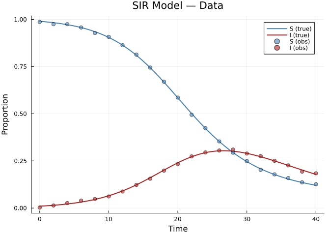
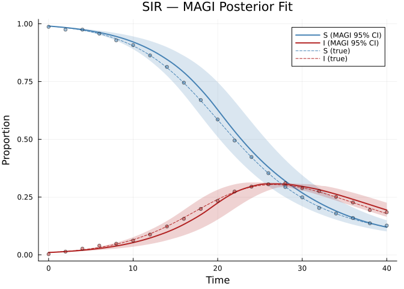
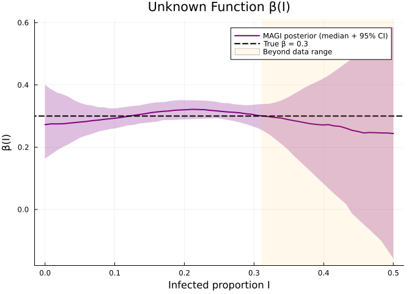
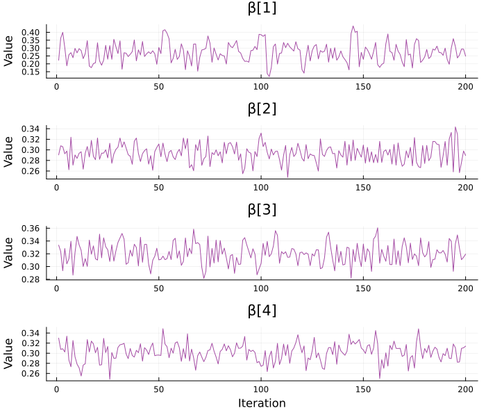
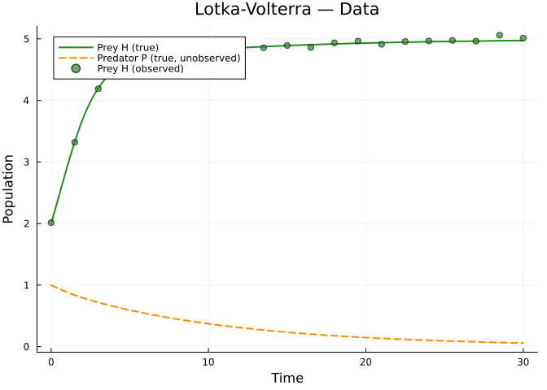
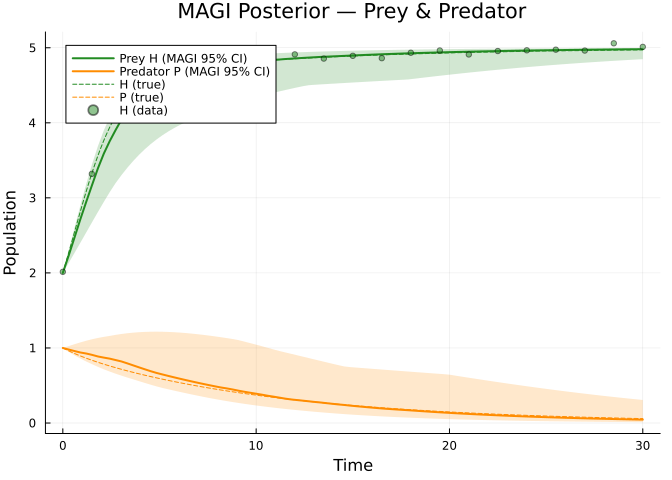
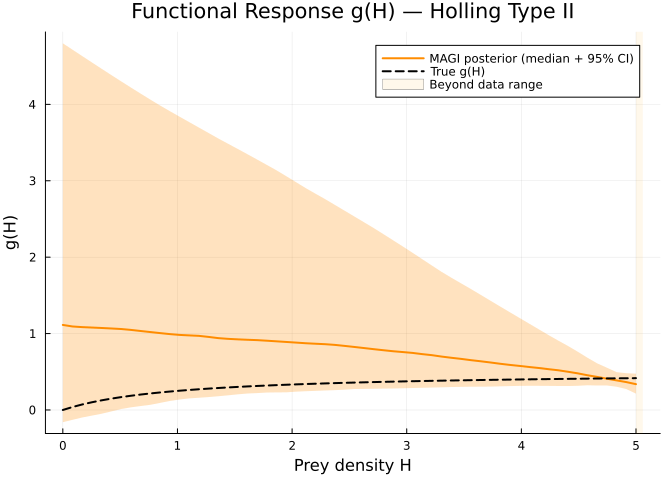
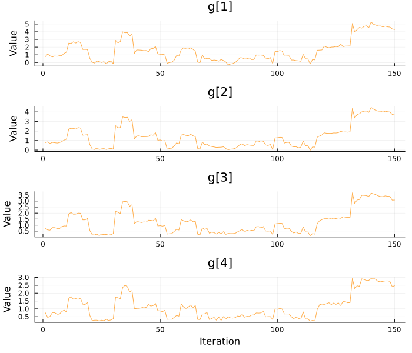
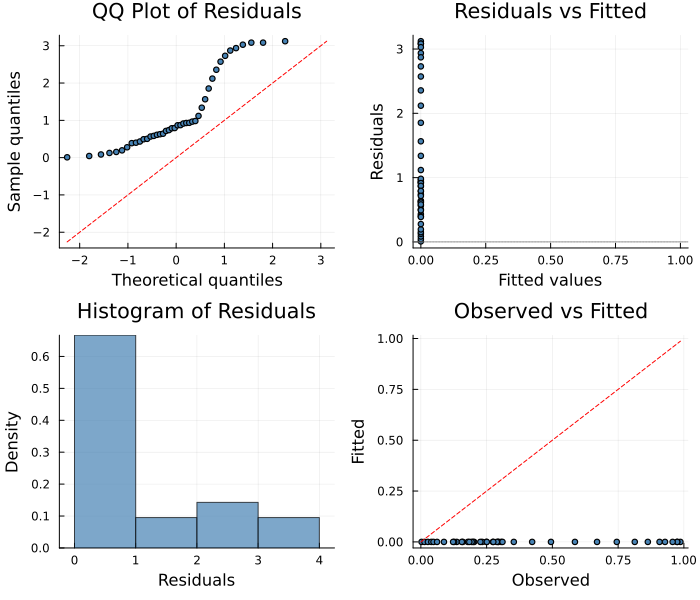

# MAGI: Manifold-Constrained Gaussian Process Inference
Simon Frost
2026-04-02

- [Overview](#overview)
- [Example 1: SIR Model (Fully
  Observed)](#example-1-sir-model-fully-observed)
  - [Generate Data](#generate-data)
  - [Plot the Data](#plot-the-data)
  - [Set Up and Solve](#set-up-and-solve)
  - [Posterior Trajectories](#posterior-trajectories)
  - [Unknown Function β(I)](#unknown-function-βi)
  - [Trace Plots](#trace-plots)
- [Example 2: Predator-Prey (Partially Observed Prey
  Only)](#example-2-predator-prey-partially-observed-prey-only)
  - [Generate Data (Prey Only)](#generate-data-prey-only)
  - [Plot the Data](#plot-the-data-1)
  - [Fit with MAGI (Observing Only
    Prey)](#fit-with-magi-observing-only-prey)
  - [Posterior Trajectories](#posterior-trajectories-1)
  - [Functional Response Recovery](#functional-response-recovery)
  - [Trace Plots](#trace-plots-1)
- [Comparison: MagiSolver vs
  MCMCSolver](#comparison-magisolver-vs-mcmcsolver)
- [Diagnostic Plots](#diagnostic-plots)
- [Summary](#summary)

## Overview

**MAGI** (Manifold-constrained Gaussian process Inference) is a Bayesian
method that uses Gaussian processes to infer ODE parameters without
numerically solving the ODE during sampling. Instead, it models each
state component as integrated Brownian motion and uses a Kalman filter
to enforce the ODE dynamics as a “manifold constraint.”

**Key advantages:**

- **States marginalized out**: The Kalman filter analytically integrates
  over trajectory uncertainty, so only ODE parameters are sampled
  (lower-dimensional MCMC).
- **No ODE solver in the loop**: Avoids numerical integration at each
  MCMC step — faster per iteration than `MCMCSolver`.
- **Handles partially observed systems**: Unobserved state components
  are naturally inferred through the ODE constraint.

This vignette demonstrates `MagiSolver` on two examples: a fully
observed system and a partially observed one.

**Reference:** Yang, Wong & Kou (2021) “Inference of dynamic systems
from noisy and sparse data via manifold-constrained Gaussian processes.”
*PNAS* 118(15).

``` julia
using PartiallySpecifiedModels
using OrdinaryDiffEq
using Plots
using Statistics
using MCMCChains
using Random
Random.seed!(123)
```

    TaskLocalRNG()

## Example 1: SIR Model (Fully Observed)

We fit an SIR model where the force of infection `β(I)` is unknown.

True model: `β(I) = 0.3` (constant, mass-action).

``` julia
function sir!(du, u, p, t)
    S, I, R = u
    β_val = p.β(I)
    du[1] = -β_val * S * I           # dS/dt
    du[2] = β_val * S * I - 0.1 * I  # dI/dt
    du[3] = 0.1 * I                  # dR/dt
end
```

    sir! (generic function with 1 method)

### Generate Data

``` julia
true_p = (; β = I -> 0.3)
sol_true = solve(ODEProblem(sir!, [0.99, 0.01, 0.0], (0.0, 40.0), true_p),
                 Tsit5(); saveat=2.0)

t_data = collect(sol_true.t)
noise = 0.005
data_SI = hcat([sol_true.u[i][1:2] .+ noise .* randn(2) for i in 1:length(sol_true.t)]...)'
data_SI = max.(data_SI, 0.001)

S_true = [sol_true.u[i][1] for i in 1:length(sol_true.t)]
I_true = [sol_true.u[i][2] for i in 1:length(sol_true.t)]
```

    21-element Vector{Float64}:
     0.01
     0.014798852083446426
     0.021784934635223734
     0.03182285803804494
     0.04597475471170782
     0.06539262284829846
     0.09104385624411435
     0.12321500350597699
     0.16087652175445682
     0.20121975916254814
     ⋮
     0.29365032687951853
     0.3032531966247468
     0.3013449791327519
     0.2900296382132258
     0.27202986429089393
     0.25000017788742174
     0.22607674059778435
     0.20186897654053457
     0.17847135397622216

### Plot the Data

``` julia
t_fine = range(0.0, 40.0, length=200)
sol_fine = solve(ODEProblem(sir!, [0.99, 0.01, 0.0], (0.0, 40.0), true_p),
                 Tsit5(); saveat=collect(t_fine))
S_fine = [sol_fine.u[i][1] for i in 1:length(sol_fine.u)]
I_fine = [sol_fine.u[i][2] for i in 1:length(sol_fine.u)]

p_sir_data = plot(t_fine, S_fine, label="S (true)", lw=2, color=:steelblue,
    xlabel="Time", ylabel="Proportion", title="SIR Model — Data")
plot!(p_sir_data, t_fine, I_fine, label="I (true)", lw=2, color=:firebrick)
scatter!(p_sir_data, t_data, data_SI[:, 1], label="S (obs)", ms=4, color=:steelblue, alpha=0.6)
scatter!(p_sir_data, t_data, data_SI[:, 2], label="I (obs)", ms=4, color=:firebrick, alpha=0.6)
p_sir_data
```

<div id="fig-sir-data">



Figure 1: SIR data: observed S and I (points) vs true trajectories
(lines)

</div>

### Set Up and Solve

``` julia
uf_β = BSplineApproximator(:β, (0.0, 0.5), 6; initial=0.2)

prob_sir = PSMProblem(sir!, [0.99, 0.01, 0.0], (0.0, 40.0), [uf_β];
    data_times=t_data,
    data_values=Float64.(data_SI),
    obs_to_state=[1, 2],
    known_params=NamedTuple(),
    likelihood=PartiallySpecifiedModels.Gaussian())

sol_sir = solve(prob_sir, MagiSolver(
    n_samples=200, n_warmup=200,
    n_gridpoints=80, n_deriv=3,
    obs_var=noise^2, preoptimize=true, verbose=false))
```

    [ Info: Found initial step size 0.01171875

    PSMSolution((β = [0.27327491942619825, 0.2934848290452108, 0.3206340997639245, 0.30187841175662217, 0.2617178634993693, 0.2219884914310222]), 0.0, 0.0, 6.0, Float64[], [0.0 0.0; 0.0 0.0; … ; 0.0 0.0; 0.0 0.0], [0.9867713466394801 0.002683743105555393; 0.9746336282649085 0.013710526549528696; … ; 0.13646451526712325 0.19328337605363644; 0.12652759050099308 0.18421483813613687], [0.0, 2.0, 4.0, 6.0, 8.0, 10.0, 12.0, 14.0, 16.0, 18.0  …  22.0, 24.0, 26.0, 28.0, 30.0, 32.0, 34.0, 36.0, 38.0, 40.0], Dict{Symbol, Any}(:β => DataInterpolations.CubicSpline{Vector{Float64}, Vector{Float64}, Vector{Float64}, Vector{Float64}, Vector{Float64}, Vector{Float64}, Float64}([0.27327491942619825, 0.2934848290452108, 0.3206340997639245, 0.30187841175662217, 0.2617178634993693, 0.2219884914310222], [0.0, 0.1, 0.2, 0.3, 0.4, 0.5], Float64[], DataInterpolations.CubicSplineParameterCache{Vector{Float64}}(Float64[], Float64[]), [0.0, 0.1, 0.1, 0.09999999999999998, 0.10000000000000003, 0.09999999999999998], [0.0, 2.8453434984252577, -7.217757333880329, -1.5172893985135567, 0.44399877796424625, 0.0], DataInterpolations.ExtrapolationType.Extension, DataInterpolations.ExtrapolationType.Extension, FindFirstFunctions.Guesser{Vector{Float64}}([0.0, 0.1, 0.2, 0.3, 0.4, 0.5], Base.RefValue{Int64}(1), true), false, false)), (method = :magi, chains = MCMC chain (200×6×1 Array{Float64, 3})))

### Posterior Trajectories

We reconstruct trajectory predictions by forward-solving the ODE for
each posterior sample:

``` julia
chains_sir = sol_sir.convergence.chains
sample_sir = Array(chains_sir)
n_samp_sir = size(sample_sir, 1)
np_sir = nparams(uf_β)
n_traj = min(n_samp_sir, 100)

t_pred_sir = collect(range(0.0, 40.0, length=100))
traj_S = zeros(n_traj, length(t_pred_sir))
traj_I = zeros(n_traj, length(t_pred_sir))

knots_sir = collect(range(0.0, 0.5, length=uf_β.nknots))
for i in 1:n_traj
    params_i = sample_sir[i, 1:np_sir]
    ev = PartiallySpecifiedModels.build_bspline_evaluator(knots_sir, params_i)
    try
        pred = solve(ODEProblem(sir!, [0.99, 0.01, 0.0], (0.0, 40.0), (; β = ev)),
                     Tsit5(); saveat=t_pred_sir, abstol=1e-8, reltol=1e-8)
        traj_S[i, :] = [pred.u[k][1] for k in 1:length(pred.u)]
        traj_I[i, :] = [pred.u[k][2] for k in 1:length(pred.u)]
    catch
        traj_S[i, :] .= NaN
        traj_I[i, :] .= NaN
    end
end
```

``` julia
nanmed(x) = median(filter(!isnan, x))
nanq(x, q) = quantile(filter(!isnan, x), q)

S_med = [nanmed(traj_S[:, j]) for j in 1:length(t_pred_sir)]
S_lo = [nanq(traj_S[:, j], 0.025) for j in 1:length(t_pred_sir)]
S_hi = [nanq(traj_S[:, j], 0.975) for j in 1:length(t_pred_sir)]
I_med = [nanmed(traj_I[:, j]) for j in 1:length(t_pred_sir)]
I_lo = [nanq(traj_I[:, j], 0.025) for j in 1:length(t_pred_sir)]
I_hi = [nanq(traj_I[:, j], 0.975) for j in 1:length(t_pred_sir)]

p_sir_fit = plot(t_pred_sir, S_med, ribbon=(S_med .- S_lo, S_hi .- S_med),
    fillalpha=0.2, color=:steelblue, lw=2, label="S (MAGI 95% CI)",
    xlabel="Time", ylabel="Proportion", title="SIR — MAGI Posterior Fit")
plot!(p_sir_fit, t_pred_sir, I_med, ribbon=(I_med .- I_lo, I_hi .- I_med),
    fillalpha=0.2, color=:firebrick, lw=2, label="I (MAGI 95% CI)")
plot!(p_sir_fit, t_fine, S_fine, color=:steelblue, lw=1, ls=:dash, label="S (true)")
plot!(p_sir_fit, t_fine, I_fine, color=:firebrick, lw=1, ls=:dash, label="I (true)")
scatter!(p_sir_fit, t_data, data_SI[:, 1], ms=3, color=:steelblue, alpha=0.5, label="")
scatter!(p_sir_fit, t_data, data_SI[:, 2], ms=3, color=:firebrick, alpha=0.5, label="")
p_sir_fit
```

<div id="fig-sir-traj">



Figure 2: SIR posterior predictive trajectories from MAGI

</div>

### Unknown Function β(I)

``` julia
I_range = range(0.0, 0.5, length=60)
β_samples = zeros(n_samp_sir, length(I_range))
for i in 1:n_samp_sir
    params_i = sample_sir[i, 1:np_sir]
    ev = PartiallySpecifiedModels.build_bspline_evaluator(knots_sir, params_i)
    for (j, Iv) in enumerate(I_range)
        β_samples[i, j] = ev(Iv)
    end
end

β_med = [median(β_samples[:, j]) for j in 1:length(I_range)]
β_lo = [quantile(β_samples[:, j], 0.025) for j in 1:length(I_range)]
β_hi = [quantile(β_samples[:, j], 0.975) for j in 1:length(I_range)]
```

    60-element Vector{Float64}:
     0.3998939806467205
     0.38662434613193297
     0.3753071167258108
     0.36975202543430913
     0.3618958324156978
     0.3500502393673738
     0.341872178664738
     0.3362991045956683
     0.33353496447484615
     0.3285341904868064
     ⋮
     0.47059896825930325
     0.4850028237536813
     0.49969723197627447
     0.5146942591353737
     0.5299434687415613
     0.5453944243054197
     0.5597994768193397
     0.5736197043580726
     0.5874596862055337

``` julia
I_data_max = maximum(data_SI[:, 2])
p_β = plot(collect(I_range), β_med, ribbon=(β_med .- β_lo, β_hi .- β_med),
    fillalpha=0.25, color=:purple, lw=2, label="MAGI posterior (median + 95% CI)",
    xlabel="Infected proportion I", ylabel="β(I)",
    title="Unknown Function β(I)")
hline!(p_β, [0.3], color=:black, lw=2, ls=:dash, label="True β = 0.3")
vspan!(p_β, [I_data_max, 0.5], color=:orange, alpha=0.08, label="Beyond data range")
p_β
```

<div id="fig-sir-beta">



Figure 3: Posterior credible interval for β(I) — should be constant at
0.3

</div>

### Trace Plots

``` julia
pn_sir = names(chains_sir, :parameters)
n_show_sir = min(4, length(pn_sir))
p_tr_sir = plot(layout=(n_show_sir, 1), size=(700, 150 * n_show_sir))
for i in 1:n_show_sir
    vals = Array(chains_sir[:, pn_sir[i], :])[:, 1]
    plot!(p_tr_sir, vals, subplot=i, label="", color=:purple, alpha=0.7,
        title=string(pn_sir[i]), xlabel= i == n_show_sir ? "Iteration" : "", ylabel="Value")
end
p_tr_sir
```

<div id="fig-sir-trace">



Figure 4: Trace plots for SIR β(I) spline coefficients

</div>

## Example 2: Predator-Prey (Partially Observed Prey Only)

MAGI’s key strength is handling **partially observed systems**. Here we
observe only the prey population in a Lotka-Volterra model and infer the
predator functional response.

``` julia
function lv!(du, u, p, t)
    H, P = u
    du[1] = H * (1.0 - H / 5.0) - p.g(H) * P   # logistic prey + predation
    du[2] = 0.5 * p.g(H) * P - 0.3 * P           # predator response - mortality
end
```

    lv! (generic function with 1 method)

True functional response: `g(H) = 0.5 H / (1 + H)` (Holling Type II,
saturates at 0.5).

### Generate Data (Prey Only)

``` julia
g_true(H) = 0.5 * H / (1.0 + H)

true_p_lv = (; g = g_true)
sol_true_lv = solve(ODEProblem(lv!, [2.0, 1.0], (0.0, 30.0), true_p_lv),
                    Tsit5(); saveat=1.5)

t_lv = collect(sol_true_lv.t)
H_true = [sol_true_lv.u[i][1] for i in 1:length(sol_true_lv.t)]
P_true = [sol_true_lv.u[i][2] for i in 1:length(sol_true_lv.t)]
prey_data = H_true .+ 0.05 .* randn(length(H_true))
prey_data = max.(prey_data, 0.01)
prey_matrix = reshape(prey_data, :, 1)
```

    21×1 Matrix{Float64}:
     1.9547244961190091
     3.434392520204258
     4.238965745043219
     4.554822301037396
     4.674852427155286
     4.808157138923292
     4.751580260467379
     4.888910277479439
     4.729172310886974
     4.871656709344678
     ⋮
     4.946841015239459
     4.929431155660668
     5.011214378261437
     4.8963469095454615
     4.889620902467444
     4.924077246448777
     4.9098438073611685
     4.925491007235875
     4.944687100556234

### Plot the Data

``` julia
t_lv_fine = range(0.0, 30.0, length=200)
sol_lv_fine = solve(ODEProblem(lv!, [2.0, 1.0], (0.0, 30.0), true_p_lv),
                    Tsit5(); saveat=collect(t_lv_fine))
H_fine = [sol_lv_fine.u[i][1] for i in 1:length(sol_lv_fine.u)]
P_fine = [sol_lv_fine.u[i][2] for i in 1:length(sol_lv_fine.u)]

p_lv_data = plot(t_lv_fine, H_fine, label="Prey H (true)", lw=2, color=:forestgreen,
    xlabel="Time", ylabel="Population", title="Lotka-Volterra — Data")
plot!(p_lv_data, t_lv_fine, P_fine, label="Predator P (true, unobserved)", lw=2,
    color=:darkorange, ls=:dash)
scatter!(p_lv_data, t_lv, prey_data, label="Prey H (observed)", ms=4,
    color=:forestgreen, alpha=0.7)
p_lv_data
```

<div id="fig-lv-data">



Figure 5: Lotka-Volterra data: only prey (H) is observed

</div>

### Fit with MAGI (Observing Only Prey)

``` julia
uf_g = BSplineApproximator(:g, (0.0, 5.0), 8; initial=0.2)

prob_lv = PSMProblem(lv!, [2.0, 1.0], (0.0, 30.0), [uf_g];
    data_times=t_lv,
    data_values=Float64.(prey_matrix),
    obs_to_state=[1],       # only prey observed!
    known_params=NamedTuple(),
    likelihood=PartiallySpecifiedModels.Gaussian())

sol_lv = solve(prob_lv, MagiSolver(
    n_samples=200, n_warmup=200,
    n_gridpoints=60, n_deriv=3,
    sigma=[1.0, 1.0],      # explicit sigma for both states
    obs_var=0.0025, preoptimize=true, verbose=false))
```

    [ Info: Found initial step size 0.0029296875

    PSMSolution((g = [0.01528597603102903, 0.10709876808927637, 0.19489616608095123, 0.2770522932060643, 0.34302891617325104, 0.3956080028415034, 0.4270735942783363, 0.4333345190937093]), 0.0, 0.0, 8.0, Float64[], [0.0; 0.0; … ; 0.0; 0.0;;], [1.9547244961190091; 3.434392520204258; … ; 4.925491007235875; 4.944687100556234;;], [0.0, 1.5, 3.0, 4.5, 6.0, 7.5, 9.0, 10.5, 12.0, 13.5  …  16.5, 18.0, 19.5, 21.0, 22.5, 24.0, 25.5, 27.0, 28.5, 30.0], Dict{Symbol, Any}(:g => DataInterpolations.CubicSpline{Vector{Float64}, Vector{Float64}, Vector{Float64}, Vector{Float64}, Vector{Float64}, Vector{Float64}, Float64}([0.01528597603102903, 0.10709876808927637, 0.19489616608095123, 0.2770522932060643, 0.34302891617325104, 0.3956080028415034, 0.4270735942783363, 0.4333345190937093], [0.0, 0.7142857142857143, 1.4285714285714286, 2.142857142857143, 2.857142857142857, 3.5714285714285716, 4.285714285714286, 5.0], Float64[], DataInterpolations.CubicSplineParameterCache{Vector{Float64}}(Float64[], Float64[]), [0.0, 0.7142857142857143, 0.7142857142857143, 0.7142857142857142, 0.7142857142857144, 0.7142857142857144, 0.714285714285714, 0.7142857142857144], [0.0, -0.010977563139304501, -0.0033107816656744267, -0.04212065558876439, -0.01847756487648153, -0.041524111780778236, -0.06372069192189768, 0.0], DataInterpolations.ExtrapolationType.Extension, DataInterpolations.ExtrapolationType.Extension, FindFirstFunctions.Guesser{Vector{Float64}}([0.0, 0.7142857142857143, 1.4285714285714286, 2.142857142857143, 2.857142857142857, 3.5714285714285716, 4.285714285714286, 5.0], Base.RefValue{Int64}(1), true), false, false)), (method = :magi, chains = MCMC chain (200×8×1 Array{Float64, 3})))

### Posterior Trajectories

``` julia
chains_lv = sol_lv.convergence.chains
sample_lv = Array(chains_lv)
n_samp_lv = size(sample_lv, 1)
np_lv = nparams(uf_g)
n_traj_lv = min(n_samp_lv, 100)

t_pred_lv = collect(range(0.0, 30.0, length=100))
traj_H = zeros(n_traj_lv, length(t_pred_lv))
traj_P = zeros(n_traj_lv, length(t_pred_lv))

knots_lv = collect(range(0.0, 5.0, length=uf_g.nknots))
for i in 1:n_traj_lv
    params_i = sample_lv[i, 1:np_lv]
    ev = PartiallySpecifiedModels.build_bspline_evaluator(knots_lv, params_i)
    try
        pred = solve(ODEProblem(lv!, [2.0, 1.0], (0.0, 30.0), (; g = ev)),
                     Tsit5(); saveat=t_pred_lv, abstol=1e-8, reltol=1e-8)
        traj_H[i, :] = [pred.u[k][1] for k in 1:length(pred.u)]
        traj_P[i, :] = [pred.u[k][2] for k in 1:length(pred.u)]
    catch
        traj_H[i, :] .= NaN
        traj_P[i, :] .= NaN
    end
end
```

``` julia
H_med = [nanmed(traj_H[:, j]) for j in 1:length(t_pred_lv)]
H_lo = [nanq(traj_H[:, j], 0.025) for j in 1:length(t_pred_lv)]
H_hi = [nanq(traj_H[:, j], 0.975) for j in 1:length(t_pred_lv)]
P_med = [nanmed(traj_P[:, j]) for j in 1:length(t_pred_lv)]
P_lo = [nanq(traj_P[:, j], 0.025) for j in 1:length(t_pred_lv)]
P_hi = [nanq(traj_P[:, j], 0.975) for j in 1:length(t_pred_lv)]

p_lv_fit = plot(t_pred_lv, H_med, ribbon=(H_med .- H_lo, H_hi .- H_med),
    fillalpha=0.2, color=:forestgreen, lw=2, label="Prey H (MAGI 95% CI)",
    xlabel="Time", ylabel="Population", title="MAGI Posterior — Prey & Predator")
plot!(p_lv_fit, t_pred_lv, P_med, ribbon=(P_med .- P_lo, P_hi .- P_med),
    fillalpha=0.2, color=:darkorange, lw=2, label="Predator P (MAGI 95% CI)")
plot!(p_lv_fit, t_lv_fine, H_fine, color=:forestgreen, lw=1, ls=:dash, label="H (true)")
plot!(p_lv_fit, t_lv_fine, P_fine, color=:darkorange, lw=1, ls=:dash, label="P (true)")
scatter!(p_lv_fit, t_lv, prey_data, ms=3, color=:forestgreen, alpha=0.5, label="H (data)")
p_lv_fit
```

<div id="fig-lv-traj">



Figure 6: Posterior trajectories: prey (green) and inferred predator
(orange)

</div>

### Functional Response Recovery

``` julia
H_range = range(0.0, 5.0, length=60)
g_samples = zeros(n_samp_lv, length(H_range))
for i in 1:n_samp_lv
    params_i = sample_lv[i, 1:np_lv]
    ev = PartiallySpecifiedModels.build_bspline_evaluator(knots_lv, params_i)
    for (j, Hv) in enumerate(H_range)
        g_samples[i, j] = ev(Hv)
    end
end

g_med = [median(g_samples[:, j]) for j in 1:length(H_range)]
g_lo = [quantile(g_samples[:, j], 0.025) for j in 1:length(H_range)]
g_hi = [quantile(g_samples[:, j], 0.975) for j in 1:length(H_range)]
g_true_vals = [g_true(H) for H in H_range]
```

    60-element Vector{Float64}:
     0.0
     0.0390625
     0.07246376811594203
     0.10135135135135134
     0.12658227848101267
     0.1488095238095238
     0.16853932584269662
     0.18617021276595744
     0.20202020202020202
     0.21634615384615383
     ⋮
     0.40605095541401276
     0.40752351097178685
     0.4089506172839506
     0.4103343465045593
     0.4116766467065868
     0.41297935103244837
     0.41424418604651164
     0.4154727793696275
     0.4166666666666667

``` julia
H_data_max = maximum(prey_data)
p_g = plot(collect(H_range), g_med, ribbon=(g_med .- g_lo, g_hi .- g_med),
    fillalpha=0.25, color=:darkorange, lw=2, label="MAGI posterior (median + 95% CI)",
    xlabel="Prey density H", ylabel="g(H)",
    title="Functional Response g(H) — Holling Type II")
plot!(p_g, collect(H_range), g_true_vals, color=:black, lw=2, ls=:dash, label="True g(H)")
vspan!(p_g, [H_data_max, 5.0], color=:orange, alpha=0.08, label="Beyond data range")
p_g
```

<div id="fig-lv-func">



Figure 7: Posterior credible interval for functional response g(H)

</div>

    Posterior mean g(H) vs. true Holling Type II:
      g(0.5) = 0.0723  [-0.2172, 0.4674] (true: 0.1667)
      g(1.0) = 0.1477  [-0.0541, 0.3696] (true: 0.25)
      g(2.0) = 0.2663  [0.2168, 0.291] (true: 0.3333)
      g(3.0) = 0.3516  [0.296, 0.4004] (true: 0.375)
      g(4.0) = 0.4127  [0.3768, 0.4748] (true: 0.4)

### Trace Plots

``` julia
pn_lv = names(chains_lv, :parameters)
n_show_lv = min(4, length(pn_lv))
p_tr_lv = plot(layout=(n_show_lv, 1), size=(700, 150 * n_show_lv))
for i in 1:n_show_lv
    vals = Array(chains_lv[:, pn_lv[i], :])[:, 1]
    plot!(p_tr_lv, vals, subplot=i, label="", color=:darkorange, alpha=0.7,
        title=string(pn_lv[i]), xlabel= i == n_show_lv ? "Iteration" : "", ylabel="Value")
end
p_tr_lv
```

<div id="fig-lv-trace">



Figure 8: Trace plots for Lotka-Volterra g(H) spline coefficients

</div>

## Comparison: MagiSolver vs MCMCSolver

| Feature                 | MagiSolver              | MCMCSolver                |
|-------------------------|-------------------------|---------------------------|
| **ODE solver per step** | No (Kalman filter)      | Yes (full ODE solve)      |
| **States sampled?**     | No (marginalized)       | No (marginalized via ODE) |
| **Partially observed**  | Natural support         | Requires all states       |
| **Speed per iteration** | Fast (matrix ops)       | Slower (ODE integration)  |
| **Accuracy**            | Approximate (IBM prior) | Exact (ODE solve)         |
| **Output**              | `MCMCChains.Chains`     | `MCMCChains.Chains`       |

**When to use MAGI:**

- Partially observed systems (some state components unmeasured)
- Large systems where ODE solving is expensive
- Sparse or noisy data

**When to use MCMCSolver:**

- Need exact ODE trajectories in the posterior
- Well-observed systems with cheap ODE solves
- When IBM approximation may be insufficient

## Diagnostic Plots

A standard 4-panel diagnostic display assesses residual behaviour for
the MAGI SIR fit. The QQ plot checks normality of standardized
residuals, “Residuals vs Fitted” detects systematic patterns, the
histogram visualises the residual distribution, and “Observed vs Fitted”
checks overall calibration.

``` julia
using PartiallySpecifiedModels: appraise

diag = appraise(sol_sir)

p_qq = scatter(diag.qq_theoretical, diag.qq_sample,
    xlabel="Theoretical quantiles", ylabel="Sample quantiles",
    title="QQ Plot of Residuals", ms=3, legend=false, color=:steelblue)
mn, mx = extrema(vcat(diag.qq_theoretical, diag.qq_sample))
plot!(p_qq, [mn, mx], [mn, mx], color=:red, ls=:dash, label="")

p_rf = scatter(diag.fitted, diag.residuals,
    xlabel="Fitted values", ylabel="Residuals",
    title="Residuals vs Fitted", ms=3, legend=false, color=:steelblue)
hline!(p_rf, [0], color=:gray, ls=:dot)

p_hist = histogram(diag.residuals, normalize=:pdf,
    xlabel="Residuals", ylabel="Density",
    title="Histogram of Residuals", legend=false, color=:steelblue, alpha=0.7)

p_of = scatter(diag.observed, diag.fitted,
    xlabel="Observed", ylabel="Fitted",
    title="Observed vs Fitted", ms=3, legend=false, color=:steelblue)
mn2, mx2 = extrema(vcat(diag.observed, diag.fitted))
plot!(p_of, [mn2, mx2], [mn2, mx2], color=:red, ls=:dash, label="")

plot(p_qq, p_rf, p_hist, p_of, layout=(2, 2), size=(700, 600))
```



    Durbin-Watson: 0.006, 0.014

## Summary

`MagiSolver` provides a GP-based alternative to traditional
ODE-in-the-loop Bayesian inference. By modeling trajectories as
integrated Brownian motion and enforcing ODE dynamics through Kalman
filtering, it marginalizes out state trajectories and samples only the
unknown function parameters — making it efficient and naturally suited
to partially observed systems.
