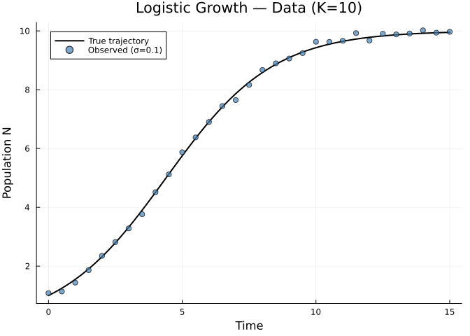
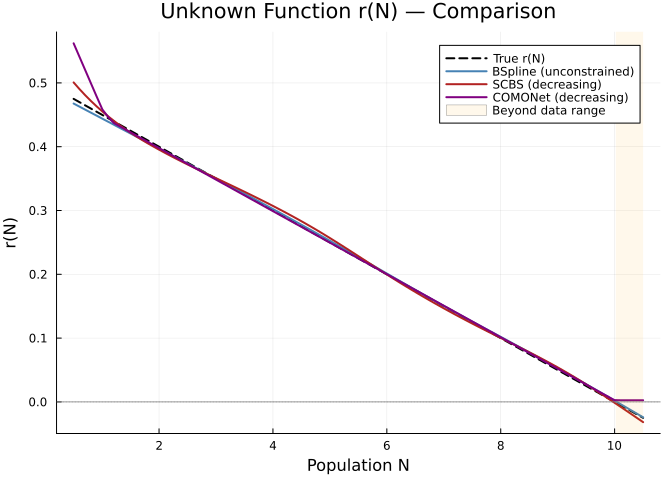
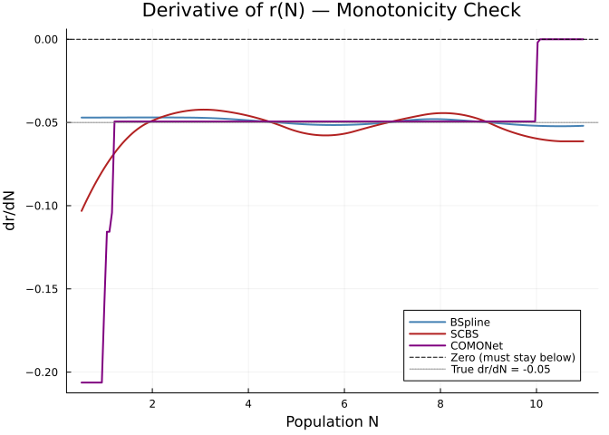
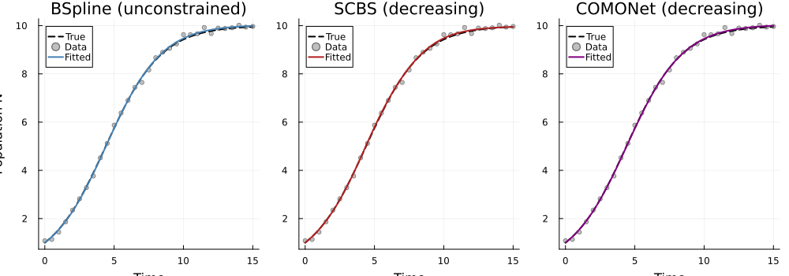
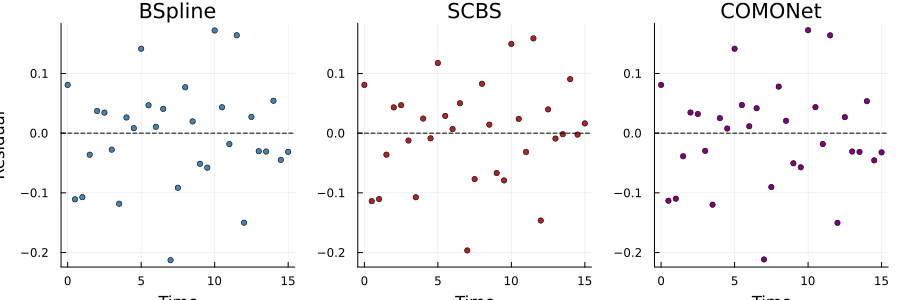
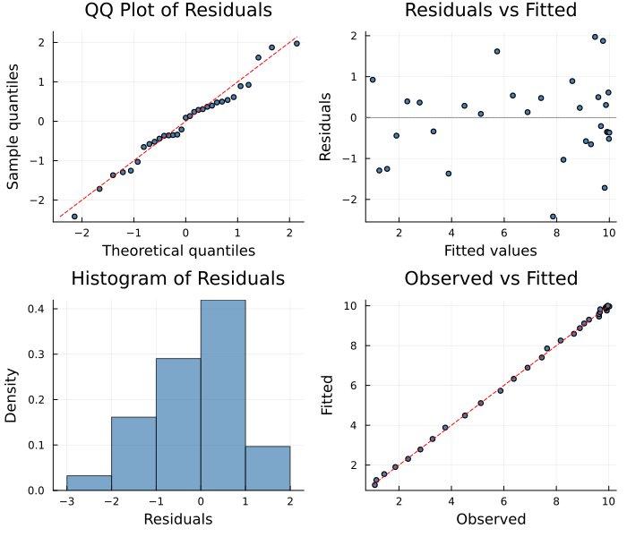

# COMONet: Shape-Constrained Neural Network Approximators
Simon Frost
2026-04-02

- [Overview](#overview)
- [Logistic Growth with Unknown Per-Capita
  Rate](#logistic-growth-with-unknown-per-capita-rate)
  - [Generate Data](#generate-data)
  - [Plot the Data](#plot-the-data)
  - [Approach 1: Unconstrained B-Spline
    (Baseline)](#approach-1-unconstrained-b-spline-baseline)
  - [Approach 2: Shape-Constrained B-Spline
    (Decreasing)](#approach-2-shape-constrained-b-spline-decreasing)
  - [Approach 3: COMONet (Decreasing)](#approach-3-comonet-decreasing)
- [Comparison of Recovered
  Functions](#comparison-of-recovered-functions)
  - [Unknown Function r(N)](#unknown-function-rn)
  - [Edge Saturation in COMONet](#edge-saturation-in-comonet)
  - [Verify Monotonicity](#verify-monotonicity)
  - [Derivative Visualization](#derivative-visualization)
  - [Fitted Trajectories](#fitted-trajectories)
  - [Residuals](#residuals)
  - [Numerical Summary](#numerical-summary)
- [Method Comparison](#method-comparison)
- [Diagnostic Plots](#diagnostic-plots)
- [Summary](#summary)

## Overview

When modeling ecological systems, we often know qualitative properties
of unknown functional responses — for example, that a predator’s
functional response should be **increasing** in prey density, or that
**per-capita growth** should be **decreasing** (density dependence).
PartiallySpecifiedModels.jl offers two approaches to enforce such
constraints:

1.  **`ShapeConstrainedBSplineApproximator`** (SCBS) — B-spline basis
    functions with reparameterized coefficients (SCOP-splines, following
    Pya & Wood 2015). Uses the convex hull property of B-splines to
    guarantee constraints globally.

2.  **`COMONetApproximator`** — Neural networks with positive weights
    (`exp(W)`) and monotone activations (ReLU). Compositional structure
    guarantees shape constraints by construction.

This vignette compares both constrained approximators against an
unconstrained B-spline baseline on a logistic growth model.

``` julia
using PartiallySpecifiedModels
using OrdinaryDiffEq
using Plots
using Random
Random.seed!(123)
```

    Precompiling packages...
        PartiallySpecifiedModels Being precompiled by another process (pid: 36853, pidfile: /Users/username/.julia/compiled/v1.12/PartiallySpecifiedModels/tWtwA_lLwID.ji.pidfile)
      15554.7 ms  ✓ PartiallySpecifiedModels
      1 dependency successfully precompiled in 34 seconds. 387 already precompiled.

    TaskLocalRNG()

## Logistic Growth with Unknown Per-Capita Rate

The per-capita growth rate `r(N)` should be **decreasing** in population
density (negative density dependence). In the standard logistic model,
`r(N) = r₀(1 - N/K)` is linear, but we treat the functional form as
unknown and attempt to recover it from time series data.

True model: `r(N) = 0.5 × (1 - N/10)`.

``` julia
function logistic!(du, u, p, t)
    N = u[1]
    du[1] = p.r(N) * N
end

r_true(N) = 0.5 * (1.0 - N / 10.0)
```

    r_true (generic function with 1 method)

### Generate Data

We simulate the logistic model and add Gaussian observation noise.

``` julia
true_p = (; r = r_true)
tspan = (0.0, 15.0)
sol_true = solve(ODEProblem(logistic!, [1.0], tspan, true_p),
                 Tsit5(); saveat=0.5)

t_data = collect(sol_true.t)
N_true = [sol_true.u[i][1] for i in 1:length(sol_true.t)]
noise = 0.1
data_N = N_true .+ noise .* randn(length(N_true))
data_N = max.(data_N, 0.01)
data_matrix = reshape(data_N, :, 1)
```

    31×1 Matrix{Float64}:
      1.0808287928464968
      1.136355836985646
      1.4378176182927203
      1.8625904014822638
      2.3484534289135692
      2.817417961585688
      3.2821042543395347
      3.7646683559662257
      4.515507869399177
      5.120146374336009
      ⋮
      9.663164223961433
      9.924462804590682
      9.672961065403618
      9.89948006515763
      9.880810437689874
      9.91070778198356
     10.019700530926274
      9.939336542400193
      9.967408726656815

### Plot the Data

``` julia
t_fine = range(tspan..., length=200)
sol_fine = solve(ODEProblem(logistic!, [1.0], tspan, true_p), Tsit5(); saveat=collect(t_fine))
N_fine = [sol_fine.u[i][1] for i in 1:length(sol_fine.u)]

p_data = plot(t_fine, N_fine, label="True trajectory", lw=2, color=:black,
    xlabel="Time", ylabel="Population N",
    title="Logistic Growth — Data (K=10)")
scatter!(p_data, t_data, data_N, label="Observed (σ=$noise)", ms=4,
    color=:steelblue, alpha=0.7)
p_data
```

<div id="fig-data">



Figure 1: Observed data (circles) vs true trajectory (line)

</div>

### Approach 1: Unconstrained B-Spline (Baseline)

A standard B-spline approximator with no shape constraints, fitted via
LAML for automatic smoothing.

``` julia
uf_bs = BSplineApproximator(:r, (0.5, 10.5), 10)

prob_bs = PSMProblem(logistic!, [1.0], tspan, [uf_bs];
    data_times=t_data, data_values=Float64.(data_matrix),
    obs_to_state=[1], known_params=NamedTuple(),
    likelihood=PartiallySpecifiedModels.Gaussian())

sol_bs = solve(prob_bs, LAML(maxiters=60, verbose=false))
```

    PSMSolution((r = [0.4724242065740035, 0.4174678289897141, 0.3625102593126737, 0.30754978596467986, 0.2525851145389145, 0.19761849247633495, 0.1426574239163713, 0.08770495475559256, 0.03274971138157301, -0.022212927243529496]), 0.11468916699723727, 0.22930505951887656, 2.010029662861606, [380.42354572834256], [1.0; 1.247184741462831; … ; 9.984089743356673; 9.99873176231359;;], [1.0808287928464968; 1.136355836985646; … ; 9.939336542400193; 9.967408726656815;;], [0.0, 0.5, 1.0, 1.5, 2.0, 2.5, 3.0, 3.5, 4.0, 4.5  …  10.5, 11.0, 11.5, 12.0, 12.5, 13.0, 13.5, 14.0, 14.5, 15.0], Dict{Symbol, Any}(:r => DataInterpolations.CubicSpline{Vector{Float64}, Vector{Float64}, Vector{Float64}, Vector{Float64}, Vector{Float64}, Vector{Float64}, Float64}([0.4724242065740035, 0.4174678289897141, 0.3625102593126737, 0.30754978596467986, 0.2525851145389145, 0.19761849247633495, 0.1426574239163713, 0.08770495475559256, 0.03274971138157301, -0.022212927243529496], [0.5, 1.6111111111111112, 2.7222222222222223, 3.8333333333333335, 4.944444444444445, 6.055555555555555, 7.166666666666667, 8.277777777777779, 9.38888888888889, 10.5], Float64[], DataInterpolations.CubicSplineParameterCache{Vector{Float64}}(Float64[], Float64[]), [0.0, 1.1111111111111112, 1.1111111111111112, 1.1111111111111112, 1.1111111111111112, 1.1111111111111107, 1.1111111111111116, 1.1111111111111116, 1.1111111111111107, 1.1111111111111107], [0.0, -8.614616416972987e-7, -2.3477242025909456e-6, -3.859482382024595e-6, -2.617004238609078e-6, 4.847404419130759e-6, 1.0217409275616052e-5, -3.923961482784995e-6, -8.004239695099577e-6, 0.0], DataInterpolations.ExtrapolationType.Extension, DataInterpolations.ExtrapolationType.Extension, FindFirstFunctions.Guesser{Vector{Float64}}([0.5, 1.6111111111111112, 2.7222222222222223, 3.8333333333333335, 4.944444444444445, 6.055555555555555, 7.166666666666667, 8.277777777777779, 9.38888888888889, 10.5], Base.RefValue{Int64}(1), true), false, false)), nothing)

### Approach 2: Shape-Constrained B-Spline (Decreasing)

The SCBS reparameterizes B-spline coefficients via a Σ matrix and
`softplus` transform to guarantee the function is decreasing everywhere.
We use LAML for automatic smoothing parameter selection.

``` julia
uf_scbs = ShapeConstrainedBSplineApproximator(:r, (0.5, 10.5), 10, :decreasing)

prob_scbs = PSMProblem(logistic!, [1.0], tspan, [uf_scbs];
    data_times=t_data, data_values=Float64.(data_matrix),
    obs_to_state=[1], known_params=NamedTuple(),
    likelihood=PartiallySpecifiedModels.Gaussian())

sol_scbs = solve(prob_scbs, LAML(maxiters=60, verbose=false))
```

    PSMSolution((r = [0.003989152184564383, -1.436461191371637, -2.3549556209276505, -2.818463793153019, -2.7507893528764216, -2.394131902758733, -2.646380630509305, -2.786796161569131, -2.3959452817850098, -2.3643906752141186]), 0.12534039749934578, 0.20962482595661683, 5.7999077651663065, [0.011722709200132544], [1.0; 1.2502240480118316; … ; 9.941737639581117; 9.951037248562006;;], [1.0808287928464968; 1.136355836985646; … ; 9.939336542400193; 9.967408726656815;;], [0.0, 0.5, 1.0, 1.5, 2.0, 2.5, 3.0, 3.5, 4.0, 4.5  …  10.5, 11.0, 11.5, 12.0, 12.5, 13.0, 13.5, 14.0, 14.5, 15.0], Dict{Symbol, Any}(:r => PartiallySpecifiedModels.var"#evaluator#build_constrained_bspline_evaluator##0"{Float64, Float64, Float64, Float64, Float64, Float64, Int64, Vector{Float64}, Vector{Float64}}(-0.031976223449371254, 0.5022756674112897, -0.06195725305711724, -0.10638962906270398, 10.5, 0.5, 4, [-3.7857142857142856, -2.357142857142857, -0.9285714285714286, 0.5, 1.9285714285714286, 3.357142857142857, 4.785714285714286, 6.214285714285714, 7.642857142857143, 9.071428571428571, 10.5, 11.928571428571429, 13.357142857142858, 14.785714285714285], [0.6951437458178025, 0.4818342418515461, 0.3911732912437508, 0.3331897255852636, 0.27126954856173513, 0.18394401589013326, 0.1154376994762654, 0.055643245090855505, -0.031530776461616485, -0.12137747994061712])), nothing)

### Approach 3: COMONet (Decreasing)

COMONet uses a neural network with positive weights (`exp(W̃)`) and
monotone activations. For a `:decreasing` constraint, the input is
negated before the forward pass. The default ReLU activation gives fast
convergence; the optional `activation=:softplus` gives smoother (C∞)
derivatives but is harder to optimize.

``` julia
uf_como = COMONetApproximator(:r, (0.5, 10.5), (8,), :decreasing;
    penalty_weight=0.001)

prob_como = PSMProblem(logistic!, [1.0], tspan, [uf_como];
    data_times=t_data, data_values=Float64.(data_matrix),
    obs_to_state=[1], known_params=NamedTuple(),
    likelihood=PartiallySpecifiedModels.Gaussian())

sol_como = solve(prob_como, AdamSolver(lr=0.01, maxiters=3000, verbose=false))
```

    PSMSolution((r = [-0.02900143051127036, 0.012412397060725552, 0.0032114510283638496, 0.023229093726770872, -0.10906330050868412, -0.6825772221374719, -0.01383989248694004, -0.09967084594526247, -0.05255958028703694, -0.1847347736426651  …  0.061261676042256595, 0.10294988723532597, 0.05134669187044777, 0.14663582046218607, -0.022290324692311556, 0.01076267838073365, -0.022499483262348192, -0.08295716862670155, -0.31218829382969154, 0.0025993114632720023]), 0.2304692784197217, 0.23047063564233886, 25.0, Float64[], [1.0; 1.2495582348143577; … ; 9.984904783212059; 9.999609516706247;;], [1.0808287928464968; 1.136355836985646; … ; 9.939336542400193; 9.967408726656815;;], [0.0, 0.5, 1.0, 1.5, 2.0, 2.5, 3.0, 3.5, 4.0, 4.5  …  10.5, 11.0, 11.5, 12.0, 12.5, 13.0, 13.5, 14.0, 14.5, 15.0], Dict{Symbol, Any}(:r => PartiallySpecifiedModels.var"#evaluator#build_comonet_evaluator##0"{COMONetApproximator, Symbol, Float64, Float64, Vector{Tuple{Matrix{Float64}, Vector{Float64}}}}(COMONetApproximator(:r, (0.5, 10.5), (8,), :decreasing, 0.001, :relu), :relu, 10.0, 0.5, [([-0.02900143051127036; 0.012412397060725552; … ; -0.01383989248694004; -0.09967084594526247;;], [-0.05255958028703694, -0.1847347736426651, -0.01412955932439122, -0.0768909820742092, 0.04483356860864991, 0.48002305521084454, -0.10931630679281885, 0.061261676042256595]), ([0.10294988723532597 0.05134669187044777 … -0.08295716862670155 -0.31218829382969154], [0.0025993114632720023])])), (optimizer = :adam, method = :adam_ode))

## Comparison of Recovered Functions

### Unknown Function r(N)

``` julia
r_bs = sol_bs.unknown_functions[:r]
r_scbs = sol_scbs.unknown_functions[:r]
r_como = sol_como.unknown_functions[:r]

N_range = range(0.5, 10.5, length=100)
r_true_vals = [r_true(N) for N in N_range]
r_bs_vals = [r_bs(N) for N in N_range]
r_scbs_vals = [r_scbs(N) for N in N_range]
r_como_vals = [r_como(N) for N in N_range]
```

    100-element Vector{Float64}:
     0.5620953664830931
     0.5412583499307758
     0.5204213333784584
     0.4995843168261413
     0.47874730027382395
     0.4583681649900653
     0.44668646546800717
     0.4370083999589017
     0.43201778708098293
     0.42702717420306413
     ⋮
     0.01779691821372389
     0.012806305335805125
     0.007815692457886304
     0.0028250795799675947
     0.0025993114632720023
     0.0025993114632720023
     0.0025993114632720023
     0.0025993114632720023
     0.0025993114632720023

``` julia
N_data_max = maximum(data_N)
p_fn = plot(collect(N_range), r_true_vals, color=:black, lw=2, ls=:dash, label="True r(N)",
    xlabel="Population N", ylabel="r(N)",
    title="Unknown Function r(N) — Comparison")
plot!(p_fn, collect(N_range), r_bs_vals, color=:steelblue, lw=2, label="BSpline (unconstrained)")
plot!(p_fn, collect(N_range), r_scbs_vals, color=:firebrick, lw=2, label="SCBS (decreasing)")
plot!(p_fn, collect(N_range), r_como_vals, color=:purple, lw=2, label="COMONet (decreasing)")
hline!(p_fn, [0.0], color=:grey, ls=:dot, label="")
vspan!(p_fn, [N_data_max, 10.5], color=:orange, alpha=0.08, label="Beyond data range")
p_fn
```

<div id="fig-functions">



Figure 2: Recovered r(N): unconstrained B-spline vs shape-constrained
methods

</div>

### Edge Saturation in COMONet

Notice that COMONet **saturates at the domain edges**: it flattens out
near N=0.5 (overestimates r) and cannot produce negative values near
N=10 (where the true r crosses zero). This is an architectural property,
not a fitting failure — with `:decreasing`, COMONet computes `g(-x)`
where `g` uses ReLU/softplus activations with positive weights, which
are bounded below by zero. The function therefore has a floor it cannot
cross.

SCBS and unconstrained B-splines do not have this limitation — they can
represent functions that cross zero freely. This makes COMONet best
suited for functional responses that are **strictly positive** (e.g.,
Holling-type responses) or where edge behavior is less important than
guaranteed monotonicity in the interior.

### Verify Monotonicity

Both constrained methods should produce strictly decreasing functions.
The unconstrained B-spline may violate monotonicity.

``` julia
test_N = collect(range(0.5, 11.0, length=200))
bs_test = [r_bs(N) for N in test_N]
scbs_test = [r_scbs(N) for N in test_N]
como_test = [r_como(N) for N in test_N]

bs_mono = all(diff(bs_test) .<= 1e-10)
scbs_mono = all(diff(scbs_test) .<= 1e-10)
como_mono = all(diff(como_test) .<= 1e-10)
println("Monotonicity check (decreasing):")
println("  BSpline (unconstrained): $bs_mono")
println("  SCBS:    $scbs_mono")
println("  COMONet: $como_mono")
```

    Monotonicity check (decreasing):
      BSpline (unconstrained): true
      SCBS:    true
      COMONet: true

### Derivative Visualization

We can directly visualize whether the constraint is satisfied by
plotting the numerical derivative:

``` julia
Δ = test_N[2] - test_N[1]
dr_bs = diff(bs_test) ./ Δ
dr_scbs = diff(scbs_test) ./ Δ
dr_como = diff(como_test) ./ Δ
N_mid = test_N[1:end-1] .+ Δ/2

p_deriv = plot(N_mid, dr_bs, color=:steelblue, lw=2, label="BSpline",
    xlabel="Population N", ylabel="dr/dN",
    title="Derivative of r(N) — Monotonicity Check")
plot!(p_deriv, N_mid, dr_scbs, color=:firebrick, lw=2, label="SCBS")
plot!(p_deriv, N_mid, dr_como, color=:purple, lw=2, label="COMONet")
hline!(p_deriv, [0.0], color=:black, lw=1, ls=:dash, label="Zero (must stay below)")
hline!(p_deriv, [-0.05], color=:grey, lw=1, ls=:dot, label="True dr/dN = -0.05")
p_deriv
```

<div id="fig-derivatives">



Figure 3: Numerical derivative dr/dN — constrained methods stay
non-positive

</div>

### Fitted Trajectories

``` julia
t_pred = collect(range(tspan..., length=200))

traj_bs = solve(ODEProblem(logistic!, [1.0], tspan, (; r = r_bs)), Tsit5();
    saveat=t_pred, abstol=1e-8, reltol=1e-8)
traj_scbs = solve(ODEProblem(logistic!, [1.0], tspan, (; r = r_scbs)), Tsit5();
    saveat=t_pred, abstol=1e-8, reltol=1e-8)
traj_como = solve(ODEProblem(logistic!, [1.0], tspan, (; r = r_como)), Tsit5();
    saveat=t_pred, abstol=1e-8, reltol=1e-8)

N_bs = [traj_bs.u[k][1] for k in 1:length(traj_bs.u)]
N_scbs = [traj_scbs.u[k][1] for k in 1:length(traj_scbs.u)]
N_como = [traj_como.u[k][1] for k in 1:length(traj_como.u)]

p1 = plot(t_fine, N_fine, color=:black, lw=2, ls=:dash, label="True",
    xlabel="Time", ylabel="Population N", title="BSpline (unconstrained)")
scatter!(p1, t_data, data_N, ms=3, color=:grey, alpha=0.5, label="Data")
plot!(p1, t_pred, N_bs, color=:steelblue, lw=2, label="Fitted")

p2 = plot(t_fine, N_fine, color=:black, lw=2, ls=:dash, label="True",
    xlabel="Time", ylabel="", title="SCBS (decreasing)")
scatter!(p2, t_data, data_N, ms=3, color=:grey, alpha=0.5, label="Data")
plot!(p2, t_pred, N_scbs, color=:firebrick, lw=2, label="Fitted")

p3 = plot(t_fine, N_fine, color=:black, lw=2, ls=:dash, label="True",
    xlabel="Time", ylabel="", title="COMONet (decreasing)")
scatter!(p3, t_data, data_N, ms=3, color=:grey, alpha=0.5, label="Data")
plot!(p3, t_pred, N_como, color=:purple, lw=2, label="Fitted")

plot(p1, p2, p3, layout=(1, 3), size=(1000, 350), link=:y)
```

<div id="fig-trajectories">



Figure 4: Fitted population trajectories compared to data — one panel
per method

</div>

### Residuals

``` julia
res_bs = data_N .- sol_bs.fitted_values[:, 1]
res_scbs = data_N .- sol_scbs.fitted_values[:, 1]
res_como = data_N .- sol_como.fitted_values[:, 1]

p_res = plot(layout=(1, 3), size=(900, 300), link=:y)
scatter!(p_res, t_data, res_bs, subplot=1, ms=3, color=:steelblue, label="",
    xlabel="Time", ylabel="Residual", title="BSpline")
hline!(p_res, [0.0], subplot=1, color=:black, ls=:dash, label="")
scatter!(p_res, t_data, res_scbs, subplot=2, ms=3, color=:firebrick, label="",
    xlabel="Time", title="SCBS")
hline!(p_res, [0.0], subplot=2, color=:black, ls=:dash, label="")
scatter!(p_res, t_data, res_como, subplot=3, ms=3, color=:purple, label="",
    xlabel="Time", title="COMONet")
hline!(p_res, [0.0], subplot=3, color=:black, ls=:dash, label="")
p_res
```

<div id="fig-residuals">



Figure 5: Residuals (observed − fitted) for each method

</div>

### Numerical Summary

    Per-capita growth rate r(N) comparison:
      N    |  True   | BSpline |  SCBS   | COMONet
      -----|---------|---------|---------|--------
       0.5 |   0.475 |   0.472 |   0.502 |   0.562
       2.0 |   0.400 |   0.398 |   0.393 |   0.398
       4.0 |   0.300 |   0.299 |   0.305 |   0.299
       6.0 |   0.200 |   0.200 |   0.199 |   0.200
       8.0 |   0.100 |   0.101 |   0.101 |   0.101
      10.0 |   0.000 |   0.003 |  -0.001 |   0.003

    Data fit (RMSE):
      BSpline: 0.0860
      SCBS:    0.0822
      COMONet: 0.0862

## Method Comparison

| Feature | BSpline | SCBS | COMONet |
|----|----|----|----|
| **Constraint** | None | Coefficient reparameterization | Positive weights + monotone activations |
| **Parameters** | 10 (knot coefficients) | 10 (unconstrained γ) | 25 (weights + biases) |
| **Smoothness** | Cubic (C²) | Cubic (C²) | ReLU: piecewise linear (C⁰); `activation=:softplus`: smooth (C∞) but slower to converge |
| **Monotonicity** | Not guaranteed | Guaranteed | Guaranteed |
| **Compatible solvers** | All (LAML, Adam, MCMC, …) | All (LAML preferred) | Adam, MCMC, GradientMatching |
| **Formal proofs** | — | Convex hull property | Lean 4 verified (43 theorems) |

**When to use unconstrained B-splines:**

- No prior knowledge about function shape
- Need maximum flexibility (may overfit without smoothing penalty)
- Compatible with LAML solver for automatic smoothing parameter
  selection

**When to use SCBS:**

- Known monotonicity, convexity, or other shape constraints
- Parsimonious models with few parameters
- LAML solver available for automatic smoothing

**When to use COMONet:**

- Need formally verified constraint guarantees
- Unknown function is **strictly positive** (e.g., functional responses,
  mortality rates) — COMONet’s ReLU architecture naturally enforces
  non-negativity
- Complex constraints (e.g., combinations of monotonicity and convexity)
- Choose `activation=:softplus` when smooth derivatives are needed, or
  `:relu` (default) for faster convergence
- **Caveat**: COMONet saturates at domain edges and cannot represent
  functions that cross zero — use SCBS instead if the function may
  change sign

## Diagnostic Plots

A standard 4-panel diagnostic display assesses residual behaviour for
the COMONet fit. The QQ plot checks normality of standardized residuals,
“Residuals vs Fitted” detects systematic patterns, the histogram
visualises the residual distribution, and “Observed vs Fitted” checks
overall calibration.

``` julia
using PartiallySpecifiedModels: appraise

diag = appraise(sol_como)

p_qq = scatter(diag.qq_theoretical, diag.qq_sample,
    xlabel="Theoretical quantiles", ylabel="Sample quantiles",
    title="QQ Plot of Residuals", ms=3, legend=false, color=:steelblue)
mn, mx = extrema(vcat(diag.qq_theoretical, diag.qq_sample))
plot!(p_qq, [mn, mx], [mn, mx], color=:red, ls=:dash, label="")

p_rf = scatter(diag.fitted, diag.residuals,
    xlabel="Fitted values", ylabel="Residuals",
    title="Residuals vs Fitted", ms=3, legend=false, color=:steelblue)
hline!(p_rf, [0], color=:gray, ls=:dot)

p_hist = histogram(diag.residuals, normalize=:pdf,
    xlabel="Residuals", ylabel="Density",
    title="Histogram of Residuals", legend=false, color=:steelblue, alpha=0.7)

p_of = scatter(diag.observed, diag.fitted,
    xlabel="Observed", ylabel="Fitted",
    title="Observed vs Fitted", ms=3, legend=false, color=:steelblue)
mn2, mx2 = extrema(vcat(diag.observed, diag.fitted))
plot!(p_of, [mn2, mx2], [mn2, mx2], color=:red, ls=:dash, label="")

plot(p_qq, p_rf, p_hist, p_of, layout=(2, 2), size=(700, 600))
```



    Durbin-Watson: 2.095

## Summary

Shape constraints significantly improve function recovery, especially
near domain boundaries where data is sparse. Both
`ShapeConstrainedBSplineApproximator` and `COMONetApproximator`
correctly enforce the decreasing constraint, while the unconstrained
`BSplineApproximator` may violate it. The SCBS approach offers
parsimony, smoothness, and the ability to represent sign-changing
functions, while COMONet provides a neural network alternative with
formally verified constraint guarantees and natural non-negativity —
best suited for inherently positive functional responses.
