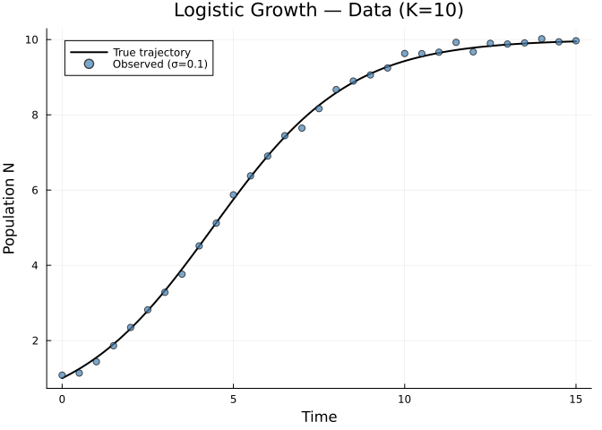
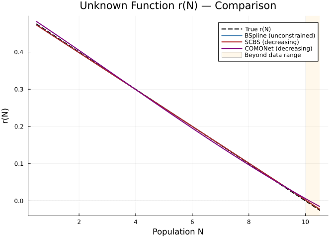
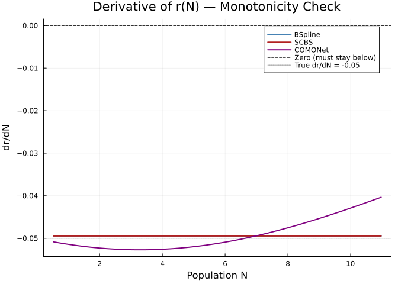
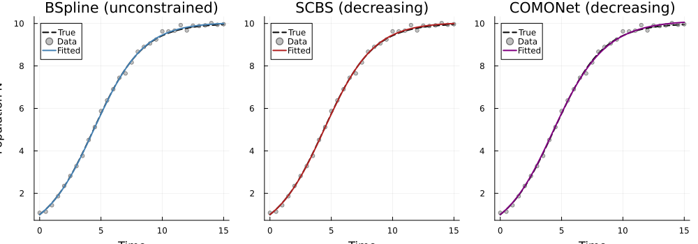
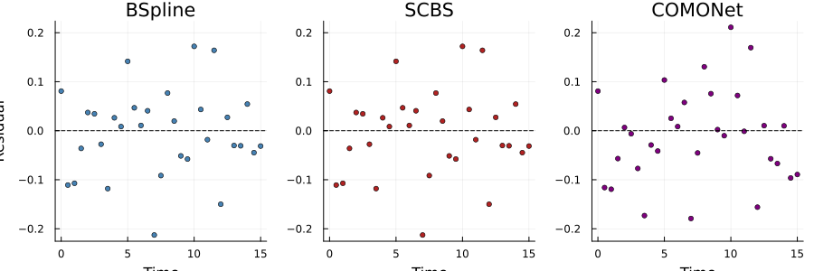
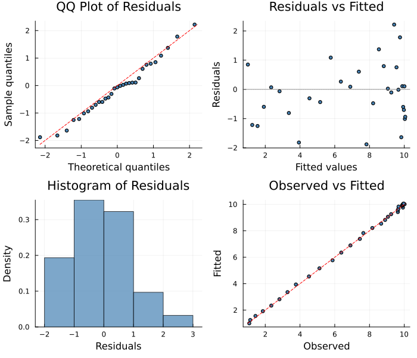

# COMONet: Shape-Constrained Neural Network Approximators
Simon Frost
2026-08-30

- [Overview](#overview)
- [Logistic Growth with Unknown Per-Capita
  Rate](#logistic-growth-with-unknown-per-capita-rate)
  - [Generate Data](#generate-data)
  - [Plot the Data](#plot-the-data)
  - [Approach 1: Unconstrained B-Spline
    (Baseline)](#approach-1-unconstrained-b-spline-baseline)
  - [Approach 2: Shape-Constrained B-Spline
    (Decreasing)](#approach-2-shape-constrained-b-spline-decreasing)
  - [Approach 3: COMONet (Decreasing)](#approach-3-comonet-decreasing)
- [Comparison of Recovered
  Functions](#comparison-of-recovered-functions)
  - [Unknown Function r(N)](#unknown-function-rn)
  - [Edge Saturation in COMONet](#edge-saturation-in-comonet)
  - [Verify Monotonicity](#verify-monotonicity)
  - [Derivative Visualization](#derivative-visualization)
  - [Fitted Trajectories](#fitted-trajectories)
  - [Residuals](#residuals)
  - [Numerical Summary](#numerical-summary)
- [Method Comparison](#method-comparison)
- [Diagnostic Plots](#diagnostic-plots)
- [Summary](#summary)

## Overview

When modeling ecological systems, we often know qualitative properties
of unknown functional responses — for example, that a predator’s
functional response should be **increasing** in prey density, or that
**per-capita growth** should be **decreasing** (density dependence).
PartiallySpecifiedModels.jl offers two approaches to enforce such
constraints:

1.  **`ShapeConstrainedBSplineApproximator`** (SCBS) — B-spline basis
    functions with reparameterized coefficients (SCOP-splines, following
    Pya & Wood 2015). Uses the convex hull property of B-splines to
    guarantee constraints globally.

2.  **`COMONetApproximator`** — Neural networks with positive weights
    (`exp(W)`) and monotone activations. Compositional structure
    guarantees shape constraints by construction.

This vignette compares both constrained approximators against an
unconstrained B-spline baseline on a logistic growth model.

``` julia
using PartiallySpecifiedModels
using OrdinaryDiffEq
using Plots
using Random
Random.seed!(123)
```

    TaskLocalRNG()

## Logistic Growth with Unknown Per-Capita Rate

The per-capita growth rate `r(N)` should be **decreasing** in population
density (negative density dependence). In the standard logistic model,
`r(N) = r₀(1 - N/K)` is linear, but we treat the functional form as
unknown and attempt to recover it from time series data.

True model: `r(N) = 0.5 × (1 - N/10)`.

``` julia
function logistic!(du, u, p, t)
    N = u[1]
    du[1] = p.r(N) * N
end

r_true(N) = 0.5 * (1.0 - N / 10.0)
```

    r_true (generic function with 1 method)

### Generate Data

We simulate the logistic model and add Gaussian observation noise.

``` julia
true_p = (; r = r_true)
tspan = (0.0, 15.0)
sol_true = solve(ODEProblem(logistic!, [1.0], tspan, true_p),
                 Tsit5(); saveat=0.5)

t_data = collect(sol_true.t)
N_true = [sol_true.u[i][1] for i in 1:length(sol_true.t)]
noise = 0.1
data_N = N_true .+ noise .* randn(length(N_true))
data_N = max.(data_N, 0.01)
data_matrix = reshape(data_N, :, 1)
```

    31×1 Matrix{Float64}:
      1.0808287928464968
      1.136355836985646
      1.4378176182927203
      1.8625904014822638
      2.3484534289135692
      2.817417961585688
      3.2821042543395347
      3.7646683559662257
      4.515507869399177
      5.120146374336009
      ⋮
      9.663164223961433
      9.924462804590682
      9.672961065403618
      9.89948006515763
      9.880810437689874
      9.91070778198356
     10.019700530926274
      9.939336542400193
      9.967408726656815

### Plot the Data

``` julia
t_fine = range(tspan..., length=200)
sol_fine = solve(ODEProblem(logistic!, [1.0], tspan, true_p), Tsit5(); saveat=collect(t_fine))
N_fine = [sol_fine.u[i][1] for i in 1:length(sol_fine.u)]

p_data = plot(t_fine, N_fine, label="True trajectory", lw=2, color=:black,
    xlabel="Time", ylabel="Population N",
    title="Logistic Growth — Data (K=10)")
scatter!(p_data, t_data, data_N, label="Observed (σ=$noise)", ms=4,
    color=:steelblue, alpha=0.7)
p_data
```

<div id="fig-data">



Figure 1: Observed data (circles) vs true trajectory (line)

</div>

### Approach 1: Unconstrained B-Spline (Baseline)

A standard B-spline approximator with no shape constraints, fitted via
LAML for automatic smoothing.

``` julia
uf_bs = BSplineApproximator(:r, (0.5, 10.5), 10)

prob_bs = PSMProblem(logistic!, [1.0], tspan, [uf_bs];
    data_times=t_data, data_values=Float64.(data_matrix),
    obs_to_state=[1], known_params=NamedTuple(),
    likelihood=PartiallySpecifiedModels.Gaussian())

sol_bs = solve(prob_bs, LAML(maxiters=60, verbose=false))
```

    PSMSolution((r = [0.4724177654913809, 0.41745884440342623, 0.3624999230613966, 0.3075410010264079, 0.2525820779880788, 0.1976231543856057, 0.14266423177379828, 0.08770531080201985, 0.032746389264495246, -0.022212533745129846]), 0.11466733927456746, 0.22933463105631854, 1.9999972196968048, [385949.0597814259], [1.0; 1.2471798681442254; … ; 9.984043478647003; 9.99868715507313;;], [1.0808287928464968; 1.136355836985646; … ; 9.939336542400193; 9.967408726656815;;], [0.0, 0.5, 1.0, 1.5, 2.0, 2.5, 3.0, 3.5, 4.0, 4.5  …  10.5, 11.0, 11.5, 12.0, 12.5, 13.0, 13.5, 14.0, 14.5, 15.0], Dict{Symbol, Any}(:r => DataInterpolations.CubicSpline{Vector{Float64}, Vector{Float64}, Vector{Float64}, Vector{Float64}, Vector{Float64}, Vector{Float64}, Float64}([0.4724177654913809, 0.41745884440342623, 0.3624999230613966, 0.3075410010264079, 0.2525820779880788, 0.1976231543856057, 0.14266423177379828, 0.08770531080201985, 0.032746389264495246, -0.022212533745129846], [0.5, 1.6111111111111112, 2.7222222222222223, 3.8333333333333335, 4.944444444444445, 6.055555555555555, 7.166666666666667, 8.277777777777779, 9.38888888888889, 10.5], Float64[], DataInterpolations.CubicSplineParameterCache{Vector{Float64}}(Float64[], Float64[]), [0.0, 1.1111111111111112, 1.1111111111111112, 1.1111111111111112, 1.1111111111111112, 1.1111111111111107, 1.1111111111111116, 1.1111111111111116, 1.1111111111111107, 1.1111111111111107], [0.0, -1.6513806501433925e-10, -5.74251898865385e-10, -9.056354934753196e-10, -6.794404935244791e-10, 8.81657582447298e-10, 1.9674455041463298e-9, -7.808986717613903e-10, -1.5933774234944851e-9, 0.0], DataInterpolations.ExtrapolationType.Linear, DataInterpolations.ExtrapolationType.Linear, FindFirstFunctions.Guesser{Vector{Float64}}([0.5, 1.6111111111111112, 2.7222222222222223, 3.8333333333333335, 4.944444444444445, 6.055555555555555, 7.166666666666667, 8.277777777777779, 9.38888888888889, 10.5], Base.RefValue{Int64}(1), true), false, false)), (V_beta = [0.0008305825859640008 0.0007007688495895654 … -0.00020778529949611846 -0.00033756336701836257; 0.0007007688495895654 0.0005936888913898259 … -0.00015580407289945736 -0.0002628646283578958; … ; -0.00020778529949611846 -0.00015580407289945736 … 0.00020806883404510192 0.00026005097125773386; -0.00033756336701836257 -0.0002628646283578958 … 0.00026005097125773386 0.0003347616031431483], sigma2 = 0.007908089967911406, converged = true, iterations = 11, reason = :converged_tol, laml_failures = 0, criterion = :working, laml = 63.526436742067744, stationarity = 3.318373391625329e-7, smoothing_advanced = true))

### Approach 2: Shape-Constrained B-Spline (Decreasing)

The SCBS reparameterizes B-spline coefficients via a Σ matrix and
`softplus` transform to guarantee the function is decreasing everywhere.
We use LAML for automatic smoothing parameter selection.

``` julia
uf_scbs = ShapeConstrainedBSplineApproximator(:r, (0.5, 10.5), 10, :decreasing)

prob_scbs = PSMProblem(logistic!, [1.0], tspan, [uf_scbs];
    data_times=t_data, data_values=Float64.(data_matrix),
    obs_to_state=[1], known_params=NamedTuple(),
    likelihood=PartiallySpecifiedModels.Gaussian())

sol_scbs = solve(prob_scbs, LAML(maxiters=60, verbose=false))
```

    PSMSolution((r = [0.5430792857198704, -2.6143159303065495, -2.6143159303039187, -2.614315930253657, -2.6143159301385905, -2.61431593005632, -2.6143159302042105, -2.6143159303128725, -2.6143159301291603, -2.614315930103772]), 0.11466718562857683, 0.22933463702163565, 1.999983373567575, [1.1293689906991906e8], [1.0; 1.2471798909878993; … ; 9.984043291269; 9.998686959407019;;], [1.0808287928464968; 1.136355836985646; … ; 9.939336542400193; 9.967408726656815;;], [0.0, 0.5, 1.0, 1.5, 2.0, 2.5, 3.0, 3.5, 4.0, 4.5  …  10.5, 11.0, 11.5, 12.0, 12.5, 13.0, 13.5, 14.0, 14.5, 15.0], Dict{Symbol, Any}(:r => PartiallySpecifiedModels.var"#evaluator#build_constrained_bspline_evaluator##0"{Float64, Float64, Float64, Float64, Float64, Float64, Float64, Int64, Vector{Float64}, Vector{Float64}}(0.0, -0.022212547081210884, 0.4724178066261127, -0.04946303533565816, -0.04946303537822667, 10.5, 0.5, 4, [-3.7857142857142856, -2.357142857142857, -0.9285714285714286, 0.5, 1.9285714285714286, 3.357142857142857, 4.785714285714286, 6.214285714285714, 7.642857142857143, 9.071428571428571, 10.5, 11.928571428571429, 13.357142857142858, 14.785714285714285], [0.5430792857198704, 0.47241780662614263, 0.40175632753223534, 0.3310948484348991, 0.2604333693297127, 0.1897718902189136, 0.11911041111820397, 0.04844893202490755, -0.022212547080922213, -0.09287402618848403])), (V_beta = [0.0012018268758304212 0.002996523063270264 … 0.0029965166789190285 0.0029965166678491005; 0.002996523063270264 0.008069839260118502 … 0.008069798753732692 0.008069798713948991; … ; 0.0029965166789190285 0.008069798753732692 … 0.008069820228859019 0.008069820189075304; 0.0029965166678491005 0.008069798713948991 … 0.008069820189075304 0.0080698290037936], sigma2 = 0.00790808639787488, converged = true, iterations = 23, reason = :converged_tol, laml_failures = 0, criterion = :working, laml = 64.20346609612142, stationarity = 6.4771751295822355e-9, smoothing_advanced = true))

### Approach 3: COMONet (Decreasing)

COMONet uses a neural network with positive weights (`exp(W̃)`) and
monotone activations. For a `:decreasing` constraint, the input is
negated before the forward pass.

The `:increasing` and `:decreasing` classes used here are built from a
**tanh** network: positive `exp(W̃)` weights with tanh hidden units and a
linear output layer `exp(W̃)·h + b` carrying an unconstrained bias `b`.
Positive weights composed with a nondecreasing activation guarantee
monotonicity, while tanh leaves the curvature free, so sigmoid-like and
other monotone-but-non-convex shapes remain representable.

Note that the `activation` keyword (`:relu` by default, or `:softplus`)
does **not** apply here: it is consulted only for the
curvature-constrained classes (`:convex`, `:concave`, `:inc_convex`,
`:inc_concave`, `:dec_convex`, `:dec_concave`). The purely monotone
classes ignore it.

``` julia
uf_como = COMONetApproximator(:r, (0.5, 10.5), (8,), :decreasing;
    penalty_weight=0.001)

prob_como = PSMProblem(logistic!, [1.0], tspan, [uf_como];
    data_times=t_data, data_values=Float64.(data_matrix),
    obs_to_state=[1], known_params=NamedTuple(),
    likelihood=PartiallySpecifiedModels.Gaussian())

sol_como = solve(prob_como, AdamSolver(lr=0.01, maxiters=3000, verbose=false))
```

    PSMSolution((r = [-0.34939899313311495, -0.3249758068840254, -0.31707865752228204, -0.30655820916689314, -0.41842627731109355, -0.3980802366709291, -0.34188119798079175, -0.36467518029685075, 0.15836545129029897, 0.013638521128107185  …  0.36683678718565643, -0.21726378501856078, -0.22939077176196282, -0.19312056803788896, -0.3331239410346449, -0.2862303342600359, -0.3563035292636249, -0.38202477426712683, -0.21159952673264026, 0.331714118694628]), 0.27566679981889125, 0.2756666724885025, 25.0, Float64[], [1.0; 1.2523450075043085; … ; 10.035697490352911; 10.056707142690806;;], [1.0808287928464968; 1.136355836985646; … ; 9.939336542400193; 9.967408726656815;;], [0.0, 0.5, 1.0, 1.5, 2.0, 2.5, 3.0, 3.5, 4.0, 4.5  …  10.5, 11.0, 11.5, 12.0, 12.5, 13.0, 13.5, 14.0, 14.5, 15.0], Dict{Symbol, Any}(:r => PartiallySpecifiedModels.var"#evaluator#build_comonet_evaluator##0"{COMONetApproximator, Symbol, Float64, Float64, Vector{Tuple{Matrix{Float64}, Vector{Float64}}}}(COMONetApproximator(:r, (0.5, 10.5), (8,), :decreasing, 0.001, :relu, nothing), :relu, 10.0, 0.5, [([-0.34939899313311495; -0.3249758068840254; … ; -0.34188119798079175; -0.36467518029685075;;], [0.15836545129029897, 0.013638521128107185, 0.2002586811611985, 0.1318890894223681, 0.29260209778439134, 0.3629158307476868, 0.09657155512871318, 0.36683678718565643]), ([-0.21726378501856078 -0.22939077176196282 … -0.38202477426712683 -0.21159952673264026], [0.331714118694628])])), (optimizer = :adam, method = :adam_ode, converged = true, iterations = 2324, reason = :plateau, final_grad_norm = 0.3354714230427922, backend = :forwarddiff))

## Comparison of Recovered Functions

### Unknown Function r(N)

``` julia
r_bs = sol_bs.unknown_functions[:r]
r_scbs = sol_scbs.unknown_functions[:r]
r_como = sol_como.unknown_functions[:r]

N_range = range(0.5, 10.5, length=100)
r_true_vals = [r_true(N) for N in N_range]
r_bs_vals = [r_bs(N) for N in N_range]
r_scbs_vals = [r_scbs(N) for N in N_range]
r_como_vals = [r_como(N) for N in N_range]
```

    100-element Vector{Float64}:
      0.48187771462561
      0.47673994568003186
      0.471588991441114
      0.46642530831147644
      0.46124935721341187
      0.45606160343144375
      0.45086251645165787
      0.4456525697979229
      0.44043224086511673
      0.43520201074947984
      ⋮
      0.019512600614537245
      0.01511425221514806
      0.010741429707489092
      0.006394328284131001
      0.002073135976041862
     -0.0022219663267367684
     -0.006490804851023602
     -0.010733212913114742
     -0.014949030888159132

``` julia
N_data_max = maximum(data_N)
p_fn = plot(collect(N_range), r_true_vals, color=:black, lw=2, ls=:dash, label="True r(N)",
    xlabel="Population N", ylabel="r(N)",
    title="Unknown Function r(N) — Comparison")
plot!(p_fn, collect(N_range), r_bs_vals, color=:steelblue, lw=2, label="BSpline (unconstrained)")
plot!(p_fn, collect(N_range), r_scbs_vals, color=:firebrick, lw=2, label="SCBS (decreasing)")
plot!(p_fn, collect(N_range), r_como_vals, color=:purple, lw=2, label="COMONet (decreasing)")
hline!(p_fn, [0.0], color=:grey, ls=:dot, label="")
vspan!(p_fn, [N_data_max, 10.5], color=:orange, alpha=0.08, label="Beyond data range")
p_fn
```

<div id="fig-functions">



Figure 2: Recovered r(N): unconstrained B-spline vs shape-constrained
methods

</div>

### Edge Saturation in COMONet

Edge saturation is the characteristic failure mode to watch for with
this architecture, so it is worth being precise about how much of it is
actually present here — the answer is: much less than you might expect.

The mechanism is real. The `:increasing`/`:decreasing` classes use tanh
hidden units, and tanh flattens once its pre-activation grows large, so
a COMONet fit can lose slope toward the ends of its domain where data
are sparse. In the comparison table below, that shows up as a gentle
shallowing: the fitted slope runs about $-0.052$ per unit $N$ at the
bottom of the domain and about $-0.046$ at the top, against a constant
true slope of $-0.05$. That is a modest effect, and across the interior
the fit tracks the linear truth closely.

**Saturation constrains the slope, not the sign.** This is worth stating
plainly because it is easy to assume otherwise. The monotone network’s
output layer is `exp(W̃)·h + b` with `h ∈ (−1,1)` and an *unconstrained*
bias `b`, so its range is `(b − Σ|W|, b + Σ|W|)` — sign-unrestricted,
with no floor at zero. The fit above bears this out: it passes through
zero near N=10 and continues negative to the top of the domain,
following the true `r(N)`, which crosses zero at exactly N=10.

The practical caveat is therefore about *flexibility* near a boundary,
not about sign. Where a function must turn sharply at the edge of its
domain, tanh saturation will fight you and SCBS or an unconstrained
B-spline will follow the data more closely. COMONet’s compensating
advantage is that monotonicity holds *by construction* across the whole
real line, rather than being enforced at a finite set of knots.

### Verify Monotonicity

Both constrained methods should produce strictly decreasing functions.
The unconstrained B-spline may violate monotonicity.

``` julia
test_N = collect(range(0.5, 11.0, length=200))
bs_test = [r_bs(N) for N in test_N]
scbs_test = [r_scbs(N) for N in test_N]
como_test = [r_como(N) for N in test_N]

bs_mono = all(diff(bs_test) .<= 1e-10)
scbs_mono = all(diff(scbs_test) .<= 1e-10)
como_mono = all(diff(como_test) .<= 1e-10)
println("Monotonicity check (decreasing):")
println("  BSpline (unconstrained): $bs_mono")
println("  SCBS:    $scbs_mono")
println("  COMONet: $como_mono")
```

    Monotonicity check (decreasing):
      BSpline (unconstrained): true
      SCBS:    true
      COMONet: true

### Derivative Visualization

We can directly visualize whether the constraint is satisfied by
plotting the numerical derivative:

``` julia
Δ = test_N[2] - test_N[1]
dr_bs = diff(bs_test) ./ Δ
dr_scbs = diff(scbs_test) ./ Δ
dr_como = diff(como_test) ./ Δ
N_mid = test_N[1:end-1] .+ Δ/2

p_deriv = plot(N_mid, dr_bs, color=:steelblue, lw=2, label="BSpline",
    xlabel="Population N", ylabel="dr/dN",
    title="Derivative of r(N) — Monotonicity Check")
plot!(p_deriv, N_mid, dr_scbs, color=:firebrick, lw=2, label="SCBS")
plot!(p_deriv, N_mid, dr_como, color=:purple, lw=2, label="COMONet")
hline!(p_deriv, [0.0], color=:black, lw=1, ls=:dash, label="Zero (must stay below)")
hline!(p_deriv, [-0.05], color=:grey, lw=1, ls=:dot, label="True dr/dN = -0.05")
p_deriv
```

<div id="fig-derivatives">



Figure 3: Numerical derivative dr/dN — constrained methods stay
non-positive

</div>

### Fitted Trajectories

``` julia
t_pred = collect(range(tspan..., length=200))

traj_bs = solve(ODEProblem(logistic!, [1.0], tspan, (; r = r_bs)), Tsit5();
    saveat=t_pred, abstol=1e-8, reltol=1e-8)
traj_scbs = solve(ODEProblem(logistic!, [1.0], tspan, (; r = r_scbs)), Tsit5();
    saveat=t_pred, abstol=1e-8, reltol=1e-8)
traj_como = solve(ODEProblem(logistic!, [1.0], tspan, (; r = r_como)), Tsit5();
    saveat=t_pred, abstol=1e-8, reltol=1e-8)

N_bs = [traj_bs.u[k][1] for k in 1:length(traj_bs.u)]
N_scbs = [traj_scbs.u[k][1] for k in 1:length(traj_scbs.u)]
N_como = [traj_como.u[k][1] for k in 1:length(traj_como.u)]

p1 = plot(t_fine, N_fine, color=:black, lw=2, ls=:dash, label="True",
    xlabel="Time", ylabel="Population N", title="BSpline (unconstrained)")
scatter!(p1, t_data, data_N, ms=3, color=:grey, alpha=0.5, label="Data")
plot!(p1, t_pred, N_bs, color=:steelblue, lw=2, label="Fitted")

p2 = plot(t_fine, N_fine, color=:black, lw=2, ls=:dash, label="True",
    xlabel="Time", ylabel="", title="SCBS (decreasing)")
scatter!(p2, t_data, data_N, ms=3, color=:grey, alpha=0.5, label="Data")
plot!(p2, t_pred, N_scbs, color=:firebrick, lw=2, label="Fitted")

p3 = plot(t_fine, N_fine, color=:black, lw=2, ls=:dash, label="True",
    xlabel="Time", ylabel="", title="COMONet (decreasing)")
scatter!(p3, t_data, data_N, ms=3, color=:grey, alpha=0.5, label="Data")
plot!(p3, t_pred, N_como, color=:purple, lw=2, label="Fitted")

plot(p1, p2, p3, layout=(1, 3), size=(1000, 350), link=:y)
```

<div id="fig-trajectories">



Figure 4: Fitted population trajectories compared to data — one panel
per method

</div>

### Residuals

``` julia
res_bs = data_N .- sol_bs.fitted_values[:, 1]
res_scbs = data_N .- sol_scbs.fitted_values[:, 1]
res_como = data_N .- sol_como.fitted_values[:, 1]

p_res = plot(layout=(1, 3), size=(900, 300), link=:y)
scatter!(p_res, t_data, res_bs, subplot=1, ms=3, color=:steelblue, label="",
    xlabel="Time", ylabel="Residual", title="BSpline")
hline!(p_res, [0.0], subplot=1, color=:black, ls=:dash, label="")
scatter!(p_res, t_data, res_scbs, subplot=2, ms=3, color=:firebrick, label="",
    xlabel="Time", title="SCBS")
hline!(p_res, [0.0], subplot=2, color=:black, ls=:dash, label="")
scatter!(p_res, t_data, res_como, subplot=3, ms=3, color=:purple, label="",
    xlabel="Time", title="COMONet")
hline!(p_res, [0.0], subplot=3, color=:black, ls=:dash, label="")
p_res
```

<div id="fig-residuals">



Figure 5: Residuals (observed − fitted) for each method

</div>

### Numerical Summary

    Per-capita growth rate r(N) comparison:
      N    |  True   | BSpline |  SCBS   | COMONet
      -----|---------|---------|---------|--------
       0.5 |   0.475 |   0.472 |   0.472 |   0.482
       2.0 |   0.400 |   0.398 |   0.398 |   0.404
       4.0 |   0.300 |   0.299 |   0.299 |   0.299
       6.0 |   0.200 |   0.200 |   0.200 |   0.195
       8.0 |   0.100 |   0.101 |   0.101 |   0.097
      10.0 |   0.000 |   0.003 |   0.003 |   0.006

    Data fit (RMSE):
      BSpline: 0.0860
      SCBS:    0.0860
      COMONet: 0.0943

## Method Comparison

| Feature | BSpline | SCBS | COMONet |
|----|----|----|----|
| **Constraint** | None | Coefficient reparameterization | Positive weights + monotone activations |
| **Parameters** | 10 (knot coefficients) | 10 (unconstrained γ) | 25 (weights + biases) |
| **Smoothness** | Cubic (C²) | Cubic (C²) | Monotone classes (used here): tanh, smooth (C∞). Curvature-constrained classes: ReLU piecewise linear (C⁰), or C∞ with `activation=:softplus` |
| **Monotonicity** | Not guaranteed | Guaranteed | Guaranteed |
| **Compatible solvers** | All (LAML, Adam, MCMC, …) | All (LAML preferred) | Adam, MCMC, GradientMatching |
| **Formal proofs** | — | Convex hull property | Lean 4 verified (43 theorems) |

**When to use unconstrained B-splines:**

- No prior knowledge about function shape
- Need maximum flexibility (may overfit without smoothing penalty)
- Compatible with LAML solver for automatic smoothing parameter
  selection

**When to use SCBS:**

- Known monotonicity, convexity, or other shape constraints
- Parsimonious models with few parameters
- LAML solver available for automatic smoothing

**When to use COMONet:**

- Need formally verified constraint guarantees that hold everywhere, not
  just at knots
- Complex constraints (e.g., combinations of monotonicity and convexity)
- For the curvature-constrained classes, choose `activation=:softplus`
  when smooth derivatives are needed, or `:relu` (default) for faster
  convergence. The monotone classes `:increasing`/`:decreasing` ignore
  this setting and always use tanh
- **Caveat**: COMONet saturates at the domain edges, so it is a poor
  choice when the function must turn sharply near a boundary — use SCBS
  there. Note that saturation does *not* restrict sign: the monotone
  classes have a free output bias and can cross zero, as the fit above
  does
- If you need a **guaranteed non-negative** function, use the
  `:positive` constraint, which wraps the network in `exp(·)`.
  Monotonicity alone does not imply positivity

## Diagnostic Plots

A standard 4-panel diagnostic display assesses residual behaviour for
the COMONet fit. The QQ plot checks normality of standardized residuals,
“Residuals vs Fitted” detects systematic patterns, the histogram
visualises the residual distribution, and “Observed vs Fitted” checks
overall calibration.

``` julia
using PartiallySpecifiedModels: appraise

diag = appraise(sol_como)

p_qq = scatter(diag.qq_theoretical, diag.qq_sample,
    xlabel="Theoretical quantiles", ylabel="Sample quantiles",
    title="QQ Plot of Residuals", ms=3, legend=false, color=:steelblue)
mn, mx = extrema(vcat(diag.qq_theoretical, diag.qq_sample))
plot!(p_qq, [mn, mx], [mn, mx], color=:red, ls=:dash, label="")

p_rf = scatter(diag.fitted, diag.residuals,
    xlabel="Fitted values", ylabel="Residuals",
    title="Residuals vs Fitted", ms=3, legend=false, color=:steelblue)
hline!(p_rf, [0], color=:gray, ls=:dot)

p_hist = histogram(diag.residuals, normalize=:pdf,
    xlabel="Residuals", ylabel="Density",
    title="Histogram of Residuals", legend=false, color=:steelblue, alpha=0.7)

p_of = scatter(diag.observed, diag.fitted,
    xlabel="Observed", ylabel="Fitted",
    title="Observed vs Fitted", ms=3, legend=false, color=:steelblue)
mn2, mx2 = extrema(vcat(diag.observed, diag.fitted))
plot!(p_of, [mn2, mx2], [mn2, mx2], color=:red, ls=:dash, label="")

plot(p_qq, p_rf, p_hist, p_of, layout=(2, 2), size=(700, 600))
```



    Durbin-Watson: 1.754

## Summary

Shape constraints significantly improve function recovery, especially
near domain boundaries where data is sparse. Both
`ShapeConstrainedBSplineApproximator` and `COMONetApproximator`
correctly enforce the decreasing constraint, while the unconstrained
`BSplineApproximator` may violate it. The SCBS approach offers
parsimony, smoothness, and the ability to represent sign-changing
functions, while COMONet provides a neural network alternative with
formally verified constraint guarantees and natural non-negativity —
best suited for inherently positive functional responses.
