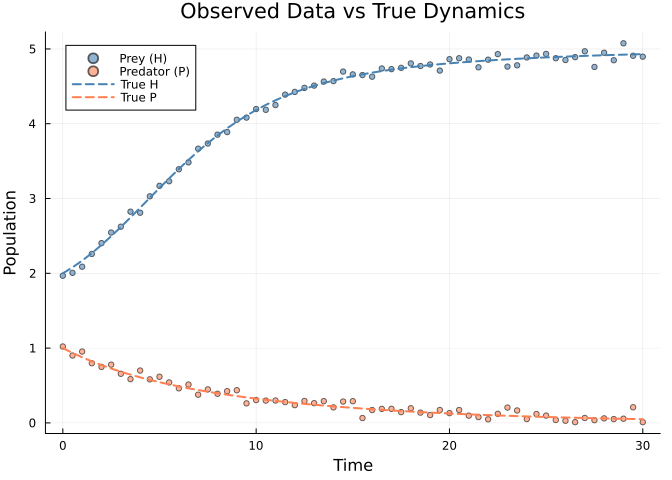
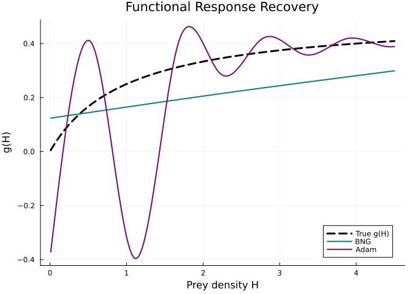
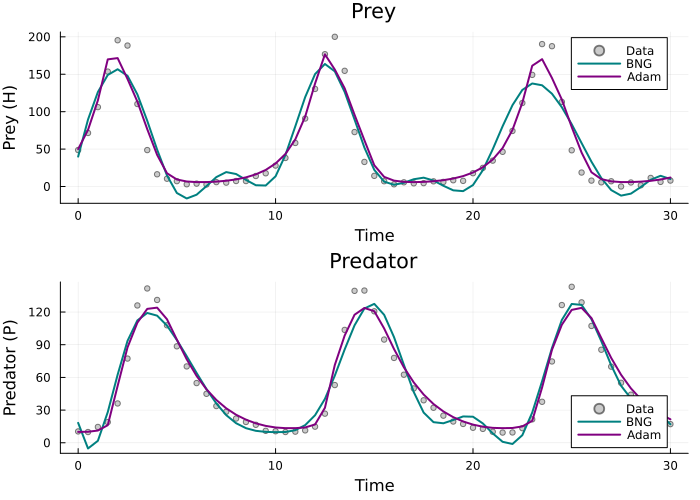
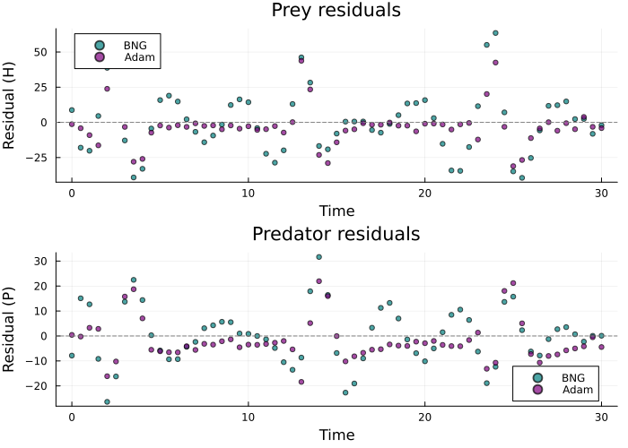
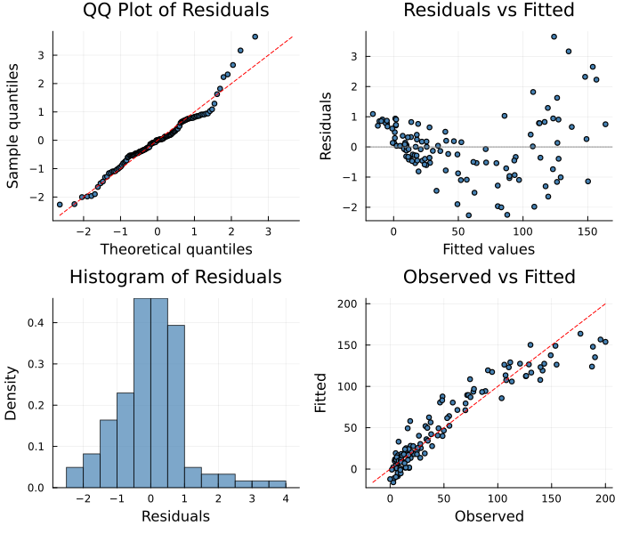

# Fast Gradient Matching with BNGSolver
Simon Frost
2026-04-02

- [Overview](#overview)
- [Lotka-Volterra with Unknown
  Predation](#lotka-volterra-with-unknown-predation)
  - [Observed Data](#observed-data)
  - [Fit with BNGSolver](#fit-with-bngsolver)
  - [Compare with AdamSolver](#compare-with-adamsolver)
  - [Recovered Functional Response](#recovered-functional-response)
  - [Fitted Trajectories](#fitted-trajectories)
  - [Residuals](#residuals)
- [Diagnostic Plots](#diagnostic-plots)
- [When to Use BNGSolver](#when-to-use-bngsolver)
- [Summary](#summary)

## Overview

The `BNGSolver` implements Bayesian Neural Gradient matching (Bonnaffé
et al. 2023), a two-step approach that **avoids ODE integration
entirely**:

1.  **Step 1 — Smooth**: Fit cubic splines to the observed time series
    to obtain smoothed states ŷ(t) and their derivatives dŷ/dt.
2.  **Step 2 — Match**: Optimize the unknown function parameters by
    minimizing the mismatch between dŷ/dt and the ODE right-hand side
    f(ŷ, θ, t).

This makes BNG much faster than integration-based solvers (LAML, Adam)
and more robust to poor initial parameter values, since no ODE solve is
needed during training.

``` julia
using PartiallySpecifiedModels
using OrdinaryDiffEq
using Plots; default(fmt=:png)
using Random
Random.seed!(123)
```

    TaskLocalRNG()

## Lotka-Volterra with Unknown Predation

We model a predator-prey system where the functional response g(H) is
unknown:

$$\frac{dH}{dt} = rH\left(1 - \frac{H}{K}\right) - g(H)P, \qquad \frac{dP}{dt} = \epsilon \, g(H)P - mP$$

The true functional response is a Holling Type II:
$g(H) = \frac{aH}{1 + ahH}$ with $a = 0.5$, $h = 2$.

``` julia
g_true(H) = 0.5 * H / (1.0 + 1.0 * H)

function lv!(du, u, p, t)
    H, P = u
    du[1] = 0.4 * H * (1.0 - H / 5.0) - p.g(H) * P
    du[2] = 0.5 * p.g(H) * P - 0.3 * P
end

sol_true = solve(ODEProblem(lv!, [2.0, 1.0], (0.0, 30.0), (; g=g_true)),
                 Tsit5(); saveat=0.5)
t_data = collect(sol_true.t)
data_H = [sol_true.u[i][1] + 0.05 * randn() for i in 1:length(t_data)]
data_P = [sol_true.u[i][2] + 0.05 * randn() for i in 1:length(t_data)]
data_matrix = hcat(max.(data_H, 0.01), max.(data_P, 0.01))
```

    61×2 Matrix{Float64}:
     1.96771  1.02154
     2.00603  0.900556
     2.08833  0.954042
     2.25903  0.797732
     2.40387  0.74879
     2.54524  0.778812
     2.62325  0.656819
     2.82429  0.585357
     2.8102   0.700324
     3.02951  0.582505
     ⋮        
     4.85171  0.0291275
     4.89029  0.01
     4.96827  0.0661197
     4.75869  0.03665
     4.94916  0.0606831
     4.8486   0.051129
     5.07512  0.0561048
     4.90888  0.209459
     4.89641  0.01

### Observed Data

<div id="fig-data">



Figure 1: Simulated Lotka-Volterra data with noise

</div>

### Fit with BNGSolver

BNG is particularly useful for multi-variable systems since it avoids
potential ODE instabilities during early optimization.

``` julia
uf = BSplineApproximator(:g, (0.0, 5.0), 10)

prob = PSMProblem(lv!, [2.0, 1.0], (0.0, 30.0), [uf];
    data_times=t_data, data_values=Float64.(data_matrix),
    obs_to_state=[1, 2], known_params=NamedTuple(),
    likelihood=PartiallySpecifiedModels.Gaussian())

sol_bng = solve(prob, BNGSolver(maxiters=2000, lr=0.01, verbose=false));
```

### Compare with AdamSolver

``` julia
sol_adam = solve(prob, AdamSolver(lr=0.01, maxiters=2000, verbose=false));
```

### Recovered Functional Response

<div id="fig-functional-response">



Figure 2: Recovered functional response g(H): BNG vs Adam vs truth

</div>

### Fitted Trajectories

<div id="fig-trajectories">



Figure 3: Fitted trajectories from BNG and Adam solvers

</div>

### Residuals

<div id="fig-residuals">



Figure 4: Residuals: BNG vs Adam

</div>

## Diagnostic Plots

A standard 4-panel diagnostic display assesses residual behaviour for
the BNG fit. The QQ plot checks normality of standardized residuals,
“Residuals vs Fitted” detects systematic patterns, the histogram
visualises the residual distribution, and “Observed vs Fitted” checks
overall calibration.

``` julia
using PartiallySpecifiedModels: appraise

diag = appraise(sol_bng)

p_qq = scatter(diag.qq_theoretical, diag.qq_sample,
    xlabel="Theoretical quantiles", ylabel="Sample quantiles",
    title="QQ Plot of Residuals", ms=3, legend=false, color=:steelblue)
mn, mx = extrema(vcat(diag.qq_theoretical, diag.qq_sample))
plot!(p_qq, [mn, mx], [mn, mx], color=:red, ls=:dash, label="")

p_rf = scatter(diag.fitted, diag.residuals,
    xlabel="Fitted values", ylabel="Residuals",
    title="Residuals vs Fitted", ms=3, legend=false, color=:steelblue)
hline!(p_rf, [0], color=:gray, ls=:dot)

p_hist = histogram(diag.residuals, normalize=:pdf,
    xlabel="Residuals", ylabel="Density",
    title="Histogram of Residuals", legend=false, color=:steelblue, alpha=0.7)

p_of = scatter(diag.observed, diag.fitted,
    xlabel="Observed", ylabel="Fitted",
    title="Observed vs Fitted", ms=3, legend=false, color=:steelblue)
mn2, mx2 = extrema(vcat(diag.observed, diag.fitted))
plot!(p_of, [mn2, mx2], [mn2, mx2], color=:red, ls=:dash, label="")

plot(p_qq, p_rf, p_hist, p_of, layout=(2, 2), size=(700, 600))
```



    Durbin-Watson: 0.089, 0.39

## When to Use BNGSolver

**Advantages:**

- No ODE integration → faster, especially for stiff or high-dimensional
  systems
- Robust to poor initialization (no risk of ODE blowup during training)
- Good for initial exploration before refinement with integration-based
  solvers

**Limitations:**

- Requires all (or most) state variables to be observed
- Smoothing quality depends on data density and noise level
- Cannot capture dynamics not visible in the smoothed derivatives

**Recommended workflow:**

1.  Use `BNGSolver` for fast initial fit
2.  Refine with `AdamSolver` or `LAML` using BNG result as
    initialization

## Summary

The `BNGSolver` provides a fast, integration-free approach to fitting
partially specified models. By matching smoothed derivatives rather than
solving the ODE, it avoids the computational cost and instability risks
of numerical integration during optimization.
