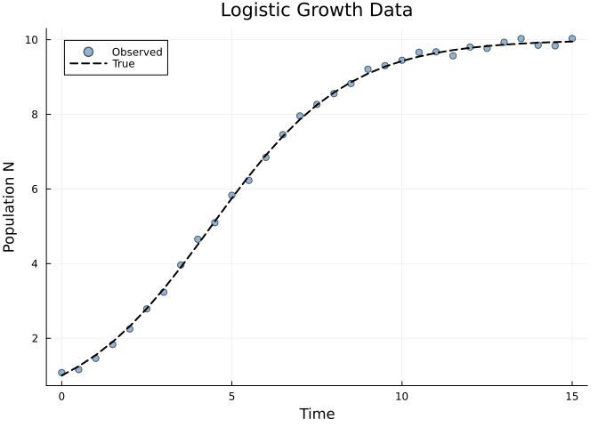
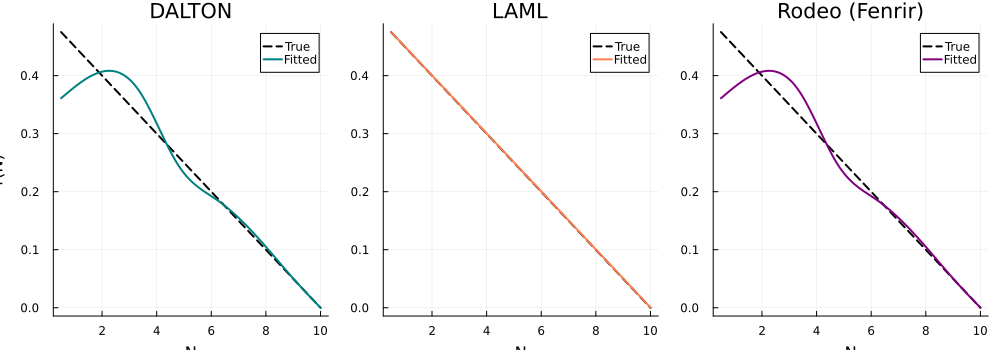
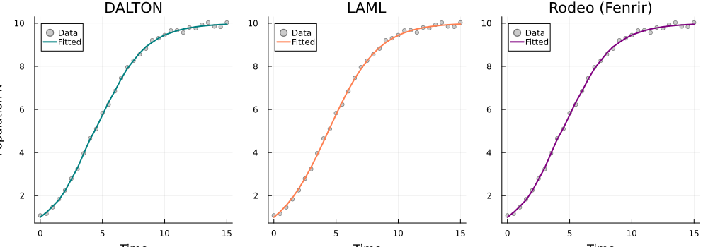
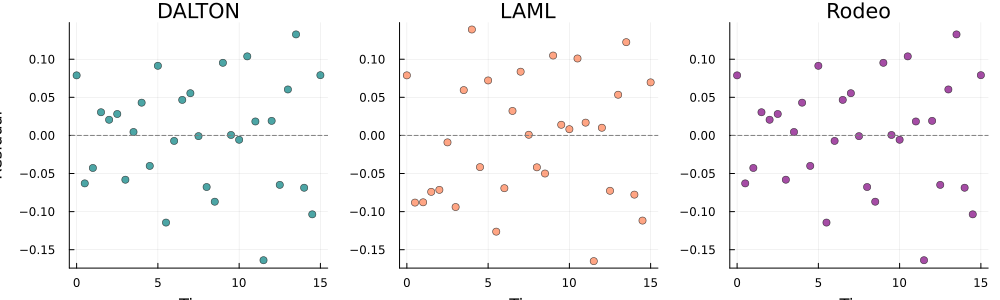
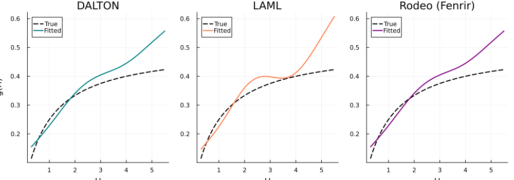
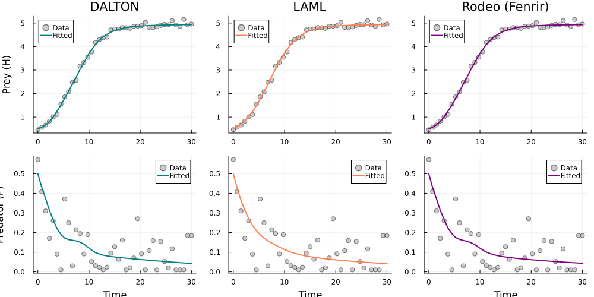
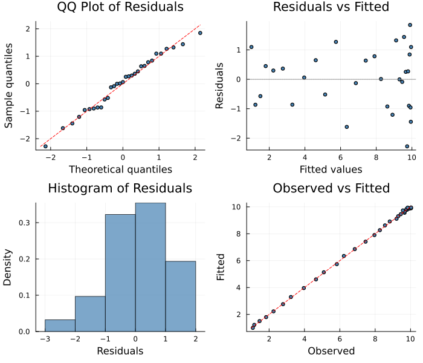

# Probabilistic ODE Solving with DaltonSolver
Simon Frost
2026-06-12

- [Overview](#overview)
- [Logistic Growth with Unknown Per-Capita
  Rate](#logistic-growth-with-unknown-per-capita-rate)
  - [Observed Data](#observed-data)
  - [Fit with DaltonSolver](#fit-with-daltonsolver)
  - [Compare with LAML and
    RodeoSolver](#compare-with-laml-and-rodeosolver)
  - [Recovered Per-Capita Growth
    Rate](#recovered-per-capita-growth-rate)
  - [Fitted Trajectories](#fitted-trajectories)
  - [Residuals](#residuals)
- [Probabilistic vs. Deterministic
  Solvers](#probabilistic-vs-deterministic-solvers)
  - [Why DALTON and Rodeo look identical
    here](#why-dalton-and-rodeo-look-identical-here)
- [Oscillatory Example:
  Lotka-Volterra](#oscillatory-example-lotka-volterra)
  - [Functional Response Recovery
    (Oscillatory)](#functional-response-recovery-oscillatory)
  - [Fitted Trajectories
    (Oscillatory)](#fitted-trajectories-oscillatory)
- [Diagnostic Plots](#diagnostic-plots)
- [Summary](#summary)

## Overview

The `DaltonSolver` implements the **Data-Adaptive Likelihood with
Transformed Observations** (DALTON) method (Wu & Lysy 2024). Unlike
classical ODE solvers that treat the numerical solution as exact, DALTON
uses a **probabilistic ODE solver** based on Integrated Brownian Motion
(IBM) and Kalman filtering.

The key idea: DALTON computes a **data-adaptive marginal likelihood**
p(Y\|θ) by running two Kalman filter passes:

1.  **Joint pass**: Kalman filter with both ODE constraints and
    observation data → log p(Y, Z)
2.  **Marginal pass**: Kalman filter with only ODE constraints → log
    p(Z)
3.  **DALTON likelihood**: log p(Y\|Z) = log p(Y, Z) - log p(Z)

This naturally accounts for ODE discretization uncertainty and provides
uncertainty estimates for the fitted states.

``` julia
using PartiallySpecifiedModels
using OrdinaryDiffEq
using Plots; default(fmt=:png)
using Random
Random.seed!(42)
```

    TaskLocalRNG()

## Logistic Growth with Unknown Per-Capita Rate

``` julia
r_true(N) = 0.5 * (1.0 - N / 10.0)

function logistic!(du, u, p, t)
    N = u[1]
    du[1] = p.r(N) * N
end

sol_true = solve(ODEProblem(logistic!, [1.0], (0.0, 15.0), (; r=r_true)),
                 Tsit5(); saveat=0.5)
t_data = collect(sol_true.t)
data_N = [sol_true.u[i][1] + 0.1 * randn() for i in 1:length(t_data)]
data_matrix = reshape(max.(data_N, 0.01), :, 1)
```

    31×1 Matrix{Float64}:
      1.0788355601604291
      1.1605772282016233
      1.4609018803046872
      1.830964168555268
      2.2494751109754154
      2.787177904975914
      3.232988782145511
      3.9633895011880202
      4.652430282861129
      5.0964616704520465
      ⋮
      9.674117688772498
      9.568487749761156
      9.803623047868273
      9.768192642939432
      9.931372584493301
     10.029457191674403
      9.852147135390531
      9.835900079757396
     10.031178231752104

### Observed Data

<div id="fig-data">



Figure 1: Simulated logistic growth data with noise

</div>

### Fit with DaltonSolver

``` julia
uf = BSplineApproximator(:r, (0.0, 11.0), 8; initial=x -> 0.3)

prob = PSMProblem(logistic!, [1.0], (0.0, 15.0), [uf];
    data_times=t_data, data_values=Float64.(data_matrix),
    obs_to_state=[1], known_params=NamedTuple(),
    likelihood=PartiallySpecifiedModels.Gaussian())

sol_dalton = solve(prob, DaltonSolver(n_steps=200, maxiters=500, verbose=false));
```

### Compare with LAML and RodeoSolver

``` julia
sol_laml = solve(prob, LAML(maxiters=100, verbose=false));
sol_rodeo = solve(prob, RodeoSolver(n_steps=200, method=:fenrir, maxiters=500, verbose=false));
```

    DaltonSolver: SS=0.1546, r(5)=0.231
    RodeoSolver:  SS=0.1588, r(5)=0.24
    LAML:         SS=0.1995, EDF=2.0, r(5)=0.251
    True r(5) = 0.25

### Recovered Per-Capita Growth Rate

<div id="fig-growth-rate">



Figure 2: Recovered per-capita growth rate r(N) — one panel per solver

</div>

### Fitted Trajectories

<div id="fig-trajectories">



Figure 3: Fitted population trajectories — one panel per solver

</div>

### Residuals

<div id="fig-residuals">



Figure 4: Residuals by solver

</div>

## Probabilistic vs. Deterministic Solvers

| Feature | LAML | RodeoSolver | DaltonSolver |
|----|----|----|----|
| **ODE solving** | Deterministic (Tsit5) | Probabilistic (IBM+Kalman) | Probabilistic (IBM+Kalman) |
| **Likelihood** | Gaussian residuals | Fenrir marginal | DALTON data-adaptive |
| **Uncertainty** | EDF-based | State covariance | State covariance |
| **Discretization** | Adaptive step | Fixed grid | Fixed grid |
| **Smoothing λ** | LAML (Fellner-Schall) — data-driven | Heuristic (0.1/σ²) | Heuristic (0.1/σ²) |

> [!NOTE]
>
> ### Smoothing parameter selection
>
> Unlike LAML, which estimates the smoothing parameter λ via marginal
> likelihood (Fellner-Schall iteration), Rodeo and DALTON currently use
> a heuristic: `λ = 0.1/σ²_obs`. This is a limitation — the smoothing
> may be too strong or too weak depending on the problem. For better
> results, you can:
>
> 1.  Run LAML first to estimate λ, then use that value to calibrate the
>     Rodeo/DALTON penalty
> 2.  Profile over λ by running multiple fits and selecting the one with
>     the best probabilistic marginal likelihood

### Why DALTON and Rodeo look identical here

On this simple logistic growth problem, all three solvers converge to
nearly the same optimum. This is expected: when the data are informative
and the dynamics are smooth, both the DALTON two-filter decomposition
(log p(Y,Z) - log p(Z)) and the Fenrir forward-backward approach compute
very similar marginal likelihoods, and the same optimizer (Nelder-Mead →
L-BFGS) finds the same minimum. The differences between these solvers
become visible on **harder problems** — oscillatory dynamics, sparse
data, or high noise — where their different treatments of ODE
discretization uncertainty lead to different solutions.

## Oscillatory Example: Lotka-Volterra

To show where DALTON and Rodeo diverge, we fit a predator-prey system
with moderately noisy observations. We use initial conditions that
produce wide-amplitude oscillations, so that prey density H spans a
range from ~0.5 to ~5, exercising both the increasing and saturating
parts of the functional response.

``` julia
g_true(H) = 0.5 * H / (1.0 + 1.0 * H)

function lv!(du, u, p, t)
    H, P = u
    du[1] = 0.4 * H * (1.0 - H / 5.0) - p.g(H) * P
    du[2] = 0.5 * p.g(H) * P - 0.3 * P
end

sol_lv = solve(ODEProblem(lv!, [0.5, 0.5], (0.0, 30.0), (; g=g_true)),
               Tsit5(); saveat=0.75)
t_lv = collect(sol_lv.t)
data_H = [sol_lv.u[i][1] + 0.1 * randn() for i in 1:length(t_lv)]
data_P = [sol_lv.u[i][2] + 0.1 * randn() for i in 1:length(t_lv)]
data_lv = hcat(max.(data_H, 0.01), max.(data_P, 0.01))
```

    41×2 Matrix{Float64}:
     0.461925  0.572022
     0.563169  0.408117
     0.661718  0.310027
     0.826793  0.170756
     1.01219   0.260513
     1.11168   0.0904338
     1.54782   0.01
     1.8599    0.371274
     2.07555   0.249974
     2.4809    0.030569
     ⋮         
     4.90037   0.154936
     4.94544   0.0525073
     4.93471   0.0196658
     5.10259   0.117797
     4.91639   0.01
     4.86169   0.01
     5.15636   0.01
     4.92797   0.184969
     4.95962   0.184702

``` julia
uf_lv = BSplineApproximator(:g, (0.3, 5.5), 10; initial=x -> 0.1)

prob_lv = PSMProblem(lv!, [0.5, 0.5], (0.0, 30.0), [uf_lv];
    data_times=t_lv, data_values=Float64.(data_lv),
    obs_to_state=[1, 2], known_params=NamedTuple(),
    likelihood=PartiallySpecifiedModels.Gaussian())

sol_lv_dalton = solve(prob_lv, DaltonSolver(n_steps=300, maxiters=500, verbose=false));
sol_lv_rodeo = solve(prob_lv, RodeoSolver(n_steps=300, method=:fenrir, maxiters=500, verbose=false));
sol_lv_laml = solve(prob_lv, LAML(maxiters=60, verbose=false));
```

### Functional Response Recovery (Oscillatory)

<div id="fig-lv-growth-rate">



Figure 5: Recovered functional response g(H) on harder oscillatory
problem

</div>

### Fitted Trajectories (Oscillatory)

<div id="fig-lv-trajectories">



Figure 6: Fitted Lotka-Volterra trajectories — sparse noisy data

</div>

**Key advantage of DALTON over Fenrir (RodeoSolver)**: The DALTON
likelihood directly incorporates observations into the Kalman state,
giving a tighter data-adaptive estimate of p(Y\|θ). On oscillatory
systems with moderate noise, this can lead to different smoothing of the
recovered functional response.

## Diagnostic Plots

A standard 4-panel diagnostic display assesses residual behaviour. The
QQ plot checks normality of standardized residuals, “Residuals vs
Fitted” detects systematic patterns, the histogram visualises the
residual distribution, and “Observed vs Fitted” checks overall
calibration.

``` julia
using PartiallySpecifiedModels: appraise

diag = appraise(sol_dalton)

p_qq = scatter(diag.qq_theoretical, diag.qq_sample,
    xlabel="Theoretical quantiles", ylabel="Sample quantiles",
    title="QQ Plot of Residuals", ms=3, legend=false, color=:steelblue)
mn, mx = extrema(vcat(diag.qq_theoretical, diag.qq_sample))
plot!(p_qq, [mn, mx], [mn, mx], color=:red, ls=:dash, label="")

p_rf = scatter(diag.fitted, diag.residuals,
    xlabel="Fitted values", ylabel="Residuals",
    title="Residuals vs Fitted", ms=3, legend=false, color=:steelblue)
hline!(p_rf, [0], color=:gray, ls=:dot)

p_hist = histogram(diag.residuals, normalize=:pdf,
    xlabel="Residuals", ylabel="Density",
    title="Histogram of Residuals", legend=false, color=:steelblue, alpha=0.7)

p_of = scatter(diag.observed, diag.fitted,
    xlabel="Observed", ylabel="Fitted",
    title="Observed vs Fitted", ms=3, legend=false, color=:steelblue)
mn2, mx2 = extrema(vcat(diag.observed, diag.fitted))
plot!(p_of, [mn2, mx2], [mn2, mx2], color=:red, ls=:dash, label="")

plot(p_qq, p_rf, p_hist, p_of, layout=(2, 2), size=(700, 600))
```



    Durbin-Watson: 2.326

## Summary

The `DaltonSolver` provides a principled probabilistic approach to
fitting partially specified models. By treating the ODE solution as
uncertain (via an IBM prior and Kalman filtering), it naturally accounts
for discretization error and provides state uncertainty estimates
alongside the fitted unknown functions.

> [!TIP]
>
> ### When to prefer DALTON
>
> For smooth, well-observed ODE systems (like the logistic example
> above), all three solvers give similar results — LAML is usually the
> best choice due to its automatic smoothing parameter selection.
>
> DALTON and Rodeo are most valuable when:
>
> - **Discretisation matters**: stiff or rapidly-changing dynamics where
>   the ODE solver’s step size affects the likelihood
> - **Uncertainty propagation**: you want posterior state covariances
>   (e.g., for downstream decision-making)
> - **Combining with Bayesian inference**: the probabilistic likelihood
>   integrates naturally with `PseudoMarginalSolver` for full posterior
>   sampling (see [Vignette
>   19](../19_pseudo_marginal/19_pseudo_marginal.qmd))
> - **Non-smooth dynamics**: the IBM prior regularises naturally,
>   avoiding the linearisation issues that plague LAML on oscillatory
>   systems
