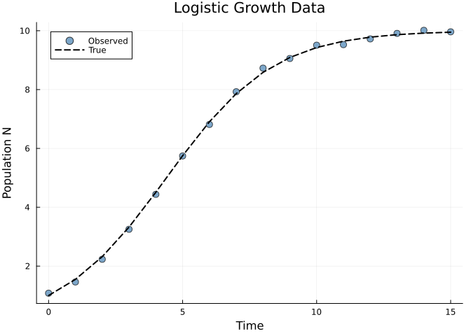
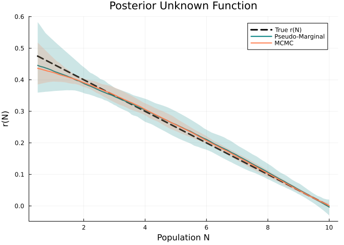
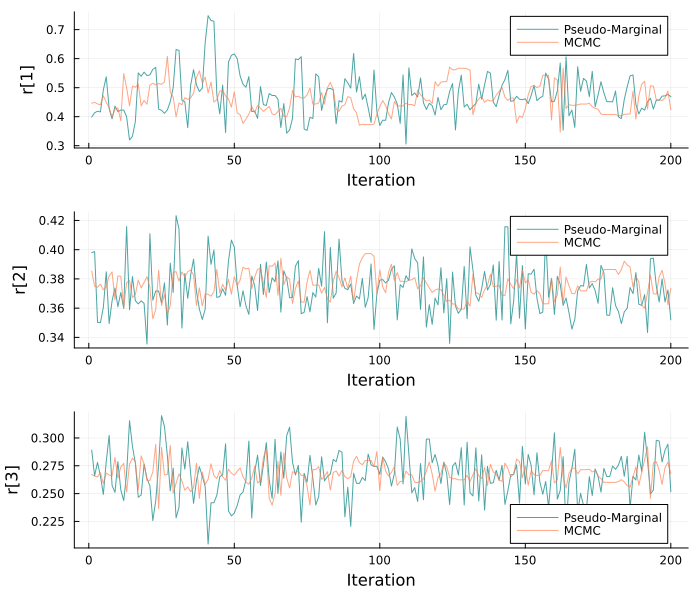
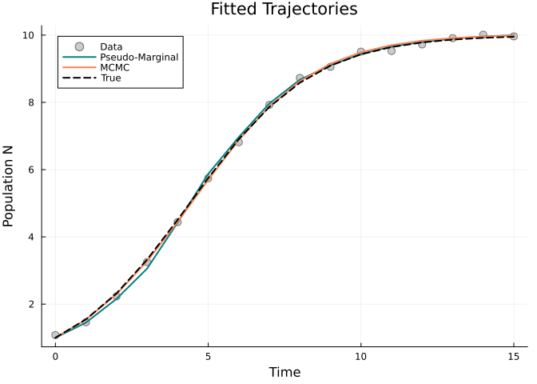

# Bayesian Inference with PseudoMarginalSolver
Simon Frost
2026-03-23

- [Overview](#overview)
- [Logistic Growth Model](#logistic-growth-model)
  - [Observed Data](#observed-data)
  - [Fit with PseudoMarginalSolver](#fit-with-pseudomarginalsolver)
  - [Compare with MCMCSolver](#compare-with-mcmcsolver)
  - [Posterior Function with Credible
    Intervals](#posterior-function-with-credible-intervals)
  - [Trace Plots](#trace-plots)
  - [Fitted Trajectories](#fitted-trajectories)
- [Bayesian Solver Comparison](#bayesian-solver-comparison)
- [Summary](#summary)

## Overview

The `PseudoMarginalSolver` combines **probabilistic ODE solving** with
**Bayesian MCMC inference**. It uses a probabilistic ODE solver
(fenrir/DALTON) as an inner likelihood estimator within an outer
NUTS/HMC sampling loop, yielding full posterior distributions over the
unknown function parameters.

This differs from:

- **MCMCSolver**: Uses deterministic ODE integration for the likelihood
- **MagiSolver**: Uses Kalman-filtered Integrated Brownian Motion to
  marginalize states
- **PseudoMarginalSolver**: Uses a probabilistic ODE solver for
  approximate marginal likelihood, then samples with NUTS

``` julia
using PartiallySpecifiedModels
using OrdinaryDiffEq
using MCMCChains
using Statistics
using Plots; default(fmt=:png)
using Random
Random.seed!(42)
```

    TaskLocalRNG()

## Logistic Growth Model

``` julia
r_true(N) = 0.5 * (1.0 - N / 10.0)

function logistic!(du, u, p, t)
    N = u[1]
    du[1] = p.r(N) * N
end

sol_true = solve(ODEProblem(logistic!, [1.0], (0.0, 15.0), (; r=r_true)),
                 Tsit5(); saveat=1.0)
t_data = collect(sol_true.t)
data_N = [sol_true.u[i][1] + 0.1 * randn() for i in 1:length(t_data)]
data_matrix = reshape(max.(data_N, 0.01), :, 1)
```

    16×1 Matrix{Float64}:
      1.0788355601604291
      1.4602953689302098
      2.232315282630221
      3.2509556243360147
      4.43834243541422
      5.74396296665955
      6.814354955078784
      7.926170805350534
      8.728810824338881
      9.056176806548434
      9.508392182423473
      9.527601736006982
      9.72244341286657
      9.909438484863317
     10.013972035864887
      9.963242977502556

### Observed Data

<div id="fig-data">



Figure 1: Simulated logistic growth data

</div>

### Fit with PseudoMarginalSolver

We use the fenrir inner method for the probabilistic likelihood. Since
the Kalman-filter-based likelihood requires good initialization, we
first run LAML to get a point estimate and use it to warm-start the
sampler.

``` julia
uf = BSplineApproximator(:r, (0.0, 12.0), 6)

prob = PSMProblem(logistic!, [1.0], (0.0, 15.0), [uf];
    data_times=t_data, data_values=Float64.(data_matrix),
    obs_to_state=[1], known_params=NamedTuple(),
    likelihood=PartiallySpecifiedModels.Gaussian())

# LAML first for initialization
sol_laml = solve(prob, LAML(maxiters=50, verbose=false));
laml_init = Float64.(collect(sol_laml.parameters))

sol_pm = solve(prob, PseudoMarginalSolver(
    n_samples=200, n_warmup=100,
    n_steps=200, n_deriv=3,
    inner_method=:fenrir,
    initial_params=laml_init,
    verbose=false));
```

    [ Info: Found initial step size 0.0125

### Compare with MCMCSolver

``` julia
sol_mcmc = solve(prob, MCMCSolver(
    n_samples=200, n_warmup=100, verbose=false));
```

### Posterior Function with Credible Intervals

<div id="fig-posterior-function">



Figure 2: Posterior r(N) with 95% credible intervals from both Bayesian
solvers

</div>

### Trace Plots

<div id="fig-traces">



Figure 3: Trace plots for first three spline coefficients

</div>

### Fitted Trajectories

<div id="fig-trajectories">



Figure 4: Fitted population trajectories

</div>

## Bayesian Solver Comparison

| Feature | MCMCSolver | MagiSolver | PseudoMarginalSolver |
|----|----|----|----|
| **Inner likelihood** | Deterministic ODE | Kalman marginal | Probabilistic ODE (fenrir/DALTON) |
| **Outer sampler** | NUTS | NUTS | NUTS |
| **State marginalization** | No (states from ODE) | Yes (Kalman filter) | Partial (IBM prior) |
| **Unobserved states** | Requires all observed | Handles naturally | Handles via IBM |
| **ODE error** | Ignored | Modeled as noise | Modeled via IBM prior |
| **Output** | MCMCChains | MCMCChains | MCMCChains |

## Summary

The `PseudoMarginalSolver` provides full Bayesian inference over unknown
function parameters using a probabilistic ODE solver for likelihood
estimation. This naturally accounts for ODE discretization uncertainty,
making it particularly appropriate when the ODE solution quality is
uncertain or when the system is stiff.
