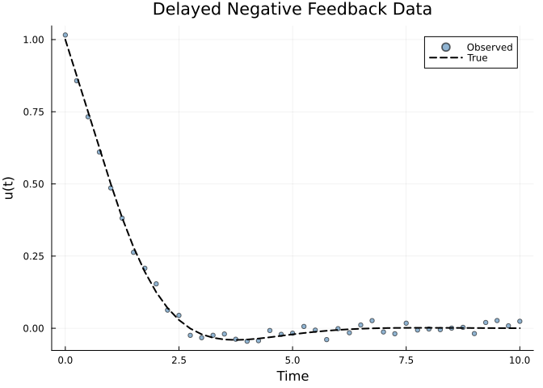
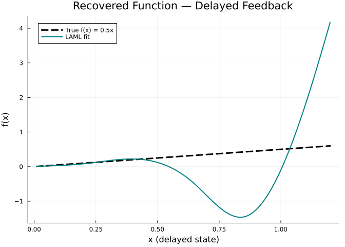
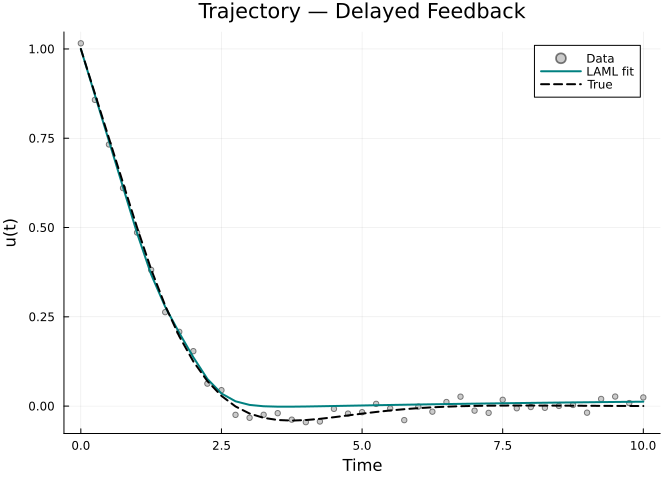
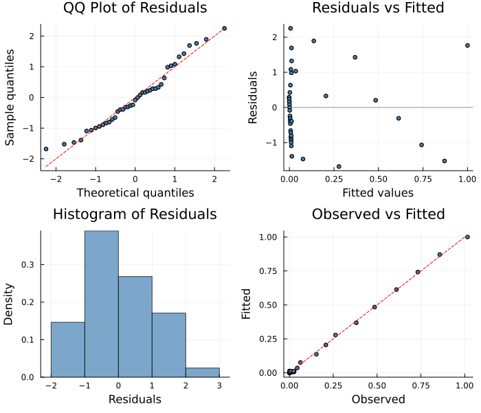

# Delay Differential Equations
Simon Frost
2026-06-12

- [Overview](#overview)
- [Example 1: Delayed Negative
  Feedback](#example-1-delayed-negative-feedback)
  - [Generate Data](#generate-data)
  - [Observed Data](#observed-data)
  - [Define the PSM Problem](#define-the-psm-problem)
  - [Fit with LAML](#fit-with-laml)
  - [Recovered Function](#recovered-function)
  - [Fitted Trajectory](#fitted-trajectory)
- [Limitations and Oscillatory DDEs](#limitations-and-oscillatory-ddes)
- [DDE Problem Setup](#dde-problem-setup)
- [Diagnostic Plots](#diagnostic-plots)
- [Summary](#summary)

## Overview

Many ecological systems exhibit **time delays** — for example, predator
responses to prey density may depend on prey levels at some past time,
or population dynamics may depend on maturation times.
PartiallySpecifiedModels.jl supports **delay differential equations
(DDEs)** through integration with
[DelayDiffEq.jl](https://github.com/SciML/DelayDiffEq.jl).

A DDE has the form:

$$\frac{du}{dt} = f(u(t), u(t - \tau), p, t)$$

where $\tau$ is the delay and the history function $h(t)$ provides
initial values for $t \leq t_0$.

``` julia
using PartiallySpecifiedModels
using OrdinaryDiffEq
using DelayDiffEq
using Plots; default(fmt=:png)
using Random
Random.seed!(42)
```

    TaskLocalRNG()

## Example 1: Delayed Negative Feedback

We consider a simple model with delayed negative feedback:

$$\frac{du}{dt} = -f(u(t - \tau))$$

where $f$ is an unknown function and $\tau = 1.0$. The true function is
$f(x) = 0.5x$ (linear decay acting on the delayed state).

### Generate Data

``` julia
function dde_true!(du, u, h, p, t)
    u_delayed = h(p, t - 1.0)
    du[1] = -0.5 * u_delayed[1]
end

h_func(p, t) = [1.0]  # constant history

prob_true = DDEProblem(dde_true!, [1.0], h_func, (0.0, 10.0);
    constant_lags=[1.0])
sol_true = solve(prob_true, MethodOfSteps(Tsit5()); saveat=0.25)

t_data = collect(sol_true.t)
noise = 0.02
data_vals = [sol_true.u[i][1] + noise * randn() for i in 1:length(t_data)]
data_matrix = reshape(max.(data_vals, 0.001), :, 1)
```

    41×1 Matrix{Float64}:
     1.015767112032086
     0.8574028280809121
     0.732524130355808
     0.610334900711303
     0.4859560960248465
     0.38136086263908175
     0.2629915322732008
     0.20794491662233638
     0.15377366551423094
     0.06290358229925974
     ⋮
     0.001
     0.001
     0.001
     0.0031810168566433613
     0.001
     0.02001289009105699
     0.026749333866878167
     0.00846453382610652
     0.024216939814217422

### Observed Data

<div id="fig-data-feedback">



Figure 1: Delayed negative feedback: observed data vs true solution

</div>

### Define the PSM Problem

The key additions for DDEs are:

- **`delays`**: a vector of constant delay values
- **`history`**: a function `h(p, t)` returning the state for
  $t \leq t_0$
- The dynamics function takes an extra `h` argument:
  `f!(du, u, h, p, t)`

``` julia
function dde_psm!(du, u, h, p, t)
    u_delayed = h(p, t - 1.0)
    du[1] = -p.f(u_delayed[1])
end

uf = BSplineApproximator(:f, (0.0, 1.5), 8; initial=x -> 0.3 * x)

prob = PSMProblem(dde_psm!, [1.0], (0.0, 10.0), [uf];
    data_times=t_data, data_values=Float64.(data_matrix),
    obs_to_state=[1], known_params=NamedTuple(),
    likelihood=PartiallySpecifiedModels.Gaussian(),
    delays=[1.0],
    history=h_func)
```

    PSMProblem{typeof(dde_psm!), Vector{Float64}, Gaussian, Tsit5{typeof(OrdinaryDiffEqCore.trivial_limiter!), typeof(OrdinaryDiffEqCore.trivial_limiter!), Static.False}}(dde_psm!, [1.0], (0.0, 10.0), BSplineApproximator[BSplineApproximator(:f, (0.0, 1.5), 8, var"#8#9"())], [0.0, 0.25, 0.5, 0.75, 1.0, 1.25, 1.5, 1.75, 2.0, 2.25  …  7.75, 8.0, 8.25, 8.5, 8.75, 9.0, 9.25, 9.5, 9.75, 10.0], [1.015767112032086; 0.8574028280809121; … ; 0.00846453382610652; 0.024216939814217422;;], [1.0; 1.0; … ; 1.0; 1.0;;], [1], NamedTuple(), Gaussian(), Tsit5{typeof(OrdinaryDiffEqCore.trivial_limiter!), typeof(OrdinaryDiffEqCore.trivial_limiter!), Static.False}(OrdinaryDiffEqCore.trivial_limiter!, OrdinaryDiffEqCore.trivial_limiter!, static(false)), Dict{Symbol, Any}(), false, [1.0], h_func)

### Fit with LAML

``` julia
sol_laml = solve(prob, LAML(maxiters=100, verbose=false));
```

### Recovered Function

<div id="fig-function-feedback">



Figure 2: Recovered unknown function f(x) vs true linear function

</div>

### Fitted Trajectory

<div id="fig-trajectory-feedback">



Figure 3: Fitted trajectory vs observed data for the delayed feedback
model

</div>

## Limitations and Oscillatory DDEs

> [!WARNING]
>
> ### LAML and oscillatory DDEs
>
> The IRLS+PCLS linearization used by `LAML` works well for DDEs that
> approach a stable equilibrium (as in Example 1 above), but struggles
> with **oscillatory DDEs** such as Nicholson’s blowfly equation. The
> delay creates a complex mapping between spline coefficients and the
> trajectory, and the linearization cannot capture this nonlinear
> coupling.
>
> For oscillatory DDEs, consider:
>
> - **`AdamSolver`** — uses autodiff through the DDE solve (works if the
>   dynamics are differentiable)
> - **`CollocationLAML`** — avoids ODE integration; treats state values
>   as free parameters
> - **`MCMCSolver`** — Bayesian inference that handles nonlinearity via
>   sampling
>
> See [Vignette 03:
> Lotka–Volterra](../03_lotka_volterra/03_lotka_volterra.qmd) for a
> similar discussion of linearization limitations in oscillatory ODE
> systems.

## DDE Problem Setup

| Component | ODE | DDE |
|----|----|----|
| **Dynamics** | `f!(du, u, p, t)` | `f!(du, u, h, p, t)` |
| **History** | Not needed | `h(p, t) → state vector` |
| **Delays** | None | `delays=[τ₁, τ₂, ...]` |
| **Accessing delayed state** | N/A | `h(p, t - τ)` |
| **Solver** | `Tsit5()` etc. | `MethodOfSteps(Tsit5())` (automatic) |
| **Compatible PSM solvers** | All | LAML, AdamSolver, BNGSolver\* |

\*BNGSolver works with DDEs when all states are observed, since it only
uses smoothed derivatives.

## Diagnostic Plots

A standard 4-panel diagnostic display assesses residual behaviour. The
QQ plot checks normality of standardized residuals, “Residuals vs
Fitted” detects systematic patterns, the histogram visualises the
residual distribution, and “Observed vs Fitted” checks overall
calibration.

``` julia
using PartiallySpecifiedModels: appraise

diag = appraise(sol_laml)

p_qq = scatter(diag.qq_theoretical, diag.qq_sample,
    xlabel="Theoretical quantiles", ylabel="Sample quantiles",
    title="QQ Plot of Residuals", ms=3, legend=false, color=:steelblue)
mn, mx = extrema(vcat(diag.qq_theoretical, diag.qq_sample))
plot!(p_qq, [mn, mx], [mn, mx], color=:red, ls=:dash, label="")

p_rf = scatter(diag.fitted, diag.residuals,
    xlabel="Fitted values", ylabel="Residuals",
    title="Residuals vs Fitted", ms=3, legend=false, color=:steelblue)
hline!(p_rf, [0], color=:gray, ls=:dot)

p_hist = histogram(diag.residuals, normalize=:pdf,
    xlabel="Residuals", ylabel="Density",
    title="Histogram of Residuals", legend=false, color=:steelblue, alpha=0.7)

p_of = scatter(diag.observed, diag.fitted,
    xlabel="Observed", ylabel="Fitted",
    title="Observed vs Fitted", ms=3, legend=false, color=:steelblue)
mn2, mx2 = extrema(vcat(diag.observed, diag.fitted))
plot!(p_of, [mn2, mx2], [mn2, mx2], color=:red, ls=:dash, label="")

plot(p_qq, p_rf, p_hist, p_of, layout=(2, 2), size=(700, 600))
```



    Durbin-Watson: 2.127

> [!TIP]
>
> ### See Also
>
> - [Vignette 27: Blowfly DDE](../27_blowfly_dde/27_blowfly_dde.qmd) —
>   ecological DDE application with bootstrap confidence intervals

## Summary

PartiallySpecifiedModels.jl supports delay differential equations
through the `delays` and `history` keyword arguments to `PSMProblem`.
The DDE dynamics function takes an extra history argument `h` that
provides delayed state values. All standard solvers (LAML, Adam) work
with DDEs via automatic wrapping with `MethodOfSteps`.
