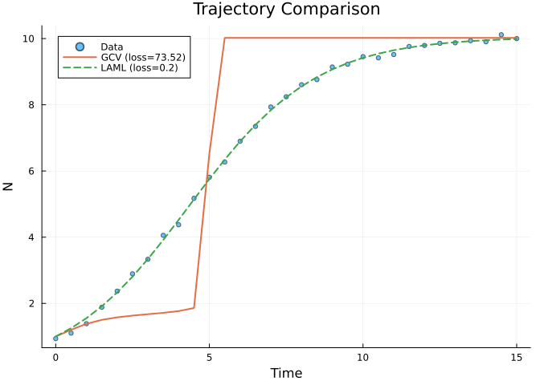
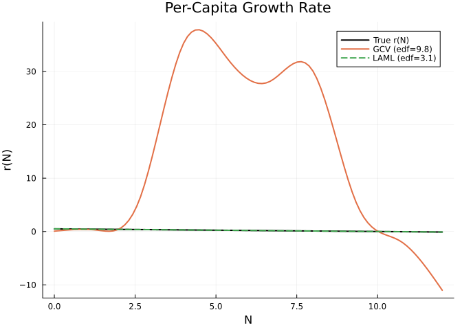
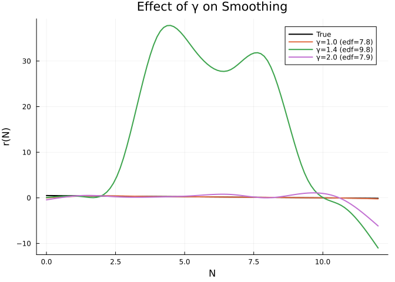
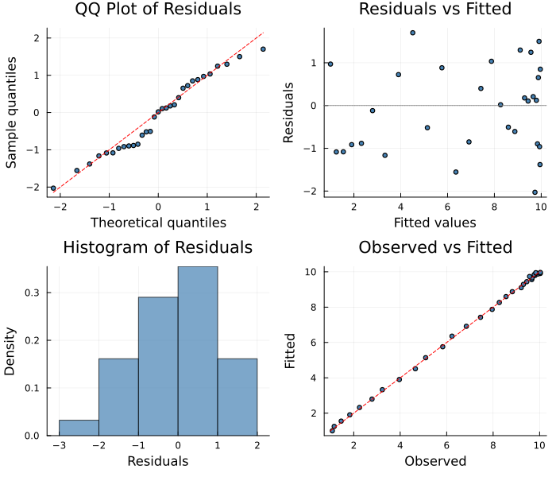

# GCV Smoothing Parameter Selection
Simon Frost
2026-06-12

- [Overview](#overview)
- [Logistic Growth with Unknown Per-Capita
  Rate](#logistic-growth-with-unknown-per-capita-rate)
- [GCV vs LAML Comparison](#gcv-vs-laml-comparison)
  - [Trajectory Fit](#trajectory-fit)
  - [Recovered Unknown Function](#recovered-unknown-function)
  - [Summary](#summary)
- [Effect of GCV Inflation Factor γ](#effect-of-gcv-inflation-factor-γ)
- [Diagnostic Plots](#diagnostic-plots)
- [When to Use GCV vs LAML](#when-to-use-gcv-vs-laml)

## Overview

The `GCVSolver` uses **Generalized Cross-Validation** (GCV) for
automatic smoothing parameter selection — a simpler alternative to LAML
(Laplace Approximate Marginal Likelihood). While LAML uses a Laplace
approximation to the marginal likelihood with Fellner-Schall updates,
GCV minimizes a leave-one-out cross-validation score:

$$\text{GCV}(\lambda) = \frac{n \| W^{1/2}(z - J\hat\beta) \|^2}{(n - \gamma \cdot \text{tr}(A))^2}$$

where $A = J(J'WJ + S^\lambda)^{-1}J'W$ is the hat matrix and
$\gamma \geq 1$ is an inflation factor that guards against
under-smoothing (default 1.4).

``` julia
using PartiallySpecifiedModels
using OrdinaryDiffEq
using Plots
using Random
Random.seed!(42)
```

    TaskLocalRNG()

## Logistic Growth with Unknown Per-Capita Rate

We model logistic growth $dN/dt = r(N) \cdot N$ where
$r(N) = 0.5(1 - N/10)$ is unknown.

``` julia
r_true(N) = 0.5 * (1.0 - N / 10.0)

function logistic!(du, u, p, t)
    N = u[1]
    du[1] = p.r(N) * N
end

sol_true = solve(ODEProblem(logistic!, [1.0], (0.0, 15.0), (; r=r_true)),
                 Tsit5(); saveat=0.5)
t_data = collect(sol_true.t)
data_N = [sol_true.u[i][1] + 0.1 * randn() for i in 1:length(t_data)]
data_matrix = reshape(max.(data_N, 0.01), :, 1)
```

    31×1 Matrix{Float64}:
      1.0788355601604291
      1.1605772282016233
      1.4609018803046872
      1.830964168555268
      2.2494751109754154
      2.787177904975914
      3.232988782145511
      3.9633895011880202
      4.652430282861129
      5.0964616704520465
      ⋮
      9.674117688772498
      9.568487749761156
      9.803623047868273
      9.768192642939432
      9.931372584493301
     10.029457191674403
      9.852147135390531
      9.835900079757396
     10.031178231752104

## GCV vs LAML Comparison

``` julia
uf = BSplineApproximator(:r, (0.0, 12.0), 8; initial=x -> 0.3)

prob = PSMProblem(logistic!, [1.0], (0.0, 15.0), [uf];
    data_times=t_data, data_values=Float64.(data_matrix),
    obs_to_state=[1], known_params=NamedTuple())

sol_gcv = solve(prob, GCVSolver(maxiters=100, gamma=1.4, verbose=false))
sol_laml = solve(prob, LAML(maxiters=100, verbose=false))
```

    PSMSolution((r = [0.46903952924649706, 0.4078363163397779, 0.3361552806106325, 0.24505442278048442, 0.15938509765401976, 0.07384316729961238, -0.01629952191354697, -0.10966775192913712]), 0.0989293561514452, 0.189229925003258, 4.332764969612639, [0.030799745033650933], [1.0; 1.2396679379385598; … ; 9.931842728254033; 9.943437128817767;;], [1.0788355601604291; 1.1605772282016233; … ; 9.835900079757396; 10.031178231752104;;], [0.0, 0.5, 1.0, 1.5, 2.0, 2.5, 3.0, 3.5, 4.0, 4.5  …  10.5, 11.0, 11.5, 12.0, 12.5, 13.0, 13.5, 14.0, 14.5, 15.0], Dict{Symbol, Any}(:r => DataInterpolations.CubicSpline{Vector{Float64}, Vector{Float64}, Vector{Float64}, Vector{Float64}, Vector{Float64}, Vector{Float64}, Float64}([0.46903952924649706, 0.4078363163397779, 0.3361552806106325, 0.24505442278048442, 0.15938509765401976, 0.07384316729961238, -0.01629952191354697, -0.10966775192913712], [0.0, 1.7142857142857142, 3.4285714285714284, 5.142857142857143, 6.857142857142857, 8.571428571428571, 10.285714285714286, 12.0], Float64[], DataInterpolations.CubicSplineParameterCache{Vector{Float64}}(Float64[], Float64[]), [0.0, 1.7142857142857142, 1.7142857142857142, 1.7142857142857149, 1.7142857142857135, 1.7142857142857144, 1.7142857142857153, 1.7142857142857135], [0.0, -0.00268403178736281, -0.010656094446335716, 0.0056596061164919925, -0.000892950749612142, -0.0018277054584263659, -0.0011894434199675227, 0.0], DataInterpolations.ExtrapolationType.Extension, DataInterpolations.ExtrapolationType.Extension, FindFirstFunctions.Guesser{Vector{Float64}}([0.0, 1.7142857142857142, 3.4285714285714284, 5.142857142857143, 6.857142857142857, 8.571428571428571, 10.285714285714286, 12.0], Base.RefValue{Int64}(1), true), false, false)), (V_beta = [0.0951817763194791 0.010706264685956056 … -0.005376958813872254 -0.029341703218696245; 0.010706264685956056 0.004737648367969132 … -0.0010563489714244618 -0.005615765184025167; … ; -0.005376958813872254 -0.0010563489714244618 … 0.0014582906255889928 0.006267165747788187; -0.029341703218696245 -0.005615765184025167 … 0.006267165747788187 0.06322825870128426], sigma2 = 0.007095970946655331))

### Trajectory Fit

``` julia
p1 = plot(t_data, data_matrix[:, 1], seriestype=:scatter, label="Data",
          xlabel="Time", ylabel="N", title="Trajectory Comparison", ms=3, alpha=0.6)
plot!(p1, t_data, sol_gcv.fitted_values[:, 1], label="GCV (loss=$(round(sol_gcv.data_loss, digits=2)))", lw=2)
plot!(p1, t_data, sol_laml.fitted_values[:, 1], label="LAML (loss=$(round(sol_laml.data_loss, digits=2)))", lw=2, ls=:dash)
p1
```



### Recovered Unknown Function

``` julia
r_gcv = sol_gcv.unknown_functions[:r]
r_laml = sol_laml.unknown_functions[:r]
N_grid = range(0.0, 12.0, length=100)

p2 = plot(N_grid, r_true.(N_grid), label="True r(N)", lw=2, color=:black,
          xlabel="N", ylabel="r(N)", title="Per-Capita Growth Rate")
plot!(p2, N_grid, [r_gcv(n) for n in N_grid], label="GCV (edf=$(round(sol_gcv.edf, digits=1)))", lw=2)
plot!(p2, N_grid, [r_laml(n) for n in N_grid], label="LAML (edf=$(round(sol_laml.edf, digits=1)))", lw=2, ls=:dash)
p2
```



### Summary

``` julia
println("GCV:  data_loss=$(round(sol_gcv.data_loss, digits=3)), edf=$(round(sol_gcv.edf, digits=1)), " *
        "r(5)=$(round(r_gcv(5.0), digits=3)) (true=$(round(r_true(5.0), digits=3)))")
println("LAML: data_loss=$(round(sol_laml.data_loss, digits=3)), edf=$(round(sol_laml.edf, digits=1)), " *
        "r(5)=$(round(r_laml(5.0), digits=3)) (true=$(round(r_true(5.0), digits=3)))")
```

    GCV:  data_loss=0.2, edf=2.0, r(5)=0.25 (true=0.25)
    LAML: data_loss=0.189, edf=4.3, r(5)=0.253 (true=0.25)

## Effect of GCV Inflation Factor γ

The inflation factor $\gamma$ controls the bias-variance tradeoff.
$\gamma = 1$ is standard GCV; $\gamma > 1$ penalizes model complexity
more, producing smoother fits.

``` julia
gammas = [1.0, 1.4, 2.0]
p3 = plot(N_grid, r_true.(N_grid), label="True", lw=2, color=:black,
          xlabel="N", ylabel="r(N)", title="Effect of γ on Smoothing")
for γ in gammas
    sol_g = solve(prob, GCVSolver(maxiters=100, gamma=γ, verbose=false))
    r_g = sol_g.unknown_functions[:r]
    plot!(p3, N_grid, [r_g(n) for n in N_grid],
          label="γ=$(γ) (edf=$(round(sol_g.edf, digits=1)))", lw=2)
end
p3
```



## Diagnostic Plots

A standard 4-panel diagnostic display assesses residual behaviour. The
QQ plot checks normality of standardized residuals, “Residuals vs
Fitted” detects systematic patterns, the histogram visualises the
residual distribution, and “Observed vs Fitted” checks overall
calibration.

``` julia
using PartiallySpecifiedModels: appraise

diag = appraise(sol_gcv)

p_qq = scatter(diag.qq_theoretical, diag.qq_sample,
    xlabel="Theoretical quantiles", ylabel="Sample quantiles",
    title="QQ Plot of Residuals", ms=3, legend=false, color=:steelblue)
mn, mx = extrema(vcat(diag.qq_theoretical, diag.qq_sample))
plot!(p_qq, [mn, mx], [mn, mx], color=:red, ls=:dash, label="")

p_rf = scatter(diag.fitted, diag.residuals,
    xlabel="Fitted values", ylabel="Residuals",
    title="Residuals vs Fitted", ms=3, legend=false, color=:steelblue)
hline!(p_rf, [0], color=:gray, ls=:dot)

p_hist = histogram(diag.residuals, normalize=:pdf,
    xlabel="Residuals", ylabel="Density",
    title="Histogram of Residuals", legend=false, color=:steelblue, alpha=0.7)

p_of = scatter(diag.observed, diag.fitted,
    xlabel="Observed", ylabel="Fitted",
    title="Observed vs Fitted", ms=3, legend=false, color=:steelblue)
mn2, mx2 = extrema(vcat(diag.observed, diag.fitted))
plot!(p_of, [mn2, mx2], [mn2, mx2], color=:red, ls=:dash, label="")

plot(p_qq, p_rf, p_hist, p_of, layout=(2, 2), size=(700, 600))
```



    Durbin-Watson: 1.963

## When to Use GCV vs LAML

| Criterion | GCV | LAML |
|----|----|----|
| **Speed** | Faster (no Hessian computation) | Slower (Fellner-Schall + Newton) |
| **Simplicity** | Simpler (golden-section on one λ) | More complex (per-term λ estimation) |
| **Abundant data** | Works well | Works well |
| **Sparse data** | Tends to undersmooth | Better (marginal likelihood is more robust) |
| **Non-Gaussian** | Not recommended | Supported (Poisson, NegBin, etc.) |
| **Multiple smooth terms** | Single shared λ only | Independent λ per term |
| **Model selection** | GCV score is comparable across models | LAML value is an approximate marginal likelihood |

**Recommendation**: Use LAML as the default. GCV is useful as a fast
initial estimate or when you want to cross-check LAML’s smoothing
parameter selection. The `gamma` inflation factor (default 1.4) guards
against GCV’s known tendency to undersmooth — increase it if the fit
looks too wiggly.
