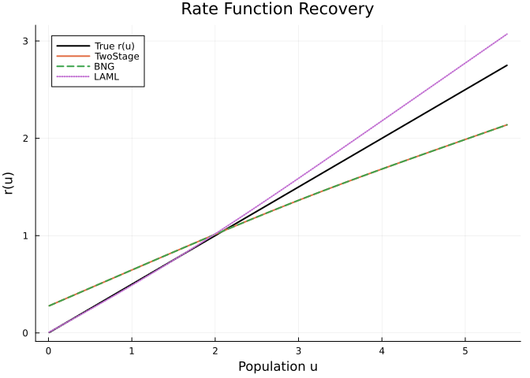
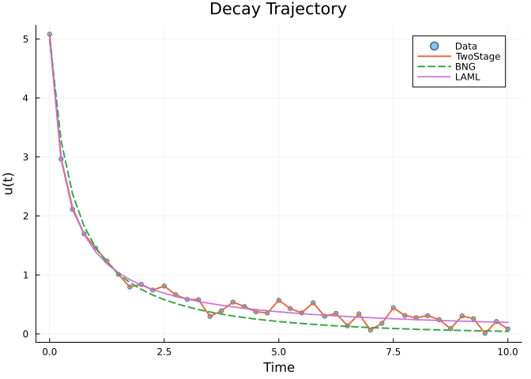

# Two-Stage Smooth-then-Differentiate
Simon Frost
2026-03-23

- [Overview](#overview)
- [Exponential Decay with Nonlinear
  Rate](#exponential-decay-with-nonlinear-rate)
- [Fit: TwoStage vs BNG vs LAML](#fit-twostage-vs-bng-vs-laml)
  - [Recovered Rate Function](#recovered-rate-function)
  - [Trajectory Comparison](#trajectory-comparison)
  - [Summary](#summary)
- [When to Use TwoStage](#when-to-use-twostage)

## Overview

The `TwoStageSolver` implements the simplest baseline approach for
partially specified models (Wood 2001, Macdonald & Husmeier 2015):

1.  **Stage 1 — Smooth**: Fit cubic splines to each observed state
    independently → $\hat{y}_k(t)$ and $d\hat{y}_k/dt$
2.  **Stage 2 — Match**: Optimize unknown function parameters by
    minimizing the mismatch between smoothed derivatives and the ODE
    right-hand side

This avoids ODE integration entirely (like `BNGSolver`), making it fast
and robust. The key difference from BNG is its simplicity — no Bayesian
interpretation, just penalized least squares matching.

``` julia
using PartiallySpecifiedModels
using OrdinaryDiffEq
using Plots
using Random
Random.seed!(123)
```

    TaskLocalRNG()

## Exponential Decay with Nonlinear Rate

We use the standard density-dependent decay model:

$$\frac{du}{dt} = -r(u) \cdot u$$

where the true rate function is $r(u) = 0.5u$ (quadratic decay). This
produces a trajectory that sweeps from $u=5$ down to near zero,
exercising the full functional response.

``` julia
r_true(u) = 0.5 * u

function decay!(du, u, p, t)
    du[1] = -p.r(u[1]) * u[1]
end

u0 = [5.0]
tspan = (0.0, 10.0)
sol_true = solve(ODEProblem(decay!, u0, tspan, (; r=r_true)), Tsit5(); saveat=0.25)
t_data = collect(sol_true.t)
data_clean = [sol_true.u[i][1] for i in 1:length(t_data)]
data_noisy = data_clean .+ 0.1 * randn(length(t_data))
data_matrix = reshape(max.(data_noisy, 0.01), :, 1)
```

    41×1 Matrix{Float64}:
     5.080828792846496
     2.9647380097961546
     2.1118130508845443
     1.6974639752975096
     1.4574009523616496
     1.235144731179279
     1.0104858052499996
     0.7947151361373419
     0.8403283442100931
     0.7430206354837547
     ⋮
     0.27457596111073945
     0.30981884277727195
     0.24179562465293067
     0.08969003312694776
     0.3064852537720165
     0.2580764624815041
     0.01
     0.2095871619704285
     0.08349746625394464

## Fit: TwoStage vs BNG vs LAML

``` julia
uf = BSplineApproximator(:r, (0.01, 5.5), 10)

prob = PSMProblem(decay!, u0, tspan, [uf];
    data_times=t_data, data_values=Float64.(data_matrix),
    obs_to_state=[1], known_params=NamedTuple())

sol_ts = solve(prob, TwoStageSolver(maxiters=2000, lr=0.01, verbose=false))
sol_bng = solve(prob, BNGSolver(maxiters=2000, lr=0.01, verbose=false))
sol_laml = solve(prob, LAML(maxiters=100, verbose=false))
```

    PSMSolution((r = [0.008602807421679126, 0.3009652739432039, 0.6071698366533713, 0.9302512942510871, 1.2710544585872214, 1.6241324610183583, 1.9835417457412818, 2.3454736728352445, 2.7080888101791767, 3.07076433969371]), 0.20427806034411397, 0.4035104163187364, 2.508252569786139, [0.006638476697402939], [5.0; 2.981737797663132; … ; 0.20023435942885057; 0.19539629828823782;;], [5.080828792846496; 2.9647380097961546; … ; 0.2095871619704285; 0.08349746625394464;;], [0.0, 0.25, 0.5, 0.75, 1.0, 1.25, 1.5, 1.75, 2.0, 2.25  …  7.75, 8.0, 8.25, 8.5, 8.75, 9.0, 9.25, 9.5, 9.75, 10.0], Dict{Symbol, Any}(:r => DataInterpolations.CubicSpline{Vector{Float64}, Vector{Float64}, Vector{Float64}, Vector{Float64}, Vector{Float64}, Vector{Float64}, Float64}([0.008602807421679126, 0.3009652739432039, 0.6071698366533713, 0.9302512942510871, 1.2710544585872214, 1.6241324610183583, 1.9835417457412818, 2.3454736728352445, 2.7080888101791767, 3.07076433969371], [0.01, 0.62, 1.23, 1.84, 2.45, 3.06, 3.67, 4.28, 4.89, 5.5], Float64[], DataInterpolations.CubicSplineParameterCache{Vector{Float64}}(Float64[], Float64[]), [0.0, 0.61, 0.61, 0.6100000000000001, 0.6100000000000001, 0.6099999999999999, 0.6099999999999999, 0.6100000000000003, 0.6099999999999994, 0.6100000000000003], [0.0, 0.044871864606418094, 0.04371215762338965, 0.05241433243372316, 0.032387675851907057, 0.015963017289569604, 0.005850267757135845, 0.0013127572240352993, -8.473793298776227e-5, 0.0], DataInterpolations.ExtrapolationType.Extension, DataInterpolations.ExtrapolationType.Extension, FindFirstFunctions.Guesser{Vector{Float64}}([0.01, 0.62, 1.23, 1.84, 2.45, 3.06, 3.67, 4.28, 4.89, 5.5], Base.RefValue{Int64}(1), true), false, false)), nothing)

### Recovered Rate Function

``` julia
u_grid = range(0.01, 5.5, length=100)
r_ts = sol_ts.unknown_functions[:r]
r_bng = sol_bng.unknown_functions[:r]
r_laml = sol_laml.unknown_functions[:r]

p1 = plot(u_grid, r_true.(u_grid), label="True r(u)", lw=2, color=:black,
          xlabel="Population u", ylabel="r(u)",
          title="Rate Function Recovery")
plot!(p1, u_grid, [r_ts(x) for x in u_grid], label="TwoStage", lw=2)
plot!(p1, u_grid, [r_bng(x) for x in u_grid], label="BNG", lw=2, ls=:dash)
plot!(p1, u_grid, [r_laml(x) for x in u_grid], label="LAML", lw=2, ls=:dot)
p1
```



### Trajectory Comparison

``` julia
p2 = plot(t_data, data_matrix[:, 1], seriestype=:scatter, label="Data",
          xlabel="Time", ylabel="u(t)", title="Decay Trajectory", ms=3, alpha=0.5)
plot!(p2, t_data, sol_ts.fitted_values[:, 1], label="TwoStage", lw=2)
plot!(p2, t_data, sol_bng.fitted_values[:, 1], label="BNG", lw=2, ls=:dash)
plot!(p2, t_data, sol_laml.fitted_values[:, 1], label="LAML", lw=2, ls=:dot)
p2
```



### Summary

TwoStage and BNG both avoid ODE integration — they estimate derivatives
from smoothed data then match. This is fast but can introduce systematic
bias when numerical differentiation amplifies noise. LAML integrates the
ODE and selects smoothing via marginal likelihood, yielding more
accurate functional response recovery.

``` julia
println("TwoStage: loss=$(round(sol_ts.data_loss, digits=4)), r(2)=$(round(r_ts(2.0), digits=4))")
println("BNG:      loss=$(round(sol_bng.data_loss, digits=4)), r(2)=$(round(r_bng(2.0), digits=4))")
println("LAML:     loss=$(round(sol_laml.data_loss, digits=4)), r(2)=$(round(r_laml(2.0), digits=4))")
println("True:     r(2)=$(round(r_true(2.0), digits=4))")
```

    TwoStage: loss=0.0, r(2)=1.0132
    BNG:      loss=1.369, r(2)=1.0132
    LAML:     loss=0.4035, r(2)=1.0181
    True:     r(2)=1.0

## When to Use TwoStage

- **Fastest** solver — no ODE integration, simple spline smoothing +
  Adam
- Good for **initial exploration** before switching to more
  sophisticated methods
- Works well with **dense, low-noise** data where spline derivatives are
  accurate
- Less accurate than LAML when data is sparse or noisy (smoothing
  artifacts propagate)
- TwoStage and BNG use the same derivative-matching objective, so they
  typically converge to identical solutions; BNG adds a Bayesian
  interpretation but the point estimates coincide
