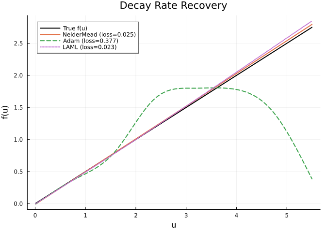
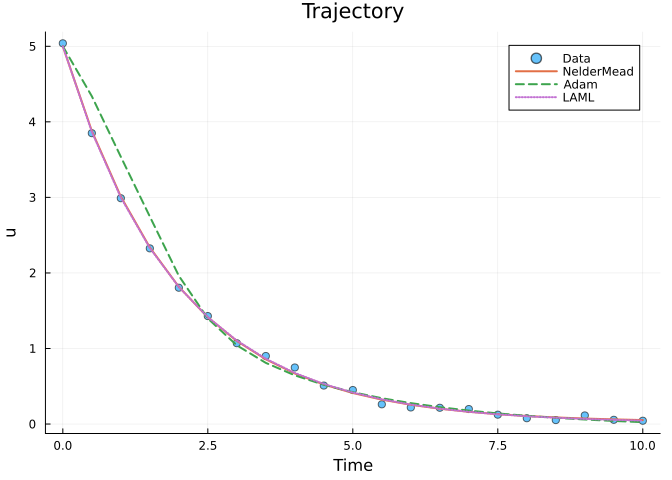
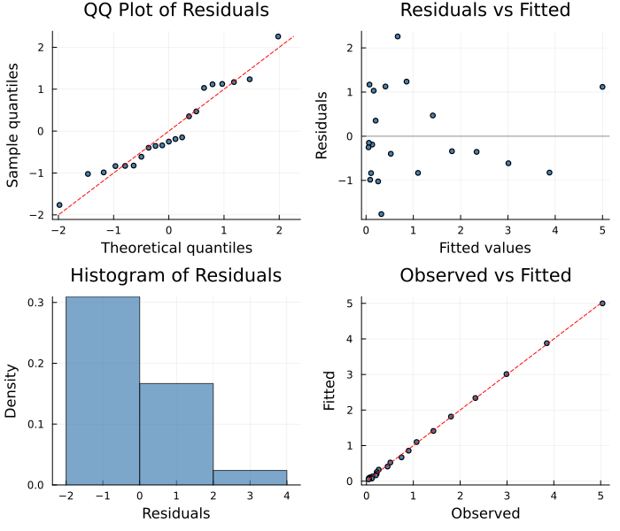

# Derivative-Free Optimization
Simon Frost
2026-06-12

- [Overview](#overview)
- [Exponential Decay with Unknown
  Rate](#exponential-decay-with-unknown-rate)
- [Nelder-Mead vs Adam Comparison](#nelder-mead-vs-adam-comparison)
  - [Recovered Function](#recovered-function)
  - [Trajectory Fit](#trajectory-fit)
- [Particle Swarm for Global Search](#particle-swarm-for-global-search)
- [Diagnostic Plots](#diagnostic-plots)
- [When to Use DerivativeFree](#when-to-use-derivativefree)

## Overview

The `DerivativeFreeSolver` uses gradient-free optimization (Nelder-Mead
or Particle Swarm) to fit partially specified models. This is a **robust
fallback** when gradient-based methods (LAML, Adam) struggle with:

- Stiff or chaotic dynamics that break autodiff
- Non-smooth objectives or discontinuous model behavior
- Poor initial conditions where gradient methods get stuck

The tradeoff is slower convergence — derivative-free methods need more
function evaluations — but they can explore the objective landscape more
broadly.

``` julia
using PartiallySpecifiedModels
using OrdinaryDiffEq
using Plots
using Random
Random.seed!(42)
```

    TaskLocalRNG()

## Exponential Decay with Unknown Rate

A simple model: $du/dt = -f(u)$ where $f(u) = 0.5u$ is unknown.

``` julia
function decay!(du, u, p, t)
    du[1] = -p.f(u[1])
end

sol_true = solve(ODEProblem(decay!, [5.0], (0.0, 10.0), (; f=x -> 0.5*x)),
                 Tsit5(); saveat=0.5)
t_data = collect(sol_true.t)
data_vals = [sol_true.u[i][1] + 0.05 * randn() for i in 1:length(t_data)]
data_matrix = reshape(max.(data_vals, 0.01), :, 1)
```

    21×1 Matrix{Float64}:
     5.039417780080215
     3.8500110179259908
     2.9889635616951553
     2.325167455020758
     1.8042833200179555
     1.4288952108579625
     1.0699970727636061
     0.9004531983252085
     0.7486023017326826
     0.5092902184958961
     ⋮
     0.21926695332322416
     0.21534802822348154
     0.19860836555059358
     0.12404373603521487
     0.07684114721258986
     0.05261060443561179
     0.11401977466247498
     0.056103905895220345
     0.04373891053962077

## Nelder-Mead vs Adam Comparison

``` julia
uf = BSplineApproximator(:f, (0.01, 5.5), 8)

prob = PSMProblem(decay!, [5.0], (0.0, 10.0), [uf];
    data_times=t_data, data_values=Float64.(data_matrix),
    obs_to_state=[1], known_params=NamedTuple())

sol_nm = solve(prob, DerivativeFreeSolver(method=:nelder_mead, maxiters=5000, verbose=false))
sol_adam = solve(prob, AdamSolver(lr=0.01, maxiters=3000, verbose=false))
sol_laml = solve(prob, LAML(maxiters=50, verbose=false))
```

    PSMSolution((f = [-0.00021727753981651764, 0.3882275165410554, 0.7813961659461321, 1.1854425461538902, 1.5985778619674487, 2.017109434546258, 2.437652320922596, 2.8584384329278754]), 0.011686386980311153, 0.02251008579427501, 2.709556252753376, [0.009143695310615707], [5.0; 3.864048043621921; … ; 0.05442994516328753; 0.044793997979212005;;], [5.039417780080215; 3.8500110179259908; … ; 0.056103905895220345; 0.04373891053962077;;], [0.0, 0.5, 1.0, 1.5, 2.0, 2.5, 3.0, 3.5, 4.0, 4.5  …  5.5, 6.0, 6.5, 7.0, 7.5, 8.0, 8.5, 9.0, 9.5, 10.0], Dict{Symbol, Any}(:f => DataInterpolations.CubicSpline{Vector{Float64}, Vector{Float64}, Vector{Float64}, Vector{Float64}, Vector{Float64}, Vector{Float64}, Float64}([-0.00021727753981651764, 0.3882275165410554, 0.7813961659461321, 1.1854425461538902, 1.5985778619674487, 2.017109434546258, 2.437652320922596, 2.8584384329278754], [0.01, 0.7942857142857143, 1.5785714285714285, 2.362857142857143, 3.1471428571428572, 3.9314285714285715, 4.715714285714285, 5.5], Float64[], DataInterpolations.CubicSplineParameterCache{Vector{Float64}}(Float64[], Float64[]), [0.0, 0.7842857142857143, 0.7842857142857143, 0.7842857142857145, 0.7842857142857143, 0.7842857142857143, 0.7842857142857138, 0.7842857142857147], [0.0, 0.006189097558113928, 0.021322204905457273, 0.014628328518919214, 0.008822019252161408, 0.002721093650732584, -8.714055223585355e-5, 0.0], DataInterpolations.ExtrapolationType.Extension, DataInterpolations.ExtrapolationType.Extension, FindFirstFunctions.Guesser{Vector{Float64}}([0.01, 0.7942857142857143, 1.5785714285714285, 2.362857142857143, 3.1471428571428572, 3.9314285714285715, 4.715714285714285, 5.5], Base.RefValue{Int64}(1), true), false, false)), (V_beta = [0.06634377792354483 -0.007384936488259343 … 0.03354015010362868 0.0545298880298961; -0.007384936488259343 0.04717751503785633 … -0.0798009755691921 -0.10795584101134183; … ; 0.03354015010362868 -0.0798009755691921 … 1.5580110922377817 2.381552751006075; 0.0545298880298961 -0.10795584101134183 … 2.381552751006075 4.0381493773198835], sigma2 = 0.00123070200512022))

### Recovered Function

``` julia
f_nm = sol_nm.unknown_functions[:f]
f_adam = sol_adam.unknown_functions[:f]
f_laml = sol_laml.unknown_functions[:f]
u_grid = range(0.01, 5.5, length=100)
f_true(u) = 0.5 * u

p1 = plot(u_grid, f_true.(u_grid), label="True f(u)", lw=2, color=:black,
          xlabel="u", ylabel="f(u)", title="Decay Rate Recovery")
plot!(p1, u_grid, [f_nm(x) for x in u_grid], label="NelderMead (loss=$(round(sol_nm.data_loss, digits=3)))", lw=2)
plot!(p1, u_grid, [f_adam(x) for x in u_grid], label="Adam (loss=$(round(sol_adam.data_loss, digits=3)))", lw=2, ls=:dash)
plot!(p1, u_grid, [f_laml(x) for x in u_grid], label="LAML (loss=$(round(sol_laml.data_loss, digits=3)))", lw=2, ls=:dot)
p1
```



### Trajectory Fit

``` julia
p2 = plot(t_data, data_matrix[:, 1], seriestype=:scatter, label="Data",
          xlabel="Time", ylabel="u", title="Trajectory", ms=4, alpha=0.6)
plot!(p2, t_data, sol_nm.fitted_values[:, 1], label="NelderMead", lw=2)
plot!(p2, t_data, sol_adam.fitted_values[:, 1], label="Adam", lw=2, ls=:dash)
plot!(p2, t_data, sol_laml.fitted_values[:, 1], label="LAML", lw=2, ls=:dot)
p2
```



## Particle Swarm for Global Search

Particle swarm optimization explores more broadly and can escape local
minima:

``` julia
sol_ps = solve(prob, DerivativeFreeSolver(method=:particle_swarm, maxiters=5000,
                                           n_particles=20, verbose=false))
f_ps = sol_ps.unknown_functions[:f]
println("NelderMead: loss=$(round(sol_nm.data_loss, digits=4)), f(3)=$(round(f_nm(3.0), digits=3))")
println("ParticleSwarm: loss=$(round(sol_ps.data_loss, digits=4)), f(3)=$(round(f_ps(3.0), digits=3))")
println("True: f(3)=$(round(f_true(3.0), digits=3))")
```

    NelderMead: loss=0.0249, f(3)=1.519
    ParticleSwarm: loss=43.4949, f(3)=0.52
    True: f(3)=1.5

## Diagnostic Plots

A standard 4-panel diagnostic display assesses residual behaviour. The
QQ plot checks normality of standardized residuals, “Residuals vs
Fitted” detects systematic patterns, the histogram visualises the
residual distribution, and “Observed vs Fitted” checks overall
calibration.

``` julia
using PartiallySpecifiedModels: appraise

diag = appraise(sol_nm)

p_qq = scatter(diag.qq_theoretical, diag.qq_sample,
    xlabel="Theoretical quantiles", ylabel="Sample quantiles",
    title="QQ Plot of Residuals", ms=3, legend=false, color=:steelblue)
mn, mx = extrema(vcat(diag.qq_theoretical, diag.qq_sample))
plot!(p_qq, [mn, mx], [mn, mx], color=:red, ls=:dash, label="")

p_rf = scatter(diag.fitted, diag.residuals,
    xlabel="Fitted values", ylabel="Residuals",
    title="Residuals vs Fitted", ms=3, legend=false, color=:steelblue)
hline!(p_rf, [0], color=:gray, ls=:dot)

p_hist = histogram(diag.residuals, normalize=:pdf,
    xlabel="Residuals", ylabel="Density",
    title="Histogram of Residuals", legend=false, color=:steelblue, alpha=0.7)

p_of = scatter(diag.observed, diag.fitted,
    xlabel="Observed", ylabel="Fitted",
    title="Observed vs Fitted", ms=3, legend=false, color=:steelblue)
mn2, mx2 = extrema(vcat(diag.observed, diag.fitted))
plot!(p_of, [mn2, mx2], [mn2, mx2], color=:red, ls=:dash, label="")

plot(p_qq, p_rf, p_hist, p_of, layout=(2, 2), size=(700, 600))
```



    Durbin-Watson: 2.023

## When to Use DerivativeFree

- **Robustness**: Works when autodiff fails (stiff systems,
  discontinuities)
- **Global search**: Particle swarm can find solutions that gradient
  methods miss
- **No gradients needed**: Useful for complex models where ForwardDiff
  is prohibitively expensive
- **Tradeoff**: Slower convergence — needs 5-10× more function
  evaluations than gradient methods
- Best for **low-dimensional** parameter spaces (\< 50 parameters)
