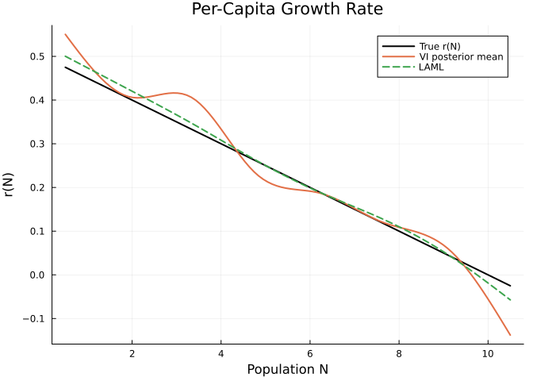
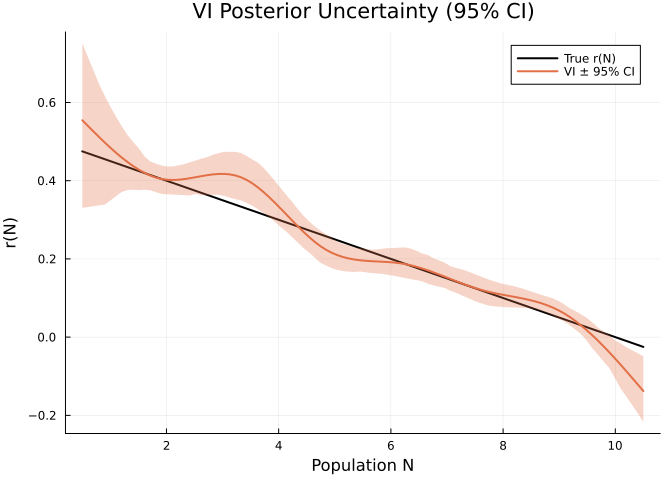
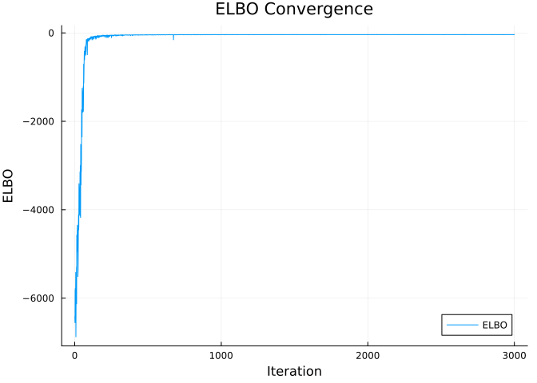
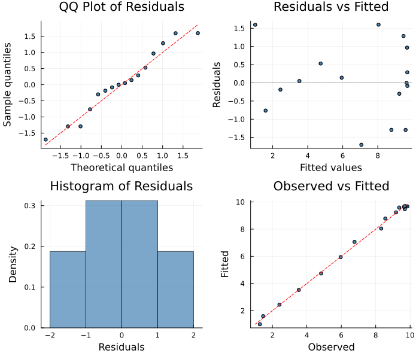

# Variational Inference for PSMs
Simon Frost
2026-04-02

- [Overview](#overview)
- [Logistic Growth with Unknown
  Rate](#logistic-growth-with-unknown-rate)
- [Variational vs LAML Comparison](#variational-vs-laml-comparison)
  - [Posterior Mean vs LAML Estimate](#posterior-mean-vs-laml-estimate)
  - [Posterior Uncertainty Bands](#posterior-uncertainty-bands)
  - [Posterior Standard Deviations](#posterior-standard-deviations)
  - [ELBO Convergence](#elbo-convergence)
  - [Summary](#summary)
- [Diagnostic Plots](#diagnostic-plots)
- [When to Use Variational
  Inference](#when-to-use-variational-inference)

## Overview

The `VariationalSolver` provides **fast approximate Bayesian inference**
using mean-field variational inference (VI). Instead of sampling the
full posterior via MCMC (which can be slow), VI approximates the
posterior $p(\theta|Y)$ with a factored Gaussian:

$$q(\theta) = \prod_i \mathcal{N}(\mu_i, \sigma_i^2)$$

and optimizes the **Evidence Lower Bound (ELBO)**:

$$\text{ELBO}(\phi) = \mathbb{E}_{q_\phi}[\log p(Y|\theta)] - \text{KL}(q_\phi \| p(\theta))$$

using Adam with the reparameterization trick
$\theta_s = \mu + \sigma \odot \epsilon_s$ where
$\epsilon_s \sim \mathcal{N}(0, I)$.

``` julia
using PartiallySpecifiedModels
using OrdinaryDiffEq
using Plots
using Statistics
using Random
Random.seed!(101)
```

    TaskLocalRNG()

## Logistic Growth with Unknown Rate

``` julia
r_true(N) = 0.5 * (1.0 - N / 10.0)

function logistic!(du, u, p, t)
    N = u[1]
    du[1] = p.r(N) * N
end

sol_true = solve(ODEProblem(logistic!, [1.0], (0.0, 15.0), (; r=r_true)),
                 Tsit5(); saveat=1.0)
t_data = collect(sol_true.t)
data_N = [sol_true.u[i][1] + 0.2 * randn() for i in 1:length(t_data)]
data_matrix = reshape(max.(data_N, 0.01), :, 1)
```

    16×1 Matrix{Float64}:
     1.274007414296277
     1.4645379737327895
     2.4093099507399915
     3.5333428841228938
     4.828137394120331
     5.964074176452514
     6.770285162981017
     8.320197574402293
     8.556931479890915
     9.179132164054055
     9.692429469066612
     9.368315794503628
     9.646430195211575
     9.838729183117538
     9.734267115654383
     9.675865210104417

## Variational vs LAML Comparison

``` julia
uf = BSplineApproximator(:r, (0.5, 10.5), 8)

prob = PSMProblem(logistic!, [1.0], (0.0, 15.0), [uf];
    data_times=t_data, data_values=Float64.(data_matrix),
    obs_to_state=[1], known_params=NamedTuple())

sol_vi = solve(prob, VariationalSolver(maxiters=3000, n_elbo_samples=20,
                                        lr=0.005, prior_scale=2.0, verbose=false))
sol_laml = solve(prob, LAML(maxiters=100, verbose=false))
```

    PSMSolution((r = [0.500254022516599, 0.4240836612714384, 0.3458875371216814, 0.26212412058595774, 0.18899618052575792, 0.12728588424876355, 0.04807460794534801, -0.05726857642608684]), 0.2513325676861303, 0.454554178937132, 3.8119996251226893, [0.08205825151061219], [1.0; 1.5826107285535458; … ; 9.737477231760005; 9.745052072148766;;], [1.274007414296277; 1.4645379737327895; … ; 9.734267115654383; 9.675865210104417;;], [0.0, 1.0, 2.0, 3.0, 4.0, 5.0, 6.0, 7.0, 8.0, 9.0, 10.0, 11.0, 12.0, 13.0, 14.0, 15.0], Dict{Symbol, Any}(:r => DataInterpolations.CubicSpline{Vector{Float64}, Vector{Float64}, Vector{Float64}, Vector{Float64}, Vector{Float64}, Vector{Float64}, Float64}([0.500254022516599, 0.4240836612714384, 0.3458875371216814, 0.26212412058595774, 0.18899618052575792, 0.12728588424876355, 0.04807460794534801, -0.05726857642608684], [0.5, 1.9285714285714286, 3.357142857142857, 4.785714285714286, 6.214285714285714, 7.642857142857143, 9.071428571428571, 10.5], Float64[], DataInterpolations.CubicSplineParameterCache{Vector{Float64}}(Float64[], Float64[]), [0.0, 1.4285714285714286, 1.4285714285714286, 1.4285714285714284, 1.4285714285714288, 1.4285714285714288, 1.428571428571428, 1.4285714285714288], [0.0, -3.644038908933067e-5, -0.005809981383155891, 0.006908526306970738, 0.009444176993313142, -0.01111736155759931, -0.01642761204059432, 0.0], DataInterpolations.ExtrapolationType.Extension, DataInterpolations.ExtrapolationType.Extension, FindFirstFunctions.Guesser{Vector{Float64}}([0.5, 1.9285714285714286, 3.357142857142857, 4.785714285714286, 6.214285714285714, 7.642857142857143, 9.071428571428571, 10.5], Base.RefValue{Int64}(1), true), false, false)), nothing)

### Posterior Mean vs LAML Estimate

``` julia
r_vi = sol_vi.unknown_functions[:r]
r_laml = sol_laml.unknown_functions[:r]
N_grid = range(0.5, 10.5, length=100)

p1 = plot(N_grid, r_true.(N_grid), label="True r(N)", lw=2, color=:black,
          xlabel="Population N", ylabel="r(N)", title="Per-Capita Growth Rate")
plot!(p1, N_grid, [r_vi(n) for n in N_grid], label="VI posterior mean", lw=2)
plot!(p1, N_grid, [r_laml(n) for n in N_grid], label="LAML", lw=2, ls=:dash)
p1
```



### Posterior Uncertainty Bands

The variational solver provides posterior standard deviations for each
spline coefficient. We can draw posterior samples to visualize pointwise
uncertainty:

``` julia
post_mu = sol_vi.convergence[:posterior_mean]
post_std = sol_vi.convergence[:posterior_std]

n_samples = 200
N_plot = collect(range(0.5, 10.5, length=100))
r_samples = zeros(n_samples, length(N_plot))
mesh = collect(range(0.5, 10.5, length=length(post_mu)))
for s in 1:n_samples
    beta_s = post_mu .+ post_std .* randn(length(post_mu))
    itp = PartiallySpecifiedModels.build_bspline_evaluator(mesh, beta_s)
    for (j, n) in enumerate(N_plot)
        r_samples[s, j] = itp(n)
    end
end

r_lo = [quantile(r_samples[:, j], 0.025) for j in 1:length(N_plot)]
r_hi = [quantile(r_samples[:, j], 0.975) for j in 1:length(N_plot)]
r_mean = [mean(r_samples[:, j]) for j in 1:length(N_plot)]

p2 = plot(N_plot, r_true.(N_plot), label="True r(N)", lw=2, color=:black,
          xlabel="Population N", ylabel="r(N)", title="VI Posterior Uncertainty (95% CI)")
plot!(p2, N_plot, r_mean, ribbon=(r_mean .- r_lo, r_hi .- r_mean),
      fillalpha=0.3, label="VI ± 95% CI", lw=2)
p2
```



Note how the uncertainty bands are narrowest in the mid-range (N ≈ 2–7)
where the trajectory is most dynamic and data is most informative about
the per-capita rate. Near carrying capacity (N ≈ 10), the bands widen
considerably — this is correct Bayesian behavior because
`dN/dt = r(N)·N ≈ 0` when N is near K, making r(N) weakly identified
from trajectory data alone.

### Posterior Standard Deviations

``` julia
println("Posterior standard deviations per spline coefficient:")
for i in 1:length(post_std)
    println("  β[$i]: μ=$(round(post_mu[i], digits=3)) ± $(round(post_std[i], digits=3))")
end
println("\nThe last coefficients (controlling r(N) near carrying capacity)")
println("have the largest uncertainty — reflecting weak identifiability.")
```

    Posterior standard deviations per spline coefficient:
      β[1]: μ=0.55 ± 0.098
      β[2]: μ=0.408 ± 0.019
      β[3]: μ=0.405 ± 0.034
      β[4]: μ=0.232 ± 0.021
      β[5]: μ=0.187 ± 0.019
      β[6]: μ=0.12 ± 0.017
      β[7]: μ=0.062 ± 0.012
      β[8]: μ=-0.138 ± 0.044

    The last coefficients (controlling r(N) near carrying capacity)
    have the largest uncertainty — reflecting weak identifiability.

### ELBO Convergence

``` julia
if haskey(sol_vi.convergence, :elbo_history)
    elbo_hist = sol_vi.convergence[:elbo_history]
    p3 = plot(elbo_hist, label="ELBO", xlabel="Iteration", ylabel="ELBO",
              title="ELBO Convergence", lw=1)
    p3
end
```



### Summary

``` julia
println("VI:   loss=$(round(sol_vi.data_loss, digits=3)), edf=$(round(sol_vi.edf, digits=1)), " *
        "r(5)=$(round(r_vi(5.0), digits=3))")
println("LAML: loss=$(round(sol_laml.data_loss, digits=3)), edf=$(round(sol_laml.edf, digits=1)), " *
        "r(5)=$(round(r_laml(5.0), digits=3))")
println("True: r(5)=$(round(r_true(5.0), digits=3))")
```

    VI:   loss=0.504, edf=8.0, r(5)=0.215
    LAML: loss=0.455, edf=3.8, r(5)=0.25
    True: r(5)=0.25

## Diagnostic Plots

A standard 4-panel diagnostic display assesses residual behaviour. The
QQ plot checks normality of standardized residuals, “Residuals vs
Fitted” detects systematic patterns, the histogram visualises the
residual distribution, and “Observed vs Fitted” checks overall
calibration.

``` julia
using PartiallySpecifiedModels: appraise

diag = appraise(sol_vi)

p_qq = scatter(diag.qq_theoretical, diag.qq_sample,
    xlabel="Theoretical quantiles", ylabel="Sample quantiles",
    title="QQ Plot of Residuals", ms=3, legend=false, color=:steelblue)
mn, mx = extrema(vcat(diag.qq_theoretical, diag.qq_sample))
plot!(p_qq, [mn, mx], [mn, mx], color=:red, ls=:dash, label="")

p_rf = scatter(diag.fitted, diag.residuals,
    xlabel="Fitted values", ylabel="Residuals",
    title="Residuals vs Fitted", ms=3, legend=false, color=:steelblue)
hline!(p_rf, [0], color=:gray, ls=:dot)

p_hist = histogram(diag.residuals, normalize=:pdf,
    xlabel="Residuals", ylabel="Density",
    title="Histogram of Residuals", legend=false, color=:steelblue, alpha=0.7)

p_of = scatter(diag.observed, diag.fitted,
    xlabel="Observed", ylabel="Fitted",
    title="Observed vs Fitted", ms=3, legend=false, color=:steelblue)
mn2, mx2 = extrema(vcat(diag.observed, diag.fitted))
plot!(p_of, [mn2, mx2], [mn2, mx2], color=:red, ls=:dash, label="")

plot(p_qq, p_rf, p_hist, p_of, layout=(2, 2), size=(700, 600))
```



    Durbin-Watson: 2.679

## When to Use Variational Inference

- **Speed**: 10-100× faster than MCMC for uncertainty quantification
- **Scalability**: Works well with many parameters (unlike MCMC which
  mixes slowly)
- **Uncertainty**: Provides approximate posterior std for each parameter
  — correctly wider in data-sparse regions
- **Tradeoff**: Mean-field assumption underestimates posterior
  correlations; posterior mean can oscillate where the function is
  weakly identified (near carrying capacity in this example)
- Best when you need **quick uncertainty estimates** rather than exact
  posterior samples
