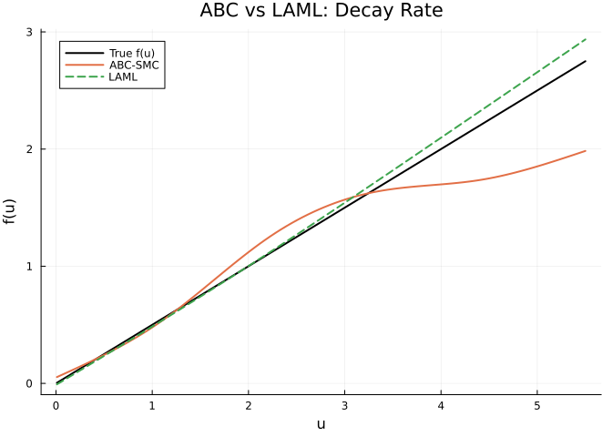
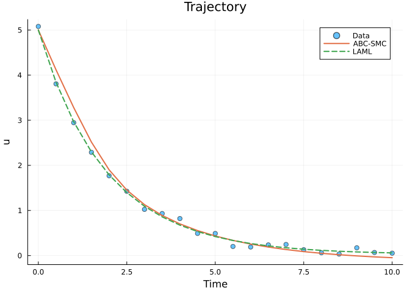
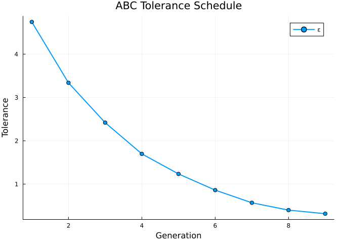
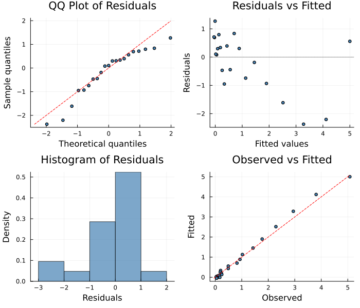

# Likelihood-Free Inference with ABC-SMC
Simon Frost
2026-06-12

- [Overview](#overview)
- [Exponential Decay with Unknown
  Rate](#exponential-decay-with-unknown-rate)
- [ABC-SMC Fit](#abc-smc-fit)
  - [Recovered Function](#recovered-function)
  - [Trajectory Fit](#trajectory-fit)
  - [Tolerance Schedule](#tolerance-schedule)
  - [Summary](#summary)
- [Diagnostic Plots](#diagnostic-plots)
- [When to Use ABC](#when-to-use-abc)

## Overview

The `ABCSolver` implements **Approximate Bayesian Computation with
Sequential Monte Carlo** (ABC-SMC), a likelihood-free inference method.
Instead of evaluating a likelihood function, ABC:

1.  Samples parameter proposals from a prior (or previous generation)
2.  Simulates the model forward with each proposal
3.  Compares simulated data to observed data using a **summary
    statistic** (e.g., RMSE)
4.  Accepts proposals whose simulations are sufficiently close to the
    data

ABC-SMC refines the tolerance $\epsilon$ over generations, progressively
concentrating particles near the posterior.

``` julia
using PartiallySpecifiedModels
using OrdinaryDiffEq
using Plots
using Statistics
using Random
Random.seed!(42)
```

    TaskLocalRNG()

## Exponential Decay with Unknown Rate

``` julia
function decay!(du, u, p, t)
    du[1] = -p.f(u[1])
end

sol_true = solve(ODEProblem(decay!, [5.0], (0.0, 10.0), (; f=x -> 0.5*x)),
                 Tsit5(); saveat=0.5)
t_data = collect(sol_true.t)
data_vals = [sol_true.u[i][1] + 0.1 * randn() for i in 1:length(t_data)]
data_matrix = reshape(max.(data_vals, 0.01), :, 1)
```

    21×1 Matrix{Float64}:
     5.078835560160429
     3.806018088128271
     2.945273887584674
     2.2885047067990136
     1.7691735600800715
     1.4252661174556691
     1.0243509034466096
     0.9320342398810462
     0.8205364655182532
     0.4915817263273738
     ⋮
     0.18959720135788585
     0.23682834647207912
     0.2462247887066572
     0.13050069661823208
     0.06210245253453309
     0.033897182674689066
     0.17249536167482693
     0.06894633070068673
     0.053785164971568336

## ABC-SMC Fit

``` julia
uf = BSplineApproximator(:f, (0.01, 5.5), 6)

prob = PSMProblem(decay!, [5.0], (0.0, 10.0), [uf];
    data_times=t_data, data_values=Float64.(data_matrix),
    obs_to_state=[1], known_params=NamedTuple())

sol_abc = solve(prob, ABCSolver(n_particles=500, n_generations=10,
                                 prior_scale=2.0, verbose=false))
sol_laml = solve(prob, LAML(maxiters=50, verbose=false))
```

    PSMSolution((f = [-0.00836736583109984, 0.5405349500371419, 1.1120205335085238, 1.7090645032172862, 2.3183206291603407, 2.9297974239626074]), 0.047293354787519934, 0.0919434080378219, 2.5187068189569053, [0.014324814510001675], [5.0; 3.8428626852614487; … ; 0.06915856309886924; 0.05987317122363067;;], [5.078835560160429; 3.806018088128271; … ; 0.06894633070068673; 0.053785164971568336;;], [0.0, 0.5, 1.0, 1.5, 2.0, 2.5, 3.0, 3.5, 4.0, 4.5  …  5.5, 6.0, 6.5, 7.0, 7.5, 8.0, 8.5, 9.0, 9.5, 10.0], Dict{Symbol, Any}(:f => DataInterpolations.CubicSpline{Vector{Float64}, Vector{Float64}, Vector{Float64}, Vector{Float64}, Vector{Float64}, Vector{Float64}, Float64}([-0.00836736583109984, 0.5405349500371419, 1.1120205335085238, 1.7090645032172862, 2.3183206291603407, 2.9297974239626074], [0.01, 1.108, 2.206, 3.304, 4.402, 5.5], Float64[], DataInterpolations.CubicSplineParameterCache{Vector{Float64}}(Float64[], Float64[]), [0.0, 1.098, 1.0979999999999999, 1.0979999999999999, 1.0980000000000003, 1.0979999999999999], [0.0, 0.02209573988738384, 0.024008510301959423, 0.009068135819688353, 0.000495899221161383, 0.0], DataInterpolations.ExtrapolationType.Extension, DataInterpolations.ExtrapolationType.Extension, FindFirstFunctions.Guesser{Vector{Float64}}([0.01, 1.108, 2.206, 3.304, 4.402, 5.5], Base.RefValue{Int64}(1), true), false, false)), (V_beta = [0.04122102788938971 -0.013721922774739671 … 0.06202606745093546 0.10982717532994053; -0.013721922774739671 0.06094590886668673 … -0.09789676365438492 -0.17528244453129957; … ; 0.06202606745093546 -0.09789676365438492 … 0.9681800864521124 1.6653556886526626; 0.10982717532994053 -0.17528244453129957 … 1.6653556886526626 3.4364761696437442], sigma2 = 0.004974944509409733))

### Recovered Function

``` julia
f_abc = sol_abc.unknown_functions[:f]
f_laml = sol_laml.unknown_functions[:f]
f_true(u) = 0.5 * u
u_grid = range(0.01, 5.5, length=100)

p1 = plot(u_grid, f_true.(u_grid), label="True f(u)", lw=2, color=:black,
          xlabel="u", ylabel="f(u)", title="ABC vs LAML: Decay Rate")
plot!(p1, u_grid, [f_abc(x) for x in u_grid], label="ABC-SMC", lw=2)
plot!(p1, u_grid, [f_laml(x) for x in u_grid], label="LAML", lw=2, ls=:dash)
p1
```



Note that ABC-SMC may underestimate f(u) at high u values (near u=5).
This is expected: in exponential decay, the trajectory passes through
high u values very quickly (only at the start), providing little data to
constrain f there. ABC-SMC, being a sampling method with finite
particles, struggles to pin down regions of the parameter space that
weakly influence the trajectory. LAML, using gradient-based optimization
and automatic smoothing, extrapolates more effectively from the
data-rich low-u region.

### Trajectory Fit

``` julia
p2 = plot(t_data, data_matrix[:, 1], seriestype=:scatter, label="Data",
          xlabel="Time", ylabel="u", title="Trajectory", ms=4, alpha=0.6)
plot!(p2, t_data, sol_abc.fitted_values[:, 1], label="ABC-SMC", lw=2)
plot!(p2, t_data, sol_laml.fitted_values[:, 1], label="LAML", lw=2, ls=:dash)
p2
```



### Tolerance Schedule

``` julia
if haskey(sol_abc.convergence, :tolerance_history)
    eps_hist = sol_abc.convergence[:tolerance_history]
    p3 = plot(1:length(eps_hist), eps_hist, label="ε", xlabel="Generation",
              ylabel="Tolerance", title="ABC Tolerance Schedule", lw=2, marker=:circle)
    p3
end
```



### Summary

``` julia
println("ABC:  loss=$(round(sol_abc.data_loss, digits=4)), f(3)=$(round(f_abc(3.0), digits=3))")
println("LAML: loss=$(round(sol_laml.data_loss, digits=4)), f(3)=$(round(f_laml(3.0), digits=3))")
println("True: f(3)=$(round(f_true(3.0), digits=3))")
if haskey(sol_abc.convergence, :n_accepted)
    println("ABC accepted: $(sol_abc.convergence[:n_accepted]) / $(sol_abc.convergence[:n_total]) particles")
end
```

    ABC:  loss=0.0195, f(3)=1.568
    LAML: loss=0.0919, f(3)=1.542
    True: f(3)=1.5

## Diagnostic Plots

A standard 4-panel diagnostic display assesses residual behaviour. The
QQ plot checks normality of standardized residuals, “Residuals vs
Fitted” detects systematic patterns, the histogram visualises the
residual distribution, and “Observed vs Fitted” checks overall
calibration.

``` julia
using PartiallySpecifiedModels: appraise

diag = appraise(sol_abc)

p_qq = scatter(diag.qq_theoretical, diag.qq_sample,
    xlabel="Theoretical quantiles", ylabel="Sample quantiles",
    title="QQ Plot of Residuals", ms=3, legend=false, color=:steelblue)
mn, mx = extrema(vcat(diag.qq_theoretical, diag.qq_sample))
plot!(p_qq, [mn, mx], [mn, mx], color=:red, ls=:dash, label="")

p_rf = scatter(diag.fitted, diag.residuals,
    xlabel="Fitted values", ylabel="Residuals",
    title="Residuals vs Fitted", ms=3, legend=false, color=:steelblue)
hline!(p_rf, [0], color=:gray, ls=:dot)

p_hist = histogram(diag.residuals, normalize=:pdf,
    xlabel="Residuals", ylabel="Density",
    title="Histogram of Residuals", legend=false, color=:steelblue, alpha=0.7)

p_of = scatter(diag.observed, diag.fitted,
    xlabel="Observed", ylabel="Fitted",
    title="Observed vs Fitted", ms=3, legend=false, color=:steelblue)
mn2, mx2 = extrema(vcat(diag.observed, diag.fitted))
plot!(p_of, [mn2, mx2], [mn2, mx2], color=:red, ls=:dash, label="")

plot(p_qq, p_rf, p_hist, p_of, layout=(2, 2), size=(700, 600))
```



    Durbin-Watson: 0.883

## When to Use ABC

- **Likelihood-free**: Works when the likelihood function is unavailable
  or intractable
- **Robust**: No gradients needed — handles any model that can be
  simulated
- **Flexible summary statistics**: Can encode domain knowledge about
  what aspects of the data matter
- **Tradeoff**: Computationally expensive (many simulations), less
  efficient than gradient-based methods
- Best for **complex simulators** where analytic likelihoods don’t exist
