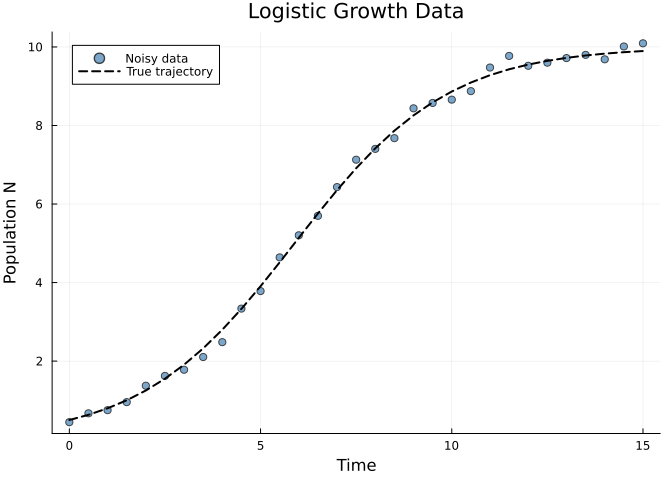
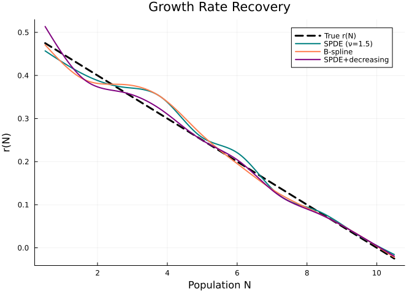
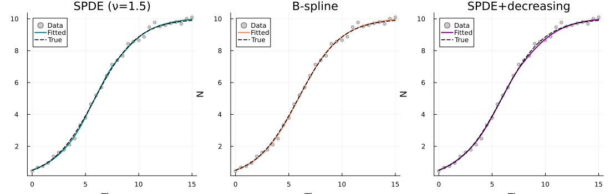
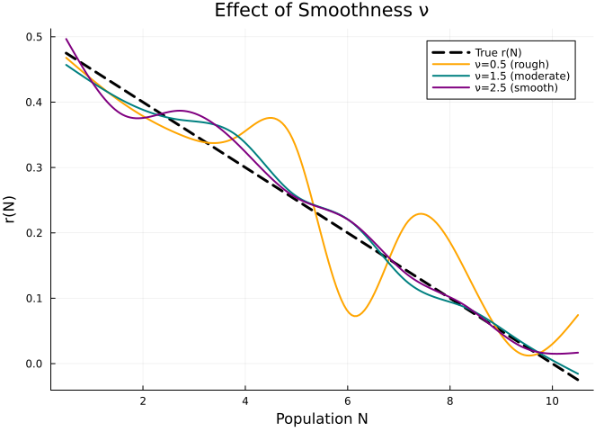
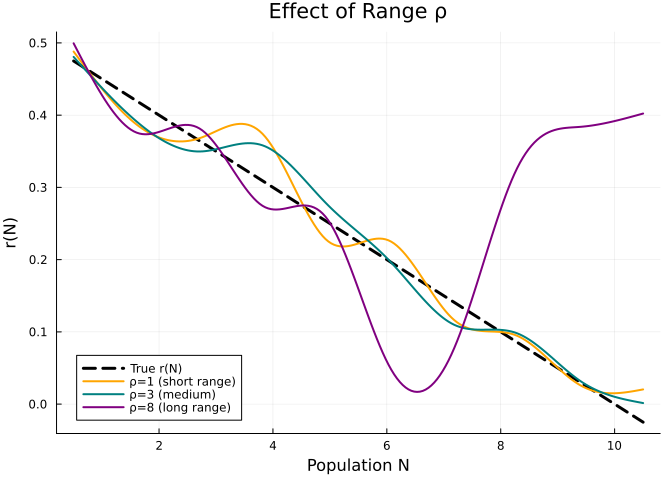
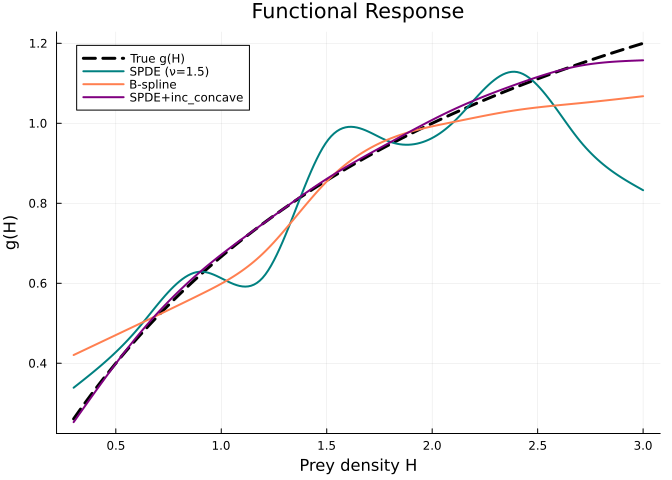
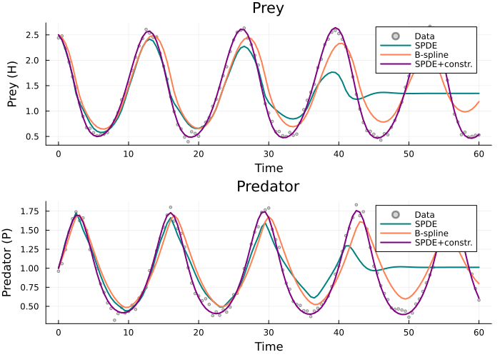
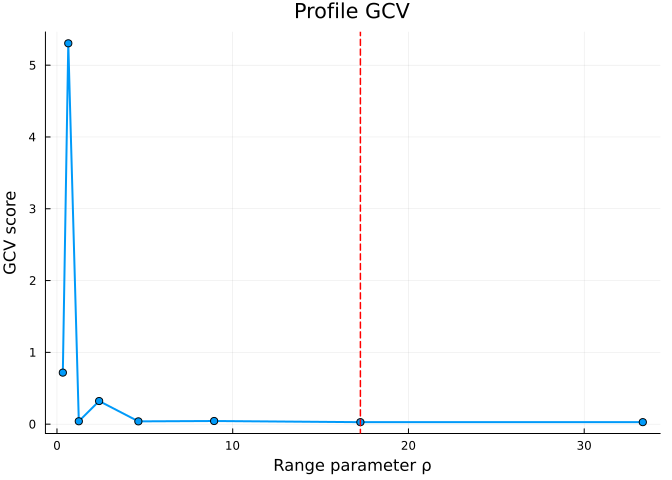
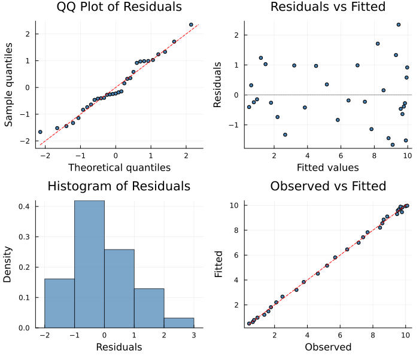

# Matérn SPDE Approximator
Simon Frost
2026-04-02

- [Overview](#overview)
- [Logistic Growth with Unknown Growth
  Rate](#logistic-growth-with-unknown-growth-rate)
  - [Observed Data](#observed-data)
- [Fitting with SPDE vs B-Spline](#fitting-with-spde-vs-b-spline)
  - [Recovered Growth Rate](#recovered-growth-rate)
  - [Fitted Trajectories](#fitted-trajectories)
- [Effect of Smoothness Parameter
  $\nu$](#effect-of-smoothness-parameter-nu)
- [Effect of Range Parameter $\rho$](#effect-of-range-parameter-rho)
- [Lotka-Volterra with SPDE](#lotka-volterra-with-spde)
  - [Functional Response Recovery](#functional-response-recovery)
  - [Fitted Trajectories](#fitted-trajectories-1)
- [Comparison Table](#comparison-table)
- [Profile Range Optimization](#profile-range-optimization)
- [Diagnostic Plots](#diagnostic-plots)
- [When to Use SPDEApproximator](#when-to-use-spdeapproximator)
- [References](#references)

## Overview

The `SPDEApproximator` represents unknown functions using a **Matérn
SPDE penalty** derived from the stochastic partial differential equation
(Lindgren et al. 2011):

$$(\kappa^2 - \Delta)^{\alpha/2} \, \tau \, u(x) = \mathcal{W}(x)$$

where $\mathcal{W}$ is Gaussian white noise. This gives a smoothing
penalty equivalent to placing a **Matérn Gaussian process prior** on the
unknown function, but computed via sparse finite element matrices rather
than dense covariance matrices.

The key parameters are:

- **Smoothness** $\nu$: controls differentiability ($\nu = 0.5$: rough,
  $\nu = 1.5$: moderate, $\nu = 2.5$: smooth)
- **Range** $\rho = \sqrt{8\nu}/\kappa$: the correlation length — how
  far apart inputs must be before function values become approximately
  uncorrelated

Unlike the B-spline penalty ($\int f''(x)^2 \, dx$), the Matérn SPDE
penalty has a **physically interpretable range parameter** and offers
control over smoothness class.

``` julia
using PartiallySpecifiedModels
using OrdinaryDiffEq
using Plots; default(fmt=:png)
using Random
Random.seed!(42)
```

    Precompiling packages...
      13472.1 ms  ✓ PartiallySpecifiedModels
      1 dependency successfully precompiled in 19 seconds. 387 already precompiled.

    TaskLocalRNG()

## Logistic Growth with Unknown Growth Rate

We fit a logistic growth model where the per-capita growth rate $r(N)$
is unknown:

$$\frac{dN}{dt} = r(N) \cdot N$$

The true growth rate is $r(N) = r_0(1 - N/K)$ with $r_0 = 0.5$ and
$K = 10$.

``` julia
r_true(N) = 0.5 * (1.0 - N / 10.0)

function logistic!(du, u, p, t)
    du[1] = p.r(u[1]) * u[1]
end

sol_true = solve(ODEProblem(logistic!, [0.5], (0.0, 15.0), (; r=r_true)),
                 Tsit5(); saveat=0.5)
t_data = collect(sol_true.t)
data_clean = [sol_true.u[i][1] for i in 1:length(t_data)]
data_noisy = max.(data_clean .+ 0.15 * randn(length(t_data)), 0.01)
data_matrix = reshape(data_noisy, :, 1);
```

### Observed Data

<div id="fig-data">



Figure 1: Simulated logistic growth data

</div>

## Fitting with SPDE vs B-Spline

We compare the SPDE approximator (Matérn 3/2 penalty) against the
standard B-spline approximator (integrated squared second derivative
penalty), and a shape-constrained SPDE with a `:decreasing` constraint —
since we know the per-capita growth rate must decrease with population
size.

``` julia
uf_spde = SPDEApproximator(:r, (0.5, 10.5), 10; nu=1.5, initial=x -> 0.3)
uf_bspline = BSplineApproximator(:r, (0.5, 10.5), 10; initial=x -> 0.3)
uf_scspde = ShapeConstrainedSPDEApproximator(:r, (0.5, 10.5), 10, :decreasing;
    nu=1.5, initial=x -> 0.3)

prob_spde = PSMProblem(logistic!, [0.5], (0.0, 15.0), [uf_spde];
    data_times=t_data, data_values=data_matrix,
    obs_to_state=[1], known_params=NamedTuple(),
    likelihood=PartiallySpecifiedModels.Gaussian())

prob_bspline = PSMProblem(logistic!, [0.5], (0.0, 15.0), [uf_bspline];
    data_times=t_data, data_values=data_matrix,
    obs_to_state=[1], known_params=NamedTuple(),
    likelihood=PartiallySpecifiedModels.Gaussian())

prob_scspde = PSMProblem(logistic!, [0.5], (0.0, 15.0), [uf_scspde];
    data_times=t_data, data_values=data_matrix,
    obs_to_state=[1], known_params=NamedTuple(),
    likelihood=PartiallySpecifiedModels.Gaussian())

sol_spde = solve(prob_spde, LAML(maxiters=100, verbose=false));
sol_bspline = solve(prob_bspline, LAML(maxiters=100, verbose=false));
sol_scspde = solve(prob_scspde, LAML(maxiters=100, verbose=false));
```

### Recovered Growth Rate

<div id="fig-growth-rate">



Figure 2: Recovered r(N): SPDE vs B-spline vs constrained SPDE

</div>

### Fitted Trajectories

<div id="fig-trajectories">



Figure 3: Fitted trajectories: SPDE vs B-spline vs constrained SPDE

</div>

## Effect of Smoothness Parameter $\nu$

The Matérn smoothness $\nu$ controls the differentiability of the fitted
function. Lower values give rougher fits; higher values give smoother
fits.

``` julia
sols = Dict{Float64, Any}()
for ν in [0.5, 1.5, 2.5]
    uf = SPDEApproximator(:r, (0.5, 10.5), 10; nu=ν, initial=x -> 0.3)
    prob = PSMProblem(logistic!, [0.5], (0.0, 15.0), [uf];
        data_times=t_data, data_values=data_matrix,
        obs_to_state=[1], known_params=NamedTuple(),
        likelihood=PartiallySpecifiedModels.Gaussian())
    sols[ν] = solve(prob, LAML(maxiters=100, verbose=false))
end
```

<div id="fig-smoothness">



Figure 4: Effect of Matérn smoothness ν on recovered growth rate

</div>

## Effect of Range Parameter $\rho$

The range parameter $\rho$ controls the correlation length. Smaller
ranges allow more local variation; larger ranges enforce longer-range
smoothness.

``` julia
domain_width = 10.0
sols_range = Dict{Float64, Any}()
for ρ in [1.0, 3.0, 8.0]
    uf = SPDEApproximator(:r, (0.5, 10.5), 10; nu=1.5, range_param=ρ, initial=x -> 0.3)
    prob = PSMProblem(logistic!, [0.5], (0.0, 15.0), [uf];
        data_times=t_data, data_values=data_matrix,
        obs_to_state=[1], known_params=NamedTuple(),
        likelihood=PartiallySpecifiedModels.Gaussian())
    sols_range[ρ] = solve(prob, LAML(maxiters=100, verbose=false))
end
```

<div id="fig-range">



Figure 5: Effect of range parameter ρ on recovered growth rate

</div>

## Lotka-Volterra with SPDE

The SPDE approximator also works in multi-variable systems. Here we fit
a Rosenzweig-MacArthur predator-prey model with an unknown Holling Type
II functional response. The parameters are chosen to produce sustained
limit-cycle oscillations (H\*/K ≈ 0.25, past the Hopf bifurcation), so
that prey density H spans a range from ~0.5 to ~2.6 — providing good
coverage for identifying g(H).

``` julia
g_true(H) = H / (1.0 + 0.5 * H)

function lv!(du, u, p, t)
    H, P = u
    du[1] = 0.8 * H * (1.0 - H / 5.0) - p.g(H) * P
    du[2] = 0.9 * p.g(H) * P - 0.7 * P
end

sol_lv = solve(ODEProblem(lv!, [2.5, 1.0], (0.0, 60.0), (; g=g_true)),
               Tsit5(); saveat=0.5)
t_lv = collect(sol_lv.t)
data_H = [sol_lv.u[i][1] + 0.05 * randn() for i in 1:length(t_lv)]
data_P = [sol_lv.u[i][2] + 0.05 * randn() for i in 1:length(t_lv)]
data_lv = hcat(max.(data_H, 0.01), max.(data_P, 0.01));
```

``` julia
uf_lv_spde = SPDEApproximator(:g, (0.3, 3.0), 10; nu=1.5, initial=x -> 0.3)
uf_lv_bspline = BSplineApproximator(:g, (0.3, 3.0), 10; initial=x -> 0.3)
uf_lv_scspde = ShapeConstrainedSPDEApproximator(:g, (0.3, 3.0), 10, :inc_concave;
    nu=1.5, initial=x -> 0.2)

prob_lv_spde = PSMProblem(lv!, [2.5, 1.0], (0.0, 60.0), [uf_lv_spde];
    data_times=t_lv, data_values=Float64.(data_lv),
    obs_to_state=[1, 2], known_params=NamedTuple(),
    likelihood=PartiallySpecifiedModels.Gaussian())

prob_lv_bspline = PSMProblem(lv!, [2.5, 1.0], (0.0, 60.0), [uf_lv_bspline];
    data_times=t_lv, data_values=Float64.(data_lv),
    obs_to_state=[1, 2], known_params=NamedTuple(),
    likelihood=PartiallySpecifiedModels.Gaussian())

prob_lv_scspde = PSMProblem(lv!, [2.5, 1.0], (0.0, 60.0), [uf_lv_scspde];
    data_times=t_lv, data_values=Float64.(data_lv),
    obs_to_state=[1, 2], known_params=NamedTuple(),
    likelihood=PartiallySpecifiedModels.Gaussian())

sol_lv_spde = solve(prob_lv_spde, LAML(maxiters=100, verbose=false));
sol_lv_bspline = solve(prob_lv_bspline, LAML(maxiters=100, verbose=false, initial_lambda=0.1));
sol_lv_scspde = solve(prob_lv_scspde, LAML(maxiters=100, verbose=false));
```

### Functional Response Recovery

<div id="fig-lv-functional-response">



Figure 6: Recovered functional response g(H): SPDE vs B-spline vs
constrained SPDE

</div>

### Fitted Trajectories

<div id="fig-lv-trajectories">



Figure 7: Fitted Lotka-Volterra trajectories

</div>

## Comparison Table

| Approximator            | Data Loss | Objective |
|:------------------------|----------:|----------:|
| SPDE (ν=1.5)            |    0.5442 |    0.3992 |
| SPDE+decreasing         |    0.7013 |    0.5491 |
| B-spline                |    0.5993 |    0.3198 |
| SPDE (ν=0.5)            |    3.0169 |    1.9668 |
| SPDE (ν=1.5)            |    0.5442 |    0.3992 |
| SPDE (ν=2.5)            |    0.5716 |    0.4208 |
| SPDE+inc_concave (LV)   |    0.6271 |    0.3306 |
| SPDE unconstrained (LV) |   39.5411 |   20.8569 |
| B-spline (LV)           |   14.8047 |    7.5429 |

## Profile Range Optimization

The SPDE range parameter $\rho$ controls the Matérn correlation length
and is fixed by default at $1/3$ of the domain width. We can optimize it
via profile GCV — running LAML for a grid of $\rho$ values and selecting
the one with the lowest Generalized Cross-Validation score.

``` julia
result = optimize_spde_range(prob_spde, LAML(maxiters=100, verbose=false);
    n_grid=8, verbose=true)
```

      range= 0.333 (×0.10): GCV=0.7178, loss=10.4074, edf=9.8
      range= 0.644 (×0.19): GCV=5.3047, loss=104.9043, edf=6.2
      range= 1.243 (×0.37): GCV=0.0402, loss=0.5770, edf=9.9
      range= 2.399 (×0.72): GCV=0.3220, loss=4.9144, edf=9.2
      range= 4.632 (×1.39): GCV=0.0389, loss=0.5759, edf=9.6
      range= 8.942 (×2.68): GCV=0.0438, loss=0.6284, edf=9.9
      range=17.265 (×5.18): GCV=0.0277, loss=0.5876, edf=5.4
      range=33.333 (×10.00): GCV=0.0280, loss=0.5921, edf=5.4
    Best range=17.265, GCV=0.0277

    (solution = PSMSolution((r = [0.4329249113296453, 0.4165806144920535, 0.38589235554332635, 0.3360729352253334, 0.26920213351244465, 0.2010294085158498, 0.13604961046208544, 0.0834491109514167, 0.030156816345978853, 0.003019551284145332]), 0.35327768447130853, 0.5876063073537875, 5.361806483547311, [21.207136126689708], [0.5; 0.6206177607654114; … ; 9.972747093866502; 10.035372867378907;;], [0.4454963777822334; 0.6707835637706556; … ; 10.011521386502283; 10.092491865779015;;], [0.0, 0.5, 1.0, 1.5, 2.0, 2.5, 3.0, 3.5, 4.0, 4.5  …  10.5, 11.0, 11.5, 12.0, 12.5, 13.0, 13.5, 14.0, 14.5, 15.0], Dict{Symbol, Any}(:r => DataInterpolations.CubicSpline{Vector{Float64}, Vector{Float64}, Vector{Float64}, Vector{Float64}, Vector{Float64}, Vector{Float64}, Float64}([0.4329249113296453, 0.4165806144920535, 0.38589235554332635, 0.3360729352253334, 0.26920213351244465, 0.2010294085158498, 0.13604961046208544, 0.0834491109514167, 0.030156816345978853, 0.003019551284145332], [0.5, 1.6111111111111112, 2.7222222222222223, 3.8333333333333335, 4.944444444444445, 6.055555555555555, 7.166666666666667, 8.277777777777779, 9.38888888888889, 10.5], Float64[], DataInterpolations.CubicSplineParameterCache{Vector{Float64}}(Float64[], Float64[]), [0.0, 1.1111111111111112, 1.1111111111111112, 1.1111111111111112, 1.1111111111111112, 1.1111111111111107, 1.1111111111111116, 1.1111111111111116, 1.1111111111111107, 1.1111111111111107], [0.0, -0.013569615880673938, -0.015433192337422387, -0.01767505902426824, 0.003263714855301945, -0.001707147555751418, 0.01908250030986018, -0.014459462764244669, 0.03539322658654044, 0.0], DataInterpolations.ExtrapolationType.Extension, DataInterpolations.ExtrapolationType.Extension, FindFirstFunctions.Guesser{Vector{Float64}}([0.5, 1.6111111111111112, 2.7222222222222223, 3.8333333333333335, 4.944444444444445, 6.055555555555555, 7.166666666666667, 8.277777777777779, 9.38888888888889, 10.5], Base.RefValue{Int64}(1), true), false, false)), nothing), range_param = 17.264915597437376, gcv_scores = [0.7177847116159232, 5.304685671444911, 0.04020424571563397, 0.3219618492051896, 0.038871507933077046, 0.04384018857155922, 0.027712346475711795, 0.027952285583038975], range_values = [0.3333333333333334, 0.6435659096277502, 1.2425312401049804, 2.398952243337174, 4.63165164791046, 8.942319317599088, 17.264915597437376, 33.33333333333334])

<div id="fig-profile-range">



Figure 8: Profile GCV over SPDE range parameter

</div>

The optimized range parameter is $\rho = 17\.26$ with data loss 0.5876
(vs 0.5442 for the default range).

## Diagnostic Plots

A standard 4-panel diagnostic display assesses residual behaviour. The
QQ plot checks normality of standardized residuals, “Residuals vs
Fitted” detects systematic patterns, the histogram visualises the
residual distribution, and “Observed vs Fitted” checks overall
calibration.

``` julia
using PartiallySpecifiedModels: appraise

diag = appraise(sol_spde)

p_qq = scatter(diag.qq_theoretical, diag.qq_sample,
    xlabel="Theoretical quantiles", ylabel="Sample quantiles",
    title="QQ Plot of Residuals", ms=3, legend=false, color=:steelblue)
mn, mx = extrema(vcat(diag.qq_theoretical, diag.qq_sample))
plot!(p_qq, [mn, mx], [mn, mx], color=:red, ls=:dash, label="")

p_rf = scatter(diag.fitted, diag.residuals,
    xlabel="Fitted values", ylabel="Residuals",
    title="Residuals vs Fitted", ms=3, legend=false, color=:steelblue)
hline!(p_rf, [0], color=:gray, ls=:dot)

p_hist = histogram(diag.residuals, normalize=:pdf,
    xlabel="Residuals", ylabel="Density",
    title="Histogram of Residuals", legend=false, color=:steelblue, alpha=0.7)

p_of = scatter(diag.observed, diag.fitted,
    xlabel="Observed", ylabel="Fitted",
    title="Observed vs Fitted", ms=3, legend=false, color=:steelblue)
mn2, mx2 = extrema(vcat(diag.observed, diag.fitted))
plot!(p_of, [mn2, mx2], [mn2, mx2], color=:red, ls=:dash, label="")

plot(p_qq, p_rf, p_hist, p_of, layout=(2, 2), size=(700, 600))
```



    Durbin-Watson: 1.914

## When to Use SPDEApproximator

**Advantages over B-splines:**

- **Interpretable range parameter**: $\rho$ has a direct physical
  meaning as the correlation length
- **Smoothness control**: $\nu$ controls differentiability separately
  from the smoothing parameter
- **Principled prior**: Equivalent to a Matérn GP prior, connecting to
  spatial statistics theory
- **Sparse FEM penalty**: Tridiagonal matrices in 1D — efficient for
  large basis dimensions

**Shape-constrained variant (`ShapeConstrainedSPDEApproximator`):**

When the unknown function has known qualitative properties (e.g., a
Holling Type II response is increasing), use
`ShapeConstrainedSPDEApproximator` with the appropriate constraint
(`:increasing`, `:decreasing`, etc.). Simpler constraints like
`:increasing` or `:decreasing` tend to converge more reliably than
combined constraints like `:inc_concave`, which can trap the optimizer.
Constraints are enforced at mesh nodes; cubic spline interpolation
between nodes may slightly overshoot. Use more basis functions to reduce
this.

**When to prefer B-splines:**

- Simpler setup (no range or smoothness parameters to choose)
- Well-established theory for penalized regression splines (Wood 2017)
- Slightly lower computational overhead for small problems

**Parameter guidelines:**

- `nu=1.5` (Matérn 3/2) is a good default — once differentiable,
  matching most ecological responses
- Set `range_param` to roughly the scale over which you expect the
  unknown function to vary, or use `optimize_spde_range` to select it
  automatically via profile GCV
- The overall smoothing strength (τ²) is still estimated automatically
  via LAML/GCV

## References

- Lindgren, F., Rue, H. & Lindström, J. (2011). An explicit link between
  Gaussian fields and Gaussian Markov random fields: the stochastic
  partial differential equation approach. *JRSS-B*, 73(4), 423–498.
- Miller, D.L., Glennie, R. & Seaton, A.E. (2020). Understanding the
  stochastic partial differential equation approach to smoothing.
  *JABES*.
- Wood, S.N. (2017). *Generalized Additive Models: An Introduction with
  R*. 2nd ed. CRC Press.
