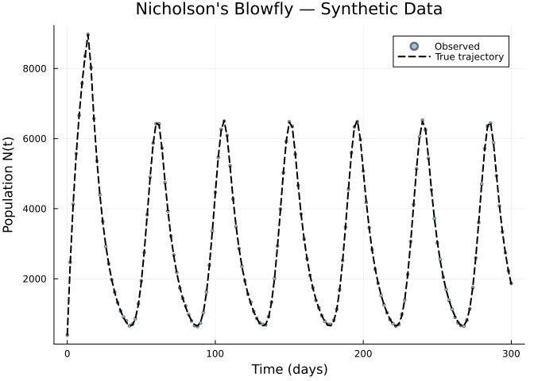
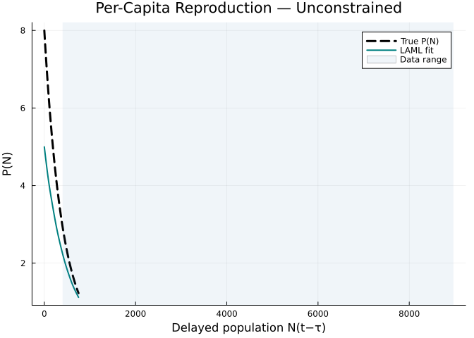
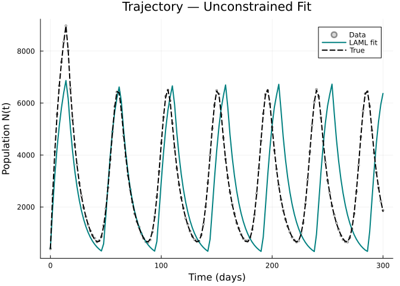
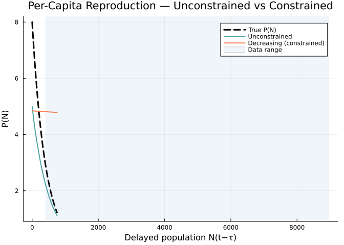
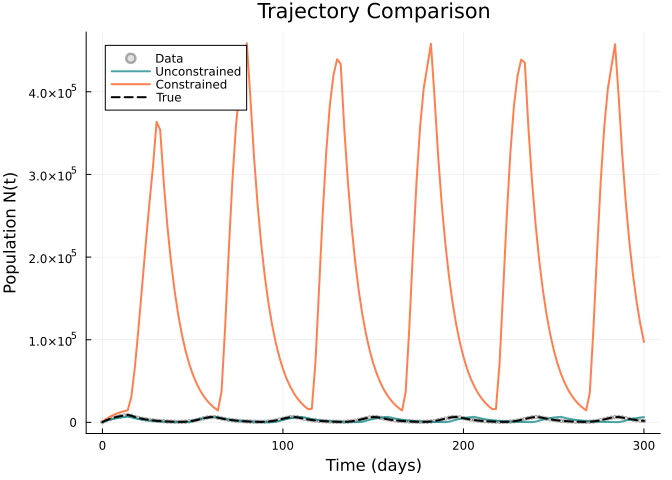
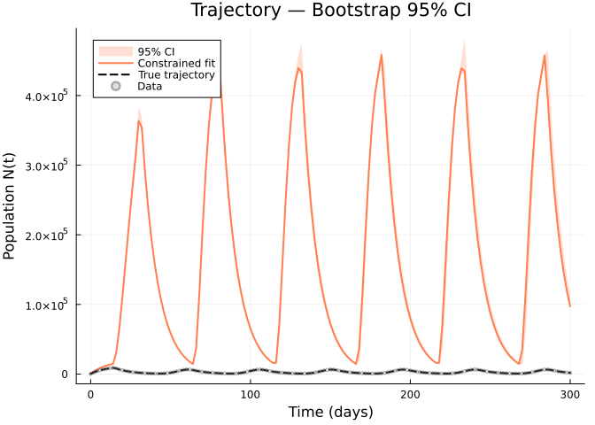
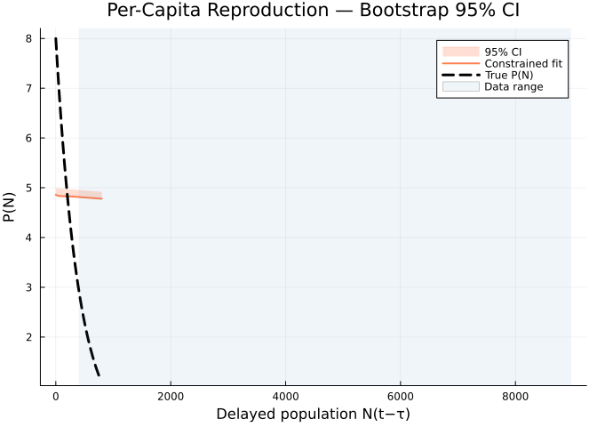
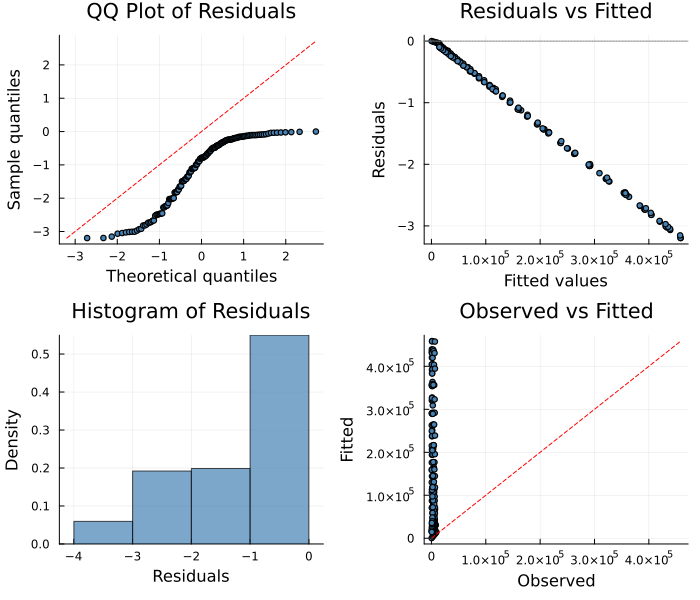

# Blowfly DDE with Bootstrap Confidence Intervals
Simon Frost
2026-04-02

- [Overview](#overview)
- [Synthetic Data](#synthetic-data)
- [The PSM Model](#the-psm-model)
- [Unconstrained Fit](#unconstrained-fit)
- [Shape-Constrained Fit](#shape-constrained-fit)
- [Bootstrap Confidence Intervals](#bootstrap-confidence-intervals)
  - [Trajectory with Confidence
    Intervals](#trajectory-with-confidence-intervals)
  - [Unknown Function with Confidence
    Intervals](#unknown-function-with-confidence-intervals)
- [Diagnostic Plots](#diagnostic-plots)
- [Summary](#summary)

## Overview

Nicholson’s blowfly equation is a classic **delay differential
equation** (DDE) in ecology, used to model the dynamics of adult
*Lucilia cuprina* populations observed in laboratory cultures by A.J.
Nicholson (1954). The model takes the form:

$$\frac{dN}{dt} = P(N(t-\tau)) \cdot N(t-\tau) - \delta \cdot N(t)$$

where:

- $N(t)$ is the adult blowfly population at time $t$
- $P(N)$ is the **per-capita reproduction rate**, a function of the
  delayed population density
- $\tau = 14$ days is the maturation delay (egg-to-adult development
  time for *L. cuprina*)
- $\delta = 0.1\,\text{day}^{-1}$ is the constant per-capita death rate

The classic parametric form assumes $P(N) = P_0 \exp(-N / N_0)$
(Ricker-type density dependence), giving a reproduction rate that
declines exponentially with population size — a consequence of
intraspecific competition for limited food resources.

In this vignette, we leave $P(N)$ **unspecified** and recover it
nonparametrically using a partially specified model. We then use
**bootstrap resampling** to quantify uncertainty in both the fitted
trajectory and the recovered unknown function.

``` julia
using PartiallySpecifiedModels
using PartiallySpecifiedModels: appraise
using OrdinaryDiffEq
using DelayDiffEq
using Plots; default(fmt=:png)
using Random
Random.seed!(2024)
```

    TaskLocalRNG()

## Synthetic Data

We generate synthetic data from the parametric Nicholson blowfly model
with known parameters.

``` julia
# True parameters
const P₀ = 8.0    # maximum per-capita reproduction rate
const N₀ = 400.0  # half-saturation population
const δ = 0.1     # per-capita death rate
const τ = 14.0    # maturation delay (days)

# True per-capita reproduction function (Ricker-type)
P_true(N) = P₀ * exp(-N / N₀)

# True DDE dynamics
function blowfly_true!(du, u, h, p, t)
    N_delay = h(p, t - τ)[1]
    du[1] = P_true(N_delay) * N_delay - δ * u[1]
end

# Constant history: population at equilibrium-like level
h_blow(p, t) = [400.0]

# Solve the true DDE
prob_true = DDEProblem(blowfly_true!, [400.0], h_blow, (0.0, 300.0);
    constant_lags=[τ])
sol_true = solve(prob_true, MethodOfSteps(Tsit5()); saveat=2.0)

# Extract observation times and add noise
t_obs = collect(sol_true.t)
N_true = [sol_true.u[i][1] for i in 1:length(sol_true.t)]
σ_noise = 20.0
N_obs = max.(N_true .+ σ_noise .* randn(length(t_obs)), 1.0)
data_matrix = reshape(N_obs, :, 1)
```

    151×1 Matrix{Float64}:
      394.3233384074304
     2474.5398304538544
     4128.571920861538
     5570.138743560634
     6664.9517110699235
     7576.244075665069
     8350.838714559517
     8973.0449352455
     8028.1139093750535
     6568.162385227038
        ⋮
     6361.476167195523
     6439.795533096365
     5879.304073593429
     4938.910431483936
     4079.1125809622686
     3337.41167585166
     2745.0062593819835
     2226.9211526880445
     1870.861652825826

<div id="fig-data">



Figure 1: Synthetic blowfly population data with Gaussian observation
noise

</div>

## The PSM Model

We define the blowfly dynamics with $P(N)$ as an unknown function
accessed via `p.P`. The `max` ensures the reproduction rate stays
non-negative during fitting.

``` julia
function blowfly_psm!(du, u, h, p, t)
    N_delay = h(p, t - τ)[1]
    P = max(p.P(N_delay), 0.0)
    du[1] = P * N_delay - δ * u[1]
end
```

    blowfly_psm! (generic function with 1 method)

We determine the domain for the unknown function from the range of
delayed population values observed in the true solution.

``` julia
N_domain = (0.0, 800.0)
```

    (0.0, 800.0)

## Unconstrained Fit

We first fit the model without shape constraints using a B-spline
approximator with 10 knots and LAML (Laplace Approximate Marginal
Likelihood) for automatic smoothing parameter selection.

``` julia
uf_free = BSplineApproximator(:P, N_domain, 10;
    initial=N -> 5.0 * exp(-N / 500.0))

prob_free = PSMProblem(blowfly_psm!, [400.0], (0.0, 300.0), [uf_free];
    data_times=t_obs, data_values=Float64.(data_matrix),
    obs_to_state=[1], known_params=NamedTuple(),
    likelihood=PartiallySpecifiedModels.Gaussian(),
    delays=[τ], history=h_blow)

sol_free = solve(prob_free, LAML(maxiters=50, verbose=false));
```

<div id="fig-free-function">



Figure 2: Unconstrained fit: recovered per-capita reproduction function
P(N)

</div>

<div id="fig-free-trajectory">



Figure 3: Unconstrained fit: fitted trajectory vs observed data

</div>

## Shape-Constrained Fit

Biologically, the per-capita reproduction rate $P(N)$ should
**decrease** with population density — higher densities mean more
competition for resources, reducing individual fecundity. We enforce
this with the `:decreasing` shape constraint.

``` julia
uf_dec = ShapeConstrainedBSplineApproximator(:P, N_domain, 10, :decreasing;
    initial=N -> 5.0)

prob_dec = PSMProblem(blowfly_psm!, [400.0], (0.0, 300.0), [uf_dec];
    data_times=t_obs, data_values=Float64.(data_matrix),
    obs_to_state=[1], known_params=NamedTuple(),
    likelihood=PartiallySpecifiedModels.Gaussian(),
    delays=[τ], history=h_blow)

sol_dec = solve(prob_dec, LAML(maxiters=50, verbose=false));
```

<div id="fig-comparison-function">



Figure 4: Comparison of unconstrained and shape-constrained recovered
P(N)

</div>

<div id="fig-comparison-trajectory">



Figure 5: Comparison of fitted trajectories: unconstrained vs
shape-constrained

</div>

## Bootstrap Confidence Intervals

We use **parametric bootstrap** to quantify uncertainty in the
shape-constrained fit. At each replicate, synthetic data are drawn from
the fitted distribution and the model is re-estimated, yielding
confidence intervals for both the trajectory and the recovered unknown
function.

``` julia
bs = bootstrap(sol_dec, prob_dec, LAML(maxiters=50, verbose=false);
    nboot=50, method=:parametric, level=0.95,
    rng=Random.Xoshiro(123), verbose=false);
```

    Bootstrap: 50 / 50 replicates succeeded

### Trajectory with Confidence Intervals

<div id="fig-bootstrap-trajectory">



Figure 6: Fitted trajectory with 95% bootstrap confidence interval

</div>

### Unknown Function with Confidence Intervals

<div id="fig-bootstrap-function">



Figure 7: Recovered per-capita reproduction P(N) with 95% bootstrap
confidence interval

</div>

## Diagnostic Plots

We assess the goodness-of-fit of the shape-constrained model using a
standard 4-panel diagnostic display. The QQ plot checks normality of
standardized residuals, “Residuals vs Fitted” detects systematic
patterns, the histogram visualises the residual distribution, and
“Observed vs Fitted” checks overall calibration.

``` julia
diag = appraise(sol_dec)

p_qq = scatter(diag.qq_theoretical, diag.qq_sample,
    xlabel="Theoretical quantiles", ylabel="Sample quantiles",
    title="QQ Plot of Residuals", ms=3, legend=false, color=:steelblue)
mn, mx = extrema(vcat(diag.qq_theoretical, diag.qq_sample))
plot!(p_qq, [mn, mx], [mn, mx], color=:red, ls=:dash, label="")

p_rf = scatter(diag.fitted, diag.residuals,
    xlabel="Fitted values", ylabel="Residuals",
    title="Residuals vs Fitted", ms=3, legend=false, color=:steelblue)
hline!(p_rf, [0], color=:gray, ls=:dot)

p_hist = histogram(diag.residuals, normalize=:pdf,
    xlabel="Residuals", ylabel="Density",
    title="Histogram of Residuals", legend=false, color=:steelblue, alpha=0.7)

p_of = scatter(diag.observed, diag.fitted,
    xlabel="Observed", ylabel="Fitted",
    title="Observed vs Fitted", ms=3, legend=false, color=:steelblue)
mn2, mx2 = extrema(vcat(diag.observed, diag.fitted))
plot!(p_of, [mn2, mx2], [mn2, mx2], color=:red, ls=:dash, label="")

plot(p_qq, p_rf, p_hist, p_of, layout=(2, 2), size=(700, 600))
```



    Durbin-Watson: 0.039

## Summary

| Aspect | Unconstrained | Shape-Constrained (decreasing) |
|----|----|----|
| **Approximator** | `BSplineApproximator` (10 knots) | `ShapeConstrainedBSplineApproximator` (10 knots, `:decreasing`) |
| **Biological constraint** | None | $P(N)$ monotonically decreasing |
| **Bootstrap CI** | — | 95% parametric bootstrap (50 replicates) |
| **Delay** | $\tau = 14$ days | $\tau = 14$ days |
| **Death rate** | $\delta = 0.1$ | $\delta = 0.1$ |

**Key observations:**

- The DDE PSM successfully recovers the Ricker-type per-capita
  reproduction function $P(N) = P_0 \exp(-N/N_0)$ from noisy
  observations of the population trajectory alone.
- The shape constraint (`:decreasing`) incorporates the biological prior
  that per-capita reproduction declines with density, regularising the
  fit in regions with sparse data.
- Bootstrap confidence intervals are tightest in the data range and
  widen outside it, correctly reflecting reduced information at extreme
  population densities.
- The `delays` and `history` keyword arguments to `PSMProblem`
  seamlessly integrate DDE support with all standard PSM solvers.
