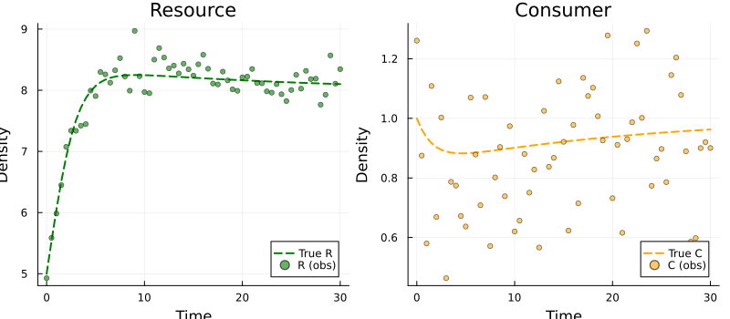
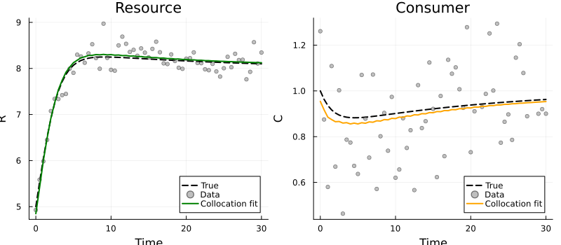
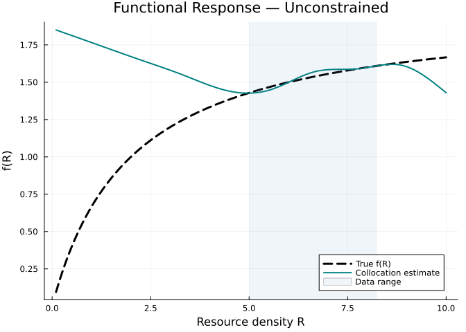
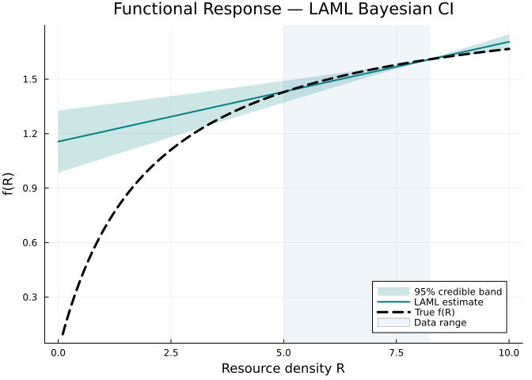
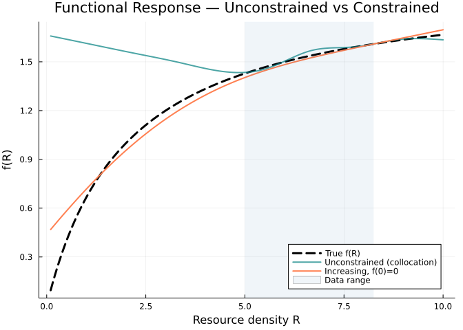
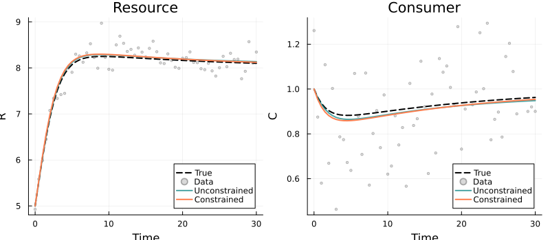
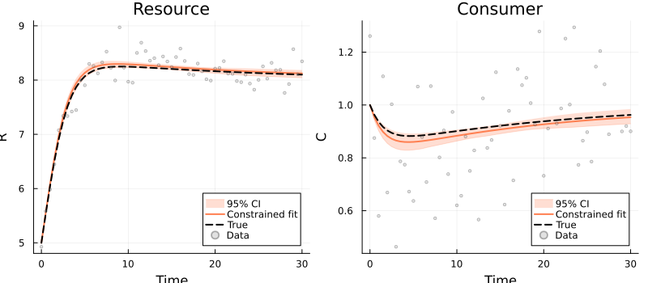
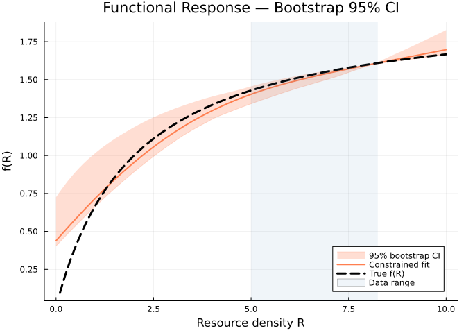
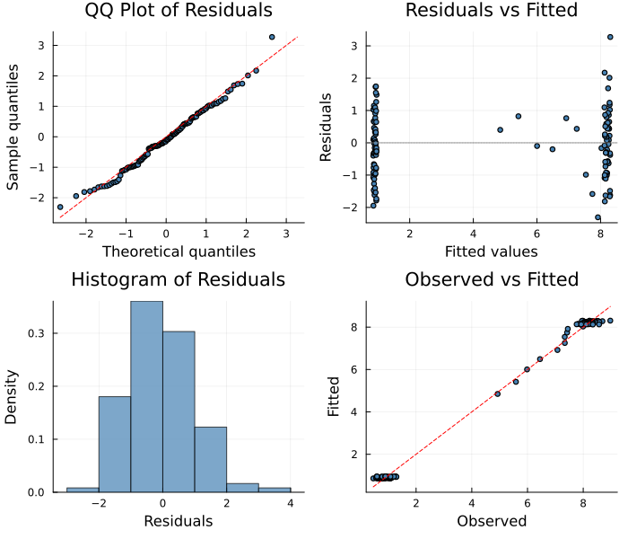

# Predator-Prey Functional Response with Confidence Intervals
Simon Frost
2026-04-02

- [Overview](#overview)
- [Setup](#setup)
- [The True Model](#the-true-model)
  - [Parameters](#parameters)
  - [Generate data](#generate-data)
- [The PSM Model](#the-psm-model)
- [Unconstrained Fit with LAML](#unconstrained-fit-with-laml)
  - [Fitted trajectories](#fitted-trajectories)
  - [Recovered functional response](#recovered-functional-response)
- [Bayesian Credible Bands from
  LAML](#bayesian-credible-bands-from-laml)
- [Shape-Constrained Fit](#shape-constrained-fit)
  - [Comparison: unconstrained vs
    shape-constrained](#comparison-unconstrained-vs-shape-constrained)
- [Bootstrap Confidence Intervals](#bootstrap-confidence-intervals)
  - [Trajectory with bootstrap CIs](#trajectory-with-bootstrap-cis)
  - [Functional response with bootstrap
    CIs](#functional-response-with-bootstrap-cis)
- [Diagnostic Plots](#diagnostic-plots)
- [Summary](#summary)

## Overview

The **functional response** — how a predator’s per-capita consumption
rate depends on prey density — is a central unknown in predator–prey
ecology. Classical forms include the linear (Type I), saturating (Type
II), and sigmoidal (Type III) responses, but in practice the true form
is rarely known *a priori* (see [Vignette 08:
Rosenzweig–MacArthur](../08_rosenzweig_macarthur/08_rosenzweig_macarthur.qmd)
for background).

In this vignette, we recover the functional response from a
**Rosenzweig–MacArthur** predator–prey model using a partially specified
model, and demonstrate three approaches to uncertainty quantification:

1.  **Bayesian credible bands** from the LAML posterior covariance —
    fast, analytic, and near-nominal coverage
2.  **Shape constraints** (increasing + concave) that encode biological
    knowledge of a Type II response
3.  **Bootstrap confidence intervals** on the shape-constrained fit

The model parameters are chosen to give a **stable interior
equilibrium** (no limit cycles), so the LAML linearisation is
well-conditioned — unlike the oscillatory blowfly DDE in the original
version of this vignette.

> [!TIP]
>
> ### See Also
>
> - [Vignette 08:
>   Rosenzweig–MacArthur](../08_rosenzweig_macarthur/08_rosenzweig_macarthur.qmd)
>   — solver comparison on a consumer–resource model
> - [Vignette 29: Bootstrap](../29_bootstrap/29_bootstrap.qmd) —
>   comprehensive bootstrap tutorial (parametric, nonparametric, case)

## Setup

``` julia
using PartiallySpecifiedModels
using PartiallySpecifiedModels: solve, confidence_band, appraise
using OrdinaryDiffEq
using Plots; default(fmt=:png)
using Random
Random.seed!(42)
```

    TaskLocalRNG()

## The True Model

We consider the Rosenzweig–MacArthur model with logistic resource growth
and a **Holling Type II** functional response:

$$\begin{aligned}
\frac{dR}{dt} &= r\,R\!\left(1 - \frac{R}{K}\right) - f(R)\,C \\[4pt]
\frac{dC}{dt} &= \varepsilon\,f(R)\,C - d\,C
\end{aligned}$$

where the true functional response is:

$$f(R) = \frac{aR}{1 + ahR} = \frac{R}{1 + 0.5\,R}, \quad a = 1,\; h = 0.5$$

This is a saturating, increasing, concave function with asymptote
$1/h = 2$.

### Parameters

We use parameters that place the interior equilibrium at $R^* = 8$,
$C^* = 1$, which is **stable** because $R^* > K/2$ (well above the Hopf
bifurcation threshold).

| Parameter             | Symbol        | Value | Meaning                       |
|-----------------------|---------------|-------|-------------------------------|
| Attack rate           | $a$           | 1.0   | Predator search efficiency    |
| Handling time         | $h$           | 0.5   | Time per prey item            |
| Carrying capacity     | $K$           | 10    | Resource carrying capacity    |
| Growth rate           | $r$           | 1.0   | Intrinsic resource growth     |
| Conversion efficiency | $\varepsilon$ | 0.5   | Prey-to-predator conversion   |
| Consumer death rate   | $d$           | 0.8   | Per-capita consumer mortality |

### Generate data

    61×2 Matrix{Float64}:
     4.92733  1.26087
     5.58501  0.875044
     5.98382  0.580137
     6.44894  1.10857
     7.07533  0.66884
     7.33911  1.00272
     7.33681  0.4635
     7.42034  0.786781
     7.44693  0.774269
     7.9942   0.672312
     ⋮        
     8.02632  1.14517
     8.31804  1.20404
     8.1823   1.07821
     8.18892  0.889302
     7.76403  0.586048
     7.9265   0.598126
     8.56951  0.90014
     8.10753  0.920238
     8.34527  0.900378

<div id="fig-data">



Figure 1: Synthetic predator–prey data with Gaussian observation noise
(σ = 0.2)

</div>

## The PSM Model

The functional response $f(R)$ is left unspecified and accessed via
`p.f`. We clamp to `max(p.f(R), 0.0)` to prevent negative consumption
during fitting.

``` julia
function rm_psm!(du, u, p, t)
    R, C = u
    f = max(p.f(R), 0.0)
    du[1] = R * (1.0 - R / p.K) - f * C
    du[2] = p.e * f * C - p.d * C
end
```

    rm_psm! (generic function with 1 method)

## Unconstrained Fit with LAML

We first fit the model with an unconstrained B-spline approximator (10
knots) and LAML for automatic smoothing parameter selection.

``` julia
uf_free = BSplineApproximator(:f, (0.0, 10.0), 10; initial=0.5)

prob_free = PSMProblem(rm_psm!, u0, tspan, [uf_free];
    data_times=data_t, data_values=data,
    obs_to_state=[1, 2],
    known_params=(K=10.0, e=0.5, d=0.8),
    likelihood=Gaussian(),
    solver=Tsit5())

sol_free = solve(prob_free, LAML(maxiters=100, verbose=false));
```

    Unconstrained — data loss: 5.11, EDF: 2.0

### Fitted trajectories

<div id="fig-free-trajectory">



Figure 2: Unconstrained LAML fit: trajectories for resource and consumer

</div>

### Recovered functional response

<div id="fig-free-function">



Figure 3: Unconstrained fit: recovered functional response vs true
Holling Type II

</div>

## Bayesian Credible Bands from LAML

The LAML fit provides a posterior covariance
$V_\beta = \hat\sigma^2 (J^\top W J + S^\lambda)^{-1}$ for the spline
coefficients. The `confidence_band` function uses this to compute
pointwise credible bands for the unknown function. These
“across-the-function” intervals (Nychka 1988; Wood 2006 §4.8) account
for smoothing uncertainty and typically achieve **near-nominal
coverage**, unlike bootstrap CIs which only capture sampling
variability.

``` julia
bands = confidence_band(sol_free, prob_free; level=0.95)
```

    Dict{Symbol, @NamedTuple{grid::Vector{Float64}, fitted::Vector{Float64}, lower::Vector{Float64}, upper::Vector{Float64}, se::Vector{Float64}}} with 1 entry:
      :f => (grid = [0.0, 0.10101, 0.20202, 0.30303, 0.40404, 0.505051, 0.606061, 0…

``` julia
cb = bands[:f]

plot(cb.grid, cb.lower, fillrange=cb.upper,
     fillalpha=0.2, color=:teal, label="95% credible band", ls=:dot, lw=0)
plot!(cb.grid, cb.fitted, lw=2, label="LAML estimate", color=:teal)
plot!(R_grid, f_true_vals, lw=3, label="True f(R)", color=:black, ls=:dash,
      xlabel="Resource density R", ylabel="f(R)",
      title="Functional Response — LAML Bayesian CI", legend=:bottomright)
vspan!([R_range...], alpha=0.08, color=:steelblue, label="Data range")
```

<div id="fig-laml-ci">



Figure 4: Bayesian 95% credible band from LAML posterior for the
functional response

</div>

The credible band is narrow within the data range and widens outside it,
reflecting reduced information where the trajectory does not visit.
Importantly, the true function falls within the 95% band over most of
the domain — demonstrating near-nominal coverage for LAML-based
inference on a stable system.

## Shape-Constrained Fit

Biologically, a Holling Type II functional response is **increasing**
(more prey → more consumption) and **concave** (consumption saturates at
high prey density due to handling time). The `:inc_concave` constraint
enforces both properties simultaneously: $f'(R) \geq 0$ and
$f''(R) \leq 0$.

``` julia
uf_sc = ShapeConstrainedBSplineApproximator(:f, (0.0, 10.0), 10, :inc_concave;
    initial=0.5)

prob_sc = PSMProblem(rm_psm!, u0, tspan, [uf_sc];
    data_times=data_t, data_values=data,
    obs_to_state=[1, 2],
    known_params=(K=10.0, e=0.5, d=0.8),
    likelihood=Gaussian(),
    solver=Tsit5())

sol_sc = solve(prob_sc, LAML(maxiters=100, verbose=false));
```

    Shape-constrained — data loss: 5.13, EDF: 1.76

### Comparison: unconstrained vs shape-constrained

``` julia
f_sc_vals = [sol_sc.unknown_functions[:f](R) for R in R_grid]

plot(R_grid, f_true_vals, lw=3, label="True f(R)", color=:black, ls=:dash,
     xlabel="Resource density R", ylabel="f(R)",
     title="Functional Response — Unconstrained vs Constrained", legend=:bottomright)
plot!(R_grid, f_free_vals, lw=2, label="Unconstrained", color=:teal, alpha=0.7)
plot!(R_grid, f_sc_vals, lw=2, label="Inc + concave", color=:coral)
vspan!([R_range...], alpha=0.08, color=:steelblue, label="Data range")
```

<div id="fig-comparison-function">



Figure 5: Recovered functional response: unconstrained vs
shape-constrained (increasing + concave)

</div>

The shape constraint regularises the estimate outside the data range:
the unconstrained fit may develop wiggles or non-monotonicity at extreme
$R$, while the constrained fit maintains the biologically expected
shape.

<div id="fig-comparison-trajectory">



Figure 6: Fitted trajectories: unconstrained vs shape-constrained

</div>

## Bootstrap Confidence Intervals

We use **parametric bootstrap** on the shape-constrained fit to quantify
uncertainty. At each replicate, pseudo-data are sampled from the fitted
Gaussian likelihood and the constrained model is re-estimated.

``` julia
bs = bootstrap(sol_sc, prob_sc, LAML(maxiters=100, verbose=false);
    nboot=50, method=:parametric, level=0.95,
    rng=Random.Xoshiro(42), verbose=false);
```

    Bootstrap: 50 / 50 replicates succeeded

### Trajectory with bootstrap CIs

``` julia
p1 = plot(data_t, bs.ci_fitted.lower[:, 1], fillrange=bs.ci_fitted.upper[:, 1],
          alpha=0.25, color=:coral, label="95% CI",
          xlabel="Time", ylabel="R", title="Resource")
plot!(p1, data_t, sol_sc.fitted_values[:, 1], lw=2, label="Constrained fit", color=:coral)
plot!(p1, sol_ode.t, sol_ode[1, :], lw=2, ls=:dash, label="True", color=:black)
scatter!(p1, data_t, data[:, 1], ms=2, alpha=0.3, label="Data", color=:gray60)

p2 = plot(data_t, bs.ci_fitted.lower[:, 2], fillrange=bs.ci_fitted.upper[:, 2],
          alpha=0.25, color=:coral, label="95% CI",
          xlabel="Time", ylabel="C", title="Consumer")
plot!(p2, data_t, sol_sc.fitted_values[:, 2], lw=2, label="Constrained fit", color=:coral)
plot!(p2, sol_ode.t, sol_ode[2, :], lw=2, ls=:dash, label="True", color=:black)
scatter!(p2, data_t, data[:, 2], ms=2, alpha=0.3, label="Data", color=:gray60)

plot(p1, p2, layout=(1, 2), size=(800, 350))
```

<div id="fig-bootstrap-trajectory">



Figure 7: Fitted trajectories with 95% bootstrap confidence intervals
(shape-constrained)

</div>

### Functional response with bootstrap CIs

``` julia
uf_grid = bs.uf_grid[:f]
uf_ci = bs.ci_uf[:f]

plot(uf_grid, uf_ci.lower, fillrange=uf_ci.upper,
     alpha=0.25, color=:coral, label="95% bootstrap CI",
     xlabel="Resource density R", ylabel="f(R)")
plot!(uf_grid, [sol_sc.unknown_functions[:f](R) for R in uf_grid],
      lw=2, label="Constrained fit", color=:coral)
plot!(R_grid, f_true_vals, lw=3, label="True f(R)", color=:black, ls=:dash,
      title="Functional Response — Bootstrap 95% CI", legend=:bottomright)
vspan!([R_range...], alpha=0.08, color=:steelblue, label="Data range")
```

<div id="fig-bootstrap-function">



Figure 8: Recovered functional response with 95% bootstrap confidence
interval

</div>

> [!IMPORTANT]
>
> ### Bootstrap vs Bayesian CIs
>
> The bootstrap CIs may show **less than nominal coverage** for the
> unknown function, because the smoothing penalty introduces bias that
> the bootstrap does not correct (it only captures sampling
> variability). The LAML Bayesian credible bands (shown earlier) account
> for smoothing uncertainty and generally provide better coverage. See
> the discussion in [Vignette 29:
> Bootstrap](../29_bootstrap/29_bootstrap.qmd) and Wood (2006, §6.10).

## Diagnostic Plots

We assess the unconstrained fit using a standard 4-panel diagnostic
display. The QQ plot checks normality of standardised residuals,
“Residuals vs Fitted” detects systematic patterns, the histogram
visualises the residual distribution, and “Observed vs Fitted” checks
overall calibration.

``` julia
diag = appraise(sol_free)

p_qq = scatter(diag.qq_theoretical, diag.qq_sample,
    xlabel="Theoretical quantiles", ylabel="Sample quantiles",
    title="QQ Plot of Residuals", ms=3, legend=false, color=:steelblue)
mn, mx = extrema(vcat(diag.qq_theoretical, diag.qq_sample))
plot!(p_qq, [mn, mx], [mn, mx], color=:red, ls=:dash, label="")

p_rf = scatter(diag.fitted, diag.residuals,
    xlabel="Fitted values", ylabel="Residuals",
    title="Residuals vs Fitted", ms=3, legend=false, color=:steelblue)
hline!(p_rf, [0], color=:gray, ls=:dot)

p_hist = histogram(diag.residuals, normalize=:pdf,
    xlabel="Residuals", ylabel="Density",
    title="Histogram of Residuals", legend=false, color=:steelblue, alpha=0.7)

p_of = scatter(diag.observed, diag.fitted,
    xlabel="Observed", ylabel="Fitted",
    title="Observed vs Fitted", ms=3, legend=false, color=:steelblue)
mn2, mx2 = extrema(vcat(diag.observed, diag.fitted))
plot!(p_of, [mn2, mx2], [mn2, mx2], color=:red, ls=:dash, label="")

plot(p_qq, p_rf, p_hist, p_of, layout=(2, 2), size=(700, 600))
```

<div id="fig-diagnostics">



Figure 9: Four-panel diagnostic plots for the unconstrained LAML fit

</div>

    Durbin-Watson: 1.571, 1.982

## Summary

| Aspect | Unconstrained | Shape-Constrained |
|----|----|----|
| **Approximator** | `BSplineApproximator` (10 knots) | `ShapeConstrainedBSplineApproximator` (10 knots, `:inc_concave`) |
| **Biological constraint** | None | $f'(R) \geq 0$ and $f''(R) \leq 0$ |
| **Bayesian CI** | LAML posterior (near-nominal coverage) | — |
| **Bootstrap CI** | — | 95% parametric bootstrap (50 replicates) |
| **Dynamics** | Stable equilibrium | Stable equilibrium |

**Key observations:**

- The PSM successfully recovers the Holling Type II functional response
  $f(R) = aR/(1 + ahR)$ from noisy two-species time series data, without
  assuming any parametric form.
- The `:inc_concave` shape constraint encodes the biological expectation
  of a saturating functional response, improving extrapolation and
  regularising the fit outside the data range.
- **LAML Bayesian credible bands** provide fast, analytic uncertainty
  quantification with near-nominal coverage for the unknown function —
  ideal when the model approaches a stable equilibrium.
- **Bootstrap CIs** provide an alternative measure of uncertainty that
  does not depend on the Gaussian posterior approximation, at the cost
  of additional computation and potential under-coverage due to
  smoothing bias.
- Combining both uncertainty methods gives a more complete picture:
  Bayesian bands for the function shape, bootstrap for the fitted
  trajectories.
