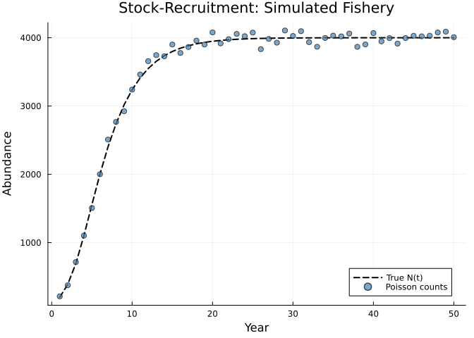
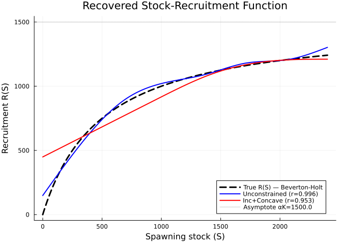
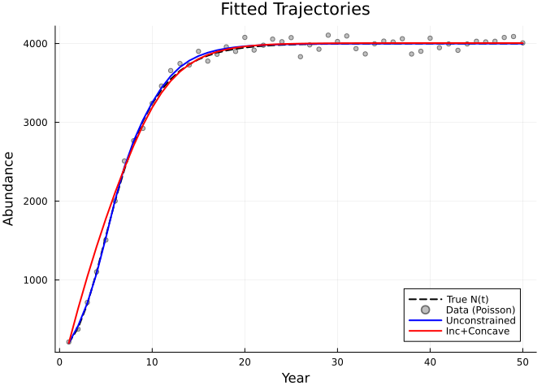
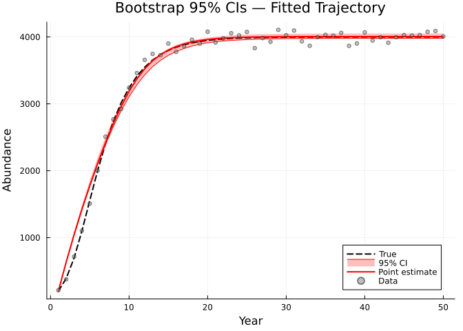
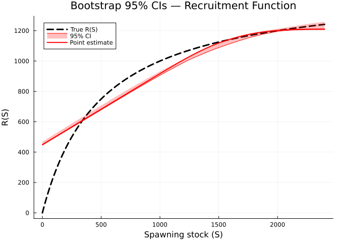
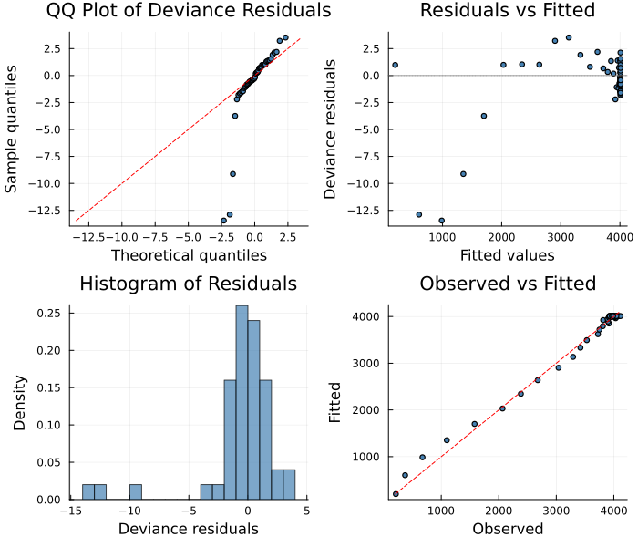
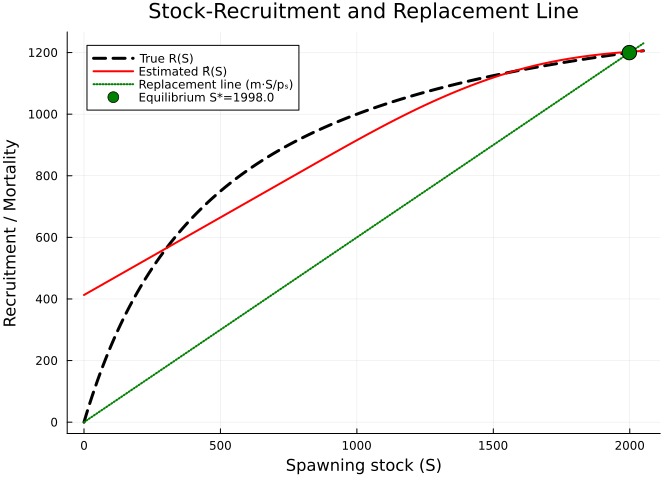

# Fisheries Stock-Recruitment with Poisson Counts
Simon Frost
2026-06-12

- [Overview](#overview)
- [Setup](#setup)
- [Synthetic Data](#synthetic-data)
  - [True dynamics](#true-dynamics)
  - [Poisson observations](#poisson-observations)
- [The PSM Model](#the-psm-model)
- [Unconstrained Fit](#unconstrained-fit)
- [Shape-Constrained Fit](#shape-constrained-fit)
  - [Compare recovered R(S) curves](#compare-recovered-rs-curves)
  - [Compare fitted trajectories](#compare-fitted-trajectories)
- [Bootstrap Confidence Intervals](#bootstrap-confidence-intervals)
  - [Trajectory confidence bands](#trajectory-confidence-bands)
  - [Recruitment function confidence
    bands](#recruitment-function-confidence-bands)
- [Diagnostic Plots](#diagnostic-plots)
- [Fisheries Management
  Implications](#fisheries-management-implications)
  - [Maximum Sustainable Yield](#maximum-sustainable-yield)
  - [Why nonparametric matters](#why-nonparametric-matters)
- [Summary](#summary)

## Overview

In fisheries science, the **stock-recruitment relationship** $R(S)$
describes how the number of new recruits (young fish entering the
population) depends on spawning stock biomass. This relationship is
central to setting harvest quotas and estimating Maximum Sustainable
Yield (MSY), yet its functional form is notoriously uncertain.

Classic parametric forms include:

| Model | Form | Behaviour |
|----|----|----|
| Beverton-Holt | $R(S) = \alpha S / (1 + S/K)$ | Compensatory (saturating) |
| Ricker | $R(S) = \alpha S \exp(-S/K)$ | Overcompensatory (domed) |
| Shepherd | $R(S) = \alpha S / (1 + (S/K)^\delta)$ | Flexible ($\delta$ controls shape) |

All assume a specific functional form a priori. A **partially specified
model** instead treats $R(S)$ as an unknown function to be estimated
from the data, subject only to biologically motivated shape constraints:

- **Increasing**: more spawners produce more recruits (at least
  initially)
- **Concave**: diminishing returns — recruitment saturates at high stock
  sizes

The constraint `:inc_concave` enforces both properties simultaneously,
which is appropriate for **compensatory** stock-recruitment
(Beverton-Holt type). This vignette also demonstrates **Poisson
likelihood** for count data, which is natural when abundance is measured
as integer counts from survey or catch data.

## Setup

``` julia
using PartiallySpecifiedModels
using PartiallySpecifiedModels: solve
using OrdinaryDiffEq
using Plots
using Statistics
using Random

Random.seed!(42)
```

    TaskLocalRNG()

## Synthetic Data

We generate data from a discrete-time population model with
Beverton-Holt recruitment and Poisson-distributed observations.

### True dynamics

The population model is:

$$N_{t+1} = R(S_t) + (1 - m) \, N_t$$

where $S_t = p_s \, N_t$ is the spawning stock (proportion $p_s = 0.5$
of adults spawn), $m = 0.3$ is the natural mortality rate, and the true
recruitment function is Beverton-Holt:

$$R(S) = \frac{\alpha S}{1 + S/K}, \quad \alpha = 3.0, \; K = 500.0$$

``` julia
α_true = 3.0
K_true = 500.0
m = 0.3
p_s = 0.5

R_true(S) = α_true * S / (1.0 + S / K_true)

n_years = 50
N_true = zeros(n_years)
N_true[1] = 200.0
for t in 1:(n_years - 1)
    S = N_true[t] * p_s
    N_true[t + 1] = R_true(S) + (1.0 - m) * N_true[t]
end
```

### Poisson observations

Fish abundance surveys produce **integer counts**. We observe population
size as Poisson-distributed:

``` julia
function _sample_pois(μ)
    μ = max(μ, 0.01); c = 0; s = 0.0
    while true; s -= log(rand()); s > μ && break; c += 1; end
    Float64(c)
end
y_pois = _sample_pois.(N_true)
```

    50-element Vector{Float64}:
      213.0
      376.0
      715.0
     1103.0
     1507.0
     2002.0
     2509.0
     2767.0
     2924.0
     3241.0
        ⋮
     3995.0
     3914.0
     3995.0
     4029.0
     4021.0
     4029.0
     4077.0
     4089.0
     4008.0



    Population range: 200.0 – 4000.0
    Spawning stock range: 100.0 – 2000.0
    Observed count range: 213 – 4106
    Mean count: 3506.0
    Var/Mean ratio: 296.52 (≈1 for Poisson)

The variance-to-mean ratio near 1 confirms equidispersion, consistent
with Poisson sampling.

## The PSM Model

We define a discrete-time dynamics function where the recruitment $R(S)$
is an unknown function to be estimated. The function signature for
discrete models is `f!(u_next, u, p, t)` — it writes the **next state**
into `u_next`.

``` julia
function stock_recruit!(u_next, u, p, t)
    N = u[1]
    S = N * 0.5                     # spawning stock
    R = max(p.R(S), 0.0)           # unknown recruitment function
    u_next[1] = R + 0.7 * N        # (1 - m) * N + R(S)
end
```

    stock_recruit! (generic function with 1 method)

The spawning stock range determines the B-spline domain:

    Spawning stock range: 100.0 – 2000.0
    → B-spline domain: (0.0, 2050.0)

## Unconstrained Fit

First, we fit with a standard (unconstrained) B-spline approximator
using LAML with Gaussian likelihood. The initial values approximate a
saturating curve matching the expected range of recruitment values.

``` julia
S_max = maximum(N_true .* p_s) * 1.2

uf_unc = BSplineApproximator(:R, (0.0, S_max), 8;
    initial=S -> α_true * S / (1 + S / (K_true * 1.5)))

prob_unc = PSMProblem(stock_recruit!, [200.0], (1.0, Float64(n_years)), [uf_unc];
    data_times=Float64.(1:n_years),
    data_values=reshape(y_pois, :, 1),
    obs_to_state=[1],
    known_params=NamedTuple(),
    likelihood=PartiallySpecifiedModels.Gaussian(),
    discrete=true)

sol_unc = solve(prob_unc, LAML(maxiters=200, verbose=false))
println("Unconstrained — Data loss: $(round(sol_unc.data_loss, sigdigits=4)), " *
    "EDF: $(round(sol_unc.edf, digits=1))")
```

    Unconstrained — Data loss: 218000.0, EDF: 5.1

## Shape-Constrained Fit

Now we apply the `:inc_concave` constraint, which enforces that $R(S)$
is **increasing and concave** — biologically appropriate for
Beverton-Holt type recruitment where more spawners produce more recruits
but with diminishing returns (saturation).

``` julia
uf_sc = ShapeConstrainedBSplineApproximator(:R, (0.0, S_max), 8, :inc_concave;
    initial=200.0)

prob_sc = PSMProblem(stock_recruit!, [200.0], (1.0, Float64(n_years)), [uf_sc];
    data_times=Float64.(1:n_years),
    data_values=reshape(y_pois, :, 1),
    obs_to_state=[1],
    known_params=NamedTuple(),
    likelihood=PartiallySpecifiedModels.Gaussian(),
    discrete=true)

sol_sc = solve(prob_sc, LAML(maxiters=200, verbose=false))
println("Inc+Concave — Data loss: $(round(sol_sc.data_loss, sigdigits=4)), " *
    "EDF: $(round(sol_sc.edf, digits=1))")
```

    Inc+Concave — Data loss: 603100.0, EDF: 2.2

### Compare recovered R(S) curves

``` julia
S_grid = range(0.0, S_max, length=200)
R_truth = [R_true(S) for S in S_grid]
R_unc = [sol_unc.unknown_functions[:R](S) for S in S_grid]
R_sc = [sol_sc.unknown_functions[:R](S) for S in S_grid]

cor_unc = round(cor(R_truth, R_unc), digits=3)
cor_sc = round(cor(R_truth, R_sc), digits=3)

p_R = plot(S_grid, R_truth, label="True R(S) — Beverton-Holt", lw=3,
    color=:black, ls=:dash,
    xlabel="Spawning stock (S)", ylabel="Recruitment R(S)",
    title="Recovered Stock-Recruitment Function")
plot!(p_R, S_grid, R_unc, label="Unconstrained (r=$cor_unc)", lw=2, color=:blue)
plot!(p_R, S_grid, R_sc, label="Inc+Concave (r=$cor_sc)", lw=2, color=:red)
hline!(p_R, [α_true * K_true], ls=:dot, color=:gray, alpha=0.5,
    label="Asymptote αK=$(α_true * K_true)")
p_R
```



### Compare fitted trajectories

``` julia
times = Float64.(1:n_years)

p_fit = plot(times, N_true, label="True N(t)", lw=2, color=:black, ls=:dash,
    xlabel="Year", ylabel="Abundance", title="Fitted Trajectories")
scatter!(p_fit, times, y_pois, label="Data (Poisson)", ms=3, color=:gray, alpha=0.5)
plot!(p_fit, times, sol_unc.fitted_values[:, 1], label="Unconstrained", lw=2, color=:blue)
plot!(p_fit, times, sol_sc.fitted_values[:, 1], label="Inc+Concave", lw=2, color=:red)
p_fit
```



    Stock-Recruitment Model — Comparison
    ────────────────────────────────────────────────────────────
      Unconstrained:  data_loss=218000.0, EDF=5.1, cor(R̂,R)=0.996
      Inc+Concave:    data_loss=603100.0, EDF=2.2, cor(R̂,R)=0.953

The shape constraint typically produces a smoother, more biologically
plausible curve with comparable or slightly higher data loss — the small
price of enforcing prior knowledge.

## Bootstrap Confidence Intervals

We compute parametric bootstrap confidence intervals on the
shape-constrained fit. With `method=:parametric` and a Gaussian
likelihood, each bootstrap replicate samples new data from
$N(\hat\mu_t, \hat\sigma)$ and refits the model.

``` julia
bs = bootstrap(sol_sc, prob_sc, LAML(maxiters=200, verbose=false);
    nboot=50, method=:parametric, level=0.95, verbose=false)
println("Bootstrap: $(bs.n_success)/50 replicates converged")
```

    Bootstrap: 50/50 replicates converged

### Trajectory confidence bands

``` julia
p_ci = plot(times, N_true, label="True", lw=2, color=:black, ls=:dash,
    xlabel="Year", ylabel="Abundance",
    title="Bootstrap 95% CIs — Fitted Trajectory")
plot!(p_ci, times, bs.ci_fitted.lower[:, 1],
    fillrange=bs.ci_fitted.upper[:, 1],
    fillalpha=0.25, color=:red, label="95% CI")
plot!(p_ci, times, sol_sc.fitted_values[:, 1],
    label="Point estimate", lw=2, color=:red)
scatter!(p_ci, times, y_pois, label="Data", ms=3, color=:gray, alpha=0.5)
p_ci
```



### Recruitment function confidence bands

``` julia
uf_grid_R = bs.uf_grid[:R]
R_truth_grid = [R_true(S) for S in uf_grid_R]
R_est_grid = [sol_sc.unknown_functions[:R](S) for S in uf_grid_R]

p_ci_R = plot(uf_grid_R, R_truth_grid, label="True R(S)", lw=3,
    color=:black, ls=:dash,
    xlabel="Spawning stock (S)", ylabel="R(S)",
    title="Bootstrap 95% CIs — Recruitment Function")
plot!(p_ci_R, uf_grid_R, bs.ci_uf[:R].lower,
    fillrange=bs.ci_uf[:R].upper,
    fillalpha=0.25, color=:red, label="95% CI")
plot!(p_ci_R, uf_grid_R, R_est_grid,
    label="Point estimate", lw=2, color=:red)
p_ci_R
```



The confidence bands show where the data are most informative (narrow
bands) and where extrapolation uncertainty dominates (wide bands at the
domain edges).

## Diagnostic Plots

The `appraise` function produces standardised diagnostic quantities. For
Poisson data, we pass `family=Poisson()` to compute deviance residuals
rather than raw residuals:

``` julia
using PartiallySpecifiedModels: appraise

diag = appraise(sol_sc)

p_qq = scatter(diag.qq_theoretical, diag.qq_sample,
    xlabel="Theoretical quantiles", ylabel="Sample quantiles",
    title="QQ Plot of Deviance Residuals", ms=3, legend=false, color=:steelblue)
mn, mx = extrema(vcat(diag.qq_theoretical, diag.qq_sample))
plot!(p_qq, [mn, mx], [mn, mx], color=:red, ls=:dash, label="")

p_rf = scatter(diag.fitted, diag.residuals,
    xlabel="Fitted values", ylabel="Deviance residuals",
    title="Residuals vs Fitted", ms=3, legend=false, color=:steelblue)
hline!(p_rf, [0], color=:gray, ls=:dot)

p_hist = histogram(diag.residuals, normalize=:pdf,
    xlabel="Deviance residuals", ylabel="Density",
    title="Histogram of Residuals", legend=false, color=:steelblue, alpha=0.7)

p_of = scatter(diag.observed, diag.fitted,
    xlabel="Observed", ylabel="Fitted",
    title="Observed vs Fitted", ms=3, legend=false, color=:steelblue)
mn2, mx2 = extrema(vcat(diag.observed, diag.fitted))
plot!(p_of, [mn2, mx2], [mn2, mx2], color=:red, ls=:dash, label="")

plot(p_qq, p_rf, p_hist, p_of, layout=(2, 2), size=(700, 600))
```



    Durbin-Watson: 0.978

For well-specified Poisson models, the deviance residuals should be
approximately standard normal. Patterns in “Residuals vs Fitted” would
suggest model misspecification or overdispersion.

## Fisheries Management Implications

### Maximum Sustainable Yield

The stock-recruitment curve directly informs harvest management. The
**replacement line** $R(S) = m \cdot N = m \cdot S / p_s$ intersects the
recruitment curve at the equilibrium spawning stock $S^*$:

``` julia
replacement(S) = m * S / p_s

p_msy = plot(S_grid, R_truth, label="True R(S)", lw=3, color=:black, ls=:dash,
    xlabel="Spawning stock (S)", ylabel="Recruitment / Mortality",
    title="Stock-Recruitment and Replacement Line")
plot!(p_msy, S_grid, R_sc, label="Estimated R̂(S)", lw=2, color=:red)
plot!(p_msy, S_grid, [replacement(S) for S in S_grid],
    label="Replacement line (m·S/pₛ)", lw=2, color=:green, ls=:dot)

# Mark equilibrium
S_eq_idx = argmin(abs.([R_true(S) - replacement(S) for S in S_grid[2:end]]))
S_eq = S_grid[S_eq_idx + 1]
scatter!(p_msy, [S_eq], [R_true(S_eq)], ms=8, color=:green,
    label="Equilibrium S*=$(round(S_eq, digits=0))")
p_msy
```




    Fisheries management summary:
      Equilibrium spawning stock S* ≈ 2002.0
      Equilibrium recruitment R(S*) ≈ 1200.0
      Equilibrium population N* ≈ 4004.0

    Key insight: the nonparametric R̂(S) recovers the shape of the
    recruitment function without assuming Beverton-Holt, Ricker, or
    any other parametric form — letting the data speak for themselves.

### Why nonparametric matters

Traditional fisheries stock assessment assumes a parametric form
(typically Beverton-Holt or Ricker) and estimates 2–3 parameters. This
can lead to:

1.  **Model misspecification bias** — if the true form doesn’t match
2.  **Overconfident predictions** — parametric CIs are too narrow when
    the model form is wrong
3.  **Policy sensitivity** — MSY estimates differ substantially between
    Beverton-Holt and Ricker

The PSM approach avoids these issues by estimating $R(S)$
nonparametrically while enforcing only the shape constraints that are
biologically defensible (increasing, concave). The bootstrap CIs then
properly reflect both estimation uncertainty and the flexibility of the
nonparametric fit.

## Summary

This vignette demonstrated:

| Feature | Implementation |
|----|----|
| **Discrete-time model** | `DiscreteProblem` with `f!(u_next, u, p, t)` |
| **Poisson likelihood** | `likelihood=PartiallySpecifiedModels.Poisson()` |
| **Shape constraints** | `ShapeConstrainedBSplineApproximator(:R, ..., :inc_concave)` |
| **Bootstrap CIs** | `bootstrap(sol, prob, alg; nboot=50, method=:parametric)` |
| **Diagnostics** | `appraise(sol; family=Poisson())` for deviance residuals |
| **Ecological application** | Stock-recruitment, replacement line, MSY |

**Key takeaways:**

1.  **Poisson likelihood** is appropriate for count data — it models the
    mean-variance relationship correctly, avoiding the bias of Gaussian
    likelihood on small counts.
2.  **`:inc_concave` shape constraints** encode the biologically
    motivated assumption that recruitment is a saturating function of
    spawning stock, ruling out overcompensation (Ricker-type decline)
    while remaining flexible.
3.  **Parametric bootstrap** with Poisson resampling gives honest
    uncertainty quantification that accounts for both estimation noise
    and the flexibility of the nonparametric fit.
4.  **Discrete-time dynamics** are natural for annually-censused fish
    populations — `DiscreteProblem` handles this directly.
