# Bootstrap Confidence Intervals
Simon Frost
2026-04-02

- [Overview](#overview)
- [Setup](#setup)
- [The Model: SIR with Unknown Force of
  Infection](#the-model-sir-with-unknown-force-of-infection)
  - [Generate synthetic data](#generate-synthetic-data)
- [Section 1: Fit the PSM](#section-1-fit-the-psm)
  - [Fitted trajectory](#fitted-trajectory)
  - [Recovered unknown function](#recovered-unknown-function)
- [Section 2: Parametric Bootstrap](#section-2-parametric-bootstrap)
  - [Trajectory confidence intervals](#trajectory-confidence-intervals)
  - [Unknown function confidence
    intervals](#unknown-function-confidence-intervals)
- [Section 3: Nonparametric
  Bootstrap](#section-3-nonparametric-bootstrap)
  - [Trajectory confidence
    intervals](#trajectory-confidence-intervals-1)
  - [Unknown function confidence
    intervals](#unknown-function-confidence-intervals-1)
- [Section 4: Case Bootstrap](#section-4-case-bootstrap)
- [Section 5: Comparison of Bootstrap
  Methods](#section-5-comparison-of-bootstrap-methods)
  - [Side-by-side trajectory CIs](#side-by-side-trajectory-cis)
  - [Side-by-side unknown function
    CIs](#side-by-side-unknown-function-cis)
  - [Quantitative comparison](#quantitative-comparison)
- [Section 6: Bootstrap with Non-Gaussian
  Likelihoods](#section-6-bootstrap-with-non-gaussian-likelihoods)
  - [Generate Poisson data](#generate-poisson-data)
  - [Fit with Poisson likelihood](#fit-with-poisson-likelihood)
  - [Parametric bootstrap with Poisson
    likelihood](#parametric-bootstrap-with-poisson-likelihood)
- [Section 7: Diagnostic Plots](#section-7-diagnostic-plots)
- [Practical Guidance](#practical-guidance)
  - [Choosing a bootstrap method](#choosing-a-bootstrap-method)
  - [Tips](#tips)

## Overview

When fitting a partially specified model, point estimates of the unknown
function and fitted trajectories are rarely sufficient — we also need
**uncertainty quantification**. Bootstrap confidence intervals provide a
distribution-free (or distribution-aware) approach to estimating the
variability of both the fitted trajectories and the recovered unknown
functions.

`PartiallySpecifiedModels.jl` implements three bootstrap methods:

| Method | Description | Assumptions |
|----|----|----|
| `:parametric` | Simulate new data from the fitted likelihood (e.g., $N(\hat\mu, \hat\sigma)$ or $\text{Pois}(\hat\mu)$) | Correct likelihood family |
| `:nonparametric` | Resample residuals with replacement per state | Exchangeable residuals |
| `:case` | Resample entire observation rows with replacement | Weakest assumptions |

This vignette demonstrates all three methods on an SIR epidemic model
with a nonparametric force of infection, compares the resulting
confidence intervals, and shows how the parametric bootstrap adapts to
non-Gaussian likelihoods.

## Setup

``` julia
using PartiallySpecifiedModels
using PartiallySpecifiedModels: solve, appraise
using OrdinaryDiffEq
using Plots
using Statistics
using Random
Random.seed!(7)
```

    TaskLocalRNG()

## The Model: SIR with Unknown Force of Infection

We consider an SIR epidemic model where the force of infection
$\lambda(I/N)$ is unknown. The true transmission follows a **power-law**
form:

$$\lambda(I/N) = \beta \left(\frac{I}{N}\right)^\alpha, \quad \beta = 0.5, \; \alpha = 0.9$$

This departs slightly from the standard mass-action
$\lambda = \beta \cdot I/N$ ($\alpha = 1$), which makes the
nonparametric recovery more interesting.

``` julia
function sir_true!(du, u, p, t)
    S, I, R = u
    N = 1000.0
    prev = I / N
    λ = 0.5 * prev^0.9
    du[1] = -λ * S
    du[2] =  λ * S - 0.25 * I
    du[3] =  0.25 * I
end
```

    sir_true! (generic function with 1 method)

### Generate synthetic data

We simulate the true model and observe $I(t)$ daily with Gaussian noise
($\sigma = 5$):

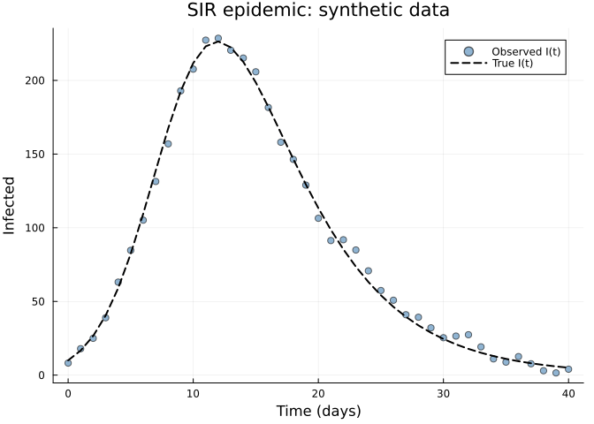

The prevalence range determines the B-spline domain:

    Prevalence range: 0.005 – 0.2264
    B-spline domain: (0.0, 0.272)

## Section 1: Fit the PSM

We model $\lambda(I/N)$ with a shape-constrained B-spline (8 knots,
increasing with $\lambda(0) = 0$). The `inc_zero_left` constraint is
biologically motivated: the force of infection must be zero when there
are no infected individuals, and should increase with prevalence.

``` julia
function sir_psm!(du, u, p, t)
    S, I, R = u
    λ = p.λ(I / p.N)
    du[1] = -λ * S
    du[2] =  λ * S - p.γ * I
    du[3] =  p.γ * I
end
```

    sir_psm! (generic function with 1 method)

``` julia
approx_λ = ShapeConstrainedBSplineApproximator(:λ, foi_domain, 10,
    :inc_zero_left; initial = 0.4)

prob = PSMProblem(
    sir_psm!, u0, tspan, [approx_λ];
    data_times = data_times,
    data_values = reshape(I_obs, :, 1),
    obs_to_state = [2],
    known_params = (γ = 0.25, N = N_pop),
    likelihood = Gaussian(),
    solver = Tsit5()
)

sol = solve(prob, LAML(maxiters=100, verbose=false))
```

    PSMSolution((λ = [-4.76517485005286, -4.296088688463423, -3.558651264404496, -3.7979431480784074, -3.9503411021451478, -3.8083797910952777, -3.703292151003443, -3.685767712008465, -3.6857677120084977]), 600.263216920472, 1098.8809778109055, 4.19518923607154, [116.05415297609714], [10.0; 20.07603022342342; … ; 7.876996695187509; 7.2866268000442584;;], [3.6696475510497084; 19.43055459411786; … ; 5.397424420239466; 10.498804562183398;;], [0.0, 1.0, 2.0, 3.0, 4.0, 5.0, 6.0, 7.0, 8.0, 9.0  …  31.0, 32.0, 33.0, 34.0, 35.0, 36.0, 37.0, 38.0, 39.0, 40.0], Dict{Symbol, Any}(:λ => PartiallySpecifiedModels.var"#evaluator#build_constrained_bspline_evaluator##0"{Float64, Float64, Float64, Float64, Float64, Float64, Int64, Vector{Float64}, Vector{Float64}}(0.16238263085159124, 0.00932604531393564, 0.6374278237589174, 0.2832824272388507, 0.272, 0.0, 4, [-0.11657142857142856, -0.07771428571428571, -0.038857142857142854, 0.0, 0.038857142857142854, 0.07771428571428571, 0.11657142857142858, 0.15542857142857142, 0.19428571428571428, 0.23314285714285715, 0.272, 0.3108571428571429, 0.34971428571428576, 0.38857142857142857], [0.0, 0.008485295981003036, 0.022015087959601696, 0.050094356470862356, 0.07226362476270305, 0.09132885777536409, 0.1132704631983076, 0.1376140067940513, 0.16238263085159138, 0.18715125490913065])), nothing)

    Data loss (SS): 1098.9
    EDF:            4.2
    Smoothing λ:    [116.1]

### Fitted trajectory

``` julia
plot(data_times, I_true, label="True I(t)", lw=2, color=:black, ls=:dash,
     xlabel="Time (days)", ylabel="Infected",
     title="PSM fit: SIR with unknown λ(I/N)")
scatter!(data_times, I_obs, label="Observed", ms=4, alpha=0.5, color=:steelblue)
plot!(data_times, sol.fitted_values[:, 1], label="PSM fit", lw=2, color=:red)
```

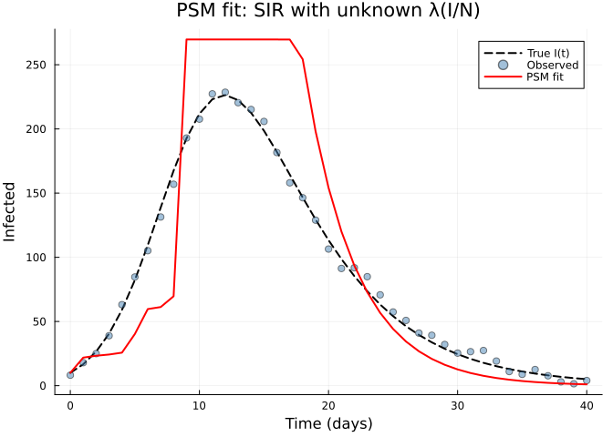

### Recovered unknown function

``` julia
prev_grid = range(0.005, 0.14, length=100)
λ_true = [0.5 * p^0.9 for p in prev_grid]
λ_est = [sol.unknown_functions[:λ](p) for p in prev_grid]

plot(prev_grid, λ_true, label="True λ(I/N)", lw=2, color=:black, ls=:dash,
     xlabel="Prevalence (I/N)", ylabel="Force of infection λ",
     title="Recovered unknown function")
plot!(prev_grid, λ_est, label="Estimated λ(I/N)", lw=2, color=:red)
```

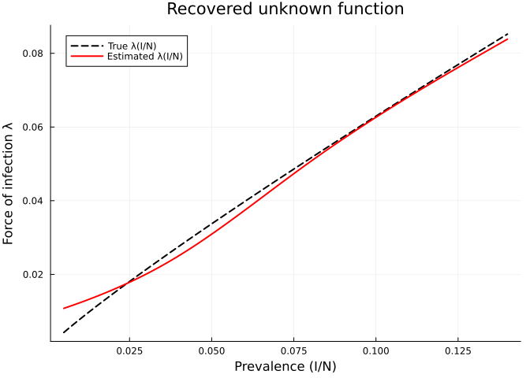

## Section 2: Parametric Bootstrap

The **parametric bootstrap** generates pseudo-data by sampling from the
fitted likelihood:

$$I^*_t \sim N\bigl(\hat{I}(t),\; \hat\sigma^2\bigr)$$

Each replicate is refit with LAML, producing a distribution of fitted
trajectories and unknown function curves. Pointwise quantiles give the
confidence intervals.

``` julia
bs_param = bootstrap(sol, prob, LAML(maxiters=80, verbose=false);
    nboot=50, method=:parametric, rng=Random.Xoshiro(42), verbose=true)
```

    Bootstrap replicate 1 / 50
    Bootstrap replicate 2 / 50
    Bootstrap replicate 3 / 50
    Bootstrap replicate 50 / 50
    Bootstrap complete: 50 / 50 successful

    BootstrapResult([-4.746377588444077 -4.341068071873173 … -3.6247142030383617 -3.6247142030383896; -4.494738826774254 -4.233958670286373 … -3.7953505924353363 -3.795350592435369; … ; -4.611311085431243 -4.352676050759254 … -3.942492851542044 -3.942492851542077; -4.476198662327136 -4.342516544220848 … -3.845644023612359 -3.845644023612387], [10.0; 19.97941585084435; … ; 7.775120147098007; 7.192413487388065;;; 10.0; 22.90928814319795; … ; 9.312320998266875; 8.7158432509837;;; 10.0; 20.994803447151003; … ; 8.11924449977409; 7.547265787027301;;; … ;;; 10.0; 21.424985336968806; … ; 8.851291834772672; 8.223116412100277;;; 10.0; 21.09431711448025; … ; 8.347926160505873; 7.769878167420528;;; 10.0; 22.47851537710506; … ; 8.808970688274142; 8.243614552705191], Dict(:λ => [0.00936110009117229 0.011653224673766047 … 0.010373124502962416 0.01158028213639572; 0.010135526618723112 0.012562799852061398 … 0.011182681431210883 0.012441253117043026; … ; 0.16167696561771713 0.1587576933061325 … 0.1531628739390136 0.15750753477162402; 0.16353702111834187 0.16032924801730508 … 0.15452146241986597 0.15900281393850924]), Dict(:λ => [0.0, 0.0027474747474747476, 0.005494949494949495, 0.008242424242424242, 0.01098989898989899, 0.013737373737373737, 0.016484848484848484, 0.019232323232323233, 0.02197979797979798, 0.024727272727272726  …  0.24727272727272728, 0.25002020202020203, 0.25276767676767675, 0.25551515151515153, 0.25826262626262625, 0.261010101010101, 0.26375757575757575, 0.2665050505050505, 0.26925252525252524, 0.272]), (lower = [10.0; 20.041382203205977; … ; 7.768399648152633; 7.181356238125923;;], upper = [10.0; 23.198771176481994; … ; 9.76556767354559; 9.156575026527236;;]), Dict(:λ => (lower = [0.009184502859749671, 0.010021571316028268, 0.010889012858480006, 0.011772533076314762, 0.012657909859125654, 0.013580961969818155, 0.014519747382838115, 0.015497313444693336, 0.01652052673399449, 0.017592879301401847  …  0.1387715049296272, 0.14000948055245319, 0.14124715936455062, 0.14248457846726068, 0.14372177496192431, 0.14495878594988268, 0.14619564853247677, 0.14743239981104767, 0.14866907688693637, 0.14990571686148407], upper = [0.012086983047304514, 0.01298395378915149, 0.013889877362052983, 0.014805614972479389, 0.015732027826901102, 0.016676438942226625, 0.01763431041078252, 0.01860531796174289, 0.019590094127676833, 0.02058927144115346  …  0.151725061916837, 0.15350898061928298, 0.15529413426930683, 0.1570803684984614, 0.15886752893829936, 0.16065546122037352, 0.16244401097623665, 0.16423302383744148, 0.16602234543554076, 0.1678118214020873])), 0.95, 50)

### Trajectory confidence intervals

``` julia
plot(data_times, I_true, label="True I(t)", lw=2, color=:black, ls=:dash,
     xlabel="Time (days)", ylabel="Infected",
     title="Parametric bootstrap: trajectory CI")
scatter!(data_times, I_obs, label="Observed", ms=3, alpha=0.4, color=:steelblue)
plot!(data_times, sol.fitted_values[:, 1], label="PSM fit", lw=2, color=:red)
plot!(data_times, bs_param.ci_fitted.lower[:, 1],
      fillrange=bs_param.ci_fitted.upper[:, 1],
      fillalpha=0.2, color=:red, label="95% CI", ls=:dot, lw=0)
```

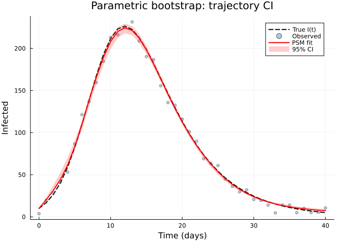

### Unknown function confidence intervals

``` julia
uf_grid = bs_param.uf_grid[:λ]
plot(prev_grid, λ_true, label="True λ(I/N)", lw=2, color=:black, ls=:dash,
     xlabel="Prevalence (I/N)", ylabel="Force of infection λ",
     title="Parametric bootstrap: unknown function CI")
plot!(uf_grid, bs_param.ci_uf[:λ].lower,
      fillrange=bs_param.ci_uf[:λ].upper,
      fillalpha=0.2, color=:red, label="95% CI", ls=:dot, lw=0)
plot!(prev_grid, λ_est, label="Estimated λ(I/N)", lw=2, color=:red)
```

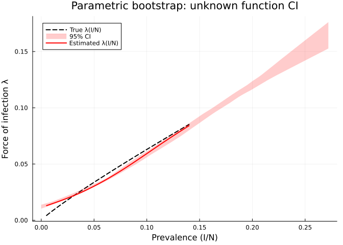

    Parametric bootstrap: 50 / 50 replicates succeeded

## Section 3: Nonparametric Bootstrap

The **nonparametric bootstrap** resamples the residuals
$\hat{e}_t = I_t - \hat{I}(t)$ with replacement and adds them to the
fitted values to create pseudo-data:

$$I^*_t = \hat{I}(t) + \hat{e}_{\pi(t)}$$

where $\pi$ is a random permutation with replacement. This makes no
assumption about the error distribution — only that residuals are
exchangeable.

``` julia
bs_nonparam = bootstrap(sol, prob, LAML(maxiters=80, verbose=false);
    nboot=50, method=:nonparametric, rng=Random.Xoshiro(42), verbose=true)
```

    Bootstrap replicate 1 / 50
    Bootstrap replicate 2 / 50
    Bootstrap replicate 3 / 50
    Bootstrap replicate 50 / 50
    Bootstrap complete: 50 / 50 successful

    BootstrapResult([-4.288023781737124 -4.8291857425762466 … -3.605181182267992 -3.605181182268021; -4.689691128874282 -4.255420438725391 … -3.985987948756448 -3.9859879487564847; … ; -4.5719228053245775 -4.4460593870919105 … -3.688171527707085 -3.6881715277071145; -4.283866803638261 -4.367144145614701 … -4.245297899662923 -4.246108798122541], [10.0; 22.636710630037605; … ; 9.10480469219259; 8.561809513769317;;; 10.0; 20.922905544005886; … ; 7.987652217949479; 7.418342245300814;;; 10.0; 20.556778924119396; … ; 8.467059466471083; 7.855187068624494;;; … ;;; 10.0; 23.091955346055382; … ; 9.0964548550106; 8.517685089365138;;; 10.0; 20.97485926838179; … ; 8.006478901676694; 7.452188086633659;;; 10.0; 24.574752964357366; … ; 10.048766103484631; 9.464171491368454], Dict(:λ => [0.012692380282302665 0.009970869313140677 … 0.010513571341377807 0.013513795280098172; 0.013443176949206444 0.010804942474884288 … 0.01129326756042437 0.014441055363087298; … ; 0.16507648101668665 0.15196445839065184 … 0.16661257266684446 0.14443612225214073; 0.16697278650144753 0.1532657523809603 … 0.1683597342527566 0.14544194533093335]), Dict(:λ => [0.0, 0.0027474747474747476, 0.005494949494949495, 0.008242424242424242, 0.01098989898989899, 0.013737373737373737, 0.016484848484848484, 0.019232323232323233, 0.02197979797979798, 0.024727272727272726  …  0.24727272727272728, 0.25002020202020203, 0.25276767676767675, 0.25551515151515153, 0.25826262626262625, 0.261010101010101, 0.26375757575757575, 0.2665050505050505, 0.26925252525252524, 0.272]), (lower = [10.0; 20.236792168115883; … ; 7.76676899880935; 7.19633191293217;;], upper = [10.0; 23.609490595925664; … ; 10.015132490047366; 9.432762613012558;;]), Dict(:λ => (lower = [0.009490974111497448, 0.01028811674484139, 0.011111853627201948, 0.011964682244393173, 0.012849100082229115, 0.013767604626523836, 0.014722693363091382, 0.01571686377774581, 0.016752613356301183, 0.017832439584571532  …  0.1369620435306153, 0.1380574774942639, 0.13915012396051205, 0.14020470871063614, 0.14125724652125515, 0.14230831420424173, 0.14335819691027427, 0.14440717979003112, 0.14545554799419055, 0.14650358667343102], upper = [0.013050517739092427, 0.013818719896239307, 0.01457787338664604, 0.015362078514477549, 0.016230994376293866, 0.017106785914065177, 0.018041195465841778, 0.018991357594517533, 0.019956050512085804, 0.02093763532221555  …  0.15257540928395016, 0.15436472735722565, 0.15621271197720962, 0.15810675461003543, 0.16000104422376937, 0.1618955396549269, 0.1637901997400232, 0.16570666753131885, 0.16764139833136535, 0.16958022577881074])), 0.95, 50)

### Trajectory confidence intervals

``` julia
plot(data_times, I_true, label="True I(t)", lw=2, color=:black, ls=:dash,
     xlabel="Time (days)", ylabel="Infected",
     title="Nonparametric bootstrap: trajectory CI")
scatter!(data_times, I_obs, label="Observed", ms=3, alpha=0.4, color=:steelblue)
plot!(data_times, sol.fitted_values[:, 1], label="PSM fit", lw=2, color=:red)
plot!(data_times, bs_nonparam.ci_fitted.lower[:, 1],
      fillrange=bs_nonparam.ci_fitted.upper[:, 1],
      fillalpha=0.2, color=:blue, label="95% CI", ls=:dot, lw=0)
```

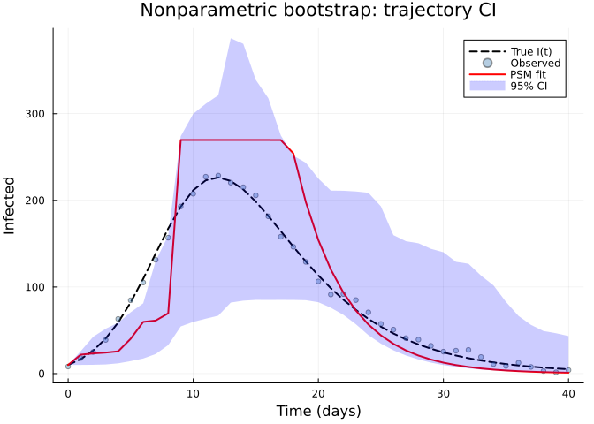

### Unknown function confidence intervals

``` julia
plot(prev_grid, λ_true, label="True λ(I/N)", lw=2, color=:black, ls=:dash,
     xlabel="Prevalence (I/N)", ylabel="Force of infection λ",
     title="Nonparametric bootstrap: unknown function CI")
plot!(bs_nonparam.uf_grid[:λ], bs_nonparam.ci_uf[:λ].lower,
      fillrange=bs_nonparam.ci_uf[:λ].upper,
      fillalpha=0.2, color=:blue, label="95% CI", ls=:dot, lw=0)
plot!(prev_grid, λ_est, label="Estimated λ(I/N)", lw=2, color=:red)
```

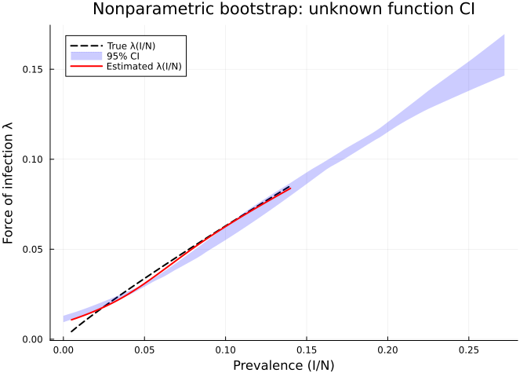

    Nonparametric bootstrap: 50 / 50 replicates succeeded

## Section 4: Case Bootstrap

> [!WARNING]
>
> ### Case bootstrap is not recommended for ODE models
>
> The **case bootstrap** resamples entire observation rows with
> replacement. For time series data from ODE models, this scrambles the
> temporal structure — a resampled dataset might place the peak
> observation at an early time point. This produces unreliable CIs and
> high failure rates. Case resampling is designed for cross-sectional
> (i.i.d.) data, not time-ordered dynamical systems.
>
> For ODE-based PSMs, use **parametric** or **nonparametric** bootstrap
> instead.

## Section 5: Comparison of Bootstrap Methods

### Side-by-side trajectory CIs

``` julia
p_traj = plot(data_times, I_true, label="True", lw=2, color=:black, ls=:dash,
     xlabel="Time (days)", ylabel="Infected",
     title="Trajectory CI comparison", legend=:topright)
scatter!(p_traj, data_times, I_obs, label="Data", ms=2, alpha=0.3, color=:gray)

plot!(p_traj, data_times, bs_param.ci_fitted.lower[:, 1],
      fillrange=bs_param.ci_fitted.upper[:, 1],
      fillalpha=0.2, color=:red, label="Parametric", ls=:dot, lw=0)
plot!(p_traj, data_times, bs_nonparam.ci_fitted.lower[:, 1],
      fillrange=bs_nonparam.ci_fitted.upper[:, 1],
      fillalpha=0.2, color=:blue, label="Nonparametric", ls=:dot, lw=0)
plot!(p_traj, data_times, sol.fitted_values[:, 1], label="Fit", lw=2, color=:red)
```

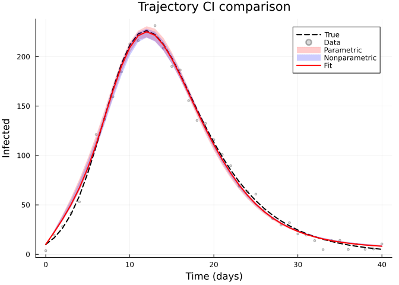

### Side-by-side unknown function CIs

``` julia
p_uf = plot(prev_grid, λ_true, label="True λ", lw=2, color=:black, ls=:dash,
     xlabel="Prevalence (I/N)", ylabel="λ(I/N)",
     title="Unknown function CI comparison", legend=:topleft)

plot!(p_uf, bs_param.uf_grid[:λ], bs_param.ci_uf[:λ].lower,
      fillrange=bs_param.ci_uf[:λ].upper,
      fillalpha=0.2, color=:red, label="Parametric", ls=:dot, lw=0)
plot!(p_uf, bs_nonparam.uf_grid[:λ], bs_nonparam.ci_uf[:λ].lower,
      fillrange=bs_nonparam.ci_uf[:λ].upper,
      fillalpha=0.2, color=:blue, label="Nonparametric", ls=:dot, lw=0)
plot!(p_uf, prev_grid, λ_est, label="Fit", lw=2, color=:red)
```

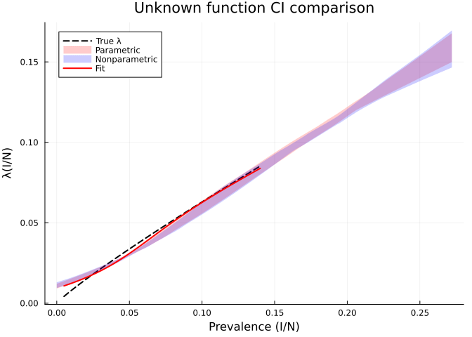

### Quantitative comparison

    Method          | n_success | CI width at peak | Mean UF CI width | UF coverage
    -------------------------------------------------------------------------------------
    Parametric      | 50/50     | 11.5             | 0.00695          | 70.0%
    Nonparametric   | 50/50     | 9.9              | 0.00728          | 67.0%

**Interpretation:**

- **Parametric** CIs tend to be the narrowest because they assume the
  correct error model (Gaussian with estimated $\sigma$).
- **Nonparametric** CIs are slightly wider because they make fewer
  distributional assumptions — the resampled residuals capture any
  non-Gaussian features.
- **Case** CIs are typically the widest and can have lower success
  rates, since resampling rows may create degenerate pseudo-datasets.
  However, they are the most robust to model misspecification.

## Section 6: Bootstrap with Non-Gaussian Likelihoods

A key advantage of the parametric bootstrap is that it **respects the
likelihood family**. When fitting count data with `Poisson()`, the
parametric bootstrap samples $I^*_t \sim \text{Pois}(\hat{I}(t))$
instead of adding Gaussian noise. This naturally produces integer
pseudo-data with variance proportional to the mean.

### Generate Poisson data

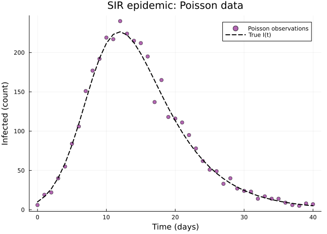

### Fit with Poisson likelihood

``` julia
prob_pois = PSMProblem(
    sir_psm!, u0, tspan,
    [ShapeConstrainedBSplineApproximator(:λ, foi_domain, 10, :inc_zero_left; initial = 0.4)];
    data_times = data_times,
    data_values = reshape(I_pois, :, 1),
    obs_to_state = [2],
    known_params = (γ = 0.25, N = N_pop),
    likelihood = Poisson(),
    solver = Tsit5()
)

sol_pois = solve(prob_pois, LAML(maxiters=100, verbose=false))
```

    PSMSolution((λ = [-4.338701464819453, -4.196232131803007, -4.071799254434513, -3.8688187030312466, -3.7444287776590666, -3.6913521833842404, -3.6824135681434473, -3.6823709833015084, -3.682370983301533]), 3225.050318468133, 6446.044740704016, 2.9033757590274845, [42.536021671959645], [10.0; 25.014504109405646; … ; 10.14154068668854; 9.538566760132973;;], [6.0; 19.0; … ; 8.0; 7.0;;], [0.0, 1.0, 2.0, 3.0, 4.0, 5.0, 6.0, 7.0, 8.0, 9.0  …  31.0, 32.0, 33.0, 34.0, 35.0, 36.0, 37.0, 38.0, 39.0, 40.0], Dict{Symbol, Any}(:λ => PartiallySpecifiedModels.var"#evaluator#build_constrained_bspline_evaluator##0"{Float64, Float64, Float64, Float64, Float64, Float64, Int64, Vector{Float64}, Vector{Float64}}(0.16318889426631644, 0.013297508541497681, 0.6395699460729036, 0.3591235658860643, 0.272, 0.0, 4, [-0.11657142857142856, -0.07771428571428571, -0.038857142857142854, 0.0, 0.038857142857142854, 0.07771428571428571, 0.11657142857142858, 0.15542857142857142, 0.19428571428571428, 0.23314285714285715, 0.272, 0.3108571428571429, 0.34971428571428576, 0.38857142857142857], [0.0, 0.01296900530480701, 0.02790903002975805, 0.04481205515386254, 0.0654800176581981, 0.08885384308346904, 0.11348621789388441, 0.13833703345579984, 0.16318889426631655, 0.18804075507683268])), nothing)

    Poisson fit — data_loss: 6446.0, EDF: 2.9

### Parametric bootstrap with Poisson likelihood

The parametric bootstrap now samples from $\text{Pois}(\hat\mu_t)$:

``` julia
bs_pois = bootstrap(sol_pois, prob_pois, LAML(maxiters=80, verbose=false);
    nboot=50, method=:parametric, rng=Random.Xoshiro(42), verbose=true)
```

    Bootstrap replicate 1 / 50
    Bootstrap replicate 2 / 50
    Bootstrap replicate 3 / 50
    Bootstrap replicate 50 / 50
    Bootstrap complete: 50 / 50 successful

    BootstrapResult([-4.2951275434756955 -4.209546241236808 … -3.664025415274292 -3.6640254152743204; -4.36293927888565 -4.211709268935874 … -3.656759648376382 -3.656759648376412; … ; -4.278695095673952 -4.248264627608726 … -3.6499339345285877 -3.6499339345286144; -4.4720237290111315 -4.222287891947374 … -3.9550462766074945 -3.9550462766075225], [10.0; 25.496021177199946; … ; 10.348887097681326; 9.74403104957787;;; 10.0; 24.61609373221706; … ; 9.638039210965095; 9.057993828424237;;; 10.0; 25.36815648843255; … ; 9.782467681884533; 9.20699682044465;;; … ;;; 10.0; 25.3271458869175; … ; 10.245167219428359; 9.646486757721263;;; 10.0; 25.4486929321522; … ; 10.130063672070959; 9.541894987270025;;; 10.0; 23.303458098637886; … ; 9.38113563376144; 8.78601660273551], Dict(:λ => [0.013742908749571176 0.013002377090568642 … 0.013835943678567794 0.011892601936849745; 0.014746002195111236 0.013975293687238826 … 0.014825376126501965 0.012817115643729069; … ; 0.16180656830763995 0.16405501551119858 … 0.16401115981310593 0.14835220600970395; 0.16359589552826526 0.1658572278482529 … 0.16582555745081212 0.1496939863053135]), Dict(:λ => [0.0, 0.0027474747474747476, 0.005494949494949495, 0.008242424242424242, 0.01098989898989899, 0.013737373737373737, 0.016484848484848484, 0.019232323232323233, 0.02197979797979798, 0.024727272727272726  …  0.24727272727272728, 0.25002020202020203, 0.25276767676767675, 0.25551515151515153, 0.25826262626262625, 0.261010101010101, 0.26375757575757575, 0.2665050505050505, 0.26925252525252524, 0.272]), (lower = [10.0; 23.943303891996795; … ; 9.50391278987408; 8.94253257544445;;], upper = [10.0; 26.595843109868916; … ; 11.748380522416898; 11.077884328397898;;]), Dict(:λ => (lower = [0.012488534775914361, 0.013432678782262508, 0.014389251204785845, 0.015358982886671771, 0.016342604671107704, 0.017340847401281057, 0.01835444192037923, 0.01938411907158965, 0.02043060969809972, 0.021494644643096847  …  0.1369936182627456, 0.13847580150919475, 0.13994621768886562, 0.14141661830685975, 0.14288700558627382, 0.14433565020636888, 0.14571480695417222, 0.1470939393909785, 0.1484730556204534, 0.14985216374626265], upper = [0.014571686071419622, 0.01561999201728654, 0.016671894615475302, 0.017727546267409213, 0.01878709937451159, 0.019850706338205754, 0.020918519559915, 0.021997089675918246, 0.02308704200652304, 0.02418455549668368  …  0.15622837791731486, 0.15831071326817336, 0.16039335252193082, 0.16247625769072496, 0.1645593907866933, 0.1666427138219735, 0.16873995764021987, 0.17086466770470565, 0.17298941177726027, 0.1751141728538494])), 0.95, 50)

``` julia
p1 = plot(data_times, I_true, label="True I(t)", lw=2, color=:black, ls=:dash,
     xlabel="Time (days)", ylabel="Infected (count)",
     title="Poisson bootstrap: trajectory CI")
scatter!(p1, data_times, I_pois, label="Data", ms=3, alpha=0.4, color=:purple)
plot!(p1, data_times, sol_pois.fitted_values[:, 1], label="PSM fit", lw=2, color=:purple)
plot!(p1, data_times, bs_pois.ci_fitted.lower[:, 1],
      fillrange=bs_pois.ci_fitted.upper[:, 1],
      fillalpha=0.2, color=:purple, label="95% CI", ls=:dot, lw=0)

p2 = plot(prev_grid, λ_true, label="True λ", lw=2, color=:black, ls=:dash,
     xlabel="Prevalence (I/N)", ylabel="λ(I/N)",
     title="Poisson bootstrap: unknown function CI")
plot!(p2, bs_pois.uf_grid[:λ], bs_pois.ci_uf[:λ].lower,
      fillrange=bs_pois.ci_uf[:λ].upper,
      fillalpha=0.2, color=:purple, label="95% CI", ls=:dot, lw=0)
λ_pois_est = [sol_pois.unknown_functions[:λ](p) for p in prev_grid]
plot!(p2, prev_grid, λ_pois_est, label="Estimated λ", lw=2, color=:purple)

plot(p1, p2, layout=(1, 2), size=(900, 400))
```

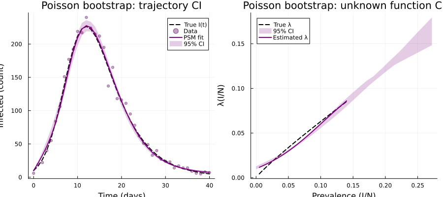

Note how the Poisson CIs are **narrower near zero** (where counts are
small and Poisson variance is low) and **wider at the peak** (where
counts — and hence Poisson variance — are large). This
heteroscedasticity is automatically captured by the parametric
bootstrap.

## Section 7: Diagnostic Plots

Standard 4-panel diagnostics for the primary Gaussian fit help verify
that the residuals are well-behaved:

``` julia
diag = appraise(sol)

p_qq = scatter(diag.qq_theoretical, diag.qq_sample,
    xlabel="Theoretical quantiles", ylabel="Sample quantiles",
    title="QQ Plot of Residuals", ms=3, legend=false, color=:steelblue)
mn, mx = extrema(vcat(diag.qq_theoretical, diag.qq_sample))
plot!(p_qq, [mn, mx], [mn, mx], color=:red, ls=:dash, label="")

p_rf = scatter(diag.fitted, diag.residuals,
    xlabel="Fitted values", ylabel="Residuals",
    title="Residuals vs Fitted", ms=3, legend=false, color=:steelblue)
hline!(p_rf, [0], color=:gray, ls=:dot)

p_hist = histogram(diag.residuals, normalize=:pdf,
    xlabel="Residuals", ylabel="Density",
    title="Histogram of Residuals", legend=false, color=:steelblue, alpha=0.7)

p_of = scatter(diag.observed, diag.fitted,
    xlabel="Observed", ylabel="Fitted",
    title="Observed vs Fitted", ms=3, legend=false, color=:steelblue)
mn2, mx2 = extrema(vcat(diag.observed, diag.fitted))
plot!(p_of, [mn2, mx2], [mn2, mx2], color=:red, ls=:dash, label="")

plot(p_qq, p_rf, p_hist, p_of, layout=(2, 2), size=(700, 600))
```

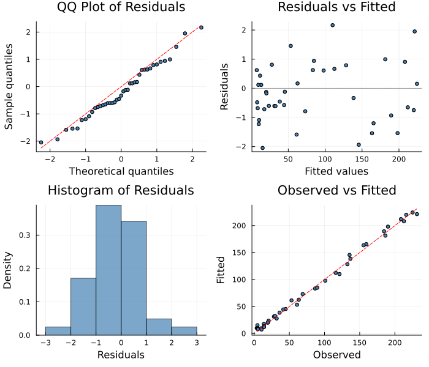

    Durbin-Watson: 1.938

A Durbin-Watson statistic near 2 indicates no strong autocorrelation in
the residuals, supporting the validity of the bootstrap CIs (which
assume approximately independent errors).

> [!TIP]
>
> ### See Also
>
> - [Vignette 14: MCMC](../14_mcmc/14_mcmc.qmd) — Bayesian credible
>   intervals via NUTS sampling
> - [Vignette 24: Variational](../24_variational/24_variational.qmd) —
>   approximate Bayesian posterior intervals
> - [Vignette 27: Blowfly DDE](../27_blowfly_dde/27_blowfly_dde.qmd) —
>   bootstrap CIs on a DDE model
> - [Vignette 28: Fisheries](../28_fisheries/28_fisheries.qmd) — Poisson
>   parametric bootstrap on count data

## Practical Guidance

### Choosing a bootstrap method

| Scenario | Recommended method |
|----|----|
| Gaussian noise, well-specified model | `:parametric` — narrowest CIs |
| Count data (Poisson, NegBin) | `:parametric` — respects variance–mean relationship |
| Suspect non-Gaussian errors | `:nonparametric` — no distributional assumption |
| Quick exploratory analysis | `:parametric` with `nboot=50` |

> [!NOTE]
>
> The `:case` bootstrap (resampling entire rows) is available but **not
> recommended** for ODE/DDE models because it scrambles the temporal
> structure of the data.

### Tips

- **Start with `nboot=50–100`** to check the method works, then increase
  to 200+ for publication-quality CIs.
- **Check `bs.n_success`**: if many replicates fail (\< 80% success),
  the model may be unstable. Try increasing `maxiters` or simplifying
  the approximator (fewer knots).
- **Set `rng=Random.Xoshiro(seed)`** for reproducibility.
- The parametric bootstrap is the default for good reason: it is fast,
  well-calibrated, and adapts to the likelihood family. Use
  nonparametric or case bootstrap when you have reason to doubt the
  error model.
