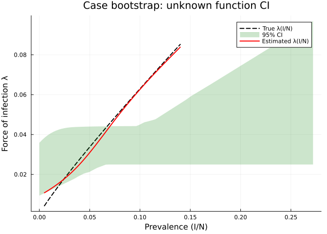
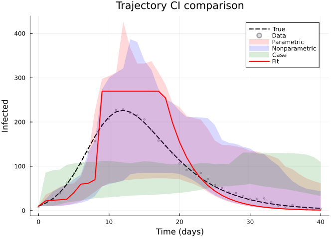
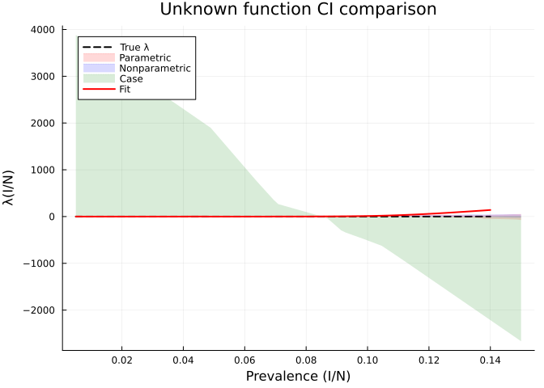
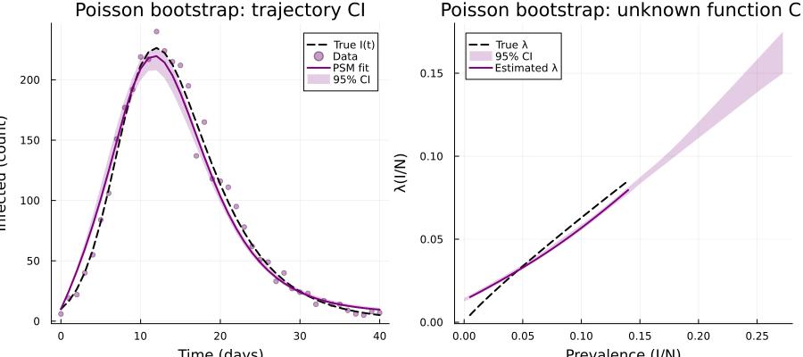
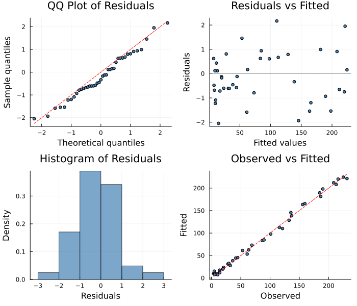

# Bootstrap Confidence Intervals
Simon Frost
2026-04-02

- [Overview](#overview)
- [Setup](#setup)
- [The Model: SIR with Unknown Force of
  Infection](#the-model-sir-with-unknown-force-of-infection)
  - [Generate synthetic data](#generate-synthetic-data)
- [Section 1: Fit the PSM](#section-1-fit-the-psm)
  - [Fitted trajectory](#fitted-trajectory)
  - [Recovered unknown function](#recovered-unknown-function)
- [Section 2: Parametric Bootstrap](#section-2-parametric-bootstrap)
  - [Trajectory confidence intervals](#trajectory-confidence-intervals)
  - [Unknown function confidence
    intervals](#unknown-function-confidence-intervals)
- [Section 3: Nonparametric
  Bootstrap](#section-3-nonparametric-bootstrap)
  - [Trajectory confidence
    intervals](#trajectory-confidence-intervals-1)
  - [Unknown function confidence
    intervals](#unknown-function-confidence-intervals-1)
- [Section 4: Case Bootstrap](#section-4-case-bootstrap)
  - [Trajectory confidence
    intervals](#trajectory-confidence-intervals-2)
  - [Unknown function confidence
    intervals](#unknown-function-confidence-intervals-2)
- [Section 5: Comparison of Bootstrap
  Methods](#section-5-comparison-of-bootstrap-methods)
  - [Side-by-side trajectory CIs](#side-by-side-trajectory-cis)
  - [Side-by-side unknown function
    CIs](#side-by-side-unknown-function-cis)
  - [Quantitative comparison](#quantitative-comparison)
- [Section 6: Bootstrap with Non-Gaussian
  Likelihoods](#section-6-bootstrap-with-non-gaussian-likelihoods)
  - [Generate Poisson data](#generate-poisson-data)
  - [Fit with Poisson likelihood](#fit-with-poisson-likelihood)
  - [Parametric bootstrap with Poisson
    likelihood](#parametric-bootstrap-with-poisson-likelihood)
- [Section 7: Diagnostic Plots](#section-7-diagnostic-plots)
- [Practical Guidance](#practical-guidance)
  - [Choosing a bootstrap method](#choosing-a-bootstrap-method)
  - [Tips](#tips)

## Overview

When fitting a partially specified model, point estimates of the unknown
function and fitted trajectories are rarely sufficient — we also need
**uncertainty quantification**. Bootstrap confidence intervals provide a
distribution-free (or distribution-aware) approach to estimating the
variability of both the fitted trajectories and the recovered unknown
functions.

`PartiallySpecifiedModels.jl` implements three bootstrap methods:

| Method | Description | Assumptions |
|----|----|----|
| `:parametric` | Simulate new data from the fitted likelihood (e.g., $N(\hat\mu, \hat\sigma)$ or $\text{Pois}(\hat\mu)$) | Correct likelihood family |
| `:nonparametric` | Resample residuals with replacement per state | Exchangeable residuals |
| `:case` | Resample entire observation rows with replacement | Weakest assumptions |

This vignette demonstrates all three methods on an SIR epidemic model
with a nonparametric force of infection, compares the resulting
confidence intervals, and shows how the parametric bootstrap adapts to
non-Gaussian likelihoods.

## Setup

``` julia
using PartiallySpecifiedModels
using PartiallySpecifiedModels: solve, appraise
using OrdinaryDiffEq
using Plots
using Statistics
using Random
Random.seed!(42)
```

    TaskLocalRNG()

## The Model: SIR with Unknown Force of Infection

We consider an SIR epidemic model where the force of infection
$\lambda(I/N)$ is unknown. The true transmission follows a **power-law**
form:

$$\lambda(I/N) = \beta \left(\frac{I}{N}\right)^\alpha, \quad \beta = 0.5, \; \alpha = 0.9$$

This departs slightly from the standard mass-action
$\lambda = \beta \cdot I/N$ ($\alpha = 1$), which makes the
nonparametric recovery more interesting.

``` julia
function sir_true!(du, u, p, t)
    S, I, R = u
    N = 1000.0
    prev = I / N
    λ = 0.5 * prev^0.9
    du[1] = -λ * S
    du[2] =  λ * S - 0.25 * I
    du[3] =  0.25 * I
end
```

    sir_true! (generic function with 1 method)

### Generate synthetic data

We simulate the true model and observe $I(t)$ daily with Gaussian noise
($\sigma = 5$):


The prevalence range determines the B-spline domain:

    Prevalence range: 0.005 – 0.2264

## Section 1: Fit the PSM

We model $\lambda(I/N)$ with a penalized cubic B-spline with 8 knots.
The PSM dynamics access the unknown function via `p.λ`:

``` julia
function sir_psm!(du, u, p, t)
    S, I, R = u
    λ = max(p.λ(I / p.N), 0.0)
    du[1] = -λ * S
    du[2] =  λ * S - p.γ * I
    du[3] =  p.γ * I
end
```

    sir_psm! (generic function with 1 method)

``` julia
approx_λ = BSplineApproximator(:λ, (0.005, 0.15), 8;
                                initial = x -> 0.4 * x)

prob = PSMProblem(
    sir_psm!, u0, tspan, [approx_λ];
    data_times = data_times,
    data_values = reshape(I_obs, :, 1),
    obs_to_state = [2],
    known_params = (γ = 0.25, N = N_pop),
    likelihood = Gaussian(),
    solver = Tsit5()
)

sol = solve(prob, LAML(maxiters=100, verbose=false))
```

    PSMSolution((λ = [0.09758565319894437, 0.009270725139760851, 0.08421361047493611, 0.06550381206284384, 3.175369910395505, 25.69584702290636, 93.6277028396349, 186.85631413470895]), 47880.51405579542, 83445.82131745663, 5.591621574281154, [0.010156092095362583], [10.0; 21.85546115966406; … ; 1.3342912060614918; 1.0391470374806748;;], [8.183212592741112; 17.9282139291035; … ; 1.4961592585731225; 4.012663709503041;;], [0.0, 1.0, 2.0, 3.0, 4.0, 5.0, 6.0, 7.0, 8.0, 9.0  …  31.0, 32.0, 33.0, 34.0, 35.0, 36.0, 37.0, 38.0, 39.0, 40.0], Dict{Symbol, Any}(:λ => DataInterpolations.CubicSpline{Vector{Float64}, Vector{Float64}, Vector{Float64}, Vector{Float64}, Vector{Float64}, Vector{Float64}, Float64}([0.09758565319894437, 0.009270725139760851, 0.08421361047493611, 0.06550381206284384, 3.175369910395505, 25.69584702290636, 93.6277028396349, 186.85631413470895], [0.005, 0.025714285714285714, 0.04642857142857143, 0.06714285714285714, 0.08785714285714286, 0.10857142857142857, 0.12928571428571428, 0.15], Float64[], DataInterpolations.CubicSplineParameterCache{Vector{Float64}}(Float64[], Float64[]), [0.0, 0.020714285714285713, 0.020714285714285716, 0.020714285714285713, 0.020714285714285713, 0.020714285714285713, 0.020714285714285713, 0.020714285714285713], [0.0, 899.7399067318181, -1316.0679675721483, 3054.9534131788128, 32844.23593877879, 136993.5315198577, 54184.98347715303, 0.0], DataInterpolations.ExtrapolationType.Extension, DataInterpolations.ExtrapolationType.Extension, FindFirstFunctions.Guesser{Vector{Float64}}([0.005, 0.025714285714285714, 0.04642857142857143, 0.06714285714285714, 0.08785714285714286, 0.10857142857142857, 0.12928571428571428, 0.15], Base.RefValue{Int64}(1), true), false, false)), nothing)

    Data loss (SS): 83445.8
    EDF:            5.59
    Smoothing λ:    [0.01016]

### Fitted trajectory

``` julia
plot(data_times, I_true, label="True I(t)", lw=2, color=:black, ls=:dash,
     xlabel="Time (days)", ylabel="Infected",
     title="PSM fit: SIR with unknown λ(I/N)")
scatter!(data_times, I_obs, label="Observed", ms=4, alpha=0.5, color=:steelblue)
plot!(data_times, sol.fitted_values[:, 1], label="PSM fit", lw=2, color=:red)
```


### Recovered unknown function

``` julia
prev_grid = range(0.005, 0.14, length=100)
λ_true = [0.5 * p^0.9 for p in prev_grid]
λ_est = [sol.unknown_functions[:λ](p) for p in prev_grid]

plot(prev_grid, λ_true, label="True λ(I/N)", lw=2, color=:black, ls=:dash,
     xlabel="Prevalence (I/N)", ylabel="Force of infection λ",
     title="Recovered unknown function")
plot!(prev_grid, λ_est, label="Estimated λ(I/N)", lw=2, color=:red)
```


## Section 2: Parametric Bootstrap

The **parametric bootstrap** generates pseudo-data by sampling from the
fitted likelihood:

$$I^*_t \sim N\bigl(\hat{I}(t),\; \hat\sigma^2\bigr)$$

Each replicate is refit with LAML, producing a distribution of fitted
trajectories and unknown function curves. Pointwise quantiles give the
confidence intervals.

``` julia
bs_param = bootstrap(sol, prob, LAML(maxiters=80, verbose=false);
    nboot=100, method=:parametric, rng=Random.Xoshiro(42), verbose=true)
```

    Bootstrap replicate 1 / 100
    Bootstrap replicate 2 / 100
    Bootstrap replicate 3 / 100
    Bootstrap replicate 50 / 100
    Bootstrap replicate 100 / 100
    Bootstrap complete: 100 / 100 successful

    BootstrapResult([0.0009749951351551756 0.014786646945874083 … 1.7817572293343371 13.105383350755826; -0.0012805327262923256 0.017743149940709017 … -34.779750532688794 -258.0901336244629; … ; -8.41759038307061e-6 0.015206487837485747 … 0.19794589786220868 0.2679588704074489; 3.892179222330637e-7 0.035269379621777404 … 6.681624836735863 -0.22622475004123507], [10.0; 11.612068788104924; … ; 4.765249267311295; 3.7111798610374778;;; 10.0; 10.939953334182912; … ; 50.30700304434725; 39.179552216455605;;; 10.0; 10.370989344740638; … ; 1.5799929805743549; 1.2304997714095827;;; … ;;; 10.0; 10.87931220410394; … ; 3.763361479277072; 2.9309088691063785;;; 10.0; 11.023197234471844; … ; 1.895117132363935; 1.4759187067028878;;; 10.0; 12.974224734580835; … ; 10.489029692197173; 8.168867293656318], Dict(:λ => [0.0009749951351551756 -0.0012805327262923256 … -8.41759038307061e-6 3.892179222330636e-7; 0.0018249156836210297 3.260527176555624e-5 … 0.0009734064938359665 0.0012531597896067049; … ; 12.129829817022978 -239.0853889271934 … 0.26283459142318044 0.4611825803120782; 13.105383350755826 -258.0901336244629 … 0.2679588704074489 -0.22622475004123507]), Dict(:λ => [0.005, 0.006464646464646465, 0.00792929292929293, 0.009393939393939394, 0.010858585858585859, 0.012323232323232323, 0.013787878787878788, 0.015252525252525252, 0.016717171717171717, 0.01818181818181818  …  0.1368181818181818, 0.13828282828282829, 0.13974747474747476, 0.1412121212121212, 0.14267676767676768, 0.14414141414141415, 0.1456060606060606, 0.14707070707070707, 0.14853535353535355, 0.15]), (lower = [10.0; 10.028491047536642; … ; 0.9831213779809633; 0.7656557004989056;;], upper = [10.0; 35.93169271667122; … ; 66.75500287338764; 61.90652669443496;;]), Dict(:λ => (lower = [-0.008013845083696031, -0.004262136037016189, -0.001182240347298781, 0.0015442698674475873, 0.0035710315557588787, 0.004554477192846628, 0.005469980037332185, 0.006162679364972279, 0.006963817355822768, 0.007670779491883096  …  -37.84373535429719, -47.452535528384786, -49.37172738746969, -51.233680654452584, -53.0465722710624, -55.37892253915486, -57.97177223195909, -60.56162574200347, -64.10177420795551, -73.76725542903189], upper = [0.0564291794417912, 0.05391183987662282, 0.051401450915634944, 0.048904963163008054, 0.04934431113763667, 0.04813558252901538, 0.04710557975377362, 0.0503523175055961, 0.05310143520854921, 0.05347787387996432  …  29.95039505635836, 33.737007077909695, 37.60592591248596, 37.68265783994833, 39.1102486305469, 42.153743035523604, 45.30984187972342, 48.50605693448819, 51.72901612962955, 54.96534739495914])), 0.95, 100)

### Trajectory confidence intervals

``` julia
plot(data_times, I_true, label="True I(t)", lw=2, color=:black, ls=:dash,
     xlabel="Time (days)", ylabel="Infected",
     title="Parametric bootstrap: trajectory CI")
scatter!(data_times, I_obs, label="Observed", ms=3, alpha=0.4, color=:steelblue)
plot!(data_times, sol.fitted_values[:, 1], label="PSM fit", lw=2, color=:red)
plot!(data_times, bs_param.ci_fitted.lower[:, 1],
      fillrange=bs_param.ci_fitted.upper[:, 1],
      fillalpha=0.2, color=:red, label="95% CI", ls=:dot, lw=0)
```


### Unknown function confidence intervals

``` julia
uf_grid = bs_param.uf_grid[:λ]
plot(prev_grid, λ_true, label="True λ(I/N)", lw=2, color=:black, ls=:dash,
     xlabel="Prevalence (I/N)", ylabel="Force of infection λ",
     title="Parametric bootstrap: unknown function CI")
plot!(uf_grid, bs_param.ci_uf[:λ].lower,
      fillrange=bs_param.ci_uf[:λ].upper,
      fillalpha=0.2, color=:red, label="95% CI", ls=:dot, lw=0)
plot!(prev_grid, λ_est, label="Estimated λ(I/N)", lw=2, color=:red)
```


    Parametric bootstrap: 100 / 100 replicates succeeded

## Section 3: Nonparametric Bootstrap

The **nonparametric bootstrap** resamples the residuals
$\hat{e}_t = I_t - \hat{I}(t)$ with replacement and adds them to the
fitted values to create pseudo-data:

$$I^*_t = \hat{I}(t) + \hat{e}_{\pi(t)}$$

where $\pi$ is a random permutation with replacement. This makes no
assumption about the error distribution — only that residuals are
exchangeable.

``` julia
bs_nonparam = bootstrap(sol, prob, LAML(maxiters=80, verbose=false);
    nboot=100, method=:nonparametric, rng=Random.Xoshiro(42), verbose=true)
```

    Bootstrap replicate 1 / 100
    Bootstrap replicate 2 / 100
    Bootstrap replicate 3 / 100
    Bootstrap replicate 50 / 100
    Bootstrap replicate 100 / 100
    Bootstrap complete: 100 / 100 successful

    BootstrapResult([0.00020902959647040083 0.015032905493464128 … -17.329663950860102 16.034163520407; -0.006592949778270847 0.02119403289315518 … 1.1937825900787908 7.2612299256242805; … ; 0.0005217978601409822 0.021302502377338953 … 0.07858998546227951 0.08983654210689458; -0.003687484065779519 0.022833198505017697 … 0.20689232136784028 0.2578638715822613], [10.0; 12.149536845413703; … ; 34.20658441648047; 32.311543899642544;;; 10.0; 10.043777133124527; … ; 6.229803893649327; 4.851776151164635;;; 10.0; 12.876923780035597; … ; 1.7766543388797251; 1.3836597906853811;;; … ;;; 10.0; 10.835331628389765; … ; 0.8051906776862993; 0.6270831309203998;;; 10.0; 13.24494418391159; … ; 5.832462552708682; 4.6068603616304555;;; 10.0; 10.071094280652094; … ; 2.0547457048812334; 1.6002375641605533], Dict(:λ => [0.00020902959647040086 -0.006592949778270847 … 0.0005217978601409822 -0.003687484065779519; 0.00138131682701706 -0.0038753419821762436 … 0.0017880970346656503 -0.0018568508011404157; … ; 12.782370930415397 6.744586205230339 … 0.08906737129927544 0.25411938956143626; 16.034163520407 7.26122992562428 … 0.08983654210689458 0.2578638715822613]), Dict(:λ => [0.005, 0.006464646464646465, 0.00792929292929293, 0.009393939393939394, 0.010858585858585859, 0.012323232323232323, 0.013787878787878788, 0.015252525252525252, 0.016717171717171717, 0.01818181818181818  …  0.1368181818181818, 0.13828282828282829, 0.13974747474747476, 0.1412121212121212, 0.14267676767676768, 0.14414141414141415, 0.1456060606060606, 0.14707070707070707, 0.14853535353535355, 0.15]), (lower = [10.0; 10.04424577487275; … ; 1.0441320659478965; 0.8131708707047905;;], upper = [10.0; 25.85546574221447; … ; 46.61715734611968; 43.369578268959756;;]), Dict(:λ => (lower = [-0.007566152400075261, -0.004566649766532619, -0.0015855722426012095, 0.0013586550621077333, 0.003511711522682127, 0.004570473643210276, 0.005492699379565225, 0.006221261783701639, 0.007107798651823147, 0.007877863074748422  …  -10.111472396802558, -10.357448424300454, -12.031310173387862, -13.829902416977339, -15.695362813975128, -17.741950147854435, -19.931097746439917, -22.159709286849726, -23.506051482435367, -24.79261545468333], upper = [0.01754374194401709, 0.01736735790071653, 0.01720299601004127, 0.017045242214267786, 0.01689233922837724, 0.01773226579939782, 0.01871591665894052, 0.021869603547075955, 0.025061000661801683, 0.025894990573805524  …  44.8694199372722, 42.83222234916099, 43.7118307855184, 44.78847104250005, 45.93555577248287, 47.04351827585258, 48.90433898067502, 50.90613310202251, 48.9502082363163, 46.960648853738036])), 0.95, 100)

### Trajectory confidence intervals

``` julia
plot(data_times, I_true, label="True I(t)", lw=2, color=:black, ls=:dash,
     xlabel="Time (days)", ylabel="Infected",
     title="Nonparametric bootstrap: trajectory CI")
scatter!(data_times, I_obs, label="Observed", ms=3, alpha=0.4, color=:steelblue)
plot!(data_times, sol.fitted_values[:, 1], label="PSM fit", lw=2, color=:red)
plot!(data_times, bs_nonparam.ci_fitted.lower[:, 1],
      fillrange=bs_nonparam.ci_fitted.upper[:, 1],
      fillalpha=0.2, color=:blue, label="95% CI", ls=:dot, lw=0)
```


### Unknown function confidence intervals

``` julia
plot(prev_grid, λ_true, label="True λ(I/N)", lw=2, color=:black, ls=:dash,
     xlabel="Prevalence (I/N)", ylabel="Force of infection λ",
     title="Nonparametric bootstrap: unknown function CI")
plot!(bs_nonparam.uf_grid[:λ], bs_nonparam.ci_uf[:λ].lower,
      fillrange=bs_nonparam.ci_uf[:λ].upper,
      fillalpha=0.2, color=:blue, label="95% CI", ls=:dot, lw=0)
plot!(prev_grid, λ_est, label="Estimated λ(I/N)", lw=2, color=:red)
```


    Nonparametric bootstrap: 100 / 100 replicates succeeded

## Section 4: Case Bootstrap

The **case bootstrap** resamples entire observation rows $(t_i, I_i)$
with replacement. This is the most conservative method: it makes no
assumptions about the error structure or the design, and naturally
accounts for heteroscedasticity and dependence.

However, because time points can be duplicated or missing, the refit can
be less stable.

``` julia
bs_case = bootstrap(sol, prob, LAML(maxiters=80, verbose=false);
    nboot=100, method=:case, rng=Random.Xoshiro(42), verbose=true)
```

    Bootstrap replicate 1 / 100
    Bootstrap replicate 2 / 100
    Bootstrap replicate 3 / 100
    Bootstrap replicate 50 / 100
    Bootstrap replicate 100 / 100
    Bootstrap complete: 100 / 100 successful

    BootstrapResult([0.0044243612384198714 0.009501282836899343 … -0.8531674017585826 1.34450035123958; 0.09386461532506186 0.0857135290628584 … 0.030844518735574752 0.01655799898075935; … ; 0.004544575728011999 0.012332560759769599 … 0.05244254880700834 0.060512248607267664; 0.003302217177375578 0.009771674348165851 … 0.016103176912343753 0.07977354297170572], [10.0; 12.712582179535854; … ; 42.469385804364165; 38.544340435629;;; 10.0; 72.80872984851341; … ; 43.53610738578095; 41.080243603074756;;; 10.0; 31.55253600141489; … ; 71.13323658453115; 70.82393937032704;;; … ;;; 10.0; 12.112057534197282; … ; 42.196446959037566; 38.6219056800809;;; 10.0; 14.076093976821591; … ; 27.598426527739765; 25.261300166079046;;; 10.0; 12.12021832929393; … ; 41.26398859789304; 37.92921666902547], Dict(:λ => [0.0044243612384198714 0.09386461532506186 … 0.004544575728011999 0.003302217177375578; 0.004692303604722365 0.09328867285292977 … 0.005094456441098485 0.0036942369357266507; … ; 1.1343407551367033 0.017566559460815083 … 0.059941896041668864 0.07393046056062164; 1.34450035123958 0.01655799898075935 … 0.060512248607267664 0.07977354297170572]), Dict(:λ => [0.005, 0.006464646464646465, 0.00792929292929293, 0.009393939393939394, 0.010858585858585859, 0.012323232323232323, 0.013787878787878788, 0.015252525252525252, 0.016717171717171717, 0.01818181818181818  …  0.1368181818181818, 0.13828282828282829, 0.13974747474747476, 0.1412121212121212, 0.14267676767676768, 0.14414141414141415, 0.1456060606060606, 0.14707070707070707, 0.14853535353535355, 0.15]), (lower = [10.0; 10.079593944184655; … ; 36.005011822310586; 32.82058797891749;;], upper = [10.0; 86.00923474608476; … ; 121.02815054165232; 109.94764810028974;;]), Dict(:λ => (lower = [-0.009824072843112083, -0.0057888938657407124, -0.0018255530481511052, 0.001289835005037506, 0.004506351221321048, 0.005199179169443718, 0.00569537882833117, 0.006146554179009764, 0.0065687559931319126, 0.006906867658587982  …  -2070.9966855922507, -2137.1302447509547, -2203.2637394847297, -2269.3971778466903, -2335.530567889955, -2401.663917667639, -2467.797235232857, -2533.9305286387284, -2600.063805938367, -2666.1970751848885], upper = [3881.864189380041, 3815.718270085345, 3749.572346401814, 3683.4264139406087, 3617.2804683128984, 3551.134505129844, 3484.988520002611, 3418.8425085423632, 3352.696466360264, 3286.550389067479  …  4.80409311146861, 5.816316420291692, 6.887987359728194, 8.011674975951415, 9.179948315134723, 10.385376423451415, 11.297321883466115, 12.113599308387101, 12.936181238625117, 13.76191542152163])), 0.95, 100)

### Trajectory confidence intervals

``` julia
plot(data_times, I_true, label="True I(t)", lw=2, color=:black, ls=:dash,
     xlabel="Time (days)", ylabel="Infected",
     title="Case bootstrap: trajectory CI")
scatter!(data_times, I_obs, label="Observed", ms=3, alpha=0.4, color=:steelblue)
plot!(data_times, sol.fitted_values[:, 1], label="PSM fit", lw=2, color=:red)
plot!(data_times, bs_case.ci_fitted.lower[:, 1],
      fillrange=bs_case.ci_fitted.upper[:, 1],
      fillalpha=0.2, color=:green, label="95% CI", ls=:dot, lw=0)
```


### Unknown function confidence intervals

``` julia
plot(prev_grid, λ_true, label="True λ(I/N)", lw=2, color=:black, ls=:dash,
     xlabel="Prevalence (I/N)", ylabel="Force of infection λ",
     title="Case bootstrap: unknown function CI")
plot!(bs_case.uf_grid[:λ], bs_case.ci_uf[:λ].lower,
      fillrange=bs_case.ci_uf[:λ].upper,
      fillalpha=0.2, color=:green, label="95% CI", ls=:dot, lw=0)
plot!(prev_grid, λ_est, label="Estimated λ(I/N)", lw=2, color=:red)
```



    Case bootstrap: 100 / 100 replicates succeeded

## Section 5: Comparison of Bootstrap Methods

### Side-by-side trajectory CIs

``` julia
p_traj = plot(data_times, I_true, label="True", lw=2, color=:black, ls=:dash,
     xlabel="Time (days)", ylabel="Infected",
     title="Trajectory CI comparison", legend=:topright)
scatter!(p_traj, data_times, I_obs, label="Data", ms=2, alpha=0.3, color=:gray)

plot!(p_traj, data_times, bs_param.ci_fitted.lower[:, 1],
      fillrange=bs_param.ci_fitted.upper[:, 1],
      fillalpha=0.15, color=:red, label="Parametric", ls=:dot, lw=0)
plot!(p_traj, data_times, bs_nonparam.ci_fitted.lower[:, 1],
      fillrange=bs_nonparam.ci_fitted.upper[:, 1],
      fillalpha=0.15, color=:blue, label="Nonparametric", ls=:dot, lw=0)
plot!(p_traj, data_times, bs_case.ci_fitted.lower[:, 1],
      fillrange=bs_case.ci_fitted.upper[:, 1],
      fillalpha=0.15, color=:green, label="Case", ls=:dot, lw=0)
plot!(p_traj, data_times, sol.fitted_values[:, 1], label="Fit", lw=2, color=:red)
```



### Side-by-side unknown function CIs

``` julia
p_uf = plot(prev_grid, λ_true, label="True λ", lw=2, color=:black, ls=:dash,
     xlabel="Prevalence (I/N)", ylabel="λ(I/N)",
     title="Unknown function CI comparison", legend=:topleft)

plot!(p_uf, bs_param.uf_grid[:λ], bs_param.ci_uf[:λ].lower,
      fillrange=bs_param.ci_uf[:λ].upper,
      fillalpha=0.15, color=:red, label="Parametric", ls=:dot, lw=0)
plot!(p_uf, bs_nonparam.uf_grid[:λ], bs_nonparam.ci_uf[:λ].lower,
      fillrange=bs_nonparam.ci_uf[:λ].upper,
      fillalpha=0.15, color=:blue, label="Nonparametric", ls=:dot, lw=0)
plot!(p_uf, bs_case.uf_grid[:λ], bs_case.ci_uf[:λ].lower,
      fillrange=bs_case.ci_uf[:λ].upper,
      fillalpha=0.15, color=:green, label="Case", ls=:dot, lw=0)
plot!(p_uf, prev_grid, λ_est, label="Fit", lw=2, color=:red)
```



### Quantitative comparison

    Method          | n_success | CI width at peak | Mean UF CI width | UF coverage
    -------------------------------------------------------------------------------------
    Parametric      | 100/100   | 243.1            | 19.0             | 100.0%
    Nonparametric   | 100/100   | 219.6            | 14.5             | 100.0%
    Case            | 100/100   | 83.0             | 1630.0           | 100.0%

**Interpretation:**

- **Parametric** CIs tend to be the narrowest because they assume the
  correct error model (Gaussian with estimated $\sigma$).
- **Nonparametric** CIs are slightly wider because they make fewer
  distributional assumptions — the resampled residuals capture any
  non-Gaussian features.
- **Case** CIs are typically the widest and can have lower success
  rates, since resampling rows may create degenerate pseudo-datasets.
  However, they are the most robust to model misspecification.

## Section 6: Bootstrap with Non-Gaussian Likelihoods

A key advantage of the parametric bootstrap is that it **respects the
likelihood family**. When fitting count data with `Poisson()`, the
parametric bootstrap samples $I^*_t \sim \text{Pois}(\hat{I}(t))$
instead of adding Gaussian noise. This naturally produces integer
pseudo-data with variance proportional to the mean.

### Generate Poisson data


### Fit with Poisson likelihood

``` julia
prob_pois = PSMProblem(
    sir_psm!, u0, tspan,
    [BSplineApproximator(:λ, (0.005, 0.15), 8; initial = x -> 0.4 * x)];
    data_times = data_times,
    data_values = reshape(I_pois, :, 1),
    obs_to_state = [2],
    known_params = (γ = 0.25, N = N_pop),
    likelihood = Poisson(),
    solver = Tsit5()
)

sol_pois = solve(prob_pois, LAML(maxiters=100, verbose=false))
```

    PSMSolution((λ = [-0.00030968424512842777, 0.022687844966199456, 0.03333049144763127, 0.04109822280282176, 0.051439525396040735, 0.06378735876215778, 0.07721157391278635, 0.09229988561655644]), 1581.6054827522266, 3157.994625766305, 5.76274935087745, [61.72508381084035], [10.0; 15.587956088848221; … ; 4.8499129507617935; 3.7771160039836285;;], [9.0; 20.0; … ; 9.0; 3.0;;], [0.0, 1.0, 2.0, 3.0, 4.0, 5.0, 6.0, 7.0, 8.0, 9.0  …  31.0, 32.0, 33.0, 34.0, 35.0, 36.0, 37.0, 38.0, 39.0, 40.0], Dict{Symbol, Any}(:λ => DataInterpolations.CubicSpline{Vector{Float64}, Vector{Float64}, Vector{Float64}, Vector{Float64}, Vector{Float64}, Vector{Float64}, Float64}([-0.00030968424512842777, 0.022687844966199456, 0.03333049144763127, 0.04109822280282176, 0.051439525396040735, 0.06378735876215778, 0.07721157391278635, 0.09229988561655644], [0.005, 0.025714285714285714, 0.04642857142857143, 0.06714285714285714, 0.08785714285714286, 0.10857142857142857, 0.12928571428571428, 0.15], Float64[], DataInterpolations.CubicSplineParameterCache{Vector{Float64}}(Float64[], Float64[]), [0.0, 0.020714285714285713, 0.020714285714285716, 0.020714285714285713, 0.020714285714285713, 0.020714285714285713, 0.020714285714285713, 0.020714285714285713], [0.0, -42.84491628214699, -1.383023222872002, 8.176055684220085, 4.665955966627862, 1.2181488550726458, 5.512875231221231, 0.0], DataInterpolations.ExtrapolationType.Extension, DataInterpolations.ExtrapolationType.Extension, FindFirstFunctions.Guesser{Vector{Float64}}([0.005, 0.025714285714285714, 0.04642857142857143, 0.06714285714285714, 0.08785714285714286, 0.10857142857142857, 0.12928571428571428, 0.15], Base.RefValue{Int64}(1), true), false, false)), nothing)

    Poisson fit — data_loss: 3158.0, EDF: 5.76

### Parametric bootstrap with Poisson likelihood

The parametric bootstrap now samples from $\text{Pois}(\hat\mu_t)$:

``` julia
bs_pois = bootstrap(sol_pois, prob_pois, LAML(maxiters=80, verbose=false);
    nboot=100, method=:parametric, rng=Random.Xoshiro(42), verbose=true)
```

    Bootstrap replicate 1 / 100
    Bootstrap replicate 2 / 100
    Bootstrap replicate 3 / 100
    Bootstrap replicate 50 / 100
    Bootstrap replicate 100 / 100
    Bootstrap complete: 100 / 100 successful

    BootstrapResult([-0.00038156978576377415 0.01826590268764656 … 45.76757524458906 -0.6334128095444901; -0.001408200750349349 0.01674485651836282 … 21.08334301596352 67.31159487745172; … ; 0.0003470908490144276 0.02242668172926622 … 72.8835922566068 157.56071899742142; -0.009321622442234074 0.033597762803844695 … 1.9330559928374424 13.639287748071885], [10.0; 12.776911418668686; … ; 13.6110345259748; 10.600284348878501;;; 10.0; 11.995335012194408; … ; 2.764666616462353; 2.1531245261532357;;; 10.0; 18.55222609284681; … ; 6.612684206610899; 5.9167703362072706;;; … ;;; 10.0; 15.364356942770922; … ; 5.003638449498397; 3.9000474426695773;;; 10.0; 18.12708213363614; … ; 1.3009233192603777; 1.0131601006685935;;; 10.0; 11.867251865794607; … ; 2.1270298119343374; 1.6565324835178439], Dict(:λ => [-0.0003815697857637741 -0.001408200750349349 … 0.0003470908490144276 -0.009321622442234074; 0.0010477224461191356 0.00015471935280748656 … 0.0024152772984881573 -0.005658360515772015; … ; 4.270723263612592 63.580664055463544 … 151.36705084472 12.570734609565214; -0.6334128095444901 67.31159487745172 … 157.56071899742142 13.639287748071885]), Dict(:λ => [0.005, 0.006464646464646465, 0.00792929292929293, 0.009393939393939394, 0.010858585858585859, 0.012323232323232323, 0.013787878787878788, 0.015252525252525252, 0.016717171717171717, 0.01818181818181818  …  0.1368181818181818, 0.13828282828282829, 0.13974747474747476, 0.1412121212121212, 0.14267676767676768, 0.14414141414141415, 0.1456060606060606, 0.14707070707070707, 0.14853535353535355, 0.15]), (lower = [10.0; 11.4049612359114; … ; 1.0468227419186138; 0.8152663713532917;;], upper = [10.0; 21.285609159678607; … ; 20.671998036776305; 16.09936826351116;;]), Dict(:λ => (lower = [-0.00642401846985757, -0.003520105679321021, -0.000665876480287633, 0.0019814484984491147, 0.004558842300288865, 0.006224289828729277, 0.007741327415948908, 0.008612364021207545, 0.00880153108381098, 0.008987828600362444  …  -1.0906969389479444, -3.151268920907198, -3.753447618804434, -4.316837923755809, -4.861547157082576, -5.3906888307221585, -5.907376456611984, -6.414723546689509, -6.91584361289216, -7.843981575726628], upper = [0.020547951738179283, 0.018943097801415124, 0.017714668810586733, 0.017006938574748408, 0.016375115809571267, 0.01589959953936413, 0.016339895025440705, 0.018659140240266294, 0.020789797701613176, 0.02083349304699535  …  66.70960368199783, 69.71875050376526, 72.7795855349157, 75.8856477492762, 79.03047612067402, 82.2097465875949, 85.49278387460171, 88.79654067237334, 92.11411047732142, 95.4385867858577])), 0.95, 100)

``` julia
p1 = plot(data_times, I_true, label="True I(t)", lw=2, color=:black, ls=:dash,
     xlabel="Time (days)", ylabel="Infected (count)",
     title="Poisson bootstrap: trajectory CI")
scatter!(p1, data_times, I_pois, label="Data", ms=3, alpha=0.4, color=:purple)
plot!(p1, data_times, sol_pois.fitted_values[:, 1], label="PSM fit", lw=2, color=:purple)
plot!(p1, data_times, bs_pois.ci_fitted.lower[:, 1],
      fillrange=bs_pois.ci_fitted.upper[:, 1],
      fillalpha=0.2, color=:purple, label="95% CI", ls=:dot, lw=0)

p2 = plot(prev_grid, λ_true, label="True λ", lw=2, color=:black, ls=:dash,
     xlabel="Prevalence (I/N)", ylabel="λ(I/N)",
     title="Poisson bootstrap: unknown function CI")
plot!(p2, bs_pois.uf_grid[:λ], bs_pois.ci_uf[:λ].lower,
      fillrange=bs_pois.ci_uf[:λ].upper,
      fillalpha=0.2, color=:purple, label="95% CI", ls=:dot, lw=0)
λ_pois_est = [sol_pois.unknown_functions[:λ](p) for p in prev_grid]
plot!(p2, prev_grid, λ_pois_est, label="Estimated λ", lw=2, color=:purple)

plot(p1, p2, layout=(1, 2), size=(900, 400))
```



Note how the Poisson CIs are **narrower near zero** (where counts are
small and Poisson variance is low) and **wider at the peak** (where
counts — and hence Poisson variance — are large). This
heteroscedasticity is automatically captured by the parametric
bootstrap.

## Section 7: Diagnostic Plots

Standard 4-panel diagnostics for the primary Gaussian fit help verify
that the residuals are well-behaved:

``` julia
diag = appraise(sol)

p_qq = scatter(diag.qq_theoretical, diag.qq_sample,
    xlabel="Theoretical quantiles", ylabel="Sample quantiles",
    title="QQ Plot of Residuals", ms=3, legend=false, color=:steelblue)
mn, mx = extrema(vcat(diag.qq_theoretical, diag.qq_sample))
plot!(p_qq, [mn, mx], [mn, mx], color=:red, ls=:dash, label="")

p_rf = scatter(diag.fitted, diag.residuals,
    xlabel="Fitted values", ylabel="Residuals",
    title="Residuals vs Fitted", ms=3, legend=false, color=:steelblue)
hline!(p_rf, [0], color=:gray, ls=:dot)

p_hist = histogram(diag.residuals, normalize=:pdf,
    xlabel="Residuals", ylabel="Density",
    title="Histogram of Residuals", legend=false, color=:steelblue, alpha=0.7)

p_of = scatter(diag.observed, diag.fitted,
    xlabel="Observed", ylabel="Fitted",
    title="Observed vs Fitted", ms=3, legend=false, color=:steelblue)
mn2, mx2 = extrema(vcat(diag.observed, diag.fitted))
plot!(p_of, [mn2, mx2], [mn2, mx2], color=:red, ls=:dash, label="")

plot(p_qq, p_rf, p_hist, p_of, layout=(2, 2), size=(700, 600))
```



    Durbin-Watson: 0.408

A Durbin-Watson statistic near 2 indicates no strong autocorrelation in
the residuals, supporting the validity of the bootstrap CIs (which
assume approximately independent errors).

> [!TIP]
>
> ### See Also
>
> - [Vignette 14: MCMC](../14_mcmc/14_mcmc.qmd) — Bayesian credible
>   intervals via NUTS sampling
> - [Vignette 24: Variational](../24_variational/24_variational.qmd) —
>   approximate Bayesian posterior intervals
> - [Vignette 27: Blowfly DDE](../27_blowfly_dde/27_blowfly_dde.qmd) —
>   bootstrap CIs on a DDE model
> - [Vignette 28: Fisheries](../28_fisheries/28_fisheries.qmd) — Poisson
>   parametric bootstrap on count data

## Practical Guidance

### Choosing a bootstrap method

| Scenario | Recommended method |
|----|----|
| Gaussian noise, well-specified model | `:parametric` — narrowest CIs |
| Count data (Poisson, NegBin) | `:parametric` — respects variance–mean relationship |
| Suspect non-Gaussian errors | `:nonparametric` — no distributional assumption |
| Irregular sampling, heteroscedasticity | `:case` — most robust |
| Quick exploratory analysis | `:parametric` with `nboot=50` |

### Tips

- **Start with `nboot=50–100`** to check the method works, then increase
  to 200+ for publication-quality CIs.
- **Check `bs.n_success`**: if many replicates fail (\< 80% success),
  the model may be unstable. Try increasing `maxiters` or simplifying
  the approximator (fewer knots).
- **Set `rng=Random.Xoshiro(seed)`** for reproducibility.
- The parametric bootstrap is the default for good reason: it is fast,
  well-calibrated, and adapts to the likelihood family. Use
  nonparametric or case bootstrap when you have reason to doubt the
  error model.
