# Bootstrap Confidence Intervals
Simon Frost
2026-09-04

- [Overview](#overview)
- [Setup](#setup)
- [The Model: SIR with Unknown Force of
  Infection](#the-model-sir-with-unknown-force-of-infection)
  - [Generate synthetic data](#generate-synthetic-data)
- [Section 1: Fit the PSM](#section-1-fit-the-psm)
  - [Fitted trajectory](#fitted-trajectory)
  - [Recovered unknown function](#recovered-unknown-function)
- [Section 2: Parametric Bootstrap](#section-2-parametric-bootstrap)
  - [Trajectory confidence intervals](#trajectory-confidence-intervals)
  - [Unknown function confidence
    intervals](#unknown-function-confidence-intervals)
- [Section 3: Nonparametric
  Bootstrap](#section-3-nonparametric-bootstrap)
  - [Trajectory confidence
    intervals](#trajectory-confidence-intervals-1)
  - [Unknown function confidence
    intervals](#unknown-function-confidence-intervals-1)
- [Section 4: Case Bootstrap](#section-4-case-bootstrap)
- [Section 5: Comparison of Bootstrap
  Methods](#section-5-comparison-of-bootstrap-methods)
  - [Side-by-side trajectory CIs](#side-by-side-trajectory-cis)
  - [Side-by-side unknown function
    CIs](#side-by-side-unknown-function-cis)
  - [Quantitative comparison](#quantitative-comparison)
- [Section 6: Bootstrap with Non-Gaussian
  Likelihoods](#section-6-bootstrap-with-non-gaussian-likelihoods)
  - [Generate Poisson data](#generate-poisson-data)
  - [Fit with Poisson likelihood](#fit-with-poisson-likelihood)
  - [Parametric bootstrap with Poisson
    likelihood](#parametric-bootstrap-with-poisson-likelihood)
- [Section 7: Diagnostic Plots](#section-7-diagnostic-plots)
- [Practical Guidance](#practical-guidance)
  - [Choosing a bootstrap method](#choosing-a-bootstrap-method)
  - [Tips](#tips)

## Overview

When fitting a partially specified model, point estimates of the unknown
function and fitted trajectories are rarely sufficient — we also need
**uncertainty quantification**. Bootstrap confidence intervals provide a
distribution-free (or distribution-aware) approach to estimating the
variability of both the fitted trajectories and the recovered unknown
functions.

`PartiallySpecifiedModels.jl` implements two bootstrap methods:

| Method | Description | Assumptions |
|----|----|----|
| `:parametric` | Simulate new data from the fitted likelihood (e.g., $N(\hat\mu, \hat\sigma)$ or $\text{Pois}(\hat\mu)$) | Correct likelihood family |
| `:nonparametric` | Resample residuals with replacement per state (Gaussian likelihood only) | Exchangeable residuals |

This vignette demonstrates both methods on an SIR epidemic model with a
nonparametric force of infection, compares the resulting confidence
intervals, and shows how the parametric bootstrap adapts to non-Gaussian
likelihoods.

## Setup

``` julia
using PartiallySpecifiedModels
using PartiallySpecifiedModels: solve, appraise
using OrdinaryDiffEq
using Plots
using Statistics
using Random
Random.seed!(7)
```

    TaskLocalRNG()

## The Model: SIR with Unknown Force of Infection

We consider an SIR epidemic model where the force of infection
$\lambda(I/N)$ is unknown. The true transmission follows a **power-law**
form:

$$\lambda(I/N) = \beta \left(\frac{I}{N}\right)^\alpha, \quad \beta = 0.5, \; \alpha = 0.9$$

This departs slightly from the standard mass-action
$\lambda = \beta \cdot I/N$ ($\alpha = 1$), which makes the
nonparametric recovery more interesting.

``` julia
function sir_true!(du, u, p, t)
    S, I, R = u
    N = 1000.0
    prev = I / N
    λ = 0.5 * prev^0.9
    du[1] = -λ * S
    du[2] =  λ * S - 0.25 * I
    du[3] =  0.25 * I
end
```

    sir_true! (generic function with 1 method)

### Generate synthetic data

We simulate the true model and observe $I(t)$ daily with Gaussian noise
($\sigma = 5$):

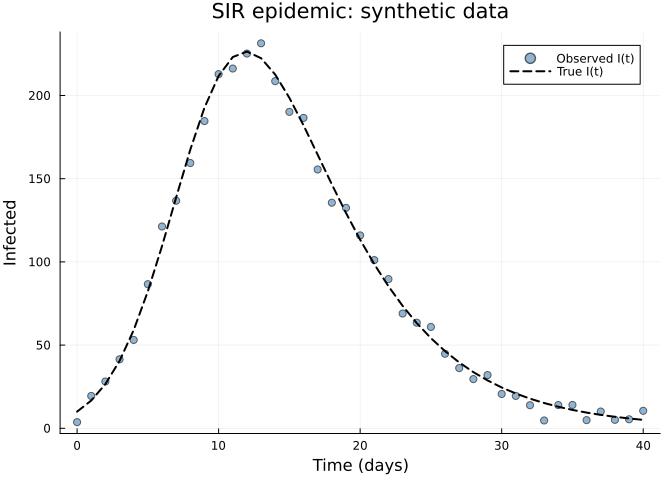

The prevalence range determines the B-spline domain:

    Prevalence range: 0.005 – 0.2264
    B-spline domain: (0.0, 0.272)

## Section 1: Fit the PSM

We model $\lambda(I/N)$ with a shape-constrained B-spline (8 knots,
increasing with $\lambda(0) = 0$). The `inc_zero_left` constraint is
biologically motivated: the force of infection must be zero when there
are no infected individuals, and should increase with prevalence.

``` julia
function sir_psm!(du, u, p, t)
    S, I, R = u
    λ = p.λ(I / p.N)
    du[1] = -λ * S
    du[2] =  λ * S - p.γ * I
    du[3] =  p.γ * I
end
```

    sir_psm! (generic function with 1 method)

``` julia
approx_λ = ShapeConstrainedBSplineApproximator(:λ, foi_domain, 10,
    :inc_zero_left; initial = 0.4)

prob = PSMProblem(
    sir_psm!, u0, tspan, [approx_λ];
    data_times = data_times,
    data_values = reshape(I_obs, :, 1),
    obs_to_state = [2],
    known_params = (γ = 0.25, N = N_pop),
    likelihood = Gaussian(),
    solver = Tsit5()
)

sol = solve(prob, LAML(maxiters=100, verbose=false))
```

    PSMSolution((λ = [-3.450503883284833, -3.55908633980754, -3.7768088203267958, -3.9143778193615786, -3.9091852583240065, -3.8101686576364795, -3.7516541407498263, -3.745083995058557, -3.7450839950585895]), 577.8147515177824, 1099.980978179372, 2.9514294860367616, [608.7339600723063], [10.0; 16.28575306661921; … ; 5.942597710468387; 5.049113053017898;;], [3.6696475510497084; 19.43055459411786; … ; 5.397424420239466; 10.498804562183398;;], [0.0, 1.0, 2.0, 3.0, 4.0, 5.0, 6.0, 7.0, 8.0, 9.0  …  31.0, 32.0, 33.0, 34.0, 35.0, 36.0, 37.0, 38.0, 39.0, 40.0], Dict{Symbol, Any}(:λ => PartiallySpecifiedModels.var"#evaluator#build_constrained_bspline_evaluator##0"{Float64, Float64, Float64, Float64, Float64, Float64, Float64, Int64, Vector{Float64}, Vector{Float64}}(0.03070842087423048, 0.19002520276684826, 0.03070842087423048, 0.6011428314171973, 0.7631014270199702, 0.272, 0.0, 4, [-0.11657142857142856, -0.07771428571428571, -0.038857142857142854, 0.0, 0.038857142857142854, 0.07771428571428571, 0.11657142857142858, 0.15542857142857142, 0.19428571428571428, 0.23314285714285715, 0.272, 0.3108571428571429, 0.34971428571428576, 0.38857142857142857], [0.0, 0.031236660172611046, 0.05930388455493871, 0.0819413517229958, 0.10169785945501573, 0.12155620632274886, 0.14345902257200052, 0.1666665098372154, 0.1900252027668484, 0.21338389569648064])), (V_beta = [0.0007661424385522896 -0.00026171906047900987 … -3.37194789771708e-8 -3.371947896144346e-8; -0.00026171906047900987 0.00012956013000593882 … 3.1831285744014686e-5 3.1831285729168035e-5; … ; -3.37194789771708e-8 3.1831285744014686e-5 … 0.002580864349968146 0.0025808643487643867; -3.371947896144346e-8 3.1831285729168035e-5 … 0.0025808643487643867 0.004223618103922112], sigma2 = 28.909916018413774, converged = true, iterations = 27, reason = :converged_tol, laml_failures = 0, criterion = :working, laml = -76.88065786148951, stationarity = 0.003157238934841211, smoothing_advanced = true))

    Data loss (SS): 1100.0
    EDF:            2.95
    Smoothing λ:    [608.7]

### Fitted trajectory

``` julia
plot(data_times, I_true, label="True I(t)", lw=2, color=:black, ls=:dash,
     xlabel="Time (days)", ylabel="Infected",
     title="PSM fit: SIR with unknown λ(I/N)")
scatter!(data_times, I_obs, label="Observed", ms=4, alpha=0.5, color=:steelblue)
plot!(data_times, sol.fitted_values[:, 1], label="PSM fit", lw=2, color=:red)
```

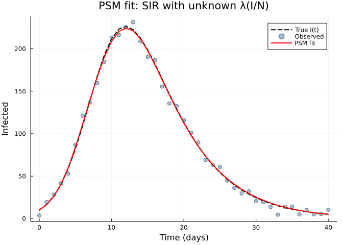

### Recovered unknown function

``` julia
prev_grid = range(0.005, 0.14, length=100)
λ_true = [0.5 * p^0.9 for p in prev_grid]
λ_est = [sol.unknown_functions[:λ](p) for p in prev_grid]

plot(prev_grid, λ_true, label="True λ(I/N)", lw=2, color=:black, ls=:dash,
     xlabel="Prevalence (I/N)", ylabel="Force of infection λ",
     title="Recovered unknown function")
plot!(prev_grid, λ_est, label="Estimated λ(I/N)", lw=2, color=:red)
```

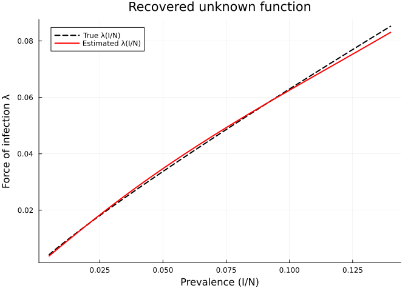

## Section 2: Parametric Bootstrap

The **parametric bootstrap** generates pseudo-data by sampling from the
fitted likelihood:

$$I^*_t \sim N\bigl(\hat{I}(t),\; \hat\sigma^2\bigr)$$

Each replicate is refit with LAML, producing a distribution of fitted
trajectories and unknown function curves. Pointwise quantiles give the
confidence intervals.

``` julia
bs_param = bootstrap(sol, prob, LAML(maxiters=80, verbose=false);
    nboot=50, method=:parametric, rng=Random.Xoshiro(42), verbose=true)
```

    Bootstrap replicate 1 / 50
    Bootstrap replicate 2 / 50
    Bootstrap replicate 3 / 50
    ┌ Warning: LAML: smoothing selection never moved λ̂ off its initialization, so the reported λ̂, EDF and posterior covariance describe the INITIAL smoothing, not a selected one. Every Fellner–Schall proposal was rejected (or the iteration budget was spent before any ran). This happens when the working-model Jacobian is too noisy for the proposals to be accepted; try `jac=:forwarddiff`, more `maxiters`, or a different knot count. See `convergence.smoothing_advanced`.
    └ @ PartiallySpecifiedModels ~/Projects/psm/PartiallySpecifiedModels.jl/src/solver.jl:2028
    Bootstrap replicate 50 / 50
    Bootstrap complete: 50 / 50 successful

    BootstrapResult([-3.5352775901318276 -3.568559811584277 … -3.868470843140575 -3.868470843140617; -3.484131349088872 -3.552159406529989 … -3.8561706290350504 -3.856170629035085; … ; -3.49114355870135 -3.5581189563922213 … -3.876147136106175 -3.8761471361062068; -3.513787712064421 -3.5391786303287702 … -3.772998507997932 -3.7729985079979746], [10.0; 15.873765624106912; … ; 5.762695607990171; 4.875834216474712;;; 10.0; 16.19240551191174; … ; 5.881951545470713; 4.9910423684784115;;; 10.0; 15.913061936065084; … ; 5.726838186645287; 4.848644902744861;;; … ;;; 10.0; 16.072194114200382; … ; 6.16813607824327; 5.234962346576693;;; 10.0; 16.11928732879193; … ; 5.934920296620731; 5.036303760513552;;; 10.0; 16.16206741826997; … ; 5.749701704661588; 4.871855835245292], Dict(:λ => [0.0 0.0 … 0.0 0.0; 0.0019964097087603605 0.0020623433492748186 … 0.002049239013602988 0.0020474502314049813; … ; 0.15258249299823481 0.15339456584459885 … 0.15261254044869646 0.15685381966916714; 0.15404436003299274 0.15487434567333383 … 0.15406335560797174 0.1584604840426667]), Dict(:λ => [0.0, 0.0027474747474747476, 0.005494949494949495, 0.008242424242424242, 0.01098989898989899, 0.013737373737373737, 0.016484848484848484, 0.019232323232323233, 0.02197979797979798, 0.024727272727272726  …  0.24727272727272728, 0.25002020202020203, 0.25276767676767675, 0.25551515151515153, 0.25826262626262625, 0.261010101010101, 0.26375757575757575, 0.2665050505050505, 0.26925252525252524, 0.272]), (lower = [10.0; 15.692003641421472; … ; 5.459169390999706; 4.615408980433822;;], upper = [10.0; 16.788227963697114; … ; 6.319944133831278; 5.4090149442191375;;]), Dict(:λ => (lower = [0.0, 0.0019615050671648255, 0.003919806052907171, 0.00587328365774516, 0.007817940047177655, 0.009775498854981265, 0.011714233786167736, 0.013643992015766052, 0.015559708560196683, 0.01746523812959141  …  0.13660358451795326, 0.13790332896132668, 0.13920294285642815, 0.14050244252179173, 0.14180184427595133, 0.14310116443744098, 0.14440041932479472, 0.14569962525654648, 0.14699879855123016, 0.14829795552737995], upper = [0.0, 0.0021918233768765246, 0.004358270211272074, 0.006498088182191985, 0.008610024968641605, 0.01069282824962627, 0.01274524570415131, 0.01476602501122209, 0.016753913849843944, 0.018707659899022202  …  0.16487492914640284, 0.16796124887568037, 0.17105956064491962, 0.1741683654491255, 0.17728616428330263, 0.18041145814245593, 0.18354274802159012, 0.18667853491571, 0.18981731981982025, 0.19295760372892576])), 0.95, 50)

### Trajectory confidence intervals

``` julia
plot(data_times, I_true, label="True I(t)", lw=2, color=:black, ls=:dash,
     xlabel="Time (days)", ylabel="Infected",
     title="Parametric bootstrap: trajectory CI")
scatter!(data_times, I_obs, label="Observed", ms=3, alpha=0.4, color=:steelblue)
plot!(data_times, sol.fitted_values[:, 1], label="PSM fit", lw=2, color=:red)
plot!(data_times, bs_param.ci_fitted.lower[:, 1],
      fillrange=bs_param.ci_fitted.upper[:, 1],
      fillalpha=0.2, color=:red, label="95% CI", ls=:dot, lw=0)
```

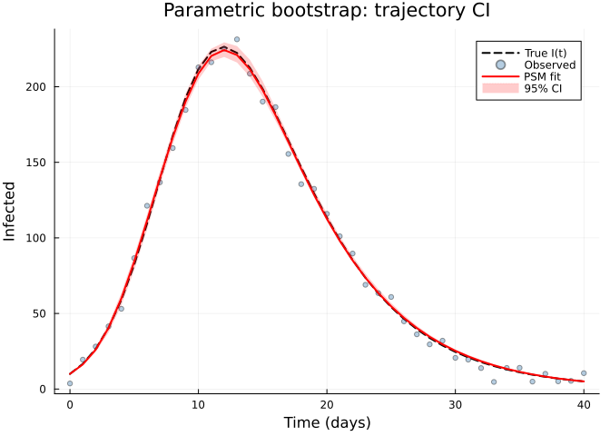

### Unknown function confidence intervals

``` julia
uf_grid = bs_param.uf_grid[:λ]
plot(prev_grid, λ_true, label="True λ(I/N)", lw=2, color=:black, ls=:dash,
     xlabel="Prevalence (I/N)", ylabel="Force of infection λ",
     title="Parametric bootstrap: unknown function CI")
plot!(uf_grid, bs_param.ci_uf[:λ].lower,
      fillrange=bs_param.ci_uf[:λ].upper,
      fillalpha=0.2, color=:red, label="95% CI", ls=:dot, lw=0)
plot!(prev_grid, λ_est, label="Estimated λ(I/N)", lw=2, color=:red)
```

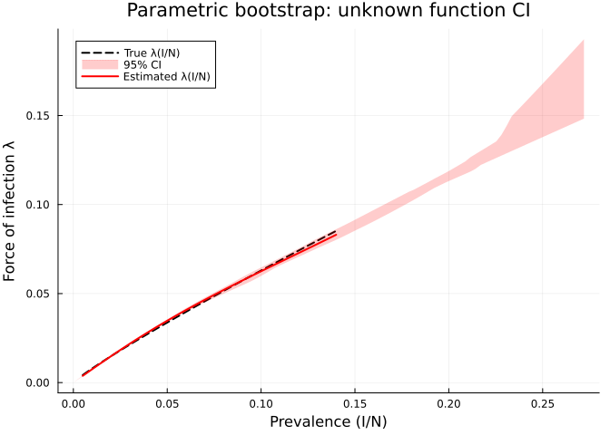

    Parametric bootstrap: 50 / 50 replicates succeeded

## Section 3: Nonparametric Bootstrap

The **nonparametric bootstrap** resamples the residuals
$\hat{e}_t = I_t - \hat{I}(t)$ with replacement and adds them to the
fitted values to create pseudo-data:

$$I^*_t = \hat{I}(t) + \hat{e}_{\pi(t)}$$

where $\pi$ is a random permutation with replacement. This makes no
assumption about the error distribution — only that residuals are
exchangeable.

``` julia
bs_nonparam = bootstrap(sol, prob, LAML(maxiters=80, verbose=false);
    nboot=50, method=:nonparametric, rng=Random.Xoshiro(42), verbose=true)
```

    Bootstrap replicate 1 / 50
    Bootstrap replicate 2 / 50
    Bootstrap replicate 3 / 50
    Bootstrap replicate 50 / 50
    Bootstrap complete: 50 / 50 successful

    BootstrapResult([-3.499064286699154 -3.5307821223924525 … -3.669320121327246 -3.6693201213272952; -3.4389798027533356 -3.5485510033108194 … -3.8703703134465535 -3.8703703134465712; … ; -3.5105990277701355 -3.5504893173971 … -3.691941076481583 -3.6919410764816023; -3.607907337901872 -3.4673155946576095 … -4.000494543632958 -4.000494543632998], [10.0; 16.277743551006317; … ; 6.112388458778933; 5.196284149073471;;; 10.0; 16.40957416059171; … ; 5.681907676581976; 4.821490005281255;;; 10.0; 15.964121230392026; … ; 6.173183321198121; 5.240393892518435;;; … ;;; 10.0; 15.711412177707954; … ; 5.630229002674611; 4.753685197483033;;; 10.0; 16.09345197506066; … ; 5.642814448166126; 4.777001124194324;;; 10.0; 16.27294428589276; … ; 4.933234422012216; 4.152521016609486], Dict(:λ => [0.0 0.0 … 0.0 0.0; 0.0020704904626550127 0.002111314026109659 … 0.0020385040491905683 0.002040676265985565; … ; 0.16023994197912622 0.15451998983526413 … 0.16080815301356163 0.15252113270406903; 0.16201992641870855 0.15597912990667256 … 0.16254880564880578 0.15380387622718109]), Dict(:λ => [0.0, 0.0027474747474747476, 0.005494949494949495, 0.008242424242424242, 0.01098989898989899, 0.013737373737373737, 0.016484848484848484, 0.019232323232323233, 0.02197979797979798, 0.024727272727272726  …  0.24727272727272728, 0.25002020202020203, 0.25276767676767675, 0.25551515151515153, 0.25826262626262625, 0.261010101010101, 0.26375757575757575, 0.2665050505050505, 0.26925252525252524, 0.272]), (lower = [10.0; 15.834442058964859; … ; 5.481213790122704; 4.625728364454094;;], upper = [10.0; 16.7297456216839; … ; 6.273623158981511; 5.347878151991335;;]), Dict(:λ => (lower = [0.0, 0.0019890651065318813, 0.0039725519153733955, 0.005949647230965321, 0.007919537857748479, 0.009880837318349637, 0.011828411646542716, 0.013764733321379697, 0.01568906451077608, 0.01760066738264735  …  0.13826179567741875, 0.139634782256028, 0.14100773257632146, 0.14238065117058873, 0.14375354257111922, 0.1451264113102024, 0.14649926192012772, 0.14787209893318462, 0.14924492688166263, 0.15061775029785113], upper = [0.0, 0.0021844445571070643, 0.004341827294010471, 0.006471243072940393, 0.00857178675612704, 0.010642553205800612, 0.012682637284191285, 0.014691133853529293, 0.01667161987283728, 0.018624298176283468  …  0.15128299949049356, 0.15339095968797284, 0.1554998843527604, 0.15760965292644297, 0.15972014485060682, 0.16183123956683843, 0.1639428165167243, 0.1660547551418508, 0.16816693488380435, 0.1702792351841715])), 0.95, 50)

### Trajectory confidence intervals

``` julia
plot(data_times, I_true, label="True I(t)", lw=2, color=:black, ls=:dash,
     xlabel="Time (days)", ylabel="Infected",
     title="Nonparametric bootstrap: trajectory CI")
scatter!(data_times, I_obs, label="Observed", ms=3, alpha=0.4, color=:steelblue)
plot!(data_times, sol.fitted_values[:, 1], label="PSM fit", lw=2, color=:red)
plot!(data_times, bs_nonparam.ci_fitted.lower[:, 1],
      fillrange=bs_nonparam.ci_fitted.upper[:, 1],
      fillalpha=0.2, color=:blue, label="95% CI", ls=:dot, lw=0)
```

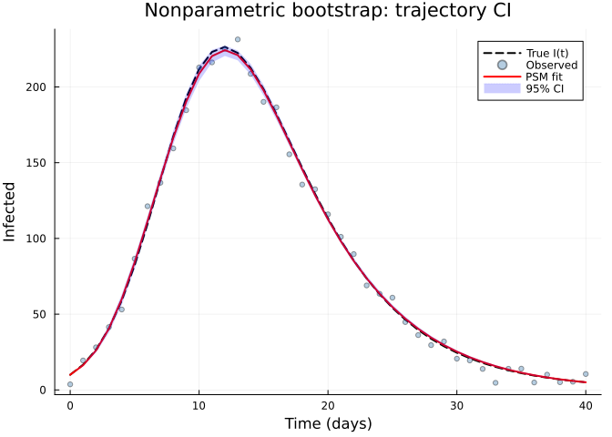

### Unknown function confidence intervals

``` julia
plot(prev_grid, λ_true, label="True λ(I/N)", lw=2, color=:black, ls=:dash,
     xlabel="Prevalence (I/N)", ylabel="Force of infection λ",
     title="Nonparametric bootstrap: unknown function CI")
plot!(bs_nonparam.uf_grid[:λ], bs_nonparam.ci_uf[:λ].lower,
      fillrange=bs_nonparam.ci_uf[:λ].upper,
      fillalpha=0.2, color=:blue, label="95% CI", ls=:dot, lw=0)
plot!(prev_grid, λ_est, label="Estimated λ(I/N)", lw=2, color=:red)
```

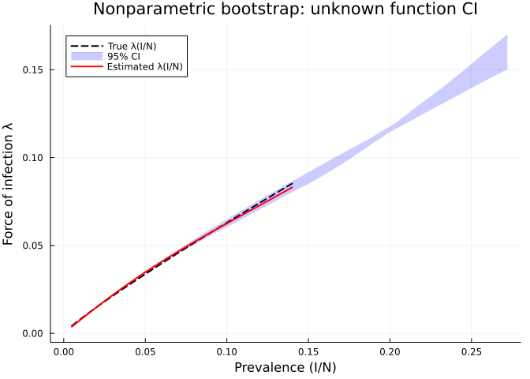

    Nonparametric bootstrap: 50 / 50 replicates succeeded

## Section 4: Case Bootstrap

> [!WARNING]
>
> ### Case bootstrap has been removed
>
> The **case bootstrap** resamples entire observation rows with
> replacement. For time series data from ODE models, this scrambles the
> temporal structure — a resampled dataset might place the peak
> observation at an early time point. This produces unreliable CIs and
> high failure rates. Case resampling is designed for cross-sectional
> (i.i.d.) data, not time-ordered dynamical systems. For this reason
> `method=:case` has been removed from the package (requesting it raises
> an error).
>
> For ODE-based PSMs, use **parametric** or **nonparametric** bootstrap
> instead.

## Section 5: Comparison of Bootstrap Methods

### Side-by-side trajectory CIs

``` julia
p_traj = plot(data_times, I_true, label="True", lw=2, color=:black, ls=:dash,
     xlabel="Time (days)", ylabel="Infected",
     title="Trajectory CI comparison", legend=:topright)
scatter!(p_traj, data_times, I_obs, label="Data", ms=2, alpha=0.3, color=:gray)

plot!(p_traj, data_times, bs_param.ci_fitted.lower[:, 1],
      fillrange=bs_param.ci_fitted.upper[:, 1],
      fillalpha=0.2, color=:red, label="Parametric", ls=:dot, lw=0)
plot!(p_traj, data_times, bs_nonparam.ci_fitted.lower[:, 1],
      fillrange=bs_nonparam.ci_fitted.upper[:, 1],
      fillalpha=0.2, color=:blue, label="Nonparametric", ls=:dot, lw=0)
plot!(p_traj, data_times, sol.fitted_values[:, 1], label="Fit", lw=2, color=:red)
```

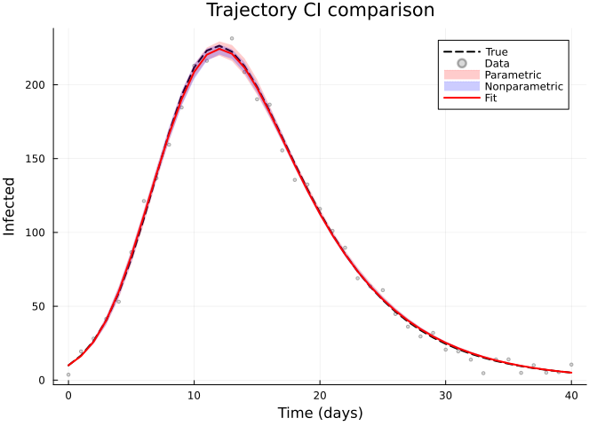

### Side-by-side unknown function CIs

``` julia
p_uf = plot(prev_grid, λ_true, label="True λ", lw=2, color=:black, ls=:dash,
     xlabel="Prevalence (I/N)", ylabel="λ(I/N)",
     title="Unknown function CI comparison", legend=:topleft)

plot!(p_uf, bs_param.uf_grid[:λ], bs_param.ci_uf[:λ].lower,
      fillrange=bs_param.ci_uf[:λ].upper,
      fillalpha=0.2, color=:red, label="Parametric", ls=:dot, lw=0)
plot!(p_uf, bs_nonparam.uf_grid[:λ], bs_nonparam.ci_uf[:λ].lower,
      fillrange=bs_nonparam.ci_uf[:λ].upper,
      fillalpha=0.2, color=:blue, label="Nonparametric", ls=:dot, lw=0)
plot!(p_uf, prev_grid, λ_est, label="Fit", lw=2, color=:red)
```

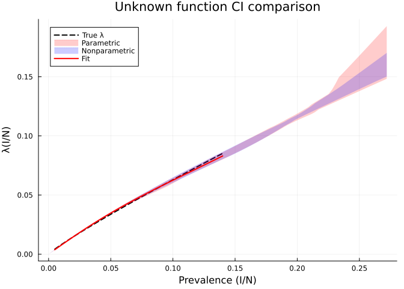

### Quantitative comparison

    Method          | n_success | CI width at peak | Mean UF CI width | UF coverage
    -------------------------------------------------------------------------------------
    Parametric      | 50/50     | 9.6              | 0.00859          | 87.0%
    Nonparametric   | 50/50     | 7.8              | 0.00555          | 84.0%

**Interpretation:**

- **Parametric** CIs tend to be narrower because they assume the correct
  error model.
- **Nonparametric** CIs are slightly wider because resampled residuals
  capture any non-Gaussian features.

> [!IMPORTANT]
>
> ### Bootstrap coverage and smoothing bias
>
> The bootstrap CIs may show **less than nominal coverage** (e.g., 70%
> instead of 95%) for the unknown function $\lambda(I/N)$. This is a
> well-known limitation: the smoothing penalty introduces **bias** in
> the estimated function (pulling it towards linearity), and the
> bootstrap only captures **sampling variability** around the biased
> estimate — not the bias itself.
>
> This is analogous to the bias–variance tradeoff in kernel smoothing
> and GAMs (Nychka 1988, Wood 2006 §6.10). Two approaches give better
> coverage:
>
> 1.  **Bayesian credible intervals** from the LAML posterior covariance
>     (see [Vignette 14: MCMC](../14_mcmc/14_mcmc.qmd)) — these account
>     for smoothing uncertainty by design.
> 2.  **Undersmoothing** — using more knots or smaller λ reduces bias at
>     the cost of wider CIs.
>
> For **trajectory** CIs (fitted values at observed times), bootstrap
> coverage is typically much closer to nominal because the ODE
> integration integrates out local bias in the unknown function.

## Section 6: Bootstrap with Non-Gaussian Likelihoods

A key advantage of the parametric bootstrap is that it **respects the
likelihood family**. When fitting count data with `Poisson()`, the
parametric bootstrap samples $I^*_t \sim \text{Pois}(\hat{I}(t))$
instead of adding Gaussian noise. This naturally produces integer
pseudo-data with variance proportional to the mean.

### Generate Poisson data

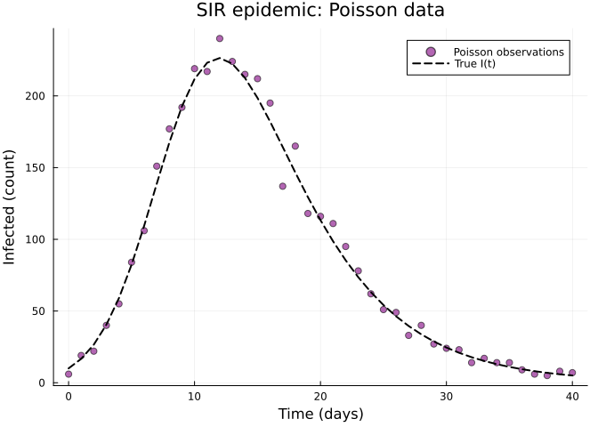

### Fit with Poisson likelihood

``` julia
prob_pois = PSMProblem(
    sir_psm!, u0, tspan,
    [ShapeConstrainedBSplineApproximator(:λ, foi_domain, 10, :inc_zero_left; initial = 0.4)];
    data_times = data_times,
    data_values = reshape(I_pois, :, 1),
    obs_to_state = [2],
    known_params = (γ = 0.25, N = N_pop),
    likelihood = Poisson(),
    solver = Tsit5()
)

sol_pois = solve(prob_pois, LAML(maxiters=100, verbose=false))
```

    PSMSolution((λ = [-3.539611409297473, -3.5790322508911037, -3.69094700858534, -3.794880013818471, -3.8764123834060653, -3.9159939694375736, -3.92337935562403, -3.9235778683381177, -3.9235778683381435]), 1213.4846772136523, 2425.645371827648, 2.3388547602269876, [39.939386771534], [10.0; 15.78902654517811; … ; 5.413795324227561; 4.566812024948762;;], [6.0; 19.0; … ; 8.0; 7.0;;], [0.0, 1.0, 2.0, 3.0, 4.0, 5.0, 6.0, 7.0, 8.0, 9.0  …  31.0, 32.0, 33.0, 34.0, 35.0, 36.0, 37.0, 38.0, 39.0, 40.0], Dict{Symbol, Any}(:λ => PartiallySpecifiedModels.var"#evaluator#build_constrained_bspline_evaluator##0"{Float64, Float64, Float64, Float64, Float64, Float64, Float64, Int64, Vector{Float64}, Vector{Float64}}(0.028429555805488255, 0.18240728140904888, 0.028429555805488255, 0.5038285997635509, 0.7222850539603881, 0.272, 0.0, 4, [-0.11657142857142856, -0.07771428571428571, -0.038857142857142854, 0.0, 0.038857142857142854, 0.07771428571428571, 0.11657142857142858, 0.15542857142857142, 0.19428571428571428, 0.23314285714285715, 0.272, 0.3108571428571429, 0.34971428571428576, 0.38857142857142857], [0.0, 0.028611366752832636, 0.056131867821598985, 0.08077410308078688, 0.10301063232392127, 0.1235238360050078, 0.14324875263164352, 0.16282994148551286, 0.18240728140904897, 0.20198462133258457])), (V_beta = [0.013581532605573559 -0.003573805824335106 … 0.0021551953678047983 0.0021551953676634153; -0.003573805824335106 0.0021568921248849523 … 0.0008563088995026247 0.0008563088994464501; … ; 0.0021551953678047983 0.0008563088995026247 … 0.054365749710843896 0.05436574970727745; 0.0021551953676634153 0.0008563088994464501 … 0.05436574970727745 0.07940369046265949], sigma2 = 1.0, converged = true, iterations = 30, reason = :converged_tol, laml_failures = 0, criterion = :working, laml = -136.01074757523168, stationarity = 0.0018590262689966996, smoothing_advanced = true))

    Poisson fit — data_loss: 2425.6, EDF: 2.34

### Parametric bootstrap with Poisson likelihood

The parametric bootstrap now samples from $\text{Pois}(\hat\mu_t)$:

``` julia
bs_pois = bootstrap(sol_pois, prob_pois, LAML(maxiters=80, verbose=false);
    nboot=50, method=:parametric, rng=Random.Xoshiro(42), verbose=true)
```

    Bootstrap replicate 1 / 50
    ┌ Warning: LAML: smoothing selection never moved λ̂ off its initialization, so the reported λ̂, EDF and posterior covariance describe the INITIAL smoothing, not a selected one. Every Fellner–Schall proposal was rejected (or the iteration budget was spent before any ran). This happens when the working-model Jacobian is too noisy for the proposals to be accepted; try `jac=:forwarddiff`, more `maxiters`, or a different knot count. See `convergence.smoothing_advanced`.
    └ @ PartiallySpecifiedModels ~/Projects/psm/PartiallySpecifiedModels.jl/src/solver.jl:2028
    Bootstrap replicate 2 / 50
    Bootstrap replicate 3 / 50
    Bootstrap replicate 50 / 50
    Bootstrap complete: 50 / 50 successful

    BootstrapResult([-4.388294891582741 -3.292361682617652 … -4.856913255923234 -4.856913255923283; -3.5375271467954708 -3.583201528565738 … -3.871296118645419 -3.8712961186454447; … ; -3.562769598753686 -3.5961008885775883 … -3.8295497768767968 -3.829549776288813; -3.515056826375838 -3.5687853949043196 … -4.046901540975337 -4.046901540975376], [10.0; 15.651287201176451; … ; 5.522542596877052; 4.633971785981702;;; 10.0; 15.766410973727023; … ; 5.31419976424072; 4.479792020227759;;; 10.0; 15.401093106114402; … ; 5.373419970741475; 4.511592592332654;;; … ;;; 10.0; 15.409717058639346; … ; 4.99636619991753; 4.192406634865049;;; 10.0; 15.583386521990013; … ; 5.039897049878482; 4.235102538690942;;; 10.0; 15.95520564539229; … ; 6.108842872614048; 5.182631435181096], Dict(:λ => [0.0 0.0 … 0.0 0.0; 0.0017842070539905823 0.001979279522851606 … 0.0019430181395473783 0.002015221832226178; … ; 0.13314350318856136 0.15558946148748318 … 0.1589841888284236 0.14445684648819754; 0.13369108621348227 0.15704725590070812 … 0.16050346316004155 0.14568188272431024]), Dict(:λ => [0.0, 0.0027474747474747476, 0.005494949494949495, 0.008242424242424242, 0.01098989898989899, 0.013737373737373737, 0.016484848484848484, 0.019232323232323233, 0.02197979797979798, 0.024727272727272726  …  0.24727272727272728, 0.25002020202020203, 0.25276767676767675, 0.25551515151515153, 0.25826262626262625, 0.261010101010101, 0.26375757575757575, 0.2665050505050505, 0.26925252525252524, 0.272]), (lower = [10.0; 15.012940828570022; … ; 4.071720093151818; 3.3834944803032987;;], upper = [10.0; 16.505044675258258; … ; 6.226819268374657; 5.313064138165508;;]), Dict(:λ => (lower = [0.0, 0.0016619432403643794, 0.0034350596466713925, 0.00530725656927504, 0.007260035733762531, 0.009169058732359067, 0.011032104651325574, 0.012880431627529122, 0.014912024008408773, 0.01682825776619085  …  0.1250738118936949, 0.12548859641647972, 0.12590187668780323, 0.1263138407390981, 0.12672467660179698, 0.12713457230733255, 0.1275437158871375, 0.12795229537264446, 0.12836049879528605, 0.12876851418649501], upper = [0.0, 0.0022729807020461716, 0.004429873444276613, 0.006484278404772117, 0.008471259232817588, 0.010424224182554561, 0.012361559303499373, 0.014271558959234133, 0.01631068770880122, 0.018390593209313393  …  0.18688533059810436, 0.1890845202075369, 0.1912841644322527, 0.1934842064489729, 0.19568458943441827, 0.19788525656530978, 0.2000861510183683, 0.2022872159703148, 0.2044883945978701, 0.2066896300777553])), 0.95, 50)

``` julia
p1 = plot(data_times, I_true, label="True I(t)", lw=2, color=:black, ls=:dash,
     xlabel="Time (days)", ylabel="Infected (count)",
     title="Poisson bootstrap: trajectory CI")
scatter!(p1, data_times, I_pois, label="Data", ms=3, alpha=0.4, color=:purple)
plot!(p1, data_times, sol_pois.fitted_values[:, 1], label="PSM fit", lw=2, color=:purple)
plot!(p1, data_times, bs_pois.ci_fitted.lower[:, 1],
      fillrange=bs_pois.ci_fitted.upper[:, 1],
      fillalpha=0.2, color=:purple, label="95% CI", ls=:dot, lw=0)

p2 = plot(prev_grid, λ_true, label="True λ", lw=2, color=:black, ls=:dash,
     xlabel="Prevalence (I/N)", ylabel="λ(I/N)",
     title="Poisson bootstrap: unknown function CI")
plot!(p2, bs_pois.uf_grid[:λ], bs_pois.ci_uf[:λ].lower,
      fillrange=bs_pois.ci_uf[:λ].upper,
      fillalpha=0.2, color=:purple, label="95% CI", ls=:dot, lw=0)
λ_pois_est = [sol_pois.unknown_functions[:λ](p) for p in prev_grid]
plot!(p2, prev_grid, λ_pois_est, label="Estimated λ", lw=2, color=:purple)

plot(p1, p2, layout=(1, 2), size=(900, 400))
```

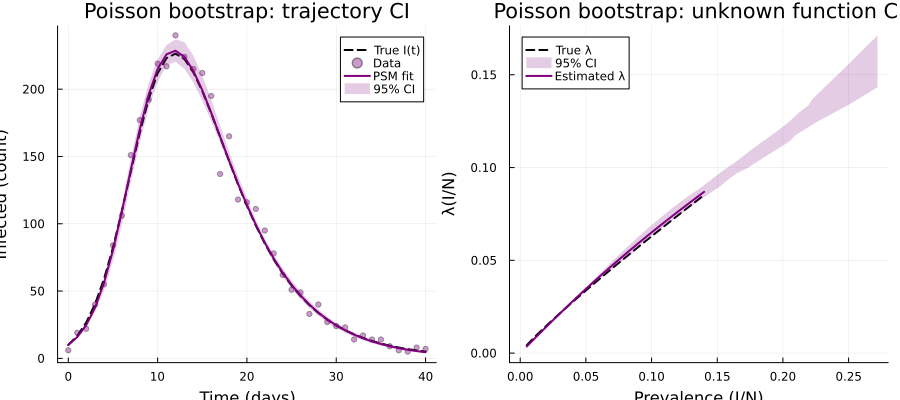

Note how the Poisson CIs are **narrower near zero** (where counts are
small and Poisson variance is low) and **wider at the peak** (where
counts — and hence Poisson variance — are large). This
heteroscedasticity is automatically captured by the parametric
bootstrap.

## Section 7: Diagnostic Plots

Standard 4-panel diagnostics for the primary Gaussian fit help verify
that the residuals are well-behaved:

``` julia
diag = appraise(sol)

p_qq = scatter(diag.qq_theoretical, diag.qq_sample,
    xlabel="Theoretical quantiles", ylabel="Sample quantiles",
    title="QQ Plot of Residuals", ms=3, legend=false, color=:steelblue)
mn, mx = extrema(vcat(diag.qq_theoretical, diag.qq_sample))
plot!(p_qq, [mn, mx], [mn, mx], color=:red, ls=:dash, label="")

p_rf = scatter(diag.fitted, diag.residuals,
    xlabel="Fitted values", ylabel="Residuals",
    title="Residuals vs Fitted", ms=3, legend=false, color=:steelblue)
hline!(p_rf, [0], color=:gray, ls=:dot)

p_hist = histogram(diag.residuals, normalize=:pdf,
    xlabel="Residuals", ylabel="Density",
    title="Histogram of Residuals", legend=false, color=:steelblue, alpha=0.7)

p_of = scatter(diag.observed, diag.fitted,
    xlabel="Observed", ylabel="Fitted",
    title="Observed vs Fitted", ms=3, legend=false, color=:steelblue)
mn2, mx2 = extrema(vcat(diag.observed, diag.fitted))
plot!(p_of, [mn2, mx2], [mn2, mx2], color=:red, ls=:dash, label="")

plot(p_qq, p_rf, p_hist, p_of, layout=(2, 2), size=(700, 600))
```

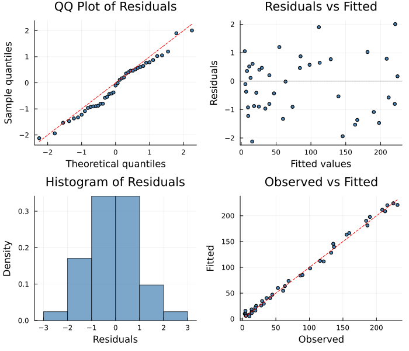

    Durbin-Watson: 1.971

A Durbin-Watson statistic near 2 indicates no strong autocorrelation in
the residuals, supporting the validity of the bootstrap CIs (which
assume approximately independent errors).

> [!TIP]
>
> ### See Also
>
> - [Vignette 14: MCMC](../14_mcmc/14_mcmc.qmd) — Bayesian credible
>   intervals via NUTS sampling
> - [Vignette 24: Variational](../24_variational/24_variational.qmd) —
>   approximate Bayesian posterior intervals
> - [Vignette 27: Predator–Prey Functional
>   Response](../27_predator_prey/27_predator_prey.qmd) — bootstrap CIs
>   on a shape-constrained functional response
> - [Vignette 28: Fisheries](../28_fisheries/28_fisheries.qmd) — Poisson
>   parametric bootstrap on count data

## Practical Guidance

### Choosing a bootstrap method

| Scenario | Recommended method |
|----|----|
| Gaussian noise, well-specified model | `:parametric` — narrowest CIs |
| Count data (Poisson, NegBin) | `:parametric` — respects variance–mean relationship |
| Suspect non-Gaussian errors | `:nonparametric` — no distributional assumption |
| Quick exploratory analysis | `:parametric` with `nboot=50` |

> [!NOTE]
>
> The `:case` bootstrap (resampling entire rows) has been **removed**
> because it scrambles the temporal structure of ODE/DDE data; the
> `:nonparametric` method requires a Gaussian likelihood.

### Tips

- **Start with `nboot=50–100`** to check the method works, then increase
  to 200+ for publication-quality CIs.
- **Check `bs.n_success`**: if many replicates fail (\< 80% success),
  the model may be unstable. Try increasing `maxiters` or simplifying
  the approximator (fewer knots).
- **Set `rng=Random.Xoshiro(seed)`** for reproducibility.
- The parametric bootstrap is the default for good reason: it is fast,
  well-calibrated, and adapts to the likelihood family. Use the
  nonparametric bootstrap when you have reason to doubt the error model
  (Gaussian likelihood only).
