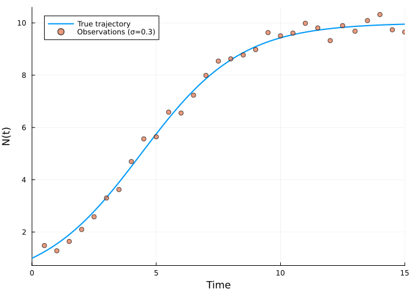
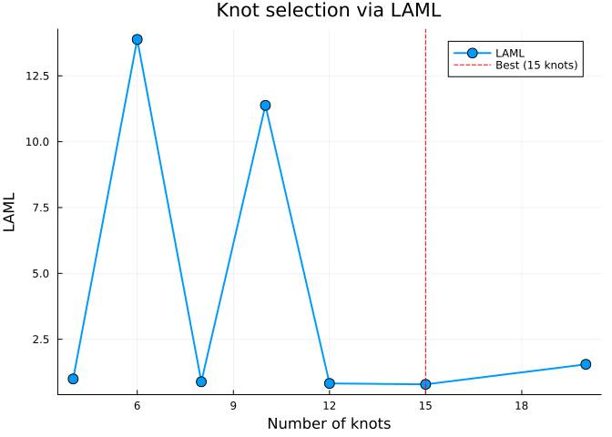
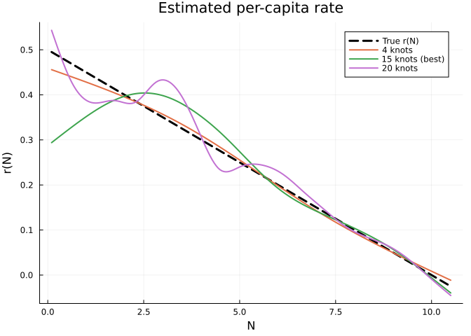
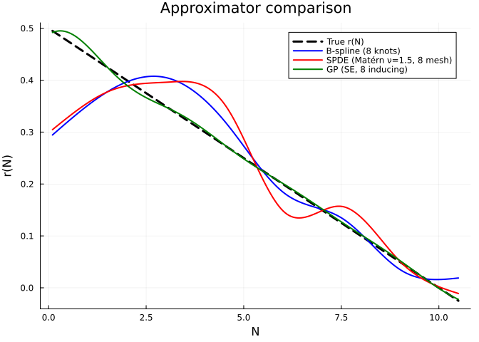
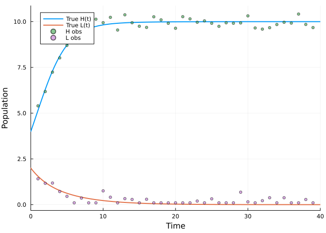
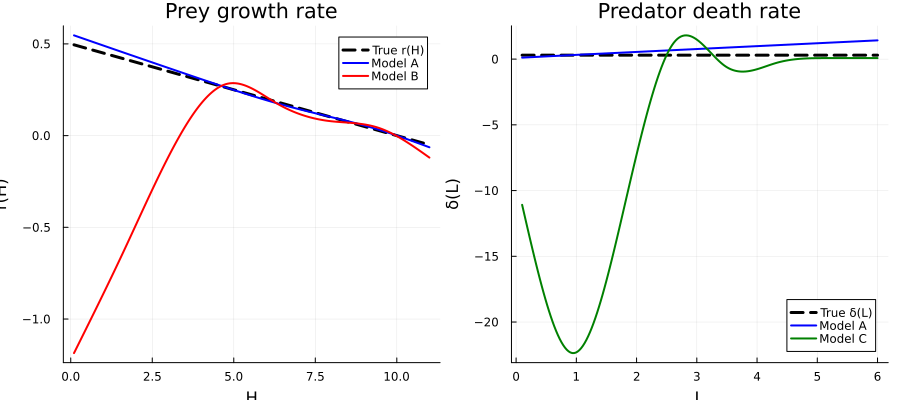
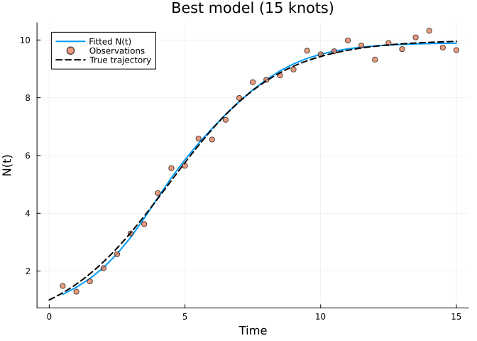
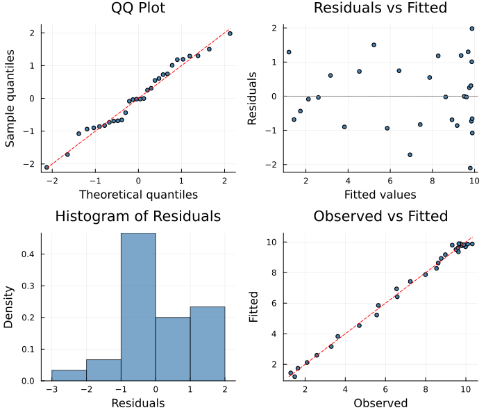

# Model Selection with Marginal Likelihood
Simon Frost
2026-06-12

- [Overview](#overview)
- [Setup](#setup)
- [Logistic Growth with Unknown Per-Capita
  Rate](#logistic-growth-with-unknown-per-capita-rate)
  - [Data generation](#data-generation)
  - [PSM dynamics](#psm-dynamics)
- [Section 1: Knot Selection for B-Spline
  Approximators](#section-1-knot-selection-for-b-spline-approximators)
  - [LAML vs number of knots](#laml-vs-number-of-knots)
  - [Summary table](#summary-table)
  - [Recovered unknown functions](#recovered-unknown-functions)
- [Section 2: Approximator Type
  Comparison](#section-2-approximator-type-comparison)
  - [Comparison table](#comparison-table)
  - [Recovered unknown functions by approximator
    type](#recovered-unknown-functions-by-approximator-type)
- [Section 3: Structural Model
  Selection](#section-3-structural-model-selection)
  - [Lotka–Volterra predator–prey](#lotkavolterra-predatorprey)
  - [Data generation](#data-generation-1)
  - [Three candidate model
    structures](#three-candidate-model-structures)
  - [Fitting all three structures](#fitting-all-three-structures)
  - [Structural comparison](#structural-comparison)
  - [Recovered unknown functions](#recovered-unknown-functions-1)
- [Section 4: Diagnostics for the Best Knot
  Model](#section-4-diagnostics-for-the-best-knot-model)
  - [Fitted trajectory](#fitted-trajectory)
  - [Residual diagnostics](#residual-diagnostics)
  - [Durbin–Watson and residual
    autocorrelation](#durbinwatson-and-residual-autocorrelation)
- [Discussion](#discussion)
  - [Guidelines for LAML-based model
    selection](#guidelines-for-laml-based-model-selection)
  - [Relationship to other criteria](#relationship-to-other-criteria)

## Overview

When fitting a partially specified model, several modelling choices must
be made:

1.  **How many knots** (or basis functions) should we use for a B-spline
    approximator?
2.  **Which approximator type** best captures the unknown function —
    B-splines, SPDE, or GP?
3.  **Which functions** in the model should be treated as unknown?

The **Laplace Approximate Marginal Likelihood (LAML)** provides a
principled criterion for answering all three questions. LAML integrates
out the unknown function coefficients via a Laplace approximation to the
marginal likelihood:

$$\text{LAML}(\lambda) = -\frac{n}{2}\log(2\pi\hat\sigma^2) + \frac{1}{2}\log|\mathbf{S}_\lambda| - \frac{1}{2}\log|\mathbf{H}| - \frac{1}{2\hat\sigma^2}\|\mathbf{y} - \hat{\mathbf{y}}\|^2$$

where $\mathbf{S}_\lambda$ is the penalty matrix scaled by the smoothing
parameter $\lambda$, $\mathbf{H}$ is the Hessian of the penalized
log-likelihood, and $\hat\sigma^2$ is the estimated dispersion. Lower
(more negative) LAML values indicate a better model — analogous to AIC
or BIC, but with proper accounting for the smoothing penalty.

This vignette demonstrates LAML-based model selection on two example
systems: logistic growth and Lotka–Volterra predator–prey.

## Setup

``` julia
using PartiallySpecifiedModels
using PartiallySpecifiedModels: solve
using OrdinaryDiffEq
using Plots
using Random
using DataFrames
using Printf
Random.seed!(42)
```

    TaskLocalRNG()

## Logistic Growth with Unknown Per-Capita Rate

### Data generation

We consider logistic growth where the per-capita growth rate $r(N)$ is
treated as unknown:

$$\frac{dN}{dt} = r(N) \cdot N$$

The true per-capita rate is linear: $r(N) = 0.5\,(1 - N/10)$, giving a
carrying capacity of $K = 10$.

    30×1 Matrix{Float64}:
      1.4850697682783507
      1.28432364973933
      1.6421516203358695
      2.099718141520716
      2.583777532153197
      3.302506560365743
      3.626350402174367
      4.698048204625014
      5.5634836375025145
      5.644970200453003
      ⋮
      9.98530871405953
      9.808508174376694
      9.322531197944425
      9.89462462579148
      9.683743079449224
     10.090554453697491
     10.319500028628116
      9.73668371630828
      9.64864965922381

``` julia
plot(sol_true, label="True trajectory", lw=2, xlabel="Time", ylabel="N(t)")
scatter!(data_t, data_N, label="Observations (σ=$σ_obs)", ms=4, alpha=0.7)
```



### PSM dynamics

The partially specified model replaces the known $r(N)$ with an unknown
function to be estimated from data:

``` julia
function logistic!(du, u, p, t)
    N = u[1]
    du[1] = p.r(N) * N
end
```

    logistic! (generic function with 1 method)

## Section 1: Knot Selection for B-Spline Approximators

A key modelling choice for B-spline approximators is the number of
knots. Too few knots restrict the function space and lead to
underfitting; too many create an overly flexible basis that can overfit
despite the smoothing penalty. LAML provides a principled way to choose.

We fit the logistic growth model with B-spline approximators using 4 to
20 knots, recording the LAML objective, effective degrees of freedom
(EDF), and data-space sum of squares for each.

``` julia
N_domain = (0.1, 10.5)
knot_counts = [4, 6, 8, 10, 12, 15, 20]
knot_results = []

for nk in knot_counts
    uf = BSplineApproximator(:r, N_domain, nk; initial=x -> 0.3)
    prob = PSMProblem(logistic!, [1.0], tspan, [uf];
        data_times=data_t, data_values=data_vals,
        obs_to_state=[1], known_params=(;),
        solver=Tsit5())
    sol = solve(prob, LAML(maxiters=80, verbose=false))
    push!(knot_results, (nk=nk, laml=sol.objective, edf=sol.edf, ss=sol.data_loss))
end
```

### LAML vs number of knots

The LAML curve is characteristically U-shaped: underfitting (too few
knots) yields poor data fit, while overfitting (too many knots) incurs a
complexity penalty.

``` julia
laml_vals = [r.laml for r in knot_results]
best_idx = argmin(laml_vals)
best_nk = knot_results[best_idx].nk

plot(knot_counts, laml_vals,
    marker=:circle, ms=6, lw=2,
    xlabel="Number of knots", ylabel="LAML",
    title="Knot selection via LAML",
    label="LAML", legend=:topright)
vline!([best_nk], ls=:dash, color=:red, label="Best ($best_nk knots)")
```



### Summary table

``` julia
println("| Knots | LAML | EDF | Data SS |")
println("|------:|-----:|----:|--------:|")
for r in knot_results
    marker = r.nk == best_nk ? " ✓" : ""
    @printf("| %d | %.2f | %.1f | %.3f |%s\n", r.nk, r.laml, r.edf, r.ss, marker)
end
```

| Knots |  LAML |  EDF | Data SS |
|------:|------:|-----:|--------:|
|     4 |  0.98 |  3.3 |   1.923 |
|     6 | 13.88 |  6.0 |  27.753 |
|     8 |  1.11 |  7.2 |   1.920 |
|    10 | 11.50 |  9.5 |  19.155 |
|    12 |  0.82 |  6.8 |   1.379 |
|    15 |  0.82 |  5.0 |   1.559 |
|    20 |  2.33 | 14.3 |   4.223 |

### Recovered unknown functions

We plot the estimated $r(N)$ for a few representative knot counts
against the truth.

``` julia
N_grid = range(N_domain[1], N_domain[2], length=200)
r_true = [0.5 * (1.0 - N / 10.0) for N in N_grid]

selected_knots = [4, best_nk, 20]
p_uf = plot(N_grid, r_true, lw=3, ls=:dash, color=:black, label="True r(N)",
    xlabel="N", ylabel="r(N)", title="Estimated per-capita rate")

for nk in selected_knots
    uf = BSplineApproximator(:r, N_domain, nk; initial=x -> 0.3)
    prob = PSMProblem(logistic!, [1.0], tspan, [uf];
        data_times=data_t, data_values=data_vals,
        obs_to_state=[1], known_params=(;),
        solver=Tsit5())
    sol = solve(prob, LAML(maxiters=80, verbose=false))
    r_hat = [sol.unknown_functions[:r](N) for N in N_grid]
    lbl = nk == best_nk ? "$nk knots (best)" : "$nk knots"
    plot!(p_uf, N_grid, r_hat, lw=2, label=lbl)
end
display(p_uf)
```



> [!NOTE]
>
> The LAML-selected model typically recovers the linear truth well,
> while the 4-knot model is too rigid and the 20-knot model may show
> slight edge wiggles — though the smoothing penalty limits the damage.

## Section 2: Approximator Type Comparison

Different approximator types encode different prior assumptions about
the unknown function. We compare three types on the same logistic growth
problem, each with 8 basis functions:

- **B-spline**: Local polynomial basis with a second-derivative
  roughness penalty.
- **SPDE**: Matérn covariance via a stochastic PDE discretization
  ($\nu = 1.5$), giving a stationary GP-like prior.
- **GP**: Gaussian process with a squared-exponential kernel and
  inducing-point approximation.

``` julia
uf_bspline = BSplineApproximator(:r, N_domain, 8; initial=x -> 0.3)
uf_spde = SPDEApproximator(:r, N_domain, 8; nu=1.5, initial=x -> 0.3)
uf_gp = GPApproximator(:r, N_domain, 8; kernel=:sqexp, initial=x -> 0.3)

approx_specs = [
    ("B-spline (8 knots)", uf_bspline),
    ("SPDE (Matérn ν=1.5, 8 mesh)", uf_spde),
    ("GP (SE, 8 inducing)", uf_gp),
]

approx_results = []
approx_solutions = Dict{String, Any}()

for (name, uf) in approx_specs
    prob = PSMProblem(logistic!, [1.0], tspan, [uf];
        data_times=data_t, data_values=data_vals,
        obs_to_state=[1], known_params=(;),
        solver=Tsit5())
    sol = solve(prob, LAML(maxiters=80, verbose=false))
    push!(approx_results, (name=name, laml=sol.objective, edf=sol.edf, ss=sol.data_loss))
    approx_solutions[name] = sol
end
```

### Comparison table

``` julia
best_approx_idx = argmin([r.laml for r in approx_results])
println("| Approximator | LAML | EDF | Data SS |")
println("|:-------------|-----:|----:|--------:|")
for (i, r) in enumerate(approx_results)
    marker = i == best_approx_idx ? " ✓" : ""
    @printf("| %s | %.2f | %.1f | %.3f |%s\n", r.name, r.laml, r.edf, r.ss, marker)
end
```

| Approximator                | LAML | EDF | Data SS |
|:----------------------------|-----:|----:|--------:|
| B-spline (8 knots)          | 1.11 | 7.2 |   1.920 |
| SPDE (Matérn ν=1.5, 8 mesh) | 0.88 | 7.1 |   1.361 |
| GP (SE, 8 inducing)         | 0.87 | 2.2 |   1.727 |

### Recovered unknown functions by approximator type

``` julia
p_approx = plot(N_grid, r_true, lw=3, ls=:dash, color=:black, label="True r(N)",
    xlabel="N", ylabel="r(N)", title="Approximator comparison")

colors = [:blue, :red, :green]
for (i, (name, _)) in enumerate(approx_specs)
    sol = approx_solutions[name]
    r_hat = [sol.unknown_functions[:r](N) for N in N_grid]
    plot!(p_approx, N_grid, r_hat, lw=2, color=colors[i], label=name)
end
display(p_approx)
```



> [!NOTE]
>
> For a smooth, nearly linear unknown function, B-splines and SPDE
> typically perform similarly. GP approximators may show slightly
> different behaviour near domain boundaries due to the
> squared-exponential kernel’s stationarity. LAML provides a fair
> comparison across types by penalising complexity through the marginal
> likelihood.

## Section 3: Structural Model Selection

Beyond choosing approximator details, LAML can guide **structural**
model selection — deciding which functions in a multi-species model
should be estimated nonparametrically and which should remain
parametric.

### Lotka–Volterra predator–prey

Consider a predator–prey system with unknown prey growth rate $r(H)$ and
predator death rate $\delta(L)$:

$$\begin{aligned}
\frac{dH}{dt} &= r(H) \cdot H - \alpha \, H \, L \\
\frac{dL}{dt} &= \alpha \, H \, L - \delta(L) \cdot L
\end{aligned}$$

The true functions are $r(H) = 0.5\,(1 - H/10)$ (logistic prey growth)
and $\delta(L) = 0.3$ (constant predator mortality).

### Data generation

    40×2 Matrix{Float64}:
      5.39762  1.41211
      6.18014  1.16718
      7.24009  1.18102
      8.01835  0.717484
      8.70161  0.453903
      9.16875  0.1
      9.13464  0.360881
      9.90426  0.1
     10.1329   0.1
      9.94264  0.754143
      ⋮        
      9.59146  0.216852
      9.66861  0.378471
      9.84234  0.1
      9.96414  0.377672
      9.92057  0.1
     10.4144   0.1
      9.84722  0.282145
      9.67535  0.1
     10.5524   0.1

``` julia
plot(sol_lv_true, label=["True H(t)" "True L(t)"], lw=2,
    xlabel="Time", ylabel="Population")
scatter!(data_t_lv, data_H, label="H obs", ms=3, alpha=0.6)
scatter!(data_t_lv, data_L, label="L obs", ms=3, alpha=0.6)
```



### Three candidate model structures

We compare three structural models that differ in which functions are
treated as unknown:

**Model A** — Both $r(H)$ and $\delta(L)$ unknown (2 UFs):

``` julia
function lv_both!(du, u, p, t)
    H, L = u
    du[1] = p.r(H) * H - 0.01 * H * L
    du[2] = 0.01 * H * L - p.δ(L) * L
end
```

    lv_both! (generic function with 1 method)

**Model B** — Only $r(H)$ unknown; $\delta$ is a fitted constant (1 UF):

``` julia
function lv_r_only!(du, u, p, t)
    H, L = u
    du[1] = p.r(H) * H - 0.01 * H * L
    du[2] = 0.01 * H * L - p.δ * L
end
```

    lv_r_only! (generic function with 1 method)

**Model C** — Only $\delta(L)$ unknown; $r$ is a fitted constant (1 UF):

``` julia
function lv_delta_only!(du, u, p, t)
    H, L = u
    du[1] = p.r * H - 0.01 * H * L
    du[2] = 0.01 * H * L - p.δ(L) * L
end
```

    lv_delta_only! (generic function with 1 method)

### Fitting all three structures

``` julia
H_domain = (0.1, 11.0)
L_domain = (0.1, 6.0)
nk_lv = 8
lv_solver = LAML(maxiters=100, verbose=false)

# Model A: both r(H) and δ(L) unknown
uf_r_A = BSplineApproximator(:r, H_domain, nk_lv; initial=x -> 0.3)
uf_δ_A = BSplineApproximator(:δ, L_domain, nk_lv; initial=x -> 0.3)
prob_A = PSMProblem(lv_both!, u0_lv, tspan_lv, [uf_r_A, uf_δ_A];
    data_times=data_t_lv, data_values=data_vals_lv,
    obs_to_state=[1, 2], known_params=(;),
    solver=Tsit5())
sol_A = solve(prob_A, lv_solver)

# Model B: only r(H) unknown, δ constant
uf_r_B = BSplineApproximator(:r, H_domain, nk_lv; initial=x -> 0.3)
prob_B = PSMProblem(lv_r_only!, u0_lv, tspan_lv, [uf_r_B];
    data_times=data_t_lv, data_values=data_vals_lv,
    obs_to_state=[1, 2], known_params=(δ=0.3,),
    solver=Tsit5())
sol_B = solve(prob_B, lv_solver)

# Model C: only δ(L) unknown, r constant
uf_δ_C = BSplineApproximator(:δ, L_domain, nk_lv; initial=x -> 0.3)
prob_C = PSMProblem(lv_delta_only!, u0_lv, tspan_lv, [uf_δ_C];
    data_times=data_t_lv, data_values=data_vals_lv,
    obs_to_state=[1, 2], known_params=(r=0.5,),
    solver=Tsit5())
sol_C = solve(prob_C, lv_solver)
```

    PSMSolution((δ = [-12.883509282090364, -20.909436674756513, -10.762296439010708, 0.8006404477007374, -0.5609687224247226, -0.24782666897820388, 0.09623901873735259, 0.09584108957050289]), 148521.1790372217, 276702.5232506282, 2.1366031075096155, [0.07530695768038627], [6.432125074999585 2.5210677339983913; 10.34055097759363 2.525670584967232; … ; 27.890664375482494 42.17731627996809; 28.848795213430478 51.42339061131636], [5.397618111676317 1.412112277516411; 6.180136366182137 1.1671751794770528; … ; 9.675345953433288 0.1; 10.552385211138148 0.1], [1.0, 2.0, 3.0, 4.0, 5.0, 6.0, 7.0, 8.0, 9.0, 10.0  …  31.0, 32.0, 33.0, 34.0, 35.0, 36.0, 37.0, 38.0, 39.0, 40.0], Dict{Symbol, Any}(:δ => DataInterpolations.CubicSpline{Vector{Float64}, Vector{Float64}, Vector{Float64}, Vector{Float64}, Vector{Float64}, Vector{Float64}, Float64}([-12.883509282090364, -20.909436674756513, -10.762296439010708, 0.8006404477007374, -0.5609687224247226, -0.24782666897820388, 0.09623901873735259, 0.09584108957050289], [0.1, 0.9428571428571428, 1.7857142857142858, 2.6285714285714286, 3.4714285714285715, 4.314285714285714, 5.1571428571428575, 6.0], Float64[], DataInterpolations.CubicSplineParameterCache{Vector{Float64}}(Float64[], Float64[]), [0.0, 0.8428571428571429, 0.842857142857143, 0.8428571428571427, 0.842857142857143, 0.8428571428571425, 0.8428571428571434, 0.8428571428571425], [0.0, 38.09673662377174, 1.100036634850212, -30.539278584491214, 11.898314683578558, -2.90928438049921, -8.192922275496763e-7, 0.0], DataInterpolations.ExtrapolationType.Extension, DataInterpolations.ExtrapolationType.Extension, FindFirstFunctions.Guesser{Vector{Float64}}([0.1, 0.9428571428571428, 1.7857142857142858, 2.6285714285714286, 3.4714285714285715, 4.314285714285714, 5.1571428571428575, 6.0], Base.RefValue{Int64}(1), true), false, false)), (V_beta = [9.727718564120218e-7 9.710575143894164e-11 … -1.7754530968123832e-10 -1.740873685584656e-10; 9.710575143894164e-11 9.725249655663428e-7 … 1.088130619605939e-9 1.066503582991337e-9; … ; -1.7754530968123832e-10 1.088130619605939e-9 … 3.4080695244611314e-7 3.3379590771294405e-7; -1.740873685584656e-10 1.066503582991337e-9 … 3.3379590771294405e-7 3.2701625139962954e-7], sigma2 = 3553.6919052309554))

### Structural comparison

``` julia
struct_results = [
    ("A: r(H) + δ(L) unknown", sol_A.objective, sol_A.edf, sol_A.data_loss),
    ("B: r(H) unknown, δ const", sol_B.objective, sol_B.edf, sol_B.data_loss),
    ("C: δ(L) unknown, r const", sol_C.objective, sol_C.edf, sol_C.data_loss),
]

best_struct = argmin([r[2] for r in struct_results])
println("| Model structure | LAML | EDF | Data SS |")
println("|:----------------|-----:|----:|--------:|")
for (i, (name, laml, edf, ss)) in enumerate(struct_results)
    marker = i == best_struct ? " ✓" : ""
    @printf("| %s | %.2f | %.1f | %.3f |%s\n", name, laml, edf, ss, marker)
end
```

| Model structure          |      LAML | EDF |    Data SS |
|:-------------------------|----------:|----:|-----------:|
| A: r(H) + δ(L) unknown   |      1.88 | 6.4 |      3.656 |
| B: r(H) unknown, δ const |      2.27 | 5.0 |      4.395 |
| C: δ(L) unknown, r const | 148521.18 | 2.1 | 276702.523 |

### Recovered unknown functions

``` julia
H_grid = range(H_domain[1], H_domain[2], length=200)
L_grid = range(L_domain[1], L_domain[2], length=200)
r_true_lv = [0.5 * (1.0 - H / 10.0) for H in H_grid]
δ_true_lv = fill(0.3, length(L_grid))

p1 = plot(H_grid, r_true_lv, lw=3, ls=:dash, color=:black, label="True r(H)",
    xlabel="H", ylabel="r(H)", title="Prey growth rate")
if haskey(sol_A.unknown_functions, :r)
    plot!(p1, H_grid, [sol_A.unknown_functions[:r](H) for H in H_grid],
        lw=2, color=:blue, label="Model A")
end
plot!(p1, H_grid, [sol_B.unknown_functions[:r](H) for H in H_grid],
    lw=2, color=:red, label="Model B")

p2 = plot(L_grid, δ_true_lv, lw=3, ls=:dash, color=:black, label="True δ(L)",
    xlabel="L", ylabel="δ(L)", title="Predator death rate")
if haskey(sol_A.unknown_functions, :δ)
    plot!(p2, L_grid, [sol_A.unknown_functions[:δ](L) for L in L_grid],
        lw=2, color=:blue, label="Model A")
end
plot!(p2, L_grid, [sol_C.unknown_functions[:δ](L) for L in L_grid],
    lw=2, color=:green, label="Model C")

plot(p1, p2, layout=(1, 2), size=(900, 400))
```



> [!NOTE]
>
> Since the true predator death rate $\delta$ is constant, LAML should
> favour Model B (only $r(H)$ unknown) or Model A with a near-constant
> estimate for $\delta(L)$. Model C — which fixes $r$ as constant —
> should score worst because the true prey growth is nonlinear.

## Section 4: Diagnostics for the Best Knot Model

We refit the best model from Section 1 and examine its diagnostic plots.

``` julia
uf_best = BSplineApproximator(:r, N_domain, best_nk; initial=x -> 0.3)
prob_best = PSMProblem(logistic!, [1.0], tspan, [uf_best];
    data_times=data_t, data_values=data_vals,
    obs_to_state=[1], known_params=(;),
    solver=Tsit5())
sol_best = solve(prob_best, LAML(maxiters=80, verbose=false))
```

    PSMSolution((r = [0.4135407259235328, 0.4059448006819599, 0.3976221046372005, 0.3855104255437301, 0.3646613821471564, 0.3325045028881764, 0.2898003491798962, 0.2414484068220883, 0.19629509981574172, 0.15882322269535015, 0.1263314079409585, 0.09162893962516754, 0.05343737460976776, 0.010294838915470292, -0.03519457376705063]), 0.8181227805490461, 1.5586358670820382, 5.024347695359861, [0.05129721869866111], [1.2233318187903846; 1.494486839062224; … ; 9.89631037678892; 9.904271389988459;;], [1.4850697682783507; 1.28432364973933; … ; 9.73668371630828; 9.64864965922381;;], [0.5, 1.0, 1.5, 2.0, 2.5, 3.0, 3.5, 4.0, 4.5, 5.0  …  10.5, 11.0, 11.5, 12.0, 12.5, 13.0, 13.5, 14.0, 14.5, 15.0], Dict{Symbol, Any}(:r => DataInterpolations.CubicSpline{Vector{Float64}, Vector{Float64}, Vector{Float64}, Vector{Float64}, Vector{Float64}, Vector{Float64}, Float64}([0.4135407259235328, 0.4059448006819599, 0.3976221046372005, 0.3855104255437301, 0.3646613821471564, 0.3325045028881764, 0.2898003491798962, 0.2414484068220883, 0.19629509981574172, 0.15882322269535015, 0.1263314079409585, 0.09162893962516754, 0.05343737460976776, 0.010294838915470292, -0.03519457376705063], [0.1, 0.8428571428571429, 1.5857142857142856, 2.3285714285714287, 3.0714285714285716, 3.8142857142857145, 4.557142857142857, 5.3, 6.042857142857143, 6.785714285714286, 7.5285714285714285, 8.271428571428572, 9.014285714285714, 9.757142857142858, 10.5], Float64[], DataInterpolations.CubicSplineParameterCache{Vector{Float64}}(Float64[], Float64[]), [0.0, 0.7428571428571429, 0.7428571428571428, 0.7428571428571431, 0.7428571428571429, 0.7428571428571429, 0.7428571428571424, 0.7428571428571429, 0.7428571428571429, 0.7428571428571429, 0.7428571428571429, 0.7428571428571438, 0.742857142857142, 0.7428571428571438, 0.742857142857142], [0.0, -0.0004873860073507902, -0.005952475798143036, -0.016899493948043683, -0.021448997563246728, -0.020252139450871627, -0.01222065055391278, 0.007727572178314502, 0.016088423724147375, 0.011437238341914326, -0.007690249295799433, -0.004712193342569911, -0.011397161863692051, -0.003529979453989361, 0.0], DataInterpolations.ExtrapolationType.Extension, DataInterpolations.ExtrapolationType.Extension, FindFirstFunctions.Guesser{Vector{Float64}}([0.1, 0.8428571428571429, 1.5857142857142856, 2.3285714285714287, 3.0714285714285716, 3.8142857142857145, 4.557142857142857, 5.3, 6.042857142857143, 6.785714285714286, 7.5285714285714285, 8.271428571428572, 9.014285714285714, 9.757142857142858, 10.5], Base.RefValue{Int64}(1), true), false, false)), (V_beta = [0.014686855043522164 0.008680793213919085 … 0.0004999378825603097 -0.00045144254849477405; 0.008680793213919085 0.007525924577029164 … 0.0002676563698959926 -0.00028173848126329605; … ; 0.0004999378825603097 0.0002676563698959926 … 0.0005461768089064928 0.0009737909709510925; -0.00045144254849477405 -0.00028173848126329605 … 0.0009737909709510925 0.008237497339726034], sigma2 = 0.06240621258138129))

### Fitted trajectory

``` julia
p_traj = plot(sol_best.data_times, sol_best.fitted_values[:, 1], lw=2,
    label="Fitted N(t)",
    xlabel="Time", ylabel="N(t)", title="Best model ($best_nk knots)")
scatter!(p_traj, data_t, data_N, label="Observations", ms=4, alpha=0.7)
plot!(p_traj, sol_true.t, [sol_true.u[i][1] for i in eachindex(sol_true.u)],
    lw=2, ls=:dash, color=:black, label="True trajectory")
p_traj
```



### Residual diagnostics

``` julia
diag = appraise(sol_best)

p_qq = scatter(diag.qq_theoretical, diag.qq_sample,
    xlabel="Theoretical quantiles", ylabel="Sample quantiles",
    title="QQ Plot", ms=3, legend=false, color=:steelblue)
mn, mx = extrema(vcat(diag.qq_theoretical, diag.qq_sample))
plot!(p_qq, [mn, mx], [mn, mx], color=:red, ls=:dash, label="")

p_rf = scatter(diag.fitted, diag.residuals,
    xlabel="Fitted values", ylabel="Residuals",
    title="Residuals vs Fitted", ms=3, legend=false, color=:steelblue)
hline!(p_rf, [0], color=:gray, ls=:dot)

p_hist = histogram(diag.residuals, normalize=:pdf,
    xlabel="Residuals", ylabel="Density",
    title="Histogram of Residuals", legend=false, color=:steelblue, alpha=0.7)

p_of = scatter(diag.observed, diag.fitted,
    xlabel="Observed", ylabel="Fitted",
    title="Observed vs Fitted", ms=3, legend=false, color=:steelblue)
mn2, mx2 = extrema(vcat(diag.observed, diag.fitted))
plot!(p_of, [mn2, mx2], [mn2, mx2], color=:red, ls=:dash, label="")

plot(p_qq, p_rf, p_hist, p_of, layout=(2, 2), size=(700, 600))
```



### Durbin–Watson and residual autocorrelation

    Durbin-Watson: 2.033
    Residual ACF (lags 1–5): [-0.06, -0.268, -0.118, -0.263, 0.087]

## Discussion

### Guidelines for LAML-based model selection

1.  **Knot selection**: Start with a moderate number (6–10) and sweep
    upwards. LAML typically produces a clear minimum or plateau. Unlike
    cross-validation, LAML does not require held-out data or repeated
    fitting.

2.  **Approximator comparison**: LAML enables fair comparison across
    approximator types because it accounts for effective complexity
    (EDF), not just the number of parameters. A GP with 8 inducing
    points may have a very different EDF from a B-spline with 8 knots.

3.  **Structural selection**: LAML naturally penalises unnecessary
    complexity. If a function is truly constant, a nonparametric
    estimate will have low EDF and the LAML penalty for the extra
    smoothing parameters will make the simpler parametric model
    preferable.

4.  **Caveats**: LAML is based on a Laplace approximation and assumes a
    Gaussian error model (or a well-specified likelihood). For highly
    non-Gaussian data or multi-modal posteriors, consider the MCMC or
    ABC approaches in other vignettes.

### Relationship to other criteria

| Criterion | Accounts for smoothing? | Requires refitting? |   Bayesian?   |
|:----------|:-----------------------:|:-------------------:|:-------------:|
| AIC       |           No            |         No          |      No       |
| BIC       |           No            |         No          |      No       |
| GCV       |           Yes           |         No          |      No       |
| LAML      |           Yes           |         No          | Yes (approx.) |
| WAIC/LOO  |           Yes           |     Yes (MCMC)      |      Yes      |

LAML and GCV are closely related — both optimise a criterion that
balances fit against complexity. LAML has a more natural Bayesian
interpretation as an approximate marginal likelihood, while GCV
minimises an estimate of prediction error. In practice they often agree;
when they differ, LAML tends to be more conservative (fewer EDF).

> [!TIP]
>
> ### See Also
>
> - [Vignette 05: Neural
>   Networks](../05_neural_networks/05_neural_networks.qmd) —
>   approximator type comparison with neural networks
> - [Vignette 06: Solver
>   Comparison](../06_solver_comparison/06_solver_comparison.qmd) —
>   solver method comparison
> - [Vignette 21: GCV](../21_gcv/21_gcv.qmd) — GCV-based smoothing
>   parameter selection
> - [Vignette 26: SPDE](../26_spde/26_spde.qmd) — SPDE approximator
>   details
> - [Vignette 29: Bootstrap](../29_bootstrap/29_bootstrap.qmd) —
>   uncertainty quantification for selected models
