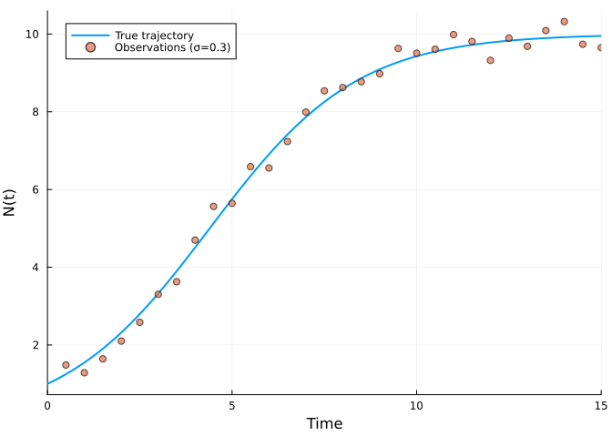
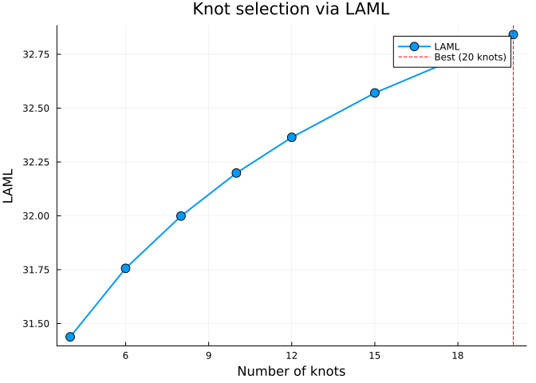
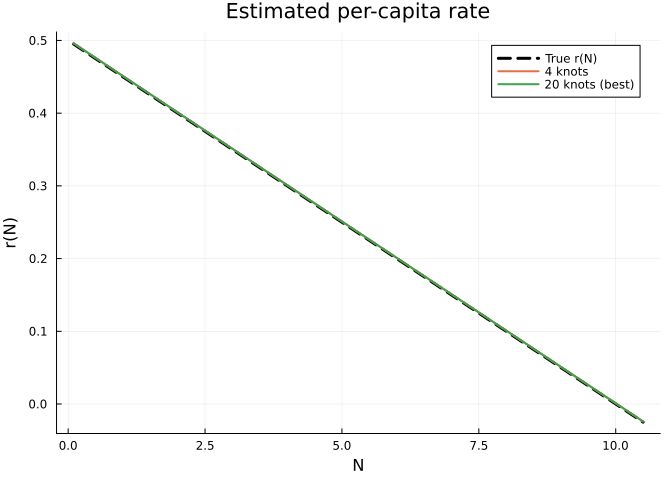
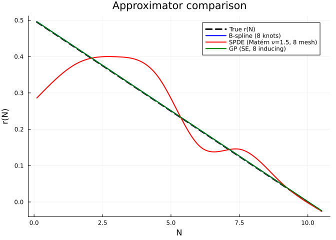
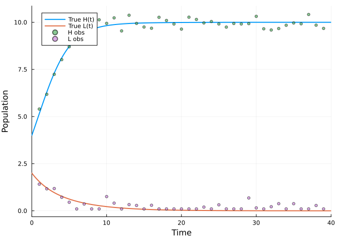
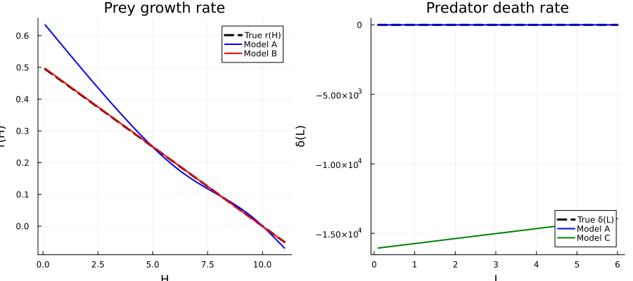
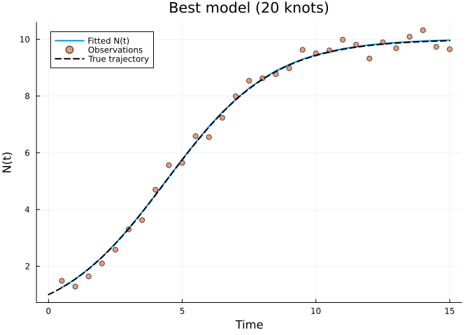
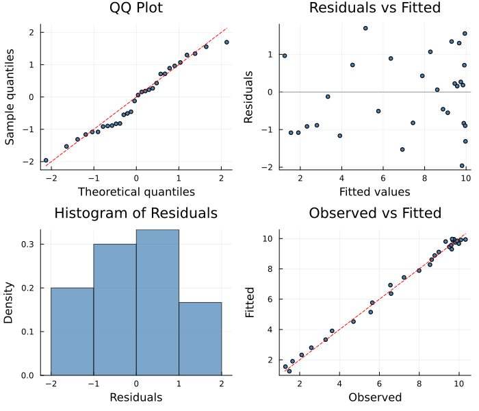

# Model Selection with Marginal Likelihood
Simon Frost
2026-08-30

- [Overview](#overview)
- [Setup](#setup)
- [Logistic Growth with Unknown Per-Capita
  Rate](#logistic-growth-with-unknown-per-capita-rate)
  - [Data generation](#data-generation)
  - [PSM dynamics](#psm-dynamics)
- [Section 1: Knot Selection for B-Spline
  Approximators](#section-1-knot-selection-for-b-spline-approximators)
  - [LAML vs number of knots](#laml-vs-number-of-knots)
  - [Summary table](#summary-table)
  - [Recovered unknown functions](#recovered-unknown-functions)
- [Section 2: Approximator Type
  Comparison](#section-2-approximator-type-comparison)
  - [Comparison table](#comparison-table)
  - [Recovered unknown functions by approximator
    type](#recovered-unknown-functions-by-approximator-type)
- [Section 3: Structural Model
  Selection](#section-3-structural-model-selection)
  - [Lotka–Volterra predator–prey](#lotkavolterra-predatorprey)
  - [Data generation](#data-generation-1)
  - [Three candidate model
    structures](#three-candidate-model-structures)
  - [Fitting all three structures](#fitting-all-three-structures)
  - [Structural comparison](#structural-comparison)
  - [Recovered unknown functions](#recovered-unknown-functions-1)
- [Section 4: Diagnostics for the Best Knot
  Model](#section-4-diagnostics-for-the-best-knot-model)
  - [Fitted trajectory](#fitted-trajectory)
  - [Residual diagnostics](#residual-diagnostics)
  - [Durbin–Watson and residual
    autocorrelation](#durbinwatson-and-residual-autocorrelation)
- [Discussion](#discussion)
  - [Guidelines for LAML-based model
    selection](#guidelines-for-laml-based-model-selection)
  - [Relationship to other criteria](#relationship-to-other-criteria)

## Overview

When fitting a partially specified model, several modelling choices must
be made:

1.  **How many knots** (or basis functions) should we use for a B-spline
    approximator?
2.  **Which approximator type** best captures the unknown function —
    B-splines, SPDE, or GP?
3.  **Which functions** in the model should be treated as unknown?

The **Laplace Approximate Marginal Likelihood (LAML)** provides a
principled criterion for answering all three questions. LAML integrates
out the unknown function coefficients via a Laplace approximation to the
marginal likelihood:

$$\mathcal{V}(\lambda) = \ell(\hat{\boldsymbol\beta}) - \tfrac{1}{2}\hat{\boldsymbol\beta}'\mathbf{S}_\lambda\hat{\boldsymbol\beta} + \tfrac{1}{2}\log|\mathbf{S}_\lambda|_+ - \tfrac{1}{2}\log|\mathbf{H}| + \tfrac{M_p}{2}\log(2\pi)$$

where $\mathbf{S}_\lambda$ is the penalty matrix scaled by the smoothing
parameter $\lambda$, $|\cdot|_+$ denotes the pseudo-determinant (the
product of the positive eigenvalues, since $\mathbf{S}_\lambda$ is rank
deficient), $\mathbf{H}$ is the Hessian of the penalized log-likelihood,
and $M_p$ is the penalty null-space dimension. For Gaussian data with
unknown $\sigma^2$ this reduces to profiled REML.

**Which field to select on.** The criterion value $\mathcal{V}$ at the
returned fit is exposed as `sol.convergence.laml`, and it is
**maximized** — larger is better. This is the quantity every table below
reports and every selection below uses. It is *not* `sol.objective`,
which for `LAML` is the final penalized objective
$\tfrac{1}{2}(\|\mathbf{y}-\hat{\mathbf{y}}\|^2 + \hat{\boldsymbol\beta}'\mathbf{S}_\lambda\hat{\boldsymbol\beta})$
— a measure of penalized fit that carries **no complexity term**, so
ranking models by it simply rewards whichever model fits hardest. Two
further caveats: `convergence.laml` is `NaN` when a fit has no penalized
term or the criterion evaluation failed (the helper below treats `NaN`
as the worst score), and it exists only on `LAML` solutions —
`GCVSolver` reports `convergence.gcv`/`convergence.ncv` (both
*minimized*), and `CollocationLAML` exposes no comparable criterion at
all.

This vignette demonstrates LAML-based model selection on two example
systems: logistic growth and Lotka–Volterra predator–prey.

## Setup

``` julia
using PartiallySpecifiedModels
using PartiallySpecifiedModels: solve
using OrdinaryDiffEq
using Plots
using Random
using DataFrames
using Printf
Random.seed!(42)

# LAML is a MAXIMIZED criterion, and `sol.convergence.laml` is NaN when a
# fit has no penalized term or the criterion evaluation failed. Selecting
# with a bare `argmax` would be unreliable in that case, so treat NaN as
# the worst possible score.
best_by_laml(v) = argmax([isnan(x) ? -Inf : x for x in Float64.(v)])

# A LAML score is only meaningful if the fit it came from is itself sound. A
# runaway λ can collapse a spline onto nothing (EDF → 0), which removes the
# unknown function from the model entirely — and such a degenerate fit can post
# a very large LAML score. Note `converged` does NOT catch this; the
# `stationarity` diagnostic does. Section 3 has a live example.
is_comparable(sol) = isfinite(sol.convergence.laml) && sol.edf > 0.5 &&
                     isfinite(sol.convergence.stationarity) &&
                     sol.convergence.stationarity < 1e3
```

    is_comparable (generic function with 1 method)

## Logistic Growth with Unknown Per-Capita Rate

### Data generation

We consider logistic growth where the per-capita growth rate $r(N)$ is
treated as unknown:

$$\frac{dN}{dt} = r(N) \cdot N$$

The true per-capita rate is linear: $r(N) = 0.5\,(1 - N/10)$, giving a
carrying capacity of $K = 10$.

    30×1 Matrix{Float64}:
      1.4850697682783507
      1.28432364973933
      1.6421516203358695
      2.099718141520716
      2.583777532153197
      3.302506560365743
      3.626350402174367
      4.698048204625014
      5.5634836375025145
      5.644970200453003
      ⋮
      9.98530871405953
      9.808508174376694
      9.322531197944425
      9.89462462579148
      9.683743079449224
     10.090554453697491
     10.319500028628116
      9.73668371630828
      9.64864965922381

``` julia
plot(sol_true, label="True trajectory", lw=2, xlabel="Time", ylabel="N(t)")
scatter!(data_t, data_N, label="Observations (σ=$σ_obs)", ms=4, alpha=0.7)
```



### PSM dynamics

The partially specified model replaces the known $r(N)$ with an unknown
function to be estimated from data:

``` julia
function logistic!(du, u, p, t)
    N = u[1]
    du[1] = p.r(N) * N
end
```

    logistic! (generic function with 1 method)

## Section 1: Knot Selection for B-Spline Approximators

A key modelling choice for B-spline approximators is the number of
knots. Too few knots restrict the function space and lead to
underfitting; too many create an overly flexible basis that can overfit
despite the smoothing penalty. LAML provides a principled way to choose.

We fit the logistic growth model with B-spline approximators using 4 to
20 knots, recording the LAML objective, effective degrees of freedom
(EDF), and data-space sum of squares for each.

``` julia
N_domain = (0.1, 10.5)
knot_counts = [4, 6, 8, 10, 12, 15, 20]
knot_results = []

for nk in knot_counts
    uf = BSplineApproximator(:r, N_domain, nk; initial=x -> 0.3)
    prob = PSMProblem(logistic!, [1.0], tspan, [uf];
        data_times=data_t, data_values=data_vals,
        obs_to_state=[1], known_params=(;),
        solver=Tsit5())
    sol = solve(prob, LAML(maxiters=80, verbose=false))
    push!(knot_results, (nk=nk, laml=sol.convergence.laml, edf=sol.edf, ss=sol.data_loss))
end
```

### LAML vs number of knots

In principle the criterion balances underfitting (too few knots) against
overfitting (too many knots), and one expects a peak at some
intermediate knot count. What the table below actually shows is more
interesting, and is the standard result for a well-penalized spline:
**every knot count from 4 to 20 produces the same fit** — identical
effective degrees of freedom (2.0) and identical data SS (1.753).

The reason is that $\lambda$ is estimated, not fixed. The true $r(N)$ is
linear, so LAML drives $\lambda$ up until the fit collapses onto the
penalty null space — the straight lines — and that null space is
two-dimensional no matter how many knots the basis started with. Extra
knots add flexibility that the penalty then removes.

So the knot count is not really a model-selection question here: **once
the smoothing parameter is estimated, the basis size stops mattering,
provided it is generous enough to contain the truth.** The LAML values
do drift slightly upward with more knots, so `argmax` formally selects
the largest basis, but the differences are small and the fitted function
is unchanged — the choice is immaterial rather than important. The
practical advice is to pick a basis comfortably larger than you think
you need and let the penalty do the work.

``` julia
laml_vals = [r.laml for r in knot_results]
best_idx = best_by_laml(laml_vals)
best_nk = knot_results[best_idx].nk

plot(knot_counts, laml_vals,
    marker=:circle, ms=6, lw=2,
    xlabel="Number of knots", ylabel="LAML",
    title="Knot selection via LAML",
    label="LAML", legend=:topright)
vline!([best_nk], ls=:dash, color=:red, label="Best ($best_nk knots)")
```



### Summary table

``` julia
println("| Knots | LAML | EDF | Data SS | Selected |")
println("|------:|-----:|----:|--------:|:--------:|")
for r in knot_results
    marker = r.nk == best_nk ? " ✓" : ""
    @printf("| %d | %.2f | %.1f | %.3f |%s |\n", r.nk, r.laml, r.edf, r.ss, marker)
end
```

| Knots |  LAML | EDF | Data SS | Selected |
|------:|------:|----:|--------:|:--------:|
|     4 | 31.44 | 2.0 |   1.753 |          |
|     6 | 31.76 | 2.0 |   1.753 |          |
|     8 | 32.00 | 2.0 |   1.753 |          |
|    10 | 32.20 | 2.0 |   1.753 |          |
|    12 | 32.36 | 2.0 |   1.753 |          |
|    15 | 32.57 | 2.0 |   1.753 |          |
|    20 | 32.84 | 2.0 |   1.753 |    ✓     |

### Recovered unknown functions

We plot the estimated $r(N)$ for a few representative knot counts
against the truth.

``` julia
N_grid = range(N_domain[1], N_domain[2], length=200)
r_true = [0.5 * (1.0 - N / 10.0) for N in N_grid]

selected_knots = unique([4, best_nk, 20])
p_uf = plot(N_grid, r_true, lw=3, ls=:dash, color=:black, label="True r(N)",
    xlabel="N", ylabel="r(N)", title="Estimated per-capita rate")

for nk in selected_knots
    uf = BSplineApproximator(:r, N_domain, nk; initial=x -> 0.3)
    prob = PSMProblem(logistic!, [1.0], tspan, [uf];
        data_times=data_t, data_values=data_vals,
        obs_to_state=[1], known_params=(;),
        solver=Tsit5())
    sol = solve(prob, LAML(maxiters=80, verbose=false))
    r_hat = [sol.unknown_functions[:r](N) for N in N_grid]
    lbl = nk == best_nk ? "$nk knots (best)" : "$nk knots"
    plot!(p_uf, N_grid, r_hat, lw=2, label=lbl)
end
display(p_uf)
```



> [!NOTE]
>
> All of these curves lie essentially on top of one another, which is
> the point: with $\lambda$ estimated, the 4-knot and 20-knot bases
> recover the same linear $r(N)$. The extra knots do not buy extra
> wiggle, because the penalty removes it. Had we fixed $\lambda$ instead
> of estimating it, the knot count would have mattered a great deal.

## Section 2: Approximator Type Comparison

Different approximator types encode different prior assumptions about
the unknown function. We compare three types on the same logistic growth
problem, each with 8 basis functions:

- **B-spline**: Local polynomial basis with a second-derivative
  roughness penalty.
- **SPDE**: Matérn covariance via a stochastic PDE discretization
  ($\nu = 1.5$), giving a stationary GP-like prior.
- **GP**: Gaussian process with a squared-exponential kernel and
  inducing-point approximation.

``` julia
uf_bspline = BSplineApproximator(:r, N_domain, 8; initial=x -> 0.3)
uf_spde = SPDEApproximator(:r, N_domain, 8; nu=1.5, initial=x -> 0.3)
uf_gp = GPApproximator(:r, N_domain, 8; kernel=:sqexp, initial=x -> 0.3)

approx_specs = [
    ("B-spline (8 knots)", uf_bspline),
    ("SPDE (Matérn ν=1.5, 8 mesh)", uf_spde),
    ("GP (SE, 8 inducing)", uf_gp),
]

approx_results = []
approx_solutions = Dict{String, Any}()

for (name, uf) in approx_specs
    prob = PSMProblem(logistic!, [1.0], tspan, [uf];
        data_times=data_t, data_values=data_vals,
        obs_to_state=[1], known_params=(;),
        solver=Tsit5())
    sol = solve(prob, LAML(maxiters=80, verbose=false))
    push!(approx_results, (name=name, laml=sol.convergence.laml, edf=sol.edf, ss=sol.data_loss))
    approx_solutions[name] = sol
end
```

### Comparison table

``` julia
best_approx_idx = best_by_laml([r.laml for r in approx_results])
println("| Approximator | LAML | EDF | Data SS | Selected |")
println("|:-------------|-----:|----:|--------:|:--------:|")
for (i, r) in enumerate(approx_results)
    marker = i == best_approx_idx ? " ✓" : ""
    @printf("| %s | %.2f | %.1f | %.3f |%s |\n", r.name, r.laml, r.edf, r.ss, marker)
end
```

| Approximator                |  LAML | EDF | Data SS | Selected |
|:----------------------------|------:|----:|--------:|:--------:|
| B-spline (8 knots)          | 32.00 | 2.0 |   1.753 |    ✓     |
| SPDE (Matérn ν=1.5, 8 mesh) | 27.56 | 6.4 |   1.350 |          |
| GP (SE, 8 inducing)         | 32.00 | 2.0 |   1.753 |          |

### Recovered unknown functions by approximator type

``` julia
p_approx = plot(N_grid, r_true, lw=3, ls=:dash, color=:black, label="True r(N)",
    xlabel="N", ylabel="r(N)", title="Approximator comparison")

colors = [:blue, :red, :green]
for (i, (name, _)) in enumerate(approx_specs)
    sol = approx_solutions[name]
    r_hat = [sol.unknown_functions[:r](N) for N in N_grid]
    plot!(p_approx, N_grid, r_hat, lw=2, color=colors[i], label=name)
end
display(p_approx)
```



> [!NOTE]
>
> This comparison shows exactly why the criterion, and not the data SS,
> is the right thing to rank on. The SPDE fit achieves the **lowest**
> data SS of the three — it fits the observations best — but it does so
> with more than three times the effective degrees of freedom, and LAML
> scores it **worst**. The B-spline and GP fits both settle at EDF 2.0,
> recovering the linear truth, and score highest.
>
> Ranking by fit alone would have chosen the SPDE; ranking by the
> marginal likelihood chooses the models that match the truth. That is
> the complexity penalty doing its job, and it is why `sol.objective` —
> which contains no such penalty — must not be used for model selection.

## Section 3: Structural Model Selection

Beyond choosing approximator details, LAML can guide **structural**
model selection — deciding which functions in a multi-species model
should be estimated nonparametrically and which should remain
parametric.

### Lotka–Volterra predator–prey

Consider a predator–prey system with unknown prey growth rate $r(H)$ and
predator death rate $\delta(L)$:

$$\begin{aligned}
\frac{dH}{dt} &= r(H) \cdot H - \alpha \, H \, L \\
\frac{dL}{dt} &= \alpha \, H \, L - \delta(L) \cdot L
\end{aligned}$$

The true functions are $r(H) = 0.5\,(1 - H/10)$ (logistic prey growth)
and $\delta(L) = 0.3$ (constant predator mortality).

### Data generation

    40×2 Matrix{Float64}:
      5.39762  1.41211
      6.18014  1.16718
      7.24009  1.18102
      8.01835  0.717484
      8.70161  0.453903
      9.16875  0.1
      9.13464  0.360881
      9.90426  0.1
     10.1329   0.1
      9.94264  0.754143
      ⋮        
      9.59146  0.216852
      9.66861  0.378471
      9.84234  0.1
      9.96414  0.377672
      9.92057  0.1
     10.4144   0.1
      9.84722  0.282145
      9.67535  0.1
     10.5524   0.1

``` julia
plot(sol_lv_true, label=["True H(t)" "True L(t)"], lw=2,
    xlabel="Time", ylabel="Population")
scatter!(data_t_lv, data_H, label="H obs", ms=3, alpha=0.6)
scatter!(data_t_lv, data_L, label="L obs", ms=3, alpha=0.6)
```



### Three candidate model structures

We compare three structural models that differ in which functions are
treated as unknown:

**Model A** — Both $r(H)$ and $\delta(L)$ unknown (2 UFs):

``` julia
function lv_both!(du, u, p, t)
    H, L = u
    du[1] = p.r(H) * H - 0.01 * H * L
    du[2] = 0.01 * H * L - p.δ(L) * L
end
```

    lv_both! (generic function with 1 method)

**Model B** — Only $r(H)$ unknown; $\delta$ is a fitted constant (1 UF):

``` julia
function lv_r_only!(du, u, p, t)
    H, L = u
    du[1] = p.r(H) * H - 0.01 * H * L
    du[2] = 0.01 * H * L - p.δ * L
end
```

    lv_r_only! (generic function with 1 method)

**Model C** — Only $\delta(L)$ unknown; $r$ is a fitted constant (1 UF):

``` julia
function lv_delta_only!(du, u, p, t)
    H, L = u
    du[1] = p.r * H - 0.01 * H * L
    du[2] = 0.01 * H * L - p.δ(L) * L
end
```

    lv_delta_only! (generic function with 1 method)

### Fitting all three structures

``` julia
H_domain = (0.1, 11.0)
L_domain = (0.1, 6.0)
nk_lv = 8
lv_solver = LAML(maxiters=100, verbose=false)

# Model A: both r(H) and δ(L) unknown
uf_r_A = BSplineApproximator(:r, H_domain, nk_lv; initial=x -> 0.3)
uf_δ_A = BSplineApproximator(:δ, L_domain, nk_lv; initial=x -> 0.3)
prob_A = PSMProblem(lv_both!, u0_lv, tspan_lv, [uf_r_A, uf_δ_A];
    data_times=data_t_lv, data_values=data_vals_lv,
    obs_to_state=[1, 2], known_params=(;),
    solver=Tsit5())
sol_A = solve(prob_A, lv_solver)

# Model B: only r(H) unknown, δ constant
uf_r_B = BSplineApproximator(:r, H_domain, nk_lv; initial=x -> 0.3)
prob_B = PSMProblem(lv_r_only!, u0_lv, tspan_lv, [uf_r_B];
    data_times=data_t_lv, data_values=data_vals_lv,
    obs_to_state=[1, 2], known_params=(δ=0.3,),
    solver=Tsit5())
sol_B = solve(prob_B, lv_solver)

# Model C: only δ(L) unknown, r constant
uf_δ_C = BSplineApproximator(:δ, L_domain, nk_lv; initial=x -> 0.3)
prob_C = PSMProblem(lv_delta_only!, u0_lv, tspan_lv, [uf_δ_C];
    data_times=data_t_lv, data_values=data_vals_lv,
    obs_to_state=[1, 2], known_params=(r=0.5,),
    solver=Tsit5())
sol_C = solve(prob_C, lv_solver)
```

    PSMSolution((δ = [-16062.577342910165, -15760.152346849894, -15457.72735078963, -15155.302354729458, -14852.87735866942, -14550.45236260947, -14248.027366549535, -13945.602370489576]), -6.326341023286257e11, 82272.4126450235, 4.232598042395698e-9, [2.3538526683702056e16], [4.211069186413606 44.86645038475608; 4.432891348933726 44.8664563634304; … ; 29.6176995878095 44.867158142001216; 31.177614174949895 44.867201774020735], [5.397618111676317 1.412112277516411; 6.180136366182137 1.1671751794770528; … ; 9.675345953433288 0.1; 10.552385211138148 0.1], [1.0, 2.0, 3.0, 4.0, 5.0, 6.0, 7.0, 8.0, 9.0, 10.0  …  31.0, 32.0, 33.0, 34.0, 35.0, 36.0, 37.0, 38.0, 39.0, 40.0], Dict{Symbol, Any}(:δ => DataInterpolations.CubicSpline{Vector{Float64}, Vector{Float64}, Vector{Float64}, Vector{Float64}, Vector{Float64}, Vector{Float64}, Float64}([-16062.577342910165, -15760.152346849894, -15457.72735078963, -15155.302354729458, -14852.87735866942, -14550.45236260947, -14248.027366549535, -13945.602370489576], [0.1, 0.9428571428571428, 1.7857142857142858, 2.6285714285714286, 3.4714285714285715, 4.314285714285714, 5.1571428571428575, 6.0], Float64[], DataInterpolations.CubicSplineParameterCache{Vector{Float64}}(Float64[], Float64[]), [0.0, 0.8428571428571429, 0.842857142857143, 0.8428571428571427, 0.842857142857143, 0.8428571428571425, 0.8428571428571434, 0.8428571428571425], [0.0, 2.5444500243592775e-11, -1.4817764592922725e-10, -2.1559304245105946e-10, -1.2678101641580016e-10, -1.3202842099970371e-11, 5.38817188333387e-11, 0.0], DataInterpolations.ExtrapolationType.Linear, DataInterpolations.ExtrapolationType.Linear, FindFirstFunctions.Guesser{Vector{Float64}}([0.1, 0.9428571428571428, 1.7857142857142858, 2.6285714285714286, 3.4714285714285715, 4.314285714285714, 5.1571428571428575, 6.0], Base.RefValue{Int64}(1), true), false, false)), (V_beta = [3.6014477902254233e-9 2.8811569639810574e-9 … -7.202971660090793e-10 -1.440587991835432e-9; 2.8811569639810574e-9 2.3666679382786785e-9 … -2.0577719019022334e-10 -7.202662158255216e-10; … ; -7.202971660090793e-10 -2.0577719019022334e-10 … 2.3668226891964864e-9 2.8813426650824257e-9; -1.440587991835432e-9 -7.202662158255216e-10 … 2.8813426650824257e-9 3.601664441510353e-9], sigma2 = 1028.405158117204, converged = true, iterations = 17, reason = :converged_tol, laml_failures = 0, criterion = :working, laml = 2670.8529720669944, stationarity = 2.9264188250739167e41, smoothing_advanced = true))

### Structural comparison

``` julia
struct_results = [
    ("A: r(H) + δ(L) unknown", sol_A),
    ("B: r(H) unknown, δ const", sol_B),
    ("C: δ(L) unknown, r const", sol_C),
]

# Score only the fits that pass the soundness check; a degenerate fit is not a
# candidate model, it is a failed one.
scores = [is_comparable(s) ? s.convergence.laml : -Inf for (_, s) in struct_results]
best_struct = argmax(scores)

println("| Model structure | LAML | EDF | Data SS | Sound? | Selected |")
println("|:----------------|-----:|----:|--------:|:------:|:--------:|")
for (i, (name, s)) in enumerate(struct_results)
    marker = i == best_struct ? " ✓" : ""
    sound = is_comparable(s) ? "yes" : "**no**"
    @printf("| %s | %.2f | %.1f | %.3f | %s |%s |\n",
            name, s.convergence.laml, s.edf, s.data_loss, sound, marker)
end
```

| Model structure          |    LAML | EDF |   Data SS | Sound? | Selected |
|:-------------------------|--------:|----:|----------:|:------:|:--------:|
| A: r(H) + δ(L) unknown   | 2574.00 | 0.0 | 10940.649 | **no** |          |
| B: r(H) unknown, δ const |  105.02 | 2.0 |     4.504 |  yes   |    ✓     |
| C: δ(L) unknown, r const | 2670.85 | 0.0 | 82272.413 | **no** |          |

### Recovered unknown functions

``` julia
H_grid = range(H_domain[1], H_domain[2], length=200)
L_grid = range(L_domain[1], L_domain[2], length=200)
r_true_lv = [0.5 * (1.0 - H / 10.0) for H in H_grid]
δ_true_lv = fill(0.3, length(L_grid))

p1 = plot(H_grid, r_true_lv, lw=3, ls=:dash, color=:black, label="True r(H)",
    xlabel="H", ylabel="r(H)", title="Prey growth rate")
if haskey(sol_A.unknown_functions, :r)
    plot!(p1, H_grid, [sol_A.unknown_functions[:r](H) for H in H_grid],
        lw=2, color=:blue, label="Model A")
end
plot!(p1, H_grid, [sol_B.unknown_functions[:r](H) for H in H_grid],
    lw=2, color=:red, label="Model B")

p2 = plot(L_grid, δ_true_lv, lw=3, ls=:dash, color=:black, label="True δ(L)",
    xlabel="L", ylabel="δ(L)", title="Predator death rate")
if haskey(sol_A.unknown_functions, :δ)
    plot!(p2, L_grid, [sol_A.unknown_functions[:δ](L) for L in L_grid],
        lw=2, color=:blue, label="Model A")
end
plot!(p2, L_grid, [sol_C.unknown_functions[:δ](L) for L in L_grid],
    lw=2, color=:green, label="Model C")

plot(p1, p2, layout=(1, 2), size=(900, 400))
```



> [!NOTE]
>
> Since the true predator death rate $\delta$ is constant, LAML should
> favour Model B (only $r(H)$ unknown). Model C — which fixes $r$ as
> constant — is the misspecified one, since the true prey growth is
> nonlinear. Model B is indeed selected, and it is the only one of the
> three whose fit is sound enough to compare (see the warning below).

> [!WARNING]
>
> ### A criterion is only as good as the fit underneath it
>
> Model C is worth studying rather than skipping past. Its smoothing
> parameter runs away (λ of order $10^{16}$), the spline collapses to an
> effective dimension of essentially zero — meaning there is no unknown
> function left in the model at all — and its data SS is four orders of
> magnitude worse than Model B’s.
>
> It would be comfortable to blame misspecification: Model C does fix $r$
> as constant when the true prey growth is nonlinear. But the table
> refutes that story. **Model A collapses in exactly the same way** —
> same runaway λ, same effective dimension of zero — and Model A is *not*
> misspecified: it leaves both functions free and so nests the truth. λ
> runaway is a failure of the fit, not a verdict on the model, and it can
> strike the most general model in the set.
>
> And yet **Model C posts by far the largest raw LAML score**, and its
> `convergence.converged` flag is `true`. Selecting by `argmax` on the
> raw criterion alone would pick the worst model in the set, and the
> usual convergence flag would not warn you.
>
> Two lessons follow. First, `converged` means “a stopping criterion
> fired”, not “the answer is good” — for LAML fits,
> `convergence.stationarity` is the diagnostic that exposes this
> failure, and it differs by tens of orders of magnitude between the
> sound and the degenerate fits here. Second, a marginal likelihood is
> only comparable across models when each fit is individually sound;
> screen the fits first, then rank the survivors. That is what
> `is_comparable` does above, and it is why the table carries a “Sound?”
> column.

## Section 4: Diagnostics for the Best Knot Model

We refit the best model from Section 1 and examine its diagnostic plots.

``` julia
uf_best = BSplineApproximator(:r, N_domain, best_nk; initial=x -> 0.3)
prob_best = PSMProblem(logistic!, [1.0], tspan, [uf_best];
    data_times=data_t, data_values=data_vals,
    obs_to_state=[1], known_params=(;),
    solver=Tsit5())
sol_best = solve(prob_best, LAML(maxiters=80, verbose=false))
```

    PSMSolution((r = [0.4960425763389873, 0.4686699094719531, 0.4412972426004149, 0.4139245748107459, 0.3865519006979239, 0.35917921066663294, 0.3318064937174607, 0.3044337394795158, 0.2770609393161219, 0.24968808781526627, 0.22231518336539882, 0.1949422258593134, 0.16756921423901114, 0.14019614610056175, 0.11282301690533325, 0.08544982482483286, 0.05807657555759959, 0.03070328066668578, 0.003329960460910368, -0.024043363234119357]), 0.8766451619056769, 1.7532840787788684, 2.0001029111499875, [27150.937500330747], [1.2491998388019596; 1.549829217384459; … ; 9.956408146065023; 9.970259496594556;;], [1.4850697682783507; 1.28432364973933; … ; 9.73668371630828; 9.64864965922381;;], [0.5, 1.0, 1.5, 2.0, 2.5, 3.0, 3.5, 4.0, 4.5, 5.0  …  10.5, 11.0, 11.5, 12.0, 12.5, 13.0, 13.5, 14.0, 14.5, 15.0], Dict{Symbol, Any}(:r => DataInterpolations.CubicSpline{Vector{Float64}, Vector{Float64}, Vector{Float64}, Vector{Float64}, Vector{Float64}, Vector{Float64}, Float64}([0.4960425763389873, 0.4686699094719531, 0.4412972426004149, 0.4139245748107459, 0.3865519006979239, 0.35917921066663294, 0.3318064937174607, 0.3044337394795158, 0.2770609393161219, 0.24968808781526627, 0.22231518336539882, 0.1949422258593134, 0.16756921423901114, 0.14019614610056175, 0.11282301690533325, 0.08544982482483286, 0.05807657555759959, 0.03070328066668578, 0.003329960460910368, -0.024043363234119357], [0.1, 0.6473684210526316, 1.194736842105263, 1.7421052631578948, 2.289473684210526, 2.836842105263158, 3.3842105263157896, 3.931578947368421, 4.478947368421053, 5.026315789473684, 5.573684210526316, 6.121052631578947, 6.668421052631579, 7.21578947368421, 7.7631578947368425, 8.310526315789474, 8.857894736842105, 9.405263157894737, 9.952631578947368, 10.5], Float64[], DataInterpolations.CubicSplineParameterCache{Vector{Float64}}(Float64[], Float64[]), [0.0, 0.5473684210526316, 0.5473684210526315, 0.5473684210526317, 0.5473684210526313, 0.547368421052632, 0.5473684210526315, 0.5473684210526315, 0.5473684210526315, 0.5473684210526315, 0.5473684210526315, 0.5473684210526315, 0.5473684210526315, 0.5473684210526315, 0.5473684210526324, 0.5473684210526315, 0.5473684210526315, 0.5473684210526315, 0.5473684210526315, 0.5473684210526315], [0.0, -3.489691984406758e-11, 4.939196523092683e-11, -1.854905595173818e-8, -5.2479919694497575e-8, -9.031273373628404e-8, -1.2532361077890784e-7, -1.5513359143365876e-7, -1.7383990199237616e-7, -1.7758503794093043e-7, -1.7617090400819797e-7, -1.8022920226153988e-7, -1.8659750937466748e-7, -2.0520682060877182e-7, -2.1529140135108615e-7, -1.9296095986586451e-7, -1.5807984259641224e-7, -8.837436695181054e-8, 4.6247380840089784e-9, 0.0], DataInterpolations.ExtrapolationType.Linear, DataInterpolations.ExtrapolationType.Linear, FindFirstFunctions.Guesser{Vector{Float64}}([0.1, 0.6473684210526316, 1.194736842105263, 1.7421052631578948, 2.289473684210526, 2.836842105263158, 3.3842105263157896, 3.931578947368421, 4.478947368421053, 5.026315789473684, 5.573684210526316, 6.121052631578947, 6.668421052631579, 7.21578947368421, 7.7631578947368425, 8.310526315789474, 8.857894736842105, 9.405263157894737, 9.952631578947368, 10.5], Base.RefValue{Int64}(1), true), false, false)), (V_beta = [0.0009506175432486755 0.0008808599170822942 … -0.0003024572594974647 -0.00037194723747336597; 0.0008808599170822942 0.0008167843361333314 … -0.00027058507217731805 -0.00033445043716256697; … ; -0.0003024572594974647 -0.00027058507217731805 … 0.00027146940415672955 0.0003033817705102071; -0.00037194723747336597 -0.00033445043716256697 … 0.0003033817705102071 0.00034095617625022015], sigma2 = 0.06261751867213301, converged = true, iterations = 19, reason = :converged_tol, laml_failures = 0, criterion = :working, laml = 32.841490502269096, stationarity = 1.1411467591118353e-6, smoothing_advanced = true))

### Fitted trajectory

``` julia
p_traj = plot(sol_best.data_times, sol_best.fitted_values[:, 1], lw=2,
    label="Fitted N(t)",
    xlabel="Time", ylabel="N(t)", title="Best model ($best_nk knots)")
scatter!(p_traj, data_t, data_N, label="Observations", ms=4, alpha=0.7)
plot!(p_traj, sol_true.t, [sol_true.u[i][1] for i in eachindex(sol_true.u)],
    lw=2, ls=:dash, color=:black, label="True trajectory")
p_traj
```



### Residual diagnostics

``` julia
diag = appraise(sol_best)

p_qq = scatter(diag.qq_theoretical, diag.qq_sample,
    xlabel="Theoretical quantiles", ylabel="Sample quantiles",
    title="QQ Plot", ms=3, legend=false, color=:steelblue)
mn, mx = extrema(vcat(diag.qq_theoretical, diag.qq_sample))
plot!(p_qq, [mn, mx], [mn, mx], color=:red, ls=:dash, label="")

p_rf = scatter(diag.fitted, diag.residuals,
    xlabel="Fitted values", ylabel="Residuals",
    title="Residuals vs Fitted", ms=3, legend=false, color=:steelblue)
hline!(p_rf, [0], color=:gray, ls=:dot)

p_hist = histogram(diag.residuals, normalize=:pdf,
    xlabel="Residuals", ylabel="Density",
    title="Histogram of Residuals", legend=false, color=:steelblue, alpha=0.7)

p_of = scatter(diag.observed, diag.fitted,
    xlabel="Observed", ylabel="Fitted",
    title="Observed vs Fitted", ms=3, legend=false, color=:steelblue)
mn2, mx2 = extrema(vcat(diag.observed, diag.fitted))
plot!(p_of, [mn2, mx2], [mn2, mx2], color=:red, ls=:dash, label="")

plot(p_qq, p_rf, p_hist, p_of, layout=(2, 2), size=(700, 600))
```



### Durbin–Watson and residual autocorrelation

    Durbin-Watson: 1.844
    Residual ACF (lags 1–5): [0.026, -0.2, -0.089, -0.234, 0.07]

## Discussion

### Guidelines for LAML-based model selection

1.  **Knot selection**: Start with a moderate number (6–10) and sweep
    upwards. Remember LAML is *maximized*, so look for a peak or — as in
    Section 1 — a plateau, which is the common outcome once λ is
    estimated. Unlike cross-validation, LAML does not require held-out
    data or repeated fitting.

2.  **Approximator comparison**: LAML enables fair comparison across
    approximator types because it accounts for effective complexity
    (EDF), not just the number of parameters. A GP with 8 inducing
    points may have a very different EDF from a B-spline with 8 knots.

3.  **Structural selection**: LAML naturally penalises unnecessary
    complexity. If a function is truly constant, a nonparametric
    estimate will have low EDF and the LAML penalty for the extra
    smoothing parameters will make the simpler parametric model
    preferable.

4.  **Caveats**: LAML is based on a Laplace approximation and assumes a
    Gaussian error model (or a well-specified likelihood). For highly
    non-Gaussian data or multi-modal posteriors, consider the MCMC or
    ABC approaches in other vignettes.

### Relationship to other criteria

The table below situates LAML among the criteria you may know from
elsewhere. **Only the two marked “implemented” are available in this
package** — `LAML` exposes `sol.convergence.laml`, and `GCVSolver`
exposes `sol.convergence.gcv` (or `.ncv` with `criterion=:ncv`). The
package exports no AIC, BIC, WAIC or LOO accessor; those rows are for
orientation only, and computing them would be your own work.

| Criterion | Accounts for smoothing? | Requires refitting? | Bayesian? | In this package |
|:---|:--:|:--:|:--:|:--:|
| AIC | No | No | No | No |
| BIC | No | No | No | No |
| GCV | Yes | No | No | **Implemented** |
| LAML | Yes | No | Yes (approx.) | **Implemented** |
| WAIC/LOO | Yes | Yes (MCMC) | Yes | No |

Note also that GCV and NCV are **minimized** while LAML is
**maximized**, so the direction of the comparison flips depending on
which solver produced the fit.

LAML and GCV are closely related — both optimise a criterion that
balances fit against complexity. LAML has a more natural Bayesian
interpretation as an approximate marginal likelihood, while GCV
minimises an estimate of prediction error. In practice they often agree;
when they differ, LAML tends to be more conservative (fewer EDF).

> [!TIP]
>
> ### See Also
>
> - [Vignette 05: Neural
>   Networks](../05_neural_networks/05_neural_networks.qmd) —
>   approximator type comparison with neural networks
> - [Vignette 06: Solver
>   Comparison](../06_solver_comparison/06_solver_comparison.qmd) —
>   solver method comparison
> - [Vignette 21: GCV](../21_gcv/21_gcv.qmd) — GCV-based smoothing
>   parameter selection
> - [Vignette 26: SPDE](../26_spde/26_spde.qmd) — SPDE approximator
>   details
> - [Vignette 29: Bootstrap](../29_bootstrap/29_bootstrap.qmd) —
>   uncertainty quantification for selected models
