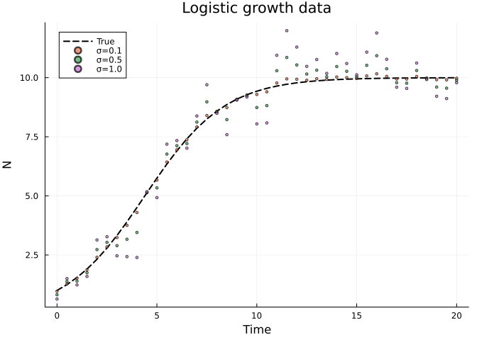
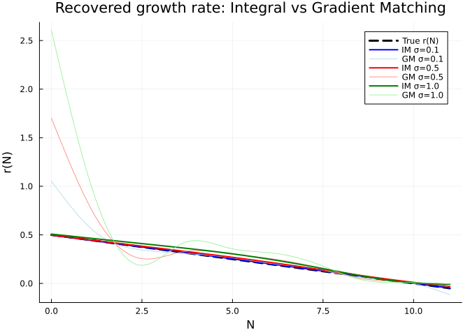
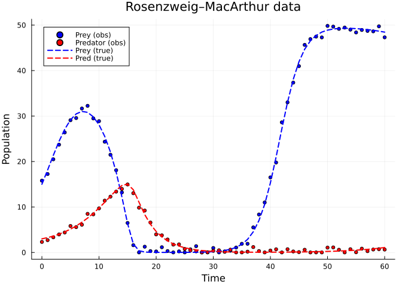
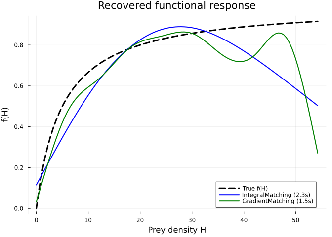
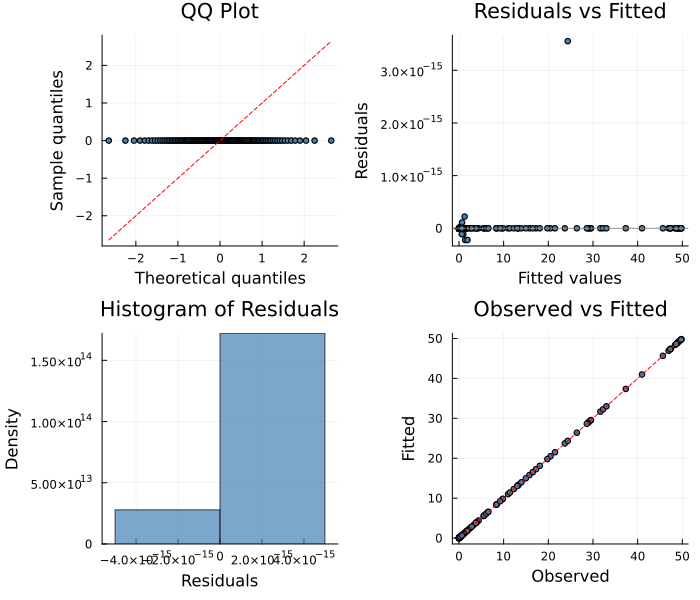

# Integral Matching: Noise-Robust Integration-Free Estimation
Simon Frost
2026-06-12

- [Overview](#overview)
- [Setup](#setup)
- [Example 1: Logistic Growth with Noisy
  Data](#example-1-logistic-growth-with-noisy-data)
  - [Generate data with varying noise
    levels](#generate-data-with-varying-noise-levels)
  - [Compare IntegralMatching vs GradientMatching across noise
    levels](#compare-integralmatching-vs-gradientmatching-across-noise-levels)
- [Example 2: Predator–Prey with Unknown Functional
  Response](#example-2-predatorprey-with-unknown-functional-response)
- [Diagnostic Plots](#diagnostic-plots)
- [How It Works](#how-it-works)
- [References](#references)

## Overview

The **IntegralMatchingSolver** (Dattner & Klaassen, 2015) takes a
fundamentally different approach to ODE parameter estimation. Instead of
matching noisy derivatives (gradient matching) or repeatedly integrating
the ODE (LAML, Adam), it **integrates both sides** of the ODE:

$$x(t_i) - x(t_1) = \int_{t_1}^{t_i} f(x(s), p, s) \, ds$$

The left side comes from smoothed data; the right side is computed via
trapezoidal quadrature at the smoothed state values. Because integration
smooths out noise, this is inherently more robust than derivative-based
methods.

**When to use IntegralMatchingSolver:**

- Data are noisy or sparse (integrals are more stable than derivatives)
- You want an integration-free method but worry about derivative
  estimation quality
- You want a simple, fast method for initial exploration

## Setup

``` julia
using PartiallySpecifiedModels
using PartiallySpecifiedModels: solve
using OrdinaryDiffEq
using Plots
using Random
Random.seed!(42)
```

    TaskLocalRNG()

## Example 1: Logistic Growth with Noisy Data

We fit a logistic growth model $dN/dt = r(N) \cdot N$ where the
per-capita growth rate $r(N) = 0.5(1 - N/K)$ is treated as unknown.

### Generate data with varying noise levels

``` julia
r_true(N) = 0.5 * (1.0 - N / 10.0)
function logistic!(du, u, p, t)
    du[1] = p.r(u[1]) * u[1]
end

sol_true = OrdinaryDiffEq.solve(
    ODEProblem(logistic!, [1.0], (0.0, 20.0), (; r=r_true)),
    Tsit5(); saveat=0.5)
t_data = collect(sol_true.t)
y_clean = [sol_true.u[i][1] for i in 1:length(t_data)]

# Three noise levels
noise_levels = [0.1, 0.5, 1.0]
p_data = plot(t_data, y_clean, label="True", lw=2, color=:black, ls=:dash,
              xlabel="Time", ylabel="N", title="Logistic growth data")
for (i, σ) in enumerate(noise_levels)
    rng = Random.Xoshiro(42)
    y_noisy = max.(y_clean .+ σ .* randn(rng, length(t_data)), 0.01)
    scatter!(p_data, t_data, y_noisy, label="σ=$σ", ms=2, alpha=0.7)
end
p_data
```



### Compare IntegralMatching vs GradientMatching across noise levels

``` julia
N_grid = range(0.0, 11.0, length=100)
r_true_vals = [r_true(n) for n in N_grid]

p_compare = plot(N_grid, r_true_vals, label="True r(N)", lw=3, color=:black, ls=:dash,
    xlabel="N", ylabel="r(N)", title="Recovered growth rate: Integral vs Gradient Matching")

colors_im = [:blue, :red, :green]
colors_gm = [:lightblue, :salmon, :lightgreen]

for (i, σ) in enumerate(noise_levels)
    rng = Random.Xoshiro(42)
    y_noisy = max.(y_clean .+ σ .* randn(rng, length(t_data)), 0.01)
    
    uf = BSplineApproximator(:r, (0.0, 11.0), 10)
    prob = PSMProblem(logistic!, [1.0], (0.0, 20.0), [uf];
        data_times=t_data, data_values=reshape(y_noisy, :, 1),
        obs_to_state=[1], known_params=NamedTuple(),
        likelihood=PartiallySpecifiedModels.Gaussian())

    sol_im = solve(prob, IntegralMatchingSolver(maxiters=800, lr=0.01, lambda_smooth=1.0, verbose=false))
    sol_gm = solve(prob, GradientMatching(maxiters=200, verbose=false))

    r_im = [sol_im.unknown_functions[:r](n) for n in N_grid]
    r_gm = [sol_gm.unknown_functions[:r](n) for n in N_grid]

    plot!(p_compare, N_grid, r_im, label="IM σ=$σ", lw=2, color=colors_im[i])
    plot!(p_compare, N_grid, r_gm, label="GM σ=$σ", lw=1, color=colors_gm[i], ls=:dot)
end
p_compare
```



> [!NOTE]
>
> At higher noise levels, IntegralMatchingSolver tends to produce
> smoother, more stable estimates than GradientMatching because
> integration acts as a natural noise filter.

## Example 2: Predator–Prey with Unknown Functional Response

We use a Rosenzweig–MacArthur model (logistic prey growth + Holling Type
II predation) where the functional response $f(H)$ is unknown:

$$\frac{dH}{dt} = 0.5\,H\!\left(1 - \frac{H}{50}\right) - f(H)\,P, \quad
\frac{dP}{dt} = 0.5\,f(H)\,P - 0.3\,P$$

The true functional response is Holling Type II: $f(H) = H/(5 + H)$.

``` julia
function lv!(du, u, p, t)
    H, P = u
    du[1] = 0.5 * H * (1.0 - H / 50.0) - p.f(H) * P
    du[2] = 0.5 * p.f(H) * P - 0.3 * P
end

f_true(H) = 1.0 * H / (5.0 + H)  # Holling Type II

sol_lv = OrdinaryDiffEq.solve(
    ODEProblem(lv!, [15.0, 3.0], (0.0, 60.0), (; f=f_true)),
    Tsit5(); saveat=1.0)
t_lv = collect(sol_lv.t)
rng_lv = Random.Xoshiro(42)
H_vals = [sol_lv.u[i][1] for i in 1:length(t_lv)]
P_vals = [sol_lv.u[i][2] for i in 1:length(t_lv)]
data_lv = hcat(
    [H_vals[i] + 1.0*randn(rng_lv) for i in 1:length(t_lv)],
    [P_vals[i] + 0.5*randn(rng_lv) for i in 1:length(t_lv)])
data_lv = max.(data_lv, 0.01)

scatter(t_lv, data_lv[:, 1], label="Prey (obs)", ms=3, color=:blue)
scatter!(t_lv, data_lv[:, 2], label="Predator (obs)", ms=3, color=:red)
plot!(t_lv, H_vals, label="Prey (true)", lw=2, ls=:dash, color=:blue)
plot!(t_lv, P_vals, label="Pred (true)", lw=2, ls=:dash, color=:red,
    xlabel="Time", ylabel="Population", title="Rosenzweig–MacArthur data")
```



``` julia
H_max = maximum(H_vals) * 1.1
uf_f = BSplineApproximator(:f, (0.0, H_max), 10; initial=0.3)
prob_lv = PSMProblem(lv!, [15.0, 3.0], (0.0, 60.0), [uf_f];
    data_times=t_lv, data_values=data_lv,
    obs_to_state=[1, 2], known_params=NamedTuple(),
    likelihood=PartiallySpecifiedModels.Gaussian())

t_im_lv = @elapsed sol_im_lv = solve(prob_lv,
    IntegralMatchingSolver(maxiters=1500, lr=0.01, lambda_smooth=1.0, verbose=false))
t_gm_lv = @elapsed sol_gm_lv = solve(prob_lv,
    GradientMatching(maxiters=200, verbose=false))
println("IntegralMatching: loss=$(round(sol_im_lv.objective, sigdigits=4)), time=$(round(t_im_lv, digits=1))s")
println("GradientMatching: loss=$(round(sol_gm_lv.objective, sigdigits=4)), time=$(round(t_gm_lv, digits=1))s")
```

    IntegralMatching: loss=172.6, time=2.3s
    GradientMatching: loss=55.33, time=1.5s

``` julia
H_grid = range(0.0, H_max, length=100)
f_true_vals = [f_true(h) for h in H_grid]

plot(H_grid, f_true_vals, label="True f(H)", lw=3, color=:black, ls=:dash,
    xlabel="Prey density H", ylabel="f(H)",
    title="Recovered functional response")
plot!(H_grid, [sol_im_lv.unknown_functions[:f](h) for h in H_grid],
    label="IntegralMatching ($(round(t_im_lv, digits=1))s)", lw=2, color=:blue)
plot!(H_grid, [sol_gm_lv.unknown_functions[:f](h) for h in H_grid],
    label="GradientMatching ($(round(t_gm_lv, digits=1))s)", lw=2, color=:green)
```



## Diagnostic Plots

``` julia
using PartiallySpecifiedModels: appraise

diag = appraise(sol_im_lv)

p_qq = scatter(diag.qq_theoretical, diag.qq_sample,
    xlabel="Theoretical quantiles", ylabel="Sample quantiles",
    title="QQ Plot", ms=3, legend=false, color=:steelblue)
mn, mx = extrema(vcat(diag.qq_theoretical, diag.qq_sample))
plot!(p_qq, [mn, mx], [mn, mx], color=:red, ls=:dash)

p_rf = scatter(diag.fitted, diag.residuals,
    xlabel="Fitted values", ylabel="Residuals",
    title="Residuals vs Fitted", ms=3, legend=false, color=:steelblue)
hline!(p_rf, [0], color=:gray, ls=:dot)

p_hist = histogram(diag.residuals, normalize=:pdf,
    xlabel="Residuals", ylabel="Density",
    title="Histogram of Residuals", legend=false, color=:steelblue, alpha=0.7)

p_of = scatter(diag.observed, diag.fitted,
    xlabel="Observed", ylabel="Fitted",
    title="Observed vs Fitted", ms=3, legend=false, color=:steelblue)
mn2, mx2 = extrema(vcat(diag.observed, diag.fitted))
plot!(p_of, [mn2, mx2], [mn2, mx2], color=:red, ls=:dash)

plot(p_qq, p_rf, p_hist, p_of, layout=(2, 2), size=(700, 600))
```



## How It Works

The algorithm proceeds in two stages:

1.  **Smooth** observed data with cubic splines → $\hat{y}(t)$
2.  **Match integrals**: for each time point $t_i$, compute
    - LHS: $\hat{y}(t_i) - \hat{y}(t_1)$ (trajectory increment from
      smoothed data)
    - RHS:
      $\sum_{j=1}^{i-1} \frac{f(\hat{y}(t_j), \beta) + f(\hat{y}(t_{j+1}), \beta)}{2} \Delta t_j$
      (trapezoidal quadrature)
    - Minimise
      $\sum_i \|\text{LHS}_i - \text{RHS}_i\|^2 + \lambda \beta' S \beta$

The key insight is that cumulative integrals are much less sensitive to
noise than pointwise derivatives. This makes the method particularly
attractive when data are noisy or irregularly sampled.

## References

- Dattner, I. & Klaassen, C.A.J. (2015). Optimal rate of direct
  estimators in systems of ordinary differential equations linear in
  functions of the parameters. *Electronic Journal of Statistics*, 9(2),
  1939–1973.
- Yaari, R. & Dattner, I. (2020). simode: R package for statistical
  inference of ordinary differential equations. *JOSS*, 5(45).
