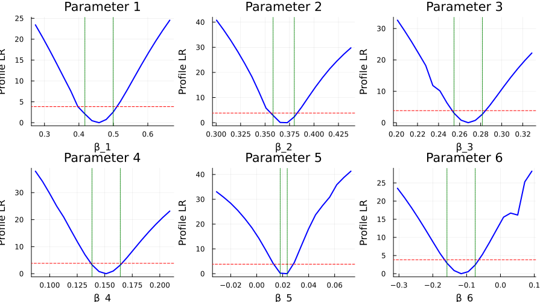
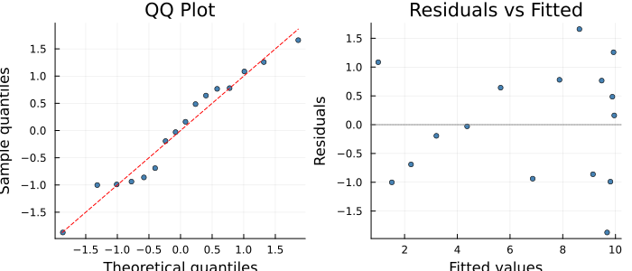

# Profile Likelihood for Identifiability Analysis
Simon Frost
2026-06-12

- [Overview](#overview)
- [Setup](#setup)
- [Example: Logistic Growth
  Identifiability](#example-logistic-growth-identifiability)
  - [Run Profile Likelihood](#run-profile-likelihood)
  - [Visualise Profile Likelihood
    Curves](#visualise-profile-likelihood-curves)
  - [Interpreting the Profiles](#interpreting-the-profiles)
- [How It Works](#how-it-works)
- [Diagnostic Plots](#diagnostic-plots)
- [References](#references)

## Overview

The **ProfileLikelihoodSolver** implements profile likelihood analysis
for partially specified models. Rather than fitting the model once, it
systematically explores how the objective changes as each parameter is
varied — providing:

1.  **Identifiability diagnostics**: flat profiles indicate
    non-identifiable parameters
2.  **Likelihood-ratio confidence intervals**: more reliable than Wald
    CIs for nonlinear models
3.  **Sensitivity information**: steep profiles indicate well-determined
    parameters

**When to use ProfileLikelihoodSolver:**

- After fitting with LAML, to assess parameter identifiability
- When you need confidence intervals that account for nonlinearity
- To understand which parts of the unknown function are well-determined
  by data

## Setup

``` julia
using PartiallySpecifiedModels
using PartiallySpecifiedModels: solve
using OrdinaryDiffEq
using Plots
using Random
Random.seed!(42)
```

    TaskLocalRNG()

## Example: Logistic Growth Identifiability

We fit a logistic growth model where the per-capita growth rate $r(N)$
is unknown, then profile each B-spline coefficient to assess
identifiability.

``` julia
r_true(N) = 0.5 * (1.0 - N / 10.0)
function logistic!(du, u, p, t)
    du[1] = p.r(u[1]) * u[1]
end

sol_true = OrdinaryDiffEq.solve(
    ODEProblem(logistic!, [1.0], (0.0, 15.0), (; r=r_true)),
    Tsit5(); saveat=1.0)
t_data = collect(sol_true.t)
rng = Random.Xoshiro(42)
y_data = max.([sol_true.u[i][1] + 0.2*randn(rng) for i in 1:length(t_data)], 0.01)

uf = BSplineApproximator(:r, (0.0, 12.0), 6)
prob = PSMProblem(logistic!, [1.0], (0.0, 15.0), [uf];
    data_times=t_data, data_values=reshape(y_data, :, 1),
    obs_to_state=[1], known_params=NamedTuple(),
    likelihood=PartiallySpecifiedModels.Gaussian())
```

    PSMProblem{typeof(logistic!), Vector{Float64}, Gaussian, Tsit5{typeof(OrdinaryDiffEqCore.trivial_limiter!), typeof(OrdinaryDiffEqCore.trivial_limiter!), Static.False}}(logistic!, [1.0], (0.0, 15.0), BSplineApproximator[BSplineApproximator(:r, (0.0, 12.0), 6, PartiallySpecifiedModels.var"#4#5"())], [0.0, 1.0, 2.0, 3.0, 4.0, 5.0, 6.0, 7.0, 8.0, 9.0, 10.0, 11.0, 12.0, 13.0, 14.0, 15.0], [1.1576711203208583; 1.37230950933477; … ; 10.109204882177014; 9.97615689866859;;], [1.0; 1.0; … ; 1.0; 1.0;;], [1], NamedTuple(), Gaussian(), Tsit5{typeof(OrdinaryDiffEqCore.trivial_limiter!), typeof(OrdinaryDiffEqCore.trivial_limiter!), Static.False}(OrdinaryDiffEqCore.trivial_limiter!, OrdinaryDiffEqCore.trivial_limiter!, static(false)), Dict{Symbol, Any}(), false, Float64[], nothing)

### Run Profile Likelihood

``` julia
sol_pl = solve(prob, ProfileLikelihoodSolver(
    n_profile_points=20, ci_level=0.95, verbose=true))
```

    ProfileLikelihoodSolver: Running initial LAML fit...
      MLE objective = 0.16814, 6 parameters
      Profiling 6 parameters...
      Hessian diagonal: [420.0, 3390.0, 3930.0, 4300.0, 5980.0, 406.0]
      Profiling parameter 1 (MLE=0.4688)...
        CI: [0.4174, 0.4996]
      Profiling parameter 2 (MLE=0.369)...
        CI: [0.3582, 0.3799]
      Profiling parameter 3 (MLE=0.2648)...
        CI: [0.2547, 0.2816]
      Profiling parameter 4 (MLE=0.1481)...
        CI: [0.1384, 0.1641]
      Profiling parameter 5 (MLE=0.02079)...
        CI: [0.01807, 0.02351]
      Profiling parameter 6 (MLE=-0.1058)...
        CI: [-0.1581, -0.07445]

    PSMSolution((r = [0.4687575764872862, 0.36904853881393834, 0.2647835500859598, 0.1480520295796863, 0.020792667306901588, -0.10580425434059543]), 0.16814009120861934, 0.3169277040704818, 2.7881808037232787, [0.4573704358213844], [1.0; 1.517867365681939; … ; 9.92641812001439; 9.952813580249256;;], [1.1576711203208583; 1.37230950933477; … ; 10.109204882177014; 9.97615689866859;;], [0.0, 1.0, 2.0, 3.0, 4.0, 5.0, 6.0, 7.0, 8.0, 9.0, 10.0, 11.0, 12.0, 13.0, 14.0, 15.0], Dict{Symbol, Any}(:r => DataInterpolations.CubicSpline{Vector{Float64}, Vector{Float64}, Vector{Float64}, Vector{Float64}, Vector{Float64}, Vector{Float64}, Float64}([0.4687575764872862, 0.36904853881393834, 0.2647835500859598, 0.1480520295796863, 0.020792667306901588, -0.10580425434059543], [0.0, 2.4, 4.8, 7.2, 9.6, 12.0], Float64[], DataInterpolations.CubicSplineParameterCache{Vector{Float64}}(Float64[], Float64[]), [0.0, 2.4, 2.4, 2.4000000000000004, 2.3999999999999995, 2.4000000000000004], [0.0, -0.0005527765653719547, -0.00253467608708583, -0.0022944896886752312, 0.0007461330016708266, 0.0], DataInterpolations.ExtrapolationType.Extension, DataInterpolations.ExtrapolationType.Extension, FindFirstFunctions.Guesser{Vector{Float64}}([0.0, 2.4, 4.8, 7.2, 9.6, 12.0], Base.RefValue{Int64}(1), true), false, false)), (converged = true, method = :profile_likelihood, profiles = Dict{Int64, NamedTuple}(5 => (grid = [-0.030921701399997857, -0.025478083641376863, -0.020034465882755866, -0.014590848124134873, -0.009147230365513879, -0.003703612606892884, 0.0017400051517281105, 0.007183622910349105, 0.0126272406689701, 0.018070858427591093, 0.02351447618621209, 0.028958093944833084, 0.03440171170345408, 0.03984532946207507, 0.04528894722069607, 0.05073256497931706, 0.056176182737938056, 0.06161980049655905, 0.06706341825518004, 0.07250703601380104], objective = [3.3757563274853166, 2.9090401190378894, 2.461389606954308, 2.0376799742333978, 1.6432097673093202, 1.2824642456317157, 0.9631713670659067, 0.6956055661638717, 0.4929947705985695, 0.37224105447878286, 0.35370787258256353, 0.45831316786298976, 0.7012884417662841, 1.0850935016389962, 1.5983019121954365, 2.1376398851445972, 2.8008491048864816, 3.7152000121747037, 4.554703468829365, 5.441487897230825], plr = [33.040386963491954, 30.835202677543712, 28.404668101172934, 25.530424010070796, 22.21367462412933, 18.5137377892258, 14.204568798429252, 9.304753123297047, 4.178158058285448, 0.20434833431691257, 0.0, 4.5227076767466725, 11.300845628946513, 17.973320535740847, 23.72803212388382, 27.472737764426427, 30.876989662194887, 35.87317162279675, 38.782119291681276, 41.323555485108336], ci = (0.018070858427591093, 0.02351447618621209), threshold = 3.841458826888164), 4 => (grid = [0.08703009108882465, 0.09345345303523113, 0.09987681498163763, 0.10630017692804411, 0.11272353887445061, 0.11914690082085709, 0.12557026276726357, 0.13199362471367007, 0.13841698666007657, 0.14484034860648307, 0.15126371055288954, 0.15768707249929603, 0.16411043444570253, 0.17053379639210903, 0.1769571583385155, 0.183380520284922, 0.1898038822313285, 0.196227244177735, 0.20265060612414146, 0.20907396807054796], objective = [4.943583704499981, 3.8252051129835323, 2.8361970953402285, 2.075520688311787, 1.5170294177717518, 1.0764820668561985, 0.7496183669941368, 0.5272432046632575, 0.39687306192311994, 0.3480507514390509, 0.371910995250778, 0.4609841383664245, 0.609023106035931, 0.810582584916753, 1.0605723218808751, 1.3548963844408783, 1.689945624797944, 2.062537922060237, 2.4698214812605634, 2.9093485581197207], plr = [37.926417208119446, 34.15484190328762, 29.735111035257994, 25.038761659710968, 20.94864199632394, 16.173905571427124, 11.49660306796041, 7.05768358478957, 3.2946174889646778, 0.7875411223402468, 0.0, 0.9772951674143664, 3.1828093884940976, 6.107405658872157, 9.268074362360363, 12.40573714471805, 15.39570261855424, 18.188289140104217, 20.776620088224423, 23.167072655988648], ci = (0.13841698666007657, 0.16411043444570253), threshold = 3.841458826888164), 6 => (grid = [-0.3043983169822515, -0.2834936788094456, -0.2625890406366397, -0.2416844024638338, -0.22077976429102789, -0.199875126118222, -0.1789704879454161, -0.1580658497726102, -0.1371612115998043, -0.1162565734269984, -0.09535193525419249, -0.07444729708138659, -0.05354265890858069, -0.032638020735774785, -0.011733382562968886, 0.009171255609837017, 0.03007589378264292, 0.05098053195544882, 0.07188517012825472, 0.09278980830106062], objective = [3.8166529545226786, 3.206427177428414, 2.642422897730479, 2.128195234279179, 1.6680081055980307, 1.2658744427667852, 0.9294129073229962, 0.6632824021551365, 0.4729953591581435, 0.36685468120729686, 0.35382760544794706, 0.443654751045465, 0.6469094674802139, 0.9742485059979898, 1.4350937684835796, 2.036061508503301, 2.586211432136415, 3.490250102258849, 4.678004983054748, 5.813590712232603], plr = [23.543339819298005, 20.94211938152643, 18.14209326945031, 15.15751581476935, 12.024639493680588, 8.807450070369175, 5.640089885240444, 2.9005268773464588, 0.8700254413778357, 0.0, 0.5528899109851233, 2.430909675084511, 5.252601638914627, 8.583666947218926, 12.091790318002442, 15.580921266386415, 16.699405486565364, 16.161830194941707, 25.305050815889437, 28.243443917235915], ci = (-0.1580658497726102, -0.07444729708138659), threshold = 3.841458826888164), 2 => (grid = [0.30038265958873633, 0.3076106468755997, 0.31483863416246305, 0.32206662144932646, 0.3292946087361898, 0.3365225960230532, 0.34375058330991654, 0.3509785705967799, 0.3582065578836433, 0.36543454517050666, 0.37266253245737, 0.3798905197442334, 0.3871185070310968, 0.39434649431796015, 0.4015744816048235, 0.40880246889168687, 0.4160304561785502, 0.42325844346541364, 0.430486430752277, 0.43771441803914035], objective = [5.604523663303753, 4.421365746912801, 3.426197908048972, 2.601171582003076, 1.9295764722264388, 1.3959732454365463, 0.94673733879829, 0.6499007496780443, 0.48798806814656476, 0.37784896619190034, 0.3475100290549054, 0.38868514658479164, 0.49402060346614424, 0.6570025048194162, 0.8718675922981483, 1.13347272405811, 1.4334959230723914, 1.7796145537005064, 2.156481707082524, 2.5648785616292575], plr = [40.77153934818923, 36.92359724789363, 32.77898880095529, 28.304179219917337, 23.47390160994828, 18.296498671639462, 12.241033479710037, 5.793852843353154, 2.881745969394695, 0.09435007530540689, 0.0, 2.3463909035197346, 6.060365288940101, 10.191149566780718, 14.22876602701796, 17.970919571603808, 21.413174255992136, 24.464989625880445, 27.24889675966292, 29.77331224057872], ci = (0.3582065578836433, 0.3798905197442334), threshold = 3.841458826888164), 3 => (grid = [0.20095416781640332, 0.20767305016056717, 0.214391932504731, 0.22111081484889483, 0.22782969719305868, 0.23454857953722252, 0.24126746188138634, 0.2479863442255502, 0.254705226569714, 0.26142410891387785, 0.2681429912580417, 0.27486187360220554, 0.2815807559463694, 0.28829963829053323, 0.2950185206346971, 0.3017374029788609, 0.3084562853230247, 0.31517516766718856, 0.3218940500113524, 0.32861293235551625], objective = [4.297436728092196, 3.3985894371080203, 2.635763179889533, 1.9990578947156954, 1.4771585907087565, 0.9578830153738775, 0.7468669410161687, 0.5328448436496086, 0.40020692612614034, 0.34840135097698577, 0.3716149909252224, 0.46462321445528787, 0.6225378952723791, 0.8408795541794996, 1.1153775474736292, 1.4426056203533069, 1.8183055994075628, 2.239158108222382, 2.7022933860137526, 3.2049197948344204], plr = [32.65276889715176, 29.29621114549264, 25.764604808363124, 22.016616280914533, 18.192590824614022, 11.841545956607803, 10.142157563893992, 6.293481928173427, 3.020106942306995, 0.7915566990147674, 0.0, 0.7270341785743454, 2.6680102385847073, 5.354237111239649, 8.353487063837399, 11.427458040586227, 14.39624177865948, 17.1891422891559, 19.787669503531163, 22.192089654199474], ci = (0.254705226569714, 0.2815807559463694), threshold = 3.841458826888164), 1 => (grid = [0.2736720193127687, 0.29420734112061264, 0.3147426629284566, 0.33527798473630055, 0.3558133065441445, 0.37634862835198846, 0.3968839501598324, 0.41741927196767636, 0.4379545937755203, 0.45848991558336427, 0.4790252373912082, 0.4995605591990522, 0.5200958810068961, 0.5406312028147401, 0.5611665246225841, 0.581701846430428, 0.6022371682382719, 0.6227724900461159, 0.6433078118539599, 0.6638431336618038], objective = [4.223835425161846, 3.4287680005056433, 2.7368964246906002, 2.14298738330461, 1.6420958630708329, 1.2295051042596687, 0.8826067354182633, 0.6524590369587322, 0.4798925449175505, 0.3792872899073569, 0.347203604309336, 0.3802924214377677, 0.4753961540759597, 0.6295257432834902, 0.8398800916983015, 1.1036578207872527, 1.4182926597156673, 1.781530120538282, 2.191034850966968, 2.6446350295446637], plr = [23.434266154615067, 20.485873477882468, 17.385960656668164, 14.158762164367147, 10.85674329749971, 7.591191290516059, 3.846715250063583, 2.082239072942389, 0.4706565672903423, 0.0, 0.7552023770650266, 2.543109833436591, 5.036252433744144, 7.9067846601478715, 10.91483244473664, 13.90239143624474, 16.78270763560066, 19.525021978228132, 22.113076840674825, 24.549253186513663], ci = (0.41741927196767636, 0.4995605591990522), threshold = 3.841458826888164)), mle_objective = 0.16814009120861934))

### Visualise Profile Likelihood Curves

``` julia
profiles = sol_pl.convergence.profiles
n_profiled = length(profiles)
ncols = min(n_profiled, 3)
nrows = ceil(Int, n_profiled / ncols)

plts = []
for idx in sort(collect(keys(profiles)))
    prof = profiles[idx]
    p = plot(prof.grid, prof.plr, lw=2, color=:blue,
        xlabel="β_$idx", ylabel="Profile LR",
        title="Parameter $idx", legend=false)
    hline!(p, [prof.threshold], color=:red, ls=:dash, label="95% threshold")
    vline!(p, [prof.ci[1], prof.ci[2]], color=:green, ls=:dot, label="CI")
    push!(plts, p)
end
plot(plts..., layout=(nrows, ncols), size=(300*ncols, 250*nrows))
```



### Interpreting the Profiles

    Profile Likelihood Summary:
    ------------------------------------------------------------
      β_1: CI=[0.417, 0.5], width=0.0821, well-identified
      β_2: CI=[0.358, 0.38], width=0.0217, well-identified
      β_3: CI=[0.255, 0.282], width=0.0269, well-identified
      β_4: CI=[0.138, 0.164], width=0.0257, well-identified
      β_5: CI=[0.0181, 0.0235], width=0.00544, well-identified
      β_6: CI=[-0.158, -0.0744], width=0.0836, well-identified

> [!NOTE]
>
> Parameters with **narrow CIs** and **steep profile curves** are
> well-identified by the data. Parameters with **wide CIs** or **flat
> profiles** indicate that the data do not strongly constrain those
> parts of the unknown function — typically parameters corresponding to
> B-spline knots in regions where the state variable is rarely observed.

## How It Works

For each parameter $\beta_j$:

1.  Fix $\beta_j$ at a grid of values spanning
    $\hat{\beta}_j \pm 3\hat{\sigma}_j$
2.  At each grid point, optimise all other parameters $\beta_{-j}$
    (warm-started from adjacent grid point)
3.  Compute the profile likelihood ratio:
    $\text{PLR}(\beta_j) = 2[L(\hat{\beta}) - L(\hat{\beta}_{-j}, \beta_j)]$
4.  The 95% CI is the set
    $\{\beta_j : \text{PLR}(\beta_j) < \chi^2_{1, 0.95} = 3.841\}$

This is more reliable than Wald-based CIs (which assume local quadratic
curvature) because it captures the actual shape of the likelihood
surface, including asymmetry and non-convexity.

## Diagnostic Plots

``` julia
using PartiallySpecifiedModels: appraise

diag = appraise(sol_pl)

p_qq = scatter(diag.qq_theoretical, diag.qq_sample,
    xlabel="Theoretical quantiles", ylabel="Sample quantiles",
    title="QQ Plot", ms=3, legend=false, color=:steelblue)
mn, mx = extrema(vcat(diag.qq_theoretical, diag.qq_sample))
plot!(p_qq, [mn, mx], [mn, mx], color=:red, ls=:dash)

p_rf = scatter(diag.fitted, diag.residuals,
    xlabel="Fitted values", ylabel="Residuals",
    title="Residuals vs Fitted", ms=3, legend=false, color=:steelblue)
hline!(p_rf, [0], color=:gray, ls=:dot)

plot(p_qq, p_rf, layout=(1, 2), size=(700, 300))
```



## References

- Simpson, M.J. & Maclaren, O.J. (2023). Profile-wise analysis: A
  profile likelihood-based workflow for identifiability analysis,
  estimation, and prediction with mechanistic mathematical models. *PLOS
  Computational Biology*, 19(9).
- Raue, A. et al. (2009). Structural and practical identifiability
  analysis of partially observed dynamical models. *Bioinformatics*,
  25(15), 1923–1929.
