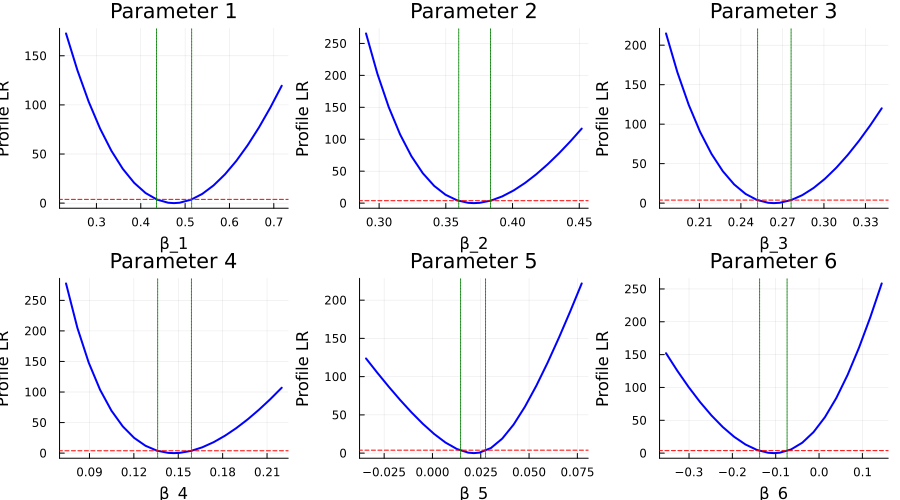
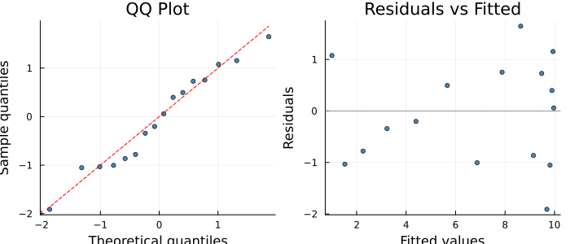

# Profile Likelihood for Identifiability Analysis
Simon Frost
2026-09-04

- [Overview](#overview)
- [Setup](#setup)
- [Example: Logistic Growth
  Identifiability](#example-logistic-growth-identifiability)
  - [Run Profile Likelihood](#run-profile-likelihood)
  - [Visualise Profile Likelihood
    Curves](#visualise-profile-likelihood-curves)
  - [Interpreting the Profiles](#interpreting-the-profiles)
- [How It Works](#how-it-works)
- [Diagnostic Plots](#diagnostic-plots)
- [References](#references)

## Overview

The **ProfileLikelihoodSolver** implements profile likelihood analysis
for partially specified models. Rather than fitting the model once, it
systematically explores how the objective changes as each parameter is
varied — providing:

1.  **Identifiability diagnostics**: flat profiles indicate
    non-identifiable parameters
2.  **Likelihood-ratio confidence intervals**: more reliable than Wald
    CIs for nonlinear models
3.  **Sensitivity information**: steep profiles indicate well-determined
    parameters

**When to use ProfileLikelihoodSolver:**

- After fitting with LAML, to assess parameter identifiability
- When you need confidence intervals that account for nonlinearity
- To understand which parts of the unknown function are well-determined
  by data

## Setup

``` julia
using PartiallySpecifiedModels
using PartiallySpecifiedModels: solve
using OrdinaryDiffEq
using Plots
using Random
Random.seed!(42)
```

    TaskLocalRNG()

## Example: Logistic Growth Identifiability

We fit a logistic growth model where the per-capita growth rate $r(N)$
is unknown, then profile each B-spline coefficient to assess
identifiability.

``` julia
r_true(N) = 0.5 * (1.0 - N / 10.0)
function logistic!(du, u, p, t)
    du[1] = p.r(u[1]) * u[1]
end

sol_true = OrdinaryDiffEq.solve(
    ODEProblem(logistic!, [1.0], (0.0, 15.0), (; r=r_true)),
    Tsit5(); saveat=1.0)
t_data = collect(sol_true.t)
rng = Random.Xoshiro(42)
y_data = max.([sol_true.u[i][1] + 0.2*randn(rng) for i in 1:length(t_data)], 0.01)

uf = BSplineApproximator(:r, (0.0, 12.0), 6)
prob = PSMProblem(logistic!, [1.0], (0.0, 15.0), [uf];
    data_times=t_data, data_values=reshape(y_data, :, 1),
    obs_to_state=[1], known_params=NamedTuple(),
    likelihood=PartiallySpecifiedModels.Gaussian())
```

    PSMProblem{typeof(logistic!), Vector{Float64}, Gaussian, Tsit5{typeof(OrdinaryDiffEqCore.trivial_limiter!), typeof(OrdinaryDiffEqCore.trivial_limiter!), Static.False}}(logistic!, [1.0], (0.0, 15.0), BSplineApproximator[BSplineApproximator(:r, (0.0, 12.0), 6, PartiallySpecifiedModels.var"#4#5"())], [0.0, 1.0, 2.0, 3.0, 4.0, 5.0, 6.0, 7.0, 8.0, 9.0, 10.0, 11.0, 12.0, 13.0, 14.0, 15.0], [1.1576711203208583; 1.37230950933477; … ; 10.109204882177014; 9.97615689866859;;], [1.0; 1.0; … ; 1.0; 1.0;;], [1], NamedTuple(), Gaussian(), Tsit5{typeof(OrdinaryDiffEqCore.trivial_limiter!), typeof(OrdinaryDiffEqCore.trivial_limiter!), Static.False}(OrdinaryDiffEqCore.trivial_limiter!, OrdinaryDiffEqCore.trivial_limiter!, static(false)), Dict{Symbol, Any}(), false, Float64[], nothing)

### Run Profile Likelihood

``` julia
sol_pl = solve(prob, ProfileLikelihoodSolver(
    n_profile_points=20, ci_level=0.95, verbose=true))
```

    ProfileLikelihoodSolver: Running initial LAML fit...
      MLE objective = 0.169832, 6 parameters
      Profiling 6 parameters...
      Hessian diagonal: [271.0, 2450.0, 2630.0, 3010.0, 5130.0, 258.0]
      Profiling parameter 1 (MLE=0.4746)...
        CI: [0.4355, 0.5148]
      Profiling parameter 2 (MLE=0.371)...
        CI: [0.3597, 0.3835]
      Profiling parameter 3 (MLE=0.2638)...
        CI: [0.2521, 0.2763]
      Profiling parameter 4 (MLE=0.147)...
        CI: [0.1361, 0.1589]
      Profiling parameter 5 (MLE=0.02144)...
        CI: [0.01456, 0.02749]
      Profiling parameter 6 (MLE=-0.1042)...
        CI: [-0.1371, -0.07375]

    PSMSolution((r = [0.4746426090564855, 0.371023343210862, 0.263828277363857, 0.14703815478645924, 0.02143960206688631, -0.10422894313023467]), 0.16983218947167242, 0.3229440769981457, 2.6891716539142534, [0.6296456733218058], [1.0; 1.5235141597707818; … ; 9.940102863117692; 9.967462654959359;;], [1.1576711203208583; 1.37230950933477; … ; 10.109204882177014; 9.97615689866859;;], [0.0, 1.0, 2.0, 3.0, 4.0, 5.0, 6.0, 7.0, 8.0, 9.0, 10.0, 11.0, 12.0, 13.0, 14.0, 15.0], Dict{Symbol, Any}(:r => DataInterpolations.CubicSpline{Vector{Float64}, Vector{Float64}, Vector{Float64}, Vector{Float64}, Vector{Float64}, Vector{Float64}, Float64}([0.4746426090564855, 0.371023343210862, 0.263828277363857, 0.14703815478645924, 0.02143960206688631, -0.10422894313023467], [0.0, 2.4, 4.8, 7.2, 9.6, 12.0], Float64[], DataInterpolations.CubicSplineParameterCache{Vector{Float64}}(Float64[], Float64[]), [0.0, 2.4, 2.4, 2.4000000000000004, 2.3999999999999995, 2.4000000000000004], [0.0, -0.00045595433220009074, -0.0019009743393053795, -0.0019349990714041798, 0.0004655225601562596, 0.0], DataInterpolations.ExtrapolationType.Linear, DataInterpolations.ExtrapolationType.Linear, FindFirstFunctions.Guesser{Vector{Float64}}([0.0, 2.4, 4.8, 7.2, 9.6, 12.0], Base.RefValue{Int64}(1), true), false, false)), (V_beta = [0.01714558225073592 0.0029679215500760664 … 9.506497040869989e-5 0.0022645382468957694; 0.0029679215500760664 0.001603261279010985 … -6.666751462986736e-5 0.0007502550221700045; … ; 9.506497040869989e-5 -6.666751462986736e-5 … 0.0005279178103865144 0.0010419362387126424; 0.0022645382468957694 0.0007502550221700045 … 0.0010419362387126424 0.011735745742712847], sigma2 = 0.024261756564016725, converged = true, iterations = 20, reason = :converged_tol, laml_failures = 0, criterion = :working, laml = 19.29674620055, stationarity = 2.0876150863546883e-6, smoothing_advanced = true, method = :profile_likelihood, profiles = Dict{Int64, NamedTuple}(5 => (grid = [-0.03438109524892006, -0.02850523237357202, -0.02262936949822398, -0.01675350662287594, -0.010877643747527902, -0.005001780872179862, 0.0008740820031681771, 0.006749944878516216, 0.012625807753864255, 0.018501670629212295  …  0.024377533504560334, 0.030253396379908374, 0.03612925925525641, 0.04200512213060445, 0.04788098500595249, 0.05375684788130053, 0.05963271075664857, 0.06550857363199661, 0.07138443650734465, 0.07726029938269269], objective = [3.3421766209027544, 2.8861955618606006, 2.4468556817929517, 2.0277671398828963, 1.6336354095559995, 1.2707057048700756, 0.9474242080525501, 0.6754099517809431, 0.4707808530711375, 0.3554421221037184  …  0.35661252284092465, 0.5006802154267723, 0.8001782519478707, 1.2455727968916805, 1.812746401052737, 2.475606787140788, 3.212418918622359, 4.006687235144908, 4.8461848647587615, 5.721812342716856], plr = [123.75494058053955, 104.96070950996523, 86.85238009414519, 69.5787527372696, 53.33377355421059, 38.374852351275315, 25.050116528272575, 13.838469277840645, 5.404244898007544, 0.6503133076427674  …  0.6985538682187526, 6.636610834774851, 18.981060657723457, 37.33894598925739, 60.71621476468675, 88.03741817133363, 118.40670035984414, 151.14416165728994, 185.74584548009014, 221.83669799720593], ci = (0.01455741246521787, 0.0274875202681436), threshold = 3.841458826888164, open_left = false, open_right = false), 4 => (grid = [0.0741600923930109, 0.08183146738179493, 0.08950284237057897, 0.097174217359363, 0.10484559234814704, 0.11251696733693108, 0.12018834232571511, 0.12785971731449913, 0.13553109230328317, 0.1432024672920672  …  0.15087384228085124, 0.15854521726963527, 0.1662165922584193, 0.17388796724720335, 0.18155934223598738, 0.18923071722477142, 0.19690209221355545, 0.2045734672023395, 0.21224484219112352, 0.21991621717990756], objective = [7.076425189726319, 5.313716681955131, 3.9312881771128647, 2.8539739690372494, 2.0247954773732584, 1.3997799058291418, 0.94449123978176, 0.6316467682271718, 0.4394211872446892, 0.35021281727469905  …  0.34972798236432606, 0.42628323138123897, 0.5702681763425277, 0.7737263863652646, 1.0300269165875606, 1.3336040067138732, 1.6797526096449156, 2.0644663815669357, 2.484308660381929, 2.9363109962195293], plr = [277.6699532454482, 205.01616566332774, 148.03642880072218, 103.63262789566282, 69.45626933414925, 43.69492060843109, 24.929227990666025, 12.034676405782994, 4.111689441699048, 0.43477636516206225  …  0.4147928611196525, 3.5701805930390345, 9.504826939908936, 17.89079064727262, 28.45476319171824, 40.967339901706175, 55.234592234310355, 71.09139019149535, 88.39608442116514, 107.02632393597328], ci = (0.13609489142948292, 0.15889588299367616), threshold = 3.841458826888164, open_left = false, open_right = false), 6 => (grid = [-0.3530609167475878, -0.3268680774194454, -0.300675238091303, -0.2744823987631605, -0.24828955943501807, -0.22209672010687564, -0.1959038807787332, -0.16971104145059077, -0.14351820212244834, -0.11732536279430589  …  -0.09113252346616346, -0.06493968413802102, -0.03874684480987858, -0.012554005481736144, 0.013638833846406292, 0.03983167317454873, 0.06602451250269116, 0.0922173518308336, 0.11841019115897604, 0.14460303048711848], objective = [4.031245961609871, 3.3788743913927495, 2.7754525338085223, 2.225086309786187, 1.7324338271968447, 1.3028125947847697, 0.9423379139436674, 0.6581360484419887, 0.4585582869114068, 0.35337852245367246  …  0.3539124216129775, 0.47289555572276976, 0.7238225065960184, 1.1193718419278926, 1.6688244424277046, 2.375288301711613, 3.2344142648821017, 4.235632885753876, 5.365030402887856, 6.608101591688968], plr = [152.15640190461755, 125.26751739636758, 100.39619960896637, 77.71168282345883, 57.40596088245111, 39.69820624075884, 24.84047407738646, 13.126488540033153, 4.900465786735021, 0.5652576504152724  …  0.5872634420361833, 5.491406874348888, 15.833895894513459, 32.1373046888513, 54.7841645338932, 83.90257800984423, 119.31328542930133, 160.58064454363313, 207.13117002409322, 258.3669981275185], ci = (-0.13711980133650567, -0.07375199248572789), threshold = 3.841458826888164, open_left = false, open_right = false), 2 => (grid = [0.29020148251039746, 0.2987090467946569, 0.3072166110789163, 0.3157241753631757, 0.3242317396474352, 0.3327393039316946, 0.341246868215954, 0.34975443250021343, 0.35826199678447285, 0.36676956106873226  …  0.37527712535299174, 0.38378468963725115, 0.39229225392151057, 0.40079981820577, 0.4093073824900294, 0.4178149467742888, 0.4263225110585483, 0.4348300753428077, 0.4433376396270671, 0.45184520391132654], objective = [6.7855809571319, 5.256891333490026, 3.987158900413668, 2.94992756304796, 2.120508487190457, 1.4759660453116137, 0.9951548628918574, 0.658767922920577, 0.44935617130409444, 0.3513120638234279  …  0.3508065494250406, 0.4356867267741364, 0.595343988997324, 0.8205642087378959, 1.1033723310190566, 1.4368793779914535, 1.815138474896378, 2.233012229382208, 2.686056675560061, 3.1704186061528756], plr = [265.6821883930971, 202.6739878282165, 150.339259725325, 107.58755975550277, 73.4012850037547, 46.835094704294605, 27.017437184275607, 13.152532593229424, 4.521180981736181, 0.48008415422623746  …  0.4592483010161261, 3.9577656950527937, 10.538379996491283, 19.8213113104837, 31.477850750855513, 45.22405441473327, 60.81480918580087, 78.03836649020437, 96.71155880348377, 116.6755679763062], ci = (0.35969298945172057, 0.38350185892750593), threshold = 3.841458826888164, open_left = false, open_right = false), 3 => (grid = [0.185898719414791, 0.19410183077785056, 0.20230494214091016, 0.21050805350396973, 0.21871116486702932, 0.2269142762300889, 0.23511738759314849, 0.24332049895620805, 0.2515236103192676, 0.25972672168232724  …  0.2679298330453868, 0.2761329444084464, 0.28433605577150595, 0.29253916713456557, 0.30074227849762514, 0.3089453898606847, 0.3171485012237443, 0.3253516125868039, 0.33355472394986346, 0.34175783531292303], objective = [5.5531516129982705, 4.360897013833611, 3.359568316451142, 2.5299896834917934, 1.8554457342546362, 1.3212809392090623, 0.9145721577489168, 0.6238435872910393, 0.43884354571812484, 0.35035380114497944  …  0.35003815786898346, 0.4303176636225008, 0.5842716965161032, 0.8055602703074529, 1.0883643875236388, 1.4273410713331018, 1.8175909136520554, 2.2546312400878037, 2.7343797347715038, 3.253133552157867], plr = [214.88498659603187, 165.7436725275804, 124.47177637528088, 90.2789251375548, 62.47615877736503, 40.45941841332196, 23.696049265378793, 11.713051674467964, 4.087880715194015, 0.44058731582049415  …  0.4275774055461441, 3.7364683154723473, 10.082011866178641, 19.202892013807723, 30.859266376891572, 44.83091277912317, 60.91589167540571, 78.92944008780445, 98.70329666813254, 120.0848407462617], ci = (0.2520778366922859, 0.2762686694019519), threshold = 3.841458826888164, open_left = false, open_right = false), 1 => (grid = [0.23144194969771106, 0.25704201910389785, 0.28264208851008465, 0.3082421579162714, 0.33384222732245816, 0.35944229672864497, 0.3850423661348318, 0.41064243554101854, 0.4362425049472053, 0.4618425743533921  …  0.4874426437595789, 0.5130427131657657, 0.5386427825719524, 0.5642428519781393, 0.589842921384326, 0.6154429907905128, 0.6410430601966995, 0.6666431296028863, 0.6922431990090732, 0.7178432684152599], objective = [4.531226335702952, 3.623708728645573, 2.8425428588085646, 2.180415186268128, 1.6304393393000065, 1.186137693513271, 0.8414215966273315, 0.5905713056419784, 0.4282157545530998, 0.3493123441811857  …  0.3491274976780556, 0.42321784670622153, 0.5674122646360553, 0.7777946207539854, 1.050688066569656, 1.3826397711203235, 1.770406701272372, 2.2109424338483805, 2.7013852378622323, 3.2390465867074525], plr = [172.76415851011478, 135.3588863624524, 103.16147032722697, 75.87046727090019, 53.20204070759827, 34.88920154385481, 20.680993000653228, 10.341663681134952, 3.649833653886533, 0.397661447652384  …  0.3900426051072319, 3.4438342311451975, 9.38711445281276, 18.0584715972478, 29.306356518342355, 42.98845342978339, 58.97109380987674, 77.12871283526005, 97.34335816482537, 119.50421644508035], ci = (0.43550942928496655, 0.5147554402910182), threshold = 3.841458826888164, open_left = false, open_right = false)), mle_objective = 0.16983218947167242))

### Visualise Profile Likelihood Curves

``` julia
profiles = sol_pl.convergence.profiles
n_profiled = length(profiles)
ncols = min(n_profiled, 3)
nrows = ceil(Int, n_profiled / ncols)

plts = []
for idx in sort(collect(keys(profiles)))
    prof = profiles[idx]
    p = plot(prof.grid, prof.plr, lw=2, color=:blue,
        xlabel="β_$idx", ylabel="Profile LR",
        title="Parameter $idx", legend=false)
    hline!(p, [prof.threshold], color=:red, ls=:dash, label="95% threshold")
    vline!(p, [prof.ci[1], prof.ci[2]], color=:green, ls=:dot, label="CI")
    push!(plts, p)
end
plot(plts..., layout=(nrows, ncols), size=(300*ncols, 250*nrows))
```



### Interpreting the Profiles

    Profile Likelihood Summary:
    ------------------------------------------------------------
      β_1: CI=[0.436, 0.515], width=0.0792, well-identified
      β_2: CI=[0.36, 0.384], width=0.0238, well-identified
      β_3: CI=[0.252, 0.276], width=0.0242, well-identified
      β_4: CI=[0.136, 0.159], width=0.0228, well-identified
      β_5: CI=[0.0146, 0.0275], width=0.0129, well-identified
      β_6: CI=[-0.137, -0.0738], width=0.0634, well-identified

> [!NOTE]
>
> Parameters with **narrow CIs** and **steep profile curves** are
> well-identified by the data. Parameters with **wide CIs** or **flat
> profiles** indicate that the data do not strongly constrain those
> parts of the unknown function — typically parameters corresponding to
> B-spline knots in regions where the state variable is rarely observed.

## How It Works

For each parameter $\beta_j$:

1.  Fix $\beta_j$ at a grid of values centred on $\hat{\beta}_j$ (the
    exact MLE value is inserted into the grid)
2.  At each grid point, optimise all other parameters $\beta_{-j}$ under
    the *penalized* objective at the fitted smoothing parameters
    $\hat{\lambda}$ (warm-started from the adjacent grid point)
3.  Compute the fixed-smoothing profile likelihood ratio
    $\text{PLR}(\beta_j) = [\text{PenSS}(\beta_j) - \text{PenSS}_{\min}]/\hat{\sigma}^2$
    — the profile is conditional on $\hat{\lambda}$, because a penalized
    spline is not identified through its raw residual sum of squares
4.  The 95% CI is the set
    $\{\beta_j : \text{PLR}(\beta_j) < \chi^2_{1, 0.95} = 3.841\}$, with
    endpoints interpolated between grid points (Gaussian likelihoods
    only)

This is more reliable than Wald-based CIs (which assume local quadratic
curvature) because it captures the actual shape of the likelihood
surface, including asymmetry and non-convexity.

## Diagnostic Plots

``` julia
using PartiallySpecifiedModels: appraise

diag = appraise(sol_pl)

p_qq = scatter(diag.qq_theoretical, diag.qq_sample,
    xlabel="Theoretical quantiles", ylabel="Sample quantiles",
    title="QQ Plot", ms=3, legend=false, color=:steelblue)
mn, mx = extrema(vcat(diag.qq_theoretical, diag.qq_sample))
plot!(p_qq, [mn, mx], [mn, mx], color=:red, ls=:dash)

p_rf = scatter(diag.fitted, diag.residuals,
    xlabel="Fitted values", ylabel="Residuals",
    title="Residuals vs Fitted", ms=3, legend=false, color=:steelblue)
hline!(p_rf, [0], color=:gray, ls=:dot)

plot(p_qq, p_rf, layout=(1, 2), size=(700, 300))
```



## References

- Simpson, M.J. & Maclaren, O.J. (2023). Profile-wise analysis: A
  profile likelihood-based workflow for identifiability analysis,
  estimation, and prediction with mechanistic mathematical models. *PLOS
  Computational Biology*, 19(9).
- Raue, A. et al. (2009). Structural and practical identifiability
  analysis of partially observed dynamical models. *Bioinformatics*,
  25(15), 1923–1929.
