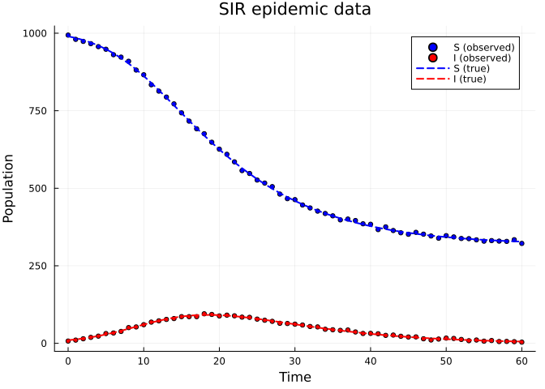
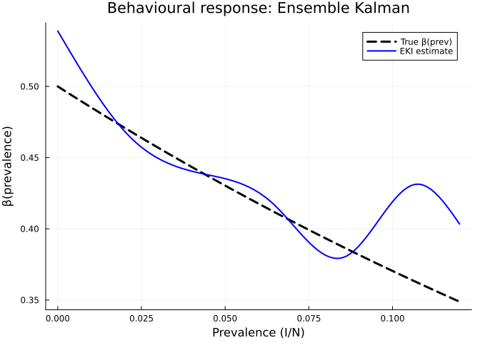
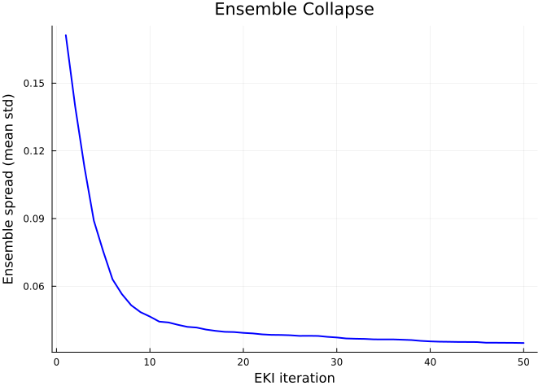
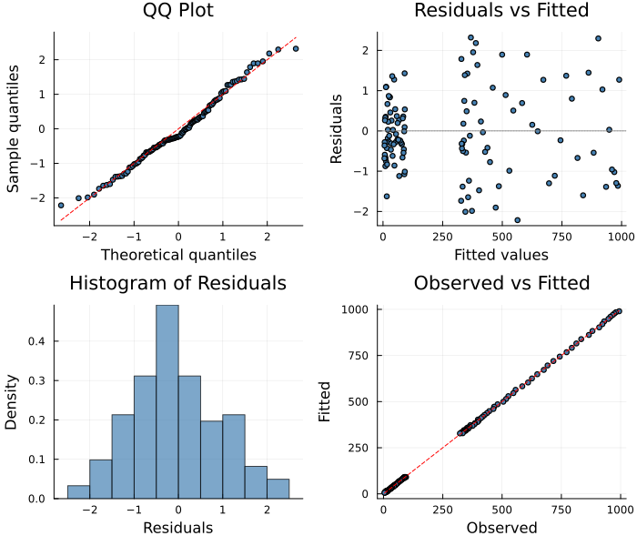

# Ensemble Kalman Inversion: Derivative-Free Estimation
Simon Frost
2026-04-04

- [Overview](#overview)
- [Setup](#setup)
- [Example: SIR Model with Behavioural
  Response](#example-sir-model-with-behavioural-response)
  - [Fit with EKI](#fit-with-eki)
  - [Recovered behavioural response](#recovered-behavioural-response)
  - [Ensemble spread convergence](#ensemble-spread-convergence)
  - [Ensemble-based uncertainty](#ensemble-based-uncertainty)
- [Diagnostic Plots](#diagnostic-plots)
- [How It Works](#how-it-works)
- [References](#references)

## Overview

The **EnsembleKalmanSolver** implements Ensemble Kalman Inversion (EKI)
— a derivative-free, ensemble-based method for parameter estimation.
Unlike gradient-based methods (LAML, Adam), EKI maintains a **population
of parameter particles** and iteratively updates them using the Kalman
gain computed from ensemble statistics.

**When to use EnsembleKalmanSolver:**

- The forward model is non-differentiable, stiff, or computationally
  opaque
- Gradient-based methods fail to converge
- You want a method that naturally provides ensemble-based uncertainty
  estimates
- You’re working with complex models where autodiff is impractical

## Setup

``` julia
using PartiallySpecifiedModels
using PartiallySpecifiedModels: solve
using OrdinaryDiffEq
using Plots
using Random
Random.seed!(42)
```

    Precompiling packages...
      10687.3 ms  ✓ PartiallySpecifiedModels
      1 dependency successfully precompiled in 28 seconds. 387 already precompiled.

    TaskLocalRNG()

## Example: SIR Model with Behavioural Response

We fit an SIR epidemic model where the transmission rate depends on
prevalence via an unknown behavioural response $\beta(\text{prev})$:

$$\frac{dS}{dt} = -\beta(I/N)\,\frac{SI}{N}, \quad
\frac{dI}{dt} = \beta(I/N)\,\frac{SI}{N} - \gamma I, \quad
\frac{dR}{dt} = \gamma I$$

The true response is $\beta(\text{prev}) = 0.5\exp(-3\,\text{prev})$ —
people reduce contact as prevalence rises.

``` julia
function sir!(du, u, p, t)
    S, I, R = u
    N = S + I + R
    prev = I / N
    β_val = p.β(prev)
    foi = max(β_val, 0.001) * S * I / N
    du[1] = -foi
    du[2] = foi - 0.25 * I
    du[3] = 0.25 * I
end

β_true(prev) = 0.5 * exp(-3.0 * prev)

function sir_true!(du, u, p, t)
    S, I, R = u
    N = S + I + R
    prev = I / N
    β = 0.5 * exp(-3.0 * prev)
    du[1] = -β * S * I / N
    du[2] = β * S * I / N - 0.25 * I
    du[3] = 0.25 * I
end

u0 = [990.0, 10.0, 0.0]
sol_sir = OrdinaryDiffEq.solve(
    ODEProblem(sir_true!, u0, (0.0, 60.0)),
    Tsit5(); saveat=1.0)
t_data = collect(sol_sir.t)
rng = Random.Xoshiro(42)
data_sir = max.(hcat(
    [sol_sir.u[i][1] + 5.0*randn(rng) for i in 1:length(t_data)],
    [sol_sir.u[i][2] + 2.0*randn(rng) for i in 1:length(t_data)]), 0.01)

p_data = scatter(t_data, data_sir[:, 1], label="S (observed)", ms=3, color=:blue)
scatter!(p_data, t_data, data_sir[:, 2], label="I (observed)", ms=3, color=:red)
plot!(p_data, sol_sir.t, [sol_sir.u[i][1] for i in 1:length(sol_sir.t)],
    label="S (true)", lw=2, ls=:dash, color=:blue)
plot!(p_data, sol_sir.t, [sol_sir.u[i][2] for i in 1:length(sol_sir.t)],
    label="I (true)", lw=2, ls=:dash, color=:red)
plot!(p_data, xlabel="Time", ylabel="Population", title="SIR epidemic data")
```



### Fit with EKI

``` julia
approx_β = BSplineApproximator(:β, (0.0, 0.15), 8; initial=0.4)
prob = PSMProblem(sir!, u0, (0.0, 60.0), [approx_β];
    data_times=t_data, data_values=data_sir,
    obs_to_state=[1, 2], known_params=(γ=0.25,),
    likelihood=PartiallySpecifiedModels.Gaussian(), solver=Tsit5())

t_ek = @elapsed sol_ek = solve(prob,
    EnsembleKalmanSolver(n_ensemble=100, n_iterations=50, noise_scale=5.0, verbose=true))
println("\nTime: $(round(t_ek, digits=1))s")
```

    EnsembleKalmanSolver: 100 particles, 50 iterations, 8 params
      iter 1: misfit=21830.0 spread=0.1713
      iter 2: misfit=1351.0 spread=0.1397
      iter 3: misfit=568.0 spread=0.1126
      iter 5: misfit=152.2 spread=0.07548
      iter 10: misfit=9.755 spread=0.04654
      iter 15: misfit=9.675 spread=0.04168
      iter 20: misfit=9.623 spread=0.03932
      iter 25: misfit=9.597 spread=0.03827
      iter 30: misfit=9.588 spread=0.03728
      iter 35: misfit=9.58 spread=0.03642
      iter 40: misfit=9.576 spread=0.03555
      iter 45: misfit=9.573 spread=0.03525
      iter 50: misfit=9.57 spread=0.03483

    Time: 3.9s

### Recovered behavioural response

``` julia
prev_grid = range(0.0, 0.12, length=100)
β_true_vals = [β_true(p) for p in prev_grid]
β_ek_vals = [sol_ek.unknown_functions[:β](p) for p in prev_grid]

plot(prev_grid, β_true_vals, label="True β(prev)", lw=3, color=:black, ls=:dash,
    xlabel="Prevalence (I/N)", ylabel="β(prevalence)",
    title="Behavioural response: Ensemble Kalman")
plot!(prev_grid, β_ek_vals, label="EKI estimate", lw=2, color=:blue)
```



### Ensemble spread convergence

``` julia
spread = sol_ek.convergence.ensemble_spread
plot(1:length(spread), spread, lw=2, color=:blue,
    xlabel="EKI iteration", ylabel="Ensemble spread (mean std)",
    title="Ensemble Collapse", legend=false)
```



> [!NOTE]
>
> The ensemble spread decreases over iterations as the particles
> converge toward the optimal parameters. The rate of collapse depends
> on the signal-to-noise ratio and ensemble size.

### Ensemble-based uncertainty

The final ensemble standard deviation provides a rough measure of
parameter uncertainty:

    Ensemble parameter std (per coefficient):
      β_1: std = 0.0198
      β_2: std = 0.00263
      β_3: std = 0.00225
      β_4: std = 0.00154
      β_5: std = 0.000727
      β_6: std = 0.0272
      β_7: std = 0.109
      β_8: std = 0.116

## Diagnostic Plots

``` julia
using PartiallySpecifiedModels: appraise

diag = appraise(sol_ek)

p_qq = scatter(diag.qq_theoretical, diag.qq_sample,
    xlabel="Theoretical quantiles", ylabel="Sample quantiles",
    title="QQ Plot", ms=3, legend=false, color=:steelblue)
mn, mx = extrema(vcat(diag.qq_theoretical, diag.qq_sample))
plot!(p_qq, [mn, mx], [mn, mx], color=:red, ls=:dash)

p_rf = scatter(diag.fitted, diag.residuals,
    xlabel="Fitted values", ylabel="Residuals",
    title="Residuals vs Fitted", ms=3, legend=false, color=:steelblue)
hline!(p_rf, [0], color=:gray, ls=:dot)

p_hist = histogram(diag.residuals, normalize=:pdf,
    xlabel="Residuals", ylabel="Density",
    title="Histogram of Residuals", legend=false, color=:steelblue, alpha=0.7)

p_of = scatter(diag.observed, diag.fitted,
    xlabel="Observed", ylabel="Fitted",
    title="Observed vs Fitted", ms=3, legend=false, color=:steelblue)
mn2, mx2 = extrema(vcat(diag.observed, diag.fitted))
plot!(p_of, [mn2, mx2], [mn2, mx2], color=:red, ls=:dash)

plot(p_qq, p_rf, p_hist, p_of, layout=(2, 2), size=(700, 600))
```



## How It Works

EKI maintains an ensemble $\{\theta^{(j)}\}_{j=1}^J$ of parameter
particles:

1.  **Predict**: Evaluate the forward model $G(\theta^{(j)})$ for each
    particle
2.  **Update**: Compute the Kalman gain
    $K = C_{\theta G}(C_{GG} + \Gamma)^{-1}$
3.  **Step**:
    $\theta^{(j)}_{n+1} = \theta^{(j)}_n + K(y + \xi^{(j)} - G(\theta^{(j)}_n))$

where $\Gamma = \sigma^2 I$ is the observation noise covariance and
$\xi^{(j)}$ are perturbation samples. The ensemble gradually collapses
to the posterior mode.

## References

- Iglesias, M.A., Law, K.J.H. & Stuart, A.M. (2013). Ensemble Kalman
  methods for inverse problems. *Inverse Problems*, 29(4).
- Schillings, C. & Stuart, A.M. (2017). Analysis of the ensemble Kalman
  filter for inverse problems. *SIAM J. Numer. Anal.*, 55(3).
