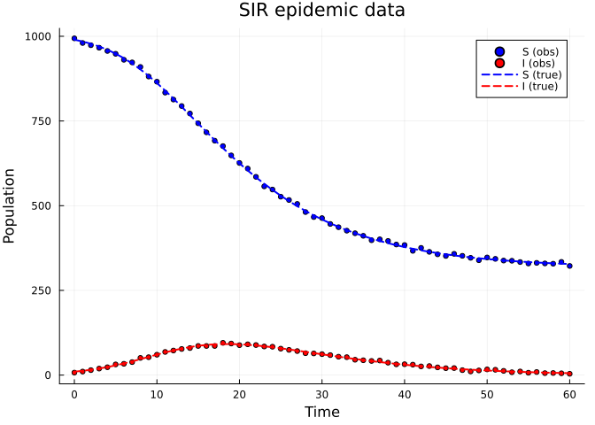
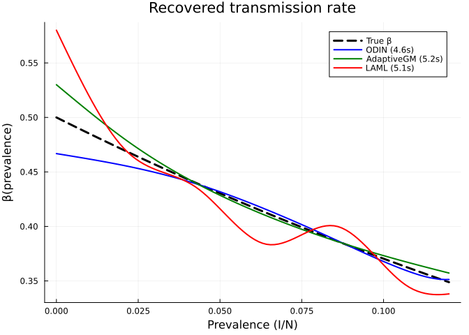
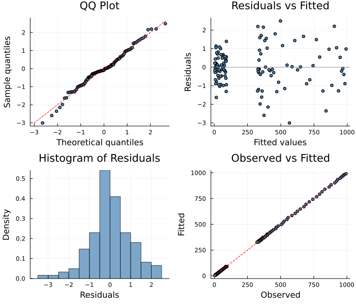

# ODIN: ODE-Informed Gaussian Process Regression
Simon Frost
2026-06-12

- [Overview](#overview)
- [Setup](#setup)
- [Example: SIR Model with Behavioural
  Response](#example-sir-model-with-behavioural-response)
  - [Fit with ODIN](#fit-with-odin)
  - [Compare with Adaptive Gradient Matching and
    LAML](#compare-with-adaptive-gradient-matching-and-laml)
- [Diagnostic Plots](#diagnostic-plots)
- [How It Works](#how-it-works)
- [References](#references)

## Overview

The **ODINSolver** implements ODE-Informed regression (Wenk & Abbati,
2020) — a Gaussian process–based approach that alternates between GP
smoothing and ODE parameter optimisation. Unlike simple gradient
matching (which smooths data independently of the ODE), ODIN feeds the
ODE residual back into the GP, creating tighter coupling between data
smoothing and model structure.

**When to use ODINSolver:**

- You want a principled GP-based approach with stronger ODE coupling
  than gradient matching
- The unknown function is smooth and well-suited to kernel-based
  estimation
- You want to avoid ODE integration entirely while still using ODE
  structure

**Comparison with related solvers:**

| Solver | GP smoothing | ODE coupling | Integration |
|----|:--:|:--:|:--:|
| GradientMatching | Cubic spline | One-way (smooth → match) | No |
| AdaptiveGradientMatching | GP + eigendecomp | Product-of-experts | No |
| **ODINSolver** | GP + ODE penalty | Two-way (alternating) | No |
| MagiSolver | GP + manifold constraint | Full Bayesian | No |

## Setup

``` julia
using PartiallySpecifiedModels
using PartiallySpecifiedModels: solve
using OrdinaryDiffEq
using Plots
using Random
Random.seed!(42)
```

    TaskLocalRNG()

## Example: SIR Model with Behavioural Response

We use an SIR model where the total population $N$ is passed as a known
constant. This is important for gradient-matching methods (ODIN,
AdaptiveGM) which smooth observed states independently — if $N$ were
computed as $S + I + R$ with $R$ unobserved, the prevalence estimate
would be biased.

``` julia
function sir!(du, u, p, t)
    S, I, R = u
    prev = I / p.N
    β_val = p.β(prev)
    foi = max(β_val, 0.001) * S * I / p.N
    du[1] = -foi
    du[2] = foi - p.γ * I
    du[3] = p.γ * I
end

β_true(prev) = 0.5 * exp(-3.0 * prev)

function sir_true!(du, u, p, t)
    S, I, R = u
    prev = I / 1000.0
    β = 0.5 * exp(-3.0 * prev)
    du[1] = -β * S * I / 1000.0
    du[2] = β * S * I / 1000.0 - 0.25 * I
    du[3] = 0.25 * I
end

u0 = [990.0, 10.0, 0.0]
sol_sir = OrdinaryDiffEq.solve(ODEProblem(sir_true!, u0, (0.0, 60.0)), Tsit5(); saveat=1.0)
t_data = collect(sol_sir.t)
rng = Random.Xoshiro(42)
data_si = max.(hcat(
    [sol_sir.u[i][1] + 5.0*randn(rng) for i in 1:length(t_data)],
    [sol_sir.u[i][2] + 2.0*randn(rng) for i in 1:length(t_data)]), 0.01)

scatter(t_data, data_si[:, 1], label="S (obs)", ms=3, color=:blue)
scatter!(t_data, data_si[:, 2], label="I (obs)", ms=3, color=:red)
plot!(sol_sir.t, [sol_sir.u[i][1] for i in 1:length(sol_sir.t)],
    label="S (true)", lw=2, ls=:dash, color=:blue)
plot!(sol_sir.t, [sol_sir.u[i][2] for i in 1:length(sol_sir.t)],
    label="I (true)", lw=2, ls=:dash, color=:red,
    xlabel="Time", ylabel="Population", title="SIR epidemic data")
```



### Fit with ODIN

``` julia
approx_β = BSplineApproximator(:β, (0.0, 0.15), 8; initial=0.4)
prob = PSMProblem(sir!, u0, (0.0, 60.0), [approx_β];
    data_times=t_data, data_values=data_si,
    obs_to_state=[1, 2], known_params=(γ=0.25, N=1000.0), solver=Tsit5())

t_odin = @elapsed sol_odin = solve(prob,
    ODINSolver(maxiters=100, gp_lengthscale=10.0, gp_variance=100.0,
               ode_weight=1.0, lr=0.01, verbose=true))
println("\nTime: $(round(t_odin, digits=1))s")
```

    ODINSolver: 2 observed states, 61 time points
      8 unknown-function parameters, 100 outer iterations
      step 1: risk=7023.4
      step 2: risk=7023.4
      step 3: risk=7023.4
      step 50: risk=5892.0
      step 100: risk=5406.5
      step 150: risk=5133.0
      step 200: risk=4886.2
      step 250: risk=4667.0
      step 300: risk=4479.0
      step 350: risk=4320.8
      step 400: risk=4189.0
      step 450: risk=4080.2
      step 500: risk=3991.0
      step 550: risk=3918.3
      step 600: risk=3859.7
      step 650: risk=3812.8
      step 700: risk=3775.5
      step 750: risk=3746.0
      step 800: risk=3722.8
      step 850: risk=3704.7
      step 900: risk=3690.6
      step 950: risk=3679.6
      step 1000: risk=3671.0
      step 1050: risk=3664.4
      step 1100: risk=3659.2
      step 1150: risk=3655.1
      step 1200: risk=3651.9
      step 1250: risk=3649.4
      step 1300: risk=3647.4
      step 1350: risk=3645.9
      step 1400: risk=3644.6
      step 1450: risk=3643.6
      step 1500: risk=3642.9
      step 1550: risk=3642.3
      step 1600: risk=3641.8
      step 1650: risk=3641.5
      step 1700: risk=3641.2
      step 1750: risk=3641.0
      step 1800: risk=3640.9
      step 1850: risk=3640.8
      step 1900: risk=3640.7
      step 1950: risk=3640.7
      step 2000: risk=3640.7

    Time: 4.6s

### Compare with Adaptive Gradient Matching and LAML

``` julia
t_agm = @elapsed sol_agm = solve(prob, AdaptiveGradientMatching(maxiters=200, verbose=false))
t_laml = @elapsed sol_laml = solve(prob,
    LAML(maxiters=100, verbose=false, initial_lambda=10.0, warmup=5))

prev_grid = range(0.0, 0.12, length=100)
β_true_vals = [β_true(p) for p in prev_grid]

plot(prev_grid, β_true_vals, label="True β", lw=3, color=:black, ls=:dash,
    xlabel="Prevalence (I/N)", ylabel="β(prevalence)",
    title="Recovered transmission rate")
plot!(prev_grid, [sol_odin.unknown_functions[:β](p) for p in prev_grid],
    label="ODIN ($(round(t_odin, digits=1))s)", lw=2, color=:blue)
plot!(prev_grid, [sol_agm.unknown_functions[:β](p) for p in prev_grid],
    label="AdaptiveGM ($(round(t_agm, digits=1))s)", lw=2, color=:green)
plot!(prev_grid, [sol_laml.unknown_functions[:β](p) for p in prev_grid],
    label="LAML ($(round(t_laml, digits=1))s)", lw=2, color=:red)
```



## Diagnostic Plots

``` julia
using PartiallySpecifiedModels: appraise

diag = appraise(sol_odin)

p_qq = scatter(diag.qq_theoretical, diag.qq_sample,
    xlabel="Theoretical quantiles", ylabel="Sample quantiles",
    title="QQ Plot", ms=3, legend=false, color=:steelblue)
mn, mx = extrema(vcat(diag.qq_theoretical, diag.qq_sample))
plot!(p_qq, [mn, mx], [mn, mx], color=:red, ls=:dash)

p_rf = scatter(diag.fitted, diag.residuals,
    xlabel="Fitted values", ylabel="Residuals",
    title="Residuals vs Fitted", ms=3, legend=false, color=:steelblue)
hline!(p_rf, [0], color=:gray, ls=:dot)

p_hist = histogram(diag.residuals, normalize=:pdf,
    xlabel="Residuals", ylabel="Density",
    title="Histogram of Residuals", legend=false, color=:steelblue, alpha=0.7)

p_of = scatter(diag.observed, diag.fitted,
    xlabel="Observed", ylabel="Fitted",
    title="Observed vs Fitted", ms=3, legend=false, color=:steelblue)
mn2, mx2 = extrema(vcat(diag.observed, diag.fitted))
plot!(p_of, [mn2, mx2], [mn2, mx2], color=:red, ls=:dash)

plot(p_qq, p_rf, p_hist, p_of, layout=(2, 2), size=(700, 600))
```



## How It Works

ODIN alternates between two steps:

1.  **GP step**: Fit an RBF Gaussian process to each observed state. The
    GP posterior mean provides smooth state estimates $\hat{y}(t)$ and
    derivatives $d\hat{y}/dt$.
2.  **ODE step**: Optimise the unknown-function parameters $\beta$ to
    minimise the ODE mismatch
    $\sum_i \|d\hat{y}/dt(t_i) - f(\hat{y}(t_i), \beta)\|^2$.

The key difference from simple gradient matching is that after the ODE
step, the GP is **re-fitted** with the ODE residual informing the noise
model — regions where the ODE is well-satisfied get tighter GP fits,
creating a feedback loop that progressively refines both the smooth and
the unknown function.

## References

- Wenk, P., Abbati, G. et al. (2020). ODIN: ODE-Informed Regression for
  Parameter and State Inference in Time-Continuous Dynamical Systems.
  *AAAI*.
- Wenk, P. et al. (2019). Fast Gaussian Process Based Gradient Matching
  for Parameter Identification in Systems of Nonlinear ODEs. *AISTATS*.
