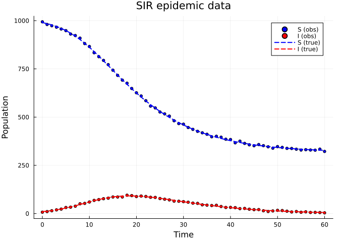
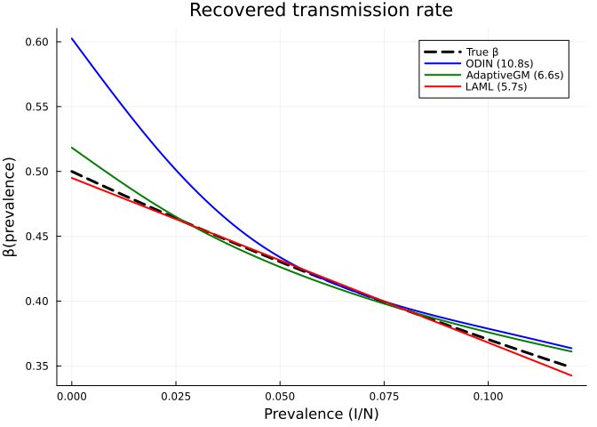
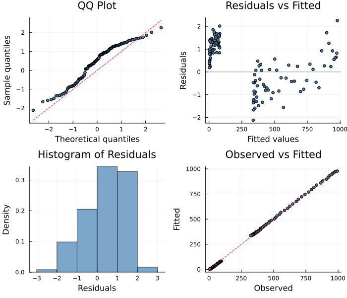

# ODIN: ODE-Informed Gaussian Process Regression
Simon Frost
2026-08-19

- [Overview](#overview)
- [Setup](#setup)
- [Example: SIR Model with Behavioural
  Response](#example-sir-model-with-behavioural-response)
  - [Fit with ODIN](#fit-with-odin)
  - [Compare with Adaptive Gradient Matching and
    LAML](#compare-with-adaptive-gradient-matching-and-laml)
- [Diagnostic Plots](#diagnostic-plots)
- [How It Works](#how-it-works)
- [References](#references)

## Overview

The **ODINSolver** implements ODE-Informed regression (Wenk & Abbati,
2020). GP hyperparameters are first estimated per observed state by
marginal likelihood; then the states and the unknown-function parameters
are optimised **jointly** under a risk that combines the data fit, a GP
prior on the trajectory, and an ODE-gradient mismatch weighted by the
GP’s conditional derivative covariance. Unlike simple gradient matching
(which smooths data once, independently of the ODE), the trajectory can
move away from the GP posterior mean when the ODE demands it, and
unobserved states are inferred through the ODE terms.

**When to use ODINSolver:**

- You want a principled GP-based approach with stronger ODE coupling
  than gradient matching
- The unknown function is smooth and well-suited to kernel-based
  estimation
- You want to avoid ODE integration entirely while still using ODE
  structure

**Comparison with related solvers:**

| Solver | GP smoothing | ODE coupling | Integration |
|----|:--:|:--:|:--:|
| GradientMatching | Cubic spline | One-way (smooth → match) | No |
| AdaptiveGradientMatching | GP + eigendecomp | Product-of-experts | No |
| **ODINSolver** | GP prior on states | Joint (states + θ optimised together) | No |
| MagiSolver | GP + manifold constraint | Full Bayesian | No |

## Setup

``` julia
using PartiallySpecifiedModels
using PartiallySpecifiedModels: solve
using OrdinaryDiffEq
using Plots
using Random
Random.seed!(42)
```

    TaskLocalRNG()

## Example: SIR Model with Behavioural Response

We use an SIR model where the total population $N$ is passed as a known
constant. This is important for gradient-matching methods (ODIN,
AdaptiveGM) which smooth observed states independently — if $N$ were
computed as $S + I + R$ with $R$ unobserved, the prevalence estimate
would be biased.

``` julia
function sir!(du, u, p, t)
    S, I, R = u
    prev = I / p.N
    β_val = p.β(prev)
    foi = max(β_val, 0.001) * S * I / p.N
    du[1] = -foi
    du[2] = foi - p.γ * I
    du[3] = p.γ * I
end

β_true(prev) = 0.5 * exp(-3.0 * prev)

function sir_true!(du, u, p, t)
    S, I, R = u
    prev = I / 1000.0
    β = 0.5 * exp(-3.0 * prev)
    du[1] = -β * S * I / 1000.0
    du[2] = β * S * I / 1000.0 - 0.25 * I
    du[3] = 0.25 * I
end

u0 = [990.0, 10.0, 0.0]
sol_sir = OrdinaryDiffEq.solve(ODEProblem(sir_true!, u0, (0.0, 60.0)), Tsit5(); saveat=1.0)
t_data = collect(sol_sir.t)
rng = Random.Xoshiro(42)
data_si = max.(hcat(
    [sol_sir.u[i][1] + 5.0*randn(rng) for i in 1:length(t_data)],
    [sol_sir.u[i][2] + 2.0*randn(rng) for i in 1:length(t_data)]), 0.01)

scatter(t_data, data_si[:, 1], label="S (obs)", ms=3, color=:blue)
scatter!(t_data, data_si[:, 2], label="I (obs)", ms=3, color=:red)
plot!(sol_sir.t, [sol_sir.u[i][1] for i in 1:length(sol_sir.t)],
    label="S (true)", lw=2, ls=:dash, color=:blue)
plot!(sol_sir.t, [sol_sir.u[i][2] for i in 1:length(sol_sir.t)],
    label="I (true)", lw=2, ls=:dash, color=:red,
    xlabel="Time", ylabel="Population", title="SIR epidemic data")
```



### Fit with ODIN

``` julia
approx_β = BSplineApproximator(:β, (0.0, 0.15), 8; initial=0.4)
prob = PSMProblem(sir!, u0, (0.0, 60.0), [approx_β];
    data_times=t_data, data_values=data_si,
    obs_to_state=[1, 2], known_params=(γ=0.25, N=1000.0), solver=Tsit5())

t_odin = @elapsed sol_odin = solve(prob,
    ODINSolver(maxiters=100, verbose=true))  # GP hyperparameters estimated per state
println("\nTime: $(round(t_odin, digits=1))s")
```

    ODINSolver: 2 observed states, 61 time points
      GP hyperparams: σ²=52200.0 ℓ=18.0 σ_n²=52.2
      GP hyperparams: σ²=867.0 ℓ=12.0 σ_n²=8.67
      joint optimisation over 183 state values + 8 unknown-function parameters
      step 1: risk=78398.0
      step 2: risk=77975.0
      step 3: risk=77802.0
      step 100: risk=74477.0
      step 200: risk=71679.0
      step 300: risk=69099.0
      step 400: risk=66736.0
      step 500: risk=64591.0
      step 600: risk=62663.0
      step 700: risk=60950.0
      step 800: risk=59445.0
      step 900: risk=58141.0
      step 1000: risk=57029.0
      step 1100: risk=56097.0
      step 1200: risk=55334.0
      step 1300: risk=54726.0
      step 1400: risk=54260.0
      step 1500: risk=53918.0
      step 1600: risk=53684.0
      step 1700: risk=53539.0
      step 1800: risk=53464.0
      step 1900: risk=53435.0
      step 2000: risk=53431.0

    Time: 9.2s

### Compare with Adaptive Gradient Matching and LAML

``` julia
t_agm = @elapsed sol_agm = solve(prob, AdaptiveGradientMatching(maxiters=200, verbose=false))
t_laml = @elapsed sol_laml = solve(prob,
    LAML(maxiters=100, verbose=false, initial_lambda=10.0, warmup=5))

prev_grid = range(0.0, 0.12, length=100)
β_true_vals = [β_true(p) for p in prev_grid]

plot(prev_grid, β_true_vals, label="True β", lw=3, color=:black, ls=:dash,
    xlabel="Prevalence (I/N)", ylabel="β(prevalence)",
    title="Recovered transmission rate")
plot!(prev_grid, [sol_odin.unknown_functions[:β](p) for p in prev_grid],
    label="ODIN ($(round(t_odin, digits=1))s)", lw=2, color=:blue)
plot!(prev_grid, [sol_agm.unknown_functions[:β](p) for p in prev_grid],
    label="AdaptiveGM ($(round(t_agm, digits=1))s)", lw=2, color=:green)
plot!(prev_grid, [sol_laml.unknown_functions[:β](p) for p in prev_grid],
    label="LAML ($(round(t_laml, digits=1))s)", lw=2, color=:red)
```



## Diagnostic Plots

``` julia
using PartiallySpecifiedModels: appraise

diag = appraise(sol_odin)

p_qq = scatter(diag.qq_theoretical, diag.qq_sample,
    xlabel="Theoretical quantiles", ylabel="Sample quantiles",
    title="QQ Plot", ms=3, legend=false, color=:steelblue)
mn, mx = extrema(vcat(diag.qq_theoretical, diag.qq_sample))
plot!(p_qq, [mn, mx], [mn, mx], color=:red, ls=:dash)

p_rf = scatter(diag.fitted, diag.residuals,
    xlabel="Fitted values", ylabel="Residuals",
    title="Residuals vs Fitted", ms=3, legend=false, color=:steelblue)
hline!(p_rf, [0], color=:gray, ls=:dot)

p_hist = histogram(diag.residuals, normalize=:pdf,
    xlabel="Residuals", ylabel="Density",
    title="Histogram of Residuals", legend=false, color=:steelblue, alpha=0.7)

p_of = scatter(diag.observed, diag.fitted,
    xlabel="Observed", ylabel="Fitted",
    title="Observed vs Fitted", ms=3, legend=false, color=:steelblue)
mn2, mx2 = extrema(vcat(diag.observed, diag.fitted))
plot!(p_of, [mn2, mx2], [mn2, mx2], color=:red, ls=:dash)

plot(p_qq, p_rf, p_hist, p_of, layout=(2, 2), size=(700, 600))
```



## How It Works

ODIN proceeds in two stages:

1.  **GP pre-training**: per observed state, the RBF hyperparameters
    $(\sigma^2, \ell, \sigma_n^2)$ are estimated by maximising the GP
    marginal likelihood. These fix the prior precision $K^{-1}$, the
    derivative map $D = {}'K K^{-1}$, and the conditional derivative
    covariance $A = {}''K - {}'K K^{-1} {}'K^\top + \gamma I$.
2.  **Joint optimisation**: the states $X$ *and* the unknown-function
    parameters $\theta$ are optimised together against the risk
    $$R(X, \theta) = \sum_k \left[ \tfrac{1}{\sigma_{n,k}^2}\|y_k - x_k\|^2 + \tilde{x}_k^\top K_k^{-1} \tilde{x}_k + (f_k(X,\theta) - D_k \tilde{x}_k)^\top A_k^{-1} (f_k(X,\theta) - D_k \tilde{x}_k) \right].$$

The key difference from simple gradient matching is the Mahalanobis
weighting $A^{-1}$ — the ODE mismatch is trusted only in directions
where the GP actually determines the derivative — and that the states
are free to move away from the GP posterior mean when the ODE demands
it. Unobserved states enter as free variables identified through the ODE
terms alone, so partially observed systems are supported.

## References

- Wenk, P., Abbati, G. et al. (2020). ODIN: ODE-Informed Regression for
  Parameter and State Inference in Time-Continuous Dynamical Systems.
  *AAAI*.
- Wenk, P. et al. (2019). Fast Gaussian Process Based Gradient Matching
  for Parameter Identification in Systems of Nonlinear ODEs. *AISTATS*.
