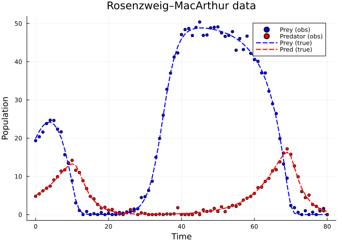
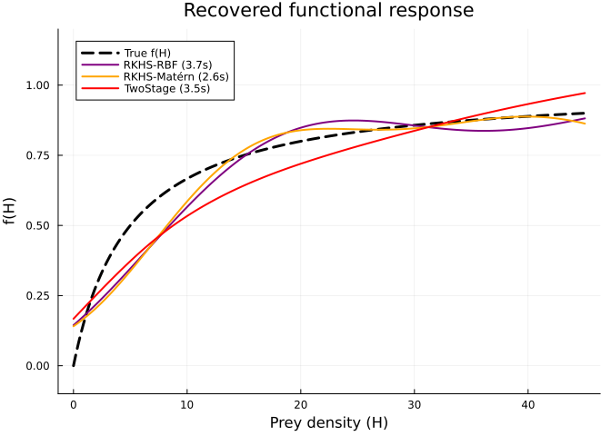
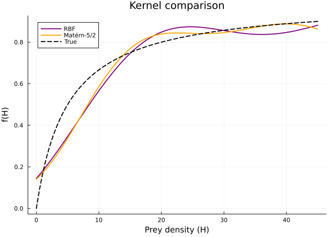
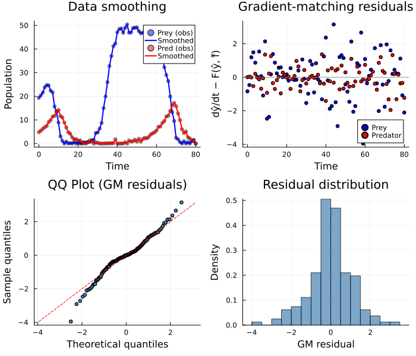

# RKHS: Reproducing Kernel Hilbert Space Estimation
Simon Frost
2026-06-12

- [Overview](#overview)
- [Setup](#setup)
- [Example: Rosenzweig–MacArthur with Unknown Functional
  Response](#example-rosenzweigmacarthur-with-unknown-functional-response)
  - [Fit with RKHS (RBF kernel)](#fit-with-rkhs-rbf-kernel)
  - [Fit with RKHS (Matérn-5/2 kernel)](#fit-with-rkhs-matérn-52-kernel)
  - [Compare with TwoStageSolver](#compare-with-twostagesolver)
  - [Recovered Functional Response](#recovered-functional-response)
  - [Error Comparison](#error-comparison)
- [Kernel Comparison](#kernel-comparison)
- [Diagnostic Plots](#diagnostic-plots)
- [How It Works](#how-it-works)
- [References](#references)

## Overview

The **RKHSSolver** estimates unknown functions using kernel ridge
regression with a Reproducing Kernel Hilbert Space (RKHS) norm penalty.
Unlike B-splines (which rely on knot placement) or neural networks
(which need architecture choices), RKHS methods use kernel functions to
define function smoothness in a principled, infinite-dimensional
function space.

**When to use RKHSSolver:**

- You want a kernel-based alternative to splines with automatic
  smoothness via the RKHS norm
- Your unknown function is very smooth (RBF kernel) or has limited
  differentiability (Matérn kernel)
- You want a nonparametric approach without explicit knot/basis
  placement

**Comparison with other nonparametric approaches:**

| Approach | Basis | Smoothness control | Constraints |
|----|:--:|:--:|:--:|
| BSpline + LAML | Local B-splines | Penalty on 2nd derivative | Shape constraints |
| GP (MAGI/ODIN) | Kernel | Lengthscale parameter | Prior on function space |
| Neural (UDE) | NN weights | Network width/depth | Hard to constrain |
| **RKHS** | Representer points | RKHS norm penalty | Via kernel choice |

## Setup

``` julia
using PartiallySpecifiedModels
using PartiallySpecifiedModels: solve
using OrdinaryDiffEq
using Plots
using Random
Random.seed!(123)
```

    TaskLocalRNG()

## Example: Rosenzweig–MacArthur with Unknown Functional Response

We consider a predator-prey system with logistic prey growth and an
unknown predator functional response $f(H)$:

$$\frac{dH}{dt} = rH\left(1 - \frac{H}{K}\right) - f(H)\,P, \quad \frac{dP}{dt} = \epsilon\,f(H)\,P - m\,P$$

where $r = 0.5$, $K = 50$, $\epsilon = 0.5$, $m = 0.3$. The true
functional response is **Holling Type II**: $f(H) = H/(5 + H)$.

``` julia
function rm!(du, u, p, t)
    H, P = u
    f_val = p.f(H)
    du[1] = 0.5*H*(1 - H/50) - f_val*P
    du[2] = 0.5*f_val*P - 0.3*P
end

f_true(H) = H / (5.0 + H)

function rm_true!(du, u, p, t)
    H, P = u
    f_val = H / (5.0 + H)
    du[1] = 0.5*H*(1 - H/50) - f_val*P
    du[2] = 0.5*f_val*P - 0.3*P
end

u0 = [20.0, 5.0]
sol_rm = OrdinaryDiffEq.solve(ODEProblem(rm_true!, u0, (0.0, 80.0)), Tsit5(); saveat=1.0)
t_data = collect(sol_rm.t)
rng = Random.Xoshiro(123)
data_rm = max.(hcat(
    [sol_rm.u[i][1] + 1.0*randn(rng) for i in 1:length(t_data)],
    [sol_rm.u[i][2] + 0.5*randn(rng) for i in 1:length(t_data)]), 0.01)

scatter(t_data, data_rm[:, 1], label="Prey (obs)", ms=3, color=:blue)
scatter!(t_data, data_rm[:, 2], label="Predator (obs)", ms=3, color=:red)
plot!(sol_rm.t, [sol_rm.u[i][1] for i in 1:length(sol_rm.t)],
    label="Prey (true)", lw=2, ls=:dash, color=:blue)
plot!(sol_rm.t, [sol_rm.u[i][2] for i in 1:length(sol_rm.t)],
    label="Pred (true)", lw=2, ls=:dash, color=:red,
    xlabel="Time", ylabel="Population", title="Rosenzweig–MacArthur data")
```



### Fit with RKHS (RBF kernel)

The RBF (Gaussian) kernel produces infinitely smooth functions. The
**lengthscale** is automatically set from the domain width when not
specified (default behaviour).

``` julia
approx_f = BSplineApproximator(:f, (0.0, 50.0), 8; initial=x -> x / 55.0)
prob = PSMProblem(rm!, u0, (0.0, 80.0), [approx_f];
    data_times=t_data, data_values=data_rm,
    obs_to_state=[1, 2],
    known_params=NamedTuple(), solver=Tsit5())

t_rbf = @elapsed sol_rbf = solve(prob,
    RKHSSolver(kernel=:rbf, n_repr_points=25,
               lambda_rkhs=0.01, maxiters=1000, lr=0.01, verbose=true))
println("\nTime: $(round(t_rbf, digits=1))s")
```

    RKHSSolver Stage 1: Smoothing data...
    RKHSSolver Stage 2: Building kernel representations...
      Auto lengthscale: ℓ=16.7 (domain span=50.0)
      25 kernel weights, 1000 iterations, λ=0.01
      iter 1: loss=611.08 lr=0.01
      iter 2: loss=476.34 lr=0.01
      iter 3: loss=434.01 lr=0.01
      iter 4: loss=401.09 lr=0.01
      iter 5: loss=359.16 lr=0.01
      iter 50: loss=214.85 lr=0.00994
      iter 100: loss=208.74 lr=0.00976
      iter 150: loss=203.8 lr=0.00946
      iter 200: loss=199.43 lr=0.00905
      iter 250: loss=195.87 lr=0.00854
      iter 300: loss=193.16 lr=0.00794
      iter 350: loss=191.17 lr=0.00727
      iter 400: loss=189.75 lr=0.00655
      iter 450: loss=188.76 lr=0.00578
      iter 500: loss=188.07 lr=0.005
      iter 550: loss=187.59 lr=0.00422
      iter 600: loss=187.26 lr=0.00345
      iter 650: loss=187.03 lr=0.00273
      iter 700: loss=186.87 lr=0.00206
      iter 750: loss=186.76 lr=0.00146
      iter 800: loss=186.69 lr=0.000955
      iter 850: loss=186.65 lr=0.000545
      iter 900: loss=186.62 lr=0.000245
      iter 950: loss=186.61 lr=6.16e-5
      iter 1000: loss=186.61 lr=0.0
      Best loss: 186.61

    Time: 3.7s

### Fit with RKHS (Matérn-5/2 kernel)

The Matérn-5/2 kernel produces twice-differentiable functions, allowing
more local variation than the RBF kernel.

``` julia
t_mat = @elapsed sol_mat = solve(prob,
    RKHSSolver(kernel=:matern52, n_repr_points=25,
               lambda_rkhs=0.01, maxiters=1000, lr=0.01, verbose=true))
println("\nTime: $(round(t_mat, digits=1))s")
```

    RKHSSolver Stage 1: Smoothing data...
    RKHSSolver Stage 2: Building kernel representations...
      Auto lengthscale: ℓ=16.7 (domain span=50.0)
      25 kernel weights, 1000 iterations, λ=0.01
      iter 1: loss=611.13 lr=0.01
      iter 2: loss=481.19 lr=0.01
      iter 3: loss=429.96 lr=0.01
      iter 4: loss=396.41 lr=0.01
      iter 5: loss=359.68 lr=0.01
      iter 50: loss=211.74 lr=0.00994
      iter 100: loss=197.67 lr=0.00976
      iter 150: loss=191.38 lr=0.00946
      iter 200: loss=189.0 lr=0.00905
      iter 250: loss=187.97 lr=0.00854
      iter 300: loss=187.33 lr=0.00794
      iter 350: loss=186.83 lr=0.00727
      iter 400: loss=186.43 lr=0.00655
      iter 450: loss=186.1 lr=0.00578
      iter 500: loss=185.84 lr=0.005
      iter 550: loss=185.63 lr=0.00422
      iter 600: loss=185.47 lr=0.00345
      iter 650: loss=185.35 lr=0.00273
      iter 700: loss=185.25 lr=0.00206
      iter 750: loss=185.19 lr=0.00146
      iter 800: loss=185.14 lr=0.000955
      iter 850: loss=185.11 lr=0.000545
      iter 900: loss=185.1 lr=0.000245
      iter 950: loss=185.09 lr=6.16e-5
      iter 1000: loss=185.09 lr=0.0
      Converged at iter 1000
      Best loss: 185.09

    Time: 2.6s

### Compare with TwoStageSolver

For comparison, we fit using the `TwoStageSolver`, which first estimates
derivatives from smoothed data, then solves a penalised regression for
the unknown function, and finally re-integrates the ODE.

``` julia
t_ts = @elapsed sol_ts = solve(prob,
    TwoStageSolver(maxiters=100, verbose=false))
println("TwoStage time: $(round(t_ts, digits=1))s")
```

    TwoStage time: 3.5s

### Recovered Functional Response

``` julia
H_grid = range(0.0, 45.0, length=200)
f_true_vals = [f_true(H) for H in H_grid]

plot(H_grid, f_true_vals, label="True f(H)", lw=3, color=:black, ls=:dash,
    xlabel="Prey density (H)", ylabel="f(H)",
    title="Recovered functional response", ylim=(-0.1, 1.2))
plot!(H_grid, [sol_rbf.unknown_functions[:f](H) for H in H_grid],
    label="RKHS-RBF ($(round(t_rbf, digits=1))s)", lw=2, color=:purple)
plot!(H_grid, [sol_mat.unknown_functions[:f](H) for H in H_grid],
    label="RKHS-Matérn ($(round(t_mat, digits=1))s)", lw=2, color=:orange)
plot!(H_grid, [sol_ts.unknown_functions[:f](H) for H in H_grid],
    label="TwoStage ($(round(t_ts, digits=1))s)", lw=2, color=:red)
```



### Error Comparison

``` julia
H_eval = range(1.0, 40.0, length=50)
true_vals = [f_true(H) for H in H_eval]

mae_rbf = sum(abs.([sol_rbf.unknown_functions[:f](H) for H in H_eval] .- true_vals)) / length(H_eval)
mae_mat = sum(abs.([sol_mat.unknown_functions[:f](H) for H in H_eval] .- true_vals)) / length(H_eval)
mae_ts = sum(abs.([sol_ts.unknown_functions[:f](H) for H in H_eval] .- true_vals)) / length(H_eval)

println("Mean absolute error over [1, 40]:")
println("  RKHS-RBF:    $(round(mae_rbf, digits=4))")
println("  RKHS-Matérn: $(round(mae_mat, digits=4))")
println("  TwoStage:    $(round(mae_ts, digits=4))")
```

    Mean absolute error over [1, 40]:
      RKHS-RBF:    0.0546
      RKHS-Matérn: 0.0415
      TwoStage:    0.0701

## Kernel Comparison

The choice of kernel determines the smoothness properties of the
estimated function:

- **RBF (Gaussian) kernel**: $k(x, x') = \exp(-\|x - x'\|^2 / 2\ell^2)$
  — infinitely differentiable functions; very smooth estimates
- **Matérn-5/2 kernel**:
  $k(x, x') = (1 + \sqrt{5}r/\ell + 5r^2/3\ell^2) \exp(-\sqrt{5}r/\ell)$
  — twice-differentiable functions; allows slightly more local variation

``` julia
plot(H_grid, [sol_rbf.unknown_functions[:f](H) for H in H_grid],
    label="RBF", lw=2, color=:purple,
    xlabel="Prey density (H)", ylabel="f(H)",
    title="Kernel comparison")
plot!(H_grid, [sol_mat.unknown_functions[:f](H) for H in H_grid],
    label="Matérn-5/2", lw=2, color=:orange)
plot!(H_grid, f_true_vals, label="True", lw=2, color=:black, ls=:dash)
```



## Diagnostic Plots

Gradient-matching methods fit derivatives from smoothed data rather than
integrating the ODE directly. The natural diagnostics are: (1) the
smoothed states vs observations, and (2) the **gradient-matching
residuals** — the difference between the estimated derivatives from the
data and the model derivatives computed with the fitted unknown
function.

``` julia
using Distributions

# Recompute smoothed data and derivatives via PartiallySpecifiedModels' DataInterpolations
itp_H = PartiallySpecifiedModels.CubicSpline(data_rm[:, 1], t_data;
    extrapolation=PartiallySpecifiedModels.DataInterpolations.ExtrapolationType.Extension)
itp_P = PartiallySpecifiedModels.CubicSpline(data_rm[:, 2], t_data;
    extrapolation=PartiallySpecifiedModels.DataInterpolations.ExtrapolationType.Extension)
y_H = [itp_H(t) for t in t_data]
y_P = [itp_P(t) for t in t_data]
dydt_H = [PartiallySpecifiedModels.DataInterpolations.derivative(itp_H, t) for t in t_data]
dydt_P = [PartiallySpecifiedModels.DataInterpolations.derivative(itp_P, t) for t in t_data]

# Model derivatives using fitted UF
f_fit = sol_rbf.unknown_functions[:f]
model_dH = [0.5*y_H[i]*(1 - y_H[i]/50) - f_fit(y_H[i])*y_P[i] for i in 1:length(t_data)]
model_dP = [0.5*f_fit(y_H[i])*y_P[i] - 0.3*y_P[i] for i in 1:length(t_data)]

gm_resid_H = dydt_H .- model_dH
gm_resid_P = dydt_P .- model_dP
all_resid = vcat(gm_resid_H, gm_resid_P)

# Smoothed states vs observations
p1 = scatter(t_data, data_rm[:, 1], label="Prey (obs)", ms=3, color=:blue, alpha=0.5)
plot!(p1, t_data, y_H, label="Smoothed", lw=2, color=:blue)
scatter!(p1, t_data, data_rm[:, 2], label="Pred (obs)", ms=3, color=:red, alpha=0.5)
plot!(p1, t_data, y_P, label="Smoothed", lw=2, color=:red,
    xlabel="Time", ylabel="Population", title="Data smoothing")

# Gradient matching residuals over time
p2 = scatter(t_data, gm_resid_H, label="Prey", ms=3, color=:blue)
scatter!(p2, t_data, gm_resid_P, label="Predator", ms=3, color=:red,
    xlabel="Time", ylabel="dŷ/dt − F(ŷ, f̂)",
    title="Gradient-matching residuals")
hline!(p2, [0], color=:gray, ls=:dot, label=false)

# QQ plot of gradient-matching residuals
qq_theor = quantile.(Normal(), range(1, length(all_resid)) ./ (length(all_resid) + 1))
qq_sample = sort(all_resid)
p3 = scatter(qq_theor, qq_sample,
    xlabel="Theoretical quantiles", ylabel="Sample quantiles",
    title="QQ Plot (GM residuals)", ms=3, legend=false, color=:steelblue)
mn, mx = extrema(vcat(qq_theor, qq_sample))
plot!(p3, [mn, mx], [mn, mx], color=:red, ls=:dash)

# Histogram
p4 = histogram(all_resid, normalize=:pdf,
    xlabel="GM residual", ylabel="Density",
    title="Residual distribution", legend=false, color=:steelblue, alpha=0.7)

plot(p1, p2, p3, p4, layout=(2, 2), size=(700, 600))
```



## How It Works

The RKHS approach represents the unknown function using the
**representer theorem**: any optimal function in an RKHS can be written
as a finite linear combination of kernel evaluations at representative
points:

$$\hat{f}(x) = \sum_{j=1}^{m} \alpha_j k(x, x_j)$$

where $\{x_j\}$ are representative points spread across the domain, and
$k(\cdot, \cdot)$ is the chosen kernel function.

The coefficients $\alpha_j$ are optimised by minimising a
gradient-matching loss with RKHS norm penalty:

$$\mathcal{L} = \underbrace{\sum_i \sum_{k \in \text{obs}} \left(\dot{y}_k(t_i) - F_k(\mathbf{y}(t_i), \hat{f})\right)^2}_{\text{gradient matching}} + \lambda_{\text{RKHS}} \underbrace{\boldsymbol{\alpha}^\top K \boldsymbol{\alpha}}_{\text{RKHS norm}}$$

where $\dot{y}_k$ are estimated derivatives from smoothed data, $F_k$ is
the $k$-th component of the dynamical system, and $K_{jk} = k(x_j, x_k)$
is the kernel Gram matrix. The RKHS norm penalty
$\|\hat{f}\|_{\mathcal{H}}^2 = \boldsymbol{\alpha}^\top K \boldsymbol{\alpha}$
controls smoothness.

**Key implementation details:**

- The lengthscale is auto-scaled from the domain width (domain_span / 3)
  when not specified
- Only observed states contribute to the gradient-matching loss
- Kernel weights are initialised from the approximator’s initial
  function values
- Adam optimiser with cosine learning rate annealing

## References

- Wahba, G. (1990). *Spline Models for Observational Data*. SIAM.
- Schölkopf, B. & Smola, A. J. (2002). *Learning with Kernels*. MIT
  Press.
- González, J. et al. (2014). Reproducing Kernel Hilbert Space Based
  Estimation of Systems of Ordinary Differential Equations. *Pattern
  Recognition Letters*.
