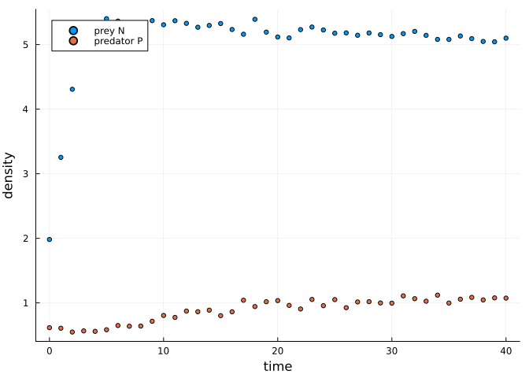
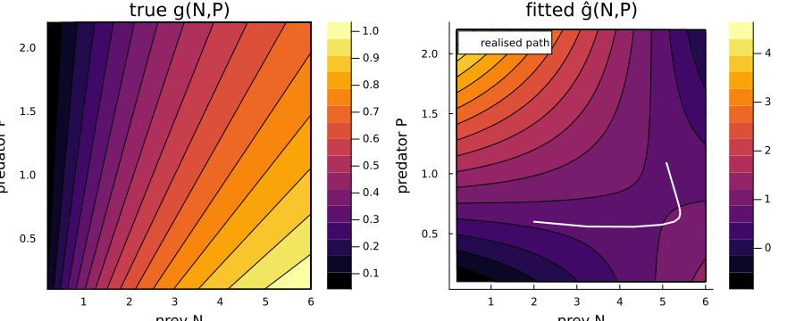
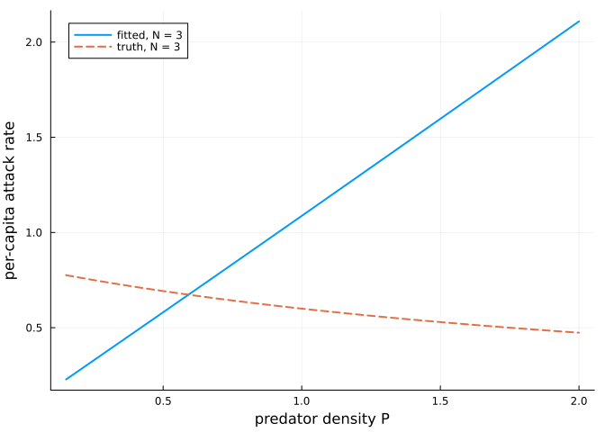

# Bivariate Interaction Surfaces
Simon Frost
2026-09-01

- [Overview](#overview)
- [A predator–prey system with
  interference](#a-predatorprey-system-with-interference)
- [Fitting the surface](#fitting-the-surface)
- [Judge the surface where the data actually
  go](#judge-the-surface-where-the-data-actually-go)
- [Interference actually matters](#interference-actually-matters)
- [When to use
  `TensorBSplineApproximator`](#when-to-use-tensorbsplineapproximator)
- [References](#references)

## Overview

Every other approximator in this package stands in for a function of
**one** argument. `TensorBSplineApproximator` stands in for a function
of **two**:

$$g(x, y) = \sum_{i=1}^{k_x} \sum_{j=1}^{k_y} \beta_{ij} \, B_i(x) \, B_j(y)$$

with a **Kronecker-sum penalty** — a second-difference penalty along
each margin, added — so a single smoothing parameter $\lambda$ controls
the roughness of the whole surface. The `anisotropy` keyword sets the
fixed relative weight of $y$-roughness against $x$-roughness.

The ecological motivation is that many interaction rates are not
functions of one density. A predator’s per-capita attack rate falls as
prey become harder to handle (satiation) **and** as conspecifics get in
the way (interference). Writing that as $g(N)$ forces the modeller to
decide in advance that interference does not matter; a tensor smooth
does not.

``` julia
using PartiallySpecifiedModels
using OrdinaryDiffEq
using Plots; default(fmt=:png)
using Random
Random.seed!(42)
```

    TaskLocalRNG()

## A predator–prey system with interference

The truth couples satiation and interference in the denominator:

$$g(N, P) = \frac{0.6\,N}{1 + 0.4\,N + 0.8\,P}$$

``` julia
g_true(N, P) = 0.6 * N / (1.0 + 0.4N + 0.8P)

function pp_true!(du, u, p, t)
    N, P = u
    graze = g_true(N, P) * P
    du[1] = 1.1N * (1 - N / 6.0) - graze
    du[2] = 0.45 * graze - 0.35P
end

st = solve(ODEProblem(pp_true!, [2.0, 0.6], (0.0, 40.0)), Tsit5(); saveat=1.0)
Y = hcat([u[1] for u in st.u], [u[2] for u in st.u]) .+ 0.05 .* randn(length(st.t), 2)
plot(st.t, Y, label=["prey N" "predator P"], xlabel="time", ylabel="density",
     lw=2, seriestype=:scatter, ms=3)
```



## Fitting the surface

In the dynamics the unknown is called with **two** arguments:

``` julia
function pp!(du, u, p, t)
    N, P = u
    graze = p.g(N, P) * P            # bivariate unknown
    du[1] = 1.1N * (1 - N / 6.0) - graze
    du[2] = 0.45 * graze - 0.35P
end

approx = TensorBSplineApproximator(:g, (0.0, 6.5), (0.0, 2.5), 4, 4;
                                   initial = (N, P) -> 0.3N)
prob = PSMProblem(pp!, [2.0, 0.6], (0.0, 40.0), [approx];
    data_times=collect(st.t), data_values=Y, obs_to_state=[1, 2],
    known_params=NamedTuple(), likelihood=Gaussian(), solver=Tsit5())

sol = solve(prob, LAML(maxiters=40, verbose=false))
(; data_loss=sol.data_loss, edf=sol.edf,
   converged=sol.convergence.converged)
```

    (data_loss = 0.20481606236233083, edf = 4.267575651318284, converged = true)

`4, 4` knots per margin is 16 coefficients. That is a lot to ask of 41
observations, and it is worth being deliberate: a bivariate smooth has
$k_x \times k_y$ coefficients, so knot counts that feel modest per
margin multiply quickly.

## Judge the surface where the data actually go

This is the part that matters, and it is easy to get wrong. The state
follows a **trajectory** — a curve through the $(N, P)$ plane, not a
filled region. The surface is identified only where that curve goes.
Scoring the fit on a full rectangular grid measures extrapolation into
corners the system never enters, and will make any honest fit look bad.

``` julia
ghat = sol.unknown_functions[:g]
visited = [(u[1], u[2]) for u in st.u]
errs = [abs(ghat(N, P) - g_true(N, P)) for (N, P) in visited]
(; max_error_on_path = maximum(errs), mean_error_on_path = sum(errs)/length(errs))
```

    (max_error_on_path = 0.0825769441679115, mean_error_on_path = 0.009700277979629059)

``` julia
Ns = range(0.2, 6.0, length=60)
Ps = range(0.1, 2.2, length=60)
p1 = contour(Ns, Ps, (N, P) -> g_true(N, P), fill=true, title="true g(N,P)",
             xlabel="prey N", ylabel="predator P")
p2 = contour(Ns, Ps, (N, P) -> ghat(N, P), fill=true, title="fitted ĝ(N,P)",
             xlabel="prey N", ylabel="predator P")
plot!(p2, [u[1] for u in st.u], [u[2] for u in st.u], lw=2, c=:white,
      label="realised path")
plot(p1, p2, layout=(1,2), size=(900,360))
```



The white curve is the realised trajectory. Agreement is close along it
and degrades away from it — which is the correct behaviour, not a
defect.

## Interference actually matters

A slice at fixed prey density shows the predator dependence the
univariate form would have assumed away:

``` julia
Pgrid = range(0.15, 2.0, length=50)
plot(Pgrid, [ghat(3.0, P) for P in Pgrid], lw=2, label="fitted, N = 3")
plot!(Pgrid, [g_true(3.0, P) for P in Pgrid], lw=2, ls=:dash, label="truth, N = 3")
xlabel!("predator density P"); ylabel!("per-capita attack rate")
```



## When to use `TensorBSplineApproximator`

- The rate plausibly depends on **two** state variables and you do not
  want to commit to a functional form for either.
- You have enough data: coefficients grow as $k_x \times k_y$.
- You can accept that the surface is identified only near the realised
  trajectory. Check it there, and treat values far from the path as
  extrapolation.

If the response really is a function of one *combination* of the two
arguments, `SingleIndexApproximator` is the cheaper rank-1 restriction —
see the single-index vignette, which uses this same predator–prey
system.

## References

- Wood, S.N. (2017). *Generalized Additive Models: An Introduction with
  R*, 2nd ed. Chapman & Hall/CRC. (Tensor-product smooths and their
  penalties.)
