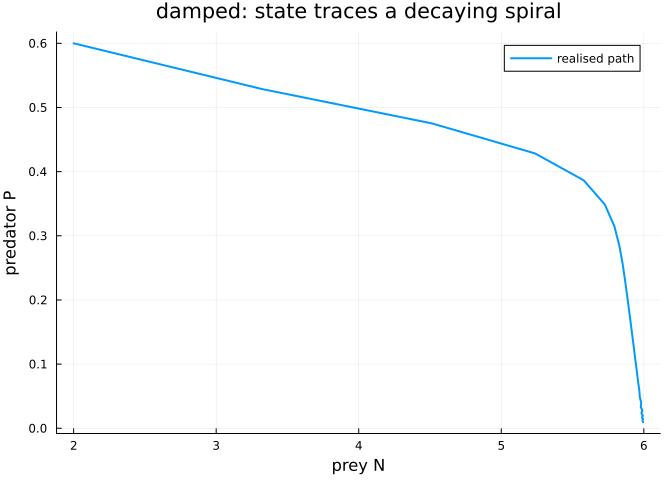

# Single-Index Responses
Simon Frost
2026-09-01

- [Overview](#overview)
- [The system](#the-system)
- [Case 1: a system that settles](#case-1-a-system-that-settles)
- [Case 2: a system that cycles](#case-2-a-system-that-cycles)
- [What to take from this](#what-to-take-from-this)
- [References](#references)

## Overview

`SingleIndexApproximator` is the **rank-1 restriction** of a
multivariate response. Instead of a free surface $g(x_1, x_2)$ it fits

$$g(x_1, x_2) = f(a_1 x_1 + a_2 x_2)$$

— one smooth function $f$ of one linear combination. Both the loadings
$a$ and the shape $f$ are estimated. The saving is severe: a
$4 \times 4$ tensor surface costs 16 coefficients, while a single index
costs 8 outer coefficients plus a direction.

The price is an assumption: that the two drivers act only through one
combination. This vignette uses the **same predator–prey system** as the
tensor-smooth vignette so the two can be read side by side, and spends
most of its length on the question that decides whether the loadings
mean anything — **identifiability**.

``` julia
using PartiallySpecifiedModels
using OrdinaryDiffEq
using Plots; default(fmt=:png)
using Random
using LinearAlgebra
```

## The system

``` julia
a_unit = [0.6, 0.8]                 # unit-norm truth
a_anch = a_unit ./ a_unit[1]        # anchored convention: [1.0, 1.333]
g_true(N, P) = 0.55 * tanh(1.2 * (a_unit[1]*N + a_unit[2]*P) - 0.9)
a_anch
```

    2-element Vector{Float64}:
     1.0
     1.3333333333333335

`index_loadings` returns the **anchored** convention — the first
non-negligible loading scaled to 1 — unless the approximator was built
with `anchor=nothing`, in which case they come back unit-norm. Compare
like with like: the truth $[0.6, 0.8]$ is $[1.0, 1.333]$ anchored.

``` julia
function run_case(eff, mort, tmax, dt; seed=11)
    Random.seed!(seed)
    f!(du, u, p, t) = begin
        N, P = u; graze = g_true(N, P) * P
        du[1] = 1.1N * (1 - N / 6.0) - graze
        du[2] = eff * graze - mort * P
    end
    st = solve(ODEProblem(f!, [2.0, 0.6], (0.0, tmax)), Tsit5(); saveat=dt)
    Y = hcat([u[1] for u in st.u], [u[2] for u in st.u]) .+ 0.05 .* randn(length(st.t), 2)
    dyn!(du, u, p, t) = begin
        N, P = u; graze = p.g(N, P) * P
        du[1] = 1.1N * (1 - N / 6.0) - graze
        du[2] = eff * graze - mort * P
    end
    prob = PSMProblem(dyn!, [2.0, 0.6], (0.0, tmax),
        [SingleIndexApproximator(:g, 2, 8; xi=2.5, initial = z -> 0.2z)];
        data_times=collect(st.t), data_values=Y, obs_to_state=[1, 2],
        known_params=NamedTuple(), likelihood=Gaussian(), solver=Tsit5())
    sol = solve(prob, LAML(maxiters=150, warmup=8, verbose=false))
    Ns = [u[1] for u in st.u]; Ps = [u[2] for u in st.u]
    mN, mP = sum(Ns)/length(Ns), sum(Ps)/length(Ps)
    r = sum((Ns.-mN).*(Ps.-mP)) / sqrt(sum((Ns.-mN).^2)*sum((Ps.-mP).^2))
    gh = sol.unknown_functions[:g]
    (; st, Y, sol,
       cor_np = r,
       loadings = index_loadings(prob.approximators[1], sol.parameters.g),
       max_err = maximum(abs(gh(N, P) - g_true(N, P)) for (N, P) in zip(Ns, Ps)))
end
```

    run_case (generic function with 1 method)

## Case 1: a system that settles

``` julia
damped = run_case(0.45, 0.35, 40.0, 1.00)
(; data_loss = damped.sol.data_loss, edf = damped.sol.edf,
   converged = damped.sol.convergence.converged,
   cor_NP = damped.cor_np, loadings = damped.loadings,
   max_error_on_path = damped.max_err)
```

    (data_loss = 0.19756244231873787, edf = 0.0009159625420780426, converged = true, cor_NP = -0.7826352965448188, loadings = [1.0, 3.728100970705223e-16], max_error_on_path = 0.09474982552224837)

The **fit is excellent**: 41 points on two states at noise 0.05 puts the
noise floor near $82 \times 0.05^2 = 0.205$, and `data_loss` sits
essentially on it. The recovered function tracks the truth along the
path to about 0.09.

The **loadings, however, have collapsed to $[1, 0]$** — all weight on
prey, none on predator, against a truth of $[1, 1.333]$.

Notice also that the effective dimension is essentially **zero**: the
outer smooth has been penalized back to its null space, i.e. to a
straight line in the index. A linear $f$ makes matters worse still,
because then only the *product* of the slope and the loadings is
determined — scale can move freely between them.

That is not a solver failure. It is the geometry. The state of an ODE
traces a **curve** through the $(N,P)$ plane, and along a curve where
$N$ and $P$ move together ($\mathrm{cor} = -0.78$ here) many different
directions produce nearly the same sequence of index values. The data
cannot separate them.

``` julia
plot([u[1] for u in damped.st.u], [u[2] for u in damped.st.u],
     lw=2, label="realised path", xlabel="prey N", ylabel="predator P",
     title="damped: state traces a decaying spiral")
```



## Case 2: a system that cycles

Sustained cycles trace a **loop**, so the same prey density recurs at
two different predator densities — which is exactly what it takes to
tell the directions apart:

``` julia
cycling = run_case(0.55, 0.22, 60.0, 0.75)
(; data_loss = cycling.sol.data_loss, edf = cycling.sol.edf,
   converged = cycling.sol.convergence.converged,
   cor_NP = cycling.cor_np, loadings = cycling.loadings,
   max_error_on_path = cycling.max_err)
```

    (data_loss = 41.679681193047706, edf = 6.157291480074826, converged = true, cor_NP = -0.6707806094506928, loadings = [1.0, 0.8401768498596367], max_error_on_path = 2.56282336728727)

The second loading is now clearly non-zero — the direction is being
identified. But read the rest of the row before celebrating: the
correlation only fell from $-0.78$ to $-0.67$, and on this harder,
longer series the fit itself is **much worse**. The fit converged; it
simply converged somewhere poor. Loadings read off a bad fit are not
evidence of anything.

## What to take from this

- **A good fit does not imply interpretable loadings.** Case 1 recovers
  $g$ along the trajectory to 0.09 while reporting a direction that is
  qualitatively wrong. If you only want the *response*, that fit is
  fine. If you want to say “prey density matters more than predator
  density”, it is not.
- **Check the correlation of the index arguments** along the realised
  trajectory before interpreting a direction. It is two lines of code
  and it is the difference between a claim and an artefact.
- Replicate trajectories from different initial conditions, or genuinely
  independent drivers, are the real fix; a single trajectory through a
  correlated state space will not identify a direction however long you
  run it.

If you need the response but not the direction, and can afford the
coefficients, `TensorBSplineApproximator` makes no rank-1 assumption at
all.

## References

- Härdle, W., Hall, P. & Ichimura, H. (1993). Optimal smoothing in
  single-index models. *Annals of Statistics* 21(1):157–178.
- Yu, Y. & Ruppert, D. (2002). Penalized spline estimation for partially
  linear single-index models. *JASA* 97(460):1042–1054.
